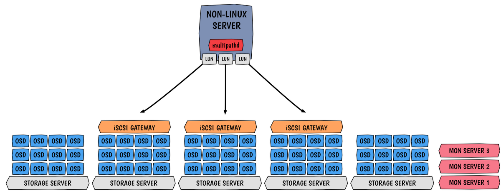

Just like promised last Monday, this article is the first of a series of informative blog posts about incoming Ceph features. Today, I’m cheating a little bit because I will decrypt one particular feature that went a bit unnoticed with Jewel. So we are discussing something that is already available but will have follow-ups with new Ceph releases. The feature doesn’t really have a name but it’s along the line of having an iSCSI support with the RBD protocol. With that, we can connect Ceph storage to hypervisors and/or operating systems that don’t have a native Ceph support but understand iSCSI. Technically speaking this targets non-Linux users who can not use `librbd` with QEMU or `krbd` directly.

## I. Rationale

Before diving into this, let’s take a little step back with a bit of history. I’m not sure if you remember but a couple of years ago, I was testing the initial implementation of [RBD and TGT](http://www.sebastien-han.fr/blog/2014/07/07/start-with-the-rbd-support-for-tgt/). After a couple of months of testing by community users, it came out that this early prototype was lacking features and robustness, thus making it unsuitable for enterprises demand. Enterprises require advanced features such as high availability with multipath, persistent reservation, low latency, high throughput, parallelism and strong authentication methods. All those things could not be achieved by TGT. As a result, work has now started on the LIO target in the Linux kernel to provide HA capabilities. LIO is a multi-protocol in-kernel SCSI target, unlike other targets like IET, TGT, and SCST, LIO is entirely kernel code.

## II. Alphabet soup

iSCSI is full of concept and unique words, so let me explain some of them:

- Target (server) is the endpoint that does not initiate sessions, but instead, waits for initiators’ commands and provides required input/output data transfers. [Thanks, Wikipedia](https://en.wikipedia.org/wiki/SCSI_initiator_and_target).
- Initiator (client) is the endpoint that initiates a SCSI session, that is, sends a SCSI command. [Thanks, Wikipedia](https://en.wikipedia.org/wiki/SCSI_initiator_and_target).
- LUN: network block device mapped on the server.
- Multipath: LUN HA and balancing model.

## III. LIO and RBD

This functionality relies on multiple software stacks.

As we can see on the picture, we privilege gateways collocation on the OSD servers. In the example, I use 3 gateways, but you can do more. Generally, controllers support up to 8 gateways, which is already a lot. As shown, each LUN is mapped to a particular target (gateway), this is due to the use of multipath active/passive ALUA. ALUA is basically set of SCSI concepts and commands that define path prioritization for SCSI devices. Load balancing is handled at the creation time of the LUN, active paths are automatically balanced across gateways.

### III.1. High availability

High availability is accomplished with the help of RBD locking (exclusive lock feature), Ceph’s watch notify feature and the initiator’s multipathing stack. Multipath allows us to detect a failure and reroute affected IOs through a path on a different target. Native HA is obtained by deploying multiple collocated iSCSI target on OSD nodes, so the initiator knows all the gateways and accordingly forwards IO through a preferred one. As we use ALUA, all targets are active and can accept IOs however each LUN has a favored target that is used.

### III.2. Handling failures

As explained above, it’s all about the initiator (on the client side). Once a gateway is down, a path failover is performed by the initiator. Thus, in-flight I/O will typically pause for a couple of seconds before the system declares the path dead and retries I/O to one of the other gateways. Since we currently use ALUA active/passive the failover can’t be instant, for this an active/active setup is expected.

### III.3. Authentication

The connection from an initiator to a target needs to be handled by an authentication mechanism. Currently only CHAP is covered (and obviously no auth), this is the method configured by the Ansible installer. I’m not really well versed into CHAP so I’ll encourage you to [read the Wikipedia article](https://en.wikipedia.org/wiki/Challenge-Handshake_Authentication_Protocol).

## IV. Deployment

Presently targets can be deployed and configured with the help of this [Ansible role](https://github.com/pcuzner/ceph-iscsi-ansible). Soon this work will be merged in [ceph-ansible](https://github.com/ceph/ceph-ansible).

## V. Upcoming work

The current LIO iblock + krbd iSCSI implementation has some limitations:

- Limited to Active/Passive (ALUA active optimized/active non-optimized) because of RBD exclusive lock feature
- Eventual support for PGRs will require many new callouts and hooks into the block layer
- Kernel development only, so unless you’re Red Hat, SUSE or someone constantly upgrading your Kernel to the last one, it’s tough to deliver a solution

That is why developers are currently investigating switching to an LIO tcmu + librbd iSCSI. TCM is another name of LIO, which is kernel space. TCMU is an userland implementation for TCM (thanks Andy Grover!). TCMU is the LIO `target_core_user` kernel module that passes SCSI commands to userspace and `tcmu-runner` is the userspace component that processes those commands and passes them to drivers for device specific execution. `tcmu-rbd` is the `tcmu-runner` driver that converts SCSI commands to ceph/rbd requests.

Using a userspace component brings numerous benefits like:

- No kernel code needed
- Easier to ship the software
- Focus on your own backend, in our case RBD

  

> All those new things are really exacting, particularly the tcmu potential switch. I’ll write a dedicated article for TCMU and how it plays an important role in container storage soon ;-).

Source: Sebastian Han ([Ceph RBD and iSCSI](https://sebastien-han.fr/blog/2017/01/05/Ceph-RBD-and-iSCSI/))
