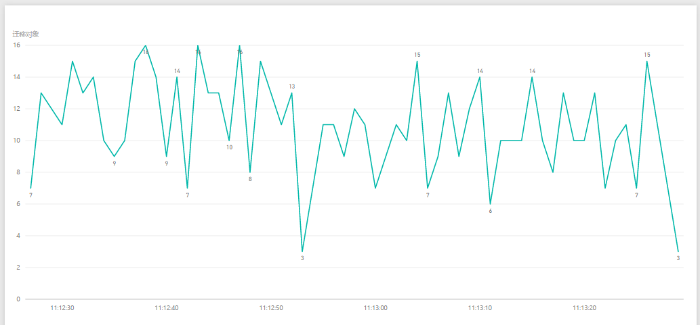
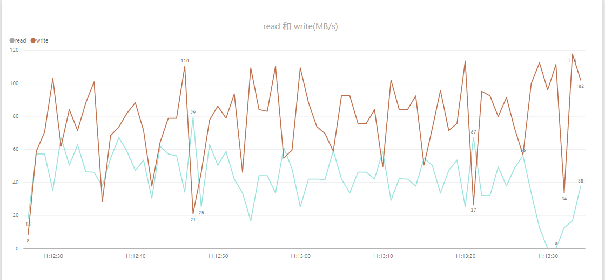
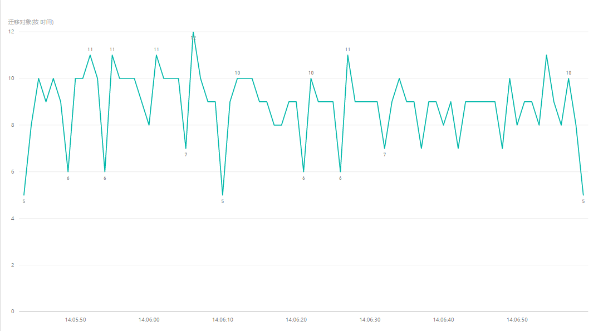
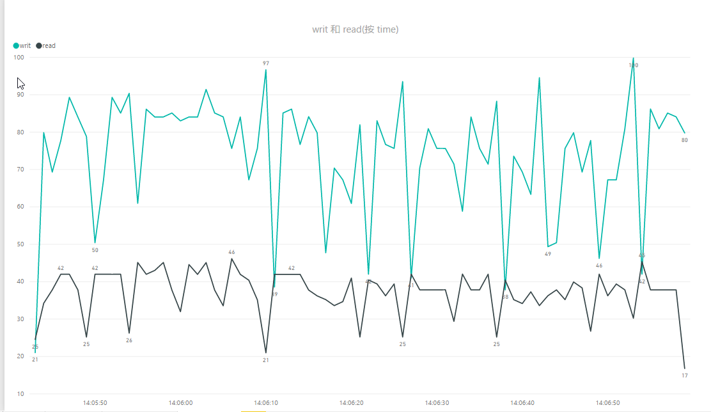
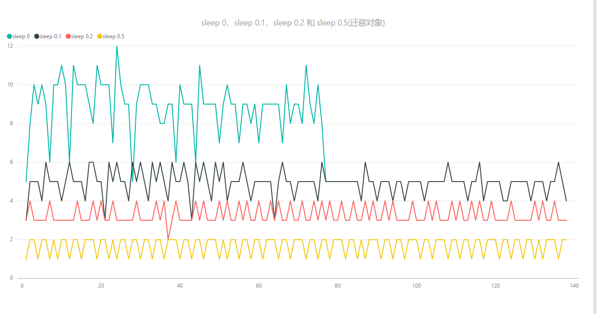
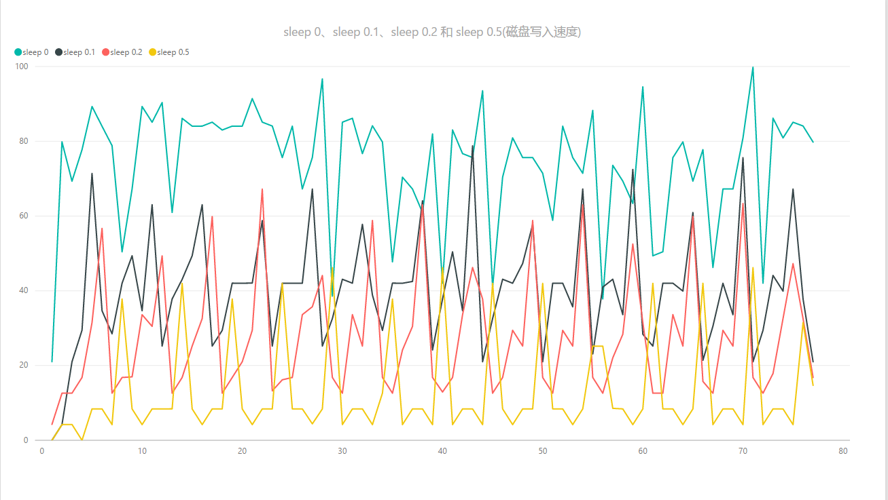

  
  

## 前言

磁盘损坏对于一个大集群来说，可以说是必然发生的事情，即使再小的概率，磁盘量上去，总会坏那么几块盘，这个时候就会触发内部的修复过程，修复就是让不满足副本要求的PG，恢复到满足的情况  
  
一般是踢掉坏盘和增加新盘会触发这个修复过程，或者对磁盘的权重做了修改，也会触发这个迁移的过程，本篇是用剔除OSD的方式来对这个修复的控制做一个探索

大部分场景下要求的是不能影响前端的业务，而加速迁移，忽略迁移影响不在本篇的讨论范围内，本篇将用数据来说明迁移的控制

本次测试在无读写情况下进程的

## 几个需要用到脚本和命令

### 磁盘本身的大概速度

<table><tbody><tr><td class="code"><pre>[root@lab8106 ~]# ceph tell osd.0 bench {     "bytes_written": 1073741824,     "blocksize": 4194304,     "bytes_per_sec": 102781897 } </pre></td></tr></tbody></table>

得到的结果为102MB/s

### 获取osd上pg迁移的对象的脚本

OSD的日志需要开启到10，这里采取动态开启的方式  

<table><tbody><tr><td class="code"><pre>ceph daemon osd.0 config set debug_osd 10 </pre></td></tr></tbody></table>

日志解析的脚本  

<table><tbody><tr><td class="code"><pre>cat  /var/log/ceph/ceph-osd.0.log | awk  '$7=="finish_recovery_op"&amp;&amp;$8=="pg[0.15(" {sub(/.*/,substr($2,1,8),$2); print $0}'|awk '{a[$1," ",$2]++}END{for (j in a) print j,a[j]|"sort -k 1"}' </pre></td></tr></tbody></table>

获取osd.0上的pg0.15的迁移速度  
运行后的效果如下：  

<table><tbody><tr><td class="code"><pre>2017-08-08 17:14:33 1 2017-08-08 17:14:34 2 2017-08-08 17:14:35 2 2017-08-08 17:14:36 1 2017-08-08 17:14:37 2 2017-08-08 17:14:38 2 2017-08-08 17:14:39 1 2017-08-08 17:14:40 2 2017-08-08 17:14:41 1 2017-08-08 17:14:42 2 2017-08-08 17:14:43 2 </pre></td></tr></tbody></table>

### 设置不迁移和恢复迁移

<table><tbody><tr><td class="code"><pre>ceph osd set nobackfill;ceph osd set norecover ceph osd unset nobackfill;ceph osd unset norecover </pre></td></tr></tbody></table>

获取当前的正在迁移的PG  

<table><tbody><tr><td class="code"><pre>[root@lab8106 ~]# ceph pg dump|grep recovering dumped all 3.e         513                  0      978         0       0 2151677952 513      513    active+recovering+degraded 2017-08-07 16:40:44.840780 118'513  332:7367 [2,3]          2  [2,3]              2        0'0 2017-07-28 14:28:53.351664             0'0 2017-07-28 14:28:53.351664  3.2c        522                  0      996         0       0 2189426688 522      522    active+recovering+degraded 2017-08-07 16:40:44.882450 118'522  332:1177 [3,2]          3  [3,2]              3    118'522 2017-07-29 16:21:56.398682             0'0 2017-07-28 14:28:53.351664 </pre></td></tr></tbody></table>

过滤下输出结果  

<table><tbody><tr><td class="code"><pre>[root@lab8106 ~]# ceph pg dump|grep recovering|awk '{print $1,$2,$4,$10,$15,$16,$17,$18}' dumped all in format plain 0.1d 636 1272 active+recovering+degraded [5,3] 5 [5,3] 5 0.14 618 1236 active+recovering+degraded [1,0] 1 [1,0] 1 0.15 682 1364 active+recovering+degraded [0,5] 0 [0,5] 0 0.35 661 1322 active+recovering+degraded [2,1] 2 [2,1] 2 </pre></td></tr></tbody></table>

动态监控PG的迁移  

<table><tbody><tr><td class="code"><pre>watch -n 1 -d "ceph pg dump|grep recovering|awk '{print ,,,,,,,}'" </pre></td></tr></tbody></table>

我们要看PG 0.15的

### 防止缓存影响

同步数据然后清空缓存  

<table><tbody><tr><td class="code"><pre>sync echo 3 &gt; /proc/sys/vm/drop_caches </pre></td></tr></tbody></table>

重启OSD进程  

<table><tbody><tr><td class="code"><pre>systemctl restart ceph-osd.target </pre></td></tr></tbody></table>

### 磁盘的读写速度

<table><tbody><tr><td class="code"><pre>dstat -td -D /dev/sdb -o disk.csv </pre></td></tr></tbody></table>

sdb为需要监控的盘

## 测试的步骤与流程

整个测试需要保证每一次获取数据的过程都近似，这样才能最大程度减少环境对数据的影响

开始需要写入一些测试数据，这个可以用  

<table><tbody><tr><td class="code"><pre>rados -p rbd bench 3600 --no-cleanup </pre></td></tr></tbody></table>

这个让每个PG上面大概有600-700个object，写入这个数据后就不再写入数据了

每一轮测试步骤如下：

1. 恢复集群状态为active+clean
2. 设置nobackfill，norecover
3. 清空缓存
4. 设置需要调整的参数
5. 重启osd进程
6. 停止osd，out osd
7. 观察需要迁移的数据（尽量每次监测同一个PG）
8. 清空日志，设置OSD debug 10
9. 开启监控磁盘脚本
10. 解除设置nobackfill，norecover
11. 动态监控迁移状态，等待指定PG迁移完毕
12. 停止磁盘监控脚本
13. 获取PG迁移的情况，获取磁盘的读写情况
14. 数据处理

每一轮测试需要按上面的步骤进行处理

## 测试分析

我的测试选择的是osd.4,按上面的步骤进行处理后，到了观察PG的步骤，此时因为做了不迁移的标记，只会状态改变，不会真正的迁移 我们来观察下需要迁移的pg  
默认情况下的  

<table><tbody><tr><td class="code"><pre>[root@lab8106 ~]# ceph pg dump|grep recovering|awk '{print $1,$2,$10,$15,$16,$17,$18}' dumped all in format plain 0.15 682 active+recovering+degraded [0,5] 0 [0,5] 0 0.24 674 active+recovering+degraded [5,2] 5 [5,2] 5 0.35 661 active+recovering+degraded [2,1] 2 [2,1] 2 0.37 654 active+recovering+degraded [1,0] 1 [1,0] 1 </pre></td></tr></tbody></table>

可以看到这个环境下，每个OSD上面基本上是一个PG的写入，和一个PG的读取，实际上是读写同时在进行的

默认的

> osd\_max\_backfills = 1  
> osd\_recovery\_max\_active = 3

两个参数是一个是每个OSD上面启动的恢复的PG数目，下面一个是控制同时恢复的请求数目

默认的参数的情况  
  
上图为迁移的对象数目  
  
上图为OSD的磁盘读取写入的情况

可以看到迁移的对象每秒在6-15之间  
磁盘上的读取为20-60MB/s，写入为80MB左右

这个只是默认的情况下的,占用了磁盘带宽的80%左右，在真正有写入的时候，因为有优先级的控制，占的带宽可能没那么多，本篇目的是在静态的时候就把磁盘占用给控制下来，那么即使有读写，恢复的磁盘占用只会更低

### 调整一个参数

> osd\_recovery\_max\_active = 3  
> 调整如下  
> osd\_recovery\_max\_active = 1

从磁盘占用上和迁移上面可以看到，磁盘的负载确实降低了一些，峰值从16降低到了11左右

## sleep 参数的控制

下面是一个关键的参数了

> osd\_recovery\_sleep = 0

这个在jewel最新版本下还是0，在luminous版本已经设置成ssd是0，sata变成0.1，相当于增加了一个延时的过程，本篇主要就是对这个参数进行研究，看下能控制最低到一个什么程度

下面的测试的数据就统计到一个图当中去了，这样也便于对比的

上面测试了几组参数:  

<table><tbody><tr><td class="code"><pre>sleep=0;sleep=0.1;sleep=0.2;sleep=0.5 </pre></td></tr></tbody></table>

从上面的图中可以看到：  
迁移速度从12降低到1-2个  
磁盘读取占用从40Mb/s降到 8Mb/s左右  
磁盘写入的占用从60MB/s-80MB/s降低到8MB/s-40MB/s

## 结论

通过sleep的控制可以大大的降低迁移磁盘的占用，对于本身磁盘性能不太好的硬件环境下，可以用这个参数进行一下控制，能够缓解磁盘压力过大引起的osd崩溃的情况

## 变更记录

| Why | Who | When |
| --- | --- | --- |
| 创建 | 武汉-运维-磨渣 | 2017-08-10 |

Source: zphj1987@gmail ([Ceph recover的速度控制](http://www.zphj1987.com/2017/08/10/Ceph-recover-speed-control/))
