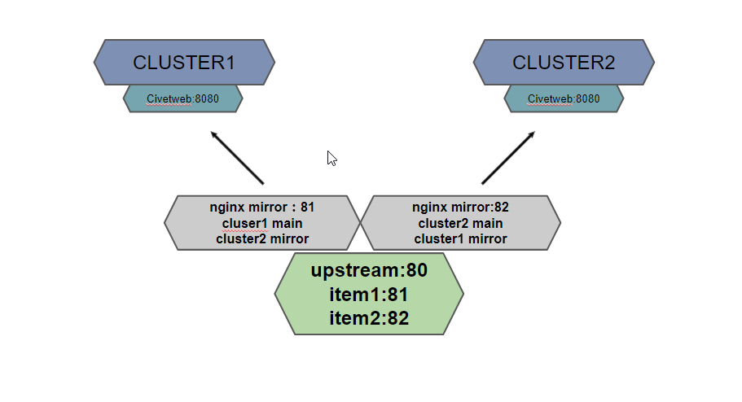
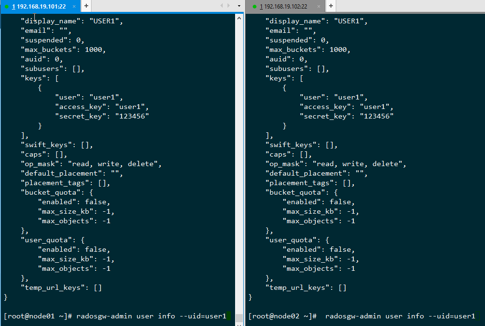
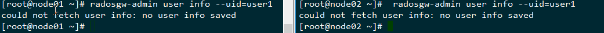

  
  

## 前言

ceph的s3数据的同步可以通过radosgw-agent进行同步，同region可以同步data和metadata，不同region只能同步metadata，这个地方可以参考下秦牧羊梳理的 [ceph radosgw 多集群同步部署流程](https://my.oschina.net/diluga/blog/391928)，本篇讲述的方案与radosgw-agent的复制方案不同在于,这个属于前端复制，后端相当于透明的两个相同集群，在入口层面就将数据进行了复制分流  
  
在某些场景下，需求可能比较简单：

- 需要数据能同时存储在两个集群当中
- 数据写一次，读多次
- 两个集群都能写

一方面两个集群可以增加数据的可靠性，另一方面可以提高读带宽，两个集群同时可以提供读的服务

radosgw-agent是从底层做的同步，正好看到秦牧羊有提到nginx新加入了ngx\_http\_mirror\_module 这个模块，那么本篇就尝试用这个模块来做几个简单的配置来实现上面的需求，这里纯架构的尝试，真正上生产还需要做大量的验证和修改的测试的

## 结构设想

当数据传到nginx的server的时候，nginx本地进行负载均衡到两个本地端口上面，本地的两个端口对应到两个集群上面,一个主写集群1，一个主写集群2，这个是最简结构，集群的civetweb可以是很多机器，nginx这个也可以是多台的机器，在一台上面之所以做个均衡是可以让两个集群是对等关系，而不是一个只用nginx写，另一个只mirror写

## 环境准备

准备两个完全独立的集群，分别配置一个s3的网关，我的环境为：  

<table><tbody><tr><td class="code"><pre>192.168.19.101:8080 192.168.19.102:8080 </pre></td></tr></tbody></table>

在每个机器上都创建一个管理员的账号，这个用于后面的通过restapi来进行管理的,其他的后面的操作都通过http来做能保证两个集群的数据是一致的

> nginx的机器在192.168.19.104

在两个集群当中都创建相同的管理用户  

<table><tbody><tr><td class="code"><pre>radosgw-admin user create --uid=admin --display-name=admin --access_key=admin --secret=123456 </pre></td></tr></tbody></table>

这里为了测试方便使用了简单密码

此时admin还仅仅是普通的权限，需要通过—cap添加user的capabilities，例如：  

<table><tbody><tr><td class="code"><pre>radosgw-admin caps add --uid=admin --caps="users=read, write" radosgw-admin caps add --uid=admin --caps="usage=read, write" </pre></td></tr></tbody></table>

下面就用到了nginx的最新的模块了  
Nginx 1.13.4 发布，新增 ngx\_http\_mirror\_module 模块

软件下载：  

<table><tbody><tr><td class="code"><pre>wget https://nginx.org/packages/mainline/centos/7/x86_64/RPMS/nginx-1.13.4-1.el7.ngx.x86_64.rpm </pre></td></tr></tbody></table>

下载rpm包然后安装  
安装：  

<table><tbody><tr><td class="code"><pre>rpm -ivh nginx-1.13.4-1.el7.ngx.x86_64.rpm </pre></td></tr></tbody></table>

修改nginx配置文件：  

<table><tbody><tr><td class="code"><pre>upstream s3 {       server 127.0.0.1:81;       server 127.0.0.1:82; }  server {     listen       81;     server_name  localhost;      location / {     mirror /mirror;     proxy_pass http://192.168.19.101:8080;     }      location /mirror {     internal;     proxy_pass http://192.168.19.102:8080$request_uri;     } }  server {     listen       82;     server_name  localhost;          location / {     mirror /mirror;     proxy_pass http://192.168.19.102:8080;     }      location /mirror {     internal;     proxy_pass http://192.168.19.101:8080$request_uri;     } } server{     listen 80;     location / {         proxy_pass         http://s3;     } } </pre></td></tr></tbody></table>

负载均衡的设置有很多种，这里用最简单的轮训的模式，想配置其他负载均衡模式可以参考我的[这篇文章](http://www.zphj1987.com/2015/03/22/%E5%85%B3%E4%BA%8Enginx-upstream%E7%9A%84%E5%87%A0%E7%A7%8D%E9%85%8D%E7%BD%AE%E6%96%B9%E5%BC%8F/)

重启进程并检查服务  

<table><tbody><tr><td class="code"><pre>[root@node04 ~]# systemctl restart nginx [root@node04 ~]# netstat -tunlp|grep nginx tcp        0      0 0.0.0.0:80              0.0.0.0:*               LISTEN      1582973/nginx: mast  tcp        0      0 0.0.0.0:81              0.0.0.0:*               LISTEN      1582973/nginx: mast  tcp        0      0 0.0.0.0:82              0.0.0.0:*               LISTEN      1582973/nginx: mast </pre></td></tr></tbody></table>

整个环境就配置完成了，下面我们就来验证下这个配置的效果是什么样的，下面会提供几个s3用户的相关的脚本

## s3用户相关脚本

### 创建用户的脚本

<table><tbody><tr><td class="code"><pre>#!/bin/bash ### #S3 USER ADMIN  ###  ###==============WRITE BEGIN=============### ACCESS_KEY=admin ## ADMIN_USER_TOKEN SECRET_KEY=123456 ## ADMIN_USER_SECRET HOST=192.168.19.104:80 USER_ACCESS_KEY="&amp;access-key=user1" USER_SECRET_KEY="&amp;secret-key=123456" ###==============WRITE  FINAL=======FINAL=====###  query2=admin/user userid=$1 name=$2 uid="&amp;uid=" date=`TZ=GMT LANG=en_US date "+%a, %d %b %Y %H:%M:%S GMT"` header="PUTnnn${date}n/${query2}" sig=$(echo -en ${header} | openssl sha1 -hmac ${SECRET_KEY} -binary | base64) curl -v -H "Date: ${date}" -H "Authorization: AWS ${ACCESS_KEY}:${sig}" -L -X PUT "http://${HOST}/${query2}?format=json${uid}${userid}&amp;display-name=${name}${USER_ACCESS_KEY}${USER_SECRET_KEY}" -H "Host: ${HOST}" echo "" </pre></td></tr></tbody></table>

运行脚本：  

<table><tbody><tr><td class="code"><pre>[root@node01 ~]# sh  addusernew.sh user1 USER1 * About to connect() to 192.168.19.104 port 80 (#0) *   Trying 192.168.19.104... * Connected to 192.168.19.104 (192.168.19.104) port 80 (#0) &gt; PUT /admin/user?format=json&amp;uid=user1&amp;display-name=USER1&amp;access-key=user1&amp;secret-key=123456 HTTP/1.1 &gt; User-Agent: curl/7.29.0 &gt; Accept: */* &gt; Date: Wed, 09 Aug 2017 07:51:58 GMT &gt; Authorization: AWS admin:wuqQUUXhhar5nQS5D5B14Dpx+Rw= &gt; Host: 192.168.19.104:80 &gt;  &lt; HTTP/1.1 200 OK &lt; Server: nginx/1.13.4 &lt; Date: Wed, 09 Aug 2017 07:51:58 GMT &lt; Content-Type: application/json &lt; Content-Length: 195 &lt; Connection: keep-alive &lt;  * Connection #0 to host 192.168.19.104 left intact {"user_id":"user1","display_name":"USER1","email":"","suspended":0,"max_buckets":1000,"subusers":[],"keys":[{"user":"user1","access_key":"user1","secret_key":"123456"}],"swift_keys":[],"caps":[]} </pre></td></tr></tbody></table>

在两个集群中检查：  

可以看到两个集群当中都产生了相同的用户信息

### 修改用户

直接把上面的创建脚本里面的PUT改成POST就是修改用户的脚本

### 删除用户脚本

<table><tbody><tr><td class="code"><pre>#!/bin/bash ### #S3 USER ADMIN ###  ###==============WRITE BEGIN=============### ACCESS_KEY=admin ## ADMIN_USER_TOKEN SECRET_KEY=123456 ## ADMIN_USER_SECRET HOST=192.168.19.104:80 ###==============WRITE  FINAL=======FINAL=====###  query2=admin/user userid=$1 uid="&amp;uid=" date=`TZ=GMT LANG=en_US date "+%a, %d %b %Y %H:%M:%S GMT"` header="DELETEnnn${date}n/${query2}" sig=$(echo -en ${header} | openssl sha1 -hmac ${SECRET_KEY} -binary | base64) curl -v -H "Date: ${date}" -H "Authorization: AWS ${ACCESS_KEY}:${sig}" -L -X DELETE "http://${HOST}/${query2}?format=json${uid}${userid}" -H "Host: ${HOST}" echo "" </pre></td></tr></tbody></table>

执行删除用户：  

<table><tbody><tr><td class="code"><pre>[root@node01 ~]# sh deluser.sh user1 </pre></td></tr></tbody></table>

可以看到两边都删除了

### 获取用户的信息脚本

<table><tbody><tr><td class="code"><pre>#! /bin/sh ### #S3 USER ADMIN  ###  ###==============WRITE BEGIN=============### ACCESS_KEY=admin ## ADMIN_USER_TOKEN SECRET_KEY=123456 ## ADMIN_USER_SECRET HOST=192.168.19.101:8080 ###==============WRITE  FINAL=======FINAL=====###  query2=admin/user userid=$1 uid="&amp;uid=" date=`TZ=GMT LANG=en_US date "+%a, %d %b %Y %H:%M:%S GMT"` header="GETnnn${date}n/${query2}" sig=$(echo -en ${header} | openssl sha1 -hmac ${SECRET_KEY} -binary | base64) curl -v -H "Date: ${date}" -H "Authorization: AWS ${ACCESS_KEY}:${sig}" -L -X GET "http://${HOST}/${query2}?format=json${uid}${userid}&amp;display-name=${name}"  -H "Host: ${HOST}" </pre></td></tr></tbody></table>

### 测试上传一个文件

通过192.168.19.104:80端口上传一个文件，然后通过nginx的端口，以及两个集群的端口进行查看

可以看到在上传一次的情况下，两个集群里面同时拥有了这个文件

## 总结

真正将方案运用到生产还需要做大量的验证测试，中间的失效处理，以及是否可以将写镜像，读取的时候不镜像，这些都需要进一步做相关的验证工作

本篇中的S3用户的管理接口操作参考了网上的其他资料

## 变更记录

| Why | Who | When |
| --- | --- | --- |
| 创建 | 武汉-运维-磨渣 | 2017-08-10 |

Source: zphj1987@gmail ([Ceph S3 基于NGINX的集群复制方案](http://www.zphj1987.com/2017/08/10/Ceph-S3-nginx-mirror/))
