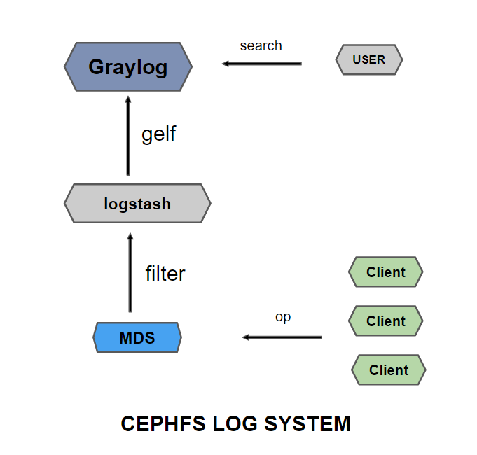
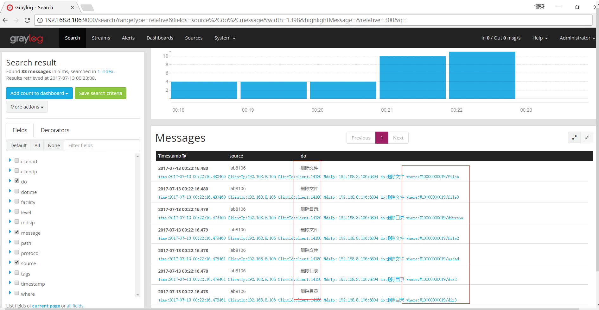

  
  

## 前言

文件系统当中如果某些文件不见了，有什么办法判断是删除了还是自己不见了，这个就需要去日志里面定位了，通常情况下是去翻日志，而日志是会进行压缩的，并且查找起来非常的不方便,还有可能并没有开启  
  
这个时候就需要日志系统了，最近正好看到一篇[最佳日志实践（v2.0）](https://zhuanlan.zhihu.com/p/27363484)，一篇非常好的文章，本篇日志属于文章里面所提到的统计日志，统计客户端做了什么操作

对于日志系统来说，很重要的一点，能够很方便的进行查询，这就需要对日志信息进行一些处理了，怎么处理就是设计问题，要求就是不多不少

## 结构

  
  

其中graylog配置部分在这篇[使用日志系统graylog获取Ceph集群状态](http://www.zphj1987.com/2017/06/09/use-graylog-get-Ceph-status/)，根据这篇的操作，配置出12201的udp监听端口即可，剩余部分就是本篇中的配置

## 配置

### 集群的配置

需要对MDS的配置进行debug\_ms=1,在/etc/ceph/ceph.conf当中添加下面配置  

<table><tbody><tr><td class="code"><pre>[mds.lab8106] debug_ms=1 hostname=lab8106 </pre></td></tr></tbody></table>

这个地方集群的文件操作日志是记录在message里面的1级别的，所以把mds的debug\_ms开到1  
日志长这个样子：  

<table><tbody><tr><td class="code"><pre>2017-07-13 11:26:23.703624 7fc3128c3700  1 -- 192.168.8.106:6804/3280969928 &lt;== client.14180 192.168.8.106:0/1092795882 2384 ==== client_request(client.14180:2346 mkdir #1/ppop 2017-07-13 11:26:23.702532 caller_uid=0, caller_gid=0{}) v2 ==== 170+0+0 (843685338 0 0) 0x5645ec243600 con 0x5645ec247000 </pre></td></tr></tbody></table>

下面会对这个日志进行提取

### 下载logstash

<table><tbody><tr><td class="code"><pre>https://artifacts.elastic.co/downloads/logstash/logstash-5.5.0.rpm </pre></td></tr></tbody></table>

<table><tbody><tr><td class="code"><pre>[root@lab8106 ~]# rpm -ivh logstash-5.5.0.rpm </pre></td></tr></tbody></table>

修改启动进程为root权限  
修改/etc/systemd/system/logstash.service文件当中的  

<table><tbody><tr><td class="code"><pre>User=root Group=root </pre></td></tr></tbody></table>

因为logstash需要本地文件的读取权限，这里是为了方便直接给的root权限，方便使用，如果对权限要求比较严的环境，就给文件

### 创建一个配置文件

<table><tbody><tr><td class="code"><pre>vim /etc/logstash/conf.d/logstash.conf </pre></td></tr></tbody></table>

添加下面的配置文件，这个配置文件包含的内容比较多，会在后面详细的介绍下处理过程  

<table><tbody><tr><td class="code"><pre>input {     file {     path =&gt; "/var/log/ceph/ceph-mds.*.log"     } }  filter {     grok {      match =&gt;{"message" =&gt; "%{TIMESTAMP_ISO8601:logtime} %{BASE16FLOAT}  %{BASE10NUM} -- %{HOSTPORT:mdsip}%{NOTSPACE} &lt;== %{NOTSPACE:clientid} %{IP:clientip}%{NOTSPACE} %{INT} ==== client_request(%{NOTSPACE} %{WORD:do} %{NOTSPACE:where} %{TIMES TAMP_ISO8601:dotime}%{GREEDYDATA}"}     overwrite =&gt; ["message"]     remove_field =&gt;["logtime"]     }      if ![dotime] {         drop {}     }     if [do] == "mkdir" {         mutate {         replace =&gt; { "do" =&gt; "创建目录"}         }     }     if [do] == "create" {         mutate {         replace =&gt; { "do" =&gt; "创建文件"}         }     }     if [do] == "unlink" {         mutate {         replace =&gt; { "do" =&gt; "删除文件"}         }     }     if [do] == "rmdir" {         mutate {         replace =&gt; { "do" =&gt; "删除目录"}         }     }     if [do] == "rename" {         mutate {         replace =&gt; { "do" =&gt; "重命名"}         }     }     if [do] == "symlink" {         mutate {         replace =&gt; { "do" =&gt; "链接"}         }     }     if [do] == "unlink"{         mutate {         replace =&gt; { "do" =&gt; "删除链接"}         }     }     mutate {         replace =&gt; { "message" =&gt; "time:%{dotime} ClientIp:%{clientip}  ClintId:%{clientid}  MdsIp: %{mdsip} do:%{do} where:%{where}"}     }     date {         match =&gt; [ "dotime", "yyyy-MM-dd HH:mm:ss.SSSSSS"]         target =&gt; "@timestamp"     } }  output {     gelf {         host =&gt; "192.168.8.106"     }      stdout { codec =&gt; json_lines} } </pre></td></tr></tbody></table>

处理后的日志是这个样子：

> {“path”:”/var/log/ceph/ceph-mds.lab8106.log”,”@timestamp”:”2017-07-13T04:01:01.251Z”,”clientid”:”client.14180”,”clientip”:”192.168.8.106”,”@version”:”1”,”host”:”lab8106”,”where”:”#1/test1”,”do”:”创建目录”,”message”:”time:2017-07-13 12:01:01.251358 ClientIp:192.168.8.106 ClintId:client.14180 MdsIp: 192.168.8.106:6804 do:创建目录 where:#1/test1”,”mdsip”:”192.168.8.106:6804”,”dotime”:”2017-07-13 12:01:01.251358”}

是一个json形式的，可以根据自己的需要增加减少字段，这些信息都会传递到graylog当中

### 解析配置文件

logstash配置文件的结构包括三个大模块：

- input
- filter
- output

input是文件的来源，也就是我们需要解析的日志，filter是处理日志的模块，output是输出的模块，这里我们需要使用的是gelf的输出模式，在本地进行调试的时候，可以开启stdout来进行调试

采用grok进行正则匹配，这个里面的匹配正则可以用 [http://grokconstructor.appspot.com/do/construction](http://grokconstructor.appspot.com/do/construction) 这个进行正则表达式的验证和书写，可以一步步的进行匹配，还是很方便的工具

output输出gelf的信息流

### grok内部解析

- remove\_field可以用来删除无用的字段
- if !\[dotime\] 这个是用来过滤消息的，如果没拿到这个值，也就是没匹配上的时候，就把消息丢弃
- 使用mutate replace模块来进行字段的替换，将固定操作转换为中文
- 使用mutate replace模块来重写message，根据自己定义的格式进行输出
- 使用date 模块进行@timestamp的重写，将日志内的时间写入到这个里面

查询插件  

<table><tbody><tr><td class="code"><pre>/usr/share/logstash/bin/logstash-plugin list </pre></td></tr></tbody></table>

logstash-output-gelf默认没有安装的,需要安装一下

<table><tbody><tr><td class="code"><pre>/usr/share/logstash/bin/logstash-plugin install logstash-output-gelf </pre></td></tr></tbody></table>

这个安装可能有点慢，稍微多等一下

调试方式的启动  

<table><tbody><tr><td class="code"><pre>/usr/share/logstash/bin/logstash -f /etc/logstash/conf.d/logstash.conf </pre></td></tr></tbody></table>

如果调试完毕了后就用系统命令启动  

<table><tbody><tr><td class="code"><pre>[root@lab8106 ~]# systemctl restart logstash </pre></td></tr></tbody></table>

通过graylog系统就可以很方便的看到日志里面节获取的内容了

### 总结

对于一套系统来说，日志系统是一个很重要的组成部分，可以更好的掌握系统内部的运行情况，并不是说出了问题再去找日志，这个日志的需求来源其实很简单

> 哪个客户端对着哪个MDS做了一个什么操作

然后就可以用这个搜索引擎去进行相关的搜索了，可以查询一段时间创建了多少文件，是不是删除了哪个文件

本次实践的难点在于logstash对日志的相关解析的操作，掌握了方法以后，对于其他日志的提取也可以用类似的方法，提取自己需要的信息，然后进行整合，输出到一个系统当中，剩下的就是在界面上获取信息

## 变更记录

| Why | Who | When |
| --- | --- | --- |
| 创建 | 武汉-运维-磨渣 | 2017-07-13 |

Source: zphj1987@gmail ([Cephfs 操作输出到日志查询系统](http://www.zphj1987.com/2017/07/13/CEPHFS-op-to-graylog/))
