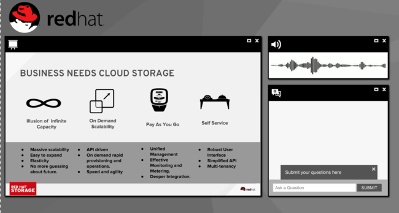
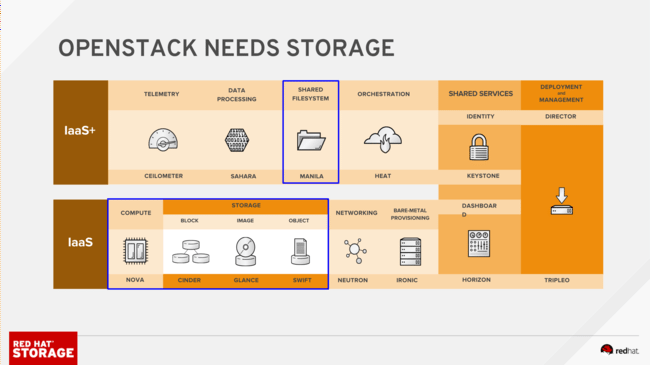
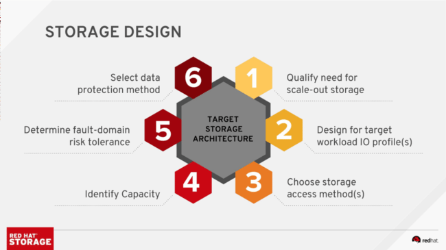
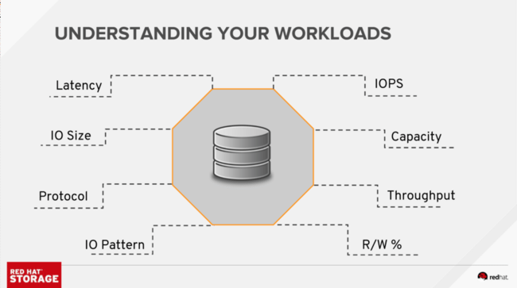

Choosing a storage solution for OpenStack is an interesting problem, and it reflects the complexity of a choice that reflects across the entire design of your cloud.

I was honored to be able to share Red Hat’s views on the matter in a very well attended webinar this week.

My colleagues Rahul Vijayan and Sadique Puthen introduced a rational and systematic way to examine the myriad of storage options available to an OpenStack designer, and to rapidly zero-in on the most appropriate ones for the cloud in question. I was privileged with the opportunity to present this method to our online audience today.

The webinar’s recording is [available online for on-demand listening](https://vts.inxpo.com/scripts/Server.nxp?LASCmd=AI:4;F:APIUTILS!51004&PageID=E6356CE6-7C6F-49F8-9515-842A506DC1FB&AffiliateData=campaignID), and we are making the slides available as well. We are hoping you can make quicker, more informed choices with this well-organized approach.

We encourage you to go through the design principles for OpenStack storage we laid down, and examine your storage choice as you would your choice of Linux operating system. Our hope is that you will choose to procure the hardware from your favorite compute vendor, and the software from your favorite Linux vendor!

# The Download

You should [watch](https://vts.inxpo.com/scripts/Server.nxp?LASCmd=AI:4;F:APIUTILS!51004&PageID=E6356CE6-7C6F-49F8-9515-842A506DC1FB&AffiliateData=campaignID) the webinar to really hear the all the questions you need to be asking (as well as some of the answers), but our slides are [available as a PDF](http://people.redhat.com/%7Eflucifre/talks/Choosing%20the%20right%20storage%20for%20your%20OpenStack%20cloud%20webinar.pdf) and can be viewed inline below. Feel free to use them in your internal pitch.

Source: Federico Lucifredi ([Choosing the right storage for your OpenStack cloud](http://f2.svbtle.com/choosing-the-right-storage-for-your-openstack-cloud))
