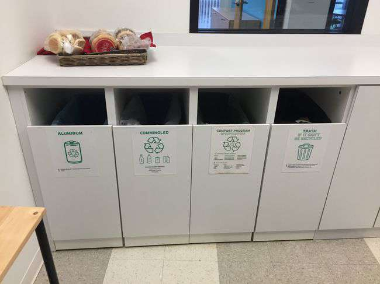
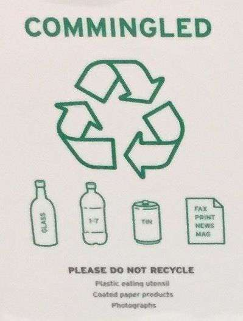
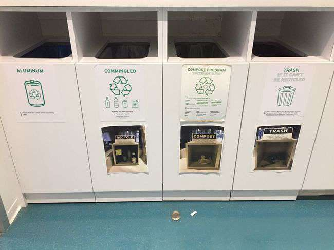
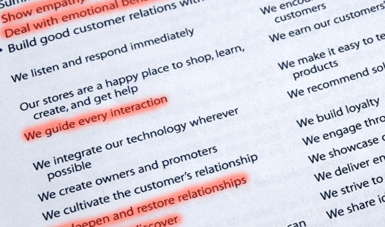
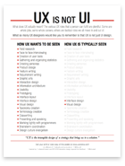

I usually resist sharing at large my opinions on how to make software, out of some impostor syndrome nonsense modesty thing. But this was too much fun not to write it up and share with you all.

User experience is key to the success of any software product today. Yet I find that too many folks in our industry do not really understand what UX truly is. Let’s set aside software for a minute, and illustrate this with an example from a lofty place.

#   Trash Talk

This trash bin was clearly designed by a well-meaning engineer. It accounts for every possibility… and it makes you play 10 questions every time you approach it. Are the forks compostable? Yes, turns out they are in this building. As in all cases where UX is involved, the point is not that saving the environment (or getting your network settings right) is not worth the effort. The point of UX is making those things effortless.

There are even icons of cans in **both** of the first two bins, which makes me twitch every time I approach to throw away a Coke. Of course all cans in the 21st century are made of aluminum, as Duck Dodgers would brashly point out. But in case you have found a tin can wrapped around your soup, it goes into a different bin. It’s in the sign, so what’s the problem?

Fax (really?), prints, newspapers and magazines go into bin #2. But not photographs or coated paper products, which not by direction, but by exclusion go into bin #4. _ugh_.

Just like interaction with any phone app or modern website, throwing trash is an instinctive and quick motion. _Do not make me think_. But folks who do not get UX really do not see this point – and usually they are persistent types. _Clearly_, you do not understand how this trash business works, so let us ‘splain what goes into every bin one more time, now with pictures!

Folks were not reading the 4 pages of documentation of the trash bin. Cleverly, the thinking here is that 7 pages will solve the problem for us. Unlikely. But adding Documentation is not UX. Documentation is good, just like saving the environment is. But neither are UX. And if you won’t take my word for it, take it from someone who is managing the bazillion StackOverflow users:

<blockquote class="twitter-tweet">
TL;DR: Documentation should *supplement* intuitive design, never replace it. Documentation is not a substitute for expected behavior.
— Nick Craver (@Nick_Craver) <a href="https://twitter.com/Nick_Craver/status/901772402568417280">August 27, 2017</a></blockquote>

UX is turning those four bins into two (or one!) and signing up with a single stream recycling vendor. UX is taking options away while making the right thing happen somehow.

Now, let’s stop playing with the trash – it is fun, but not what we want to rectify. Let’s go back to software. You are on your home network. Should the printer at work, with no IP route to it, be the choice offered when I go Ctrl-P just because it was the one last I used?

Windows selects the last printer used. No big deal right? Just a pull-down away to change it. OS X has now for decades chosen to use the information that the IP address of my printer brings to offer a local printer, whenever it can distinguish what is local based on subnet changes.

The first is an _engineered_ experience. The second is a _designed_ experience. Highly usable design has become table stakes in the mobile space and from there it is influencing how people see software everywhere else. UX is eating software.

#   Rules for Revolutionaries

Three rules to get you started. There are more, but… let’s apply some UX to this blog as well.

###   1\. Making things simple is about taking options away

Apple products do not leave around hundreds of exposed settings for that one user that wants to fiddle with each of them. Apple aggressively takes options away whenever possible, but if they only did that they would be failing in the market, not heralded as a paragon of design and usability with 1.2 billion iPhone users out there.

Apple makes the right thing happen automagically in its products, without you having to do anything. Maybe you lose 100 knobs to turn, but to most people, that one button on the iPhone and the clever choices the software makes for you are a way better design than the “bucket of bolts” alternative could ever be.

The best designers I worked with call this having an _opinionated_ product. You have a clear, consistent point of view, and automation that makes the right choices using this point of view hidden behind the scenes.

###   2\. Design the whole, not just the parts

Instead of focusing on enabling every little corner case with an additional setting, Apple has succeeded by ensuring that from the time the user visits the Apple Store to the time a product is retired, every step of the way is accounted for, planned, and [even choreographed](http://gizmodo.com/5938323/how-to-be-a-genius-this-is-apples-secret-employee-training-manual).

“we guide every interaction,” and “enrich their lives” pitted against adding a toggle to enable jumbo frames in your layer 2. Think about that.

###   3\. No shortcuts

Making things simple is actually one of the hardest tasks you can ever be assigned. It always involves making choices, a currency in short supply in corporate organizations. Choices that will _definitely_ disappoint a few users to (hopefully) the great delight of all others. It involves lots of effort, because it is typically disruptive to your existing code base and cuts right across established processes. And this disruption does not come to add a marketable feature, either – _it does not suck any more_ is not a message your PR team can use. On the other hand, when a product in your category delivers good UX, all competitors suddenly feel irrevocably out of date. Not bad as a competitive benefits go, don’t you think?

All too often, folks who do not 'get’ UX take an easy way out. One that drives me bonkers is “we need to make it easy, lets put a user interface on it”. Repeat with me. UX is not UI. _UX is perfecting the intangibles_ in the design of the strategy that takes the user to a solution. Even better, after you achieve enlightenment print a copy of [Erik Flowers’ poster](http://www.uxisnotui.com) and place it somewhere people can see it and reflect upon its deep wisdom.

#   A State of Mind

We have expanded a lot on what UX is not, which is fitting for a fleeting property that is achieved by taking things away. As experts in our field, we do not see these things as cruft, we see them as natural properties of a system we understand. The trick is to step out of your own skin to realize that the typical mobile phone user does not need to know about things like IP subnets , as long as we can put the right setting in place automatically. When Mark Shuttleworth led the Ubuntu PM team at Canonical, he would call this switching from the _UNIX Experience_ to the _Apple Experience,_ which is also a a handy way to remember that we can leave the expert options in a separate shell without crowding the main user experience.

Some folks, upon reading the trash example, write it off as a ‘first world problem’, for surely you can spare a couple of seconds to put the trash in the right bin. It even makes you feel like you are part of a greater cause. Yes, indeed you could also select the right printer, albeit without experiencing that cathartic moment. Great UX is about saving those few seconds again and again – in the trash case they do not add up as dramatically, but in software, you can shave a few seconds (sometimes even a few minutes) in almost every task, and the results are dramatic: people _feel_ the difference, they do not even have to analyze or account for it.

Look for inconsistency. Look for for externalities. Most of all look for annoyances. Usability is not having 10-digit conference access codes with 5 second timeouts. Usability is about making a big difference by fixing a lot of little things that eat into a user or a team’s productivity and enjoyment of your product. Do it again and again, and your product will be a creature of a different world. And _that_ is definitely worth all the effort.

Source: Federico Lucifredi ([Finding UX in the Trash](http://f2.svbtle.com/ux-in-the-trash))
