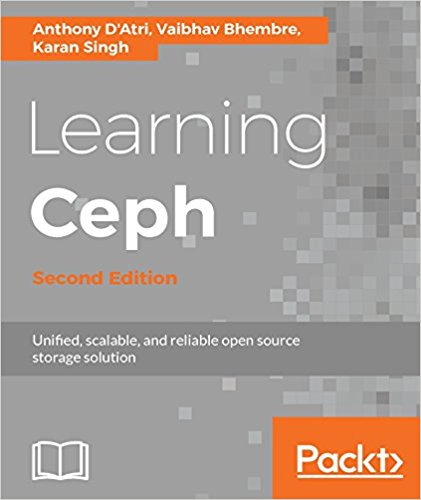

Learning Ceph - Second Edition was published in October 2017.

This is special post to highlight a new book I’ve been helping with. Good colleagues of mine wrote that book and I encourage anyone willing to learn Ceph to get a copy of it. The book is available on [Amazon](https://www.amazon.com/Learning-Ceph-scalable-reliable-solution-ebook/dp/B01NBP2D9I).

Learning Ceph, Second Edition will give you all the skills you need to plan, deploy, and effectively manage Ceph clusters.

We begin with an introduction to Ceph use-cases and components and then progress through selecting and planning servers and components. We then cover a number of important decisions to make before provisioning your servers and clusters, and walk through hands-on deployment of a fully functional virtualized sandbox cluster. We will explore a wide range of common (and not so common) management tasks.

A discussion on monitoring is followed by a deep dive into the inner workings of Ceph, a selection of topics related to provisioning storage, and an overview of Ceph’s role as an OpenStack storage solution. Rounding out our chapters is advice on benchmarking and tuning for performance and stability.

By the end of the book you will have learned to deploy and use Ceph effectively for your data storage requirements.

Things you will learn:

- The limitations of existing systems and why you should use Ceph as a storage solution
- Familiarity with Ceph’s architecture, components, and services
- Instant deployment and testing of Ceph within a Vagrant and VirtualBox environment
- Ceph operations including maintenance, monitoring, and troubleshooting
- Storage provisioning of Ceph’s block, object, and filesystem services
- Integrate Ceph with OpenStack
- Advanced topics including erasure coding, CRUSH maps, and performance tuning
- Best practices for your Ceph clusters

> Enjoy reading the book!

Source: Sebastian Han ([Learning Ceph - Second Edition](https://sebastien-han.fr/blog/2017/12/15/Learning-Ceph-Second-Edition/))
