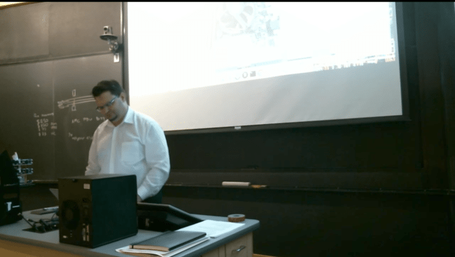
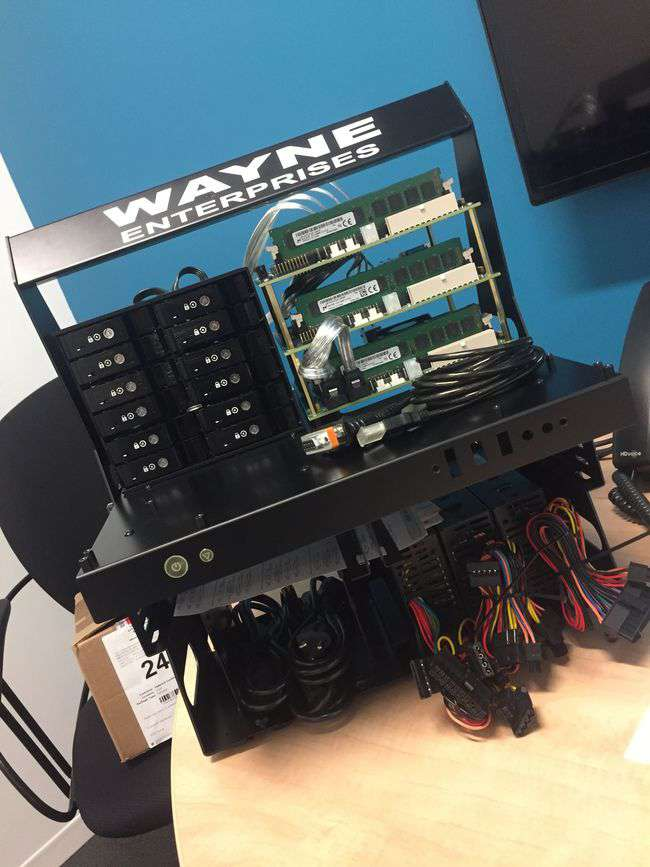
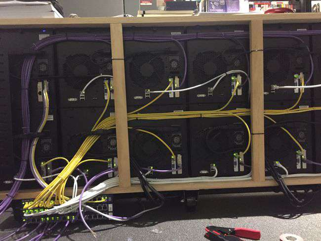
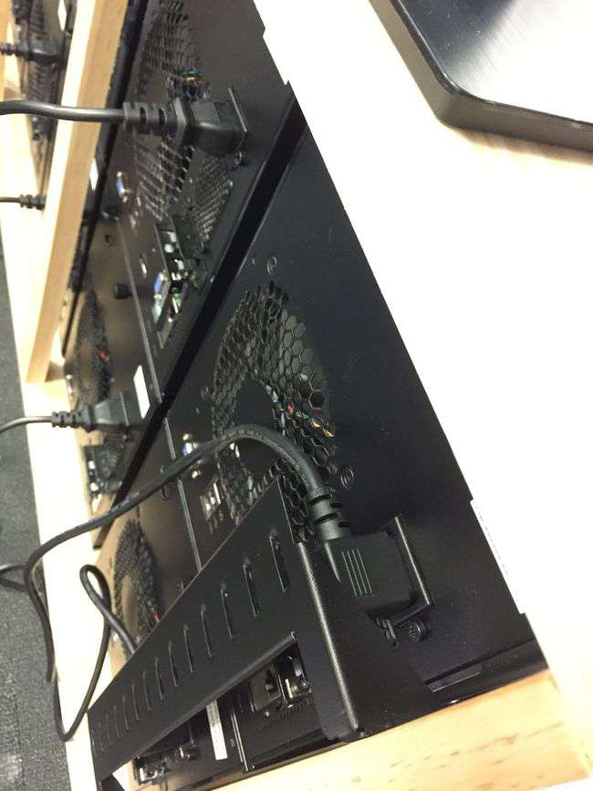
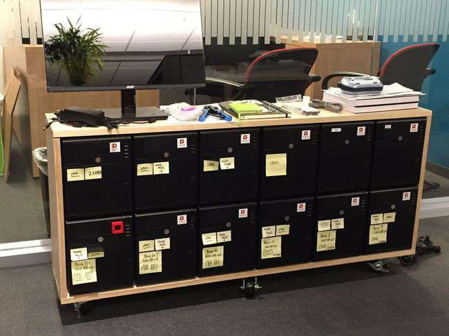

_Hardware hacking 101 returns to MIT’s BLU_

After a year of inadvertent absence from my favorite Linux user group (turns out that taking over the world with Software-Defined Storage is time consuming!), I returned to [BLU](http://blu.org/cgi-bin/calendar/2017-aug) to review my newest Linux cluster designs.

I reviewed design options for four clusters using x86 and 64-bit ARM processors housed in systems with a range of prices but with an eye to accomplish each objective with the minimum dollar cost: OpenStack cluster, Docker cluster, Ceph storage cluster and a Raspberry PI cluster — because of course everyone must have a Raspberry PI cluster, but more seriously, it is actually a useful lower-bound for minimal cluster cost.

We looked at the design considerations that went into each design, spanning from four nodes to twelve, and from $150 to $3,495-ish, and inspected on stage the hardware of the two clusters I managed to carry on site - The full APM Mustang storage cluster was there, and one of the nodes of the OpenStack cluster, as we would have needed a moving crew to relocate that.

This was a session for hardware and distributed system geeks, there were lots of interesting questions and the requisite few un-answered hardware mysteries. The Youtube recording is remarkably good on the audio side, you can even hear the audience’s questions well, but unfortunately the video did not come out that great. I guess you just had to be there if you wanted to see all my pretty pictures!

\[youtube https://www.youtube.com/watch?v=hGA7wYWZmi8?start=1603&w=560&h=315\]

I shall return to MIT this winter to present on Docker clustering and I hope to also have time to showcase a new cluster design then — which I briefly skimmed over at the end.

Source: Federico Lucifredi ([Low-cost Linux clusters](http://f2.svbtle.com/low-cost-linux-clusters))
