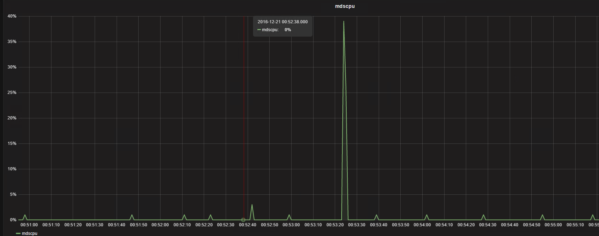
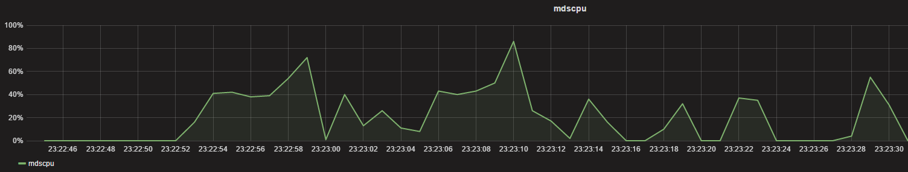
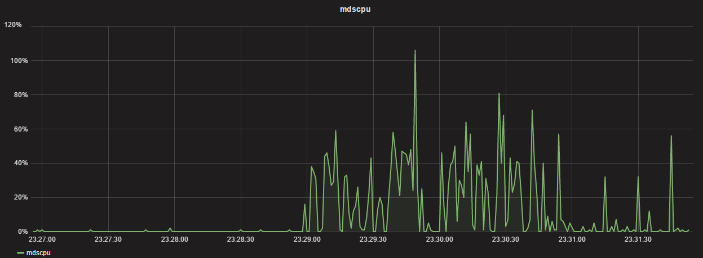
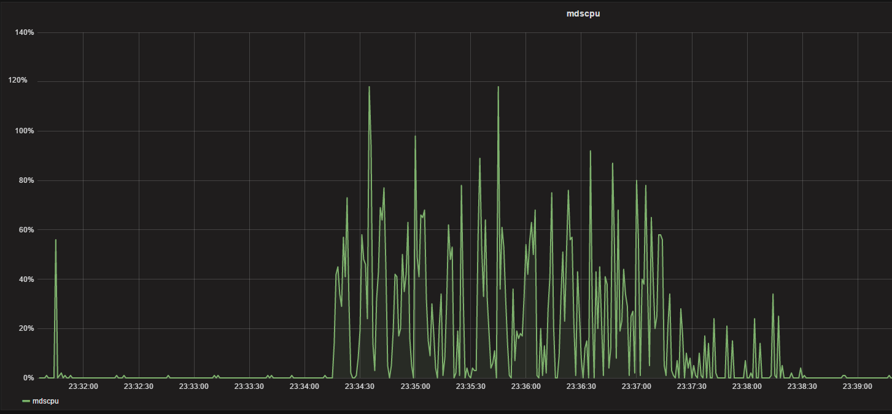
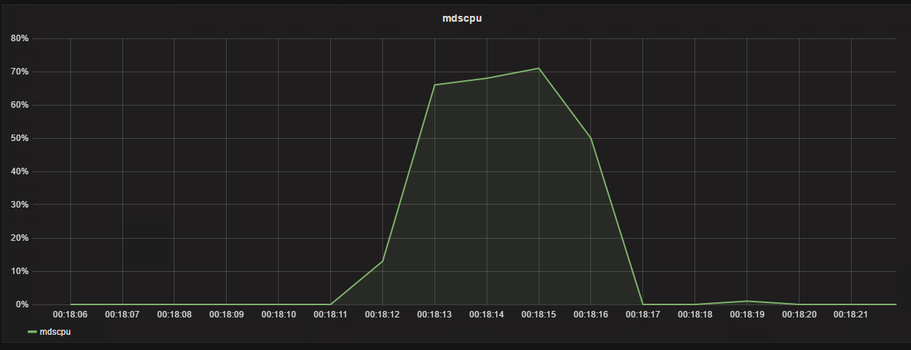
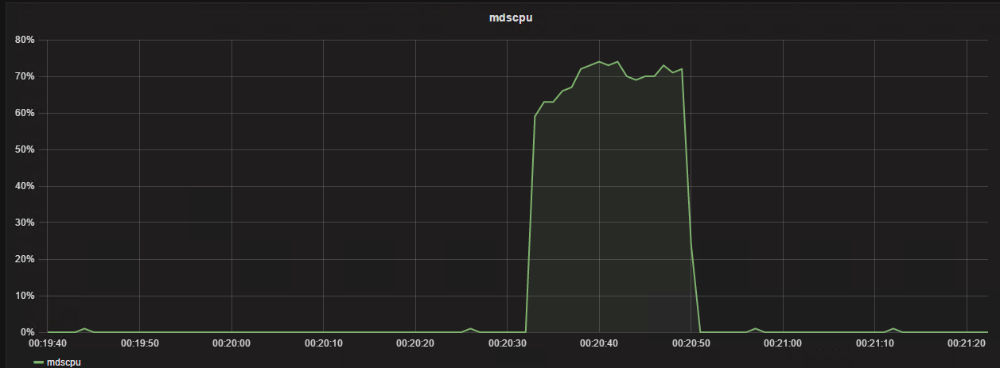
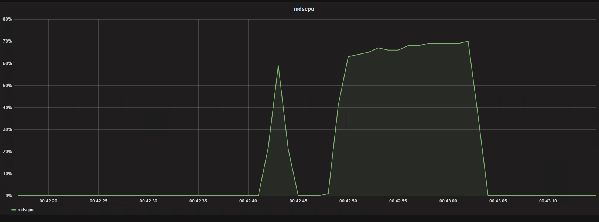
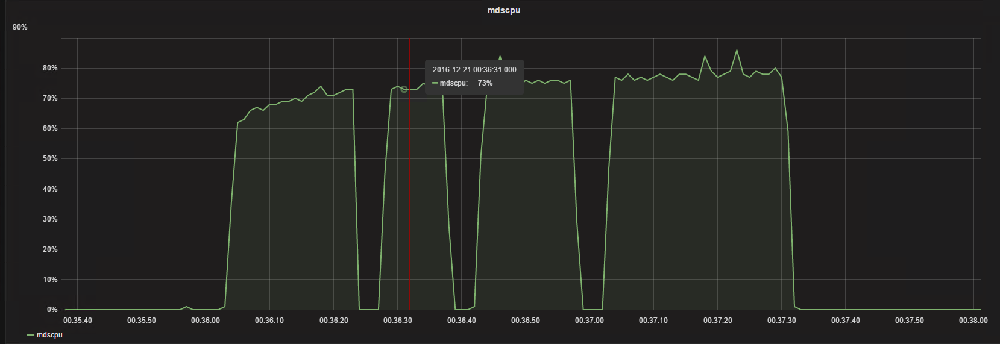

  
  

## 前言

mds是ceph里面处理文件接口的组件，一旦使用文件系统，不可避免的会出现一种场景就是目录很多，目录里面的文件很多，而mds是一个单进程的组件，现在虽然有了muti mds，但稳定的使用的大部分场景还是单acitve mds的

这就会出现一种情况，一旦一个目录里面有很多文件的时候，去查询这个目录里的文件就会在当前目录做一次遍历，这个需要一个比较长的时间，如果能比较好的缓存文件信息，也能避免一些过载情况，本篇讲述的是内核客户端正常，而export nfs后mds的负载长时间过高的情况  

## 问题复现

### 准备测试数据,准备好监控环境

监控mds cpu占用  

<table><tbody><tr><td class="code"><pre>pidstat -u  1 -p 27076 &gt; /tmp/mds.cpu.log UserParameter=mds.cpu,cat /tmp/mds.cpu.log|tail -n 1|grep -v Average| awk '{print $8}' </pre></td></tr></tbody></table>

整个测试避免屏幕的打印影响时间统计,把输出需要重定向  
测试一：  
内核客户端写入10000文件查看时间以及cpu占用  

<table><tbody><tr><td class="code"><pre>[root@nfsserver kc10000]# time seq 10000|xargs -i dd if=/dev/zero of=a{} bs=1K count=1  2&gt;/dev/null real	0m30.121s user	0m1.901s sys	0m10.420s </pre></td></tr></tbody></table>

测试二：  
内核客户端写入20000文件查看时间以及cpu占用  

<table><tbody><tr><td class="code"><pre>[root@nfsserver kc20000]# time seq 20000|xargs -i dd if=/dev/zero of=a{} bs=1K count=1  2&gt;/dev/null real	1m38.233s user	0m3.761s sys	0m21.510s </pre></td></tr></tbody></table>

  
测试三：  
内核客户端写入40000文件查看时间以及cpu占用  

<table><tbody><tr><td class="code"><pre>[root@nfsserver kc40000]#  time seq 40000|xargs -i dd if=/dev/zero of=a{} bs=1K count=1  2&gt;/dev/null  real	2m55.261s user	0m7.699s sys	0m42.410s </pre></td></tr></tbody></table>

测试4：  
内核客户端列目录10000文件，第一次写完有缓存情况  

<table><tbody><tr><td class="code"><pre>[root@nfsserver kc10000]# time ll 2&gt;&amp;1 &gt; /dev/null  real	0m0.228s user	0m0.063s sys	0m0.048s </pre></td></tr></tbody></table>

内核客户端列目录20000文件，第一次写完有缓存情况  

<table><tbody><tr><td class="code"><pre>[root@nfsserver kc20000]# time ll 2&gt;&amp;1 &gt; /dev/null  real	0m0.737s user	0m0.141s sys	0m0.092s </pre></td></tr></tbody></table>

内核客户端列目录40000文件，第一次写完有缓存情况  

<table><tbody><tr><td class="code"><pre>[root@nfsserver kc40000]# time ll 2&gt;&amp;1 &gt; /dev/null  real	0m1.658s user	0m0.286s sys	0m0.196s </pre></td></tr></tbody></table>

都是比较快的返回，CPU可以忽略不计

现在重启mds后再次列目录  
客户端如果不umount,直接重启mds的话,还是会缓存在  
新版本这个地方好像已经改了（重启了mds 显示inode还在，但是随着时间的增长inode会减少，说明还是有周期，会释放，这个还不知道哪个地方控制，用什么参数控制，这个不是本篇着重关注的地方，后续再看下,jewel版本已经比hammer版本的元数据时间快了很多了）  

<table><tbody><tr><td class="code"><pre>[root@nfsserver kc10000]# time ll 2&gt;&amp;1 &gt; /dev/null  real	0m0.380s user	0m0.065s sys	0m0.041s [root@nfsserver kc10000]# cd ../kc20000/ [root@nfsserver kc20000]# time ll 2&gt;&amp;1 &gt; /dev/null  real	0m0.868s user	0m0.154s sys	0m0.074s [root@nfsserver kc20000]# cd ../kc40000/ [root@nfsserver kc40000]# time ll 2&gt;&amp;1 &gt; /dev/null  real	0m1.947s user	0m0.300s sys	0m0.166s </pre></td></tr></tbody></table>

测试都是看到很快的返回，以上都是正常的，下面开始将这个目录exportnfs出去，看下是个什么情况

### 负载问题复现

从nfs客户端第一次列10000个小文件的目录

<table><tbody><tr><td class="code"><pre>[root@nfsclient kc10000]# time ll 2&gt;&amp;1 &gt; /dev/null  real	0m4.038s user	0m0.095s sys	0m0.069s </pre></td></tr></tbody></table>

从nfs客户端第一次列20000个小文件的目录  

<table><tbody><tr><td class="code"><pre>[root@nfsclient kc20000]# time ll 2&gt;&amp;1 &gt; /dev/null  real	0m17.446s user	0m0.175s sys	0m0.141s </pre></td></tr></tbody></table>

  
从nfs客户端第二次列20000个小文件目录  

<table><tbody><tr><td class="code"><pre>[root@nfsclient kc20000]# time ll 2&gt;&amp;1 &gt; /dev/null  real	0m21.215s user	0m0.182s sys	0m0.151s </pre></td></tr></tbody></table>

从nfs客户端第三次列20000个小文件目录  

<table><tbody><tr><td class="code"><pre>[root@nfsclient kc20000]# time ll 2&gt;&amp;1 &gt; /dev/null  real	0m16.222s user	0m0.189s sys	0m0.143s </pre></td></tr></tbody></table>

可以看到在20000量级的时候列目录维持在20000左右，CPU维持一个高位

从nfs客户端列40000个小文件的目录  

<table><tbody><tr><td class="code"><pre>[root@nfsclient kc40000]# time ll 2&gt;&amp;1 &gt; /dev/null  real	7m15.663s user	0m0.319s sys	0m0.581s [root@nfsclient kc40000]# </pre></td></tr></tbody></table>

  
第一次列完，马上第二次列看下情况  

<table><tbody><tr><td class="code"><pre>[root@nfsclient kc40000]# time ll 2&gt;&amp;1 &gt; /dev/null  real	1m12.816s user	0m0.163s sys	0m0.142s </pre></td></tr></tbody></table>

可以看到第二次列的时间已经缩短了，再来第三次  

<table><tbody><tr><td class="code"><pre>[root@nfsclient kc40000]# time ll 2&gt;&amp;1 &gt; /dev/null  real	1m33.549s user	0m0.162s sys	0m0.183s </pre></td></tr></tbody></table>

  
可以看到在后面列的时候时间确实缩短了，但是还是维持一个非常高CPU的占用，以及比较长的一个时间，这个很容易造成过载

这个地方目前看应该是内核客户端与内核NFS的结合的问题

## 解决办法:用ganesha的ceph用户态接口替代kernel nfs

我们看下另外一种方案用户态的NFS+ceph同样的环境下测试结果：

从nfs客户端第一次列40000个小文件的目录  

<table><tbody><tr><td class="code"><pre>[root@nfsclient kc40000]# time ll 2&gt;&amp;1 &gt; /dev/null  real	0m3.289s user	0m0.335s sys	0m0.386s </pre></td></tr></tbody></table>

从nfs客户端第二次列40000个小文件的目录

<table><tbody><tr><td class="code"><pre>[root@nfsclient kc40000]# time ll 2&gt;&amp;1 &gt; /dev/null  real	0m1.686s user	0m0.351s sys	0m0.389s </pre></td></tr></tbody></table>

从nfs客户端第三次列40000个小文件的目录  

<table><tbody><tr><td class="code"><pre>[root@nfsclient kc40000]# time ll 2&gt;&amp;1 &gt; /dev/null  real	0m1.675s user	0m0.320s sys	0m0.391s </pre></td></tr></tbody></table>

  
基本mds无多余的负载，非常快的返回

可以从上面的测试看到差别是非常的大的，这个地方应该是内核模块与内核之间的问题，而采用用户态的以后解决了列目录慢以及卡顿的问题

## 如何配置ganesha支持ceph的nfs接口

<table><tbody><tr><td class="code"><pre>git clone -b V2.3-stable https://github.com/nfs-ganesha/nfs-ganesha.git cd nfs-ganesha/ git submodule update --init --recursive cd .. cd nfs-ganesha/ ll src/FSAL/FSAL_CEPH/ cd .. mkdir mybuild cd mybuild/ cmake -DUSE_FSAL_CEPH=ON ../nfs-ganesha/src/ ll FSAL/FSAL_CEPH/ make make -j 12 make install </pre></td></tr></tbody></table>

vim /etc/ganesha/ganesha.conf  
修改配置文件  

<table><tbody><tr><td class="code"><pre>EXPORT {     Export_ID=1;      Path = "/";      Pseudo = "/";      Access_Type = RW;      NFS_Protocols = 4;      Transport_Protocols = TCP;      FSAL {         Name = CEPH;     } } </pre></td></tr></tbody></table>

停止掉原生的nfs  

<table><tbody><tr><td class="code"><pre>systemctl stop nfs </pre></td></tr></tbody></table>

启用ganesha nfs  

<table><tbody><tr><td class="code"><pre>systemctl start  nfs-ganesha.service </pre></td></tr></tbody></table>

然后在客户端进行nfs的挂载即可

## 总结

ganesha在需要用到cephfs又正好是要用到nfs接口的时候，可以考虑这个方案，至少在缓存文件，降低负载上面能够比kernel client有更好的效果，这个可以根据测试情况用数据来做比较

## 变更记录

| Why | Who | When |
| --- | --- | --- |
| 创建 | 武汉-运维-磨渣 | 2017-12-04 |

Source: zphj1987@gmail ([mds的cpu占用问题分析以及解决办法](http://www.zphj1987.com/2017/12/04/mds-use-too-more-cpu/))
