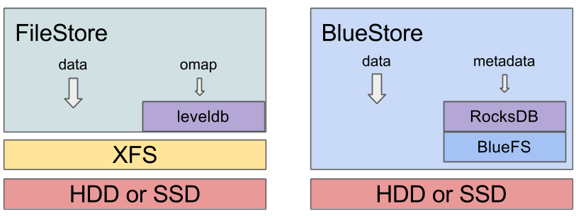

mBlueStore is a new storage backend for Ceph.  It boasts better performance (roughly 2x for writes), full data checksumming, and built-in compression.  It is the new default storage backend for Ceph OSDs in Luminous v12.2.z and will be used by default when provisioning new OSDs with ceph-disk, ceph-deploy, and/or ceph-ansible.

### How fast?

Roughly speaking, BlueStore is about twice as fast as FileStore, and performance is more consistent with a lower tail latency.

The reality is, of course, much more complicated than that:

- For large writes, we avoid a double-write that FileStore did, so we can be up to twice as fast.
- ...except that many FileStore deployments put the journal on a separate SSD, so that benefit may be masked
- For small random writes, we do significantly better, even when compared to FileStore with a journal.
- ...except it's less clear when you're using an NVMe, which tends not to be bottlenecked on the actual storage device but on the CPU (testing is ongoing)
- For key/value data, though, we do significantly better, avoiding some very ugly behavior that can crop up in FileStore. For some RGW workloads, for example, we saw write performance improve by 3x!
- We avoid the throughput collapse seen in FileStore (due to "splitting") when filling up a cluster with data.
- Small sequential reads using raw librados are _slower_ in BlueStore, but this only appears to affect microbenchmarks. This is somewhat deliberate: BlueStore doesn't implement its own readahead (since everything sitting on top of RADOS has its own readahead), and sequential reads using those higher-level interfaces (like RBD and CephFS) are generally great.
- Unlike FileStore, BlueStore is copy-on-write: performance with RBD volumes or CephFS files that were recently snapshotted will be much better.

Expect another blog post in the next few weeks with some real data for a deeper dive into BlueStore performance.

That said, BlueStore is still a work in progress! We continue to identify issues and make improvements. This first stable release is an important milestone but it is by no means the end of our journey--only the end of the beginning!

### Square peg, round hole

Ceph OSDs perform two main functions: replicating data across the network to other OSDs (along with the rebalancing, healing, and everything else that comes with that), and storing data on the locally attached device(s) (hard disk, SSD, or some combination of the two). The second local storage piece is currently handled by the existing FileStore module, which stores objects as files in an XFS file system. There is quite a bit of history as to how we ended up with the precise architecture and interfaces that we did, but the central challenge is that the OSD was built around transactional updates, and those are awkward and inefficient to implement properly on top of a standard file system.

In the end, we found there was nothing wrong with XFS; it was simply the wrong tool for the job. Looking at the FileStore design today, we find that most of its shortcomings are related to the hackery required to adapt our interface to POSIX and not problems with Ceph or XFS in isolation.

### **How does BlueStore work?**

BlueStore is a clean implementation of our internal ObjectStore interface from first principles, motivated specifically by the workloads we expect. BlueStore is built on top of a raw underlying block device (or block devices). It embeds the RocksDB key/value database for managing its internal metadata. A small internal adapter component called BlueFS implements a file-system-like interface that provides just enough functionality to allow RocksDB to store its “files” and share the same raw device(s) with BlueStore.

The biggest difference you’ll notice between older FileStore-based OSDs (e.g., any OSDs deployed with Ceph prior to Luminous) and BlueStore ones is what the partitions and mount point look like.  For a FileStore OSD, you see something like

> $ lsblk
> …
> sdb      8:16   0 931.5G  0 disk 
> ├─sdb1   8:17   0 930.5G  0 part /var/lib/ceph/osd/ceph-56
> └─sdb2   8:18   0  1023M  0 part 
> …
> $ df -h
> …
> /dev/sdb1       931G  487G  444G  53% /var/lib/ceph/osd/ceph-56
> $ ls -al /var/lib/ceph/osd/ceph-56
> …
> drwxr-xr-x 180 root root 16384 Aug 30 21:55 current
> lrwxrwxrwx   1 root root    58 Jun  4  2015 journal -> /dev/disk/by-partuuid/538da076-0136-4c78-9af4-79bb40d7cbbd
> …

That is, there a small journal partition (although often this is on a separate SSD), a journal symlink in the data directory pointing to the separate journal paritition, and a _current/_ directory that contains all of the actual object files.  A _df_ command shows you how much of the device is used.

Since BlueStore consumes raw block devices, things are a bit different:

> $ lsblk
> …
> sdf      8:80   0   3.7T  0 disk 
> ├─sdf1   8:81   0   100M  0 part /var/lib/ceph/osd/ceph-75
> └─sdf2   8:82   0   3.7T  0 part 
> …
> $ df -h
> …
> /dev/sdf1        97M  5.4M   92M   6% /var/lib/ceph/osd/ceph-75
> …
> $ ls -al /var/lib/ceph/osd/ceph-75
> …
> lrwxrwxrwx 1 ceph ceph   58 Aug  8 18:33 block -> /dev/disk/by-partuuid/80d28eb7-a7e7-4931-866d-303693f1efc4
> …

You’ll notice there the data directory is now a tiny (100MB) partition with just a handful of files in it, and the rest of the device looks like a large unused partition, with a _block_ symlink in the data directory pointing to it. This is where BlueStore is putting all of its data, and it is performing IO directly to the raw device (using the Linux asynchronous libaio infrastructure) from the ceph-osd process.  (You can still see the per-OSD utilization via the standard _ceph osd df_ command, if that's what you're after.)

You can no longer see the underlying object files like you used to, but there is a new trick to looking “behind the curtain” to see what each OSD is storing that works for both BlueStore and FileStore based OSDs. If the OSD is stopped, you can “mount” the OSD data via FUSE with

> $ mkdir /mnt/foo
> $ ceph-objectstore-tool --op fuse --data-path /var/lib/ceph/osd/ceph-75 --mountpoint /mnt/foo

It is also possible to mount an online OSD (assuming fuse is configured correctly) by enabling the _osd\_objectstore\_fuse_ config option (a _fuse/_ directory will appear in the osd data directory), but this is not generally recommended, just as it is not recommended that users make any changes to the files in a FileStore-based OSD directory.

### **Multiple devices**

BlueStore can run against a combination of slow and fast devices, similar to FileStore, except that BlueStore is generally able to make much better use of the fast device. In FileStore, the journal device (often placed on a faster SSD) is only used for writes. In BlueStore, the internal journaling needed for consistency is much lighter-weight, usually behaving like a metadata journal and only journaling small writes when it is faster (or necessary) to do so.  The rest of the fast device can be used to store (and retrieve) internal metadata.

BlueStore can manage up to three devices:

- The required **main** device (the _block_ symlink) stores the object data and (usually) metadata too.
- An optional **db** device (the _block.db_ symlink) stores (as much of) the metadata (RocksDB) as will fit.  Whatever doesn’t fit will spill back onto the main device.
- An optional **WAL** device (the _block.wal_ symlink) stores just the internal journal (the RocksDB write-ahead log).

The general recommendation is to take as much SSD space as you have available for the OSD and use it for the _block.db_ device.  When using ceph-disk, this is accomplished with the --block.db argument:

> ceph-disk prepare /dev/sdb --block.db /dev/sdc

By default a partition will be created on the sdc device that is 1% of the main device size. This can be overridden with the _bluestore\_block\_db\_size_ config option. A more exotic possibility would be to use three devices: a primary HDD for the main device, part of an SSD for the db device, and a smaller NVDIMM-backed device for the WAL.

Note that you can expect some changes here as we add BlueStore support to the new _ceph-volume_ tool that will eventually replace _ceph-disk_. (We expect to backport all new ceph-volume functionality to Luminous when it is ready.)

For more information, see the [BlueStore configuration guide](http://docs.ceph.com/docs/master/rados/configuration/bluestore-config-ref/#devices).

### **Memory usage**

One nice thing about FileStore was that it used a normal Linux file system, which meant the kernel was responsible for managing memory for caching data and metadata. In particular, the kernel can use all available RAM as a cache and then release is as soon as the memory is needed for something else. Because BlueStore is implemented in userspace as part of the OSD, we manage our own cache, and we have fewer memory management tools at our disposal.

The bottom line is that with BlueStore there is a _bluestore\_cache\_size_ configuration option that controls how much memory each OSD will use for the BlueStore cache. By default this is 1 GB for HDD-backed OSDs and 3 GB for SSD-backed OSDs, but you can set it to whatever is appropriate for your environment. (See the [BlueStore configuration guide](http://docs.ceph.com/docs/master/rados/configuration/bluestore-config-ref/#cache-size) for more information.)

One caveat is that memory accounting is currently imperfect: the allocator (tcmalloc in our case) incurs some overhead on allocations, the heap can become fragmented over time, and fragmentation prevents some freed memory from being released back to the operating system. As a result, there is usually some disparity between what BlueStore (and the OSD) thinks it is using and the actual memory consumed by the process (RSS) on the order of 1.5x. You can see this disparity for yourself by comparing the ceph-osd process RSS with the output from _ceph daemon osd.<id> dump\_mempools_. Improving the accuracy of our memory accounting is an ongoing project.

### **Checksums**

BlueStore calculates, stores, and verifies checksums for all data and metadata it stores. Any time data is read off of disk, a checksum is used to verify the data is correct before it is exposed to any other part of the system (or the user).

By default we use the crc32c checksum. A few others are available (xxhash32, xxhash64), and it is also possible to use a truncated crc32c (i.e., only 8 or 16 bits of the 32 available bits) to reduce the metadata tracking overhead at the expense of reliability. It’s also possible to disable checksums entirely (although this is definitely not recommended). See the [checksum section of the docs](http://docs.ceph.com/docs/master/rados/configuration/bluestore-config-ref/#checksums) for more information.

### **Compression**

BlueStore can transparently compress data using zlib, snappy, or lz4. This is disabled by default, but it can be enabled globally, for specific pools, or be selectively used when RADOS clients hint that data is compressible. See [the compression docs](http://docs.ceph.com/docs/master/rados/configuration/bluestore-config-ref/#inline-compression) for more information.

### **Converting existing clusters to use BlueStore**

The choice of backend is a per-OSD decision: a single cluster can contain some FileStore OSDs and some BlueStore OSDs. An upgraded cluster will continue to operate as it did before with the exception that new OSDs will (by default) be deployed with BlueStore.

Most users will be interested in converting their existing OSDs over to the new backend. This is essentially a process of reprovisioning each OSD device with a new backend and letting the cluster use its existing healing capabilities to copy data back. There are a couple of ways to do this safely (and a few more that are less safe). We’ve created [a guide that documents the currently recommended process](http://docs.ceph.com/docs/master/rados/operations/bluestore-migration/) for the migration.

### **Conclusion**

BlueStore provides a huge advantage in terms of performance, robustness, and functionality over our previous approach of layering over existing file systems. We have taken control of a larger portion of the storage stack--all the way down to the raw block device--providing greater control of the IO flow and data layout. This change brings with it the power to improve performance and functionality, but also the responsibility to manage that data safely. We are quite happy the with reliability and robustness we’ve seen from BlueStore over the past year of refinement and testing, and are very excited to recommend it to users in the Luminous release.
