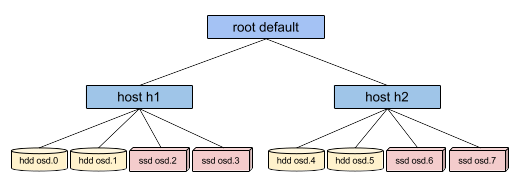

The flexibility of the CRUSH map in controlling data placement in Ceph is one of the system's great strengths.  It is also one of the most painful and awkward parts of the cluster to manage.  Previously, any non-trivial data placement policy required manual editing of the CRUSH map, either to adjust the hierarchy or to write the rules that implement the data placement policy.  In Luminous, we've added a new "device class" feature that automates one of the most common reasons CRUSH maps are directly edited, bringing us much closer to our goal of never requiring administrators to manually modify their CRUSH maps.

### The CRUSH management problem

Ceph clusters are frequently built with multiple types of storage devices: HDDs, SSDs, NVMe's, or even various classes of the above.  We'll call these different types of storage devices _device classes_ to avoid confusion between the _type_ property of CRUSH buckets (e.g., host, rack, row, etc.).  Ceph OSDs backed by SSDs are unsurprisingly much faster than those backed by spinning disks, making them better suited for certain workloads. Ceph makes it easy to create RADOS pools for different data sets or workloads and to assign different CRUSH rules to control data placement for those pools.

However, setting up the CRUSH rules to place data only on a certain class of device is tedious.  Rules work in terms of the CRUSH hierarchy, but if the devices are mixed into the same hosts or racks (as in the sample hierarchy above), they will (by default) be mixed together and appear in the same subtrees of the hierarchy. Manually separating them out into separate trees would previously involve creating multiple versions of each intermediate node for each device class (e.g., both "host h1-ssd" and "host h1-hdd"), and would require the administrator to disable the "_osd crush update on start"_ option that automates much of the CRUSH hierarchy management burden.  It sucked.

### Device classes

To fix this, Luminous adds a new property to each OSD: the _device class_.  By default, OSDs will automatically set their device class to either _hdd_, _ssd_, or _nvme_ (if it has not already been set) based on the hardware properties exposed by the Linux kernel. These device classes are reported in a new column of the _ceph osd tree_ command output:

> $ ceph osd tree
> ID CLASS WEIGHT   TYPE NAME      STATUS REWEIGHT PRI-AFF 
> \-1       83.17899 root default 
> \-4       23.86200     host cpach 
>  2   hdd  1.81898         osd.2      up  1.00000 1.00000 
>  3   hdd  1.81898         osd.3      up  1.00000 1.00000 
>  4   hdd  1.81898         osd.4      up  1.00000 1.00000 
>  5   hdd  1.81898         osd.5      up  1.00000 1.00000 
>  6   hdd  1.81898         osd.6      up  1.00000 1.00000 
>  7   hdd  1.81898         osd.7      up  1.00000 1.00000 
>  8   hdd  1.81898         osd.8      up  1.00000 1.00000 
> 15   hdd  1.81898         osd.15     up  1.00000 1.00000 
> 10  nvme  0.93100         osd.10     up  1.00000 1.00000 
>  0   ssd  0.93100         osd.0      up  1.00000 1.00000 
>  9   ssd  0.93100         osd.9      up  1.00000 1.00000 
> 11   ssd  0.93100         osd.11     up  1.00000 1.00000 
> 12   ssd  0.93100         osd.12     up  1.00000 1.00000 
> 13   ssd  0.93100         osd.13     up  1.00000 1.00000 
> 14   ssd  0.93100         osd.14     up  1.00000 1.00000 
> 16   ssd  0.93100         osd.16     up  1.00000 1.00000 
> 17   ssd  0.93100         osd.17     up  1.00000 1.00000 
> 18   ssd  0.93100         osd.18     up  1.00000 1.00000 
> ... 

If the automatic device class detection gets something wrong (e.g., because the device driver is not properly exposing information about the device via _/sys/block_), you can also adjust device classes from the command line:

> $ ceph osd crush rm-device-class osd.2 osd.3
> done removing class of osd(s): 2,3
> $ ceph osd crush set-device-class ssd osd.2 osd.3
> set osd(s) 2,3 to class 'ssd'

### CRUSH placement rules

CRUSH rules can restrict placement to a specific device class.  For example, we can trivially create a "fast" pool that distributes data only over SSDs (with a failure domain of host) with the command _ceph osd crush rule create-replicated <rule-name> <root> <failure-domain-type> <device-class>_:

> $ ceph osd crush rule create-replicated fast default host ssd

The process for creating erasure code rules is slightly different.  First, you create an erasure code profile that includes a property for your desired device class.  Then use that profile when creating the erasure coded pool.  For example, you might do

> $ ceph osd erasure-code-profile set myprofile k=4 m=2 crush-device-class=ssd crush-failure-domain=host
> $ ceph osd pool create ecpool 64 erasure myprofile

If you must resort to manually editing the CRUSH map to customize your rule, the syntax has been extended to allow the device class to be specified.  For example, the CRUSH rule generated by the above commands looks like:

> rule ecpool {
>     id 2
>     type erasure
>     min\_size 3
>     max\_size 6
>     step set\_chooseleaf\_tries 5
>     step set\_choose\_tries 100
>     step take default **class ssd**
>     step chooseleaf indep 0 type host
>     step emit
> }

The important difference there is the "_take"_ command includes the additional "_class <class-name>"_ suffix.

See the [CRUSH documentation](http://docs.ceph.com/docs/master/rados/operations/crush-map/#device-classes) for more information.

### Backward compatible

One great property of the new device class feature is that it is 100% backward compatible with older clients.  You can start using device classes as soon as you upgrade your cluster to Luminous (and, in fact, OSDs will automatically start annotating the CRUSH map with their device class on upgrade).  Older RBD, CephFS, or other clients using any previous version of Ceph will understand CRUSH rules using the new device classes.

The only restriction is that old versions of the _crushtool_ utility will not understand how to decompile and compile CRUSH maps using device classes, and the cluster's monitors must be running Luminous (or later).

### Management

A few other device class commands are available.  You can list classes:

> $ ceph osd crush class ls
> \[
>   "hdd",
>   "ssd"
> \]

You can list OSDs that belong to a class:

> $ ceph osd crush class ls-osd ssd
> 0
> 1
> ...

You can also rename classes, which safely updates all related elements: the OSD device class properties and the CRUSH rules are updated safely in unison, with the "_ceph osd crush class rename_" command.

### The future

We are striving toward a future where no operator will need to manually edit a CRUSH map: it is tedious, time consuming, and error-prone.  We hope that device classes have removed one big reason why Ceph administrators have had to do so. If you find that you still have a Ceph cluster that requires you to customize CRUSH where the CLI commands are not sufficient, we want to hear about it!
