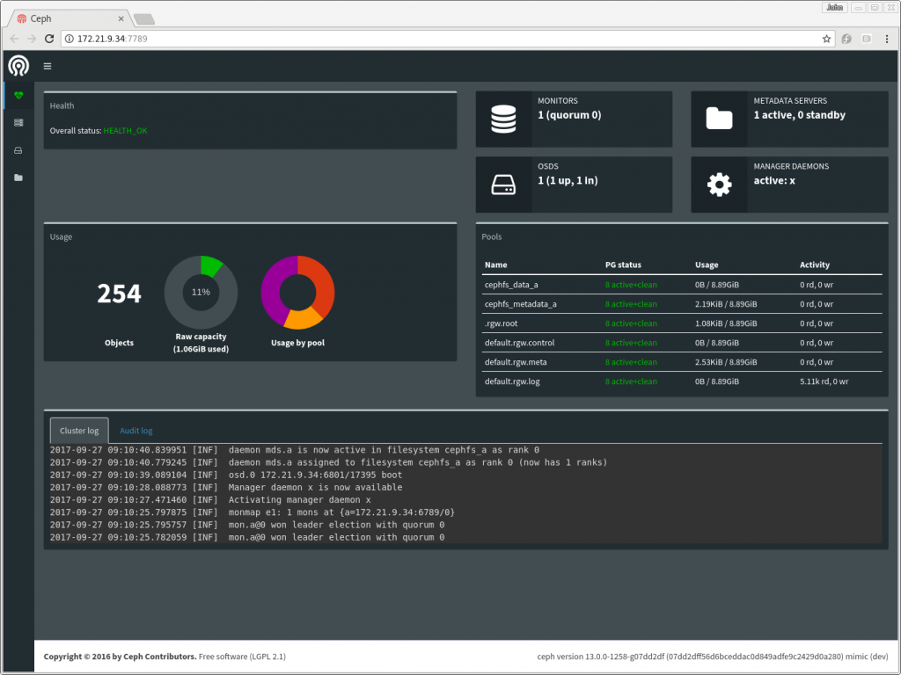
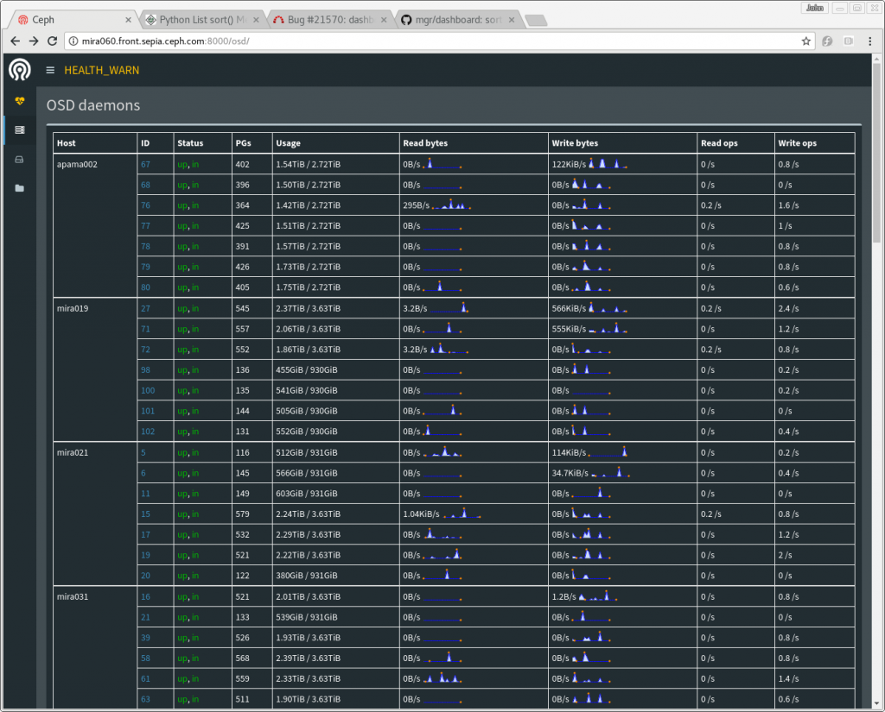
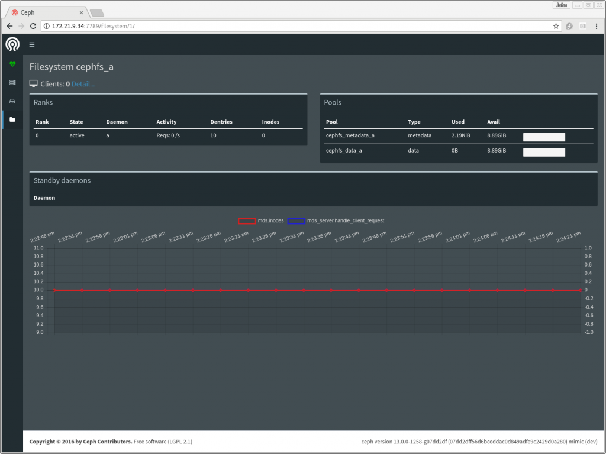
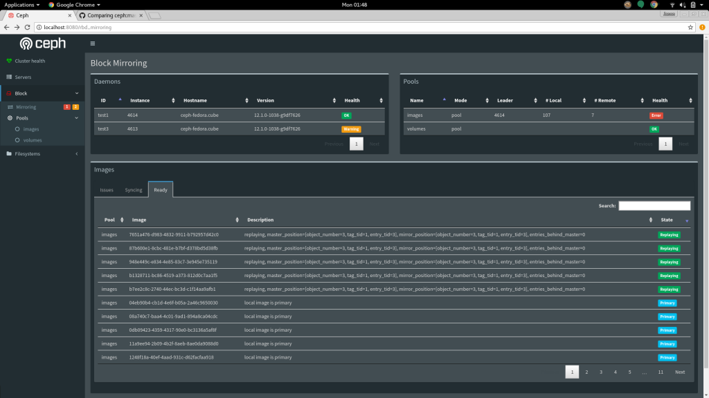

The Ceph manager service (ceph-mgr) was introduced in the Kraken release, and in Luminous it has been extended with a number of new python modules. One of these is a simple monitoring web page, simply called \`dashboard\`.

### Enabling the dashboard module

The dashboard module is included in the ceph-mgr package, so if you've upgraded to Luminous then you already have it! Enabling the dashboard is done with a single command:

> $ ceph mgr module enable dashboard

The dashboard module runs on port 7000 by default. The output of "_ceph status_" will tell you which of your mgr daemons is currently active, so to view the dashboard simply point your browser at \`\`http://<active mgr host>:7000/\`\`

Because the dashboard is read-only, if you are running on a local network then you might choose to do no further network configuration. However, for a higher level of security, you may configure the dashboard module to listen only on a local port, and then install a proxying web server of your choice to provide TLS or access control for remote access.

### A tour of the dashboard

The front page displays the health of the cluster, this is similar to the \`ceph status\` command in the CLI. The cluster log display is showing log messages in a format that hides debug and audit messages: the command line equivalents have also been updated in Luminous to show the log this way by default.

 

Pages for each subsystem are accessible using the menu on the left (you can expand this menu by clicking the menu icon at the top).

The "Cluster" menu section includes a list of servers and a list of OSDs. The server list shows which services are running on which server, and the list of OSDs shows the OSDs by server, with their up/down, in/out status.

The "Filesystem" section expands to show a list of any CephFS filesystems in the cluster. Clicking on a filesystem will take you to a display of that filesystem's status. A list of clients using the filesystem is also available by clicking "Detail" next to the client count at the top of the filesystem page.

The manager keeps a short in-memory history of the last few minutes of performance counters. This enables the dashboard to present some simple charts even if no separate time series database has been installed -- for example, the filesystem page shows a short history of MDS operation rate and cache size.

The "Block" section provides information about RBD images, and about the status of any rbd-mirror or iSCSI services that are running.

### What's next?

Look out for RGW support in the dashboard in the Mimic release.

### Hacking

As always, pull requests are welcome -- the dashboard is built in a deliberately simple way, using minimal javascript to enable contributions from everyone. For more information, please see the [HACKING.rst file in the source tree](https://github.com/ceph/ceph/blob/master/src/pybind/mgr/dashboard/HACKING.rst).

### Learn more

- [ceph-mgr dashboard module documentation](http://docs.ceph.com/docs/master/mgr/dashboard/)
- [ceph-mgr dashboard module source code](https://github.com/ceph/ceph/tree/master/src/pybind/mgr/dashboard)
