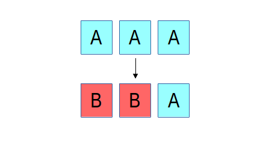
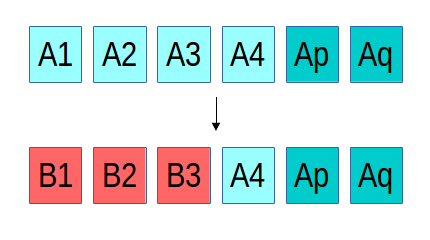

Luminous now fully supports overwrites for erasure coded (EC) RADOS pools, allowing RBD and CephFS (as well as RGW) to directly consume erasure coded pools.  This has the potential to dramatically reduce the overall cost per terabyte of Ceph systems since the usual 3x storage overhead of replication can be reduced to more like 1.2x to 2x, depending on the choice of erasure code.

### Background

Ceph's RADOS object store was originally built around replication--usually 2x or 3x.  This is comparatively simple to implement (although still surprisingly difficult to get right in a CP distributed system!) and served us well for some time.  With the Firefly release (May 2014) we added support for erasure coded (EC) pools.  Erasure codes allow Ceph to stripe object data over _k_ OSDs while adding _m_ additional chunks with encoded redundancy information.  This works like the parity in a traditional RAID system, but erasure codes typically generalize to almost any value of _k_ and _m_ whereas RAID5 fixes _m=1_ and RAID6 fixes _m=2_.  Ceph's erasure codes are implemented via plugins that include conventional Reed-Soloman libraries (with optimizations for Intel and ARM architectures), a [local reconstruction code (LRC)](http://docs.ceph.com/docs/master/rados/operations/erasure-code-lrc/) plugin, and the [SHEC shingled erasure code](http://docs.ceph.com/docs/master/rados/operations/erasure-code-shec/).

However, until now EC pools only allowed object appends and deletions--overwrites were not supported.  This allowed EC pools to be used for RGW object storage and as a cold tier behind a replicated cache tier, but RBD and CephFS could not use EC pools directly.  Given that erasure coding significantly reduces the overall cost per gigabyte of a system, this was less than satisfying for many users.

### Consistency after a failure

The reason for this limitation is the difficulty of maintaining _consistency_, something that Ceph has always been very particular about.  If there is a failure while updating an object that is replicated, recovery is straightforward, regardless of how many or which replicas ended up with the new or the old version of the object.  In the example above, three replicas of an object initially contain the content "A", and then an update overwriting it with "B" is interrupted by a failure such that only two of the three replicas are updated.  We can either roll the third replica forward to _B_ or roll the first two replicas back to _A_; either choice would make the system consistent.  In RADOS, because a replica isn't acknowledged until all replicas are updated, either option would be fine (we currently roll forward).In the case of an erasure coded object, things are a bit more complicated.  Instead of three identical and complete copies of the object, the content is spread over (in the above example) four objects, each with 1/4th of the data, and two erasure objects _p_ and _q_.  If there is failure mid-update and only three of the "A" objects are updated with the new "B" content, we have a problem: a 4+2 erasure code requires any 4 shards to reconstruct the original content, but we have only three of the new and three of the old, such that neither can be reconstructed.  This basic problem is a generalized version of the so-called "RAID hole."  Many systems (even ones used widely in production) sweep this problem under the rug, and most of the time they get away with it, usually because whoever submitted the write before the system crashed will still be there to submit it again and pave over the problem.  We have never found this option acceptable.

In order to recover from such a situation, RADOS has to be able to roll the B1, B2, and B3 objects back to their prior state before the update in order to restore system consistency.  For the existing erasure coded pools we did this by only allowing appends, which meant that we could roll back by truncating off the new content.  Until now, however, maintaining rollback information for data overwrites was expensive to implement: we would need to read the old content, write it to a temporary location, then write the new content, and later (after we're sure all shards have applied the update) discard the temporary rollback data.  With BlueStore, finally, we are free to implement the low-level primitives we need.  In this case, BlueStore simply creates a logical reference to the old about-to-be-overwritten blocks on disk, logically overwrites it with the new data (writing the new content to a new location), and later discards the old reference.  The end result is that after a failure, any partially applied updates can be rolled back so that the data stored in RADOS is always in a consistent state.

### Creating an erasure coded pool with overwrites

Creating an erasure coded pool works much like it did before.  First, you need to decide what erasure code you are going to use.  This usually just means choosing your values of _k_ and _m_.  The _m_ value controls how many failures you can tolerate before you lose data.  Generally speaking, _m_\=2 will provide the same level of data protection that 3x replication offers.  The _k_ value determines how many OSDs each object's data will be striped over.  Larger values of _k_ mean lower storage overhead (because you need to store _k+m_ bytes for every _k_ bytes of user data you store), but larger values also mean that any write (and many reads) need to communicate with that many more devices, increasing latency.

In this example, we will create an erasure coded pool that can be used with RBD.  We choose _k=4_ and _m=2_, which means our storage overhead is 1.5x (half the cost of 3x replication, yay!) but we aren't involving _too_ many OSDs in each IO.

First, we create our [_erasure code profile_](http://docs.ceph.com/docs/master/rados/operations/erasure-code-profile/), which we'll call "ec-42-profile," that also specifies what failure domain and CRUSH device class we'd like to use.  ([Specifying a device class](http://ceph.com/community/new-luminous-crush-device-classes/) is an optional but handy new feature in Luminous.)

> $ ceph osd erasure-code-profile set ec-42-profile k=4 m=2 crush-failure-domain=host crush-device-class=ssd

Then we create our erasure coded pool called "ec42" using this profile:

> $ ceph osd pool create ec42 64 erasure ec-42-profile

This command creates a CRUSH rule based on the profile (which describes our failure domain and device class) with 64 PGs.  You'll likely want to choose a different value for the PGs based on the size of your cluster.

Next, we enable overwrites on the new pool (so that it can be used for RBD or CephFS):

> $ ceph osd pool set ec42 allow\_ec\_overwrites true

### Using EC pools with RBD

To mark this as an RBD pool, [first tag it](http://ceph.com/community/new-luminous-pool-tags/) accordingly:

> $ ceph osd pool application enable rbd ec42

RBD can store image _data_ in EC pools, but the image header and metadata still needs to go in a replicated pool.  Assuming you have the usual pool named "rbd" for this purpose,

> $ rbd create rbd/myimage --size 1T --data-pool ec42

The image can then be used normally just like any other image, except that all of the data will be stored in the "ec42" pool instead of "rbd" pool.  Note that the clients must be using the Luminous (or newer) version of librbd; older releases of Ceph (e.g., Jewel) do not support the data pool feature.

### Using EC pools with CephFS

To mark the pool as a CephFS data pool, tag it:

> $ ceph osd pool application enable ec42 cephfs

Then add it as a data pool for your file system.  Assuming you're using the "default" file system,

> $ ceph fs add\_data\_pool default ec42

You can then mark specific directories that should be stored in the new pool.  For example, if CephFS is mounted on /ceph, and you want everything in /ceph/logs to be stored using the "ec42" pool,

> $ setfattr -n ceph.dir.layout -v pool=ec42 /ceph/logs

That will cause any new file created in /ceph/logs (or any subdirectory beneath that point) to place data in the new pool.

### Using EC pools with RGW

RGW has supported using erasure coded pools for object data since Firefly.  The procedure is no different than before.  The only thing to note is that it is not necessary to enable overwrites on RGW data pools (although doing so won't harm anything).

### How fast is it?

As always, it depends.

If you are writing lots of data into big objects, EC pools are usually faster then replicated pools: less data is being written (only 1.5x what you provided, vs 3x for replication).  The OSD processes consume a lot more CPU than they did before, however, so if your servers are slow you may not realize any speedup.  Large or streaming reads perform about the same as before.

Small writes, however, are slower than replication, for two main reasons.

1. First, all writes have to update the full stripe (all _k + m_ OSDs), which is usually a larger number of OSDs than you would have replicas (6 vs 3, in our example above).  That increases latency.
2. Second, if a write only updates part of a stripe, we need to read in the previous value of the stripe (from all _k + m_ OSDs), make our update, reencode, and then write the updated shards out again.  For this reason we tend to make stripes very small by default (trading some CPU overhead for a lower likelihood of a partial stripe update), but the problem doesn't always go away.  There are several systems out there that sprinkle varying degrees of cleverness on this problem to defer stripe updates or avoid touching unchanged shards, but we haven't implemented anything complicated here yet.

As always, you should try it out on your workload and see how it goes!

### Limitations

At the librados level, erasure coded pools look just like replicated ones, so CephFS and RBD required almost no changes to benefit from this feature.  The one exception is that the "omap" portion of RADOS objects, which allows you to store arbitrary key/value data inside each object, is not supported by EC pools.  This is the reason why RBD images still look like they belong to a normal replicated pool but have the special "data pool" property--the RBD header objects use omap and can't live in an EC pool.

### Summary

Erasure coding is a valuable tool for reducing the overall storage overhead needed to tolerate device failures.  Until now, erasure coding could only be used with RGW for object storage, but starting with Luminous it can also be used for RBD and CephFS workloads.
