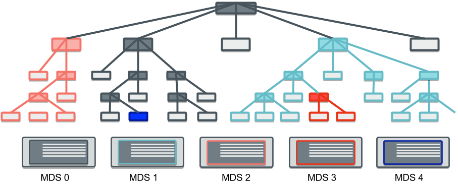
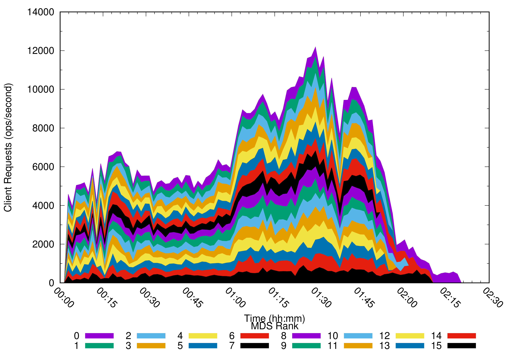

The Ceph file system (CephFS) is the file storage solution for Ceph. Since the Jewel release it has been deemed stable in configurations using a single active metadata server (with one or more standbys for redundancy). Now in Luminous, multiple active metadata servers configurations are stable and ready for deployment! This allows the CephFS metadata operation load capacity to linearly scale with the number of active metadata servers.

By default, newly created file systems use only a single active metadata server but operators may convert to using multiple active metadata servers by increasing the number of ranks on the file system. This can be done using the command:

> $ ceph fs set <fs-name> max\_mds <num>

For example:

> $ ceph fs set cephfs\_a max\_mds 2
> $ ceph fs status
> cephfs\_a - 0 clients
> ========
> +------+--------+-----+---------------+-------+-------+
> | Rank | State  | MDS | Activity      | dns   | inos  |
> +------+--------+-----+---------------+-------+-------+
> | 0    | active | a   | Reqs: 0 /s    |     0 |     0 |
> | 1    | active | b   | Reqs: 0 /s    |     0 |     0 |
> +------+--------+-----+---------------+-------+-------+
> +-------------------+----------+-------+-------+
> | Pool              | type     | used  | avail |
> +-------------------+----------+-------+-------+
> | cephfs\_metadata\_a | metadata |  4098 | 9554M |
> | cephfs\_data\_a     | data     |     0 | 9554M |
> +-------------------+----------+-------+-------+
> +-------------+
> | Standby MDS |
> +-------------+
> | c           |
> +-------------+

### How does Multiple Active Metadata Servers (multimds) work?

A distinguishing feature of CephFS is its ability to carve up the file system tree into subtrees which can each be given to a specific MDS to manage authoritatively. This allows the metadata load on the file system to scale linearly with the number of metadata servers.

Each subtree is created dynamically based on how hot the metadata is in a given directory tree. Once the subtree is created, its metadata is migrated over to an underloaded MDS. Subsequent client requests to the previously authoritative MDS are forwarded.

For those curious, information about the current subtree partitions are available via the admin socket for each MDS:

> $ ceph daemon mds.a get subtrees | jq '.\[\] | \[.dir.path, .auth\_first\]'
> \["", 0\]
> \["~mds0", 0\]
> \["/users/joe", 1\]
> \["~mds0/stray1/10000000001", 1\]

The “” subtree is the root of the file system (“/”) and is always managed by rank 0. The “/users/joe” subtree is being managed by rank 1. (A subtree path beginning with “~” is an internal subtree not part of the file system hierarchy.)

(A word of caution for anyone trying this command at home: please be aware that each MDS does not necessarily have the full picture of the subtrees divisions of the file system. An MDS only needs to know the neighboring subtrees for each of its own subtrees. So, you must run this command on every MDS if you want to perform any kind of analysis on the subtree divisions of the entire file system.)

More information on configuring multiple active metadata servers can be found in the [documentation](http://docs.ceph.com/docs/master/cephfs/multimds/).

### Where can you expect improvements?

Each MDS handles the requests on the subtrees it manages. This allows the cluster of MDSs to handle many more requests than any single MDS could support.

For example, in a distributed experiment of multiple concurrent Linux kernel builds (_tar -x_, _make_, and then _rm -rf_) for independent clients, we observed an even division of the workload across multiple metadata servers. The graph below shows the client requests handled by each MDS (16 ranks) during the course of the experiment.

This was part of the [recent CephFS testing presented at Vault 2017](https://vault2017.sched.com/event/9WQp/large-scale-stability-and-performance-of-the-ceph-file-system-patrick-donnelly-red-hat).

Of course, this kind of “embarrassingly parallel” workload (multiple clients operating in independent directory trees) is somewhat artificial. Not all workloads may benefit, especially when clients cooperate on updates to a single directory or file.

### Conclusions

Using a cluster of metadata servers to cooperatively manage the file system hierarchy has been a [defining aspect of CephFS since its inception](http://dl.acm.org/citation.cfm?id=1049948). The Ceph team has worked hard in the last two years to design new tests and fix any latent bugs to achieve a stable product. We look forward to hearing the community’s success stories and feedback!
