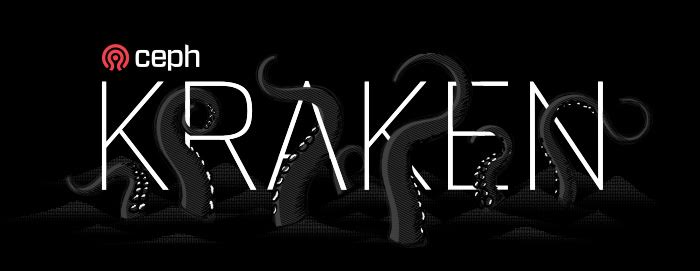

This is the first release of the Kraken series. It is suitable for use in production deployments and will be maintained until the next stable release. The next release, Luminous, will be completed in the Spring of 2017.

[Get 11.2.0 "Kraken"](/get)

### MAJOR CHANGES FROM JEWEL

- _RADOS_:
    - The new _BlueStore_ backend now has a stable disk format and is passing our failure and stress testing. Although the backend is still flagged as experimental, we encourage users to try it out for non-production clusters and non-critical data sets.
    - RADOS now has experimental support for _overwrites on erasure-coded_ pools. Because the disk format and implementation are not yet finalized, there is a special pool option that must be enabled to test the new feature.  Enabling this option on a cluster will permanently bar that cluster from being upgraded to future versions.
    - We now default to the AsyncMessenger (ms type \= async) instead of the legacy SimpleMessenger.  The most noticeable difference is that we now use a fixed sized thread pool for network connections (instead of two threads per socket with SimpleMessenger).
    - Some OSD failures are now detected almost immediately, whereas previously the heartbeat timeout (which defaults to 20 seconds) had to expire.  This prevents IO from blocking for an extended period for failures where the host remains up but the ceph-osd process is no longer running.
    - There is a new ceph-mgr daemon.  It is currently collocated with the monitors by default, and is not yet used for much, but the basic infrastructure is now in place.
    - The size of encoded OSDMaps has been reduced.
    - The OSDs now quiesce scrubbing when recovery or rebalancing is in progress.
- _RGW_:
    - RGW now supports a new zone type that can be used for metadata indexing via ElasticSearch.
    - RGW now supports the S3 multipart object copy-part API.
    - It is possible now to reshard an existing bucket. Note that bucket resharding currently requires that all IO (especially writes) to the specific bucket is quiesced.
    - RGW now supports data compression for objects.
    - Civetweb version has been upgraded to 1.8
    - The Swift static website API is now supported (S3 support has been added previously).
    - S3 bucket lifecycle API has been added. Note that currently it only supports object expiration.
    - Support for custom search filters has been added to the LDAP auth implementation.
    - Support for NFS version 3 has been added to the RGW NFS gateway.
    - A Python binding has been created for librgw.
- _RBD_:
    - RBD now supports images stored in an _erasure-coded_ RADOS pool using the new (experimental) overwrite support. Images must be created using the new rbd CLI “–data-pool <ec pool>” option to specify the EC pool where the backing data objects are stored. Attempting to create an image directly on an EC pool will not be successful since the image’s backing metadata is only supported on a replicated pool.
    - The rbd-mirror daemon now supports replicating dynamic image feature updates and image metadata key/value pairs from the primary image to the non-primary image.
    - The number of image snapshots can be optionally restricted to a configurable maximum.
    - The rbd Python API now supports asynchronous IO operations.
- _CephFS_:
    - libcephfs function definitions have been changed to enable proper uid/gid control. The library version has been increased to reflect the interface change.
    - Standby replay MDS daemons now consume less memory on workloads doing deletions.
    - Scrub now repairs backtrace, and populates damage ls with discovered errors.
    - A new pg\_files subcommand to cephfs-data-scan can identify files affected by a damaged or lost RADOS PG.
    - The false-positive “failing to respond to cache pressure” warnings have been fixed.

### UPGRADING FROM KRAKEN RELEASE CANDIDATE 11.1.0

- The new _BlueStore_ backend had an on-disk format change after 11.1.0. Any BlueStore OSDs created with 11.1.0 will need to be destroyed and recreated.

### UPGRADING FROM JEWEL

- All clusters must first be upgraded to Jewel 10.2.z before upgrading to Kraken 11.2.z (or, eventually, Luminous 12.2.z).
- The sortbitwise flag must be set on the Jewel cluster before upgrading to Kraken. The latest Jewel (10.2.4+) releases issue a health warning if the flag is not set, so this is probably already set. If it is not, Kraken OSDs will refuse to start and will print and error message in their log.
- You may upgrade OSDs, Monitors, and MDSs in any order. RGW daemons should be upgraded last.
- When upgrading, new ceph-mgr daemon instances will be created automatically alongside any monitors. This will be true for Jewel to Kraken and Jewel to Luminous upgrades, but likely not be true for future upgrades beyond Luminous. You are, of course, free to create new ceph-mgr daemon instances and destroy the auto-created ones if you do not with them to be colocated with the ceph-mon daemons.

### BLUESTORE

BlueStore is a new backend for managing data stored by each OSD on the directly hard disk or SSD. Unlike the existing FileStore implementation, which makes use of an XFS file system to store objects as files, BlueStore manages the underlying block device directly. Implements its own file system-like on-disk structure the is designed specifically for Ceph OSD workloads. Key features of BlueStore include:

> - Checksums on all data written to disk, with checksum verifications on all reads, enabled by default.
> - Inline compression support, which can be enabled on a per-pool or per-object basis via pool properties or client hints, respectively.
> - Efficient journaling. Unlike FileStore, which writes _all_ data to its journal device, BlueStore only journals metadata and (in some cases) small writes, reducing the size and throughput requirements for its journal. As with FileStore, the journal can be colocated on the same device as other data or allocated on a smaller, high-performance device (e.g., an SSD or NVMe device). BlueStore journals are only 512 MB by default.

The BlueStore on-disk format is expected to continue to evolve. However, we will provide support in the OSD to migrate to the new format on upgrade.

In order to enable BlueStore, add the following to ceph.conf:

enable experimental unrecoverable data corrupting features = bluestore

To create a BlueStore OSD, pass the –bluestore option to ceph-disk or ceph-deploy during OSD creation.

### UPGRADE NOTES

- The OSDs now avoid starting new scrubs while recovery is in progress. To revert to the old behavior (and do not let recovery activity affect the scrub scheduling) you can set the following option:
    
    osd scrub during recovery = true
    
- The list of monitor hosts/addresses for building the monmap can now be obtained from DNS SRV records. The service name used in when querying the DNS is defined in the “mon\_dns\_srv\_name” config option, which defaults to “ceph-mon”.
    
- The ‘osd class load list’ config option is a list of object class names that the OSD is permitted to load (or ‘\*’ for all classes). By default it contains all existing in-tree classes for backwards compatibility.
    
- The ‘osd class default list’ config option is a list of object class names (or ‘\*’ for all classes) that clients may invoke having only the ‘\*’, ‘x’, ‘class-read’, or ‘class-write’ capabilities. By default it contains all existing in-tree classes for backwards compatibility. Invoking classes not listed in ‘osd class default list’ requires a capability naming the class (e.g. ‘allow class foo’).
    
- The ‘rgw rest getusage op compat’ config option allows you to dump (or not dump) the description of user stats in the S3 GetUsage API. This option defaults to false. If the value is true, the reponse data for GetUsage looks like:
    
    "stats": {
                "TotalBytes": 516,
                "TotalBytesRounded": 1024,
                "TotalEntries": 1
             }
    
    If the value is false, the reponse for GetUsage looks as it did before:
    
    {
         516,
         1024,
         1
    }
    
- The ‘osd out ...’ and ‘osd in ...’ commands now preserve the OSD weight. That is, after marking an OSD out and then in, the weight will be the same as before (instead of being reset to 1.0). Previously the mons would only preserve the weight if the mon automatically marked and OSD out and then in, but not when an admin did so explicitly.
    
- The ‘ceph osd perf’ command will display ‘commit\_latency(ms)’ and ‘apply\_latency(ms)’. Previously, the names of these two columns are ‘fs\_commit\_latency(ms)’ and ‘fs\_apply\_latency(ms)’. We remove the prefix ‘[fs\_](http://docs.ceph.com/docs/master/release-notes/#id2332)‘, because they are not filestore specific.
    
- Monitors will no longer allow pools to be removed by default. The setting mon\_allow\_pool\_delete has to be set to true (defaults to false) before they allow pools to be removed. This is a additional safeguard against pools being removed by accident.
    
- If you have manually specified the monitor user rocksdb via the mon keyvaluedb \= rocksdb option, you will need to manually add a file to the mon data directory to preserve this option:
    
    echo rocksdb > /var/lib/ceph/mon/ceph-\`hostname\`/kv\_backend
    
    New monitors will now use rocksdb by default, but if that file is not present, existing monitors will use leveldb. The mon keyvaluedb option now only affects the backend chosen when a monitor is created.
- The ‘osd crush initial weight’ option allows you to specify a CRUSH weight for a newly added OSD. Previously a value of 0 (the default) meant that we should use the size of the OSD’s store to weight the new OSD. Now, a value of 0 means it should have a weight of 0, and a negative value (the new default) means we should automatically weight the OSD based on its size. If your configuration file explicitly specifies a value of 0 for this option you will need to change it to a negative value (e.g., -1) to preserve the current behavior.
    
- The osd crush location config option is no longer supported. Please update your ceph.conf to use the crush location option instead.
    
- The static libraries are no longer included by the debian development packages (lib\*-dev) as it is not required per debian packaging policy. The shared (.so) versions are packaged as before.
    
- The libtool pseudo-libraries (.la files) are no longer included by the debian development packages (lib\*-dev) as they are not required per [https://wiki.debian.org/ReleaseGoals/LAFileRemoval](https://wiki.debian.org/ReleaseGoals/LAFileRemoval) and [https://www.debian.org/doc/manuals/maint-guide/advanced.en.html](https://www.debian.org/doc/manuals/maint-guide/advanced.en.html).
    
- The jerasure and shec plugins can now detect SIMD instruction at runtime and no longer need to be explicitly configured for different processors. The following plugins are now deprecated: jerasure\_generic, jerasure\_sse3, jerasure\_sse4, jerasure\_neon, shec\_generic, shec\_sse3, shec\_sse4, and shec\_neon. If you use any of these plugins directly you will see a warning in the mon log file. Please switch to using just ‘jerasure’ or ‘shec’.
    
- The librados omap get\_keys and get\_vals operations include a start key and a limit on the number of keys to return. The OSD now imposes a configurable limit on the number of keys and number of total bytes it will respond with, which means that a librados user might get fewer keys than they asked for. This is necessary to prevent careless users from requesting an unreasonable amount of data from the cluster in a single operation. The new limits are configured with osd\_max\_omap\_entries\_per\_request, defaulting to 131,072, and ‘osd\_max\_omap\_bytes\_per\_request’, defaulting to 4MB.
    
- Calculation of recovery priorities has been updated. This could lead to unintuitive recovery prioritization during cluster upgrade. In case of such recovery, OSDs in old version would operate on different priority ranges than new ones. Once upgraded, cluster will operate on consistent values.
    

### NOTABLE CHANGES

- bluestore: add counter to trace blob splitting ([pr#11718](http://github.com/ceph/ceph/pull/11718), xie xingguo)
- bluestore: a few more cleanups ([pr#11780](http://github.com/ceph/ceph/pull/11780), xie xingguo)
- bluestore: avoid polluting shard info if need resharding ([pr#11439](http://github.com/ceph/ceph/pull/11439), xie xingguo)
- bluestore: avoid unnecessary call to init\_csum() ([pr#12015](http://github.com/ceph/ceph/pull/12015), xie xingguo)
- bluestore: ceph-disk: adjust bluestore default device sizes ([pr#12530](http://github.com/ceph/ceph/pull/12530), Sage Weil)
- bluestore: ceph\_test\_objectstore: smaller device ([pr#11591](http://github.com/ceph/ceph/pull/11591), Sage Weil)
- bluestore: clean up Allocator::dump ([issue#18054](http://tracker.ceph.com/issues/18054), [pr#12282](http://github.com/ceph/ceph/pull/12282), Sage Weil)
- bluestore: clear extent map on object removal ([pr#11603](http://github.com/ceph/ceph/pull/11603), Sage Weil)
- bluestore: compressor/ZLibCompressor: fix broken isal-l ([pr#11445](http://github.com/ceph/ceph/pull/11445), Igor Fedotov)
- bluestore: dedup if space overlap truly exists ([pr#11986](http://github.com/ceph/ceph/pull/11986), xie xingguo)
- bluestore: dedup omap\_head, reuse nid instead ([pr#12275](http://github.com/ceph/ceph/pull/12275), xie xingguo)
- bluestore: deep fsck ([pr#11724](http://github.com/ceph/ceph/pull/11724), Sage Weil)
- bluestore: default bluestore\_clone\_cow=true ([pr#11540](http://github.com/ceph/ceph/pull/11540), Sage Weil)
- bluestore: drop inline\_dirty from struct ExtentMap ([pr#11377](http://github.com/ceph/ceph/pull/11377), xie xingguo)
- bluestore: drop member “space” from Onode ([pr#12185](http://github.com/ceph/ceph/pull/12185), xie xingguo)
- bluestore: fix alloc release timing on sync submits ([pr#11983](http://github.com/ceph/ceph/pull/11983), Sage Weil)
- bluestore: fix bufferspace stats leak due to blob splitting ([pr#12039](http://github.com/ceph/ceph/pull/12039), xie xingguo)
- bluestore: fix collection\_list end bound off-by-one ([pr#11771](http://github.com/ceph/ceph/pull/11771), Sage Weil)
- bluestore: fix compiler warnings ([pr#11905](http://github.com/ceph/ceph/pull/11905), xie xingguo)
- bluestore: fixes and cleanups ([pr#11761](http://github.com/ceph/ceph/pull/11761), xie xingguo)
- bluestore: fix escaping of chars > 0x80 ([pr#11502](http://github.com/ceph/ceph/pull/11502), Sage Weil)
- bluestore: fix extent shard span check ([pr#11725](http://github.com/ceph/ceph/pull/11725), Sage Weil)
- bluestore: fix has\_aios ([pr#11317](http://github.com/ceph/ceph/pull/11317), Sage Weil)
- bluestore: Fix invalid compression statfs caused by clone op ([pr#11351](http://github.com/ceph/ceph/pull/11351), Igor Fedotov)
- bluestore: fix lack of resharding ([pr#11597](http://github.com/ceph/ceph/pull/11597), Igor Fedotov)
- bluestore: fix latency calculation ([pr#12040](http://github.com/ceph/ceph/pull/12040), Pan Liu)
- bluestore: fix onode vs extent key suffix ([pr#11452](http://github.com/ceph/ceph/pull/11452), Sage Weil)
- bluestore: fix potential memory leak ([pr#11893](http://github.com/ceph/ceph/pull/11893), xie xingguo)
- bluestore: fix race condtion during blob spliting ([pr#11422](http://github.com/ceph/ceph/pull/11422), xiexingguo, xie xingguo)
- bluestore: fix remove\_collection to properly detect collection e… ([pr#11398](http://github.com/ceph/ceph/pull/11398), Igor Fedotov)
- bluestore: fix \_split\_collections race with osr\_reap ([pr#11748](http://github.com/ceph/ceph/pull/11748), Sage Weil)
- bluestore: fix up compression tests and debug output ([pr#11350](http://github.com/ceph/ceph/pull/11350), Sage Weil)
- bluestore: fix writes that span existing shard boundaries ([pr#11451](http://github.com/ceph/ceph/pull/11451), Sage Weil)
- bluestore: flush before enumerating omap values ([issue#18140](http://tracker.ceph.com/issues/18140), [pr#12328](http://github.com/ceph/ceph/pull/12328), Sage Weil)
- bluestore: formatting nits ([pr#11514](http://github.com/ceph/ceph/pull/11514), xie xingguo)
- bluestore: fsck: fix omap\_head check ([pr#11726](http://github.com/ceph/ceph/pull/11726), Sage Weil)
- bluestore: GC infra refactor, more UTs and GC range calculation fixes ([pr#11482](http://github.com/ceph/ceph/pull/11482), Igor Fedotov)
- bluestore: KernelDevice: fix race in aio\_thread vs aio\_wait ([issue#17824](http://tracker.ceph.com/issues/17824), [pr#12204](http://github.com/ceph/ceph/pull/12204), Sage Weil)
- bluestore: kv: dump rocksdb stats ([pr#12287](http://github.com/ceph/ceph/pull/12287), Varada Kari, Jianpeng Ma, Sage Weil)
- bluestore: kv/rocksdb: enable rocksdb write path breakdown ([pr#11696](http://github.com/ceph/ceph/pull/11696), Haodong Tang)
- bluestore: kv/RocksDBStore: rename option ([pr#11769](http://github.com/ceph/ceph/pull/11769), Sage Weil)
- bluestore: less code redundancy ([pr#11740](http://github.com/ceph/ceph/pull/11740), xie xingguo)
- bluestore: make 2q cache kin/kout size tunable ([pr#11599](http://github.com/ceph/ceph/pull/11599), Haodong Tang)
- bluestore: mark ops that can’t tolerate ENOENT ([pr#12114](http://github.com/ceph/ceph/pull/12114), Sage Weil)
- bluestore: mempool: changes for bitmap allocator ([pr#11922](http://github.com/ceph/ceph/pull/11922), Ramesh Chander)
- bluestore: misc. fixes and cleanups ([pr#11964](http://github.com/ceph/ceph/pull/11964), xie xingguo)
- bluestore: move bluefs into its own mempool ([pr#11834](http://github.com/ceph/ceph/pull/11834), Sage Weil)
- bluestore: no garbage collection for uncompressed blobs ([pr#11539](http://github.com/ceph/ceph/pull/11539), Roushan Ali, Sage Weil)
- bluestore: optional debug mode to identify aio stalls ([pr#11818](http://github.com/ceph/ceph/pull/11818), Sage Weil)
- bluestore: os/bluestore: a few cleanups ([pr#11483](http://github.com/ceph/ceph/pull/11483), Sage Weil)
- bluestore: os/bluestore: avoid resharding if the last shard size fall below shar… ([pr#12447](http://github.com/ceph/ceph/pull/12447), Igor Fedotov)
- bluestore: os/bluestore: bitmap allocator dump functionality ([pr#12298](http://github.com/ceph/ceph/pull/12298), Ramesh Chander)
- bluestore: os/bluestore: bluestore\_sync\_submit\_transaction = false ([pr#12367](http://github.com/ceph/ceph/pull/12367), Sage Weil)
- bluestore: os/bluestore: cleanup around Blob::ref\_map ([pr#11896](http://github.com/ceph/ceph/pull/11896), Igor Fedotov)
- bluestore: os/bluestore: clear omap flag if parent has none ([pr#12351](http://github.com/ceph/ceph/pull/12351), xie xingguo)
- bluestore: os/bluestore: don’t implicitly create the source object for clone ([pr#12353](http://github.com/ceph/ceph/pull/12353), xie xingguo)
- bluestore: os/bluestore: drop old bluestore preconditioning; replace with wal preextension of file size ([pr#12265](http://github.com/ceph/ceph/pull/12265), Sage Weil)
- bluestore: os/bluestore: fix global commit latency ([pr#12356](http://github.com/ceph/ceph/pull/12356), xie xingguo)
- bluestore: os/bluestore: fix ondisk encoding for blobs ([pr#12488](http://github.com/ceph/ceph/pull/12488), Varada Kari, Sage Weil)
- bluestore: os/bluestore: fix potential csum\_order overflow ([pr#12333](http://github.com/ceph/ceph/pull/12333), xie xingguo)
- bluestore: os/bluestore: fix target\_buffer value overflow in Cache::trim() ([pr#12507](http://github.com/ceph/ceph/pull/12507), Igor Fedotov)
- bluestore: os/bluestore: include modified objects in flush list even if onode unchanged ([pr#12541](http://github.com/ceph/ceph/pull/12541), Sage Weil)
- bluestore: os/bluestore: kill dead gc-related counters ([pr#12065](http://github.com/ceph/ceph/pull/12065), xie xingguo)
- bluestore: os/bluestore: kill overlay related options ([pr#11557](http://github.com/ceph/ceph/pull/11557), xie xingguo)
- bluestore: os/bluestore: misc coverity fixes/cleanups ([pr#12202](http://github.com/ceph/ceph/pull/12202), Sage Weil)
- bluestore: os/bluestore: preserve source collection cache during split ([pr#12574](http://github.com/ceph/ceph/pull/12574), Sage Weil)
- bluestore: os/bluestore: remove ‘extents’ from shard\_info ([pr#12629](http://github.com/ceph/ceph/pull/12629), Sage Weil)
- bluestore: os/bluestore: simplified allocator interfaces to single apis ([pr#12355](http://github.com/ceph/ceph/pull/12355), Ramesh Chander)
- bluestore: os/bluestore: simplify allocator release flow ([pr#12343](http://github.com/ceph/ceph/pull/12343), Sage Weil)
- bluestore: os/bluestore: simplify can\_split\_at() ([pr#11607](http://github.com/ceph/ceph/pull/11607), xie xingguo)
- bluestore: os/bluestore: use iterator for erase() method directly ([pr#11490](http://github.com/ceph/ceph/pull/11490), xie xingguo)
- bluestore: os/kstore: rmcoll fix to satisfy store\_test ([pr#11533](http://github.com/ceph/ceph/pull/11533), Igor Fedotov)
- bluestore: os: make filestore\_blackhole -> objectstore\_blackhole ([pr#11788](http://github.com/ceph/ceph/pull/11788), Sage Weil)
- bluestore: os: move\_ranges\_destroy\_src ([pr#11237](http://github.com/ceph/ceph/pull/11237), Manali Kulkarni, Sage Weil)
- bluestore: readability improvements and doxygen fix ([pr#11895](http://github.com/ceph/ceph/pull/11895), xie xingguo)
- bluestore: reap collection after all pending ios done ([pr#11797](http://github.com/ceph/ceph/pull/11797), Haomai Wang)
- bluestore: reap ioc when stopping aio\_thread. ([pr#11811](http://github.com/ceph/ceph/pull/11811), Haodong Tang)
- bluestore: refactor \_do\_write(); move initializaiton of csum out of loop ([pr#11823](http://github.com/ceph/ceph/pull/11823), xie xingguo)
- bluestore: remove duplicated namespace of tx state ([pr#11845](http://github.com/ceph/ceph/pull/11845), xie xingguo)
- bluestore: remove garbage collector staff ([pr#12042](http://github.com/ceph/ceph/pull/12042), Igor Fedotov)
- bluestore: set next object as ghobject\_t::get\_max() when start.hobj.i… ([pr#11495](http://github.com/ceph/ceph/pull/11495), Xinze Chi, Haomai Wang)
- bluestore: simplify blob status checking for small writes ([pr#11366](http://github.com/ceph/ceph/pull/11366), xie xingguo)
- bluestore: some more cleanups ([pr#11910](http://github.com/ceph/ceph/pull/11910), xie xingguo)
- bluestore: spdk: a few fixes ([pr#11882](http://github.com/ceph/ceph/pull/11882), Yehuda Sadeh)
- bluestore: speed up omap-key generation for same onode ([pr#11807](http://github.com/ceph/ceph/pull/11807), xie xingguo)
- bluestore: traverse buffer\_map in reverse order when spliting BufferSpace ([pr#11468](http://github.com/ceph/ceph/pull/11468), xie xingguo)
- bluestore: update cache logger after ‘trim\_cache’ operation ([pr#11695](http://github.com/ceph/ceph/pull/11695), Haodong Tang)
- bluestore: use bitmap allocator for bluefs ([pr#12285](http://github.com/ceph/ceph/pull/12285), Sage Weil)
- bluestore: use std::unordered\_map for SharedBlob lookup ([pr#11394](http://github.com/ceph/ceph/pull/11394), Sage Weil)
- build/ops: AArch64: Detect crc32 extension support from assembler ([issue#17516](http://tracker.ceph.com/issues/17516), [pr#11391](http://github.com/ceph/ceph/pull/11391), Alexander Graf)
- build/ops: boost: embedded ([pr#11817](http://github.com/ceph/ceph/pull/11817), Sage Weil, Matt Benjamin)
- build/ops: build: dump env during build ([issue#18084](http://tracker.ceph.com/issues/18084), [pr#12284](http://github.com/ceph/ceph/pull/12284), Sage Weil)
- build/ops: ceph-detect-init: FreeBSD introduction of bsdrc ([pr#11906](http://github.com/ceph/ceph/pull/11906), Willem Jan Withagen, Kefu Chai)
- build/ops: ceph-disk: enable –runtime ceph-osd systemd units ([issue#17889](http://tracker.ceph.com/issues/17889), [pr#12241](http://github.com/ceph/ceph/pull/12241), Loic Dachary)
- build/ops: ceph.spec: add pybind rgwfile ([pr#11847](http://github.com/ceph/ceph/pull/11847), Haomai Wang)
- build/ops,cleanup,bluestore: os/bluestore: remove build warning in a better way ([pr#11920](http://github.com/ceph/ceph/pull/11920), Igor Fedotov)
- build/ops: CMakeLists: add vstart-base target ([pr#12476](http://github.com/ceph/ceph/pull/12476), Sage Weil)
- build/ops: CMakeLists.txt: enable LTTNG by default ([pr#11500](http://github.com/ceph/ceph/pull/11500), Sage Weil)
- build/ops: common/buffer.cc: raw\_pipe depends on splice(2) ([pr#11967](http://github.com/ceph/ceph/pull/11967), Willem Jan Withagen)
- build/ops,common: common/str\_list.h: fix clang warning about std::move ([pr#12570](http://github.com/ceph/ceph/pull/12570), Willem Jan Withagen)
- build/ops,core: xio: fix build ([pr#11768](http://github.com/ceph/ceph/pull/11768), Matt Benjamin)
- build/ops: deb: add python dependencies where needed ([issue#17579](http://tracker.ceph.com/issues/17579), [pr#11507](http://github.com/ceph/ceph/pull/11507), Nathan Cutler, Kefu Chai)
- build/ops: deb: add python-rgw packages ([pr#11832](http://github.com/ceph/ceph/pull/11832), Sage Weil)
- build/ops: debian: apply dh\_python to python-rgw also ([pr#12260](http://github.com/ceph/ceph/pull/12260), Kefu Chai)
- build/ops: deb: update python-rgw dependencies to librgw2 ([pr#11885](http://github.com/ceph/ceph/pull/11885), Casey Bodley)
- build/ops: do\_freebsd.sh: Build with SYSTEM Boost on FreeBSD ([pr#11942](http://github.com/ceph/ceph/pull/11942), Willem Jan Withagen)
- build/ops: do\_freebsd.sh: Do not use LTTNG on FreeBSD ([pr#11551](http://github.com/ceph/ceph/pull/11551), Willem Jan Withagen)
- build/ops: do\_freebsd.sh: Set options for debug building. ([pr#11443](http://github.com/ceph/ceph/pull/11443), Willem Jan Withagen)
- build/ops: FreeBSD: do\_freebsd.sh ([pr#12090](http://github.com/ceph/ceph/pull/12090), Willem Jan Withagen)
- build/ops: FreeBSD:test/encoding/readable.sh”: fix nproc and ls -v calls ([pr#11522](http://github.com/ceph/ceph/pull/11522), Willem Jan Withagen)
- build/ops: FreeBSD: update require packages ([pr#11512](http://github.com/ceph/ceph/pull/11512), Willem Jan Withagen)
- build/ops: git-archive-all.sh: use an actually unique tmp dir ([pr#12011](http://github.com/ceph/ceph/pull/12011), Dan Mick)
- build/ops: include/enc: make clang happy ([pr#11638](http://github.com/ceph/ceph/pull/11638), Kefu Chai, Sage Weil)
- build/ops: install-deps.sh: allow building on SLES systems ([pr#11708](http://github.com/ceph/ceph/pull/11708), Nitin A Kamble)
- build/ops: install-deps.sh: JQ is needed in one script ([pr#12080](http://github.com/ceph/ceph/pull/12080), Willem Jan Withagen)
- build/ops: Log: Replace namespace log with logging ([pr#11650](http://github.com/ceph/ceph/pull/11650), Willem Jan Withagen)
- build/ops: Merging before make check because it clearly breaks the build and the build part is done ([pr#11924](http://github.com/ceph/ceph/pull/11924), Sage Weil)
- build/ops: ok, w/upstream acks, merging–jenkins build did succeed (this is a build-only change) ([pr#12008](http://github.com/ceph/ceph/pull/12008), Matt Benjamin)
- build/ops: qa: Add ceph-ansible installer. ([issue#16770](http://tracker.ceph.com/issues/16770), [pr#10402](http://github.com/ceph/ceph/pull/10402), Warren Usui)
- build/ops: rocksdb: do not build with –march=native ([pr#11677](http://github.com/ceph/ceph/pull/11677), Kefu Chai)
- build/ops: rocksdb: update to latest ([pr#12100](http://github.com/ceph/ceph/pull/12100), Kefu Chai)
- build/ops: rpm: Remove trailing whitespace in usermod command (SUSE) ([pr#10707](http://github.com/ceph/ceph/pull/10707), Tim Serong)
- build/ops: scripts/release-notes: allow title guesses from gh tags & description update ([pr#11399](http://github.com/ceph/ceph/pull/11399), Abhishek Lekshmanan)
- build/ops: systemd: Fix startup of ceph-mgr on Debian 8 ([pr#12555](http://github.com/ceph/ceph/pull/12555), Mark Korenberg)
- build/ops: tracing/objectstore.tp: add missing [move\_ranges\_](http://docs.ceph.com/docs/master/release-notes/#id2334)... tp ([pr#11484](http://github.com/ceph/ceph/pull/11484), Sage Weil)
- build/ops: upstart: fix ceph-crush-location default ([issue#6698](http://tracker.ceph.com/issues/6698), [pr#803](http://github.com/ceph/ceph/pull/803), Jason Dillaman)
- build/ops: upstart: start ceph-all after static-network-up ([issue#17689](http://tracker.ceph.com/issues/17689), [pr#11631](http://github.com/ceph/ceph/pull/11631), Billy Olsen)
- cephfs: add gid to asok status ([pr#11487](http://github.com/ceph/ceph/pull/11487), Patrick Donnelly)
- cephfs: API cleanup for libcephfs interfaces ([issue#17911](http://tracker.ceph.com/issues/17911), [pr#12106](http://github.com/ceph/ceph/pull/12106), Jeff Layton)
- cephfs: ceph-fuse: start up log on parent process before shutdown ([issue#18157](http://tracker.ceph.com/issues/18157), [pr#12347](http://github.com/ceph/ceph/pull/12347), Greg Farnum)
- cephfs: ceph\_fuse: use sizeof get the buf length ([pr#11176](http://github.com/ceph/ceph/pull/11176), LeoZhang)
- cephfs,cleanup: ceph-fuse: start up log on parent process before shutdown ([issue#18157](http://tracker.ceph.com/issues/18157), [pr#12358](http://github.com/ceph/ceph/pull/12358), Kefu Chai)
- cephfs: client: add pid to metadata ([issue#17276](http://tracker.ceph.com/issues/17276), [pr#11359](http://github.com/ceph/ceph/pull/11359), Patrick Donnelly)
- cephfs: client: Client.cc: remove duplicated op type checking against CEPH\_MD… ([pr#11608](http://github.com/ceph/ceph/pull/11608), Weibing Zhang)
- cephfs: client: don’t take extra target inode reference in ll\_link ([pr#11440](http://github.com/ceph/ceph/pull/11440), Jeff Layton)
- cephfs: client: fix mutex name typos ([pr#12401](http://github.com/ceph/ceph/pull/12401), Yunchuan Wen)
- cephfs: client: get caller’s uid/gid on every libcephfs operation ([issue#17591](http://tracker.ceph.com/issues/17591), [pr#11526](http://github.com/ceph/ceph/pull/11526), Yan, Zheng)
- cephfs: client: get gid from MonClient ([pr#11486](http://github.com/ceph/ceph/pull/11486), Patrick Donnelly)
- cephfs: client: improve failure messages/debugging ([pr#12110](http://github.com/ceph/ceph/pull/12110), Patrick Donnelly)
- cephfs: client/mds: Clear setuid bits when writing or truncating ([issue#18131](http://tracker.ceph.com/issues/18131), [pr#12412](http://github.com/ceph/ceph/pull/12412), Jeff Layton)
- cephfs: client: put CapSnap not ptr in cap\_snaps map ([pr#12111](http://github.com/ceph/ceph/pull/12111), Patrick Donnelly)
- cephfs: client: remove redundant initialization ([pr#12028](http://github.com/ceph/ceph/pull/12028), Patrick Donnelly)
- cephfs: client: remove unnecessary bufferptr\[\] for writev ([pr#11836](http://github.com/ceph/ceph/pull/11836), Patrick Donnelly)
- cephfs: client: remove unneeded layout on MClientCaps ([pr#11790](http://github.com/ceph/ceph/pull/11790), John Spray)
- cephfs: client: set metadata\[“root”\] from mount method when it’s called with … ([pr#12505](http://github.com/ceph/ceph/pull/12505), Jeff Layton)
- cephfs: client: trim\_caps() do not dereference cap if it’s removed ([pr#12145](http://github.com/ceph/ceph/pull/12145), Kefu Chai)
- cephfs: client: use unique\_ptr ([pr#11837](http://github.com/ceph/ceph/pull/11837), Patrick Donnelly)
- cephfs: common/ceph\_string: add ceph string constants for CEPH\_SESSION\_FORCE\_RO ([pr#11516](http://github.com/ceph/ceph/pull/11516), Zhi Zhang)
- cephfs: Fix #17562 (backtrace check fails when scrubbing directory created by fsstress) ([issue#17562](http://tracker.ceph.com/issues/17562), [pr#11517](http://github.com/ceph/ceph/pull/11517), Yan, Zheng)
- cephfs: fix missing ll\_get for ll\_walk ([issue#18086](http://tracker.ceph.com/issues/18086), [pr#12061](http://github.com/ceph/ceph/pull/12061), Gui Hecheng)
- cephfs: get new fsmap after marking clusters down ([issue#7271](http://tracker.ceph.com/issues/7271), [issue#17894](http://tracker.ceph.com/issues/17894), [pr#1262](http://github.com/ceph/ceph/pull/1262), Patrick Donnelly)
- cephfs: Have ceph clear setuid/setgid bits on chown ([issue#18131](http://tracker.ceph.com/issues/18131), [pr#12331](http://github.com/ceph/ceph/pull/12331), Jeff Layton)
- cephfs: libcephfs: add ceph\_fsetattr&&ceph\_lchmod&&ceph\_lutime ([pr#11191](http://github.com/ceph/ceph/pull/11191), huanwen ren)
- cephfs: libcephfs: add readlink function in cephfs.pyx ([pr#12384](http://github.com/ceph/ceph/pull/12384), huanwen ren)
- cephfs: libcephfs and test suite fixes ([issue#18013](http://tracker.ceph.com/issues/18013), [issue#17982](http://tracker.ceph.com/issues/17982), [pr#12228](http://github.com/ceph/ceph/pull/12228), Jeff Layton)
- cephfs: libcephfs client API overhaul and update ([pr#11647](http://github.com/ceph/ceph/pull/11647), Jeff Layton)
- cephfs: lua: use simpler lua\_next traversal structure ([pr#11958](http://github.com/ceph/ceph/pull/11958), Patrick Donnelly)
- cephfs: mds/Beacon: move C\_MDS\_BeaconSender class to .cc ([pr#10940](http://github.com/ceph/ceph/pull/10940), Michal Jarzabek)
- cephfs: mds/CDir.cc: remove unneeded use of count ([pr#11613](http://github.com/ceph/ceph/pull/11613), Michal Jarzabek)
- cephfs: mds/CInode.h: remove unneeded use of count ([pr#11371](http://github.com/ceph/ceph/pull/11371), Michal Jarzabek)
- cephfs: mds/DamageTable.cc: move shared ptrs ([pr#11435](http://github.com/ceph/ceph/pull/11435), Michal Jarzabek)
- cephfs: mds/DamageTable.cc: remove unneeded use of count ([pr#11625](http://github.com/ceph/ceph/pull/11625), Michal Jarzabek)
- cephfs: mds/DamageTable: move classes to .cc file ([pr#11450](http://github.com/ceph/ceph/pull/11450), Michal Jarzabek)
- cephfs: mds/flock: add const to member functions ([pr#11692](http://github.com/ceph/ceph/pull/11692), Michal Jarzabek)
- cephfs: mds/FSMap.cc: remove unneeded use of count ([pr#11402](http://github.com/ceph/ceph/pull/11402), Michal Jarzabek)
- cephfs: mds/FSMapUser.h: remove copy ctr and assign op ([pr#11509](http://github.com/ceph/ceph/pull/11509), Michal Jarzabek)
- cephfs: mds/InfoTable.h: add override to virtual functs ([pr#11496](http://github.com/ceph/ceph/pull/11496), Michal Jarzabek)
- cephfs: mds/InoTable.h: add override to virtual functs ([pr#11604](http://github.com/ceph/ceph/pull/11604), Michal Jarzabek)
- cephfs: mds/Mantle.h: include correct header files ([pr#11886](http://github.com/ceph/ceph/pull/11886), Michal Jarzabek)
- cephfs: mds/Mantle: pass parameters by const ref ([pr#11713](http://github.com/ceph/ceph/pull/11713), Michal Jarzabek)
- cephfs: mds/MDCache.h: remove unneeded call to clear func ([pr#11954](http://github.com/ceph/ceph/pull/11954), Michal Jarzabek)
- cephfs: mds/MDCache.h: remove unused functions ([pr#11908](http://github.com/ceph/ceph/pull/11908), Michal Jarzabek)
- cephfs: mds/MDLog: add const to member functions ([pr#11663](http://github.com/ceph/ceph/pull/11663), Michal Jarzabek)
- cephfs: mds/MDSMap.h: add const to member functions ([pr#11511](http://github.com/ceph/ceph/pull/11511), Michal Jarzabek)
- cephfs: mds/MDSRank: add const to member functions ([pr#11752](http://github.com/ceph/ceph/pull/11752), Michal Jarzabek)
- cephfs: mds/MDSRank.h: add override to virtual function ([pr#11727](http://github.com/ceph/ceph/pull/11727), Michal Jarzabek)
- cephfs: mds/MDSRank.h: make destructor protected ([pr#11651](http://github.com/ceph/ceph/pull/11651), Michal Jarzabek)
- cephfs: mds/MDSTableClient.h: add const to member funct ([pr#11681](http://github.com/ceph/ceph/pull/11681), Michal Jarzabek)
- cephfs: mds/Migrator.cc: remove unneeded use of count ([pr#11523](http://github.com/ceph/ceph/pull/11523), Michal Jarzabek)
- cephfs: mds/Migrator.h: add const to member functions ([pr#11819](http://github.com/ceph/ceph/pull/11819), Michal Jarzabek)
- cephfs: mds/Migrator.h: remove unneeded use of count ([pr#11833](http://github.com/ceph/ceph/pull/11833), Michal Jarzabek)
- cephfs: mds/Mutation.h: add const to member functions ([pr#11670](http://github.com/ceph/ceph/pull/11670), Michal Jarzabek)
- cephfs: mds/Mutation.h: simplify constructors ([pr#11455](http://github.com/ceph/ceph/pull/11455), Michal Jarzabek)
- cephfs: MDS: reduce usage of context wrapper ([pr#11560](http://github.com/ceph/ceph/pull/11560), Yan, Zheng)
- cephfs: mds/ScrubHeader.h: pass string by const reference ([pr#11904](http://github.com/ceph/ceph/pull/11904), Michal Jarzabek)
- cephfs: mds/server: merge the snapshot request judgment ([pr#11150](http://github.com/ceph/ceph/pull/11150), huanwen ren)
- cephfs: mds/SessionMap: add const to member functions ([pr#11541](http://github.com/ceph/ceph/pull/11541), Michal Jarzabek)
- cephfs: mds/SessionMap.cc: avoid copying and add const ([pr#11297](http://github.com/ceph/ceph/pull/11297), Michal Jarzabek)
- cephfs: mds/SessionMap.cc:put classes in unnamed namespace ([pr#11316](http://github.com/ceph/ceph/pull/11316), Michal Jarzabek)
- cephfs: mds/SessionMap.cc: remove unneeded use of count ([pr#11338](http://github.com/ceph/ceph/pull/11338), Michal Jarzabek)
- cephfs: mds/SessionMap.h: remove unneeded function ([pr#11565](http://github.com/ceph/ceph/pull/11565), Michal Jarzabek)
- cephfs: mds/SessionMap.h: remove unneeded use of count ([pr#11358](http://github.com/ceph/ceph/pull/11358), Michal Jarzabek)
- cephfs: mds/SnapRealm: remove unneeded use of count ([pr#11609](http://github.com/ceph/ceph/pull/11609), Michal Jarzabek)
- cephfs: mds/SnapServer.h: add override to virtual functs ([pr#11380](http://github.com/ceph/ceph/pull/11380), Michal Jarzabek)
- cephfs: mds/SnapServer.h: add override to virtual functs ([pr#11583](http://github.com/ceph/ceph/pull/11583), Michal Jarzabek)
- cephfs: mon/MDSMonitor: fix iterating over mutated map ([issue#18166](http://tracker.ceph.com/issues/18166), [pr#12395](http://github.com/ceph/ceph/pull/12395), John Spray)
- cephfs: multimds: fix state check in Migrator::find\_stale\_export\_freeze() ([pr#12098](http://github.com/ceph/ceph/pull/12098), Yan, Zheng)
- cephfs: osdc: After write try merge bh. ([issue#17270](http://tracker.ceph.com/issues/17270), [pr#11545](http://github.com/ceph/ceph/pull/11545), Jianpeng Ma)
- cephfs: Partial organization of mds/ header sections ([pr#11959](http://github.com/ceph/ceph/pull/11959), Patrick Donnelly)
- cephfs: Port/bootstrap ([pr#827](http://github.com/ceph/ceph/pull/827), Yan, Zheng)
- cephfs: Revert “osdc: After write try merge bh.” ([issue#17270](http://tracker.ceph.com/issues/17270), [pr#11262](http://github.com/ceph/ceph/pull/11262), John Spray)
- cephfs: Small pile of random cephfs fixes and cleanup ([pr#11421](http://github.com/ceph/ceph/pull/11421), Jeff Layton)
- cephfs: src/mds: fix MDSMap upgrade decoding ([issue#17837](http://tracker.ceph.com/issues/17837), [pr#12097](http://github.com/ceph/ceph/pull/12097), John Spray)
- cephfs: systemd: add ceph-fuse service file ([pr#11542](http://github.com/ceph/ceph/pull/11542), Patrick Donnelly)
- cephfs: test fragment size limit ([issue#16164](http://tracker.ceph.com/issues/16164), [pr#1069](http://github.com/ceph/ceph/pull/1069), Patrick Donnelly)
- cephfs: test readahead is working ([issue#16024](http://tracker.ceph.com/issues/16024), [pr#1046](http://github.com/ceph/ceph/pull/1046), Patrick Donnelly)
- cephfs: test: temporarily remove fork()ing flock tests ([issue#16556](http://tracker.ceph.com/issues/16556), [pr#11211](http://github.com/ceph/ceph/pull/11211), John Spray)
- cephfs: tool/cephfs: displaying “list” in journal event mode ([pr#11236](http://github.com/ceph/ceph/pull/11236), huanwen ren)
- cephfs: tools/cephfs: add pg\_files command ([issue#17249](http://tracker.ceph.com/issues/17249), [pr#11026](http://github.com/ceph/ceph/pull/11026), John Spray)
- cephfs: tools/cephfs: add scan\_links command which fixes linkages errors ([pr#11446](http://github.com/ceph/ceph/pull/11446), Yan, Zheng)
- cephfs: update tests to enable multimds when needed ([pr#933](http://github.com/ceph/ceph/pull/933), Greg Farnum)
- cleanup: build: The Light Clangtastic ([pr#11921](http://github.com/ceph/ceph/pull/11921), Adam C. Emerson)
- cleanup,common: common/blkdev: use realpath instead of readlink to resolve the recurs… ([pr#12462](http://github.com/ceph/ceph/pull/12462), Xinze Chi)
- cleanup,common: common/throttle: simplify Throttle::\_wait() ([pr#11165](http://github.com/ceph/ceph/pull/11165), xie xingguo)
- cleanup,common: src/common: remove nonused config option ([pr#12311](http://github.com/ceph/ceph/pull/12311), Wei Jin)
- cleanup: coverity fix: fixing few coverity issue ([pr#9624](http://github.com/ceph/ceph/pull/9624), Gaurav Kumar Garg)
- cleanup: deprecate readdir\_r() with readdir() ([pr#11805](http://github.com/ceph/ceph/pull/11805), Kefu Chai)
- cleanup: erasure-code: fix gf-complete warning ([pr#12150](http://github.com/ceph/ceph/pull/12150), Kefu Chai)
- cleanup: fix typos ([pr#12502](http://github.com/ceph/ceph/pull/12502), xianxiaxiao)
- cleanup: mds/FSMap.cc: prevent unneeded copy of map entry ([pr#11798](http://github.com/ceph/ceph/pull/11798), Michal Jarzabek)
- cleanup: mds/FSMap.h: add const and reference ([pr#11802](http://github.com/ceph/ceph/pull/11802), Michal Jarzabek)
- cleanup: mds/FSMap: pass shared\_ptr by const ref ([pr#11383](http://github.com/ceph/ceph/pull/11383), Michal Jarzabek)
- cleanup: mds/SnapServer: add const to member function ([pr#11688](http://github.com/ceph/ceph/pull/11688), Michal Jarzabek)
- cleanup: mon/MonCap.h: add std::move for std::string ([pr#10722](http://github.com/ceph/ceph/pull/10722), Michal Jarzabek)
- cleanup: mon/OSDMonitor: only show interesting flags in health warning ([issue#18175](http://tracker.ceph.com/issues/18175), [pr#12365](http://github.com/ceph/ceph/pull/12365), Sage Weil)
- cleanup: msg/async: assert(0) -> ceph\_abort() ([pr#12339](http://github.com/ceph/ceph/pull/12339), Li Wang)
- cleanup: msg/AsyncMessenger: remove unneeded include ([pr#9846](http://github.com/ceph/ceph/pull/9846), Michal Jarzabek)
- cleanup: msg/async/rdma: fix disconnect log line ([pr#12254](http://github.com/ceph/ceph/pull/12254), Adir Lev)
- cleanup: msg/async: remove unused member variable ([pr#12387](http://github.com/ceph/ceph/pull/12387), Kefu Chai)
- cleanup: msg: fix format specifier for unsigned value id ([pr#11145](http://github.com/ceph/ceph/pull/11145), Weibing Zhang)
- cleanup: msg/Pipe: move DelayedDelivery class to cc file ([pr#10447](http://github.com/ceph/ceph/pull/10447), Michal Jarzabek)
- cleanup: msg/test: fix the guided compile-command to ceph\_test\_msgr ([pr#10490](http://github.com/ceph/ceph/pull/10490), Yan Jun)
- cleanup: osd/PGBackend: build\_push\_op segment fault ([pr#9357](http://github.com/ceph/ceph/pull/9357), Zengran Zhang)
- cleanup: osd/PG.h: change PGRecoveryStats struct to class ([pr#11178](http://github.com/ceph/ceph/pull/11178), Michal Jarzabek)
- cleanup: osd/PG.h: remove unneeded forward declaration ([pr#12135](http://github.com/ceph/ceph/pull/12135), Li Wang)
- cleanup: osd/ReplicatedPG: remove unneeded use of count ([pr#11251](http://github.com/ceph/ceph/pull/11251), Michal Jarzabek)
- cleanup: os/filestore: clean filestore perfcounters ([pr#11524](http://github.com/ceph/ceph/pull/11524), Wei Jin)
- cleanup: os/fs/FS.cc: condition on WITH\_AIO for FreeBSD ([pr#11913](http://github.com/ceph/ceph/pull/11913), Willem Jan Withagen)
- cleanup,rbd: cls\_rbd: silence compiler warnings ([pr#11363](http://github.com/ceph/ceph/pull/11363), xiexingguo)
- cleanup,rbd: journal: avoid logging an error when a watch is blacklisted ([issue#18243](http://tracker.ceph.com/issues/18243), [pr#12473](http://github.com/ceph/ceph/pull/12473), Jason Dillaman)
- cleanup,rbd: journal: prevent repetitive error messages after being blacklisted ([issue#18243](http://tracker.ceph.com/issues/18243), [pr#12497](http://github.com/ceph/ceph/pull/12497), Jason Dillaman)
- cleanup,rbd: librbd/ImageCtx: no need for virtual dtor ([pr#12220](http://github.com/ceph/ceph/pull/12220), Sage Weil)
- cleanup,rbd: rbd-mirror: configuration overrides for hard coded timers ([pr#11840](http://github.com/ceph/ceph/pull/11840), Dongsheng Yang)
- cleanup,rbd: rbd-mirror: set SEQUENTIAL and NOCACHE advise flags on image sync ([issue#17127](http://tracker.ceph.com/issues/17127), [pr#12280](http://github.com/ceph/ceph/pull/12280), Mykola Golub)
- cleanup: remove unneeded forward declaration ([pr#12257](http://github.com/ceph/ceph/pull/12257), Li Wang, Yunchuan Wen)
- cleanup: remove unused declaration ([pr#12466](http://github.com/ceph/ceph/pull/12466), Li Wang, Yunchuan Wen)
- cleanup,rgw: rgw multisite: move lease up to RunBucketSync instead of child crs ([pr#11598](http://github.com/ceph/ceph/pull/11598), Casey Bodley)
- cleanup,rgw: rgw/rest: don’t print empty x-amz-request-id ([pr#10674](http://github.com/ceph/ceph/pull/10674), Marcus Watts)
- cleanup,rgw: verified: f23 ([pr#12103](http://github.com/ceph/ceph/pull/12103), Radoslaw Zarzynski)
- cleanup: src/common/perf\_counters.h: fix wrong word ([pr#11690](http://github.com/ceph/ceph/pull/11690), zhang.zezhu)
- cleanup: Wip ctypos ([pr#12495](http://github.com/ceph/ceph/pull/12495), xianxiaxiao)
- cleanup: xio: provide dout\_prefix for XioConnection ([pr#9444](http://github.com/ceph/ceph/pull/9444), Avner BenHanoch)
- cleanup: yasm-wrapper: translate “-isystem $1” to “-i $1” ([pr#12093](http://github.com/ceph/ceph/pull/12093), Kefu Chai)
- cmake: add -Wno-unknown-pragmas to CMAKE\_CXX\_FLAGS ([pr#12128](http://github.com/ceph/ceph/pull/12128), Kefu Chai)
- cmake: check WITH\_RADOSGW for fcgi and expat dependencies ([pr#11481](http://github.com/ceph/ceph/pull/11481), David Disseldorp)
- cmake: compile C code with c99 ([pr#12369](http://github.com/ceph/ceph/pull/12369), Kefu Chai)
- cmake: detect keyutils if WITH\_LIBCEPHFS OR WITH\_RBD ([pr#12359](http://github.com/ceph/ceph/pull/12359), Kefu Chai)
- cmake: do not link erasure tests again libosd ([pr#11738](http://github.com/ceph/ceph/pull/11738), Kefu Chai)
- cmake: find gperftools package for tcmalloc\_minimal too ([pr#11403](http://github.com/ceph/ceph/pull/11403), Bassam Tabbara)
- cmake: fix boost build on ubuntu 16.10 yakkety ([pr#12143](http://github.com/ceph/ceph/pull/12143), Bassam Tabbara)
- cmake: Fix for cross compiling ([pr#11404](http://github.com/ceph/ceph/pull/11404), Bassam Tabbara)
- cmake: fix git version string, cleanup ([pr#11661](http://github.com/ceph/ceph/pull/11661), Sage Weil)
- cmake: librbd cleanup ([pr#11842](http://github.com/ceph/ceph/pull/11842), Kefu Chai)
- cmake: link tests against static librados ([issue#17260](http://tracker.ceph.com/issues/17260), [pr#11575](http://github.com/ceph/ceph/pull/11575), Kefu Chai)
- cmake: pass CMAKE\_BUILD\_TYPE down to rocksdb ([pr#11767](http://github.com/ceph/ceph/pull/11767), Kefu Chai)
- cmake: remove include/Makefile.am ([pr#11666](http://github.com/ceph/ceph/pull/11666), Kefu Chai)
- cmake: replace civetweb symlink w/file copy ([pr#11900](http://github.com/ceph/ceph/pull/11900), Matt Benjamin)
- cmake: should link against ${ALLOC\_LIBS} ([pr#11978](http://github.com/ceph/ceph/pull/11978), Kefu Chai)
- cmake: src/test/CMakeLists.txt: Exclude test on HAVE\_BLKID ([pr#12301](http://github.com/ceph/ceph/pull/12301), Willem Jan Withagen)
- cmake: Support for embedding Ceph Daemons ([pr#11764](http://github.com/ceph/ceph/pull/11764), Bassam Tabbara)
- cmake: use external project for rocksdb ([pr#11385](http://github.com/ceph/ceph/pull/11385), Bassam Tabbara)
- common: Add throttle\_get\_started perf counter ([pr#12163](http://github.com/ceph/ceph/pull/12163), Bartłomiej Święcki)
- common: assert(0) -> ceph\_abort() ([pr#12031](http://github.com/ceph/ceph/pull/12031), Sage Weil)
- common: auth: fix NULL pointer access when trying to delete CryptoAESKeyHandler instance ([pr#11614](http://github.com/ceph/ceph/pull/11614), runsisi)
- common,bluestore: compressor: fixes and tests; disable zlib isal (it’s broken) ([pr#11349](http://github.com/ceph/ceph/pull/11349), Sage Weil)
- common,bluestore: mempool: mempool infrastructure, bluestore changes to use it ([pr#11331](http://github.com/ceph/ceph/pull/11331), Allen Samuels, Sage Weil)
- common: buffer: add advance(unsigned) back ([issue#17809](http://tracker.ceph.com/issues/17809), [pr#11993](http://github.com/ceph/ceph/pull/11993), Kefu Chai)
- common: buffer: add copy(unsigned, ptr) back ([issue#17809](http://tracker.ceph.com/issues/17809), [pr#12246](http://github.com/ceph/ceph/pull/12246), Kefu Chai)
- common: client/Client.cc: fix/silence “logically dead code” CID-Error ([pr#291](http://github.com/ceph/ceph/pull/291), Yehuda Sadeh)
- common: common/strtol.cc: Get error testing also to work on FreeBSD ([pr#12034](http://github.com/ceph/ceph/pull/12034), Willem Jan Withagen)
- common: fix clang compilation error ([pr#12565](http://github.com/ceph/ceph/pull/12565), Mykola Golub)
- common: FreeBSD/EventKqueue.{h,cc} Added code to restore events on (thread)fork ([pr#11430](http://github.com/ceph/ceph/pull/11430), Willem Jan Withagen)
- common: log/LogClient: fill seq & who for syslog and graylog ([issue#16609](http://tracker.ceph.com/issues/16609), [pr#10196](http://github.com/ceph/ceph/pull/10196), Xiaoxi Chen)
- common: make l\_finisher\_complete\_lat more accurate ([pr#11637](http://github.com/ceph/ceph/pull/11637), Pan Liu)
- common: msg/simple/Accepter.cc: replace shutdown() with selfpipe event in poll() (FreeBSD) ([pr#10720](http://github.com/ceph/ceph/pull/10720), Willem Jan Withagen)
- common: osdc/Objecter: fix relock race ([issue#17942](http://tracker.ceph.com/issues/17942), [pr#12234](http://github.com/ceph/ceph/pull/12234), Sage Weil)
- common: osdc/Objecter: handle race between calc\_target and handle\_osd\_map ([issue#17942](http://tracker.ceph.com/issues/17942), [pr#12055](http://github.com/ceph/ceph/pull/12055), Sage Weil)
- common: osd/osdmap: fix divide by zero error ([pr#12521](http://github.com/ceph/ceph/pull/12521), Yunchuan Wen)
- common: release g\_ceph\_context before returns ([issue#17762](http://tracker.ceph.com/issues/17762), [pr#11733](http://github.com/ceph/ceph/pull/11733), Kefu Chai)
- common: Remove the runtime dependency on lsb\_release ([issue#17425](http://tracker.ceph.com/issues/17425), [pr#11365](http://github.com/ceph/ceph/pull/11365), Brad Hubbard)
- common: test/fio: fix global CephContext life cycle ([pr#12245](http://github.com/ceph/ceph/pull/12245), Igor Fedotov)
- core: auth: tolerate missing MGR keys during upgrade ([pr#11401](http://github.com/ceph/ceph/pull/11401), Sage Weil)
- core,bluestore: os/bluestore: fix warning and uninit variable ([pr#12032](http://github.com/ceph/ceph/pull/12032), Sage Weil)
- core,bluestore: os: fix offsets for move\_ranges operation ([pr#11595](http://github.com/ceph/ceph/pull/11595), Sage Weil)
- core,bluestore: os: remove move\_ranges\_destroy\_src ([pr#11791](http://github.com/ceph/ceph/pull/11791), Sage Weil)
- core: ceph-disk: allow using a regular file as a journal ([issue#17662](http://tracker.ceph.com/issues/17662), [pr#11619](http://github.com/ceph/ceph/pull/11619), Jayashree Candadai, Loic Dachary)
- core: ceph-disk: resolve race conditions ([issue#17889](http://tracker.ceph.com/issues/17889), [issue#17813](http://tracker.ceph.com/issues/17813), [pr#12136](http://github.com/ceph/ceph/pull/12136), Loic Dachary)
- core,cephfs: osdc/ObjectCacher: wake up dirty stat waiters after removing buffers ([issue#17275](http://tracker.ceph.com/issues/17275), [pr#11593](http://github.com/ceph/ceph/pull/11593), Yan, Zheng)
- core: ceph.in: allow ‘flags’ to not be present in cmddescs ([issue#18297](http://tracker.ceph.com/issues/18297), [pr#12540](http://github.com/ceph/ceph/pull/12540), Dan Mick)
- core,cleanup: ceph-disk: do not create bluestore wal/db partitions by default ([issue#18291](http://tracker.ceph.com/issues/18291), [pr#12531](http://github.com/ceph/ceph/pull/12531), Loic Dachary)
- core,cleanup,common: common/TrackedOp: remove unused ‘now’ in \_dump() ([pr#12007](http://github.com/ceph/ceph/pull/12007), John Spray)
- core,cleanup: FileStore: Only verify split when it has been really done and done correctly ([pr#11731](http://github.com/ceph/ceph/pull/11731), Li Wang)
- core,cleanup: kv: remove snapshot iterator ([pr#12049](http://github.com/ceph/ceph/pull/12049), Sage Weil)
- core,cleanup: mon/MonClient.h: remove repeated searching of map ([pr#10601](http://github.com/ceph/ceph/pull/10601), Michal Jarzabek)
- core,cleanup: msg: Fix typos in socket creation error message ([pr#11907](http://github.com/ceph/ceph/pull/11907), Brad Hubbard)
- core,cleanup: osd/command tell: check pgid at the right time ([pr#11547](http://github.com/ceph/ceph/pull/11547), Javeme)
- core,cleanup: osd/OSDMap.cc: fix duplicated assignment for new\_blacklist\_entries ([pr#11799](http://github.com/ceph/ceph/pull/11799), Ker Liu)
- core,cleanup: osd/PG.cc: prevent repeated searching of map/set ([pr#11203](http://github.com/ceph/ceph/pull/11203), Michal Jarzabek)
- core,cleanup: osd/ReplicatedPG: remove redundant check for balance/localize read ([pr#10209](http://github.com/ceph/ceph/pull/10209), runsisi)
- core,cleanup: osd/ReplicatedPG: remove unneeded use of count ([pr#11242](http://github.com/ceph/ceph/pull/11242), Michal Jarzabek)
- core,cleanup: os/filestore: handle EINTR returned by io\_getevents() ([pr#11890](http://github.com/ceph/ceph/pull/11890), Pan Liu)
- core,cleanup: os/ObjectStore: remove legacy tbl support ([pr#11770](http://github.com/ceph/ceph/pull/11770), Jianpeng Ma)
- core,cleanup: scan build fixes ([pr#12148](http://github.com/ceph/ceph/pull/12148), Kefu Chai)
- core,cleanup: src: rename ReplicatedPG to PrimaryLogPG ([pr#12487](http://github.com/ceph/ceph/pull/12487), Samuel Just)
- core,cleanup: Wip scrub misc ([pr#11397](http://github.com/ceph/ceph/pull/11397), David Zafman)
- core,common: buffer: put buffers in buffer\_{data,meta} mempools ([pr#11839](http://github.com/ceph/ceph/pull/11839), Sage Weil)
- core,common: msg: add entity\_addr\_t types; add new entity\_addrvec\_t type ([pr#9825](http://github.com/ceph/ceph/pull/9825), Zhao Junwang, Sage Weil)
- core,common: msg/simple/Pipe: handle addr decode error ([issue#18072](http://tracker.ceph.com/issues/18072), [pr#12221](http://github.com/ceph/ceph/pull/12221), Sage Weil)
- core: compress: Fix compilation failure from missing header ([pr#12108](http://github.com/ceph/ceph/pull/12108), Adam C. Emerson)
- core: denc: don’t pass null instances into encoder fns ([issue#17636](http://tracker.ceph.com/issues/17636), [pr#11577](http://github.com/ceph/ceph/pull/11577), John Spray)
- core: erasure-code: synchronize with upstream gf-complete ([issue#18092](http://tracker.ceph.com/issues/18092), [pr#12382](http://github.com/ceph/ceph/pull/12382), Loic Dachary)
- core: FreeBSD/OSD.cc: add client\_messenger to the avoid\_ports set. ([pr#12463](http://github.com/ceph/ceph/pull/12463), Willem Jan Withagen)
- core: include/object: pass “snapid\_t&” to bound\_encode() ([pr#11552](http://github.com/ceph/ceph/pull/11552), Kefu Chai)
- core: kv/RocksDBStore: Don’t update rocksdb perf\_context if rocksdb\_perf di… ([pr#12064](http://github.com/ceph/ceph/pull/12064), Jianpeng Ma)
- core: librados-dev: install inline\_memory.h ([issue#17654](http://tracker.ceph.com/issues/17654), [pr#11730](http://github.com/ceph/ceph/pull/11730), Josh Durgin)
- core: messages/MForward: reencode forwarded message if target has differing features ([pr#11610](http://github.com/ceph/ceph/pull/11610), Sage Weil)
- core,mgr: messages: fix out of range assertion ([pr#11345](http://github.com/ceph/ceph/pull/11345), John Spray)
- core: mon,ceph-disk: add lockbox permissions to bootstrap-osd ([issue#17849](http://tracker.ceph.com/issues/17849), [pr#11996](http://github.com/ceph/ceph/pull/11996), Loic Dachary)
- core: mon: make it more clearly to debug for paxos state ([pr#12438](http://github.com/ceph/ceph/pull/12438), song baisen)
- core: mon/OSDMonitor: encode full osdmaps with features all OSDs can understand ([pr#11284](http://github.com/ceph/ceph/pull/11284), Sage Weil)
- core: mon/OSDMonitor: encode OSDMap::Incremental with same features as OSDMap ([pr#11596](http://github.com/ceph/ceph/pull/11596), Sage Weil)
- core: mon/OSDMonitor: newly created osd should not be wrongly marked in ([pr#11795](http://github.com/ceph/ceph/pull/11795), runsisi)
- core: mon/OSDMonitor: remove duplicate jewel/kraken flag warning ([pr#11775](http://github.com/ceph/ceph/pull/11775), Josh Durgin)
- core: mon/PGMap: PGs can be stuck more than one thing ([issue#17515](http://tracker.ceph.com/issues/17515), [pr#11339](http://github.com/ceph/ceph/pull/11339), Sage Weil)
- core: mon: print the num\_pools and num\_objects in ‘ceph -s -f json/json-p… ([issue#17703](http://tracker.ceph.com/issues/17703), [pr#11654](http://github.com/ceph/ceph/pull/11654), huangjun)
- core: msg/async/AsyncConnection: dispatch write handler on keepalive2 ([issue#17664](http://tracker.ceph.com/issues/17664), [pr#11601](http://github.com/ceph/ceph/pull/11601), Ilya Dryomov)
- core: msg/async: DPDKStack as AsyncMessenger backend ([pr#10748](http://github.com/ceph/ceph/pull/10748), Haomai Wang)
- core: msg/async/rdma: change log level: 0 -> 1 ([pr#12334](http://github.com/ceph/ceph/pull/12334), Avner BenHanoch)
- core: msg/async/rdma: don’t use more buffers than what device capabilities … ([pr#12263](http://github.com/ceph/ceph/pull/12263), Avner BenHanoch)
- core: msg/async/rdma: ensure CephContext existed ([pr#12068](http://github.com/ceph/ceph/pull/12068), Haomai Wang)
- core: msg/async/rdma: event polling thread can block on event ([pr#12270](http://github.com/ceph/ceph/pull/12270), Haomai Wang)
- core: msg/async/rdma: fixup memory free ([pr#12236](http://github.com/ceph/ceph/pull/12236), gongchuang)
- core: msg/async/rdma: set correct value to memory manager ([pr#12299](http://github.com/ceph/ceph/pull/12299), Adir Lev)
- core: msg/async: set nonce before starting the workers ([pr#12390](http://github.com/ceph/ceph/pull/12390), Kefu Chai)
- core: msg: make loopback Connection feature accurate all the time ([pr#11183](http://github.com/ceph/ceph/pull/11183), Sage Weil)
- core: msg: seed random engine used for ms\_type=”random” ([pr#11880](http://github.com/ceph/ceph/pull/11880), Casey Bodley)
- core: msg/simple/Pipe: avoid returning 0 on poll timeout ([issue#18184](http://tracker.ceph.com/issues/18184), [pr#12375](http://github.com/ceph/ceph/pull/12375), Sage Weil)
- core: msg/simple/Pipe::stop\_and\_wait: unlock pipe\_lock for stop\_fast\_dispatching() ([issue#18042](http://tracker.ceph.com/issues/18042), [pr#12307](http://github.com/ceph/ceph/pull/12307), Samuel Just)
- core: msg/simple: save the errno in case being changed by subsequent codes ([pr#10297](http://github.com/ceph/ceph/pull/10297), Yan Jun)
- core: osd/ECTransaction: only write out the hinfo if not delete ([issue#17983](http://tracker.ceph.com/issues/17983), [pr#12141](http://github.com/ceph/ceph/pull/12141), Samuel Just)
- core: OSDMonitor: only reject MOSDBoot based on up\_from if inst matches ([issue#17899](http://tracker.ceph.com/issues/17899), [pr#12003](http://github.com/ceph/ceph/pull/12003), Samuel Just)
- core: osd,mon: require sortbitwise flag to upgrade beyond jewel ([pr#11772](http://github.com/ceph/ceph/pull/11772), Sage Weil)
- core: osd/osd\_types: fix the osd\_stat\_t::decode() ([pr#12235](http://github.com/ceph/ceph/pull/12235), Kefu Chai)
- core: osd/PG: add “down” pg state (distinct from down+peering) ([pr#12289](http://github.com/ceph/ceph/pull/12289), Sage Weil)
- core: osd/PGLog::proc\_replica\_log,merge\_log: fix bound for last\_update ([issue#18127](http://tracker.ceph.com/issues/18127), [pr#12340](http://github.com/ceph/ceph/pull/12340), Samuel Just)
- core: osd/ReplicatedPG: do\_update\_log\_missing: take the pg lock in the callback ([issue#17789](http://tracker.ceph.com/issues/17789), [pr#11754](http://github.com/ceph/ceph/pull/11754), Samuel Just)
- core: osd/ReplicatedPG::record\_write\_error: don’t leak orig\_reply on cancel ([issue#18180](http://tracker.ceph.com/issues/18180), [pr#12450](http://github.com/ceph/ceph/pull/12450), Samuel Just)
- core: os/filestore: avoid to get the wrong hardlink number. ([pr#11841](http://github.com/ceph/ceph/pull/11841), huangjun)
- core: os/filestore/chain\_xattr.h:uses ENODATA, so include compat.h ([pr#12279](http://github.com/ceph/ceph/pull/12279), Willem Jan Withagen)
- core: os/filestore: Fix erroneous WARNING: max attr too small ([issue#17420](http://tracker.ceph.com/issues/17420), [pr#11246](http://github.com/ceph/ceph/pull/11246), Brad Hubbard)
- core: os/FileStore: fix fiemap issue in xfs when #extents > 1364 ([pr#11554](http://github.com/ceph/ceph/pull/11554), Ning Yao)
- core: os/filestore: fix journal logger ([pr#12099](http://github.com/ceph/ceph/pull/12099), Wei Jin)
- core: os/filestore: fix potential result code overwriting ([pr#11491](http://github.com/ceph/ceph/pull/11491), xie xingguo)
- core: os/filestore/HashIndex: fix list\_by\_hash\_\* termination on reaching end ([issue#17859](http://tracker.ceph.com/issues/17859), [pr#11898](http://github.com/ceph/ceph/pull/11898), Sage Weil)
- core: os/ObjectStore: properly clear object map when replaying OP\_REMOVE ([issue#17177](http://tracker.ceph.com/issues/17177), [pr#11388](http://github.com/ceph/ceph/pull/11388), Yan, Zheng)
- core,performance: msg/async: ibverbs/rdma support ([pr#11531](http://github.com/ceph/ceph/pull/11531), Haomai Wang, Zhi Wang)
- core,performance: osd/OSDMap.cc: remove unneeded use of count ([pr#11221](http://github.com/ceph/ceph/pull/11221), Michal Jarzabek)
- core,performance: osd/PrimaryLogPG: don’t truncate if we don’t have to for WRITEFULL ([pr#12534](http://github.com/ceph/ceph/pull/12534), Samuel Just)
- core,performance: os/fs/FS: optimize aio::pwritev which make caller provide length. ([pr#9062](http://github.com/ceph/ceph/pull/9062), Jianpeng Ma)
- core,pybind,common: python-rados: implement new aio\_execute ([pr#12140](http://github.com/ceph/ceph/pull/12140), Iain Buclaw)
- core,rbd,bluestore,rgw,performance,cephfs: fast denc encoding ([pr#11027](http://github.com/ceph/ceph/pull/11027), Sage Weil)
- core: remove spurious executable permissions on source code files ([pr#1061](http://github.com/ceph/ceph/pull/1061), Samuel Just)
- core: ReplicatedPG::failed\_push: release read lock on failure ([issue#17857](http://tracker.ceph.com/issues/17857), [pr#11914](http://github.com/ceph/ceph/pull/11914), Kefu Chai)
- core: rocksdb: update to latest, and make it the default for the mons ([pr#11354](http://github.com/ceph/ceph/pull/11354), Sage Weil)
- core: set dumpable flag after setuid ([issue#17650](http://tracker.ceph.com/issues/17650), [pr#11582](http://github.com/ceph/ceph/pull/11582), Patrick Donnelly)
- core: systemd/ceph-disk: reduce ceph-disk flock contention ([issue#18049](http://tracker.ceph.com/issues/18049), [issue#13160](http://tracker.ceph.com/issues/13160), [pr#12200](http://github.com/ceph/ceph/pull/12200), David Disseldorp)
- core: tchaikov ([issue#17713](http://tracker.ceph.com/issues/17713), [pr#11382](http://github.com/ceph/ceph/pull/11382), Haomai Wang)
- core,tests: ceph\_test\_rados\_api\_tier: dump hitset that we fail to decode ([issue#17945](http://tracker.ceph.com/issues/17945), [pr#12057](http://github.com/ceph/ceph/pull/12057), Sage Weil)
- core,tests: common osd: Improve scrub analysis, list-inconsistent-obj output and osd-scrub-repair test ([issue#18114](http://tracker.ceph.com/issues/18114), [pr#9613](http://github.com/ceph/ceph/pull/9613), Kefu Chai, David Zafman)
- core,tests: test,cmake: turn unit.h into unit.cc to speed up compilation ([pr#12194](http://github.com/ceph/ceph/pull/12194), Kefu Chai)
- core,tests: test/rados/list.cc: Memory leak in ceph\_test\_rados\_api\_list ([issue#18250](http://tracker.ceph.com/issues/18250), [pr#12479](http://github.com/ceph/ceph/pull/12479), Brad Hubbard)
- core,tests: workunits/ceph-helpers.sh: Fixes for FreeBSD ([pr#12085](http://github.com/ceph/ceph/pull/12085), Willem Jan Withagen)
- core,tools: Added append functionality to rados tool. ([pr#11036](http://github.com/ceph/ceph/pull/11036), Tomy Cheru)
- core,tools: Tested-by: Huawen Ren <[ren.huanwen@zte.com.cn](mailto:ren.huanwen%40zte.com.cn)\> ([issue#17400](http://tracker.ceph.com/issues/17400), [pr#11276](http://github.com/ceph/ceph/pull/11276), Kefu Chai)
- core,tools: vstart: decrease pool size if <3 OSDs ([pr#11528](http://github.com/ceph/ceph/pull/11528), John Spray)
- crush: make counting of choose\_tries consistent ([issue#17229](http://tracker.ceph.com/issues/17229), [pr#10993](http://github.com/ceph/ceph/pull/10993), Vicente Cheng)
- crush: remove the crush\_lock ([pr#11830](http://github.com/ceph/ceph/pull/11830), Adam C. Emerson)
- crush: Silence coverity warnings for test/crush/crush.cc ([pr#12436](http://github.com/ceph/ceph/pull/12436), Brad Hubbard)
- doc: Add doc about osd scrub {during recovery|chunk {min|max}| sleep} ([pr#12176](http://github.com/ceph/ceph/pull/12176), Paweł Sadowski)
- doc: Add docs about looking up Monitors through DNS ([issue#14527](http://tracker.ceph.com/issues/14527), [pr#10852](http://github.com/ceph/ceph/pull/10852), Wido den Hollander)
- doc: add docs for raw compression ([pr#12244](http://github.com/ceph/ceph/pull/12244), Casey Bodley)
- doc: Add documentation about mon\_allow\_pool\_delete before pool remove ([pr#11943](http://github.com/ceph/ceph/pull/11943), Wido den Hollander)
- doc: add infernalis EOL date ([pr#11925](http://github.com/ceph/ceph/pull/11925), Ken Dreyer)
- doc: adding changelog for v10.2.4 ([pr#12346](http://github.com/ceph/ceph/pull/12346), Abhishek Lekshmanan)
- doc: Add MON docs about pool flags and pool removal config settings ([pr#10853](http://github.com/ceph/ceph/pull/10853), Wido den Hollander)
- doc: add python-rgw doc ([pr#11859](http://github.com/ceph/ceph/pull/11859), Kefu Chai)
- doc: change the osd\_max\_backfills default to 1 ([issue#17701](http://tracker.ceph.com/issues/17701), [pr#11658](http://github.com/ceph/ceph/pull/11658), huangjun)
- doc: clarify file deletion from OSD restricted pool behaviour ([issue#17937](http://tracker.ceph.com/issues/17937), [pr#12054](http://github.com/ceph/ceph/pull/12054), David Disseldorp)
- doc: clarify mds deactivate purpose ([pr#11957](http://github.com/ceph/ceph/pull/11957), Patrick Donnelly)
- doc: common/Throttle: fix typo for BackoffThrottle ([pr#12129](http://github.com/ceph/ceph/pull/12129), Wei Jin)
- doc: correcting the object name ([pr#12354](http://github.com/ceph/ceph/pull/12354), Uday Mullangi)
- doc: Correcting the sample python tempurl generation script. ([issue#15258](http://tracker.ceph.com/issues/15258), [pr#8712](http://github.com/ceph/ceph/pull/8712), Diwakar Goel)
- doc: Coverity and SCA fixes ([pr#7784](http://github.com/ceph/ceph/pull/7784), Danny Al-Gaaf)
- doc: doc/dev/osd\_internals: add pgpool.rst ([pr#12500](http://github.com/ceph/ceph/pull/12500), Brad Hubbard)
- doc: doc/dev/perf: a few notes on perf ([pr#12168](http://github.com/ceph/ceph/pull/12168), Sage Weil)
- doc: doc/dev/perf: fix dittography ([pr#12317](http://github.com/ceph/ceph/pull/12317), xie xingguo)
- doc: doc/man: avoid file builtin to solve build error ([pr#11984](http://github.com/ceph/ceph/pull/11984), Patrick Donnelly)
- doc: doc/rados/configuration/ms-ref.rst: document a few async msgr options ([pr#12126](http://github.com/ceph/ceph/pull/12126), Piotr Dałek)
- doc: doc/rados/configuration/osd-config-ref.rst: document the fast mark down ([pr#12124](http://github.com/ceph/ceph/pull/12124), Piotr Dałek)
- doc: doc/release-notes: kraken release notes (draft) ([pr#12338](http://github.com/ceph/ceph/pull/12338), Sage Weil)
- doc: doc/releases: add links to kraken and v10.2.4 ([pr#12409](http://github.com/ceph/ceph/pull/12409), Kefu Chai)
- doc: doc/start/hardware-recommentdations: cosmetic ([pr#10585](http://github.com/ceph/ceph/pull/10585), Zhao Junwang)
- doc: Documentation syntax cleanup ([pr#11784](http://github.com/ceph/ceph/pull/11784), John Spray)
- doc: document osd tell bench ([issue#5431](http://tracker.ceph.com/issues/5431), [pr#16](http://github.com/ceph/ceph/pull/16), Sage Weil)
- doc: drop –journal-check from ceph-mds man page ([issue#17747](http://tracker.ceph.com/issues/17747), [pr#11912](http://github.com/ceph/ceph/pull/11912), Nathan Cutler)
- doc: explain rgw\_fcgi\_socket\_backlog in rgw/config-ref.rst ([pr#12548](http://github.com/ceph/ceph/pull/12548), liuchang0812)
- doc: final additions to 11.1.0-rc release notes ([pr#12448](http://github.com/ceph/ceph/pull/12448), Abhishek Lekshmanan)
- doc: Fix broken link for caps ([issue#17587](http://tracker.ceph.com/issues/17587), [pr#11546](http://github.com/ceph/ceph/pull/11546), Uday Mullangi)
- doc: fix broken links ([issue#17587](http://tracker.ceph.com/issues/17587), [pr#11518](http://github.com/ceph/ceph/pull/11518), Uday Mullangi)
- doc: fix dead link “Hardware Recommendations” ([pr#11379](http://github.com/ceph/ceph/pull/11379), Leo Zhang)
- doc: fix dead link of “os-recommendations” in troubleshooting-osd ([pr#11454](http://github.com/ceph/ceph/pull/11454), Leo Zhang)
- doc: Fixed mapping error in legacy mds command ([pr#11668](http://github.com/ceph/ceph/pull/11668), Malte Fiala)
- doc: Fix for worker arguments to cephfs-data-scan tool ([pr#12360](http://github.com/ceph/ceph/pull/12360), Wido den Hollander)
- doc: fix grammar/spelling in RGW sections ([pr#12329](http://github.com/ceph/ceph/pull/12329), Ken Dreyer)
- doc: Fixing the broken hyperlinks by pointing to correct documentation. ([pr#11617](http://github.com/ceph/ceph/pull/11617), Uday Mullangi)
- doc: fix librados example programs ([pr#11302](http://github.com/ceph/ceph/pull/11302), Alexey Sheplyakov)
- doc: fix mgr literal block rST syntax ([pr#11652](http://github.com/ceph/ceph/pull/11652), Ken Dreyer)
- doc: fix start development cluster operation in index.rst ([pr#11233](http://github.com/ceph/ceph/pull/11233), Leo Zhang)
- doc: fix the script for rebuild monitor db ([pr#11962](http://github.com/ceph/ceph/pull/11962), Kefu Chai)
- doc: fix typos ([pr#8751](http://github.com/ceph/ceph/pull/8751), Li Peng)
- doc: Flag deprecated mds commands and omit deprecated mon commands in help output ([pr#11434](http://github.com/ceph/ceph/pull/11434), Patrick Donnelly)
- doc: mailmap: change personal info ([pr#12310](http://github.com/ceph/ceph/pull/12310), Wei Jin)
- doc: mailmap updates sept ([pr#10955](http://github.com/ceph/ceph/pull/10955), Yann Dupont)
- doc: mds: fixup “mds bal mode” Description ([pr#12127](http://github.com/ceph/ceph/pull/12127), huanwen ren)
- doc: mention corresponding libvirt section in nova.conf ([pr#12584](http://github.com/ceph/ceph/pull/12584), Marc Koderer)
- doc: Modify documentation for mon\_osd\_down\_out\_interval ([pr#12408](http://github.com/ceph/ceph/pull/12408), Brad Hubbard)
- doc: network-protocol typos ([pr#9837](http://github.com/ceph/ceph/pull/9837), Zhao Junwang)
- doc: openstack glance mitaka uses show\_multiple\_locations ([pr#12020](http://github.com/ceph/ceph/pull/12020), Sébastien Han)
- doc: README.FreeBSD: update to match the bimonthly FreeBSD status report ([pr#11442](http://github.com/ceph/ceph/pull/11442), Willem Jan Withagen)
- doc: README: hint at where to look to diagnose test failures ([pr#11903](http://github.com/ceph/ceph/pull/11903), Dan Mick)
- doc: reformat SubmittingPatches with more rst syntax ([pr#11570](http://github.com/ceph/ceph/pull/11570), Kefu Chai)
- doc: release notes for 10.2.4 ([pr#12053](http://github.com/ceph/ceph/pull/12053), Abhishek Lekshmanan)
- doc: release notes for 10.2.5 ([issue#18207](http://tracker.ceph.com/issues/18207), [pr#12410](http://github.com/ceph/ceph/pull/12410), Loic Dachary)
- doc: release notes for 11.0.2 ([pr#11369](http://github.com/ceph/ceph/pull/11369), Abhishek Lekshmanan)
- doc: Remove duplicate command for Ubuntu ([pr#12186](http://github.com/ceph/ceph/pull/12186), chrone)
- doc: reviewed-by: John Wilkins <[jowilkin@redhat.com](mailto:jowilkin%40redhat.com)\> ([issue#17526](http://tracker.ceph.com/issues/17526), [pr#11352](http://github.com/ceph/ceph/pull/11352), Loic Dachary)
- doc: reviewed-by: John Wilkins <[jowilkin@redhat.com](mailto:jowilkin%40redhat.com)\> ([issue#17665](http://tracker.ceph.com/issues/17665), [pr#11602](http://github.com/ceph/ceph/pull/11602), Jason Dillaman)
- doc: rgw: fix a typo in S3 java api example ([pr#11762](http://github.com/ceph/ceph/pull/11762), Weibing Zhang)
- doc: rm “type=rpm-md” from yum repositories ([pr#10248](http://github.com/ceph/ceph/pull/10248), Ken Dreyer)
- doc: Small styling fix to mirror documentation ([pr#9714](http://github.com/ceph/ceph/pull/9714), Wido den Hollander)
- doc: src/doc: fix class names in exports.txt ([pr#12000](http://github.com/ceph/ceph/pull/12000), John Spray)
- doc: standardize EPEL instructions ([pr#11653](http://github.com/ceph/ceph/pull/11653), Ken Dreyer)
- doc: update cinder key permissions for mitaka ([pr#12211](http://github.com/ceph/ceph/pull/12211), Sébastien Han)
- doc: Update crush-map.rst, fix a typo mistake ([pr#11785](http://github.com/ceph/ceph/pull/11785), whu\_liuchang)
- doc: Update filestore xattr config documentation. ([pr#11826](http://github.com/ceph/ceph/pull/11826), Bartłomiej Święcki)
- doc: Update install-ceph-gateway.rst ([pr#11432](http://github.com/ceph/ceph/pull/11432), Hans van den Bogert)
- doc: Update keystone doc about v3 options ([pr#11392](http://github.com/ceph/ceph/pull/11392), Proskurin Kirill)
- doc: Update layout.rst, move commands to CODE block ([pr#11987](http://github.com/ceph/ceph/pull/11987), liuchang0812)
- doc: we can now run multiple MDS, so qualify warning ([issue#18040](http://tracker.ceph.com/issues/18040), [pr#12184](http://github.com/ceph/ceph/pull/12184), Nathan Cutler)
- fs: add snapshot tests to mds thrashing ([pr#1073](http://github.com/ceph/ceph/pull/1073), Yan, Zheng)
- fs: enable ceph-fuse permission checking for all pjd suites ([pr#1187](http://github.com/ceph/ceph/pull/1187), Greg Farnum)
- fs: fix two frag\_enable fragments ([issue#6143](http://tracker.ceph.com/issues/6143), [pr#656](http://github.com/ceph/ceph/pull/656), Sage Weil)
- fs: fix up dd testing again ([issue#10861](http://tracker.ceph.com/issues/10861), [pr#373](http://github.com/ceph/ceph/pull/373), Greg Farnum)
- fs: fuse\_default\_permissions = 0 for kernel build test ([pr#1109](http://github.com/ceph/ceph/pull/1109), Patrick Donnelly)
- fs: Mantle: A Programmable Metadata Load Balancer ([pr#10887](http://github.com/ceph/ceph/pull/10887), Michael Sevilla)
- fs: unify common parts of sub-suites ([issue#1737](http://tracker.ceph.com/issues/1737), [pr#1282](http://github.com/ceph/ceph/pull/1282), Patrick Donnelly)
- librados: Add rados\_aio\_exec to the C API ([pr#11709](http://github.com/ceph/ceph/pull/11709), Iain Buclaw)
- librados: add timeout to watch/notify ([pr#11378](http://github.com/ceph/ceph/pull/11378), Ryne Li)
- librados: do not request osd ack if no completed completion is set ([pr#11204](http://github.com/ceph/ceph/pull/11204), Sage Weil)
- librados: For C-API, expose LIBRADOS\_OPERATION\_FULL\_FORCE flag ([pr#9172](http://github.com/ceph/ceph/pull/9172), Jianpeng Ma)
- librados: improvements async IO in librados and libradosstriper ([pr#10049](http://github.com/ceph/ceph/pull/10049), Sebastien Ponce)
- librados: Memory leaks in object\_list\_begin and object\_list\_end ([issue#18252](http://tracker.ceph.com/issues/18252), [pr#12482](http://github.com/ceph/ceph/pull/12482), Brad Hubbard)
- librados: postpone cct deletion ([pr#11659](http://github.com/ceph/ceph/pull/11659), Kefu Chai)
- librados: remove new setxattr overload to avoid breaking the C++ ABI ([issue#18058](http://tracker.ceph.com/issues/18058), [pr#12206](http://github.com/ceph/ceph/pull/12206), Josh Durgin)
- librados: remove unused bufferlist from rados\_write\_op\_rmxattr ([pr#12030](http://github.com/ceph/ceph/pull/12030), Piotr Dałek)
- librbd: add support for snapshot namespaces ([pr#11160](http://github.com/ceph/ceph/pull/11160), Victor Denisov)
- librbd: API changes to support separate data pool ([pr#11353](http://github.com/ceph/ceph/pull/11353), Jason Dillaman)
- librbd: batch object map updates during trim ([issue#17356](http://tracker.ceph.com/issues/17356), [pr#11510](http://github.com/ceph/ceph/pull/11510), Venky Shankar)
- librbd: bug fixes for optional data pool support ([pr#11960](http://github.com/ceph/ceph/pull/11960), Venky Shankar)
- librbd: cannot access non-primary image when mirroring force disabled ([issue#16740](http://tracker.ceph.com/issues/16740), [issue#17588](http://tracker.ceph.com/issues/17588), [pr#11568](http://github.com/ceph/ceph/pull/11568), Jason Dillaman)
- librbd: cls\_rbd updates for separate data pool ([issue#17422](http://tracker.ceph.com/issues/17422), [pr#11327](http://github.com/ceph/ceph/pull/11327), Jason Dillaman)
- librbd: default features should be negotiated with the OSD ([issue#17010](http://tracker.ceph.com/issues/17010), [pr#11808](http://github.com/ceph/ceph/pull/11808), Mykola Golub)
- librbd: diffs to clone’s first snapshot should include parent diffs ([issue#18068](http://tracker.ceph.com/issues/18068), [pr#12218](http://github.com/ceph/ceph/pull/12218), Jason Dillaman)
- librbd: do not create empty object map object on image creation ([issue#17752](http://tracker.ceph.com/issues/17752), [pr#11704](http://github.com/ceph/ceph/pull/11704), Jason Dillaman)
- librbd: enabling/disabling rbd feature should report missing dependency ([issue#16985](http://tracker.ceph.com/issues/16985), [pr#12238](http://github.com/ceph/ceph/pull/12238), Gaurav Kumar Garg)
- librbd: ensure consistency groups will gracefully fail on older OSDs ([pr#11623](http://github.com/ceph/ceph/pull/11623), Jason Dillaman)
- librbd: exclusive lock incorrectly initialized when switching to head revision ([issue#17618](http://tracker.ceph.com/issues/17618), [pr#11559](http://github.com/ceph/ceph/pull/11559), Jason Dillaman)
- librbd: fix rollback if failed to disable mirroring for image ([pr#11260](http://github.com/ceph/ceph/pull/11260), runsisi)
- librbd: ignore error when object map is already locked by current client ([issue#16179](http://tracker.ceph.com/issues/16179), [pr#12484](http://github.com/ceph/ceph/pull/12484), runsisi)
- librbd: ignore notify errors on missing image header ([issue#17549](http://tracker.ceph.com/issues/17549), [pr#11395](http://github.com/ceph/ceph/pull/11395), Jason Dillaman)
- librbd: keep rbd\_default\_features setting as bitmask ([issue#18247](http://tracker.ceph.com/issues/18247), [pr#12486](http://github.com/ceph/ceph/pull/12486), Jason Dillaman)
- librbd: mark request as finished after failed refresh ([issue#17973](http://tracker.ceph.com/issues/17973), [pr#12160](http://github.com/ceph/ceph/pull/12160), Venky Shankar)
- librbd: minor cleanup ([pr#12078](http://github.com/ceph/ceph/pull/12078), Dongsheng Yang)
- librbd: new API method to force break a peer’s exclusive lock ([issue#18429](http://tracker.ceph.com/issues/18429), [issue#16988](http://tracker.ceph.com/issues/16988), [issue#18327](http://tracker.ceph.com/issues/18327), [pr#12889](http://github.com/ceph/ceph/pull/12889), Jason Dillaman)
- librbd: parse rbd\_default\_features config option as a string ([pr#11175](http://github.com/ceph/ceph/pull/11175), Alyona Kiseleva, Alexey Sheplyakov)
- librbd: possible assert failure creating image when using data pool ([pr#11641](http://github.com/ceph/ceph/pull/11641), Venky Shankar)
- librbd: proper check for get\_data\_pool compatibility ([issue#17791](http://tracker.ceph.com/issues/17791), [pr#11755](http://github.com/ceph/ceph/pull/11755), Mykola Golub)
- librbd: properly order concurrent updates to the object map ([issue#16176](http://tracker.ceph.com/issues/16176), [pr#12420](http://github.com/ceph/ceph/pull/12420), Jason Dillaman)
- librbd: release lock after demote ([issue#17880](http://tracker.ceph.com/issues/17880), [pr#11940](http://github.com/ceph/ceph/pull/11940), Mykola Golub)
- librbd: remove consistency group rbd cli and API support ([issue#18231](http://tracker.ceph.com/issues/18231), [pr#12475](http://github.com/ceph/ceph/pull/12475), Jason Dillaman)
- librbd: remove image header lock assertions ([issue#18244](http://tracker.ceph.com/issues/18244), [pr#12472](http://github.com/ceph/ceph/pull/12472), Jason Dillaman)
- librbd: remove unused local variable ([pr#12388](http://github.com/ceph/ceph/pull/12388), Yunchuan Wen)
- librbd: silence the unused variable warning ([pr#11678](http://github.com/ceph/ceph/pull/11678), Kefu Chai)
- librbd: snap\_get\_limit compatibility check ([pr#11766](http://github.com/ceph/ceph/pull/11766), Mykola Golub)
- librbd: update internals to use optional separate data pool ([pr#11356](http://github.com/ceph/ceph/pull/11356), Jason Dillaman)
- librbd: use proper snapshot when computing diff parent overlap ([issue#18200](http://tracker.ceph.com/issues/18200), [pr#12396](http://github.com/ceph/ceph/pull/12396), Xiaoxi Chen)
- log: optimize header file dependency ([pr#9768](http://github.com/ceph/ceph/pull/9768), Xiaowei Chen)
- mds: add debug assertion for issue #17636 ([pr#11576](http://github.com/ceph/ceph/pull/11576), Yan, Zheng)
- mds: add tests for mantle (programmable balancer) ([pr#1145](http://github.com/ceph/ceph/pull/1145), Michael Sevilla)
- mds: check if down mds is known ([issue#17670](http://tracker.ceph.com/issues/17670), [pr#11611](http://github.com/ceph/ceph/pull/11611), Patrick Donnelly)
- mds: don’t access mdsmap from log submit thread ([issue#18047](http://tracker.ceph.com/issues/18047), [pr#12208](http://github.com/ceph/ceph/pull/12208), Yan, Zheng)
- mds: don’t maintain bloom filters in standby replay ([issue#16924](http://tracker.ceph.com/issues/16924), [pr#12133](http://github.com/ceph/ceph/pull/12133), John Spray)
- mds: enable rmxattr on pool\_namespace attrs ([issue#17797](http://tracker.ceph.com/issues/17797), [pr#11783](http://github.com/ceph/ceph/pull/11783), John Spray)
- mds: fix dropping events in standby replay ([issue#17954](http://tracker.ceph.com/issues/17954), [pr#12077](http://github.com/ceph/ceph/pull/12077), John Spray)
- mds: fix EMetaBlob::fullbit xattr dump ([pr#11536](http://github.com/ceph/ceph/pull/11536), Sage Weil)
- mds: fix false “failing to respond to cache pressure” warning ([pr#11373](http://github.com/ceph/ceph/pull/11373), Yan, Zheng)
- mds: force client flush snap data before truncating objects ([issue#17193](http://tracker.ceph.com/issues/17193), [pr#11994](http://github.com/ceph/ceph/pull/11994), Yan, Zheng)
- mds: handle bad standby\_for\_fscids in fsmap ([issue#17466](http://tracker.ceph.com/issues/17466), [pr#11281](http://github.com/ceph/ceph/pull/11281), John Spray)
- mds: ignore ‘session evict’ when mds is replaying log ([issue#17801](http://tracker.ceph.com/issues/17801), [pr#11813](http://github.com/ceph/ceph/pull/11813), Yan, Zheng)
- mds: include legacy client fsid in FSMap print ([pr#11283](http://github.com/ceph/ceph/pull/11283), John Spray)
- mds: more deterministic timing on frag split/join ([issue#17853](http://tracker.ceph.com/issues/17853), [pr#12022](http://github.com/ceph/ceph/pull/12022), John Spray)
- mds: more unique\_pointer changes ([pr#11635](http://github.com/ceph/ceph/pull/11635), Patrick Donnelly)
- mds: properly commit new dirfrag before splitting it ([issue#17990](http://tracker.ceph.com/issues/17990), [pr#12125](http://github.com/ceph/ceph/pull/12125), Yan, Zheng)
- mds: release pool allocator memory after exceeding size limit ([issue#18225](http://tracker.ceph.com/issues/18225), [pr#12443](http://github.com/ceph/ceph/pull/12443), John Spray)
- mds: remove duplicated log in handle\_client\_readdir ([pr#11806](http://github.com/ceph/ceph/pull/11806), Zhi Zhang)
- mds: remove “–journal-check” help text ([issue#17747](http://tracker.ceph.com/issues/17747), [pr#11739](http://github.com/ceph/ceph/pull/11739), Nathan Cutler)
- mds: remove unused EFragment::OP\_ONESHOT ([pr#11887](http://github.com/ceph/ceph/pull/11887), John Spray)
- mds: repair backtraces during scrub ([issue#17639](http://tracker.ceph.com/issues/17639), [pr#11578](http://github.com/ceph/ceph/pull/11578), John Spray)
- mds: require MAY\_SET\_POOL to set pool\_ns ([issue#17798](http://tracker.ceph.com/issues/17798), [pr#11789](http://github.com/ceph/ceph/pull/11789), John Spray)
- mds: respawn using /proc/self/exe ([issue#17531](http://tracker.ceph.com/issues/17531), [pr#11362](http://github.com/ceph/ceph/pull/11362), Patrick Donnelly)
- mds: revert “mds/Mutation: remove redundant \_dump method” ([issue#17906](http://tracker.ceph.com/issues/17906), [pr#11985](http://github.com/ceph/ceph/pull/11985), Patrick Donnelly)
- mds: use parse\_filesystem in parse\_role to handle exceptions and reuse parsing code ([issue#17518](http://tracker.ceph.com/issues/17518), [pr#11357](http://github.com/ceph/ceph/pull/11357), Patrick Donnelly)
- mds: use projected path construction for access ([issue#17858](http://tracker.ceph.com/issues/17858), [pr#12063](http://github.com/ceph/ceph/pull/12063), Patrick Donnelly)
- mds: use unique\_ptr to simplify resource mgmt ([pr#11543](http://github.com/ceph/ceph/pull/11543), Patrick Donnelly)
- mgr: doc/mgr: fix mgr how long to wait to failover ([pr#11550](http://github.com/ceph/ceph/pull/11550), huanwen ren)
- mgr: init() return when connection daemons failed && add some err info ([pr#11424](http://github.com/ceph/ceph/pull/11424), huanwen ren)
- mgr: misc minor changes ([issue#17455](http://tracker.ceph.com/issues/17455), [pr#11386](http://github.com/ceph/ceph/pull/11386), xie xingguo)
- mgr: PyModules.cc: remove duplicated if condition for fs\_map ([pr#11639](http://github.com/ceph/ceph/pull/11639), Weibing Zhang)
- mgr: remove unnecessary C\_StdFunction ([pr#11883](http://github.com/ceph/ceph/pull/11883), John Spray)
- mon: add missing space in warning message ([pr#11361](http://github.com/ceph/ceph/pull/11361), Patrick Donnelly)
- mon: clean legacy code ([pr#9643](http://github.com/ceph/ceph/pull/9643), Wei Jin)
- mon: clear duplicated logic in MDSMonitor ([pr#11209](http://github.com/ceph/ceph/pull/11209), Zhi Zhang)
- mon: Do not allow pools to be deleted by default ([pr#11665](http://github.com/ceph/ceph/pull/11665), Wido den Hollander)
- mon: fix “OSDs marked OUT wrongly after monitor failover” ([issue#17719](http://tracker.ceph.com/issues/17719), [pr#11664](http://github.com/ceph/ceph/pull/11664), Dong Wu)
- mon: Forbidden copy and assignment function in monoprequest ([pr#9513](http://github.com/ceph/ceph/pull/9513), song baisen)
- mon: have mon-specific features & rework internal monmap structures ([pr#10907](http://github.com/ceph/ceph/pull/10907), Joao Eduardo Luis)
- mon: if crushtool config is empty use internal crush test ([pr#11765](http://github.com/ceph/ceph/pull/11765), Bassam Tabbara)
- mon: make MDSMonitor tolerant of slow mon elections ([issue#17308](http://tracker.ceph.com/issues/17308), [pr#11167](http://github.com/ceph/ceph/pull/11167), John Spray)
- mon: MonmapMonitor: return success when monitor will be removed ([issue#17725](http://tracker.ceph.com/issues/17725), [pr#11747](http://github.com/ceph/ceph/pull/11747), Joao Eduardo Luis)
- mon: move case CEPH\_MSG\_POOLOP to OSDs group ([pr#11848](http://github.com/ceph/ceph/pull/11848), Javeme)
- mon: osdmap’s epoch should be more than 0 ([pr#9859](http://github.com/ceph/ceph/pull/9859), Na Xie)
- mon: OSDMonitor: fix the check error of pg creating ([issue#17169](http://tracker.ceph.com/issues/17169), [pr#10916](http://github.com/ceph/ceph/pull/10916), DesmondS)
- mon: paxos add the timeout function when peon recovery ([pr#10359](http://github.com/ceph/ceph/pull/10359), song baisen)
- mon: preserve osd weight when marking osd out, then in ([pr#11293](http://github.com/ceph/ceph/pull/11293), Sage Weil)
- mon: prevent post-jewel OSDs from booting if require\_jewel\_osds is not set ([pr#11498](http://github.com/ceph/ceph/pull/11498), Sage Weil)
- mon: remove ceph-create-keys from mon startup ([issue#16036](http://tracker.ceph.com/issues/16036), [pr#9345](http://github.com/ceph/ceph/pull/9345), Owen Synge)
- mon: remove the redudant jugement in LogMonitor tick function ([pr#10474](http://github.com/ceph/ceph/pull/10474), song baisen)
- mon: remove utime\_t param in \_dump ([pr#12029](http://github.com/ceph/ceph/pull/12029), Patrick Donnelly)
- mon: send updated monmap to its subscribers ([issue#17558](http://tracker.ceph.com/issues/17558), [pr#11456](http://github.com/ceph/ceph/pull/11456), Kefu Chai)
- mon: small change on the HealthMonitor start\_epoch function ([pr#10296](http://github.com/ceph/ceph/pull/10296), songbaisen)
- mon: support for building without leveldb + mon mkfs bug fix ([pr#11800](http://github.com/ceph/ceph/pull/11800), Bassam Tabbara)
- osd: add a pg \_fastinfo attribute to reduce per-io metadata updates ([pr#11213](http://github.com/ceph/ceph/pull/11213), Sage Weil)
- osd: Add config option to disable new scrubs during recovery ([issue#17866](http://tracker.ceph.com/issues/17866), [pr#11874](http://github.com/ceph/ceph/pull/11874), Wido den Hollander)
- osd: a few fast dispatch optimizations ([pr#12052](http://github.com/ceph/ceph/pull/12052), Sage Weil)
- osd: cleanup C\_CompleteSplits::finish() ([pr#12094](http://github.com/ceph/ceph/pull/12094), Jie Wang)
- osd: clean up PeeringWQ::\_dequeue(), remove unnecessary variable ([pr#12117](http://github.com/ceph/ceph/pull/12117), Jie Wang)
- osd: clean up process\_peering\_events ([pr#12009](http://github.com/ceph/ceph/pull/12009), Jie Wang)
- osdc/Objecter: resend pg commands on interval change ([issue#18358](http://tracker.ceph.com/issues/18358), [pr#12910](http://github.com/ceph/ceph/pull/12910), Samuel Just)
- osd: condition OSDMap encoding on features ([pr#12166](http://github.com/ceph/ceph/pull/12166), Sage Weil)
- osd: default osd\_scrub\_during\_recovery=false ([pr#12402](http://github.com/ceph/ceph/pull/12402), Sage Weil)
- osd: do not open pgs when the pg is not in pg\_map ([issue#17806](http://tracker.ceph.com/issues/17806), [pr#11803](http://github.com/ceph/ceph/pull/11803), Xinze Chi)
- osd: drop stray debug message ([pr#11296](http://github.com/ceph/ceph/pull/11296), Sage Weil)
- osd: EC Overwrites ([issue#17668](http://tracker.ceph.com/issues/17668), [pr#11701](http://github.com/ceph/ceph/pull/11701), Tomy Cheru, Samuel Just)
- osd: enhance logging for osd network error ([pr#12458](http://github.com/ceph/ceph/pull/12458), liuchang0812)
- osd: fix CEPH\_OSD\_FLAG\_RWORDERED ([pr#12603](http://github.com/ceph/ceph/pull/12603), Sage Weil)
- osd: fix duplicated id of incompat feature “fastinfo” ([pr#11588](http://github.com/ceph/ceph/pull/11588), xie xingguo)
- osd: fix ec scrub errors ([issue#17999](http://tracker.ceph.com/issues/17999), [pr#12306](http://github.com/ceph/ceph/pull/12306), Samuel Just)
- osd: fixes to make rbd on ec work ([pr#12305](http://github.com/ceph/ceph/pull/12305), Samuel Just)
- osd: Fix map gaps again (bug 15943) ([issue#15943](http://tracker.ceph.com/issues/15943), [pr#12571](http://github.com/ceph/ceph/pull/12571), Samuel Just)
- osd: fix memory leak from EC write workload ([issue#18093](http://tracker.ceph.com/issues/18093), [pr#12256](http://github.com/ceph/ceph/pull/12256), Sage Weil)
- osd: fix rados write op hang ([pr#11143](http://github.com/ceph/ceph/pull/11143), Yunchuan Wen)
- osd: Fix read error propogation in ECBackend ([issue#17966](http://tracker.ceph.com/issues/17966), [pr#12142](http://github.com/ceph/ceph/pull/12142), Samuel Just)
- osd: fix scrub boundary to not include a SnapSet ([pr#11255](http://github.com/ceph/ceph/pull/11255), Samuel Just)
- osd: fix signed/unsigned comparison warning ([pr#12400](http://github.com/ceph/ceph/pull/12400), Greg Farnum)
- osd: fix typo in PG::clear\_primary\_state ([pr#11513](http://github.com/ceph/ceph/pull/11513), Brad Hubbard)
- osd: Fix typos in PG::find\_best\_info ([pr#11515](http://github.com/ceph/ceph/pull/11515), Brad Hubbard)
- osd: fix typos in “struct OSDOp” comments ([pr#12350](http://github.com/ceph/ceph/pull/12350), Chanyoung Park)
- osd: Flush Journal on shutdown ([pr#11249](http://github.com/ceph/ceph/pull/11249), Wido den Hollander)
- osd: force watch PING to be write ordered ([issue#18310](http://tracker.ceph.com/issues/18310), [pr#12590](http://github.com/ceph/ceph/pull/12590), Samuel Just)
- osd: handle EC recovery read errors ([issue#13937](http://tracker.ceph.com/issues/13937), [pr#9304](http://github.com/ceph/ceph/pull/9304), David Zafman)
- osd: heartbeat peers need to be updated when a new OSD added into an existed cluster ([issue#18004](http://tracker.ceph.com/issues/18004), [pr#12069](http://github.com/ceph/ceph/pull/12069), Pan Liu)
- osd: Increase priority for inactive PGs backfill ([pr#12389](http://github.com/ceph/ceph/pull/12389), Bartłomiej Święcki)
- osd: kill PG\_STATE\_SPLITTING ([pr#11824](http://github.com/ceph/ceph/pull/11824), xie xingguo)
- osd: mark queued flag for op ([pr#12352](http://github.com/ceph/ceph/pull/12352), Yunchuan Wen)
- osd: osdc: pass a string reference type to “osdmap->lookup\_pg\_pool\_name” ([pr#12219](http://github.com/ceph/ceph/pull/12219), Leo Zhang)
- osd: osd/OSDMonitor: accept ‘osd pool set ...’ value as string ([pr#911](http://github.com/ceph/ceph/pull/911), David Zafman)
- osd: PGLog: initialize writeout\_from in PGLog constructor ([issue#12973](http://tracker.ceph.com/issues/12973), [pr#558](http://github.com/ceph/ceph/pull/558), Sage Weil)
- osd/PrimaryLogPG: don’t update digests for objects with mismatched names ([issue#18409](http://tracker.ceph.com/issues/18409), [pr#12803](http://github.com/ceph/ceph/pull/12803), Samuel Just)
- osd/PrimaryLogPG::failed\_push: update missing as well ([issue#18165](http://tracker.ceph.com/issues/18165), [pr#12911](http://github.com/ceph/ceph/pull/12911), Samuel Just)
- osd: print log when osd want to kill self ([pr#9288](http://github.com/ceph/ceph/pull/9288), Haomai Wang)
- osd: Remove extra call to reg\_next\_scrub() during splits ([issue#16474](http://tracker.ceph.com/issues/16474), [pr#11206](http://github.com/ceph/ceph/pull/11206), David Zafman)
- osd: remove redudant call of heartbeat\_check ([pr#12130](http://github.com/ceph/ceph/pull/12130), Pan Liu)
- osd: remove the lock heartbeat\_update\_lock, and change [heatbeat\_need\_](http://docs.ceph.com/docs/master/release-notes/#id2336)… ([pr#12461](http://github.com/ceph/ceph/pull/12461), Pan Liu)
- osd: remove the redundant clear method in consume\_map function ([pr#10553](http://github.com/ceph/ceph/pull/10553), song baisen)
- osd: Remove unused ‘\_lsb\_release\_’ declarations ([pr#11364](http://github.com/ceph/ceph/pull/11364), Brad Hubbard)
- osd: replace hb\_out and hb\_in with a single hb\_peers ([issue#18057](http://tracker.ceph.com/issues/18057), [pr#12178](http://github.com/ceph/ceph/pull/12178), Pan Liu)
- osd: ReplicatedPG: don’t bless C\_OSD\_SendMessageOnConn ([issue#13304](http://tracker.ceph.com/issues/13304), [pr#669](http://github.com/ceph/ceph/pull/669), Jason Dillaman)
- osd: set server-side limits on omap get operations ([pr#12059](http://github.com/ceph/ceph/pull/12059), Sage Weil)
- osd: When deep-scrub errors present upgrade regular scrubs ([pr#12268](http://github.com/ceph/ceph/pull/12268), David Zafman)
- performance,bluestore: kv/MemDB: making memdb code adapt to generic maps ([pr#11436](http://github.com/ceph/ceph/pull/11436), Ramesh Chander)
- performance,bluestore: os/bluestore: allow default to buffered write ([pr#11301](http://github.com/ceph/ceph/pull/11301), Sage Weil)
- performance,bluestore: os/bluestore: bluestore\_cache\_meta\_ratio = .5 ([pr#11919](http://github.com/ceph/ceph/pull/11919), Sage Weil)
- performance,bluestore: os/bluestore: reduce Onode in-memory footprint ([pr#12568](http://github.com/ceph/ceph/pull/12568), Igor Fedotov)
- performance,bluestore: os/bluestore: refactor bluestore\_sync\_submit\_transaction ([pr#11537](http://github.com/ceph/ceph/pull/11537), Sage Weil)
- performance,bluestore: os/bluestore: speed up omap-key generation for same onode(the read paths) ([pr#11894](http://github.com/ceph/ceph/pull/11894), xie xingguo)
- performance,bluestore: os/bluestore: speedup the performance of multi-replication flow by switc… ([pr#11844](http://github.com/ceph/ceph/pull/11844), Pan Liu)
- performance,cephfs: Fix long stalls when calling ceph\_fsync() ([issue#17563](http://tracker.ceph.com/issues/17563), [pr#11710](http://github.com/ceph/ceph/pull/11710), Jeff Layton)
- performance,cleanup: Context: std::move the callback param in FunctionContext’s ctor ([pr#11892](http://github.com/ceph/ceph/pull/11892), Kefu Chai)
- performance,cleanup: osd/PG.h: move shared ptr instead of copying it ([pr#11154](http://github.com/ceph/ceph/pull/11154), Michal Jarzabek)
- performance,common: common/config\_opts.h: Optimized RocksDB WAL settings. ([pr#11530](http://github.com/ceph/ceph/pull/11530), Mark Nelson)
- performance,common: osd/OSDMap: improve the performance of pg\_to\_acting\_osds ([pr#12190](http://github.com/ceph/ceph/pull/12190), Pan Liu)
- performance: msg/async: set ms\_async\_send\_inline to false to improve small randread iops ([pr#11521](http://github.com/ceph/ceph/pull/11521), Mark Nelson)
- performance,tools: rados: add hints to rados bench ([pr#12169](http://github.com/ceph/ceph/pull/12169), Sage Weil)
- pybind: avoid “exception ‘int’ object is not iterable” ([pr#11532](http://github.com/ceph/ceph/pull/11532), Javeme)
- pybind,cephfs: ceph\_volume\_client: fix recovery from partial auth update ([issue#17216](http://tracker.ceph.com/issues/17216), [pr#11304](http://github.com/ceph/ceph/pull/11304), Ramana Raja)
- pybind,cephfs: ceph\_volume\_client: set an existing auth ID’s default mon caps ([issue#17800](http://tracker.ceph.com/issues/17800), [pr#11917](http://github.com/ceph/ceph/pull/11917), Ramana Raja)
- pybind: ceph-rest-api: understand the new style entity\_addr\_t representation ([issue#17742](http://tracker.ceph.com/issues/17742), [pr#11686](http://github.com/ceph/ceph/pull/11686), Kefu Chai)
- pybind: clean up mgr stuff for flake8 ([pr#11314](http://github.com/ceph/ceph/pull/11314), John Spray)
- pybind: fix build failure of rgwfile binding ([pr#11825](http://github.com/ceph/ceph/pull/11825), Kefu Chai)
- pybind: pybind/rados: add missing “length” requires for aio\_execute() ([pr#12439](http://github.com/ceph/ceph/pull/12439), Kefu Chai)
- pybind: pybind/rados: Add @requires for all aio methods ([pr#12327](http://github.com/ceph/ceph/pull/12327), Iain Buclaw)
- qa: fixed distros links ([pr#12773](http://github.com/ceph/ceph/pull/12773), Yuri Weinstein)
- qa: Fixed link to centos distro ([pr#12768](http://github.com/ceph/ceph/pull/12768), Yuri Weinstein)
- qa/suites: switch from centos 7.2 to 7.x ([pr#12632](http://github.com/ceph/ceph/pull/12632), Sage Weil)
- qa/tasks/peer: update task based on current peering behavior ([issue#18330](http://tracker.ceph.com/issues/18330), [pr#12614](http://github.com/ceph/ceph/pull/12614), Sage Weil)
- qa/tasks/workunit: clear clone dir before retrying checkout ([issue#18336](http://tracker.ceph.com/issues/18336), [pr#12630](http://github.com/ceph/ceph/pull/12630), Sage Weil)
- qa: update Ubuntu image url after ceph.com refactor ([issue#18542](http://tracker.ceph.com/issues/18542), [pr#12960](http://github.com/ceph/ceph/pull/12960), Jason Dillaman)
- qa/workunits/rbd/test\_lock\_fence.sh fails ([issue#18388](http://tracker.ceph.com/issues/18388), [pr#12752](http://github.com/ceph/ceph/pull/12752), Nathan Cutler)
- rbd: added rbd-nbd fsx test case ([pr#1049](http://github.com/ceph/ceph/pull/1049), Jason Dillaman)
- rbd: add fsx journal replay test case ([pr#821](http://github.com/ceph/ceph/pull/821), Jason Dillaman)
- rbd: add singleton to assert no rbdmap regression ([issue#14984](http://tracker.ceph.com/issues/14984), [pr#902](http://github.com/ceph/ceph/pull/902), Nathan Cutler)
- rbd: add some missing workunits ([pr#870](http://github.com/ceph/ceph/pull/870), Josh Durgin)
- rbd: add support for separate image data pool ([issue#17424](http://tracker.ceph.com/issues/17424), [pr#11355](http://github.com/ceph/ceph/pull/11355), Jason Dillaman)
- rbd: expose rbd unmap options ([issue#17554](http://tracker.ceph.com/issues/17554), [pr#11370](http://github.com/ceph/ceph/pull/11370), Ilya Dryomov)
- rbd: fix json formatting for image and journal status output ([issue#18261](http://tracker.ceph.com/issues/18261), [pr#12525](http://github.com/ceph/ceph/pull/12525), Mykola Golub)
- rbd: fix parsing of group and image specific pools ([pr#11632](http://github.com/ceph/ceph/pull/11632), Victor Denisov)
- rbd: journal: do not prematurely flag object recorder as closed ([issue#17590](http://tracker.ceph.com/issues/17590), [pr#11520](http://github.com/ceph/ceph/pull/11520), Jason Dillaman)
- rbd: krbd: kernel client expects ip\[:port\], not an entity\_addr\_t ([pr#11902](http://github.com/ceph/ceph/pull/11902), Ilya Dryomov)
- rbd: –max\_part and –nbds\_max options for nbd map ([issue#18186](http://tracker.ceph.com/issues/18186), [pr#12379](http://github.com/ceph/ceph/pull/12379), Pan Liu)
- rbd: move nbd test workload to separate client host from OSDs ([pr#1170](http://github.com/ceph/ceph/pull/1170), Jason Dillaman)
- rbd: provision volumes to format as XFS ([issue#6693](http://tracker.ceph.com/issues/6693), [pr#1028](http://github.com/ceph/ceph/pull/1028), Loic Dachary)
- rbd: rbd-mirror: fix sparse read optimization in image sync ([issue#18146](http://tracker.ceph.com/issues/18146), [pr#12368](http://github.com/ceph/ceph/pull/12368), Mykola Golub)
- rbd: rbd-mirror HA: move librbd::image\_watcher::Notifier to librbd::object\_watcher ([issue#17017](http://tracker.ceph.com/issues/17017), [pr#11290](http://github.com/ceph/ceph/pull/11290), Mykola Golub)
- rbd: rbd-mirror: recovering after split-brain ([issue#16991](http://tracker.ceph.com/issues/16991), [issue#18051](http://tracker.ceph.com/issues/18051), [pr#12212](http://github.com/ceph/ceph/pull/12212), Mykola Golub)
- rbd: rbd-mirror: snap protect of non-layered image results in split-brain ([issue#16962](http://tracker.ceph.com/issues/16962), [pr#11744](http://github.com/ceph/ceph/pull/11744), Mykola Golub)
- rbd: rbd-nbd: disallow mapping images >2TB in size ([issue#17219](http://tracker.ceph.com/issues/17219), [pr#11741](http://github.com/ceph/ceph/pull/11741), Mykola Golub)
- rbd: rbd-nbd: invalid error code for “failed to read nbd request” messages ([issue#18242](http://tracker.ceph.com/issues/18242), [pr#12483](http://github.com/ceph/ceph/pull/12483), Mykola Golub)
- rbd: rbd-nbd: restart parent process logger after forking ([issue#18070](http://tracker.ceph.com/issues/18070), [pr#12222](http://github.com/ceph/ceph/pull/12222), Jason Dillaman)
- rbd: rbd-nbd: support disabling auto-exclusive lock transition logic ([issue#17488](http://tracker.ceph.com/issues/17488), [pr#11438](http://github.com/ceph/ceph/pull/11438), Mykola Golub)
- rbd: rbd-nbd: support partition for rbd-nbd mapped raw block device ([issue#18115](http://tracker.ceph.com/issues/18115), [pr#12259](http://github.com/ceph/ceph/pull/12259), Pan Liu)
- rbd: tests with rbd\_skip\_partial\_discard option enabled ([pr#1077](http://github.com/ceph/ceph/pull/1077), Mykola Golub)
- rbd,tools: rbd : make option –stripe-unit w/ B/K/M work ([pr#12407](http://github.com/ceph/ceph/pull/12407), Jianpeng Ma)
- rbd: updated tests to use new rbd default feature set ([pr#842](http://github.com/ceph/ceph/pull/842), Jason Dillaman)
- rbd: use snap\_remove implementation from internal ([pr#12035](http://github.com/ceph/ceph/pull/12035), Victor Denisov)
- rgw: add default zone name ([issue#7009](http://tracker.ceph.com/issues/7009), [pr#954](http://github.com/ceph/ceph/pull/954), Orit Wasserman)
- rgw: add documentation for upgrading with rgw\_region\_root\_pool ([pr#12138](http://github.com/ceph/ceph/pull/12138), Orit Wasserman)
- rgw: add option to log custom HTTP headers (rgw\_log\_http\_headers) ([pr#7639](http://github.com/ceph/ceph/pull/7639), Matt Benjamin)
- rgw: add recovery procedure for upgrade to older version of jewel ([issue#17820](http://tracker.ceph.com/issues/17820), [pr#11827](http://github.com/ceph/ceph/pull/11827), Orit Wasserman)
- rgw: add rgw\_compression\_type=random for teuthology testing ([pr#11901](http://github.com/ceph/ceph/pull/11901), Casey Bodley)
- rgw: add sleep to let the sync agent init ([pr#1136](http://github.com/ceph/ceph/pull/1136), Orit Wasserman)
- rgw: add suport for creating S3 type subuser of admin rest api ([issue#16682](http://tracker.ceph.com/issues/16682), [pr#10325](http://github.com/ceph/ceph/pull/10325), snakeAngel2015)
- rgw: add support for the prefix parameter in account listing of Swift API ([issue#17931](http://tracker.ceph.com/issues/17931), [pr#12047](http://github.com/ceph/ceph/pull/12047), Radoslaw Zarzynski)
- rgw: allow fastcgi idle timeout to be adjusted ([pr#230](http://github.com/ceph/ceph/pull/230), Sage Weil)
- rgw: also approve, passed teuthology (many false positives in several classes) ([issue#17985](http://tracker.ceph.com/issues/17985), [pr#12224](http://github.com/ceph/ceph/pull/12224), Yehuda Sadeh, Sage Weil)
- rgw: Anonymous users shouldn’t be able to access requester pays buckets. ([issue#17175](http://tracker.ceph.com/issues/17175), [pr#11719](http://github.com/ceph/ceph/pull/11719), Zhang Shaowen)
- rgw: aws4: add presigned url bugfix in runtime ([issue#16463](http://tracker.ceph.com/issues/16463), [pr#10160](http://github.com/ceph/ceph/pull/10160), Javier M. Mellid)
- rgw: bucket resharding ([issue#17550](http://tracker.ceph.com/issues/17550), [pr#11230](http://github.com/ceph/ceph/pull/11230), Yehuda Sadeh)
- rgw:bugfix for deleting objects name beginning and ending with underscores of one bucket using POST method of AWS’s js sdk. ([issue#17888](http://tracker.ceph.com/issues/17888), [pr#11982](http://github.com/ceph/ceph/pull/11982), root)
- rgw: Class member cookie is not initialized correctly in some coroutine’s constructor. ([pr#11673](http://github.com/ceph/ceph/pull/11673), Zhang Shaowen)
- rgw: clean up RGWShardedOmapCRManager on early return ([issue#17571](http://tracker.ceph.com/issues/17571), [pr#11505](http://github.com/ceph/ceph/pull/11505), Casey Bodley)
- rgw: clear data\_sync\_cr if RGWDataSyncControlCR fails ([issue#17569](http://tracker.ceph.com/issues/17569), [pr#11506](http://github.com/ceph/ceph/pull/11506), Casey Bodley)
- rgw: compilation of the ASIO front-end is enabled by default. ([pr#12073](http://github.com/ceph/ceph/pull/12073), Radoslaw Zarzynski)
- rgw: compression uses optional::emplace instead of in-place factories ([pr#12021](http://github.com/ceph/ceph/pull/12021), Radoslaw Zarzynski)
- rgw: conform to the standard usage of string::find ([pr#10086](http://github.com/ceph/ceph/pull/10086), Yan Jun)
- rgw: data\_extra\_pool is unique per zone ([issue#17025](http://tracker.ceph.com/issues/17025), [pr#1119](http://github.com/ceph/ceph/pull/1119), Orit Wasserman)
- rgw: delete entries\_index in RGWFetchAllMetaCR ([issue#17812](http://tracker.ceph.com/issues/17812), [pr#11816](http://github.com/ceph/ceph/pull/11816), Casey Bodley)
- rgw: do not abort when accept a CORS request with short origin ([pr#12381](http://github.com/ceph/ceph/pull/12381), LiuYang)
- rgw: do not enable both tcp and uds for fastcgi ([issue#5797](http://tracker.ceph.com/issues/5797), [pr#479](http://github.com/ceph/ceph/pull/479), Andrew Schoen)
- rgw: don’t error out on empty owner when setting acls ([issue#6892](http://tracker.ceph.com/issues/6892), [pr#877](http://github.com/ceph/ceph/pull/877), Loic Dachary, Nathan Cutler)
- rgw: Don’t loop forever when reading data from 0 sized segment. ([issue#17692](http://tracker.ceph.com/issues/17692), [pr#11567](http://github.com/ceph/ceph/pull/11567), Marcus Watts)
- rgw: dont set CURLOPT\_UPLOAD for GET requests ([issue#17822](http://tracker.ceph.com/issues/17822), [pr#12105](http://github.com/ceph/ceph/pull/12105), Casey Bodley)
- rgw: don’t store empty chains in gc ([issue#17897](http://tracker.ceph.com/issues/17897), [pr#11969](http://github.com/ceph/ceph/pull/11969), Yehuda Sadeh)
- rgw: do quota tests on ubuntu ([issue#6382](http://tracker.ceph.com/issues/6382), [pr#635](http://github.com/ceph/ceph/pull/635), Sage Weil)
- rgw: dump objects in RGWBucket::check\_object\_index() ([issue#14589](http://tracker.ceph.com/issues/14589), [pr#11324](http://github.com/ceph/ceph/pull/11324), Yehuda Sadeh)
- rgw: dump remaining coroutines when cr deadlock is detected ([pr#11580](http://github.com/ceph/ceph/pull/11580), Casey Bodley)
- rgw: extract host name from host:port string ([issue#17788](http://tracker.ceph.com/issues/17788), [pr#11751](http://github.com/ceph/ceph/pull/11751), Yehuda Sadeh)
- rgw: Fixed problem with PUT with x-amz-copy-source when source object is compressed. ([pr#12253](http://github.com/ceph/ceph/pull/12253), Adam Kupczyk)
- rgw: fixes for virtual hosting of buckets ([issue#17440](http://tracker.ceph.com/issues/17440), [issue#15975](http://tracker.ceph.com/issues/15975), [issue#17136](http://tracker.ceph.com/issues/17136), [pr#11280](http://github.com/ceph/ceph/pull/11280), Casey Bodley, Robin H. Johnson)
- rgw: fix etag in multipart complete ([issue#17794](http://tracker.ceph.com/issues/17794), [issue#6830](http://tracker.ceph.com/issues/6830), [issue#16129](http://tracker.ceph.com/issues/16129), [issue#17872](http://tracker.ceph.com/issues/17872), [pr#1269](http://github.com/ceph/ceph/pull/1269), Casey Bodley, Orit Wasserman)
- rgw: fix for bucket delete racing with mdlog sync ([issue#17698](http://tracker.ceph.com/issues/17698), [pr#11648](http://github.com/ceph/ceph/pull/11648), Casey Bodley)
- rgw: fix for passing temporary in InitBucketSyncStatus ([issue#17661](http://tracker.ceph.com/issues/17661), [pr#11594](http://github.com/ceph/ceph/pull/11594), Casey Bodley)
- rgw: fix for unsafe change of rgw\_zonegroup ([issue#17962](http://tracker.ceph.com/issues/17962), [pr#12075](http://github.com/ceph/ceph/pull/12075), Casey Bodley)
- rgw: fix indentation for cache\_pools ([issue#8295](http://tracker.ceph.com/issues/8295), [pr#251](http://github.com/ceph/ceph/pull/251), Sage Weil)
- rgw: fix missing master zone for a single zone zonegroup ([issue#17364](http://tracker.ceph.com/issues/17364), [pr#11965](http://github.com/ceph/ceph/pull/11965), Orit Wasserman)
- rgw: fix osd crashes when execute “radosgw-admin bi list –max-entries=1” command ([issue#17745](http://tracker.ceph.com/issues/17745), [pr#11697](http://github.com/ceph/ceph/pull/11697), weiqiaomiao)
- rgw: fix put\_acls for objects starting and ending with underscore ([issue#17625](http://tracker.ceph.com/issues/17625), [pr#11566](http://github.com/ceph/ceph/pull/11566), Orit Wasserman)
- rgw: fix RGWSimpleRadosLockCR set\_description() ([pr#11961](http://github.com/ceph/ceph/pull/11961), Tianshan Qu)
- rgw: fix the field ‘total\_time’ of log entry in log show opt ([issue#17598](http://tracker.ceph.com/issues/17598), [pr#11425](http://github.com/ceph/ceph/pull/11425), weiqiaomiao)
- rgw: fix uncompressed object size deduction in RGWRados::copy\_obj\_data. ([issue#17803](http://tracker.ceph.com/issues/17803), [pr#11794](http://github.com/ceph/ceph/pull/11794), Radoslaw Zarzynski)
- rgw: frontend subsystem rework ([pr#10767](http://github.com/ceph/ceph/pull/10767), Radoslaw Zarzynski, Casey Bodley, Matt Benjamin)
- rgw: ftw ([issue#17888](http://tracker.ceph.com/issues/17888), [pr#12262](http://github.com/ceph/ceph/pull/12262), Casey Bodley)
- rgw: get\_system\_obj does not use result of get\_system\_obj\_state ([issue#17580](http://tracker.ceph.com/issues/17580), [pr#11444](http://github.com/ceph/ceph/pull/11444), Casey Bodley)
- rgw: get\_zonegroup() uses “default” zonegroup if empty ([issue#17372](http://tracker.ceph.com/issues/17372), [pr#11207](http://github.com/ceph/ceph/pull/11207), Yehuda Sadeh)
- rgw: handle empty POST condition ([issue#17635](http://tracker.ceph.com/issues/17635), [pr#11581](http://github.com/ceph/ceph/pull/11581), Yehuda Sadeh)
- rgw: handle Swift auth errors in a way compatible with new Tempests. ([issue#16590](http://tracker.ceph.com/issues/16590), [pr#10021](http://github.com/ceph/ceph/pull/10021), Radoslaw Zarzynski)
- rgw: json encode/decode index\_type, allow modification ([issue#17755](http://tracker.ceph.com/issues/17755), [pr#11707](http://github.com/ceph/ceph/pull/11707), Yehuda Sadeh)
- rgw: loses realm/period/zonegroup/zone data: period overwritten if somewhere in the cluster is still running Hammer ([issue#17371](http://tracker.ceph.com/issues/17371), [pr#11426](http://github.com/ceph/ceph/pull/11426), Orit Wasserman)
- rgw: make RGWLocalAuthApplier::is\_admin\_of() aware about system users. ([issue#18106](http://tracker.ceph.com/issues/18106), [pr#12283](http://github.com/ceph/ceph/pull/12283), Radoslaw Zarzynski)
- rgw: metadata sync info should be shown at master zone of slave zoneg… ([issue#18091](http://tracker.ceph.com/issues/18091), [pr#12187](http://github.com/ceph/ceph/pull/12187), Jing Wenjun)
- rgw: minor cleanup ([pr#10057](http://github.com/ceph/ceph/pull/10057), Yan Jun)
- rgw: move compression config into zone placement ([pr#12113](http://github.com/ceph/ceph/pull/12113), Casey Bodley)
- rgw: move xfs to a seperate directory ([pr#969](http://github.com/ceph/ceph/pull/969), Orit Wasserman)
- rgw: multipart upload copy ([issue#12790](http://tracker.ceph.com/issues/12790), [pr#11269](http://github.com/ceph/ceph/pull/11269), Yehuda Sadeh, Javier M. Mellid)
- rgw: need to close\_section in lc list op ([pr#12232](http://github.com/ceph/ceph/pull/12232), weiqiaomiao)
- rgw: policy acl format should be xml ([pr#946](http://github.com/ceph/ceph/pull/946), Orit Wasserman)
- rgw: radosgw-admin: more on placement configuration ([issue#18078](http://tracker.ceph.com/issues/18078), [pr#12242](http://github.com/ceph/ceph/pull/12242), Casey Bodley)
- rgw: region conversion respects pre-existing rgw\_region\_root\_pool ([issue#17963](http://tracker.ceph.com/issues/17963), [pr#12076](http://github.com/ceph/ceph/pull/12076), Casey Bodley)
- rgw: remove a redundant judgement when listng objects. ([pr#10849](http://github.com/ceph/ceph/pull/10849), zhangshaowen)
- rgw: remove circular reference in RGWAsyncRadosRequest ([issue#17793](http://tracker.ceph.com/issues/17793), [issue#17792](http://tracker.ceph.com/issues/17792), [pr#11815](http://github.com/ceph/ceph/pull/11815), Casey Bodley)
- rgw: remove suggestion to upgrade libcurl ([pr#11630](http://github.com/ceph/ceph/pull/11630), Casey Bodley)
- rgw: remove unused variable “ostr” in rgw\_b64.h and fix the comment ([pr#11329](http://github.com/ceph/ceph/pull/11329), Weibing Zhang)
- rgw: Replacing ‘+’ with “%20” in canonical uri for s3 v4 auth. ([issue#17076](http://tracker.ceph.com/issues/17076), [pr#10919](http://github.com/ceph/ceph/pull/10919), Pritha Srivastava)
- rgw: revert unintentional change to civetweb ([pr#12004](http://github.com/ceph/ceph/pull/12004), Bassam Tabbara)
- rgw: rgw-admin: new commands to control placement ([issue#18078](http://tracker.ceph.com/issues/18078), [pr#12230](http://github.com/ceph/ceph/pull/12230), Yehuda Sadeh)
- rgw: RGWBucketSyncStatusManager uses existing async\_rados ([issue#18083](http://tracker.ceph.com/issues/18083), [pr#12229](http://github.com/ceph/ceph/pull/12229), Casey Bodley)
- rgw: rgw\_file: apply missed base64 try-catch ([issue#17663](http://tracker.ceph.com/issues/17663), [pr#11671](http://github.com/ceph/ceph/pull/11671), Matt Benjamin)
- rgw: RGWHTTPArgs::get\_str() - return argument string that was set. ([pr#10672](http://github.com/ceph/ceph/pull/10672), Marcus Watts)
- rgw: rgw multisite: fix the increamtal bucket sync init ([issue#17624](http://tracker.ceph.com/issues/17624), [pr#11553](http://github.com/ceph/ceph/pull/11553), Zengran Zhang)
- rgw: rgw multisite: use a rados lock to coordinate data log trimming ([pr#10546](http://github.com/ceph/ceph/pull/10546), Casey Bodley)
- rgw: RGW Python bindings - use explicit array ([pr#11831](http://github.com/ceph/ceph/pull/11831), Daniel Gryniewicz)
- rgw: rgw\_rados.cc fix shard\_num format for snprintf ([pr#11493](http://github.com/ceph/ceph/pull/11493), Weibing Zhang)
- rgw: rgw/rgw\_file.cc: Add compat.h to allow CLOCK\_MONOTONE ([pr#12309](http://github.com/ceph/ceph/pull/12309), Willem Jan Withagen)
- rgw: RGWSimpleRadosReadCR tolerates empty reads ([issue#17568](http://tracker.ceph.com/issues/17568), [pr#11504](http://github.com/ceph/ceph/pull/11504), Casey Bodley)
- rgw: \[RGW\] Wip rgw compression ([pr#11494](http://github.com/ceph/ceph/pull/11494), Alyona Kiseleva, Adam Kupczyk, Casey Bodley)
- rgw: set duration for lifecycle lease ([issue#17965](http://tracker.ceph.com/issues/17965), [pr#12231](http://github.com/ceph/ceph/pull/12231), Yehuda Sadeh)
- rgw: should assign ‘olh\_bl” to state.attrset\[RGW\_ATTR\_OLH\_ID\_TAG\] instead of ‘bl’ ([pr#10239](http://github.com/ceph/ceph/pull/10239), weiqiaomiao)
- rgw: skip empty http args in method parse() to avoid extra effort ([pr#11989](http://github.com/ceph/ceph/pull/11989), Guo Zhandong)
- rgw: split osd’s in 2 nodes ([issue#15612](http://tracker.ceph.com/issues/15612), [pr#1019](http://github.com/ceph/ceph/pull/1019), Vasu Kulkarni)
- rgw: support for x-robots-tag header ([issue#17790](http://tracker.ceph.com/issues/17790), [pr#11753](http://github.com/ceph/ceph/pull/11753), Yehuda Sadeh)
- rgw: sync modules, metadata search ([pr#10731](http://github.com/ceph/ceph/pull/10731), Yehuda Sadeh)
- rgw: Update version of civetweb to 1.8 ([pr#11343](http://github.com/ceph/ceph/pull/11343), Marcus Watts)
- rgw: use civetweb if no frontend was configured ([pr#958](http://github.com/ceph/ceph/pull/958), Orit Wasserman)
- rgw: use explicit flag to cancel RGWCoroutinesManager::run() ([issue#17465](http://tracker.ceph.com/issues/17465), [pr#12452](http://github.com/ceph/ceph/pull/12452), Casey Bodley)
- rgw: valgrind fixes for kraken ([issue#18414](http://tracker.ceph.com/issues/18414), [issue#18407](http://tracker.ceph.com/issues/18407), [issue#18412](http://tracker.ceph.com/issues/18412), [issue#18300](http://tracker.ceph.com/issues/18300), [pr#12949](http://github.com/ceph/ceph/pull/12949), Casey Bodley)
- rgw: verified that failed check is in osd-scrub-repair.sh ([issue#17850](http://tracker.ceph.com/issues/17850), [pr#11881](http://github.com/ceph/ceph/pull/11881), Matt Benjamin)
- rgw: we don’t support btrfs any more ([pr#1132](http://github.com/ceph/ceph/pull/1132), Orit Wasserman)
- rgw: Wip rgwfile pybind ([pr#11624](http://github.com/ceph/ceph/pull/11624), Haomai Wang)
- tests,bluestore: os/bluestore: add UT for an estimation of Onode in-memory size ([pr#12532](http://github.com/ceph/ceph/pull/12532), Igor Fedotov)
- tests,bluestore: os/test/store\_test: fix legacy bluestore cache settings application ([pr#11915](http://github.com/ceph/ceph/pull/11915), Igor Fedotov)
- tests: ceph-disk: force debug monc = 0 ([issue#17607](http://tracker.ceph.com/issues/17607), [pr#11534](http://github.com/ceph/ceph/pull/11534), Loic Dachary)
- tests: ceph\_objectstore\_tool.py: Don’t use btrfs on FreeBSD ([pr#10507](http://github.com/ceph/ceph/pull/10507), Willem Jan Withagen)
- tests: ceph\_test\_objectstore: fix Rename test ([pr#12261](http://github.com/ceph/ceph/pull/12261), Sage Weil)
- tests: check hostname –fqdn sanity before running make check ([issue#18134](http://tracker.ceph.com/issues/18134), [pr#12297](http://github.com/ceph/ceph/pull/12297), Nathan Cutler)
- tests,cleanup,rbd: test/librbd: in test\_notify set object-map and fast-diff features by default ([pr#11821](http://github.com/ceph/ceph/pull/11821), Mykola Golub)
- tests,cleanup: test\_bloom\_filter.cc: Fix a mismatch for the random\_seed parameter ([pr#11774](http://github.com/ceph/ceph/pull/11774), Willem Jan Withagen)
- tests,cleanup: test/osd/osd-fast-mark-down.sh: remove unnecessary teardown() calls ([pr#12101](http://github.com/ceph/ceph/pull/12101), Kefu Chai)
- tests,cleanup: test/osd-scrub-repair.sh: use repair() instead of “ceph pg repair” ([pr#12036](http://github.com/ceph/ceph/pull/12036), Kefu Chai)
- tests,cleanup: test/rados: remove unused bufferlist variable ([pr#10221](http://github.com/ceph/ceph/pull/10221), Yan Jun)
- tests,common: test: add perf-reset test in test/perf\_counters.cc ([pr#8948](http://github.com/ceph/ceph/pull/8948), wangsongbo)
- tests: disable failing tests ([issue#17561](http://tracker.ceph.com/issues/17561), [issue#17757](http://tracker.ceph.com/issues/17757), [pr#11714](http://github.com/ceph/ceph/pull/11714), Loic Dachary)
- tests: disable the echo when running get\_timeout\_delays() ([pr#12180](http://github.com/ceph/ceph/pull/12180), Kefu Chai)
- tests: do not use memstore.test\_temp\_dir in two tests ([issue#17743](http://tracker.ceph.com/issues/17743), [pr#12281](http://github.com/ceph/ceph/pull/12281), Loic Dachary)
- tests: erasure-code: add k=2, m=2 for isa & jerasure ([issue#18188](http://tracker.ceph.com/issues/18188), [pr#12383](http://github.com/ceph/ceph/pull/12383), Loic Dachary)
- tests: facilitate background process debug in ceph-helpers.sh ([issue#17830](http://tracker.ceph.com/issues/17830), [pr#12183](http://github.com/ceph/ceph/pull/12183), Loic Dachary)
- tests: fix ceph-helpers.sh wait\_for\_clean delays ([issue#17830](http://tracker.ceph.com/issues/17830), [pr#12095](http://github.com/ceph/ceph/pull/12095), Loic Dachary)
- tests: fix osd-scrub-repair.sh ([pr#12072](http://github.com/ceph/ceph/pull/12072), David Zafman)
- tests: Fix racey test by setting noout flag (tracker 17757) ([issue#17757](http://tracker.ceph.com/issues/17757), [pr#11715](http://github.com/ceph/ceph/pull/11715), David Zafman)
- tests: merge ceph-qa-suite
- tests: Minor clean-ups ([pr#12048](http://github.com/ceph/ceph/pull/12048), David Zafman)
- tests: minor make check cleanup ([pr#12146](http://github.com/ceph/ceph/pull/12146), David Zafman)
- tests: no python3 tests for ceph-disk ([issue#17923](http://tracker.ceph.com/issues/17923), [pr#12025](http://github.com/ceph/ceph/pull/12025), Loic Dachary)
- tests: osd-crush.sh must retry crush dump ([issue#17919](http://tracker.ceph.com/issues/17919), [pr#12016](http://github.com/ceph/ceph/pull/12016), Loic Dachary)
- tests: osd-scrub-repair.sh abort if add\_something fails ([pr#12172](http://github.com/ceph/ceph/pull/12172), Loic Dachary)
- tests: os/memstore: fix a mem leak in MemStore::Collection::create\_object() ([pr#12201](http://github.com/ceph/ceph/pull/12201), Kefu Chai)
- tests: os/memstore, os/filestore: fix store\_test’s to satisfy rm\_coll behavi… ([pr#11558](http://github.com/ceph/ceph/pull/11558), Igor Fedotov)
- tests: paxos fixes ([issue#11913](http://tracker.ceph.com/issues/11913), [pr#457](http://github.com/ceph/ceph/pull/457), John Spray)
- tests: pin flake8 to avoid behavior changes ([issue#17898](http://tracker.ceph.com/issues/17898), [pr#11971](http://github.com/ceph/ceph/pull/11971), Loic Dachary)
- tests: qa: fixed script to schedule rados and other suites with –subset option ([pr#12587](http://github.com/ceph/ceph/pull/12587), Yuri Weinstein)
- tests: qa/tasks/admin\_socket: subst in repo name ([pr#12508](http://github.com/ceph/ceph/pull/12508), Sage Weil)
- tests: qa/tasks/ceph\_deploy: use dev option instead of dev-commit ([pr#12514](http://github.com/ceph/ceph/pull/12514), Vasu Kulkarni)
- tests: qa/tasks/osd\_backfill.py: wait for osd.\[12\] to start ([issue#18303](http://tracker.ceph.com/issues/18303), [pr#12577](http://github.com/ceph/ceph/pull/12577), Sage Weil)
- tests: qa/workunits/cephtool/test.sh: FreeBSD has no distro. ([pr#11702](http://github.com/ceph/ceph/pull/11702), Willem Jan Withagen)
- tests: qa/workunits: include extension for nose tests ([pr#12572](http://github.com/ceph/ceph/pull/12572), Sage Weil)
- tests: qa/workunits/rados/test\_envlibrados\_for\_rocksdb: force librados-dev install ([pr#11941](http://github.com/ceph/ceph/pull/11941), Sage Weil)
- tests,rbd: qa/workunits/rbd: fix ([issue#18271](http://tracker.ceph.com/issues/18271), [pr#12511](http://github.com/ceph/ceph/pull/12511), Sage Weil)
- tests,rbd: qa/workunits/rbd: removed qemu-iotest case 077 ([issue#10773](http://tracker.ceph.com/issues/10773), [pr#12366](http://github.com/ceph/ceph/pull/12366), Jason Dillaman)
- tests,rbd: qa/workunits/rbd: simplify running nbd test under build env ([pr#11781](http://github.com/ceph/ceph/pull/11781), Mykola Golub)
- tests,rbd: qa/workunits/rbd: use image id when probing for image presence ([issue#18048](http://tracker.ceph.com/issues/18048), [pr#12195](http://github.com/ceph/ceph/pull/12195), Mykola Golub)
- tests,rbd: qa/workunits/rbd: use more recent qemu-iotests that support Xenial ([issue#18149](http://tracker.ceph.com/issues/18149), [pr#12371](http://github.com/ceph/ceph/pull/12371), Jason Dillaman)
- tests,rbd: rbd-mirror: fix gmock warnings in bootstrap request unit tests ([issue#18156](http://tracker.ceph.com/issues/18156), [pr#12344](http://github.com/ceph/ceph/pull/12344), Mykola Golub)
- tests,rbd: rbd-mirror: improve resiliency of stress test case ([issue#17416](http://tracker.ceph.com/issues/17416), [pr#11326](http://github.com/ceph/ceph/pull/11326), Jason Dillaman)
- tests,rbd: test: new librbd discard after write test case ([pr#11645](http://github.com/ceph/ceph/pull/11645), Jason Dillaman)
- tests,rbd: test: skip TestLibRBD.DiscardAfterWrite if skip partial discard enabled ([issue#17750](http://tracker.ceph.com/issues/17750), [pr#11703](http://github.com/ceph/ceph/pull/11703), Jason Dillaman)
- tests,rbd: test: TestJournalReplay test cases need to wait for event commit ([issue#17566](http://tracker.ceph.com/issues/17566), [pr#11480](http://github.com/ceph/ceph/pull/11480), Jason Dillaman)
- tests: remove TestPGLog EXPECT\_DEATH tests ([issue#18030](http://tracker.ceph.com/issues/18030), [pr#12361](http://github.com/ceph/ceph/pull/12361), Loic Dachary)
- tests: save 9 characters for asok paths ([issue#16014](http://tracker.ceph.com/issues/16014), [pr#12066](http://github.com/ceph/ceph/pull/12066), Loic Dachary)
- tests: sync ceph-erasure-code-corpus for using ‘arch’ not ‘uname -p’ ([pr#12024](http://github.com/ceph/ceph/pull/12024), Kefu Chai)
- tests: test/ceph\_crypto: do not read ceph.conf in global\_init() ([issue#18128](http://tracker.ceph.com/issues/18128), [pr#12318](http://github.com/ceph/ceph/pull/12318), Kefu Chai)
- tests: test: ceph-objectstore-tool: should import platform before using it ([pr#12038](http://github.com/ceph/ceph/pull/12038), Kefu Chai)
- tests: test/ceph\_test\_msgr: do not use Message::middle for holding transient… ([issue#17728](http://tracker.ceph.com/issues/17728), [pr#11680](http://github.com/ceph/ceph/pull/11680), Kefu Chai)
- tests: test: disable osd-scrub-repair and test-erasure-eio ([issue#17830](http://tracker.ceph.com/issues/17830), [pr#12058](http://github.com/ceph/ceph/pull/12058), Loic Dachary, Dan Mick)
- tests: test: disable osd-scrub-repair and test-erasure-eio ([pr#11979](http://github.com/ceph/ceph/pull/11979), Dan Mick)
- tests: test: Don’t write to a poolid that this test might not have created ([pr#12378](http://github.com/ceph/ceph/pull/12378), David Zafman)
- tests: test: enable unittest\_dns\_resolve ([pr#12209](http://github.com/ceph/ceph/pull/12209), Kefu Chai)
- tests: test/encoding/readable.sh: fix shell script warning ([pr#11527](http://github.com/ceph/ceph/pull/11527), Willem Jan Withagen)
- tests: TestErasureCodePluginJerasure must stop the log thread ([issue#17561](http://tracker.ceph.com/issues/17561), [pr#11721](http://github.com/ceph/ceph/pull/11721), Loic Dachary)
- tests: test: fix test-erasure-eio and osd-scrub-repair races (17830) ([pr#11926](http://github.com/ceph/ceph/pull/11926), David Zafman)
- tests: test/osd-fast-mark-down.sh: wrong assumption on first subtest ([pr#12123](http://github.com/ceph/ceph/pull/12123), Piotr Dałek)
- tests: test/osd/osd-fast-mark-down.sh: introduce large timeout ([issue#17918](http://tracker.ceph.com/issues/17918), [pr#12019](http://github.com/ceph/ceph/pull/12019), Piotr Dałek)
- tests: test/osd-scrub-repair.sh: Use test case specific object names to help… ([pr#11449](http://github.com/ceph/ceph/pull/11449), David Zafman)
- tests: test/store\_test: fix errors on the whole test suite run caused by the… ([pr#11427](http://github.com/ceph/ceph/pull/11427), Igor Fedotov)
- tests: test\_subman.sh: Don’t use –tmpdir ([pr#11384](http://github.com/ceph/ceph/pull/11384), Willem Jan Withagen)
- tests: test: test-erasure-eio.sh fix recovery testing and enable it ([pr#12170](http://github.com/ceph/ceph/pull/12170), David Zafman)
- tests: The default changed to disallow pool delete as of #11665; the tests assume it’s allowed. ([pr#11897](http://github.com/ceph/ceph/pull/11897), Sage Weil)
- tests: Turn off tests again due to Jenkins failures ([pr#12217](http://github.com/ceph/ceph/pull/12217), David Zafman)
- tests: unittest\_throttle avoid ASSERT\_DEATH ([issue#18036](http://tracker.ceph.com/issues/18036), [pr#12393](http://github.com/ceph/ceph/pull/12393), Loic Dachary)
- tests: update rbd/singleton/all/formatted-output.yaml to support ceph-ci ([issue#18440](http://tracker.ceph.com/issues/18440), [pr#12823](http://github.com/ceph/ceph/pull/12823), Nathan Cutler)
- tests: use shorter directories for tests ([issue#16014](http://tracker.ceph.com/issues/16014), [pr#12046](http://github.com/ceph/ceph/pull/12046), Loic Dachary)
- tests: vstart.sh: fix bashism in the script ([pr#11889](http://github.com/ceph/ceph/pull/11889), Mykola Golub)
- tests: workunits/ceph-helpers.sh: FreeBSD returns a different errorstring. ([pr#12005](http://github.com/ceph/ceph/pull/12005), Willem Jan Withagen)
- tools: Adding ceph-lazy tool ([pr#11055](http://github.com/ceph/ceph/pull/11055), gcharot)
- tools: ceph-create-keys should not try forever to do things ([issue#17753](http://tracker.ceph.com/issues/17753), [issue#12649](http://tracker.ceph.com/issues/12649), [issue#16255](http://tracker.ceph.com/issues/16255), [pr#11749](http://github.com/ceph/ceph/pull/11749), Alfredo Deza)
- tools: ceph\_detect\_init: add support for Alpine ([pr#8316](http://github.com/ceph/ceph/pull/8316), John Coyle)
- tools: ceph-disk: fix flake8 errors ([issue#17898](http://tracker.ceph.com/issues/17898), [pr#11973](http://github.com/ceph/ceph/pull/11973), Ken Dreyer)
- tools: ceph-disk: prevent unnecessary tracebacks from subprocess.check\_call ([issue#16125](http://tracker.ceph.com/issues/16125), [pr#12414](http://github.com/ceph/ceph/pull/12414), Alfredo Deza)
- tools: ceph-post-file: single command to upload a file to cephdrop ([pr#505](http://github.com/ceph/ceph/pull/505), Dan Mick, Travis Rhoden)
- tools: cleanup phase of cephfs-data-scan ([pr#12337](http://github.com/ceph/ceph/pull/12337), Vishal Kanaujia)
- tools: osdmaptool: additional tests ([pr#1196](http://github.com/ceph/ceph/pull/1196), Sage Weil)
- tools: osdmaptool: fix divide by zero error ([pr#12561](http://github.com/ceph/ceph/pull/12561), Yunchuan Wen)
- tools: rados: fix segfaults when run without –pool ([issue#17684](http://tracker.ceph.com/issues/17684), [pr#11633](http://github.com/ceph/ceph/pull/11633), David Disseldorp)
- tools: rados: optionally support reading omap key from file ([issue#18123](http://tracker.ceph.com/issues/18123), [pr#12286](http://github.com/ceph/ceph/pull/12286), Jason Dillaman)
- tools: script/run-coverity: update ([pr#12162](http://github.com/ceph/ceph/pull/12162), Sage Weil)
- tools: script/sepia\_bt.sh: a script to prepare for debugging on [teuthology@sepia](mailto:teuthology%40sepia) ([pr#12012](http://github.com/ceph/ceph/pull/12012), Kefu Chai)
- tools: src/vstart.sh: Only execute btrfs if it is available ([pr#11683](http://github.com/ceph/ceph/pull/11683), Willem Jan Withagen)
- tools: tools/ceph-monstore-update-crush.sh: FreeBSD getopt is not compatible… ([pr#11525](http://github.com/ceph/ceph/pull/11525), Willem Jan Withagen)
