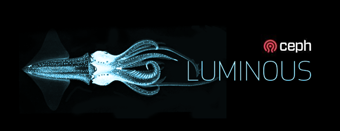

This is the first release of Luminous v12.2.x long term stable release series. There have been major changes since Kraken (v11.2.z) and Jewel (v10.2.z), and the upgrade process is non-trivial. Please read these release notes carefully. The next stable release will be named Mimic.

### Major Changes from Kraken

- _General_:
    
    - Ceph now has a simple, [built-in web-based dashboard](http://docs.ceph.com/docs/luminous/mgr/dashboard) for monitoring cluster status
- _RADOS_:
    
    - _BlueStore_:
        - The new _BlueStore_ backend for _ceph-osd_ is now stable and the new default for newly created OSDs. BlueStore manages data stored by each OSD by directly managing the physical HDDs or SSDs without the use of an intervening file system like XFS. This provides greater performance and features. See [Storage Devices](http://docs.ceph.com/docs/luminous/rados/configuration/storage-devices/) and [BlueStore Config Reference](http://docs.ceph.com/docs/luminous/rados/configuration/bluestore-config-ref/).
        - BlueStore supports [full data and metadata checksums](http://docs.ceph.com/docs/luminous/rados/configuration/bluestore-config-ref/#checksums) of all data stored by Ceph.
        - BlueStore supports [inline compression](http://docs.ceph.com/docs/luminous/rados/configuration/bluestore-config-ref/#inline-compression) using zlib, snappy, or LZ4. (Ceph also supports zstd for [RGW compression](http://docs.ceph.com/docs/luminous/man/8/radosgw-admin/#options) but zstd is not recommended for BlueStore for performance reasons.)
    - _Erasure coded_ pools now have [full support for overwrites](http://docs.ceph.com/docs/luminous/rados/operations/erasure-code/#erasure-coding-with-overwrites), allowing them to be used with RBD and CephFS.
    - _ceph-mgr_:
        - There is a new daemon, _ceph-mgr_, which is a required part of any Ceph deployment. Although IO can continue when _ceph-mgr_ is down, metrics will not refresh and some metrics-related calls (e.g., `ceph df`) may block. We recommend deploying several instances of _ceph-mgr_ for reliability. See the notes on [Upgrading](#upgrading) below.
        - The _ceph-mgr_ daemon includes a [REST-based management API](http://docs.ceph.com/docs/luminous/mgr/restful). The API is still experimental and somewhat limited but will form the basis for API-based management of Ceph going forward.
        - _ceph-mgr_ also includes a [Prometheus exporter](http://docs.ceph.com/docs/luminous/mgr/prometheus) plugin, which can provide Ceph perfcounters to Prometheus.
        - ceph-mgr now has a [Zabbix](http://docs.ceph.com/docs/luminous/mgr/zabbix) plugin. Using zabbix\_sender it sends trapper events to a Zabbix server containing high-level information of the Ceph cluster. This makes it easy to monitor a Ceph cluster’s status and send out notifications in case of a malfunction.
    - The overall _scalability_ of the cluster has improved. We have successfully tested clusters with up to 10,000 OSDs.
    - Each OSD can now have a [device class](http://docs.ceph.com/docs/luminous/rados/operations/crush-map/#device-classes) associated with it (e.g., hdd or ssd), allowing CRUSH rules to trivially map data to a subset of devices in the system. Manually writing CRUSH rules or manual editing of the CRUSH is normally not required.
    - There is a new [upmap](http://docs.ceph.com/docs/luminous/rados/operations/upmap) exception mechanism that allows individual PGs to be moved around to achieve a _perfect distribution_ (this requires luminous clients).
    - Each OSD now adjusts its default configuration based on whether the backing device is an HDD or SSD. Manual tuning generally not required.
    - The prototype [mClock QoS queueing algorithm](http://docs.ceph.com/docs/luminous/rados/configuration/osd-config-ref/#qos-based-on-mclock) is now available.
    - There is now a _backoff_ mechanism that prevents OSDs from being overloaded by requests to objects or PGs that are not currently able to process IO.
    - There is a simplified [OSD replacement process](http://docs.ceph.com/docs/luminous/rados/operations/add-or-rm-osds/#replacing-an-osd) that is more robust.
    - You can query the supported features and (apparent) releases of all connected daemons and clients with [ceph features](http://docs.ceph.com/docs/luminous/man/8/ceph#features).
    - You can configure the oldest Ceph client version you wish to allow to connect to the cluster via `ceph osd set-require-min-compat-client` and Ceph will prevent you from enabling features that will break compatibility with those clients.
    - Several sleep settings, include `osd_recovery_sleep`, `osd_snap_trim_sleep`, and `osd_scrub_sleep` have been reimplemented to work efficiently. (These are used in some cases to work around issues throttling background work.)
    - Pools are now expected to be associated with the application using them. Upon completing the upgrade to Luminous, the cluster will attempt to associate existing pools to known applications (i.e. CephFS, RBD, and RGW). In-use pools that are not associated to an application will generate a health warning. Any unassociated pools can be manually associated using the new `ceph osd pool application enable` command. For more details see [associate pool to application](http://docs.ceph.com/docs/luminous/rados/operations/pools/#associate-pool-to-application) in the documentation.
- _RGW_:
    
    - RGW _metadata search_ backed by ElasticSearch now supports end user requests service via RGW itself, and also supports custom metadata fields. A query language a set of RESTful APIs were created for users to be able to search objects by their metadata. New APIs that allow control of custom metadata fields were also added.
    - RGW now supports _dynamic bucket index sharding_. This has to be enabled via the rgw dyamic resharding configurable. As the number of objects in a bucket grows, RGW will automatically reshard the bucket index in response. No user intervention or bucket size capacity planning is required.
    - RGW introduces _server side encryption_ of uploaded objects with three options for the management of encryption keys: automatic encryption (only recommended for test setups), customer provided keys similar to Amazon SSE-C specification, and through the use of an external key management service (Openstack Barbican) similar to Amazon SSE-KMS specification. [Encryption](http://docs.ceph.com/docs/luminous/radosgw/encryption/)
    - RGW now has preliminary AWS-like bucket policy API support. For now, policy is a means to express a range of new authorization concepts. In the future it will be the foundation for additional auth capabilities such as STS and group policy. [Bucket Policies](http://docs.ceph.com/docs/luminous/radosgw/bucketpolicy/)
    - RGW has consolidated the several metadata index pools via the use of rados namespaces. [Pools](http://docs.ceph.com/docs/luminous/radosgw/pools/)
    - S3 Object Tagging API has been added; while APIs are supported for GET/PUT/DELETE object tags and in PUT object API, there is no support for tags on Policies & Lifecycle yet
    - RGW multisite now supports for enabling or disabling sync at a bucket level.
- _RBD_:
    
    - RBD now has full, stable support for _erasure coded pools_ via the new `--data-pool` option to `rbd create`.
    - RBD mirroring’s rbd-mirror daemon is now highly available. We recommend deploying several instances of rbd-mirror for reliability.
    - RBD mirroring’s rbd-mirror daemon should utilize unique Ceph user IDs per instance to support the new mirroring dashboard.
    - The default ‘rbd’ pool is no longer created automatically during cluster creation. Additionally, the name of the default pool used by the rbd CLI when no pool is specified can be overridden via a new `rbd default pool = <pool name>` configuration option.
    - Initial support for deferred image deletion via new `rbd trash` CLI commands. Images, even ones actively in-use by clones, can be moved to the trash and deleted at a later time.
    - New pool-level `rbd mirror pool promote` and `rbd mirror pool demote` commands to batch promote/demote all mirrored images within a pool.
    - Mirroring now optionally supports a configurable replication delay via the `rbd mirroring replay delay = <seconds>` configuration option.
    - Improved discard handling when the object map feature is enabled.
    - rbd CLI `import` and `copy` commands now detect sparse and preserve sparse regions.
    - Images and Snapshots will now include a creation timestamp.
    - Specifying user authorization capabilities for RBD clients has been simplified. The general syntax for using RBD capability profiles is “mon ‘profile rbd’ osd ‘profile rbd\[-read-only\]\[ pool={pool-name}\[, …\]\]’”. For more details see “User Management” in the documentation.
- _CephFS_:
    
    - _Multiple active MDS daemons_ is now considered stable. The number of active MDS servers may be adjusted up or down on an active CephFS file system.
    - CephFS _directory fragmentation_ is now stable and enabled by default on new filesystems. To enable it on existing filesystems use “ceph fs set <fs\_name> allow\_dirfrags”. Large or very busy directories are sharded and (potentially) distributed across multiple MDS daemons automatically.
    - Directory subtrees can be explicitly pinned to specific MDS daemons in cases where the automatic load balancing is not desired or effective.
    - Client keys can now be created using the new `ceph fs authorize` command to create keys with access to the given CephFS file system and all of its data pools.
    - When running ‘df’ on a CephFS filesystem comprising exactly one data pool, the result now reflects the file storage space used and available in that data pool (fuse client only).
- _Miscellaneous_:
    
    - Release packages are now being built for _Debian Stretch_. Note that QA is limited to CentOS and Ubuntu (xenial and trusty). The distributions we build for now include:
        
        - CentOS 7 (x86\_64 and aarch64)
        - Debian 8 Jessie (x86\_64)
        - Debian 9 Stretch (x86\_64)
        - Ubuntu 16.04 Xenial (x86\_64 and aarch64)
        - Ubuntu 14.04 Trusty (x86\_64)
    - A first release of Ceph for FreeBSD is available which contains a full set of features, other than Bluestore. It will run everything needed to build a storage cluster. For clients, all access methods are available, albeit CephFS is only accessible through a Fuse implementation. RBD images can be mounted on FreeBSD systems through rbd-ggate.
        
        Ceph versions are released through the regular FreeBSD ports and packages system. The most current version is available as: net/ceph-devel. Once Luminous goes into official release, this version will be available as net/ceph. Future development releases will be available via net/ceph-devel More details about this port are in: [README.FreeBSD](https://github.com/ceph/ceph/blob/master/README.FreeBSD)
        
    - _CLI changes_:
        
        - The `ceph -s` or `ceph status` command has a fresh look.
        - `ceph mgr metadata` will dump metadata associated with each mgr daemon.
        - `ceph versions` or `ceph {osd,mds,mon,mgr} versions` summarize versions of running daemons.
        - `ceph {osd,mds,mon,mgr} count-metadata <property>` similarly tabulates any other daemon metadata visible via the `ceph {osd,mds,mon,mgr} metadata` commands.
        - `ceph features` summarizes features and releases of connected clients and daemons.
        - `ceph osd require-osd-release <release>` replaces the old `require_RELEASE_osds` flags.
        - `ceph osd pg-upmap`, `ceph osd rm-pg-upmap`, `ceph osd pg-upmap-items`, `ceph osd rm-pg-upmap-items` can explicitly manage upmap items (see [Using the pg-upmap](http://docs.ceph.com/docs/luminous/rados/operations/upmap/)).
        - `ceph osd getcrushmap` returns a crush map version number on stderr, and `ceph osd setcrushmap [version]` will only inject an updated crush map if the version matches. This allows crush maps to be updated offline and then reinjected into the cluster without fear of clobbering racing changes (e.g., by newly added osds or changes by other administrators).
        - `ceph osd create` has been replaced by `ceph osd new`. This should be hidden from most users by user-facing tools like ceph-disk.
        - `ceph osd destroy` will mark an OSD destroyed and remove its cephx and lockbox keys. However, the OSD id and CRUSH map entry will remain in place, allowing the id to be reused by a replacement device with minimal data rebalancing.
        - `ceph osd purge` will remove all traces of an OSD from the cluster, including its cephx encryption keys, dm-crypt lockbox keys, OSD id, and crush map entry.
        - `ceph osd ls-tree <name>` will output a list of OSD ids under the given CRUSH name (like a host or rack name). This is useful for applying changes to entire subtrees. For example, ``ceph osd down `ceph osd ls-tree rack1` ``.
        - `ceph osd {add,rm}-{noout,noin,nodown,noup}` allow the noout, noin, nodown, and noup flags to be applied to specific OSDs.
        - `ceph osd safe-to-destroy <osd(s)>` will report whether it is safe to remove or destroy OSD(s) without reducing data durability or redundancy.
        - `ceph osd ok-to-stop <osd(s)>` will report whether it is okay to stop OSD(s) without immediately compromising availability (i.e., all PGs should remain active but may be degraded).
        - `ceph log last [n]` will output the last _n_ lines of the cluster log.
        - `ceph mgr dump` will dump the MgrMap, including the currently active ceph-mgr daemon and any standbys.
        - `ceph mgr module ls` will list active ceph-mgr modules.
        - `ceph mgr module {enable,disable} <name>` will enable or disable the named mgr module. The module must be present in the configured mgr\_module\_path on the host(s) where ceph-mgr is running.v12.2.0 Luminous¶
        - `ceph osd crush ls <node>` will list items (OSDs or other CRUSH nodes) directly beneath a given CRUSH node.
        - `ceph osd crush swap-bucket <src> <dest>` will swap the contents of two CRUSH buckets in the hierarchy while preserving the buckets’ ids. This allows an entire subtree of devices to be replaced (e.g., to replace an entire host of FileStore OSDs with newly-imaged BlueStore OSDs) without disrupting the distribution of data across neighboring devices.
        - `ceph osd set-require-min-compat-client <release>` configures the oldest client release the cluster is required to support. Other changes, like CRUSH tunables, will fail with an error if they would violate this setting. Changing this setting also fails if clients older than the specified release are currently connected to the cluster.
        - `ceph config-key dump` dumps config-key entries and their contents. (The existing `ceph config-key list` only dumps the key names, not the values.)
        - `ceph config-key list` is deprecated in favor of `ceph config-key ls`.
        - `ceph config-key put` is deprecated in favor of `ceph config-key set`.
        - `ceph auth list` is deprecated in favor of `ceph auth ls`.
        - `ceph osd crush rule list` is deprecated in favor of `ceph osd crush rule ls`.
        - `ceph osd set-{full,nearfull,backfillfull}-ratio` sets the cluster-wide ratio for various full thresholds (when the cluster refuses IO, when the cluster warns about being close to full, when an OSD will defer rebalancing a PG to itself, respectively).
        - `ceph osd reweightn` will specify the reweight values for multiple OSDs in a single command. This is equivalent to a series of `ceph osd reweight` commands.
        - `ceph osd crush {set,rm}-device-class` manage the new CRUSH _device class_ feature. Note that manually creating or deleting a device class name is generally not necessary as it will be smart enough to be self-managed. `ceph osd crush class ls` and `ceph osd crush class ls-osd` will output all existing device classes and a list of OSD ids under the given device class respectively.
        - `ceph osd crush rule create-replicated` replaces the old `ceph osd crush rule create-simple` command to create a CRUSH rule for a replicated pool. Notably it takes a class argument for the _device class_ the rule should target (e.g., ssd or hdd).
        - `ceph mon feature ls` will list monitor features recorded in the MonMap. `ceph mon feature set` will set an optional feature (none of these exist yet).
        - `ceph tell <daemon> help` will now return a usage summary.
        - `ceph fs authorize` creates a new client key with caps automatically set to access the given CephFS file system.
        - The `ceph health` structured output (JSON or XML) no longer contains ‘timechecks’ section describing the time sync status. This information is now available via the ‘ceph time-sync-status’ command.
        - Certain extra fields in the `ceph health` structured output that used to appear if the mons were low on disk space (which duplicated the information in the normal health warning messages) are now gone.
        - The `ceph -w` output no longer contains audit log entries by default. Add a `--watch-channel=audit` or `--watch-channel=*` to see them.
        - New “ceph -w” behavior - the “ceph -w” output no longer contains I/O rates, available space, pg info, etc. because these are no longer logged to the central log (which is what `ceph -w` shows). The same information can be obtained by running `ceph pg stat`; alternatively, I/O rates per pool can be determined using `ceph osd pool stats`. Although these commands do not self-update like `ceph -w` did, they do have the ability to return formatted output by providing a `--format=<format>` option.
        - Added new commands `pg force-recovery` and `pg-force-backfill`. Use them to boost recovery or backfill priority of specified pgs, so they’re recovered/backfilled before any other. Note that these commands don’t interrupt ongoing recovery/backfill, but merely queue specified pgs before others so they’re recovered/backfilled as soon as possible. New commands `pg cancel-force-recovery` and `pg cancel-force-backfill` restore default recovery/backfill priority of previously forced pgs.

### Major Changes from Jewel

- _RADOS_:
    - We now default to the AsyncMessenger (`ms type = async`) instead of the legacy SimpleMessenger.  The most noticeable difference is that we now use a fixed sized thread pool for network connections (instead of two threads per socket with SimpleMessenger).
    - Some OSD failures are now detected almost immediately, whereas previously the heartbeat timeout (which defaults to 20 seconds) had to expire.  This prevents IO from blocking for an extended period for failures where the host remains up but the ceph-osd process is no longer running.
    - The size of encoded OSDMaps has been reduced.
    - The OSDs now quiesce scrubbing when recovery or rebalancing is in progress.
- _RGW_:
    - RGW now supports the S3 multipart object copy-part API.
    - It is possible now to reshard an existing bucket offline. Offline bucket resharding currently requires that all IO (especially writes) to the specific bucket is quiesced. (For automatic online resharding, see the new feature in Luminous above.)
    - RGW now supports data compression for objects.
    - Civetweb version has been upgraded to 1.8
    - The Swift static website API is now supported (S3 support has been added previously).
    - S3 bucket lifecycle API has been added. Note that currently it only supports object expiration.
    - Support for custom search filters has been added to the LDAP auth implementation.
    - Support for NFS version 3 has been added to the RGW NFS gateway.
    - A Python binding has been created for librgw.
- _RBD_:
    - The rbd-mirror daemon now supports replicating dynamic image feature updates and image metadata key/value pairs from the primary image to the non-primary image.
    - The number of image snapshots can be optionally restricted to a configurable maximum.
    - The rbd Python API now supports asynchronous IO operations.
- _CephFS_:
    - libcephfs function definitions have been changed to enable proper uid/gid control. The library version has been increased to reflect the interface change.
    - Standby replay MDS daemons now consume less memory on workloads doing deletions.
    - Scrub now repairs backtrace, and populates damage ls with discovered errors.
    - A new pg\_files subcommand to cephfs-data-scan can identify files affected by a damaged or lost RADOS PG.
    - The false-positive “failing to respond to cache pressure” warnings have been fixed.

### Upgrade from Jewel or Kraken

1. Ensure that the `sortbitwise` flag is enabled:
    
    \# ceph osd set sortbitwise
    
2. Make sure your cluster is stable and healthy (no down or recoverying OSDs). (Optional, but recommended.)
    
3. Do not create any new erasure-code pools while upgrading the monitors.
    
4. You can monitor the progress of your upgrade at each stage with the `ceph versions` command, which will tell you what ceph version is running for each type of daemon.
    
5. Set the `noout` flag for the duration of the upgrade. (Optional but recommended.):
    
    \# ceph osd set noout
    
6. Upgrade monitors by installing the new packages and restarting the monitor daemons. Note that, unlike prior releases, the ceph-mon daemons _must_ be upgraded first:
    
    \# systemctl restart ceph-mon.target
    
    Verify the monitor upgrade is complete once all monitors are up by looking for the `luminous` feature string in the mon map. For example:
    
    \# ceph mon feature ls
    
    should include luminous under persistent features:
    
    on current monmap (epoch NNN)
                        persistent: \[kraken,luminous\]
                        required: \[kraken,luminous\]
    
7. Add or restart `ceph-mgr` daemons. If you are upgrading from kraken, upgrade packages and restart ceph-mgr daemons with:
    
    \# systemctl restart ceph-mgr.target
    
    If you are upgrading from kraken, you may already have ceph-mgr daemons deployed. If not, or if you are upgrading from jewel, you can deploy new daemons with tools like ceph-deploy or ceph-ansible. For example:
    
    \# ceph-deploy mgr create HOST
    
    Verify the ceph-mgr daemons are running by checking `ceph -s`:
    
    \# ceph -s
    
                        ...
                        services:
                        mon: 3 daemons, quorum foo,bar,baz
                        mgr: foo(active), standbys: bar, baz
                        ...
    
8. Upgrade all OSDs by installing the new packages and restarting the ceph-osd daemons on all hosts:
    
    \# systemctl restart ceph-osd.target
    
    You can monitor the progress of the OSD upgrades with the new `ceph versions` or `ceph osd versions` command:
    
    \# ceph osd versions
                        {
                        "ceph version 12.2.0 (...) luminous (stable)": 12,
                        "ceph version 10.2.6 (...)": 3,
                        }
    
9. Upgrade all CephFS daemons by upgrading packages and restarting daemons on all hosts:
    
    \# systemctl restart ceph-mds.target
    
10. Upgrade all radosgw daemons by upgrading packages and restarting daemons on all hosts:
    
    \# systemctl restart radosgw.target
    
11. Complete the upgrade by disallowing pre-luminous OSDs and enabling all new Luminous-only functionality:
    
    \# ceph osd require-osd-release luminous
    
    If you set `noout` at the beginning, be sure to clear it with:
    
    \# ceph osd unset noout
    
12. Verify the cluster is healthy with `ceph health`.
    

### Upgrading from pre-Jewel releases (like Hammer)

You _must_ first upgrade to Jewel (10.2.z) before attempting an upgrade to Luminous.

### Upgrade compatibility notes, Kraken to Luminous

- The configuration option `osd pool erasure code stripe width` has been replaced by `osd pool erasure code stripe unit`, and given the ability to be overridden by the erasure code profile setting `stripe_unit`. For more details see [Erasure code profiles](http://docs.ceph.com/docs/luminous/rados/operations/erasure-code-profile/#erasure-code-profiles).
    
- rbd and cephfs can use erasure coding with bluestore. This may be enabled by setting `allow_ec_overwrites` to `true` for a pool. Since this relies on bluestore’s checksumming to do deep scrubbing, enabling this on a pool stored on filestore is not allowed.
    
- The `rados df` JSON output now prints numeric values as numbers instead of strings.
    
- The `mon_osd_max_op_age` option has been renamed to `mon_osd_warn_op_age` (default: 32 seconds), to indicate we generate a warning at this age. There is also a new `mon_osd_err_op_age_ratio` that is a expressed as a multitple of `mon_osd_warn_op_age` (default: 128, for roughly 60 minutes) to control when an error is generated.
    
- The default maximum size for a single RADOS object has been reduced from 100GB to 128MB. The 100GB limit was completely impractical in practice while the 128MB limit is a bit high but not unreasonable. If you have an application written directly to librados that is using objects larger than 128MB you may need to adjust `osd_max_object_size`.
    
- The semantics of the `rados ls` and librados object listing operations have always been a bit confusing in that “whiteout” objects (which logically don’t exist and will return ENOENT if you try to access them) are included in the results. Previously whiteouts only occurred in cache tier pools. In luminous, logically deleted but snapshotted objects now result in a whiteout object, and as a result they will appear in `rados ls` results, even though trying to read such an object will result in ENOENT. The `rados listsnaps` operation can be used in such a case to enumerate which snapshots are present. This may seem a bit strange, but is less strange than having a deleted-but-snapshotted object not appear at all and be completely hidden from librados’s ability to enumerate objects. Future versions of Ceph will likely include an alternative object enumeration interface that makes it more natural and efficient to enumerate all objects along with their snapshot and clone metadata.
    
- The deprecated `crush_ruleset` property has finally been removed; please use `crush_rule` instead for the `osd pool get ...` and `osd pool set ...` commands.
    
- The `osd pool default crush replicated ruleset` option has been removed and replaced by the `psd pool default crush rule` option. By default it is -1, which means the mon will pick the first type replicated rule in the CRUSH map for replicated pools. Erasure coded pools have rules that are automatically created for them if they are not specified at pool creation time.
    
- We no longer test the FileStore ceph-osd backend in combination with btrfs. We recommend against using btrfs. If you are using btrfs-based OSDs and want to upgrade to luminous you will need to add the follwing to your ceph.conf:
    
    enable experimental unrecoverable data corrupting features \= btrfs
    
    The code is mature and unlikely to change, but we are only continuing to test the Jewel stable branch against btrfs. We recommend moving these OSDs to FileStore with XFS or BlueStore.
- The `ruleset-*` properties for the erasure code profiles have been renamed to `crush-*` to (1) move away from the obsolete ‘ruleset’ term and to be more clear about their purpose. There is also a new optional `crush-device-class` property to specify a CRUSH device class to use for the erasure coded pool. Existing erasure code profiles will be converted automatically when upgrade completes (when the `ceph osd require-osd-release luminous` command is run) but any provisioning tools that create erasure coded pools may need to be updated.
    
- The structure of the XML output for `osd crush tree` has changed slightly to better match the `osd tree` output. The top level structure is now `nodes` instead of `crush_map_roots`.
    
- When assigning a network to the public network and not to the cluster network the network specification of the public network will be used for the cluster network as well. In older versions this would lead to cluster services being bound to 0.0.0.0:<port>, thus making the cluster service even more publicly available than the public services. When only specifying a cluster network it will still result in the public services binding to 0.0.0.0.
    
- In previous versions, if a client sent an op to the wrong OSD, the OSD would reply with ENXIO. The rationale here is that the client or OSD is clearly buggy and we want to surface the error as clearly as possible. We now only send the ENXIO reply if the osd\_enxio\_on\_misdirected\_op option is enabled (it’s off by default). This means that a VM using librbd that previously would have gotten an EIO and gone read-only will now see a blocked/hung IO instead.
    
- The “journaler allow split entries” config setting has been removed.
    
- The ‘mon\_warn\_osd\_usage\_min\_max\_delta’ config option has been removed and the associated health warning has been disabled because it does not address clusters undergoing recovery or CRUSH rules that do not target all devices in the cluster.
    
- Added new configuration “public bind addr” to support dynamic environments like Kubernetes. When set the Ceph MON daemon could bind locally to an IP address and advertise a different IP address `public addr` on the network.
    
- The crush `choose_args` encoding has been changed to make it architecture-independent. If you deployed Luminous dev releases or 12.1.0 rc release and made use of the CRUSH choose\_args feature, you need to remove all choose\_args mappings from your CRUSH map before starting the upgrade.
    

- _librados_:
    - Some variants of the omap\_get\_keys and omap\_get\_vals librados functions have been deprecated in favor of omap\_get\_vals2 and omap\_get\_keys2. The new methods include an output argument indicating whether there are additional keys left to fetch. Previously this had to be inferred from the requested key count vs the number of keys returned, but this breaks with new OSD-side limits on the number of keys or bytes that can be returned by a single omap request. These limits were introduced by kraken but are effectively disabled by default (by setting a very large limit of 1 GB) because users of the newly deprecated interface cannot tell whether they should fetch more keys or not. In the case of the standalone calls in the C++ interface (IoCtx::get\_omap\_{keys,vals}), librados has been updated to loop on the client side to provide a correct result via multiple calls to the OSD. In the case of the methods used for building multi-operation transactions, however, client-side looping is not practical, and the methods have been deprecated. Note that use of either the IoCtx methods on older librados versions or the deprecated methods on any version of librados will lead to incomplete results if/when the new OSD limits are enabled.
    - The original librados rados\_objects\_list\_open (C) and objects\_begin (C++) object listing API, deprecated in Hammer, has finally been removed. Users of this interface must update their software to use either the rados\_nobjects\_list\_open (C) and nobjects\_begin (C++) API or the new rados\_object\_list\_begin (C) and object\_list\_begin (C++) API before updating the client-side librados library to Luminous. Object enumeration (via any API) with the latest librados version and pre-Hammer OSDs is no longer supported. Note that no in-tree Ceph services rely on object enumeration via the deprecated APIs, so only external librados users might be affected. The newest (and recommended) rados\_object\_list\_begin (C) and object\_list\_begin (C++) API is only usable on clusters with the SORTBITWISE flag enabled (Jewel and later). (Note that this flag is required to be set before upgrading beyond Jewel.)
- _CephFS_:
    - When configuring ceph-fuse mounts in /etc/fstab, a new syntax is available that uses “ceph.<arg>=<val>” in the options column, instead of putting configuration in the device column. The old style syntax still works. See the documentation page “Mount CephFS in your file systems table” for details.
    - CephFS clients without the ‘p’ flag in their authentication capability string will no longer be able to set quotas or any layout fields. This flag previously only restricted modification of the pool and namespace fields in layouts.
    - CephFS will generate a health warning if you have fewer standby daemons than it thinks you wanted. By default this will be 1 if you ever had a standby, and 0 if you did not. You can customize this using `ceph fs set <fs> standby_count_wanted <number>`. Setting it to zero will effectively disable the health check.
    - The “ceph mds tell …” command has been removed. It is superceded by “ceph tell mds.<id> …”
    - The `apply` mode of cephfs-journal-tool has been removed

### Other Notable Changes

- async: Fixed compilation error when enable -DWITH\_DPDK ([pr#12660](https://github.com/ceph/ceph/pull/12660), Pan Liu)
- async: fixed coredump when enable dpdk ([pr#12854](https://github.com/ceph/ceph/pull/12854), Pan Liu)
- async: fixed the error “Cause: Cannot create lock on ‘/var/run/.rte\_c… ([pr#12860](https://github.com/ceph/ceph/pull/12860), Pan Liu)
- bluestore: avoid unnecessary copy with coll\_t ([pr#12576](https://github.com/ceph/ceph/pull/12576), Yunchuan Wen)
- bluestore: BitAllocator: delete useless codes ([pr#13619](https://github.com/ceph/ceph/pull/13619), Jie Wang)
- bluestore: bluestore/BlueFS: pass string as const ref ([pr#16600](https://github.com/ceph/ceph/pull/16600), dingdangzhang)
- bluestore: bluestore, NVMEDEVICE: Specify the max io completion in conf ([pr#13799](https://github.com/ceph/ceph/pull/13799), optimistyzy)
- bluestore: bluestore/NVMEDEVICE: update SPDK to version 17.03 ([pr#14585](https://github.com/ceph/ceph/pull/14585), optimistyzy)
- bluestore: bluestore, NVMeDevice: use task’ own lock for (random) read ([pr#14094](https://github.com/ceph/ceph/pull/14094), optimistyzy)
- bluestore,build/ops,performance: os/bluestore: enable SSE-assisted CRC32 calculations in RocksDB ([pr#13741](https://github.com/ceph/ceph/pull/13741), Radoslaw Zarzynski)
- bluestore: ceph-disk: add –filestore argument, default to –bluestore ([pr#15437](https://github.com/ceph/ceph/pull/15437), Loic Dachary, Sage Weil)
- bluestore: common/config: set rocksdb\_cache\_size to OPT\_U64 ([pr#13995](https://github.com/ceph/ceph/pull/13995), liuhongtong)
- bluestore: common/options: make “blue{fs,store}\_allocator” LEVEL\_DEV ([issue#20660](http://tracker.ceph.com/issues/20660), [pr#16645](https://github.com/ceph/ceph/pull/16645), Kefu Chai)
- bluestore,common,performance: common/Finisher: Using queue(list<context\*>) instead queue(context\*) ([pr#8942](https://github.com/ceph/ceph/pull/8942), Jianpeng Ma)
- bluestore,common,performance: isa-l: update isa-l to v2.18 ([pr#15895](https://github.com/ceph/ceph/pull/15895), Ganesh Mahalingam, Tushar Gohad)
- bluestore,core: os/bluestore: fix statfs to not include DB partition in free space ([issue#18599](http://tracker.ceph.com/issues/18599), [pr#13140](https://github.com/ceph/ceph/pull/13140), Sage Weil)
- bluestore,core: os/bluestore: fix warning ([pr#15435](https://github.com/ceph/ceph/pull/15435), Sage Weil)
- bluestore,core: os/bluestore: improve mempool usage ([pr#15402](https://github.com/ceph/ceph/pull/15402), Sage Weil)
- bluestore,core: os/bluestore: write “mkfs\_done” into disk only if we pass fsck() tests ([pr#15238](https://github.com/ceph/ceph/pull/15238), xie xingguo)
- bluestore,core: osd/OSDMap: should update input param if osd dne ([pr#14863](https://github.com/ceph/ceph/pull/14863), Kefu Chai)
- bluestore,core: os: remove experimental status for BlueStore ([pr#15177](https://github.com/ceph/ceph/pull/15177), Sage Weil)
- bluestore: fixed compilation error when enable spdk ([pr#12672](https://github.com/ceph/ceph/pull/12672), Pan Liu)
- bluestore: include/intarith: templatize ctz/clz/cbits helpers ([pr#14862](https://github.com/ceph/ceph/pull/14862), Kefu Chai)
- bluestore: luminous: os/bluestore: compensate for bad freelistmanager size/blocks metadata ([issue#21089](http://tracker.ceph.com/issues/21089), [pr#17273](https://github.com/ceph/ceph/pull/17273), Sage Weil)
- bluestore: NVMEDevice: add the spdk core mask check ([pr#14068](https://github.com/ceph/ceph/pull/14068), optimistyzy)
- bluestore: NVMEDevice: cleanup the logic in data\_buf\_next\_sge ([pr#13056](https://github.com/ceph/ceph/pull/13056), optimistyzy)
- bluestore: NVMeDevice: fix the core id for rte\_remote\_launch ([pr#13896](https://github.com/ceph/ceph/pull/13896), optimistyzy)
- bluestore: NVMEDevice: fix bug in data\_buf\_next\_sge ([pr#12812](https://github.com/ceph/ceph/pull/12812), optimistyzy)
- bluestore: NVMEDevice: minor error for get slave core ([pr#14012](https://github.com/ceph/ceph/pull/14012), Ziye Yang)
- bluestore: NVMEDevice: optimize sector\_size usage ([pr#12780](https://github.com/ceph/ceph/pull/12780), optimistyzy)
- bluestore: NVMEDevice: remove unnessary dpdk header file ([pr#14650](https://github.com/ceph/ceph/pull/14650), optimistyzy)
- bluestore: NVMEDevice: fix the I/O logic for read ([pr#13971](https://github.com/ceph/ceph/pull/13971), optimistyzy)
- bluestore: os/bluestore: add a debug option to bypass block device writes for bl… ([pr#12464](https://github.com/ceph/ceph/pull/12464), Igor Fedotov)
- bluestore: os/bluestore: Add bluestore pextent vector to mempool ([pr#12946](https://github.com/ceph/ceph/pull/12946), Igor Fedotvo, Igor Fedotov)
- bluestore: os/bluestore: add flush\_store\_cache cmd ([pr#13428](https://github.com/ceph/ceph/pull/13428), xie xingguo)
- bluestore: os/bluestore: add more perf\_counters to BlueStore ([pr#13274](https://github.com/ceph/ceph/pull/13274), Igor Fedotov)
- bluestore: os/bluestore: add new garbage collector ([pr#12144](https://github.com/ceph/ceph/pull/12144), Igor Fedotov)
- bluestore: os/bluestore: add perf variable for throttle info in bluestore ([pr#12583](https://github.com/ceph/ceph/pull/12583), Pan Liu)
- bluestore: os/bluestore: add “\_” prefix for internal methods ([pr#13409](https://github.com/ceph/ceph/pull/13409), xie xingguo)
- bluestore: os/bluestore: align reclaim size to bluefs\_alloc\_size ([pr#14744](https://github.com/ceph/ceph/pull/14744), Haomai Wang)
- bluestore: os/bluestore/Allocator: drop unused return value in release function ([pr#13913](https://github.com/ceph/ceph/pull/13913), wangzhengyong)
- bluestore: os/bluestore: allow multiple DeferredBatches in flight at once ([issue#20295](http://tracker.ceph.com/issues/20295), [pr#16769](https://github.com/ceph/ceph/pull/16769), Nathan Cutler, Sage Weil)
- bluestore: os/bluestore: allow multiple SPDK BlueStore OSD instances ([issue#16966](http://tracker.ceph.com/issues/16966), [pr#12604](https://github.com/ceph/ceph/pull/12604), Orlando Moreno)
- bluestore: os/bluestore: assert blob map returns success ([pr#14473](https://github.com/ceph/ceph/pull/14473), shiqi)
- bluestore: os/bluestore: avoid nullptr in bluestore\_extent\_ref\_map\_t::bound\_encode ([pr#14073](https://github.com/ceph/ceph/pull/14073), Sage Weil)
- bluestore: os/bluestore: avoid unnecessary memory copy, use variable reference in BlockDevice::Open ([pr#12942](https://github.com/ceph/ceph/pull/12942), liuchang0812)
- bluestore: os/bluestore: better debug output on unsharing blobs ([issue#20227](http://tracker.ceph.com/issues/20227), [pr#15746](https://github.com/ceph/ceph/pull/15746), Sage Weil)
- bluestore: os/bluestore/BitAllocator: fix bug of checking required blocks ([pr#13470](https://github.com/ceph/ceph/pull/13470), wangzhengyong)
- bluestore: os/bluestore/BitMapAllocator: rm unused variable ([pr#13599](https://github.com/ceph/ceph/pull/13599), Jie Wang)
- bluestore: os/bluestore/BitmapFreelistManager: readability improvements ([pr#12719](https://github.com/ceph/ceph/pull/12719), xie xingguo)
- bluestore: os/bluestore/BlockDevice: support pmem device as bluestore backend ([pr#15102](https://github.com/ceph/ceph/pull/15102), Jianpeng Ma)
- bluestore: os/bluestore/BlueFS: clean up log\_writer aios from compaction ([issue#20454](http://tracker.ceph.com/issues/20454), [pr#16017](https://github.com/ceph/ceph/pull/16017), Sage Weil)
- bluestore: os/bluestore/BlueFS: clear current log entrys before dump all fnode ([pr#15973](https://github.com/ceph/ceph/pull/15973), Jianpeng Ma)
- bluestore: os/bluestore/BlueFS: fix reclaim\_blocks ([issue#18368](http://tracker.ceph.com/issues/18368), [pr#12725](https://github.com/ceph/ceph/pull/12725), Sage Weil)
- bluestore: os/bluestore/BlueFS: Rebuild memcopy for bufferlist::page\_aligned\_app… ([pr#15728](https://github.com/ceph/ceph/pull/15728), Jianpeng Ma, Sage Weil)
- bluestore: os/bluestore/BlueFS: .slow should be compared with dirname ([pr#15595](https://github.com/ceph/ceph/pull/15595), zhanglei)
- bluestore: os/bluestore/BlueStore: Avoid double counting state\_kv\_queued\_lat ([pr#16374](https://github.com/ceph/ceph/pull/16374), Jianpeng Ma)
- bluestore: os/bluestore/BlueStore.cc:remove unuse code in \_open\_bdev() ([pr#13553](https://github.com/ceph/ceph/pull/13553), yonghengdexin735)
- bluestore: os/bluestore/BlueStore.cc: remove unused variable ([pr#12703](https://github.com/ceph/ceph/pull/12703), Li Wang)
- bluestore: os/bluestore/BlueStore: no device no symlink ([pr#15721](https://github.com/ceph/ceph/pull/15721), Jianpeng Ma)
- bluestore: os/bluestore/BlueStore: remove unused code ([pr#16522](https://github.com/ceph/ceph/pull/16522), Jianpeng Ma)
- bluestore: os/bluestore: cleanup BitAllocator ([pr#12661](https://github.com/ceph/ceph/pull/12661), xie xingguo)
- bluestore: os/bluestore: cleanup bluestore\_types ([pr#15680](https://github.com/ceph/ceph/pull/15680), xie xingguo)
- bluestore: os/bluestore: clean up flush logic ([pr#14162](https://github.com/ceph/ceph/pull/14162), Jianpeng Ma)
- bluestore: os/bluestore: cleanup, got rid of table reference of 1<<x ([pr#13718](https://github.com/ceph/ceph/pull/13718), Adam Kupczyk)
- bluestore: os/bluestore: clean up Invalid return value judgment ([pr#14219](https://github.com/ceph/ceph/pull/14219), shiqi)
- bluestore: os/bluestore: cleanup min\_alloc\_size; some formatting nits ([pr#15826](https://github.com/ceph/ceph/pull/15826), xie xingguo)
- bluestore: os/bluestore: clear result in BlueRocksEnv::getChildren ([issue#20857](http://tracker.ceph.com/issues/20857), [pr#16683](https://github.com/ceph/ceph/pull/16683), liuchang0812)
- bluestore: os/bluestore: clear up redundant size assignment in KerenelDevice ([pr#16121](https://github.com/ceph/ceph/pull/16121), Shasha Lu)
- bluestore: os/bluestore: conditionally load crr option ([pr#12877](https://github.com/ceph/ceph/pull/12877), xie xingguo)
- bluestore: os/bluestore: configure rocksdb cache via bluestore\_cache\_kv\_ratio ([pr#15580](https://github.com/ceph/ceph/pull/15580), Sage Weil)
- bluestore: os/bluestore: default journal media to store media if bluefs is disabled ([pr#16844](https://github.com/ceph/ceph/pull/16844), xie xingguo)
- bluestore: os/bluestore: \_do\_remove: dirty shard individually as each blob is unshared ([issue#20849](http://tracker.ceph.com/issues/20849), [pr#16822](https://github.com/ceph/ceph/pull/16822), Sage Weil)
- bluestore: os/blueStore: Failure retry for opening file ([pr#16237](https://github.com/ceph/ceph/pull/16237), Yankun Li)
- bluestore: os/bluestore: fix a bug in small write handling on sharded extents ([pr#13728](https://github.com/ceph/ceph/pull/13728), Igor Fedotov)
- bluestore: os/bluestore: fix Allocator::allocate() int truncation ([issue#18595](http://tracker.ceph.com/issues/18595), [pr#13010](https://github.com/ceph/ceph/pull/13010), Sage Weil)
- bluestore: os/bluestore: fix a typo about bleustore ([pr#15357](https://github.com/ceph/ceph/pull/15357), Dongsheng Yang)
- bluestore: os/bluestore: fix BitMapAllocator assert on out-of-bound hint value ([pr#15289](https://github.com/ceph/ceph/pull/15289), Igor Fedotov)
- bluestore: os/bluestore: fix buffers pinned by indefinitely deferred writes ([pr#15398](https://github.com/ceph/ceph/pull/15398), Sage Weil)
- bluestore: os/bluestore: fix bug for calc extent\_avg in reshard function ([pr#13931](https://github.com/ceph/ceph/pull/13931), wangzhengyong)
- bluestore: os/bluestore: fix bug in aio\_read() ([pr#13511](https://github.com/ceph/ceph/pull/13511), tangwenjun)
- bluestore: os/bluestore: fix bug in \_open\_alloc() ([pr#13577](https://github.com/ceph/ceph/pull/13577), yonghengdexin735)
- bluestore: os/bluestore: fix bug in \_open\_super\_meta() ([pr#13559](https://github.com/ceph/ceph/pull/13559), Taeksang Kim)
- bluestore: os/bluestore: fix bugs in bluefs and bdev flush ([issue#19250](http://tracker.ceph.com/issues/19250), [issue#19251](http://tracker.ceph.com/issues/19251), [pr#13911](https://github.com/ceph/ceph/pull/13911), Sage Weil)
- bluestore: os/bluestore: fix coredump in register\_ctrlr() ([pr#13556](https://github.com/ceph/ceph/pull/13556), tangwenjun)
- bluestore: os/bluestore: fix deferred\_aio deadlock ([pr#16051](https://github.com/ceph/ceph/pull/16051), Sage Weil)
- bluestore: os/bluestore: fix deferred write race ([issue#19880](http://tracker.ceph.com/issues/19880), [pr#15004](https://github.com/ceph/ceph/pull/15004), Sage Weil)
- bluestore: os/bluestore: fix deferred writes vs collection split race ([issue#19379](http://tracker.ceph.com/issues/19379), [pr#14157](https://github.com/ceph/ceph/pull/14157), Sage Weil)
- bluestore: os/bluestore: fix dirty\_range on \_do\_clone\_range ([issue#20810](http://tracker.ceph.com/issues/20810), [pr#16738](https://github.com/ceph/ceph/pull/16738), Sage Weil)
- bluestore: os/bluestore: fix false assert in IOContext::aio\_wake ([pr#15268](https://github.com/ceph/ceph/pull/15268), Igor Fedotov)
- bluestore: os/bluestore: fix false asserts in Cache::trim\_all() ([pr#15470](https://github.com/ceph/ceph/pull/15470), xie xingguo)
- bluestore: os/bluestore: fix fsck deferred\_replay ([pr#15295](https://github.com/ceph/ceph/pull/15295), Sage Weil)
- bluestore: os/bluestore: fix min\_alloc\_size at mkfs time ([pr#13192](https://github.com/ceph/ceph/pull/13192), Sage Weil)
- bluestore: os/bluestore: fix narrow osr->flush() race ([pr#14489](https://github.com/ceph/ceph/pull/14489), Sage Weil)
- bluestore: os/bluestore: fix NVMEDevice::open failure if serial number ends with a … ([pr#12956](https://github.com/ceph/ceph/pull/12956), Hongtong Liu)
- bluestore: os/bluestore: fix OnodeSizeTracking testing ([issue#20498](http://tracker.ceph.com/issues/20498), [pr#12684](https://github.com/ceph/ceph/pull/12684), xie xingguo)
- bluestore: os/bluestore: fix perf counters ([pr#13965](https://github.com/ceph/ceph/pull/13965), Sage Weil)
- bluestore: os/bluestore: fix possible out of order shard(offset == 0); add sanity check ([pr#15658](https://github.com/ceph/ceph/pull/15658), xie xingguo)
- bluestore: os/bluestore: fix potential access violation ([pr#15657](https://github.com/ceph/ceph/pull/15657), xie xingguo)
- bluestore: os/bluestore: fix potential assert in cache \_trim method ([pr#13234](https://github.com/ceph/ceph/pull/13234), Igor Fedotov)
- bluestore: os/bluestore: fix reclaim\_blocks and clean up Allocator interface ([issue#18573](http://tracker.ceph.com/issues/18573), [pr#12963](https://github.com/ceph/ceph/pull/12963), Sage Weil)
- bluestore: os/bluestore: fix typo(s/trasnaction/transaction/) ([pr#14890](https://github.com/ceph/ceph/pull/14890), xie xingguo)
- bluestore: os/bluestore: fix unsharing blob dirty\_range args ([issue#20227](http://tracker.ceph.com/issues/20227), [pr#15766](https://github.com/ceph/ceph/pull/15766), Sage Weil)
- bluestore: os/bluestore: fix use after free race with aio\_wait ([pr#14956](https://github.com/ceph/ceph/pull/14956), Sage Weil)
- bluestore: os/bluestore: fix wal-queue bytes-counter to keep pace with others ([pr#13382](https://github.com/ceph/ceph/pull/13382), xie xingguo)
- bluestore: os/bluestore: fsck: verify blob.unused field ([pr#14316](https://github.com/ceph/ceph/pull/14316), Sage Weil)
- bluestore: os/bluestore: handle rounding error in cache ratios ([pr#15672](https://github.com/ceph/ceph/pull/15672), Sage Weil)
- bluestore: os/bluestore: implement collect\_metadata ([pr#14115](https://github.com/ceph/ceph/pull/14115), Sage Weil)
- bluestore: os/bluestore: include logical object offset in crc error ([pr#13074](https://github.com/ceph/ceph/pull/13074), Sage Weil)
- bluestore: os/bluestore: initialize finishers properly ([pr#15666](https://github.com/ceph/ceph/pull/15666), xie xingguo)
- bluestore: os/bluestore/KernelDevice: fix comments ([pr#15264](https://github.com/ceph/ceph/pull/15264), xie xingguo)
- bluestore: os/bluestore/KernelDevice: fix debug message ([pr#13135](https://github.com/ceph/ceph/pull/13135), Sage Weil)
- bluestore: os/bluestore/KernelDevice: helpful warning when aio limit exhausted ([pr#15116](https://github.com/ceph/ceph/pull/15116), Sage Weil)
- bluestore: os/bluestore/KernelDevice: kill zeros ([pr#12856](https://github.com/ceph/ceph/pull/12856), xie xingguo)
- bluestore: os/bluestore: kill BufferSpace.empty() ([pr#12871](https://github.com/ceph/ceph/pull/12871), xie xingguo)
- bluestore: os/bluestore: kill orphan declaration of do\_write\_check\_depth() ([pr#12853](https://github.com/ceph/ceph/pull/12853), xie xingguo)
- bluestore: os/bluestore: leverage the type knowledge in BitMapAreaLeaf ([pr#13736](https://github.com/ceph/ceph/pull/13736), Radoslaw Zarzynski)
- bluestore: os/bluestore: Make BitmapFreelistManager kv itereator short lived ([pr#16243](https://github.com/ceph/ceph/pull/16243), Mark Nelson)
- bluestore: os/bluestore: make live changes for BlueStore throttle config work like initial config ([pr#14225](https://github.com/ceph/ceph/pull/14225), J. Eric Ivancich)
- bluestore: os/bluestore: miscellaneous fixes to BitAllocator ([pr#12696](https://github.com/ceph/ceph/pull/12696), xie xingguo)
- bluestore: os/bluestore: misc fix and cleanups ([pr#16315](https://github.com/ceph/ceph/pull/16315), Jianpeng Ma)
- bluestore: os/bluestore: misc fixes ([pr#14333](https://github.com/ceph/ceph/pull/14333), Sage Weil)
- bluestore: os/bluestore: move aio.h/cc from fs dir to bluestore dir ([pr#16409](https://github.com/ceph/ceph/pull/16409), Pan Liu)
- bluestore: os/bluestore: move object exist in assign nid ([pr#16117](https://github.com/ceph/ceph/pull/16117), Jianpeng Ma)
- bluestore: os/bluestore: move sharedblob to new collection in same shard ([issue#20358](http://tracker.ceph.com/issues/20358), [pr#15783](https://github.com/ceph/ceph/pull/15783), Sage Weil)
- bluestore: os/bluestore: narrow cache lock range; make sure min\_alloc\_size p2 aligned ([pr#15911](https://github.com/ceph/ceph/pull/15911), xie xingguo)
- bluestore: os/bluestore: “noid” is not always necessary in clone op ([pr#13769](https://github.com/ceph/ceph/pull/13769), wangzhengyong)
- bluestore: os/bluestore: nullptr in OmapIteratorImpl::valid ([pr#12900](https://github.com/ceph/ceph/pull/12900), Xinze Chi)
- bluestore: os/bluestore/NVMEDevice: Add multiple thread support for SPDK I/O thread ([pr#14420](https://github.com/ceph/ceph/pull/14420), Ziye Yang)
- bluestore: os/bluestore/NVMEDevice.cc: fix the random read issue ([pr#13055](https://github.com/ceph/ceph/pull/13055), optimistyzy)
- bluestore: os/bluestore/NVMEDevice: fix the compilation issue for collect\_metadata ([pr#14455](https://github.com/ceph/ceph/pull/14455), optimistyzy)
- bluestore: os/bluestore/NVMEdevice: fix the unrelease segs issue ([pr#12862](https://github.com/ceph/ceph/pull/12862), optimistyzy)
- bluestore: os/bluestore: only submit deferred if there is any ([pr#16269](https://github.com/ceph/ceph/pull/16269), Sage Weil)
- bluestore: os/bluestore: preallocate object\[extent\_shard\] key to avoid reallocate ([pr#12644](https://github.com/ceph/ceph/pull/12644), xie xingguo)
- bluestore: os/bluestore: pre-calculate number of ghost buffers to evict ([pr#15029](https://github.com/ceph/ceph/pull/15029), xie xingguo)
- bluestore: os/bluestore: put strings in mempool ([pr#12651](https://github.com/ceph/ceph/pull/12651), Allen Samuels, Sage Weil)
- bluestore: os/bluestore: Record l\_bluestore\_state\_kv\_queued\_lat for sync\_submit ([pr#14448](https://github.com/ceph/ceph/pull/14448), Jianpeng Ma)
- bluestore: os/bluestore: reduce some overhead for \_do\_clone\_range() and \_do\_remove() ([pr#15944](https://github.com/ceph/ceph/pull/15944), xie xingguo)
- bluestore: os/bluestore: refactor BlueStore::\_do\_write; kill dead ExtentMap::find\_lextent() method ([pr#15750](https://github.com/ceph/ceph/pull/15750), xie xingguo)
- bluestore: os/bluestore: refactor ExtentMap::update to avoid preceeding db updat… ([pr#12394](https://github.com/ceph/ceph/pull/12394), Igor Fedotov)
- bluestore: os/bluestore: remove a never read value ([pr#12618](https://github.com/ceph/ceph/pull/12618), liuchang0812)
- bluestore: os/bluestore: Remove ExtentFreeListManager ([pr#14772](https://github.com/ceph/ceph/pull/14772), Jianpeng Ma)
- bluestore: os/bluestore: remove intermediate key var to avoid string copy ([pr#12643](https://github.com/ceph/ceph/pull/12643), xie xingguo)
- bluestore: os/bluestore: remove no use parameter in bluestore\_blob\_t::map\_bl ([pr#13013](https://github.com/ceph/ceph/pull/13013), wangzhengyong)
- bluestore: os/bluestore: remove unneeded indirection in BitMapZone ([pr#13743](https://github.com/ceph/ceph/pull/13743), Radoslaw Zarzynski)
- bluestore: os/bluestore: remove unused condition variable ([pr#14973](https://github.com/ceph/ceph/pull/14973), Igor Fedotov)
- bluestore: os/bluestore: remove unused local variable “pos” ([pr#13715](https://github.com/ceph/ceph/pull/13715), wangzhengyong)
- bluestore: os/bluestore: remove unused variables ([pr#15718](https://github.com/ceph/ceph/pull/15718), zhanglei)
- bluestore: os/bluestore: rename/fix throttle options ([pr#14717](https://github.com/ceph/ceph/pull/14717), Sage Weil)
- bluestore: os/bluestore: roundoff bluefs allocs to bluefs\_alloc\_size ([pr#14876](https://github.com/ceph/ceph/pull/14876), Ramesh Chander)
- bluestore: os/bluestore: shrink buffer\_map key into uint32\_t ([pr#12850](https://github.com/ceph/ceph/pull/12850), xie xingguo)
- bluestore: os/bluestore: slightly refactor Blob::try\_reuse\_blob ([pr#15836](https://github.com/ceph/ceph/pull/15836), xie xingguo)
- bluestore: os/bluestore: some cleanup ([pr#13390](https://github.com/ceph/ceph/pull/13390), liuchang0812)
- bluestore: os/bluestore: space between func and contents ([pr#16804](https://github.com/ceph/ceph/pull/16804), xie xingguo)
- bluestore: os/bluestore: stop calculating bound if we must reshard; narrow shard combination condition ([pr#15631](https://github.com/ceph/ceph/pull/15631), xie xingguo)
- bluestore: os/bluestore/StupidAllocator: rounded down len to an align boundary ([issue#20660](http://tracker.ceph.com/issues/20660), [pr#16593](https://github.com/ceph/ceph/pull/16593), Zhu Shangzhong)
- bluestore: os/bluestore: target\_bytes should scale with meta/data ratios ([pr#15708](https://github.com/ceph/ceph/pull/15708), Mark Nelson)
- bluestore: os/bluestore: \_txc\_release\_alloc when do wal cleaning ([pr#12692](https://github.com/ceph/ceph/pull/12692), Xinze Chi)
- bluestore: os/bluestore: use bufferlist functions whenever possible ([pr#16158](https://github.com/ceph/ceph/pull/16158), Jianpeng Ma)
- bluestore: os/bluestore: use correct bound encode size for unused ([pr#14731](https://github.com/ceph/ceph/pull/14731), Haomai Wang)
- bluestore: os/bluestore: use reference to avoid string copy ([pr#16364](https://github.com/ceph/ceph/pull/16364), Pan Liu)
- bluestore: os: extend ObjectStore interface to dump store’s performance counters ([pr#13203](https://github.com/ceph/ceph/pull/13203), Igor Fedotov)
- bluestore,performance: common/config\_opts.h: compaction readahead for bluestore/rocksdb ([pr#14932](https://github.com/ceph/ceph/pull/14932), Mark Nelson)
- bluestore,performance: kv/RocksDBStore: implement rm\_range\_keys operator interface and test ([pr#13855](https://github.com/ceph/ceph/pull/13855), Haomai Wang)
- bluestore,performance: os/aio: remove the redundant memset(struct iocb) ([pr#13662](https://github.com/ceph/ceph/pull/13662), Jianpeng Ma)
- bluestore,performance: os/bluestore: add bluestore\_prefer\_wal\_size option ([pr#13217](https://github.com/ceph/ceph/pull/13217), Sage Weil)
- bluestore,performance: os/bluestore: avoid overloading extents during reshard; atomic deferred\_batch\_ops ([pr#15502](https://github.com/ceph/ceph/pull/15502), xie xingguo)
- bluestore,performance: os/bluestore: avoid the VTABLE-related burden in BitMapAllocator’s hotspot ([pr#14348](https://github.com/ceph/ceph/pull/14348), Radoslaw Zarzynski)
- bluestore,performance: os/bluestore: batch throttle ([pr#15284](https://github.com/ceph/ceph/pull/15284), Jianpeng Ma)
- bluestore,performance: os/bluestore/BlueFS: add bluefs\_sync\_write option ([pr#14510](https://github.com/ceph/ceph/pull/14510), Sage Weil)
- bluestore,performance: os/bluestore/BlueFS: optimize get\_allocated ([pr#14121](https://github.com/ceph/ceph/pull/14121), Jianpeng Ma)
- bluestore,performance: os/bluestore/BlueFS: tune flushing of writes ([pr#13032](https://github.com/ceph/ceph/pull/13032), Sage Weil)
- bluestore,performance: os/bluestore/bluestore\_types: drop std::bitset for blob unused ([pr#12569](https://github.com/ceph/ceph/pull/12569), Sage Weil)
- bluestore,performance: os/bluestore: cap rocksdb cache size ([pr#15786](https://github.com/ceph/ceph/pull/15786), Mark Nelson)
- bluestore,performance: os/bluestore: default 16KB min\_alloc\_size on ssd ([pr#14076](https://github.com/ceph/ceph/pull/14076), Sage Weil)
- bluestore,performance: os/bluestore: default cache size of 3gb ([pr#15976](https://github.com/ceph/ceph/pull/15976), Sage Weil)
- bluestore,performance: os/bluestore: differ default cache size for hdd/ssd backends ([pr#16157](https://github.com/ceph/ceph/pull/16157), xie xingguo)
- bluestore,performance: os/bluestore: do not balance bluefs on every kv\_sync\_thread iteration ([pr#14557](https://github.com/ceph/ceph/pull/14557), Sage Weil)
- bluestore,performance: os/bluestore: do not cache shard keys ([pr#12634](https://github.com/ceph/ceph/pull/12634), Sage Weil)
- bluestore,performance: os/bluestore: eliminate some excessive stuff ([pr#14675](https://github.com/ceph/ceph/pull/14675), Igor Fedotov)
- bluestore,performance: os/bluestore: fix deferred writes; improve flush ([pr#13888](https://github.com/ceph/ceph/pull/13888), Sage Weil)
- bluestore,performance: os/bluestore: generate same onode extent-shard keys in a more efficient way ([pr#12681](https://github.com/ceph/ceph/pull/12681), xie xingguo)
- bluestore,performance: os/bluestore: get rid off excessive lock at BitMapAllocator ([pr#14749](https://github.com/ceph/ceph/pull/14749), Igor Fedotov)
- bluestore,performance: os/blueStore: In osd\_tp\_thread, call \_txc\_finalize\_kv ([pr#14709](https://github.com/ceph/ceph/pull/14709), Jianpeng Ma)
- bluestore,performance: os/bluestore: keep statfs replica in RAM to avoid expensive KV retrieval ([pr#15309](https://github.com/ceph/ceph/pull/15309), Igor Fedotov)
- bluestore,performance: os/bluestore/KernelDevice: batch aio submit ([pr#16032](https://github.com/ceph/ceph/pull/16032), Haodong Tang)
- bluestore,performance: os/bluestore/KernelDevice: fix sync write vs flush ([pr#15034](https://github.com/ceph/ceph/pull/15034), Sage Weil)
- bluestore,performance: os/bluestore: kvdb histogram ([pr#12620](https://github.com/ceph/ceph/pull/12620), Varada Kari)
- bluestore,performance: os/bluestore: make bluestore\_max\_blob\_size parameter hdd/ssd case dependant ([pr#14434](https://github.com/ceph/ceph/pull/14434), Igor Fedotov)
- bluestore,performance: os/bluestore: memory and dereference clean-up in the BitAllocator ([pr#13811](https://github.com/ceph/ceph/pull/13811), Radoslaw Zarzynski)
- bluestore,performance: os/bluestore: move cache\_trim into MempoolThread ([pr#15380](https://github.com/ceph/ceph/pull/15380), xie xingguo)
- bluestore,performance: os/bluestore: optimize blob usage when doing appends/overwrites ([pr#13337](https://github.com/ceph/ceph/pull/13337), Igor Fedotov)
- bluestore,performance: os/bluestore: optimized (encode|decode)\_escaped ([pr#15759](https://github.com/ceph/ceph/pull/15759), Piotr Dałek)
- bluestore,performance: os/bluestore: partial reshard support ([pr#13162](https://github.com/ceph/ceph/pull/13162), Sage Weil)
- bluestore,performance: os/bluestore: prevent lock for almost “flush” calls ([pr#12524](https://github.com/ceph/ceph/pull/12524), Haomai Wang)
- bluestore,performance: os/bluestore: put bluefs in the middle of the shared device ([pr#14873](https://github.com/ceph/ceph/pull/14873), Sage Weil)
- bluestore,performance: os/bluestore: refactor small write handling to reuse blob more effect… ([pr#14399](https://github.com/ceph/ceph/pull/14399), Igor Fedotov)
- bluestore,performance: os/bluestore: remove CephContext\* from BmapEntry ([pr#13651](https://github.com/ceph/ceph/pull/13651), Radoslaw Zarzynski)
- bluestore,performance: os/bluestore: replace Blob ref\_map with reference counting ([pr#12904](https://github.com/ceph/ceph/pull/12904), Igor Fedotov)
- bluestore,performance: os/bluestore: rewrite deferred write handling ([issue#16644](http://tracker.ceph.com/issues/16644), [pr#14491](https://github.com/ceph/ceph/pull/14491), Sage Weil)
- bluestore,performance: os/bluestore: separate kv\_sync\_thread into two parts ([pr#14035](https://github.com/ceph/ceph/pull/14035), Jianpeng Ma, Igor Fedotov, Sage Weil)
- bluestore,performance: os/bluestore: set cache meta ratio to .9 ([pr#12635](https://github.com/ceph/ceph/pull/12635), Sage Weil)
- bluestore,performance: os/bluestore: the exhausted check in BitMapZone can be lock-less ([pr#13653](https://github.com/ceph/ceph/pull/13653), Radoslaw Zarzynski)
- bluestore,performance: os/bluestore: try to unshare blobs for EC overwrite workload ([pr#14239](https://github.com/ceph/ceph/pull/14239), Sage Weil)
- bluestore,performance: os/bluestore: tune deferred\_batch\_ops separately for hdd and ssd ([pr#14435](https://github.com/ceph/ceph/pull/14435), Sage Weil)
- bluestore,performance: os/bluestore: unify throttling model ([issue#19542](http://tracker.ceph.com/issues/19542), [pr#14306](https://github.com/ceph/ceph/pull/14306), Sage Weil)
- bluestore,performance: os/bluestore: use aio for reads ([issue#19030](http://tracker.ceph.com/issues/19030), [pr#13066](https://github.com/ceph/ceph/pull/13066), Sage Weil)
- bluestore,performance: os/bluestore: use Best-Effort policy when evicting onode from cache ([pr#12876](https://github.com/ceph/ceph/pull/12876), xie xingguo)
- bluestore,performance: os/bluestore: use denc for varint encoding ([pr#14911](https://github.com/ceph/ceph/pull/14911), Piotr Dałek)
- bluestore,performance: os/bluestore: various onode changes to reduce its in-memory footprint ([pr#12700](https://github.com/ceph/ceph/pull/12700), Igor Fedotov)
- bluestore,performance: os/fs/aio: use small\_vector for aio\_t; clean up header location ([pr#14853](https://github.com/ceph/ceph/pull/14853), Sage Weil)
- bluestore: rocksdb: add option: writable\_file\_max\_buffer\_size = 0 ([pr#12562](https://github.com/ceph/ceph/pull/12562), Jianpeng Ma)
- bluestore,tests: ceph-dencoder: enable bluestore types ([pr#13595](https://github.com/ceph/ceph/pull/13595), Willem Jan Withagen, Kefu Chai)
- bluestore,tests: ceph\_test\_objectstore: match clone\_range src and dst offset ([pr#13211](https://github.com/ceph/ceph/pull/13211), Sage Weil)
- bluestore,tests: qa/objectstore/bluestore\*: fsck on mount ([pr#15785](https://github.com/ceph/ceph/pull/15785), Sage Weil)
- bluestore,tests: test/ceph-test-objectstore: Don’t always include BlueStore code ([pr#13516](https://github.com/ceph/ceph/pull/13516), Willem Jan Withagen)
- bluestore,tests: test/objectstore/store\_test\_fixture.cc: Exclude bluestore code if required ([pr#14085](https://github.com/ceph/ceph/pull/14085), Willem Jan Withagen)
- bluestore,tests: test/store\_test: add deferred test case setup to support explicit min… ([issue#18857](http://tracker.ceph.com/issues/18857), [pr#13415](https://github.com/ceph/ceph/pull/13415), Igor Fedotov)
- bluestore,tests: test/store\_test: fix bluestore test cases disablement ([pr#14228](https://github.com/ceph/ceph/pull/14228), Igor Fedotov)
- bluestore,tests: test/unittest\_bluefs: check whether add\_block\_device success ([pr#14013](https://github.com/ceph/ceph/pull/14013), shiqi)
- bluestore,tests: test/unittest\_bluefs: When fsync ret is less than 0, fsync can not be… ([pr#15365](https://github.com/ceph/ceph/pull/15365), shiqi)
- bluestore,tests: unittest\_alloc: add test\_alloc\_big ([issue#16662](http://tracker.ceph.com/issues/16662), [pr#14844](https://github.com/ceph/ceph/pull/14844), Sage Weil)
- bluestore,tools: ceph-bluestore-tool: rename from bluefs-tool; improve usage ([pr#14258](https://github.com/ceph/ceph/pull/14258), Sage Weil)
- bluestore,tools: ceph-kvstore-tool: allow ‘bluestore-kv’ as kvdb type; add escaping, compaction ([pr#14718](https://github.com/ceph/ceph/pull/14718), Sage Weil)
- bluestore: wrap blob id when it reaches maximum value of int16\_t ([issue#19555](http://tracker.ceph.com/issues/19555), [pr#15654](https://github.com/ceph/ceph/pull/15654), Xiaoyan Li)
- build/ops: 12.0.3 ([pr#15600](https://github.com/ceph/ceph/pull/15600), Jenkins Build Slave User)
- build/ops: add 12.0.1 release tag in master ([pr#14690](https://github.com/ceph/ceph/pull/14690), Jenkins Build Slave User)
- build/ops: add psmisc dependency to ceph-base (deb and rpm) ([issue#19129](http://tracker.ceph.com/issues/19129), [pr#13744](https://github.com/ceph/ceph/pull/13744), Nathan Cutler)
- build/ops: add sanity checks to run-make-check.sh ([pr#12683](https://github.com/ceph/ceph/pull/12683), Nathan Cutler)
- build/ops: alpine: add alpine linux dev support ([pr#9853](https://github.com/ceph/ceph/pull/9853), John Coyle)
- build/ops: arch: fix build on PowerPC with FreeBSD ([pr#14378](https://github.com/ceph/ceph/pull/14378), Andrew Solomon)
- build/ops: arch: fix cmake’s ARM CRC intrinsics test to handle duplicitous gcc 4.8.5 ([issue#19386](http://tracker.ceph.com/issues/19386), [pr#14132](https://github.com/ceph/ceph/pull/14132), Dan Mick)
- build/ops: arch: use \_\_get\_cpuid instead of do\_cpuid ([issue#7869](http://tracker.ceph.com/issues/7869), [pr#14857](https://github.com/ceph/ceph/pull/14857), Jos Collin)
- build/ops: auth: Let’s not use the deprecated cephx option ([pr#12721](https://github.com/ceph/ceph/pull/12721), Dave Chen)
- build/ops: build: Add Virtuozzo Linux support ([pr#14301](https://github.com/ceph/ceph/pull/14301), Andrey Parfenov)
- build/ops: build: build erasure-code isa lib without versions ([pr#16205](https://github.com/ceph/ceph/pull/16205), James Page)
- build/ops: build/cmake: provide asan, tsan, ubsan builds ([pr#12615](https://github.com/ceph/ceph/pull/12615), Matt Benjamin)
- build/ops: build: execute dh\_systemd\_{enable,start} after dh\_install ([issue#19585](http://tracker.ceph.com/issues/19585), [pr#16218](https://github.com/ceph/ceph/pull/16218), James Page)
- build/ops: build: move bash\_completion.d/ceph to ceph-common ([pr#15148](https://github.com/ceph/ceph/pull/15148), Leo Zhang)
- build/ops: build: remove ceph-disk-udev entirely ([pr#15259](https://github.com/ceph/ceph/pull/15259), Leo Zhang)
- build/ops: build: remove ceph-qa-suite directory ([pr#13880](https://github.com/ceph/ceph/pull/13880), Casey Bodley)
- build/ops: build: revert -Wvla from #15342 ([pr#15469](https://github.com/ceph/ceph/pull/15469), Willem Jan Withagen)
- build/ops: builds with dpdk v16.07 ([pr#12707](https://github.com/ceph/ceph/pull/12707), Kefu Chai)
- build/ops: build: Use .S suffix for ppc64le assembly files ([issue#20106](http://tracker.ceph.com/issues/20106), [pr#15373](https://github.com/ceph/ceph/pull/15373), Andrew Solomon)
- build/ops: ceph-disk: ability to use a different cluster name with dmcrypt ([issue#17821](http://tracker.ceph.com/issues/17821), [pr#11786](https://github.com/ceph/ceph/pull/11786), Sébastien Han, Erwan Velu)
- build/ops: ceph-disk: don’t activate suppressed journal devices ([issue#19489](http://tracker.ceph.com/issues/19489), [pr#16123](https://github.com/ceph/ceph/pull/16123), David Disseldorp)
- build/ops: ceph.in: allow developer mode from outside build tree ([issue#20472](http://tracker.ceph.com/issues/20472), [pr#16055](https://github.com/ceph/ceph/pull/16055), Dan Mick)
- build/ops: ceph\_release: we are in the ‘rc’ phase (12.1.z) ([pr#15957](https://github.com/ceph/ceph/pull/15957), Sage Weil)
- build/ops: ceph.spec.in, debian/control: Add bc to build dependencies ([issue#18876](http://tracker.ceph.com/issues/18876), [pr#13338](https://github.com/ceph/ceph/pull/13338), Kyr Shatskyy)
- build/ops: Clean up make check for persistent test nodes (like arm64) ([pr#16773](https://github.com/ceph/ceph/pull/16773), Dan Mick)
- build/ops: cmake,crc32c: conditionalize crc32c on different archs ([pr#14289](https://github.com/ceph/ceph/pull/14289), Kefu Chai)
- build/ops: CMakeLists.txt: boost\_python.so requires libpython.\*.so on FreeBSD ([pr#12763](https://github.com/ceph/ceph/pull/12763), Willem Jan Withagen)
- build/ops: CMakeLists.txt: don’t do crypto/isa-l if not Intel ([pr#14721](https://github.com/ceph/ceph/pull/14721), Dan Mick)
- build/ops: CMakeLists.txt: suppress unneeded warning about jemalloc ([pr#13377](https://github.com/ceph/ceph/pull/13377), Willem Jan Withagen)
- build/ops,common: build: Adds C++ warning flag for C Variable-Length Arrays ([pr#15342](https://github.com/ceph/ceph/pull/15342), Jesse Williamson)
- build/ops,common: common/blkdev.cc: propagate get\_device\_by\_fd to different OSes ([pr#15547](https://github.com/ceph/ceph/pull/15547), Willem Jan Withagen)
- build/ops: common/module.c: do not use strerror\_r the GNU way ([pr#12363](https://github.com/ceph/ceph/pull/12363), Willem Jan Withagen)
- build/ops: compressor/zstd: add zstd to embedded ceph ([pr#13159](https://github.com/ceph/ceph/pull/13159), Bassam Tabbara)
- build/ops: conditionalize rgw Beast frontend so it isn’t built on s390x architecture ([issue#20048](http://tracker.ceph.com/issues/20048), [pr#15225](https://github.com/ceph/ceph/pull/15225), Willem Jan Withagen, Nathan Cutler, Kefu Chai, Tim Serong, Casey Bodley)
- build/ops,core: build: let FreeBSD build ceph-fuse ([pr#14282](https://github.com/ceph/ceph/pull/14282), Willem Jan Withagen)
- build/ops,core: ceph-disk: use correct user in check\_journal\_req ([issue#18538](http://tracker.ceph.com/issues/18538), [pr#12947](https://github.com/ceph/ceph/pull/12947), Samuel Matzek)
- build/ops,core: common/freebsd\_errno.cc: fix missing ([pr#15741](https://github.com/ceph/ceph/pull/15741), Willem Jan Withagen)
- build/ops,core: erasure-code: update ec\_isa version + add missing AVX512 ISA-L sources ([pr#15636](https://github.com/ceph/ceph/pull/15636), Ganesh Mahalingam, Tushar Gohad)
- build/ops,core: os: allow offline conversion of filestore -> bluestore (or anything else) ([pr#14210](https://github.com/ceph/ceph/pull/14210), Sage Weil)
- build/ops,core: osd/OSD: auto class on osd start up ([pr#16014](https://github.com/ceph/ceph/pull/16014), xie xingguo)
- build/ops,core: osd/Pool: Disallow enabling ‘hashpspool’ option to a pool without ‘–yes-i-really-mean-it’ ([issue#18468](http://tracker.ceph.com/issues/18468), [pr#13406](https://github.com/ceph/ceph/pull/13406), Vikhyat Umrao)
- build/ops,core,tests: osd/dmclock/testing: reorganize testing, building now optional ([issue#19987](http://tracker.ceph.com/issues/19987), [pr#15375](https://github.com/ceph/ceph/pull/15375), J. Eric Ivancich)
- build/ops: debian: Add missing tp files in deb packaging ([pr#13526](https://github.com/ceph/ceph/pull/13526), Ganesh Mahalingam)
- build/ops: debian: ceph-mgr: fix package description ([pr#15513](https://github.com/ceph/ceph/pull/15513), Fabian Grünbichler)
- build/ops: debian/control: add ceph-base-dbg ([pr#13796](https://github.com/ceph/ceph/pull/13796), Sage Weil)
- build/ops: debian: drop boost build dependencies ([pr#13524](https://github.com/ceph/ceph/pull/13524), Kefu Chai)
- build/ops: debian: package ceph.logroate properly ([issue#19390](http://tracker.ceph.com/issues/19390), [pr#14600](https://github.com/ceph/ceph/pull/14600), Kefu Chai)
- build/ops: debian: package crypto plugin only on amd64 ([pr#14820](https://github.com/ceph/ceph/pull/14820), Kefu Chai)
- build/ops: debian/rpm: move radosgw-admin to ceph-common ([issue#19577](http://tracker.ceph.com/issues/19577), [pr#14940](https://github.com/ceph/ceph/pull/14940), Ali Maredia)
- build/ops: debian/rules, ceph.spec.in: invoke cmake with -DBOOST\_J ([pr#14114](https://github.com/ceph/ceph/pull/14114), Dan Mick)
- build/ops: debian: sync logrotate packaging with downstream ([issue#19938](http://tracker.ceph.com/issues/19938), [pr#15567](https://github.com/ceph/ceph/pull/15567), Fabian Grünbichler)
- build/ops: debian: workaround the bug in dpkg-maintscript-helper ([issue#20453](http://tracker.ceph.com/issues/20453), [pr#16072](https://github.com/ceph/ceph/pull/16072), Kefu Chai)
- build/ops: debian: wrap-and-sort all files ([pr#16110](https://github.com/ceph/ceph/pull/16110), James Page)
- build/ops: dmclock: error: ‘function’ in namespace ‘std’ does not name a template type ([pr#14909](https://github.com/ceph/ceph/pull/14909), Jos Collin)
- build/ops: dmclock: include missing <functional> header ([pr#14923](https://github.com/ceph/ceph/pull/14923), Jos Collin)
- build/ops: dmclock: initial commit of dmclock QoS library ([pr#14330](https://github.com/ceph/ceph/pull/14330), J. Eric Ivancich)
- build/ops: do\_cmake.sh: enable ccache if installed ([pr#15274](https://github.com/ceph/ceph/pull/15274), Sage Weil)
- build/ops: do\_cmake.sh: fix syntax for /bin/sh (doesn’t have +=) ([pr#16433](https://github.com/ceph/ceph/pull/16433), Dan Mick)
- build/ops: do\_freebsd.sh: Remove ENODATA requirement ([pr#13626](https://github.com/ceph/ceph/pull/13626), Willem Jan Withagen)
- build/ops: drop libfcgi build dependency ([pr#15285](https://github.com/ceph/ceph/pull/15285), Nathan Cutler)
- build/ops: gitignore: Ignore rejects by patch ([pr#14405](https://github.com/ceph/ceph/pull/14405), Willem Jan Withagen)
- build/ops: include/assert: test c++ before using static\_cast<> ([pr#16424](https://github.com/ceph/ceph/pull/16424), Kefu Chai)
- build/ops: init-ceph: add ceph libraries path to environment ([pr#14693](https://github.com/ceph/ceph/pull/14693), Mohamad Gebai)
- build/ops: init-ceph: fix ceph user args ([pr#13467](https://github.com/ceph/ceph/pull/13467), Sage Weil)
- build/ops: init-ceph: Make init-ceph work under FreeBSD for init-system ([pr#13209](https://github.com/ceph/ceph/pull/13209), Willem Jan Withagen)
- build/ops: install-deps.sh: add missing dependencies for FreeBSD ([pr#16545](https://github.com/ceph/ceph/pull/16545), Alan Somers)
- build/ops: install-deps.sh: workaround setuptools’ dependency on six ([pr#15406](https://github.com/ceph/ceph/pull/15406), Kefu Chai)
- build/ops: mailmap: Update OVH contributors ([pr#13063](https://github.com/ceph/ceph/pull/13063), Bartłomiej Święcki)
- build/ops: make package groups comply with openSUSE guidelines ([issue#19184](http://tracker.ceph.com/issues/19184), [pr#13781](https://github.com/ceph/ceph/pull/13781), Nathan Cutler)
- build/ops: make-srpm: Pass first parameter to make-dist for building SRPM ([pr#13480](https://github.com/ceph/ceph/pull/13480), Wido den Hollander)
- build/ops: merge v12.0.2 release tag ([pr#15091](https://github.com/ceph/ceph/pull/15091), Jenkins Build Slave User)
- build/ops,mgr: debian/ceph-base.dirs: create bootstrap-mgr dirs ([pr#14838](https://github.com/ceph/ceph/pull/14838), Sage Weil)
- build/ops: miscellaneous cleanups and fixes (run-make-check.sh, ceph.spec.in) ([issue#20091](http://tracker.ceph.com/issues/20091), [issue#20127](http://tracker.ceph.com/issues/20127), [pr#15399](https://github.com/ceph/ceph/pull/15399), Nathan Cutler)
- build/ops,mon: mon/ConfigKeyService: add ‘config-key dump’ to show keys and vals ([pr#14858](https://github.com/ceph/ceph/pull/14858), Dan Mick)
- build/ops,mon: systemd: Restart Mon after 10s in case of failure ([issue#18635](http://tracker.ceph.com/issues/18635), [pr#13057](https://github.com/ceph/ceph/pull/13057), Wido den Hollander)
- build/ops: msg/async/rdma: compile with rdma as default ([pr#13901](https://github.com/ceph/ceph/pull/13901), DanielBar-On)
- build/ops: os/bluestore: fix build errors when spdk is on ([pr#16118](https://github.com/ceph/ceph/pull/16118), Ilsoo Byun)
- build/ops: packaging: install libceph-common.so\* not libceph-common.so.\* ([issue#18692](http://tracker.ceph.com/issues/18692), [pr#13148](https://github.com/ceph/ceph/pull/13148), Kefu Chai)
- build/ops,performance: crc32c: Add crc32c function optimized for ppc architecture ([pr#13909](https://github.com/ceph/ceph/pull/13909), Andrew Solomon)
- build/ops,performance,rbd: byteorder: use gcc intrinsics for byteswap ([pr#15012](https://github.com/ceph/ceph/pull/15012), Kefu Chai)
- build/ops,rbd,rgw: CMakeLists: trim rbd/rgw forced dependencies ([pr#16574](https://github.com/ceph/ceph/pull/16574), Patrick Donnelly)
- build/ops,rbd,tests: test/librbd: decouple ceph\_test\_librbd\_api from libceph-common ([issue#20175](http://tracker.ceph.com/issues/20175), [pr#15611](https://github.com/ceph/ceph/pull/15611), Kefu Chai)
- build/ops,rbd,tests: test/librbd: re-enable internal tests in ceph\_test\_librbd ([pr#16255](https://github.com/ceph/ceph/pull/16255), Mykola Golub)
- build/ops,rbd,tests: test: Need to exclude the fsx executable also on FreeBSD ([pr#13686](https://github.com/ceph/ceph/pull/13686), Willem Jan Withagen)
- build/ops: Revert “msg/async: increase worker reference with local listen table enabled backend” ([issue#20603](http://tracker.ceph.com/issues/20603), [pr#16323](https://github.com/ceph/ceph/pull/16323), Haomai Wang)
- build/ops: Revert “msg/async/rdma: Debug prints for ibv ([pr#14245](https://github.com/ceph/ceph/pull/14245), Kefu Chai)
- build/ops,rgw: rgw\_file: radosgw-admin can be built under FreeBSD ([pr#12191](https://github.com/ceph/ceph/pull/12191), Willem Jan Withagen)
- build/ops,rgw,tests,tools: vstart: allow to start multiple radosgw when RGW=x ([pr#15632](https://github.com/ceph/ceph/pull/15632), Adam Kupczyk)
- build/ops,rgw,tools: vstart: add –rgw\_compression to set rgw compression plugin ([pr#15929](https://github.com/ceph/ceph/pull/15929), Casey Bodley)
- build/ops: rocksdb: build with ppc64 ([pr#12908](https://github.com/ceph/ceph/pull/12908), Kefu Chai)
- build/ops: rocksdb: sync with upstream ([pr#14456](https://github.com/ceph/ceph/pull/14456), Kefu Chai)
- build/ops: rocksdb: sync with upstream ([pr#14818](https://github.com/ceph/ceph/pull/14818), Nathan Cutler, Kefu Chai)
- build/ops: rpm: apply epoch only if %epoch macro is defined ([pr#15286](https://github.com/ceph/ceph/pull/15286), Nathan Cutler)
- build/ops: rpm: build ceph-resource-agents by default ([issue#17613](http://tracker.ceph.com/issues/17613), [pr#13515](https://github.com/ceph/ceph/pull/13515), Nathan Cutler)
- build/ops: rpm: bump epoch ahead of RHEL base ([issue#20508](http://tracker.ceph.com/issues/20508), [pr#16126](https://github.com/ceph/ceph/pull/16126), Ken Dreyer)
- build/ops: rpm,deb: fix ceph-volume ([issue#20915](http://tracker.ceph.com/issues/20915), [pr#16832](https://github.com/ceph/ceph/pull/16832), Sage Weil)
- build/ops: rpm: disable dwz to speed up valgrind ([issue#19099](http://tracker.ceph.com/issues/19099), [pr#13748](https://github.com/ceph/ceph/pull/13748), Kefu Chai)
- build/ops: rpm: drop boost build dependencies ([pr#13519](https://github.com/ceph/ceph/pull/13519), Nathan Cutler)
- build/ops: rpm: Drop legacy libxio support ([pr#16449](https://github.com/ceph/ceph/pull/16449), Nathan Cutler)
- build/ops: rpm: fix python-Sphinx package name for SUSE ([pr#15015](https://github.com/ceph/ceph/pull/15015), Nathan Cutler, Jan Matejek)
- build/ops: rpm: fix typo WTIH\_BABELTRACE ([pr#16366](https://github.com/ceph/ceph/pull/16366), Nathan Cutler)
- build/ops: rpm: Fix undefined FIRST\_ARG ([issue#20077](http://tracker.ceph.com/issues/20077), [pr#16208](https://github.com/ceph/ceph/pull/16208), Boris Ranto)
- build/ops: rpm: gperftools-devel >= 2.4 ([issue#13522](http://tracker.ceph.com/issues/13522), [pr#14870](https://github.com/ceph/ceph/pull/14870), Nathan Cutler)
- build/ops: rpm: make librbd1 %post scriptlet depend on coreutils ([issue#20052](http://tracker.ceph.com/issues/20052), [pr#15231](https://github.com/ceph/ceph/pull/15231), Giacomo Comes, Nathan Cutler)
- build/ops: rpm: move \_epoch\_prefix below Epoch definition ([pr#15417](https://github.com/ceph/ceph/pull/15417), Nathan Cutler)
- build/ops: rpm: move RDMA and python-prettytables build dependencies to distro-conditional section ([pr#15200](https://github.com/ceph/ceph/pull/15200), Nathan Cutler)
- build/ops: rpm: obsolete libcephfs1 ([pr#16074](https://github.com/ceph/ceph/pull/16074), Nathan Cutler)
- build/ops: rpm: package COPYING, move sample ceph.conf to ceph-common ([pr#15596](https://github.com/ceph/ceph/pull/15596), Nathan Cutler)
- build/ops: rpm: package crypto on x86\_64 only ([pr#14779](https://github.com/ceph/ceph/pull/14779), Nathan Cutler)
- build/ops: rpm: put mgr python build dependencies in make\_check bcond ([issue#20425](http://tracker.ceph.com/issues/20425), [pr#15940](https://github.com/ceph/ceph/pull/15940), Nathan Cutler, Tim Serong)
- build/ops: rpm: sane packaging of %{\_docdir}/ceph directory ([pr#15900](https://github.com/ceph/ceph/pull/15900), Nathan Cutler)
- build/ops: script: adding contributor credits script ([pr#13251](https://github.com/ceph/ceph/pull/13251), Patrick McGarry)
- build/ops: script: drop the -x arg for credits script ([pr#14296](https://github.com/ceph/ceph/pull/14296), Abhishek Lekshmanan)
- build/ops: script/sepia\_bt.sh: download packages from shaman not gitbuilder ([pr#12799](https://github.com/ceph/ceph/pull/12799), Kefu Chai)
- build/ops: script/sepia\_bt.sh: get sha1,release from t.log if it’s not in core ([pr#13620](https://github.com/ceph/ceph/pull/13620), Kefu Chai)
- build/ops: script/sepia\_bt.sh: support xenial ([pr#13292](https://github.com/ceph/ceph/pull/13292), Kefu Chai)
- build/ops: selinux: Allow ceph daemons to read net stats ([issue#19254](http://tracker.ceph.com/issues/19254), [pr#13945](https://github.com/ceph/ceph/pull/13945), Boris Ranto)
- build/ops: selinux: Allow read on var\_run\_t ([issue#16674](http://tracker.ceph.com/issues/16674), [pr#15523](https://github.com/ceph/ceph/pull/15523), Boris Ranto)
- build/ops: selinux: Do parallel relabel on package install ([issue#20077](http://tracker.ceph.com/issues/20077), [pr#14871](https://github.com/ceph/ceph/pull/14871), Boris Ranto)
- build/ops: selinux: Install ceph-base before ceph-selinux ([issue#20184](http://tracker.ceph.com/issues/20184), [pr#15490](https://github.com/ceph/ceph/pull/15490), Boris Ranto)
- build/ops: Set subman cron attributes in spec file ([issue#20074](http://tracker.ceph.com/issues/20074), [pr#15270](https://github.com/ceph/ceph/pull/15270), Thomas Serlin)
- build/ops: spdk: upgrade spdk to v16.12 ([pr#12734](https://github.com/ceph/ceph/pull/12734), Pan Liu)
- build/ops: src/CMakeLists.txt: disable -Werror on rocksdb ([pr#12560](https://github.com/ceph/ceph/pull/12560), Willem Jan Withagen)
- build/ops: src/CMakeLists.txt: Move parse\_secret\_objs setting within definition block ([pr#12785](https://github.com/ceph/ceph/pull/12785), Willem Jan Withagen)
- build/ops: src/init-ceph.in: allow one((re)?start|stop) as commands ([pr#14560](https://github.com/ceph/ceph/pull/14560), Willem Jan Withagen)
- build/ops: sync luminous tag back to master ([pr#16758](https://github.com/ceph/ceph/pull/16758), Jenkins Build Slave User)
- build/ops: systemd: Add explicit Before=ceph.target ([pr#15835](https://github.com/ceph/ceph/pull/15835), Tim Serong)
- build/ops: systemd/ceph-disk: make it possible to customize timeout ([issue#18740](http://tracker.ceph.com/issues/18740), [pr#13197](https://github.com/ceph/ceph/pull/13197), Alexey Sheplyakov)
- build/ops: systemd/ceph-mgr: remove automagic mgr creation hack ([issue#19994](http://tracker.ceph.com/issues/19994), [pr#16023](https://github.com/ceph/ceph/pull/16023), Sage Weil)
- build/ops: systemd: remove ceph-create-keys from presets ([pr#14226](https://github.com/ceph/ceph/pull/14226), Sébastien Han)
- build/ops: systemd: Start OSDs after MONs ([issue#18516](http://tracker.ceph.com/issues/18516), [pr#13097](https://github.com/ceph/ceph/pull/13097), Boris Ranto)
- build/ops: test/fio\_ceph\_objectstore: fix fio plugin build failure caused by rec… ([pr#12655](https://github.com/ceph/ceph/pull/12655), Igor Fedotov)
- build/ops,tests: qa: make run-standalone work on FreeBSD ([pr#16595](https://github.com/ceph/ceph/pull/16595), Willem Jan Withagen)
- build/ops,tests: test/osd/CMakeLists.txt: osd-dup.sh require BlueStore/AIO ([pr#14387](https://github.com/ceph/ceph/pull/14387), Willem Jan Withagen)
- build/ops,tests: test/osd/osd-dup.sh: warn on low open file limit ([pr#14637](https://github.com/ceph/ceph/pull/14637), Piotr Dałek)
- build/ops,tests,tools: vstart.sh: Work around mgr restfull not available ([pr#15877](https://github.com/ceph/ceph/pull/15877), Willem Jan Withagen)
- build/ops: The Clangtastic Mr. Clocks ([pr#15186](https://github.com/ceph/ceph/pull/15186), Adam C. Emerson)
- build/ops: tool: add some ceph relate processes to ps-ceph.pl ([pr#12406](https://github.com/ceph/ceph/pull/12406), songbaisen)
- build/ops: tools/scripts:”FreeBSD getopt is not compatible, use the one from packages” ([pr#13260](https://github.com/ceph/ceph/pull/13260), Willem Jan Withagen)
- build/ops: tracing: Fix error in including all files in osd\_tp ([pr#12501](https://github.com/ceph/ceph/pull/12501), Ganesh Mahalingam)
- build/ops: upstart: start radosgw-all according to runlevel ([issue#18313](http://tracker.ceph.com/issues/18313), [pr#12586](https://github.com/ceph/ceph/pull/12586), Ken Dreyer)
- build/ops: vstart: clean up usage a bit ([pr#13138](https://github.com/ceph/ceph/pull/13138), Sage Weil)
- build/ops: vstart: do not start mgr if not start\_all ([pr#13974](https://github.com/ceph/ceph/pull/13974), Kefu Chai)
- build/ops: yasm-wrapper: filter -pthread ([pr#15249](https://github.com/ceph/ceph/pull/15249), Alessandro Barbieri)
- build/ops: yasm-wrapper: strip -E (stops ccache trashing source files) ([pr#14633](https://github.com/ceph/ceph/pull/14633), Tim Serong)
- cephfs: #11950: Persistent purge queue ([issue#11950](http://tracker.ceph.com/issues/11950), [pr#12786](https://github.com/ceph/ceph/pull/12786), John Spray)
- cephfs: #17980: MDS client blacklisting and blacklist on eviction ([issue#17980](http://tracker.ceph.com/issues/17980), [issue#9754](http://tracker.ceph.com/issues/9754), [pr#14610](https://github.com/ceph/ceph/pull/14610), John Spray)
- cephfs: #18600: Clear out tasks that don’t make sense from multimds suite ([issue#18600](http://tracker.ceph.com/issues/18600), [pr#13089](https://github.com/ceph/ceph/pull/13089), John Spray)
- cephfs: ceph\_fuse: fix daemonization when pid file is non-empty ([pr#13532](https://github.com/ceph/ceph/pull/13532), “Yan, Zheng”)
- cephfs: ceph\_fuse: pid\_file default to empty ([issue#18309](http://tracker.ceph.com/issues/18309), [pr#12628](https://github.com/ceph/ceph/pull/12628), Nathan Cutler)
- cephfs: ceph-fuse: use user space permission check by default ([issue#19820](http://tracker.ceph.com/issues/19820), [pr#14907](https://github.com/ceph/ceph/pull/14907), “Yan, Zheng”)
- cephfs: ceph: simplify CInode::maybe\_export\_pin() ([pr#15106](https://github.com/ceph/ceph/pull/15106), “Yan, Zheng”)
- cephfs: client: avoid returning negative space available ([issue#20178](http://tracker.ceph.com/issues/20178), [pr#15481](https://github.com/ceph/ceph/pull/15481), John Spray)
- cephfs: client: call the lru\_remove() twice,when trim cache ([pr#15662](https://github.com/ceph/ceph/pull/15662), huanwen ren)
- cephfs: client: check for luminous MDS before sending FLUSH\_MDLOG ([pr#15805](https://github.com/ceph/ceph/pull/15805), John Spray)
- cephfs: client/Client.cc: after reset session from MDS - reconnect ([issue#18757](http://tracker.ceph.com/issues/18757), [pr#13522](https://github.com/ceph/ceph/pull/13522), Henrik Korkuc)
- cephfs: client/Client.cc: prevent segfaulting ([issue#9935](http://tracker.ceph.com/issues/9935), [pr#12550](https://github.com/ceph/ceph/pull/12550), Michal Jarzabek)
- cephfs: client: client\_quota no longer optional ([pr#14978](https://github.com/ceph/ceph/pull/14978), Dan van der Ster)
- cephfs: client: don’t request lookup parent if ino is root ([pr#12478](https://github.com/ceph/ceph/pull/12478), huanwen ren)
- cephfs: client: drop cap snaps when auth mds session gets closed ([issue#19022](http://tracker.ceph.com/issues/19022), [pr#13579](https://github.com/ceph/ceph/pull/13579), “Yan, Zheng”)
- cephfs: client: fix clang warn of “argument is an uninitialized value” ([pr#12580](https://github.com/ceph/ceph/pull/12580), liuchang0812)
- cephfs: client: fix Client::handle\_cap\_flushsnap\_ack() crash ([issue#18460](http://tracker.ceph.com/issues/18460), [pr#12859](https://github.com/ceph/ceph/pull/12859), Yan, Zheng)
- cephfs: client: fix Dentry::dump ([pr#15779](https://github.com/ceph/ceph/pull/15779), huanwen ren)
- cephfs: client: fix display ino in the ldout ([pr#15314](https://github.com/ceph/ceph/pull/15314), huanwen ren)
- cephfs: client: fix potential buffer overflow ([pr#12515](https://github.com/ceph/ceph/pull/12515), Yunchuan Wen)
- cephfs: client: fix the cross-quota rename boundary check conditions ([pr#12489](https://github.com/ceph/ceph/pull/12489), Greg Farnum)
- cephfs: client: fix UserPerm::gid\_in\_group() ([issue#19903](http://tracker.ceph.com/issues/19903), [pr#15039](https://github.com/ceph/ceph/pull/15039), “Yan, Zheng”)
- cephfs: client: getattr before returning quota/layout xattrs ([issue#17939](http://tracker.ceph.com/issues/17939), [pr#14018](https://github.com/ceph/ceph/pull/14018), John Spray)
- cephfs: client/inode: fix the dump type of Inode::dump() ([pr#15198](https://github.com/ceph/ceph/pull/15198), huanwen ren)
- cephfs: client: populate metadata during mount ([issue#18361](http://tracker.ceph.com/issues/18361), [pr#12915](https://github.com/ceph/ceph/pull/12915), John Spray)
- cephfs: client: priority to verify the correctness of the “flag” ([pr#12897](https://github.com/ceph/ceph/pull/12897), huanwen ren)
- cephfs: client: refine fsync/close writeback error handling ([pr#14589](https://github.com/ceph/ceph/pull/14589), John Spray)
- cephfs: client: remove dead log code ([pr#13093](https://github.com/ceph/ceph/pull/13093), Patrick Donnelly)
- cephfs: client: remove request from session->requests when handling forward ([issue#18675](http://tracker.ceph.com/issues/18675), [pr#13124](https://github.com/ceph/ceph/pull/13124), “Yan, Zheng”)
- cephfs: client: simplify remove\_cap interface ([pr#12161](https://github.com/ceph/ceph/pull/12161), John Spray)
- cephfs: client: specify inode in get\_caps log message ([pr#13966](https://github.com/ceph/ceph/pull/13966), John Spray)
- cephfs: client: wait for lastest osdmap when handling set file/dir layout ([issue#18914](http://tracker.ceph.com/issues/18914), [pr#13580](https://github.com/ceph/ceph/pull/13580), “Yan, Zheng”)
- cephfs,common: common/MemoryModel: Bump int to long and drop mallinfo ([pr#13453](https://github.com/ceph/ceph/pull/13453), Xiaoxi Chen)
- cephfs,common,core: librados,osdc: kill ack vs commit distinction ([pr#12607](https://github.com/ceph/ceph/pull/12607), Sage Weil)
- cephfs,common: include/fs\_types: fix unsigned integer overflow ([pr#12440](https://github.com/ceph/ceph/pull/12440), runsisi)
- cephfs,common,rbd: blkin: librbd trace hooks ([pr#15053](https://github.com/ceph/ceph/pull/15053), Victor Araujo, Jason Dillaman)
- cephfs,common,rbd: osdc: cache should ignore error bhs during trim ([issue#18436](http://tracker.ceph.com/issues/18436), [pr#12966](https://github.com/ceph/ceph/pull/12966), Jason Dillaman)
- cephfs,core: Add test for is\_hacky\_ecoverwrites in cephfs pool checks ([pr#13466](https://github.com/ceph/ceph/pull/13466), John Spray)
- cephfs,core: cleanup: use std::make\_shared to replace new ([pr#12276](https://github.com/ceph/ceph/pull/12276), Yunchuan Wen)
- cephfs,core,mon: mon/MDSMonitor: fix segv when multiple MDSs raise same alert ([pr#16302](https://github.com/ceph/ceph/pull/16302), Sage Weil)
- cephfs: fix mount point break off problem after mds switch occured ([issue#19437](http://tracker.ceph.com/issues/19437), [pr#14267](https://github.com/ceph/ceph/pull/14267), Guan yunfei)
- cephfs: fix write\_buf’s \_len overflow problem ([issue#19033](http://tracker.ceph.com/issues/19033), [pr#13587](https://github.com/ceph/ceph/pull/13587), Yang Honggang)
- cephfs: fs/ceph-fuse: normalize file open flags on the wire ([pr#14822](https://github.com/ceph/ceph/pull/14822), Jan Fajerski)
- cephfs: libcephfs.cc: fix memory leak ([pr#12557](https://github.com/ceph/ceph/pull/12557), Michal Jarzabek)
- cephfs: libcephfs: cleanups ([pr#12830](https://github.com/ceph/ceph/pull/12830), huanwen ren)
- cephfs: libcephfs: fix cct refcount constructing from rados ([pr#12831](https://github.com/ceph/ceph/pull/12831), John Spray)
- cephfs: mds/MDBalancer: remove useless check\_targets and hit\_targets logic from MDS balancer ([issue#20131](http://tracker.ceph.com/issues/20131), [pr#15407](https://github.com/ceph/ceph/pull/15407), Zhi Zhang)
- cephfs: mds/MDLog.cc Fix perf counter type for jlat ([pr#13449](https://github.com/ceph/ceph/pull/13449), Xiaoxi Chen)
- cephfs: mds/Server.cc: Don’t evict a slow client if ([issue#17855](http://tracker.ceph.com/issues/17855), [pr#12935](https://github.com/ceph/ceph/pull/12935), Michal Jarzabek)
- cephfs: mds/StrayManager: avoid reusing deleted inode in StrayManager::\_purge\_stray\_logged ([issue#18877](http://tracker.ceph.com/issues/18877), [pr#13347](https://github.com/ceph/ceph/pull/13347), Zhi Zhang)
- cephfs,mgr: pybind/mgr/fsstatus: use mds\_mem.dn as dentry counter ([pr#15255](https://github.com/ceph/ceph/pull/15255), Zhi Zhang)
- cephfs: Mitigation for #16842, validate sessions after load ([issue#16842](http://tracker.ceph.com/issues/16842), [pr#14164](https://github.com/ceph/ceph/pull/14164), John Spray)
- cephfs: mon/FSCommand: fix indentation ([pr#15423](https://github.com/ceph/ceph/pull/15423), Sage Weil)
- cephfs: mon/MDSMonitor.cc:refuse fs new on pools with obj ([issue#11124](http://tracker.ceph.com/issues/11124), [pr#12825](https://github.com/ceph/ceph/pull/12825), Michal Jarzabek)
- cephfs: mon/MDSMonitor: respect mds\_standby\_for\_rank config ([pr#15129](https://github.com/ceph/ceph/pull/15129), “Yan, Zheng”)
- cephfs: mount: do not print “unknown” option to kclient ([issue#18159](http://tracker.ceph.com/issues/18159), [pr#12465](https://github.com/ceph/ceph/pull/12465), John Spray)
- cephfs: osdc/Filer: truncate large file party by party ([issue#19755](http://tracker.ceph.com/issues/19755), [pr#14769](https://github.com/ceph/ceph/pull/14769), “Yan, Zheng”)
- cephfs: osdc/Journaler: avoid executing on\_safe contexts prematurely ([issue#20055](http://tracker.ceph.com/issues/20055), [pr#15240](https://github.com/ceph/ceph/pull/15240), “Yan, Zheng”)
- cephfs: osdc/Journaler: fix memory leak in Journaler::\_issue\_read() ([issue#20338](http://tracker.ceph.com/issues/20338), [pr#15776](https://github.com/ceph/ceph/pull/15776), “Yan, Zheng”)
- cephfs: osdc/Objecter: fix inflight\_ops update ([pr#15768](https://github.com/ceph/ceph/pull/15768), “Yan, Zheng”)
- cephfs: osdc: remove journaler\_allow\_split\_entries option ([issue#19691](http://tracker.ceph.com/issues/19691), [pr#14636](https://github.com/ceph/ceph/pull/14636), John Spray)
- cephfs,performance: client: make seeky readdir more efficiency ([issue#19306](http://tracker.ceph.com/issues/19306), [pr#14317](https://github.com/ceph/ceph/pull/14317), “Yan, Zheng”)
- cephfs,performance: mds/server: skip unwanted dn in handle\_client\_readdir ([pr#12870](https://github.com/ceph/ceph/pull/12870), Xiaoxi Chen)
- cephfs: Permit recovering metadata into a new RADOS pool ([issue#15069](http://tracker.ceph.com/issues/15069), [issue#15068](http://tracker.ceph.com/issues/15068), [pr#10636](https://github.com/ceph/ceph/pull/10636), Douglas Fuller)
- cephfs: qa/cephfs: disable mds\_bal\_frag for TestStrays.test\_purge\_queue\_op\_rate ([issue#19892](http://tracker.ceph.com/issues/19892), [pr#15105](https://github.com/ceph/ceph/pull/15105), “Yan, Zheng”)
- cephfs: qa/cephfs: Fix for test\_data\_scan ([issue#19893](http://tracker.ceph.com/issues/19893), [pr#15094](https://github.com/ceph/ceph/pull/15094), Douglas Fuller)
- cephfs: qa: fix race in Mount.open\_background ([issue#18661](http://tracker.ceph.com/issues/18661), [pr#13137](https://github.com/ceph/ceph/pull/13137), John Spray)
- cephfs: qa/suites/fs: reserve more space for mds in full tests ([issue#19891](http://tracker.ceph.com/issues/19891), [pr#15026](https://github.com/ceph/ceph/pull/15026), “Yan, Zheng”)
- cephfs: qa/tasks/cephfs: use getattr to guarantee inode is in client cache ([issue#19912](http://tracker.ceph.com/issues/19912), [pr#15062](https://github.com/ceph/ceph/pull/15062), “Yan, Zheng”)
- cephfs: qa: unpin knfs from ubuntu ([issue#16397](http://tracker.ceph.com/issues/16397), [pr#13088](https://github.com/ceph/ceph/pull/13088), John Spray)
- cephfs: qa: update log whitelists for kcephfs suite ([pr#14922](https://github.com/ceph/ceph/pull/14922), “Yan, Zheng”)
- cephfs: qa: update remaining ceph.com to download.ceph.com ([issue#18574](http://tracker.ceph.com/issues/18574), [pr#12964](https://github.com/ceph/ceph/pull/12964), John Spray)
- cephfs: qa: whitelist new fullness messages in fs tests ([issue#19253](http://tracker.ceph.com/issues/19253), [pr#13915](https://github.com/ceph/ceph/pull/13915), John Spray)
- cephfs: Remove “experimental” warnings from multimds ([pr#15154](https://github.com/ceph/ceph/pull/15154), John Spray, “Yan, Zheng”)
- cephfs: Rewrite mount.fuse.ceph (to python) and move ceph-fuse options to fs\_mntops ([pr#11448](https://github.com/ceph/ceph/pull/11448), Edgaras Lukosevicius)
- cephfs: tasks/cephfs: fix kernel force umount ([issue#18396](http://tracker.ceph.com/issues/18396), [pr#12833](https://github.com/ceph/ceph/pull/12833), Yan, Zheng)
- cephfs: test/libcephfs: avoid buffer overflow when testing ceph\_getdents() ([issue#18941](http://tracker.ceph.com/issues/18941), [pr#13429](https://github.com/ceph/ceph/pull/13429), “Yan, Zheng”)
- cephfs,tests: Add multimds:thrash sub-suite and fix bugs in thrasher for multimds ([issue#18690](http://tracker.ceph.com/issues/18690), [issue#10792](http://tracker.ceph.com/issues/10792), [pr#13262](https://github.com/ceph/ceph/pull/13262), Patrick Donnelly)
- cephfs,tests: ceph-object-corpus: mark MMDSSlaveRequest incompat change ([pr#15730](https://github.com/ceph/ceph/pull/15730), Sage Weil)
- cephfs,tests: Improve vstart\_runner to (optionally) create its own cluster ([pr#12800](https://github.com/ceph/ceph/pull/12800), John Spray)
- cephfs,tests: qa: fix float parse error in test\_fragment ([pr#15122](https://github.com/ceph/ceph/pull/15122), Patrick Donnelly)
- cephfs,tests: qa: fix test\_standby\_for\_invalid\_fscid with vstart\_runner ([pr#14272](https://github.com/ceph/ceph/pull/14272), John Spray)
- cephfs,tests: qa: handle SSHException in logrotate ([pr#13359](https://github.com/ceph/ceph/pull/13359), John Spray)
- cephfs,tests: qa, mds: add checks for fragmentation, and enable it by default ([issue#16523](http://tracker.ceph.com/issues/16523), [pr#13862](https://github.com/ceph/ceph/pull/13862), john Spray, John Spray)
- cephfs,tests: qa: misc cephfs test improvements ([issue#20131](http://tracker.ceph.com/issues/20131), [pr#15411](https://github.com/ceph/ceph/pull/15411), John Spray)
- cephfs,tests: qa: re-enable ENOSPC tests for kclient ([issue#19550](http://tracker.ceph.com/issues/19550), [pr#14396](https://github.com/ceph/ceph/pull/14396), John Spray)
- cephfs,tests: qa: silence spurious insufficient standby health warnings ([pr#15035](https://github.com/ceph/ceph/pull/15035), Patrick Donnelly)
- cephfs,tests: qa: silence upgrade test failure ([issue#19934](http://tracker.ceph.com/issues/19934), [pr#15126](https://github.com/ceph/ceph/pull/15126), Patrick Donnelly)
- cephfs,tests: qa: simplify TestJournalRepair ([pr#15096](https://github.com/ceph/ceph/pull/15096), John Spray)
- cephfs,tests: qa/tasks: force umount during kclient teardown ([issue#18663](http://tracker.ceph.com/issues/18663), [pr#13099](https://github.com/ceph/ceph/pull/13099), John Spray)
- cephfs,tests: qa: Tidy up fs/ suite ([pr#14575](https://github.com/ceph/ceph/pull/14575), John Spray)
- cephfs,tests: qa/vstart\_runner: amend ps invocation ([pr#14254](https://github.com/ceph/ceph/pull/14254), Ilya Dryomov)
- cephfs,tests: qa: whitelist another fullness log message ([issue#19253](http://tracker.ceph.com/issues/19253), [pr#14221](https://github.com/ceph/ceph/pull/14221), John Spray)
- cephfs,tests: tasks/cephfs: tear down on mount() failure ([pr#13282](https://github.com/ceph/ceph/pull/13282), John Spray)
- cephfs: tools/cephfs: remove apply mode of cephfs-journal-tool ([pr#15715](https://github.com/ceph/ceph/pull/15715), John Spray)
- cephfs: tools/cephfs: set dir\_layout when injecting inodes ([issue#19406](http://tracker.ceph.com/issues/19406), [pr#14234](https://github.com/ceph/ceph/pull/14234), John Spray)
- ceph-volume: use unique logical volumes ([pr#17208](https://github.com/ceph/ceph/pull/17208), Alfredo Deza)
- cleanup: .gitignore: exclude rpm files ([pr#15745](https://github.com/ceph/ceph/pull/15745), Leo Zhang)
- cleanup: Move code from .h into .cc ([pr#12737](https://github.com/ceph/ceph/pull/12737), Amir Vadai)
- cleanup: resolve compiler warnings ([pr#13236](https://github.com/ceph/ceph/pull/13236), Adam C. Emerson)
- cleanup: src: put-to operator function - const input cleanup ([issue#3977](http://tracker.ceph.com/issues/3977), [pr#15364](https://github.com/ceph/ceph/pull/15364), Jos Collin)
- cmake: add “container” to required boost components ([pr#14850](https://github.com/ceph/ceph/pull/14850), Kefu Chai)
- cmake: Add -finstrument-functions flag to OSD code ([pr#15055](https://github.com/ceph/ceph/pull/15055), Mohamad Gebai)
- cmake: add RGW and MDS to libcephd ([pr#12345](https://github.com/ceph/ceph/pull/12345), Bassam Tabbara)
- cmake: Add simple recursive ctags target for Ceph source only ([pr#14334](https://github.com/ceph/ceph/pull/14334), Kefu Chai, Dan Mick)
- cmake: align cmake names of library packages ([issue#19853](http://tracker.ceph.com/issues/19853), [pr#14951](https://github.com/ceph/ceph/pull/14951), Nathan Cutler)
- cmake: Allow tests to build without NSS ([pr#13315](https://github.com/ceph/ceph/pull/13315), Daniel Gryniewicz)
- cmake: build boost as an external project ([pr#15376](https://github.com/ceph/ceph/pull/15376), Kefu Chai)
- cmake: build tracepoint libraries for vstart target ([pr#14354](https://github.com/ceph/ceph/pull/14354), Mohamad Gebai)
- cmake: check the existence of gperf before using it ([pr#15164](https://github.com/ceph/ceph/pull/15164), Kefu Chai)
- cmake: cleanup the use of udev and blkid in target\_link\_lib() ([pr#12811](https://github.com/ceph/ceph/pull/12811), Willem Jan Withagen)
- cmake: disable -fvar-tracking-assignments for config.cc ([pr#16695](https://github.com/ceph/ceph/pull/16695), Kefu Chai)
- cmake: disable mallinfo for jemalloc ([pr#12469](https://github.com/ceph/ceph/pull/12469), Bassam Tabbara)
- cmake: do not add dependencies to INTERFACE library on cmake < 3.3 ([pr#15813](https://github.com/ceph/ceph/pull/15813), Kefu Chai)
- cmake: do not compile crush twice ([pr#14725](https://github.com/ceph/ceph/pull/14725), Kefu Chai)
- cmake: do not link libcommon against some libs ([pr#15340](https://github.com/ceph/ceph/pull/15340), Willem Jan Withagen)
- cmake: do not try to add submodule to exclude list if .git is not around ([pr#14495](https://github.com/ceph/ceph/pull/14495), Kefu Chai)
- cmake: enable cross-compilation of boost ([issue#18938](http://tracker.ceph.com/issues/18938), [pr#14881](https://github.com/ceph/ceph/pull/14881), Kefu Chai)
- cmake: exclude \*.css while generating ctags ([pr#15663](https://github.com/ceph/ceph/pull/15663), Leo Zhang)
- cmake: explictly call find\_package(PythonInterp) first to fix build err ([pr#12385](https://github.com/ceph/ceph/pull/12385), Yixun Lan)
- cmake: fix boost components for WITH\_SYSTEM\_BOOST ([pr#15160](https://github.com/ceph/ceph/pull/15160), Bassam Tabbara)
- cmake: Fix broken async/rdma compilation since move to libceph-common ([pr#13122](https://github.com/ceph/ceph/pull/13122), Oren Duer)
- cmake: fix broken RDMA compilation after merge PR #12878 ([pr#13186](https://github.com/ceph/ceph/pull/13186), Oren Duer)
- cmake: fix hard coded boost python lib ([pr#12480](https://github.com/ceph/ceph/pull/12480), John Coyle)
- cmake: fix rpath on shared libraries and binaries targets ([pr#12927](https://github.com/ceph/ceph/pull/12927), Ricardo Dias)
- cmake: fix the build with -DWITH\_ZFS=ON ([pr#15907](https://github.com/ceph/ceph/pull/15907), Kefu Chai)
- cmake: fix the linked lib reference of unittest\_rgw\_crypto ([pr#14869](https://github.com/ceph/ceph/pull/14869), Willem Jan Withagen)
- cmake: improved build speed by 5x when using ccache ([pr#15147](https://github.com/ceph/ceph/pull/15147), Bassam Tabbara)
- cmake: kill duplicated cmake commands ([pr#14948](https://github.com/ceph/ceph/pull/14948), liuchang0812)
- cmake: link against fcgi only if enabled ([pr#15425](https://github.com/ceph/ceph/pull/15425), Yao Zongyou)
- cmake: link ceph-{mgr,mon,mds,osd} against libcommon statically ([pr#12878](https://github.com/ceph/ceph/pull/12878), Kefu Chai)
- cmake: link consumers of libclient with libcommon ([issue#18838](http://tracker.ceph.com/issues/18838), [pr#13394](https://github.com/ceph/ceph/pull/13394), Kefu Chai)
- cmake: misc fixes for build on i386 ([pr#15516](https://github.com/ceph/ceph/pull/15516), James Page)
- cmake: pass -d0 to b2 if not CMAKE\_VERBOSE\_MAKEFILE ([pr#14651](https://github.com/ceph/ceph/pull/14651), Kefu Chai)
- cmake: remove Findpciaccess.cmake ([pr#12776](https://github.com/ceph/ceph/pull/12776), optimistyzy)
- cmake: Rewrite HAVE\_BABELTRACE option to WITH ([pr#15305](https://github.com/ceph/ceph/pull/15305), Willem Jan Withagen)
- cmake: rgw: do not link against boost in a wholesale ([pr#15347](https://github.com/ceph/ceph/pull/15347), Nathan Cutler, Kefu Chai)
- cmake: search for Keyutils in default paths ([pr#12769](https://github.com/ceph/ceph/pull/12769), Pascal Bach)
- cmake: search for nspr include files for both suffixes: nspr4 and nspr ([issue#18535](http://tracker.ceph.com/issues/18535), [pr#12939](https://github.com/ceph/ceph/pull/12939), John Lin)
- cmake: should not compile crc32c\_ppc.c on intel arch ([pr#14423](https://github.com/ceph/ceph/pull/14423), Kefu Chai)
- cmake: simplify find\_package jemalloc ([pr#12468](https://github.com/ceph/ceph/pull/12468), Bassam Tabbara)
- cmake: support for external rocksdb ([pr#12467](https://github.com/ceph/ceph/pull/12467), Bassam Tabbara)
- cmake: support optional argument for overriding default ctag excludes ([pr#14379](https://github.com/ceph/ceph/pull/14379), Kefu Chai)
- cmake: turn libcommon into a shared library ([pr#12840](https://github.com/ceph/ceph/pull/12840), Kefu Chai)
- cmake: use CMAKE\_INSTALL\_INCLUDEDIR ([pr#16483](https://github.com/ceph/ceph/pull/16483), David Disseldorp)
- cmake: workaound ccache issue with .S assembly files ([pr#15142](https://github.com/ceph/ceph/pull/15142), Bassam Tabbara)
- common: add ceph::size() ([pr#15181](https://github.com/ceph/ceph/pull/15181), Kefu Chai)
- common: add override in common and misc ([issue#18922](http://tracker.ceph.com/issues/18922), [pr#13443](https://github.com/ceph/ceph/pull/13443), liuchang0812)
- common: add override in header file ([pr#13774](https://github.com/ceph/ceph/pull/13774), liuchang0812)
- common: add override in msg subsystem ([pr#13771](https://github.com/ceph/ceph/pull/13771), liuchang0812)
- common: auth: Enhancement for the supported auth methods ([pr#12937](https://github.com/ceph/ceph/pull/12937), Dave Chen)
- common: auth/RotatingKeyRing: use std::move() to set secrets ([pr#15866](https://github.com/ceph/ceph/pull/15866), Kefu Chai)
- common: avoid statically allocating configuration options ([issue#20869](http://tracker.ceph.com/issues/20869), [pr#16735](https://github.com/ceph/ceph/pull/16735), Jason Dillaman)
- common: Better handling for missing/inaccessible ceph.conf files ([issue#19658](http://tracker.ceph.com/issues/19658), [pr#14757](https://github.com/ceph/ceph/pull/14757), Dan Mick)
- common: bufferlist: cleanup semantical wrong for bufferlist::append ([pr#12247](https://github.com/ceph/ceph/pull/12247), Yankun Li)
- common: buffer: silence unused var warning on FreeBSD ([pr#16452](https://github.com/ceph/ceph/pull/16452), Willem Jan Withagen)
- common: ceph\_osd: remove client message cap limit ([pr#14944](https://github.com/ceph/ceph/pull/14944), Haomai Wang)
- common: ceph: wait for maps before doing ‘ceph tell … help’ ([issue#20113](http://tracker.ceph.com/issues/20113), [pr#16756](https://github.com/ceph/ceph/pull/16756), Sage Weil)
- common: cls/log/cls\_log.cc: reduce logging noise ([issue#19835](http://tracker.ceph.com/issues/19835), [pr#14879](https://github.com/ceph/ceph/pull/14879), Willem Jan Withagen)
- common: cls: optimize header file dependency ([pr#15165](https://github.com/ceph/ceph/pull/15165), Brad Hubbard, Xiaowei Chen)
- common: cmdparse: more constness ([pr#15023](https://github.com/ceph/ceph/pull/15023), Kefu Chai)
- common: common/admin\_socket: add config for admin socket permission bits ([pr#11684](https://github.com/ceph/ceph/pull/11684), runsisi)
- common: common/admin-socket: fix potential buffer overflow ([pr#12518](https://github.com/ceph/ceph/pull/12518), Yunchuan Wen)
- common: common/auth: add override in headers ([pr#13692](https://github.com/ceph/ceph/pull/13692), liuchang0812)
- common: common/BackTrace: add operator<< ([pr#9028](https://github.com/ceph/ceph/pull/9028), Kefu Chai)
- common: common/BackTrace: demangle on FreeBSD also ([pr#12992](https://github.com/ceph/ceph/pull/12992), Kefu Chai)
- common: common/buffer: close pipe fd if set nonblocking fails ([pr#12828](https://github.com/ceph/ceph/pull/12828), donglinpeng)
- common: common/buffer: off-by-one error in max iov length blocking ([issue#20907](http://tracker.ceph.com/issues/20907), [pr#16803](https://github.com/ceph/ceph/pull/16803), Dan Mick)
- common: common/ceph\_context.cc: Use CEPH\_DEV to reduce logfile noise ([pr#10384](https://github.com/ceph/ceph/pull/10384), Willem Jan Withagen)
- common: common/ceph\_context: ‘config diff get’ option added ([pr#10736](https://github.com/ceph/ceph/pull/10736), Daniel Oliveira)
- common: common/ceph\_context: fewer warnings about experimental features ([pr#14170](https://github.com/ceph/ceph/pull/14170), Sage Weil)
- common: common/ceph\_context: fix leak of registered commands on exit ([pr#15302](https://github.com/ceph/ceph/pull/15302), xie xingguo)
- common: common/ceph\_context: Show clear message if all features are enabled ([pr#12676](https://github.com/ceph/ceph/pull/12676), Dave Chen)
- common: common/cmdparse.cc: remove unused variable ‘argnum’ in dump\_cmd\_to\_json() ([pr#16862](https://github.com/ceph/ceph/pull/16862), Luo Kexue)
- common: common/common\_init: disable default dout logging for UTILITY\_NODOUT too ([issue#20771](http://tracker.ceph.com/issues/20771), [pr#16578](https://github.com/ceph/ceph/pull/16578), Sage Weil)
- common: common/config: Add /usr/local/etc/ceph to default paths ([pr#14797](https://github.com/ceph/ceph/pull/14797), Willem Jan Withagen)
- common: common/config: eliminate config\_t::set\_val unsafe option ([issue#19106](http://tracker.ceph.com/issues/19106), [pr#13687](https://github.com/ceph/ceph/pull/13687), liuchang0812)
- common: common/config: fix return type of string::find and use string::npos ([pr#9924](https://github.com/ceph/ceph/pull/9924), Yan Jun)
- common: common,config: OPT\_FLOAT and OPT\_DOUBLE output format in config show ([issue#20104](http://tracker.ceph.com/issues/20104), [pr#15647](https://github.com/ceph/ceph/pull/15647), Yanhu Cao)
- common: common/config\_opt: remove unused config ([pr#15874](https://github.com/ceph/ceph/pull/15874), alex.wu)
- common: common/config\_opts: drop unused opt ([pr#15876](https://github.com/ceph/ceph/pull/15876), Yanhu Cao)
- common: common/config\_opts.h: FreeBSD timing changed due to no SO\_REUSEADDR ([pr#12594](https://github.com/ceph/ceph/pull/12594), Willem Jan Withagen)
- common: common/config\_opts.h: Remove deprecated osd\_compact\_leveldb\_on\_mount option ([issue#19318](http://tracker.ceph.com/issues/19318), [pr#14059](https://github.com/ceph/ceph/pull/14059), Vikhyat Umrao)
- common: common/config\_opts.h: remove obsolete configuration option ([pr#12659](https://github.com/ceph/ceph/pull/12659), Li Wang)
- common: common/config\_opts: Set the HDD throttle cost to 1.5M ([pr#14808](https://github.com/ceph/ceph/pull/14808), Mark Nelson)
- common: common/EventTrace: fix compiler warning ([pr#13659](https://github.com/ceph/ceph/pull/13659), Jianpeng Ma)
- common: common/Finisher: fix uninitialized variable warning ([pr#14958](https://github.com/ceph/ceph/pull/14958), Piotr Dałek)
- common: common/freebsd\_errno.cc: fixed again a stupid typo ([pr#15742](https://github.com/ceph/ceph/pull/15742), Willem Jan Withagen)
- common: common/interval\_set: return int64\_t for size() ([pr#12898](https://github.com/ceph/ceph/pull/12898), Xinze Chi)
- common: common/iso\_8601.cc: Make return expression Clang compatible ([pr#15336](https://github.com/ceph/ceph/pull/15336), Willem Jan Withagen)
- common: common/LogEntry: include EntityName in log entries ([pr#15395](https://github.com/ceph/ceph/pull/15395), Sage Weil)
- common: common/Mutex.cc: fixed the error in comment ([pr#16214](https://github.com/ceph/ceph/pull/16214), Pan Liu)
- common: common/options: refactors to set the properties in a more structured way ([pr#16482](https://github.com/ceph/ceph/pull/16482), Kefu Chai)
- common: common,osdc: remove atomic\_t completely ([pr#15562](https://github.com/ceph/ceph/pull/15562), Kefu Chai)
- common: common/perf\_counters: add average time for PERFCOUNTER\_TIME ([pr#15478](https://github.com/ceph/ceph/pull/15478), xie xingguo)
- common: common/perf\_counters: fix race condition with atomic variables ([pr#14227](https://github.com/ceph/ceph/pull/14227), J. Eric Ivancich)
- common: common/perf\_counters: make schema more friendly and update docs ([pr#14933](https://github.com/ceph/ceph/pull/14933), Sage Weil)
- common: common/perf\_counters.: Remove unnecessary judgment ([pr#10407](https://github.com/ceph/ceph/pull/10407), zhang.zezhu)
- common: common/simple\_spin: use \_\_ppc\_yield() on all powerpc archs ([pr#14310](https://github.com/ceph/ceph/pull/14310), Kefu Chai)
- common: common,test: migrate atomic\_t to std::atomic ([pr#14866](https://github.com/ceph/ceph/pull/14866), Jesse Williamson)
- common: common/Timer: do not add event if already shutdown ([issue#20432](http://tracker.ceph.com/issues/20432), [pr#16201](https://github.com/ceph/ceph/pull/16201), Kefu Chai)
- common: common/WorkQueue: use threadpoolname + threadaddr for heartbeat\_han… ([pr#16563](https://github.com/ceph/ceph/pull/16563), huangjun)
- common: common/xmlformatter: turn on underscored and add unittest ([pr#12916](https://github.com/ceph/ceph/pull/12916), liuchang0812)
- common: compressor/zlib: remove g\_ceph\_context/g\_conf from compressor plugin ([pr#16245](https://github.com/ceph/ceph/pull/16245), Casey Bodley)
- common: compressor/zstd: add zstd compression plugin ([pr#13075](https://github.com/ceph/ceph/pull/13075), Kefu Chai, Sage Weil)
- common: config: Improve warning for unobserved value ([issue#18424](http://tracker.ceph.com/issues/18424), [pr#12855](https://github.com/ceph/ceph/pull/12855), Brad Hubbard)
- common: config\_opt: use bool instead of int for the default value of filestore\_debug\_omap\_check ([pr#15651](https://github.com/ceph/ceph/pull/15651), Leo Zhang)
- common,core: ceph\_test\_rados\_api\_misc: fix LibRadosMiscConnectFailure.ConnectFailure retry ([issue#19901](http://tracker.ceph.com/issues/19901), [pr#15522](https://github.com/ceph/ceph/pull/15522), Sage Weil)
- common: core/common: Fix ENODATA for FreeBSD with compat.h ([issue#19883](http://tracker.ceph.com/issues/19883), [pr#15685](https://github.com/ceph/ceph/pull/15685), Willem Jan Withagen)
- common,core: common, osd, tools: Add histograms to performance counters ([pr#12829](https://github.com/ceph/ceph/pull/12829), Bartłomiej Święcki)
- common,core: common/pick\_address.cc: Copy public\_netw to cluster\_netw if cluster empty ([pr#12929](https://github.com/ceph/ceph/pull/12929), Willem Jan Withagen)
- common,core: common/TracepointProvider: add assert if dlopen error ([pr#13430](https://github.com/ceph/ceph/pull/13430), Jianpeng Ma)
- common,core: common/TrackedOp: make TrackedOp::reset\_desc() safe ([issue#19110](http://tracker.ceph.com/issues/19110), [pr#13702](https://github.com/ceph/ceph/pull/13702), Sage Weil)
- common,core: mempool: put bloom\_filter in mempool ([pr#13009](https://github.com/ceph/ceph/pull/13009), Sage Weil)
- common,core: osd,mds,mgr: do not dereference null rotating\_keys ([issue#20667](http://tracker.ceph.com/issues/20667), [pr#16455](https://github.com/ceph/ceph/pull/16455), Sage Weil)
- common,core: osd,osdc: pg and osd-based backoff ([pr#12342](https://github.com/ceph/ceph/pull/12342), Sage Weil)
- common,core: osd/OSDMap: make osd\_state 32 bits wide ([pr#15390](https://github.com/ceph/ceph/pull/15390), Sage Weil)
- common,core: osd/OSDMap: replace require\_osds flags with a single require\_osd\_release field ([pr#15068](https://github.com/ceph/ceph/pull/15068), Sage Weil)
- common,core: osd/OSDMap: replace string-based min\_compat\_client with a CEPH\_RELEASE uint8\_t ([pr#15351](https://github.com/ceph/ceph/pull/15351), Sage Weil)
- common,core: osd/osd\_types: add flag name (IGNORE\_REDIRECT) ([pr#15795](https://github.com/ceph/ceph/pull/15795), Myoungwon Oh)
- common,core: rados: we need to get the latest osdmap when pool does not exists ([pr#13289](https://github.com/ceph/ceph/pull/13289), song baisen)
- common,core,tests: Wip cppcheck errors ([pr#14446](https://github.com/ceph/ceph/pull/14446), Brad Hubbard)
- common: crc32c: include acconfig.h to fix ceph\_crc32c\_aarch64() ([pr#15515](https://github.com/ceph/ceph/pull/15515), Kefu Chai)
- common: crush/CrushWrapper: fix has\_incompat\_choose\_args ([pr#15218](https://github.com/ceph/ceph/pull/15218), Sage Weil)
- common: crush/CrushWrapper: fix has\_incompat\_choose\_args() ([pr#15244](https://github.com/ceph/ceph/pull/15244), Sage Weil)
- common: crypto: cleanup NSPR in main thread ([pr#14801](https://github.com/ceph/ceph/pull/14801), Kefu Chai)
- common: delete unused conf “filestore\_debug\_disable\_sharded\_check” ([pr#13051](https://github.com/ceph/ceph/pull/13051), Chuanhong Wang)
- common: denc: add encode/decode for basic\_sstring ([pr#15135](https://github.com/ceph/ceph/pull/15135), Kefu Chai, Casey Bodley)
- common: do not print error when asok is closed ([pr#14022](https://github.com/ceph/ceph/pull/14022), Patrick Donnelly)
- common: fix building against libcryptopp ([pr#14949](https://github.com/ceph/ceph/pull/14949), Shengjing Zhu)
- common: Fix clang compilation ([pr#13335](https://github.com/ceph/ceph/pull/13335), Bartłomiej Święcki)
- common: Fix heap buffer overflow in do\_request ([issue#19393](http://tracker.ceph.com/issues/19393), [pr#14173](https://github.com/ceph/ceph/pull/14173), Brad Hubbard)
- common: fix lockdep vs recursive mutexes ([pr#9940](https://github.com/ceph/ceph/pull/9940), Adam Kupczyk)
- common: fix log warnings ([pr#16056](https://github.com/ceph/ceph/pull/16056), xie xingguo)
- common: fix Option set\_long\_description ([pr#16668](https://github.com/ceph/ceph/pull/16668), Yan Jun)
- common: fix segfault in public IPv6 addr picking ([issue#19371](http://tracker.ceph.com/issues/19371), [pr#14124](https://github.com/ceph/ceph/pull/14124), Fabian Grünbichler)
- common: fix that $host always expands to localhost instead of actual hostname ([issue#11081](http://tracker.ceph.com/issues/11081), [pr#12998](https://github.com/ceph/ceph/pull/12998), liuchang0812)
- common: fix typo in option of rados\_mon\_op\_timeout’s comment ([pr#15681](https://github.com/ceph/ceph/pull/15681), Leo Zhang)
- common: Fix unused variable references warnings ([pr#14790](https://github.com/ceph/ceph/pull/14790), Willem Jan Withagen)
- common: follow up to new options infrastructure ([pr#16527](https://github.com/ceph/ceph/pull/16527), John Spray)
    
    common: Forward-declare container I/O overloads
    
- common: get\_process\_name: use getprogname on bsd systems ([pr#15338](https://github.com/ceph/ceph/pull/15338), Mykola Golub)
- common: get rid of “warning: ignoring return value of ‘strerror\_r’” ([pr#12775](https://github.com/ceph/ceph/pull/12775), xie xingguo)
- common: global: we need to handle the init\_on\_startup return value when global\_init ([pr#13018](https://github.com/ceph/ceph/pull/13018), song baisen)
- common: Implements simple\_spin\_t in terms of std::atomic\_flag ([pr#14370](https://github.com/ceph/ceph/pull/14370), Jesse Williamson)
- common: Improved CRC calculation for zero buffers ([pr#11966](https://github.com/ceph/ceph/pull/11966), Adam Kupczyk)
- common: include/ceph\_features.h uses uint64\_t, which is in sys/types.h ([pr#13339](https://github.com/ceph/ceph/pull/13339), Willem Jan Withagen)
- common: include/denc: improvements ([pr#12626](https://github.com/ceph/ceph/pull/12626), Adam C. Emerson)
- common: include/denc, kv: silence gcc warnings ([pr#13458](https://github.com/ceph/ceph/pull/13458), Kefu Chai)
- common: include/denc: remove nullptr runtime magic boundedness check ([pr#13889](https://github.com/ceph/ceph/pull/13889), Sage Weil)
- common: include/lru.h: add const to member functions ([pr#15408](https://github.com/ceph/ceph/pull/15408), yonghengdexin735)
- common: include/mempool: fix typo in comments ([pr#12772](https://github.com/ceph/ceph/pull/12772), huangjun)
- common: include/rados: Fix typo in rados\_ioctx\_cct() doc ([pr#15220](https://github.com/ceph/ceph/pull/15220), Jos Collin)
- common: include: Redo some includes for FreeBSD ([issue#19883](http://tracker.ceph.com/issues/19883), [pr#15337](https://github.com/ceph/ceph/pull/15337), Willem Jan Withagen)
- common: initialize array in struct BackTrace ([pr#15864](https://github.com/ceph/ceph/pull/15864), Jos Collin)
- common: initialize \_hash in LogEntryKey() ([pr#15615](https://github.com/ceph/ceph/pull/15615), Jos Collin)
- common: int\_types.h: remove hacks to workaround old systems ([pr#15069](https://github.com/ceph/ceph/pull/15069), Kefu Chai)
- common: kv: resolve a crash issue in ~LevelDBStore() ([pr#16553](https://github.com/ceph/ceph/pull/16553), wumingqiao)
- common: librados,libradosstriper,test: migrate atomic\_t to std::atomic (baragon) ([pr#14658](https://github.com/ceph/ceph/pull/14658), Jesse Williamson)
- common: librados, osd: clang fixes ([pr#13768](https://github.com/ceph/ceph/pull/13768), Kefu Chai)
- common: libradosstriper: Add example code ([pr#15350](https://github.com/ceph/ceph/pull/15350), Logan Blyth)
- common: libradosstriper: fix format injection vulnerability ([issue#20240](http://tracker.ceph.com/issues/20240), [pr#15674](https://github.com/ceph/ceph/pull/15674), Stan K)
- common: libradosstriper: fix MultiAioCompletion leaks on failure ([pr#15471](https://github.com/ceph/ceph/pull/15471), Kefu Chai)
- common: make attempts of auth rotating configurable ([pr#12563](https://github.com/ceph/ceph/pull/12563), xie xingguo)
- common: Make spinlock delay more conventional ([pr#14248](https://github.com/ceph/ceph/pull/14248), Brad Hubbard)
- common: mempool: improve dump; fix buffer accounting bugs ([pr#15403](https://github.com/ceph/ceph/pull/15403), Sage Weil)
- common: messages: fix return type name of MOSDMap ([pr#14382](https://github.com/ceph/ceph/pull/14382), Leo Zhang)
- common: mgr/PyFormatter: implement dump\_format\_va ([pr#15634](https://github.com/ceph/ceph/pull/15634), Sage Weil)
- common: misc cleanups in common, global, os, osd submodules ([pr#16321](https://github.com/ceph/ceph/pull/16321), Yan Jun)
- common: misc fixes detected by crypto shutdown assert ([pr#12925](https://github.com/ceph/ceph/pull/12925), Sage Weil)
- common,mon: crush,mon: add weight-set introspection and manipulation commands ([pr#16326](https://github.com/ceph/ceph/pull/16326), Sage Weil)
- common,mon: messenger,client,compressor: migrate atomic\_t to std::atomic ([pr#14657](https://github.com/ceph/ceph/pull/14657), Jesse Williamson)
- common: mon/MonClient: scale backoff interval down when we have a healthy mon session ([issue#20371](http://tracker.ceph.com/issues/20371), [pr#16576](https://github.com/ceph/ceph/pull/16576), Kefu Chai, Sage Weil)
- common,mon: mon,crush: add ‘osd crush swap-bucket’ command ([pr#15072](https://github.com/ceph/ceph/pull/15072), Sage Weil)
- common: msg/async: add assert of ms\_async\_op\_threads > 0 ([pr#15629](https://github.com/ceph/ceph/pull/15629), linbing)
- common: msg/async: assert if compiled code doesn’t support the configured ms ([pr#12559](https://github.com/ceph/ceph/pull/12559), Avner BenHanoch)
- common: msg/async: fix crash that writing char to nonblock-fd gets EAGAIN in EventCenter::wakeup ([pr#13822](https://github.com/ceph/ceph/pull/13822), liuchang0812)
- common: msg/async: make recv\_stamp more precise ([pr#15810](https://github.com/ceph/ceph/pull/15810), Pan Liu)
- common: msg/async/rdma: Add fork safe on RDMA ([pr#13740](https://github.com/ceph/ceph/pull/13740), Sarit Zubakov)
- common: msg/async/rdma: clean line endings ([pr#12688](https://github.com/ceph/ceph/pull/12688), Adir Lev)
- common: msg/async/rdma: Remove compilation warning ([pr#13142](https://github.com/ceph/ceph/pull/13142), Sarit Zubakov)
- common: msg/async/rdma: rename chunk\_size to buffer\_size ([pr#13666](https://github.com/ceph/ceph/pull/13666), Adir Lev)
- common: msg/async/rdma: Support for RoCE v2 and SL ([pr#12556](https://github.com/ceph/ceph/pull/12556), Oren Duer)
- common: msg/async/rdma: Update fix broken compilation ([pr#13940](https://github.com/ceph/ceph/pull/13940), Sarit Zubakov)
- common: msg/async: return right away in NetHandler::set\_priority() if not supported ([pr#14795](https://github.com/ceph/ceph/pull/14795), Kefu Chai)
- common: msg/simple: call clear\_pipe in wait() shutdown path ([issue#15784](http://tracker.ceph.com/issues/15784), [pr#12633](https://github.com/ceph/ceph/pull/12633), Sage Weil)
- common: msg/SimpleMessenger: error out misplace in set\_socket\_options ([pr#13961](https://github.com/ceph/ceph/pull/13961), wangzhengyong)
- common: msg/simple/Pipe: support IPv6 QoS ([issue#18887](http://tracker.ceph.com/issues/18887), [pr#13370](https://github.com/ceph/ceph/pull/13370), Robin H. Johnson)
- common: .organizationmap: Updated authors ([pr#14360](https://github.com/ceph/ceph/pull/14360), Jos Collin)
- common: osdc: fix osdc\_osd\_seesion perf counter ([pr#13478](https://github.com/ceph/ceph/pull/13478), Xiaoxi Chen)
- common: osdc/Objecter: fix bugs in explicit naming of op spg\_t ([pr#13534](https://github.com/ceph/ceph/pull/13534), Sage Weil)
- common: osdc/Objecter: fix pool dne corner case ([issue#19552](http://tracker.ceph.com/issues/19552), [pr#14901](https://github.com/ceph/ceph/pull/14901), Sage Weil)
- common: osdc/Objecter: handle command target that goes down ([issue#19452](http://tracker.ceph.com/issues/19452), [pr#14302](https://github.com/ceph/ceph/pull/14302), Sage Weil)
- common: osdc/Objecter: release message if it’s not handled ([issue#19741](http://tracker.ceph.com/issues/19741), [pr#15890](https://github.com/ceph/ceph/pull/15890), Kefu Chai)
- common: osdc/Objecter: resend RWORDERED ops on full ([issue#19133](http://tracker.ceph.com/issues/19133), [pr#13759](https://github.com/ceph/ceph/pull/13759), Sage Weil)
- common: osd/OSDMap: fix feature commit comment ([pr#15056](https://github.com/ceph/ceph/pull/15056), Sage Weil)
- common: osd/OSDMap: get\_previous\_up\_osd\_before() may run into endless loop ([pr#12976](https://github.com/ceph/ceph/pull/12976), Mingxin Liu)
- common: osd/OSDMap: print require\_osd\_release ([pr#15974](https://github.com/ceph/ceph/pull/15974), Sage Weil)
- common: osd/osd\_types: clean up OSDOp printers ([pr#12980](https://github.com/ceph/ceph/pull/12980), Sage Weil)
- common: Passing null pointer option\_name to operator << in md\_config\_t::parse\_option() ([pr#15881](https://github.com/ceph/ceph/pull/15881), Jos Collin)
- common,performance: buffer: allow buffers to be accounted in arbitrary mempools ([pr#15352](https://github.com/ceph/ceph/pull/15352), Sage Weil)
- common,performance: common/Finisher: batch handle perfcounter && only send signal when waiter existed ([pr#14363](https://github.com/ceph/ceph/pull/14363), Jianpeng Ma)
- common,performance: crc32c: Add ppc64le fast zero optimized assembly ([pr#15100](https://github.com/ceph/ceph/pull/15100), Andrew Solomon)
- common,performance: inline\_memory: optimized mem\_is\_zero for non-x64 ([pr#15307](https://github.com/ceph/ceph/pull/15307), Piotr Dałek)
- common,performance: kv/rocksdb: supports SliceParts interface ([pr#15058](https://github.com/ceph/ceph/pull/15058), Haomai Wang)
- common,performance: osd/OSDMap: make pg\_temp more efficient ([pr#15291](https://github.com/ceph/ceph/pull/15291), Sage Weil)
- common: possible lockdep false alarm for ThreadPool lock ([issue#18819](http://tracker.ceph.com/issues/18819), [pr#13258](https://github.com/ceph/ceph/pull/13258), Mykola Golub)
- common: prevent unset\_dumpable from generating warnings ([pr#16462](https://github.com/ceph/ceph/pull/16462), Willem Jan Withagen)
- common: rados: allow “rados purge” to delete objects when osd is full ([pr#13814](https://github.com/ceph/ceph/pull/13814), Pan Liu)
- common: rados: more info added to pool deletion error ([issue#19400](http://tracker.ceph.com/issues/19400), [pr#14235](https://github.com/ceph/ceph/pull/14235), Vedant Nanda)
- common,rbd: osdc/Objecter: unify disparate EAGAIN handling paths into one ([pr#16627](https://github.com/ceph/ceph/pull/16627), Sage Weil)
- common,rbd,rgw: common/escape: do not escape / in json ([pr#14130](https://github.com/ceph/ceph/pull/14130), Sage Weil)
- common,rbd,rgw: common/rgw/rbd: remove some unused variables ([pr#16690](https://github.com/ceph/ceph/pull/16690), Luo Kexue)
- common,rdma: msg/async/rdma: automatically set RDMAV\_HUGEPAGES\_SAFE according to conf ([pr#15755](https://github.com/ceph/ceph/pull/15755), DanielBar-On)
- common,rdma: msg/async/rdma: check ulimit ([pr#13655](https://github.com/ceph/ceph/pull/13655), Sarit Zubakov, Adir Lev)
- common,rdma: msg/async/rdma: Introduce Device.{cc,h} ([pr#14001](https://github.com/ceph/ceph/pull/14001), Amir Vadai)
- common,rdma: msg/async/rdma: Introduce RDMAConnMgr + Debug prints ([pr#14201](https://github.com/ceph/ceph/pull/14201), Amir Vadai)
- common,rdma: msg/async/rdma: Move resource handling to Device ([pr#14088](https://github.com/ceph/ceph/pull/14088), Sarit Zubakov, Amir Vadai)
- common,rdma: msg/async/rdma: RDMA-CM Initialize device on first connect ([pr#14179](https://github.com/ceph/ceph/pull/14179), Amir Vadai)
- common,rdma: msg/async/rdma: reduce number of rdma rx/tx buffers ([pr#13190](https://github.com/ceph/ceph/pull/13190), Adir Lev)
- common,rdma: msg/async/rdma: use lists properly ([pr#15908](https://github.com/ceph/ceph/pull/15908), Adir lev, Adir Lev)
- common: remove config opt conversion utility ([pr#16480](https://github.com/ceph/ceph/pull/16480), John Spray)
- common: remove n on clog messages ([pr#13794](https://github.com/ceph/ceph/pull/13794), Sage Weil)
- common: Remove redundant includes - 2 ([issue#19883](http://tracker.ceph.com/issues/19883), [pr#15169](https://github.com/ceph/ceph/pull/15169), Jos Collin)
- common: Remove redundant includes - 3 ([issue#19883](http://tracker.ceph.com/issues/19883), [pr#15204](https://github.com/ceph/ceph/pull/15204), Jos Collin)
- common: Remove redundant includes - 4 ([issue#19883](http://tracker.ceph.com/issues/19883), [pr#15251](https://github.com/ceph/ceph/pull/15251), Jos Collin)
- common: Remove redundant includes - 5 ([issue#19883](http://tracker.ceph.com/issues/19883), [pr#15267](https://github.com/ceph/ceph/pull/15267), Jos Collin)
- common: Remove redundant includes - 6 ([issue#19883](http://tracker.ceph.com/issues/19883), [pr#15299](https://github.com/ceph/ceph/pull/15299), Jos Collin)
- common: Remove redundant includes ([issue#19883](http://tracker.ceph.com/issues/19883), [pr#15003](https://github.com/ceph/ceph/pull/15003), Brad Hubbard)
- common: Remove redundant includes ([issue#19883](http://tracker.ceph.com/issues/19883), [pr#15019](https://github.com/ceph/ceph/pull/15019), Brad Hubbard)
- common: Remove redundant includes ([issue#19883](http://tracker.ceph.com/issues/19883), [pr#15042](https://github.com/ceph/ceph/pull/15042), Brad Hubbard)
- common: Remove redundant includes ([issue#19883](http://tracker.ceph.com/issues/19883), [pr#15086](https://github.com/ceph/ceph/pull/15086), Jos Collin)
- common: remove useless parameter ([pr#14096](https://github.com/ceph/ceph/pull/14096), baiyanchun)
- common: Revamp config option definitions ([issue#20627](http://tracker.ceph.com/issues/20627), [pr#16211](https://github.com/ceph/ceph/pull/16211), John Spray, Kefu Chai, Sage Weil)
- common,rgw: cls/refcount: store and use list of retired tags ([issue#20107](http://tracker.ceph.com/issues/20107), [pr#15673](https://github.com/ceph/ceph/pull/15673), Yehuda Sadeh)
- common: src/common/ceph\_string: stringify new osd states ([pr#15751](https://github.com/ceph/ceph/pull/15751), xie xingguo)
- common: src/common: change last\_work\_queue to next\_work\_queue ([pr#14738](https://github.com/ceph/ceph/pull/14738), Pan Liu)
- common: support s390 and unknown architectures in spin-wait loop ([issue#19492](http://tracker.ceph.com/issues/19492), [pr#14337](https://github.com/ceph/ceph/pull/14337), Nathan Cutler)
- common,tests: ceph\_test\_rados\_api\_c\_read\_operations: do not assert per-op rval is correct ([issue#19518](http://tracker.ceph.com/issues/19518), [pr#16196](https://github.com/ceph/ceph/pull/16196), Sage Weil)
- common,tests: ceph\_test\_rados\_api\_list: more fix LibRadosListNP.ListObjectsError ([issue#19963](http://tracker.ceph.com/issues/19963), [pr#15138](https://github.com/ceph/ceph/pull/15138), Sage Weil)
- common,tests: test: Make screencandy optional for FreeBSD ([pr#15444](https://github.com/ceph/ceph/pull/15444), Willem Jan Withagen)
- common: the latency dumped by “ceph osd perf” is not real ([issue#20749](http://tracker.ceph.com/issues/20749), [pr#16512](https://github.com/ceph/ceph/pull/16512), Pan Liu)
- common,tools: osdmaptool: show all the pg map to osds info ([pr#9419](https://github.com/ceph/ceph/pull/9419), song baisen)
- common: tracing: Fix handle leak in TracepointProvider ([pr#12652](https://github.com/ceph/ceph/pull/12652), Brad Hubbard)
- common: tracing: fix segv ([issue#18576](http://tracker.ceph.com/issues/18576), [pr#14304](https://github.com/ceph/ceph/pull/14304), Anjaneya Chagam)
- common: Update the error string when res\_nsearch() or res\_search() fails ([pr#15878](https://github.com/ceph/ceph/pull/15878), huanwen ren)
- common: use ref to avoid unnecessary memory copy ([issue#19107](http://tracker.ceph.com/issues/19107), [pr#13689](https://github.com/ceph/ceph/pull/13689), liuchang0812)
- common: use std::move() for better performance ([pr#16620](https://github.com/ceph/ceph/pull/16620), Xinying Song)
- common: xio: migrate atomic\_t to std::atomic<> ([pr#15230](https://github.com/ceph/ceph/pull/15230), Jesse Williamson)
- compressor: conditionalize on HAVE\_LZ4 ([pr#17174](https://github.com/ceph/ceph/pull/17174), Kefu Chai)
- compressor: fix Mutex::Locker used is not correct ([pr#13935](https://github.com/ceph/ceph/pull/13935), hechuang)
- compressor: zlib: fix plugin for non-Intel arches ([pr#14947](https://github.com/ceph/ceph/pull/14947), Dan Mick)
- core: auth: ‘ceph auth import -i’ overwrites caps, if caps are not specified ([issue#18932](http://tracker.ceph.com/issues/18932), [pr#13468](https://github.com/ceph/ceph/pull/13468), Vikhyat Umrao)
- core: auth: Remove unused function in AuthSessionHandler ([pr#16666](https://github.com/ceph/ceph/pull/16666), Luo Kexue)
- core: ceph: allow ‘-‘ with -i and -o for stdin/stdout ([pr#16359](https://github.com/ceph/ceph/pull/16359), Sage Weil)
- core: ceph-create-keys: Add connection timeouts ([pr#11995](https://github.com/ceph/ceph/pull/11995), Owen Synge)
- core: ceph-dencoder: Silence coverity CID 1412579 ([pr#15744](https://github.com/ceph/ceph/pull/15744), Brad Hubbard)
- core: ceph-detect-init: Add docker detection ([pr#13218](https://github.com/ceph/ceph/pull/13218), Guillaume Abrioux)
- core: ceph-disk: Adding retry loop in get\_partition\_dev() ([pr#14275](https://github.com/ceph/ceph/pull/14275), Erwan Velu)
- core: ceph-disk/ceph\_disk/main.py: fix calling of the bsdrc init scripts ([pr#14476](https://github.com/ceph/ceph/pull/14476), Willem Jan Withagen)
- core: ceph-disk/ceph\_disk/main.py: Replace ST\_ISBLK() test by is\_diskdevice() ([pr#15587](https://github.com/ceph/ceph/pull/15587), Willem Jan Withagen)
- core: ceph-disk: ceph-disk on FreeBSD should not use mpath-code ([pr#14837](https://github.com/ceph/ceph/pull/14837), Willem Jan Withagen)
- core: ceph-disk: dmcrypt activate must use the same cluster as prepare ([issue#17821](http://tracker.ceph.com/issues/17821), [pr#13573](https://github.com/ceph/ceph/pull/13573), Loic Dachary)
- core: ceph-disk: dmcrypt cluster must default to ceph ([issue#20893](http://tracker.ceph.com/issues/20893), [pr#16776](https://github.com/ceph/ceph/pull/16776), Loic Dachary)
- core: ceph-disk: do not setup\_statedir on trigger ([issue#19941](http://tracker.ceph.com/issues/19941), [pr#15410](https://github.com/ceph/ceph/pull/15410), Loic Dachary)
- core: ceph-disk: enable directory backed OSD at boot time ([issue#19628](http://tracker.ceph.com/issues/19628), [pr#14546](https://github.com/ceph/ceph/pull/14546), Loic Dachary)
- core: ceph-disk: Fix getting wrong group name when –setgroup in bluestore ([issue#18955](http://tracker.ceph.com/issues/18955), [pr#13457](https://github.com/ceph/ceph/pull/13457), craigchi)
- core: ceph-disk: FreeBSD changes to get it working and passing tests ([pr#12086](https://github.com/ceph/ceph/pull/12086), Willem Jan Withagen)
- core: ceph-disk: implement prepare –no-locking ([pr#14728](https://github.com/ceph/ceph/pull/14728), Dan van der Ster, Loic Dachary)
- core: ceph\_disk/main.py: Allow FreeBSD zap a OSD disk ([pr#15642](https://github.com/ceph/ceph/pull/15642), Willem Jan Withagen)
- core: ceph-disk,osd: add support for crush device classes ([issue#19513](http://tracker.ceph.com/issues/19513), [pr#14436](https://github.com/ceph/ceph/pull/14436), Loic Dachary)
- core: ceph-disk: Populate mount options when running “list” ([issue#17331](http://tracker.ceph.com/issues/17331), [pr#14293](https://github.com/ceph/ceph/pull/14293), Brad Hubbard)
- core: ceph-disk: Reporting /sys directory in get\_partition\_dev() ([pr#14080](https://github.com/ceph/ceph/pull/14080), Erwan Velu)
- core: ceph-disk: Revert “Revert “change get\_dmcrypt\_key test to support different cluster name”” ([pr#13600](https://github.com/ceph/ceph/pull/13600), Loic Dachary)
- core: ceph-disk: separate ceph-osd –check-needs-\* logs ([issue#19888](http://tracker.ceph.com/issues/19888), [pr#15016](https://github.com/ceph/ceph/pull/15016), Loic Dachary)
- core: ceph-disk: set the default systemd unit timeout to 3h ([issue#20229](http://tracker.ceph.com/issues/20229), [pr#15585](https://github.com/ceph/ceph/pull/15585), Loic Dachary)
- core: ceph-disk: support osd new ([pr#15432](https://github.com/ceph/ceph/pull/15432), Loic Dachary, Sage Weil)
- core: ceph-disk: Write 10M to all partitions before zapping ([issue#18962](http://tracker.ceph.com/issues/18962), [pr#13766](https://github.com/ceph/ceph/pull/13766), Wido den Hollander)
- core: ceph: do not throw TypeError on connection failure ([pr#13268](https://github.com/ceph/ceph/pull/13268), Kefu Chai)
- core: ceph.in: Fix couple of minor issues on the messages ([pr#12797](https://github.com/ceph/ceph/pull/12797), Dave Chen)
- core: ceph-objectstore-tool: do not populate snapmapper with missing clones ([issue#19943](http://tracker.ceph.com/issues/19943), [pr#15787](https://github.com/ceph/ceph/pull/15787), Sage Weil)
- core: ceph-osd: fix auto detect which objectstore is currently running ([issue#20865](http://tracker.ceph.com/issues/20865), [pr#16717](https://github.com/ceph/ceph/pull/16717), Yanhu Cao)
- core: ceph-osd: –flush-journal: sporadic segfaults on exit ([issue#18820](http://tracker.ceph.com/issues/18820), [pr#13311](https://github.com/ceph/ceph/pull/13311), Alexey Sheplyakov)
- core: client/SyntheticClient.cc: Fix warning in random\_walk ([issue#19445](http://tracker.ceph.com/issues/19445), [pr#14308](https://github.com/ceph/ceph/pull/14308), Brad Hubbard)
- core: cls/timeindex: clean up cls\_timeindex\_client.h|cc ([pr#13987](https://github.com/ceph/ceph/pull/13987), Shinobu Kinjo)
- core: common/options: remove mon\_warn\_osd\_usage\_min\_max\_delta from options.cc too ([pr#16488](https://github.com/ceph/ceph/pull/16488), Sage Weil)
- core: common/TrackedOp: allow dumping historic ops sorted by duration ([pr#14050](https://github.com/ceph/ceph/pull/14050), Piotr Dałek)
- core: compressor: add LZ4 support ([pr#15434](https://github.com/ceph/ceph/pull/15434), Haomai Wang)
- core: compressor: optimize header file dependency ([pr#15187](https://github.com/ceph/ceph/pull/15187), Brad Hubbard, Xiaowei Chen)
- core: Context: C\_ContextsBase: delete enclosed contexts in dtor ([issue#20432](http://tracker.ceph.com/issues/20432), [pr#16159](https://github.com/ceph/ceph/pull/16159), Kefu Chai)
- core: crush/CrushWrapper: chooseargs encoding fix ([pr#15984](https://github.com/ceph/ceph/pull/15984), Ilya Dryomov)
- core: crush/CrushWrapper: make get\_immediate\_parent\[\_id\] ignore per-class shadow hierarchy ([issue#20546](http://tracker.ceph.com/issues/20546), [pr#16221](https://github.com/ceph/ceph/pull/16221), Sage Weil)
- core: crush, mon: make jewel the lower bound for client/crush compat for new clusters ([pr#15370](https://github.com/ceph/ceph/pull/15370), Sage Weil)
- core: erasure-code: optimize header file dependency ([pr#15172](https://github.com/ceph/ceph/pull/15172), Brad Hubbard, Xiaowei Chen)
- core: erasure-code: Remove duplicate of isa-l files ([pr#15372](https://github.com/ceph/ceph/pull/15372), Ganesh Mahalingam)
- core: erasure-code: sync jerasure/gf-complete submodules ([pr#14424](https://github.com/ceph/ceph/pull/14424), Loic Dachary)
- core: filestore: migrate atomic\_t to std::atomic<> ([pr#15228](https://github.com/ceph/ceph/pull/15228), Jesse Williamson)
- core: Give requested scrub work a higher priority ([issue#15789](http://tracker.ceph.com/issues/15789), [pr#14488](https://github.com/ceph/ceph/pull/14488), David Zafman)
- core: global: start removing g\_ceph\_context ([pr#12149](https://github.com/ceph/ceph/pull/12149), Adam C. Emerson)
- core: HashIndex.cc: add compat.h for ENODATA ([pr#16697](https://github.com/ceph/ceph/pull/16697), Willem Jan Withagen)
- core: include/denc: add {encode,decode}\_nohead for denc\_traits<basic\_string> ([issue#18938](http://tracker.ceph.com/issues/18938), [pr#14099](https://github.com/ceph/ceph/pull/14099), Kefu Chai)
- core: include/mempool.h: fix Clangs complaint about types ([pr#13523](https://github.com/ceph/ceph/pull/13523), Willem Jan Withagen)
- core: include/types.h, introduce host\_to\_ceph\_errno ([pr#15496](https://github.com/ceph/ceph/pull/15496), Willem Jan Withagen)
- core: Install Pecan for FreeBSD ([pr#15610](https://github.com/ceph/ceph/pull/15610), Willem Jan Withagen)
- core: introduce (and fix) code to pass errno to other OSes ([pr#15495](https://github.com/ceph/ceph/pull/15495), Willem Jan Withagen)
- core: introduce DirectMessenger ([pr#14755](https://github.com/ceph/ceph/pull/14755), Casey Bodley, Matt Benjamin)
- core: kv/RocksDBStore: abort if rocksdb EIO, don’t return incorrect result ([pr#15862](https://github.com/ceph/ceph/pull/15862), Haomai Wang)
- core: kv/RocksDBStore: use vector instead of VLA for holding slices ([pr#16615](https://github.com/ceph/ceph/pull/16615), Kefu Chai)
- core: libradosstriper: Initialize member variable m\_writeRc in WriteCompletionData ([pr#16780](https://github.com/ceph/ceph/pull/16780), amitkuma)
- core: luminous: Improve size scrub error handling and ignore system attrs in xattr checking ([issue#21051](http://tracker.ceph.com/issues/21051), [issue#18836](http://tracker.ceph.com/issues/18836), [issue#20243](http://tracker.ceph.com/issues/20243), [pr#17196](https://github.com/ceph/ceph/pull/17196), David Zafman)
- core: luminous: Include front/back interface names in OSD metadata ([issue#21048](http://tracker.ceph.com/issues/21048), [issue#20956](http://tracker.ceph.com/issues/20956), [pr#17193](https://github.com/ceph/ceph/pull/17193), John Spray)
- core: luminous: mon: bug in functon reweight\_by\_utilization ([issue#21079](http://tracker.ceph.com/issues/21079), [issue#20970](http://tracker.ceph.com/issues/20970), [pr#17198](https://github.com/ceph/ceph/pull/17198), xie xingguo)
- core: luminous: mon: “ceph osd crush rule rename” support ([pr#17260](https://github.com/ceph/ceph/pull/17260), xie xingguo)
- core: luminous: multisite: FAILED assert(prev\_iter != pos\_to\_prev.end()) in RGWMetaSyncShardCR::collect\_children() ([issue#21097](http://tracker.ceph.com/issues/21097), [issue#20906](http://tracker.ceph.com/issues/20906), [pr#17234](https://github.com/ceph/ceph/pull/17234), Casey Bodley)
- core: luminous: osd: osd\_scrub\_during\_recovery only considers primary, not replicas ([issue#18206](http://tracker.ceph.com/issues/18206), [issue#21077](http://tracker.ceph.com/issues/21077), [pr#17195](https://github.com/ceph/ceph/pull/17195), David Zafman)
- core: luminous: src/common/LogClient.cc: 310: FAILED assert(num\_unsent <= log\_queue.size()) ([issue#20965](http://tracker.ceph.com/issues/20965), [issue#18209](http://tracker.ceph.com/issues/18209), [pr#17197](https://github.com/ceph/ceph/pull/17197), Sage Weil)
- core: make the conversion from wire error to host OS work ([pr#15780](https://github.com/ceph/ceph/pull/15780), Willem Jan Withagen)
- core: Merge pull request #16755 from ivancich/wip-pull-new-dmclock ([pr#16922](https://github.com/ceph/ceph/pull/16922), Gregory Farnum)
- core: messages: default-initialize MOSDPGRecoveryDelete\[Reply\] members ([pr#16584](https://github.com/ceph/ceph/pull/16584), Greg Farnum)
- core: messages: Initialize members in MMDSTableRequest ([pr#16810](https://github.com/ceph/ceph/pull/16810), amitkuma)
- core: messages: Initialize member variables ([pr#16819](https://github.com/ceph/ceph/pull/16819), amitkuma)
- core: messages: Initialize member variables ([pr#16839](https://github.com/ceph/ceph/pull/16839), amitkuma)
- core: messages: Initializing member variable in MMDSCacheRejoin ([pr#16791](https://github.com/ceph/ceph/pull/16791), amitkuma)
- core: messages/MOSDOp: fix pg\_t decoding for version <7 decoding ([issue#19005](http://tracker.ceph.com/issues/19005), [pr#13537](https://github.com/ceph/ceph/pull/13537), Sage Weil)
- core: messages/MOSDPGTrim: add the missed HEAD\_VERSION AND COMPAT\_VERSION ([issue#18266](http://tracker.ceph.com/issues/18266), [pr#12517](https://github.com/ceph/ceph/pull/12517), huangjun)
- core: messages/MOSDPing.h: drop unused fields ([pr#15843](https://github.com/ceph/ceph/pull/15843), Piotr Dałek)
- core: messages/MOSDPing: initialize MOSDPing padding ([issue#20323](http://tracker.ceph.com/issues/20323), [pr#15714](https://github.com/ceph/ceph/pull/15714), Sage Weil)
- core: messages/MOSDSubOp: Make encode\_payload can be reentrant ([pr#12654](https://github.com/ceph/ceph/pull/12654), Haomai Wang)
- core: messages: remove compat cruft ([pr#14475](https://github.com/ceph/ceph/pull/14475), Sage Weil)
- core: mgr/MgrClient: do not attempt to access a global variable for config ([pr#16544](https://github.com/ceph/ceph/pull/16544), Jason Dillaman)
- core: mgr/MgrClient: use unique\_ptr for MgrClient::session ([issue#19097](http://tracker.ceph.com/issues/19097), [pr#13685](https://github.com/ceph/ceph/pull/13685), Kefu Chai)
- core,mgr: mgr/DaemonServer: stop spamming log with pg stats ([pr#15487](https://github.com/ceph/ceph/pull/15487), Sage Weil)
- core,mgr: mgr,librados: service map ([pr#15858](https://github.com/ceph/ceph/pull/15858), Yehuda Sadeh, John Spray, Sage Weil)
- core,mgr,mon: mgr,mon: enable/disable mgr modules via ‘ceph mgr module …’ commands ([pr#15958](https://github.com/ceph/ceph/pull/15958), Sage Weil)
- core,mgr,mon: mon,mgr: tag some commands for ceph-mgr ([pr#13617](https://github.com/ceph/ceph/pull/13617), Sage Weil)
- core,mgr,mon: mon/PGMap: fix osd\_epoch update when removing osd\_stat ([issue#20208](http://tracker.ceph.com/issues/20208), [pr#15573](https://github.com/ceph/ceph/pull/15573), Sage Weil)
- core,mgr: mon/PGMap: slightly better debugging around pgmap updates ([pr#15820](https://github.com/ceph/ceph/pull/15820), Sage Weil)
- core,mgr,tests: qa: flush out monc’s dropped msgs on msgr failure injection ([issue#20371](http://tracker.ceph.com/issues/20371), [pr#16484](https://github.com/ceph/ceph/pull/16484), Joao Eduardo Luis)
- core,mgr,tests: qa/suites/rados/rest: test restful mgr module ([pr#15604](https://github.com/ceph/ceph/pull/15604), Sage Weil)
- core: misc: SCA fixes ([pr#14426](https://github.com/ceph/ceph/pull/14426), Danny Al-Gaaf)
- core,mon: crush, mon: simplify device class manipulation commands ([pr#16388](https://github.com/ceph/ceph/pull/16388), xie xingguo)
- core: mon,mgr: fix “ceph osd df”, add some tools to find untested commands ([issue#20256](http://tracker.ceph.com/issues/20256), [pr#15675](https://github.com/ceph/ceph/pull/15675), Greg Farnum)
- core: mon/MonClient: discard stray messages from non-acitve conns ([issue#19015](http://tracker.ceph.com/issues/19015), [pr#13656](https://github.com/ceph/ceph/pull/13656), Kefu Chai)
- core: mon/MonClient: don’t return zero global\_id ([issue#19134](http://tracker.ceph.com/issues/19134), [pr#13853](https://github.com/ceph/ceph/pull/13853), “Yan, Zheng”, Kefu Chai)
- core: mon/MonClient: hunt monitors in parallel ([issue#16091](http://tracker.ceph.com/issues/16091), [pr#11128](https://github.com/ceph/ceph/pull/11128), Steven Dieffenbach, Kefu Chai)
- core: mon/MonClient: persist global\_id across re-connecting ([issue#18968](http://tracker.ceph.com/issues/18968), [pr#13550](https://github.com/ceph/ceph/pull/13550), Kefu Chai)
- core: mon/MonClient: respect the priority in SRV RR ([issue#5249](http://tracker.ceph.com/issues/5249), [pr#15964](https://github.com/ceph/ceph/pull/15964), Kefu Chai)
- core,mon: mon/LogMonitor: ‘log last’ command ([pr#15497](https://github.com/ceph/ceph/pull/15497), Sage Weil)
- core: mon/MonmapMonitor: use \_\_func\_\_ instead of hard code function name ([pr#16037](https://github.com/ceph/ceph/pull/16037), Yanhu Cao)
- core,mon: mon/MgrStatMonitor: avoid dup health warnings during luminous upgrade ([issue#20435](http://tracker.ceph.com/issues/20435), [pr#15986](https://github.com/ceph/ceph/pull/15986), Sage Weil)
- core,mon: mon/MgrStatMonitor: keep mgrstat version ahead of pgmon ([issue#20219](http://tracker.ceph.com/issues/20219), [pr#15584](https://github.com/ceph/ceph/pull/15584), Sage Weil)
- core,mon: mon,osd: add crush\_version to OSDMap, and allow crush map updates to gate on crush\_version ([pr#15533](https://github.com/ceph/ceph/pull/15533), Sage Weil)
- core,mon: mon,osd: decouple creating pgs from pgmap ([pr#13999](https://github.com/ceph/ceph/pull/13999), Kefu Chai)
- core,mon: mon, osd: misc fixes ([pr#16078](https://github.com/ceph/ceph/pull/16078), xie xingguo)
- core,mon: mon/OSDMonitor: cancel mapping job from update\_from\_paxos ([issue#20067](http://tracker.ceph.com/issues/20067), [pr#15320](https://github.com/ceph/ceph/pull/15320), Sage Weil)
- core,mon: mon/OSDMonitor: make ‘osd crush move …’ work on osds ([issue#18587](http://tracker.ceph.com/issues/18587), [pr#12981](https://github.com/ceph/ceph/pull/12981), Sage Weil)
- core,mon: mon/OSDMonitor: make snaps on tier pool should not be allowed ([pr#9348](https://github.com/ceph/ceph/pull/9348), Mingxin Liu)
- core,mon: mon/OSDMonitor: use up set instead of acting set in reweight\_by\_utilization ([pr#13802](https://github.com/ceph/ceph/pull/13802), Mingxin Liu)
- core,mon: mon,osd: new mechanism for managing full and nearfull OSDs for luminous ([pr#13615](https://github.com/ceph/ceph/pull/13615), Sage Weil)
- core,mon: mon/PGMap: call blocked requests ERR not WARN ([pr#15501](https://github.com/ceph/ceph/pull/15501), Sage Weil)
- core: mon,osd: add require\_min\_compat\_client setting to enforce and clarify client compatibility ([pr#14959](https://github.com/ceph/ceph/pull/14959), Sage Weil)
- core: mon,osd: luminous feature bits, require flags, upgrade gates ([pr#13278](https://github.com/ceph/ceph/pull/13278), Sage Weil)
- core: mon, osd: misc fixes and cleanups ([pr#16160](https://github.com/ceph/ceph/pull/16160), xie xingguo)
- core: mon, osd: misc fixes ([pr#16283](https://github.com/ceph/ceph/pull/16283), xie xingguo)
- core: mon/OSDMonitor: \_apply\_remap -> \_apply\_upmap; less code redundancy ([pr#15846](https://github.com/ceph/ceph/pull/15846), xie xingguo)
- core: mon/OSDMonitor: batch noup/noin osds support ([pr#15725](https://github.com/ceph/ceph/pull/15725), xie xingguo)
- core: mon/OSDMonitor: batch OSDs nodown/noout support ([pr#15381](https://github.com/ceph/ceph/pull/15381), xie xingguo)
- core: mon/OSDMonitor: change info in ‘osd failed’ messages ([pr#15321](https://github.com/ceph/ceph/pull/15321), Sage Weil)
- core: mon/OSDMonitor: do not allow crush device classes until luminous ([pr#16188](https://github.com/ceph/ceph/pull/16188), Sage Weil)
- core: mon/OSDMonitor: fixup sortbitwise flag warning ([pr#12682](https://github.com/ceph/ceph/pull/12682), huanwen ren)
- core: mon/OSDMonitor: make mapping job behave if mon\_osd\_prime\_pg\_temp = false ([issue#19020](http://tracker.ceph.com/issues/19020), [pr#13574](https://github.com/ceph/ceph/pull/13574), Sage Weil)
- core: mon/OSDMonitor: osd crush set-device-class ([issue#19307](http://tracker.ceph.com/issues/19307), [pr#14039](https://github.com/ceph/ceph/pull/14039), Loic Dachary)
- core: mon/OSDMonitor: set last\_force\_op\_resend on overlay pool too ([issue#18366](http://tracker.ceph.com/issues/18366), [pr#12712](https://github.com/ceph/ceph/pull/12712), Sage Weil)
- core: mon/OSDMonitor: should propose osdmap update when cluster addr changed ([pr#11065](https://github.com/ceph/ceph/pull/11065), Mingxin Liu)
- core: mon/OSDMonitor: skip prime\_pg\_temp if mapping is prior to osdmap ([pr#14826](https://github.com/ceph/ceph/pull/14826), Kefu Chai)
- core: mon,osd/OSDMap: a couple pg-upmap fixes ([pr#15319](https://github.com/ceph/ceph/pull/15319), Sage Weil)
- core: mon/PGMap: factor mon\_osd\_full\_ratio into MAX AVAIL calc ([issue#18522](http://tracker.ceph.com/issues/18522), [pr#12923](https://github.com/ceph/ceph/pull/12923), Sage Weil)
- core: mon/PGMonitor: fix wrongly report “pg stuck in inactive” ([pr#14391](https://github.com/ceph/ceph/pull/14391), Mingxin Liu)
- core,mon,rbd: mon,osd: new rbd-based cephx cap profiles ([pr#15991](https://github.com/ceph/ceph/pull/15991), Jason Dillaman)
- core: msg/async/AsyncConnection: keepalive objecter ping connection to avoid timeout ([pr#14009](https://github.com/ceph/ceph/pull/14009), Haomai Wang)
- core: msg/async/AsyncConnection: socket’s fd can be zero, avoid false assert ([pr#13080](https://github.com/ceph/ceph/pull/13080), Haomai Wang)
- core: msg/async: avoid requeue racing with handle\_write ([issue#20093](http://tracker.ceph.com/issues/20093), [pr#15324](https://github.com/ceph/ceph/pull/15324), Haomai Wang)
- core: msg/async/dpdk: fix compile errors ([pr#12698](https://github.com/ceph/ceph/pull/12698), Haomai Wang)
- core: msg/async: fix deleted\_conn is out of sync with conns ([issue#20230](http://tracker.ceph.com/issues/20230), [pr#15645](https://github.com/ceph/ceph/pull/15645), Haomai Wang)
- core: msg/async: fix the bug of inaccurate calculation of l\_msgr\_send\_bytes ([pr#16526](https://github.com/ceph/ceph/pull/16526), Jin Cai)
- core: msg/async/rdma: add log to show correct destruct queuepair ([pr#13412](https://github.com/ceph/ceph/pull/13412), Haomai Wang)
- core: msg/async/rdma: add perf counters to RDMA backend ([pr#13484](https://github.com/ceph/ceph/pull/13484), Haomai Wang)
- core: msg/async/rdma: destroy QueuePair if needed ([pr#13810](https://github.com/ceph/ceph/pull/13810), Haomai Wang)
- core: msg/async/rdma: don’t need to delete event when tcp connection isn’t … ([pr#13528](https://github.com/ceph/ceph/pull/13528), Haomai Wang)
- core: msg/async/rdma: fix ceph\_clock\_now calls ([pr#12711](https://github.com/ceph/ceph/pull/12711), Haomai Wang)
- core: msg/async/rdma: fix potential racing connection usage ([pr#13738](https://github.com/ceph/ceph/pull/13738), Haomai Wang)
- core: msg/async/rdma: make Infiniband can be forkable ([pr#13525](https://github.com/ceph/ceph/pull/13525), Haomai Wang)
- core: msg/async/rdm: fix leak when existing failure in ip network ([pr#13435](https://github.com/ceph/ceph/pull/13435), Haomai Wang)
- core: msg/async: set thread name for msgr worker ([pr#13699](https://github.com/ceph/ceph/pull/13699), Haomai Wang)
- core: msg/async/Stack.cc: use of pthread\_setname\_np() needs compat.h ([pr#13825](https://github.com/ceph/ceph/pull/13825), Willem Jan Withagen)
- core: msg/async: support IPv6 QoS ([issue#18887](http://tracker.ceph.com/issues/18887), [issue#18928](http://tracker.ceph.com/issues/18928), [pr#13418](https://github.com/ceph/ceph/pull/13418), Robin H. Johnson)
- core: msg/simple: fix missing unlock when already bind ([pr#13267](https://github.com/ceph/ceph/pull/13267), Haomai Wang)
- core: msg/simple/Pipe:the returned value for do\_recv unequal to zero ([pr#10272](https://github.com/ceph/ceph/pull/10272), zhang.zezhu)
- core: objclass: modify omap\_get\_{keys,vals} api ([pr#16667](https://github.com/ceph/ceph/pull/16667), Yehuda Sadeh, Casey Bodley)
- core: objclass-sdk: use namespace ceph for bufferlist ([pr#15581](https://github.com/ceph/ceph/pull/15581), Neha Ojha)
- core: os/bluestore: do not use nullptr to calc the size of bluestore\_pextent\_t ([pr#14030](https://github.com/ceph/ceph/pull/14030), Kefu Chai)
- core: os/bluestore rm unused variable in aio\_read() ([pr#13530](https://github.com/ceph/ceph/pull/13530), tangwenjun)
- core: os/bluestore: silence gcc warning ([pr#14028](https://github.com/ceph/ceph/pull/14028), Kefu Chai)
- core: osdc: clean up osd\_command/start\_mon\_command interfaces ([pr#13727](https://github.com/ceph/ceph/pull/13727), John Spray)
- core: osdc/Objecter: fix possible OSDSession leak on wrong connection ([pr#13365](https://github.com/ceph/ceph/pull/13365), xie xingguo)
- core: osdc/Objecter: resend pg commands on interval change ([issue#18358](http://tracker.ceph.com/issues/18358), [pr#12869](https://github.com/ceph/ceph/pull/12869), Samuel Just)
- core: osdc/Objecter: respect epoch barrier in \_op\_submit() ([issue#19396](http://tracker.ceph.com/issues/19396), [pr#14190](https://github.com/ceph/ceph/pull/14190), Ilya Dryomov)
- core: osd/: don’t leak context for Blessed\*Context or RecoveryQueueAsync ([issue#18809](http://tracker.ceph.com/issues/18809), [pr#13342](https://github.com/ceph/ceph/pull/13342), Samuel Just)
- core: OSD: drop parameter t from merge\_log() ([pr#13923](https://github.com/ceph/ceph/pull/13923), xie xingguo)
- core: osd/ECBackend: cleanup for unnecessary copy with pg\_stat\_t ([pr#12564](https://github.com/ceph/ceph/pull/12564), Yunchuan Wen)
- core: osd/ECBackend: drop duplicated pending\_commit field from << operator ([pr#13665](https://github.com/ceph/ceph/pull/13665), xie xingguo)
- core: osd/ECBackend: only need check missing\_loc when doing recovery ([pr#12526](https://github.com/ceph/ceph/pull/12526), huangjun)
- core: osd/ECBackend: remove unused variable “ReadCB” ([pr#12543](https://github.com/ceph/ceph/pull/12543), huangjun)
- core: osd/ECTransaction: cleanup the redundant check which works in overwrite IO context ([pr#15765](https://github.com/ceph/ceph/pull/15765), tang.jin)
- core: osd/ECTransaction: only read partial stripes when below \*original\* object size ([issue#19882](http://tracker.ceph.com/issues/19882), [pr#15712](https://github.com/ceph/ceph/pull/15712), Sage Weil)
- core: osd/filestore: Revert “os/filestore: move ondisk in front ([issue#20524](http://tracker.ceph.com/issues/20524), [pr#16156](https://github.com/ceph/ceph/pull/16156), Kefu Chai)
- core: osd,librados: add manifest, redirect ([pr#15325](https://github.com/ceph/ceph/pull/15325), Sage Weil)
- core: osd,librados: cmpext support ([pr#14715](https://github.com/ceph/ceph/pull/14715), Zhengyong Wang, David Disseldorp, Mike Christie)
- core: osd,librados: remove clone\_range and associated multi-object cruft ([pr#13008](https://github.com/ceph/ceph/pull/13008), Samuel Just)
- core: osd, messages/MOSDPing: bunch of fixes related to ping inflation ([pr#15727](https://github.com/ceph/ceph/pull/15727), Piotr Dałek)
- core: osd/mon/mds: fix config set tell command ([issue#20803](http://tracker.ceph.com/issues/20803), [pr#16700](https://github.com/ceph/ceph/pull/16700), John Spray)
- core: osd,mon: misc full fixes and cleanups ([pr#13968](https://github.com/ceph/ceph/pull/13968), David Zafman)
- core: osd/OpRequest: dump both name and addr for the client op ([pr#12691](https://github.com/ceph/ceph/pull/12691), runsisi)
- core: osd/OSD: bump up current version; conditionally encoding manifest into oi ([pr#15687](https://github.com/ceph/ceph/pull/15687), xie xingguo)
- core: osd/osd\_internal\_types: wake snaptrimmer on put\_read lock, too ([issue#19131](http://tracker.ceph.com/issues/19131), [pr#13755](https://github.com/ceph/ceph/pull/13755), Sage Weil)
- core: osd/OSDMap: bump encoding version for require\_min\_compat\_client ([pr#15046](https://github.com/ceph/ceph/pull/15046), “Yan, Zheng”)
- core: osd/OSDMap: Change \*pg\_to\_\* to return void ([pr#15684](https://github.com/ceph/ceph/pull/15684), Brad Hubbard)
- core: osd/OSDMap: don’t set weight to IN when OSD is destroyed ([issue#19119](http://tracker.ceph.com/issues/19119), [pr#13730](https://github.com/ceph/ceph/pull/13730), Ilya Dryomov)
- core: osd/OSDMap: hide require\_osd and sortbitwise flags ([pr#14440](https://github.com/ceph/ceph/pull/14440), Sage Weil)
- core: osd/OSDMap: improve upmap calculation ([issue#19818](http://tracker.ceph.com/issues/19818), [pr#14902](https://github.com/ceph/ceph/pull/14902), Sage Weil)
- core: osd/OSDMap: Uncomment code to enable private default constructors ([pr#12597](https://github.com/ceph/ceph/pull/12597), Brad Hubbard)
- core: osd/OSD: tolerate any ‘set-device-class’ error on OSD startup ([pr#16812](https://github.com/ceph/ceph/pull/16812), xie xingguo)
- core: osd/osd\_type: Fix logging output ([pr#12778](https://github.com/ceph/ceph/pull/12778), Brad Hubbard)
- core: osd/osd\_types: Move comment to more relevant position ([pr#12779](https://github.com/ceph/ceph/pull/12779), Brad Hubbard)
- core: osd/osd\_types: print notify-ack op properly ([pr#12585](https://github.com/ceph/ceph/pull/12585), Sage Weil)
- core: osd/PG: add new have\_unfound() function in MissingLoc ([pr#12668](https://github.com/ceph/ceph/pull/12668), huangjun)
- core: osd/PG: Add two new mClock implementations of the PG sharded operator queue ([pr#14997](https://github.com/ceph/ceph/pull/14997), J. Eric Ivancich)
- core: osd/PG.cc: Optimistic estimation on PG.last\_active ([pr#14799](https://github.com/ceph/ceph/pull/14799), Xiaoxi Chen)
- core: osd/PG.cc: unify the call of checking whether lock is held ([pr#15013](https://github.com/ceph/ceph/pull/15013), Jin Cai)
- core: osd/PG: check the connection first in fulfill\_log ([pr#12579](https://github.com/ceph/ceph/pull/12579), huangjun)
- core: osd/PG: conditionally retry on receiving pg-notify when Primary is Incomplete ([pr#13942](https://github.com/ceph/ceph/pull/13942), xie xingguo)
- core: osd/PG: drop pre-firefly compat\_mode for choose\_acting ([pr#15057](https://github.com/ceph/ceph/pull/15057), Sage Weil)
- core: osd/PG: fix lost unfound + delete when there are no missing objects ([issue#20904](http://tracker.ceph.com/issues/20904), [pr#16809](https://github.com/ceph/ceph/pull/16809), Josh Durgin)
- core: osd/PG: fix possible overflow on unfound objects ([pr#12669](https://github.com/ceph/ceph/pull/12669), huangjun)
- core: osd/PG: fix warning so we discard\_event() on a no-op state change ([pr#16655](https://github.com/ceph/ceph/pull/16655), Sage Weil)
- core: osd/PG: ignore CancelRecovery in NotRecovering ([issue#20804](http://tracker.ceph.com/issues/20804), [pr#16638](https://github.com/ceph/ceph/pull/16638), Sage Weil)
- core: osd/PGLog: avoid infinite loop if missing version is corrupted ([pr#16798](https://github.com/ceph/ceph/pull/16798), Josh Durgin)
- core: osd/PGLog: fix inaccurate missing assert ([issue#20753](http://tracker.ceph.com/issues/20753), [pr#16539](https://github.com/ceph/ceph/pull/16539), Josh Durgin)
- core: osd/PGLog: fix index for parent and child log on split ([issue#18975](http://tracker.ceph.com/issues/18975), [pr#13493](https://github.com/ceph/ceph/pull/13493), Sage Weil)
- core: osd/pglog: remove loop through empty collection ([pr#15121](https://github.com/ceph/ceph/pull/15121), J. Eric Ivancich)
- core: osd/PGLog: skip ERROR entires in \_merge\_object\_divergent\_entries ([issue#20843](http://tracker.ceph.com/issues/20843), [pr#16675](https://github.com/ceph/ceph/pull/16675), Jeegn Chen)
- core: osd/PG: make non-empty PastIntervals non-fatal ([issue#20167](http://tracker.ceph.com/issues/20167), [pr#15639](https://github.com/ceph/ceph/pull/15639), Sage Weil)
- core: osd/PG: only correct filestore collection bits on load ([issue#19541](http://tracker.ceph.com/issues/19541), [pr#14397](https://github.com/ceph/ceph/pull/14397), Sage Weil)
- core: osd/PG: publish PG stats when backfill-related states change ([issue#18369](http://tracker.ceph.com/issues/18369), [pr#12727](https://github.com/ceph/ceph/pull/12727), Sage Weil)
- core: osd/PG: reset the missing set when restarting backfill ([issue#19191](http://tracker.ceph.com/issues/19191), [pr#14053](https://github.com/ceph/ceph/pull/14053), Josh Durgin)
- core: osd/PG: restrict want\_acting to up+acting on recovery completion ([issue#18929](http://tracker.ceph.com/issues/18929), [pr#13420](https://github.com/ceph/ceph/pull/13420), Sage Weil)
- core: osd/PG: set clean when last\_epoch\_clean is updated ([issue#19023](http://tracker.ceph.com/issues/19023), [pr#15555](https://github.com/ceph/ceph/pull/15555), Samuel Just)
- core: osd/PG: simplify the logic of backfill\_targets checking ([pr#12519](https://github.com/ceph/ceph/pull/12519), huangjun)
- core: osd/PG: some minor cleanups ([pr#14133](https://github.com/ceph/ceph/pull/14133), runsisi)
- core: osd/PrimaryLogPG: clear oi from trim\_object() ([issue#19947](http://tracker.ceph.com/issues/19947), [pr#15519](https://github.com/ceph/ceph/pull/15519), Sage Weil)
- core: osd/PrimaryLogPG: do not call on\_shutdown() if (pg.deleting) ([issue#19902](http://tracker.ceph.com/issues/19902), [pr#15040](https://github.com/ceph/ceph/pull/15040), Kefu Chai)
- core: osd/PrimaryLogPG: do not expect FULL\_TRY ops to get resent ([issue#19430](http://tracker.ceph.com/issues/19430), [pr#14255](https://github.com/ceph/ceph/pull/14255), Sage Weil)
- core: osd/PrimaryLogPG::failed\_push: update missing as well ([issue#18165](http://tracker.ceph.com/issues/18165), [pr#12888](https://github.com/ceph/ceph/pull/12888), Samuel Just)
- core: osd/PrimaryLogPG: fix oi reset during trim\_object ([issue#19947](http://tracker.ceph.com/issues/19947), [pr#15696](https://github.com/ceph/ceph/pull/15696), Sage Weil)
- core: osd/PrimaryLogPG: fix recovering hang when have unfound objects ([pr#16558](https://github.com/ceph/ceph/pull/16558), huangjun)
- core: osd/PrimaryLogPG: optimal pick\_newest\_available ([pr#12695](https://github.com/ceph/ceph/pull/12695), huangjun)
- core: osd/PrimaryLogPG: record prior\_version for DELETE events ([issue#20274](http://tracker.ceph.com/issues/20274), [pr#15649](https://github.com/ceph/ceph/pull/15649), Sage Weil)
- core: osd/PrimaryLogPG: remove duplicated code ([pr#13894](https://github.com/ceph/ceph/pull/13894), Jianpeng Ma)
- core: osd/PrimaryLogPG: set return value if sparse read failed ([pr#14093](https://github.com/ceph/ceph/pull/14093), huangjun)
- core: osd/PrimaryLogPG: skip deleted missing objects in pg\[n\]ls ([issue#20739](http://tracker.ceph.com/issues/20739), [pr#16490](https://github.com/ceph/ceph/pull/16490), Josh Durgin)
- core: osd/PrimaryLogPG solve cache tier osd high memory consumption ([issue#20464](http://tracker.ceph.com/issues/20464), [pr#16011](https://github.com/ceph/ceph/pull/16011), Peng Xie)
- core: osd/PrimaryLogPG::try\_lock\_for\_read: give up if missing ([issue#18583](http://tracker.ceph.com/issues/18583), [pr#13087](https://github.com/ceph/ceph/pull/13087), Samuel Just)
- core: osd/PrimaryLogPG: unify the access to primary pg ([pr#12527](https://github.com/ceph/ceph/pull/12527), huangjun)
- core: osd/PrimayLogPG: update modified range to include the whole object size for write\_full op ([pr#15021](https://github.com/ceph/ceph/pull/15021), runsisi)
- core: osd/ReplicatedBackend: clear pull source once we are done with it ([issue#19076](http://tracker.ceph.com/issues/19076), [pr#13879](https://github.com/ceph/ceph/pull/13879), Samuel Just)
- core: osd/ReplicatedBackend: remove MOSDSubOp cruft from repop\_applied ([pr#14358](https://github.com/ceph/ceph/pull/14358), Jianpeng Ma)
- core: osd/ReplicatedBackend: reset thread heartbeat after every omap entry … ([issue#20375](http://tracker.ceph.com/issues/20375), [pr#15823](https://github.com/ceph/ceph/pull/15823), Josh Durgin)
- core: osd/ReplicatedBackend: take read locks for clone sources during recovery ([issue#17831](http://tracker.ceph.com/issues/17831), [pr#12844](https://github.com/ceph/ceph/pull/12844), Samuel Just)
- core: os/filestore: call committed\_thru when no journal entries are replayed ([pr#15781](https://github.com/ceph/ceph/pull/15781), Kuan-Kai Chiu)
- core: os/filestore: debug which omap keys are set ([issue#19067](http://tracker.ceph.com/issues/19067), [pr#13671](https://github.com/ceph/ceph/pull/13671), Sage Weil)
- core: os/filestore: do not free event if not added ([pr#16235](https://github.com/ceph/ceph/pull/16235), Kefu Chai)
- core: os/filestore/FileJournal: bufferlist rebuild ([pr#13980](https://github.com/ceph/ceph/pull/13980), Jianpeng Ma)
- core: os/filestore/FileJournal: FileJournal::open() close journal file before return error ([issue#20504](http://tracker.ceph.com/issues/20504), [pr#16120](https://github.com/ceph/ceph/pull/16120), Yang Honggang)
- core: os/filestore/FileStore.cc: remove a redundant judgement when get max latency ([pr#15961](https://github.com/ceph/ceph/pull/15961), Jianpeng Ma)
- core: os/filestore/FileStore.cc: remove unneeded loop ([pr#12177](https://github.com/ceph/ceph/pull/12177), Li Wang)
- core: os/filestore: fix clang static check warn “use-after-free“ ([pr#12581](https://github.com/ceph/ceph/pull/12581), liuchang0812)
- core: os/filestore: fix infinit loops in fiemap() ([pr#14367](https://github.com/ceph/ceph/pull/14367), Ning Yao)
- core: os/filestore: handle error returned from write\_fd() ([pr#10146](https://github.com/ceph/ceph/pull/10146), yonghengdexin735)
- core: os/filestore/HashIndex: be loud about splits ([issue#18235](http://tracker.ceph.com/issues/18235), [pr#12421](https://github.com/ceph/ceph/pull/12421), Dan van der Ster)
- core: os/filestore/JournalingObjectStore cleanup ([pr#12528](https://github.com/ceph/ceph/pull/12528), Li Wang)
- core: os/filestore: require experimental flag for btrfs ([pr#16086](https://github.com/ceph/ceph/pull/16086), Sage Weil)
- core: os/filestore: version will be uninitialized varible if store\_version doesn’t exist ([pr#12582](https://github.com/ceph/ceph/pull/12582), liuchang0812)
- core: os/fs/FS.cc: remove the redundant code ([pr#14362](https://github.com/ceph/ceph/pull/14362), Jianpeng Ma)
- core: os/FuseStore: include <functional> header in src/os/FuseStore.h for gcc 7.x ([pr#13454](https://github.com/ceph/ceph/pull/13454), Jos Collin)
- core,performance: common/config\_opts: improve rdma buffer size to 128k ([pr#13510](https://github.com/ceph/ceph/pull/13510), Haomai Wang)
- core,performance: common/TrackedOp: various cleanups and optimizations ([pr#12537](https://github.com/ceph/ceph/pull/12537), Sage Weil)
- core,performance: kv/RocksDBStore: Table options for indexing and filtering ([pr#16450](https://github.com/ceph/ceph/pull/16450), Mark Nelson)
- core,performance: mon,osd: explicitly remap some pgs ([pr#13984](https://github.com/ceph/ceph/pull/13984), Sage Weil)
- core,performance: msg/async: avoid lossy connection sending ack message ([pr#13700](https://github.com/ceph/ceph/pull/13700), Haomai Wang)
- core,performance: msg/async/rdma: cleanup ([pr#13509](https://github.com/ceph/ceph/pull/13509), Haomai Wang)
- core,performance: msg/async/rdma: refactor tx handle flow to get rid of locks ([pr#13680](https://github.com/ceph/ceph/pull/13680), Haomai Wang)
- core,performance: msg/async: reduce write\_lock contention ([pr#15092](https://github.com/ceph/ceph/pull/15092), Haomai Wang)
- core,performance: osd/ECBackend: Send write message to peers first, then do local write ([pr#12522](https://github.com/ceph/ceph/pull/12522), huangjun)
- core,performance: osd/OSD.h: requeue the scrub job with higher priority to shorten the blocking time of related requests ([pr#15552](https://github.com/ceph/ceph/pull/15552), Jin Cai)
- core,performance: osd, os: reduce fiemap burden ([pr#14640](https://github.com/ceph/ceph/pull/14640), Piotr Dałek)
- core,performance: osd/pg: bound the portion of the log we request in GetLog::GetLog() ([pr#12233](https://github.com/ceph/ceph/pull/12233), Jie Wang)
- core,performance: osd/PG: make prioritized recovery possible ([pr#13723](https://github.com/ceph/ceph/pull/13723), Piotr Dałek)
- core,performance: os/filestore: avoid unnecessary copy in filestore::\_do\_transaction ([pr#12578](https://github.com/ceph/ceph/pull/12578), Yunchuan Wen)
- core,performance: os/filestore/HashIndex: randomize split threshold by a configurable amount ([issue#15835](http://tracker.ceph.com/issues/15835), [pr#15689](https://github.com/ceph/ceph/pull/15689), Josh Durgin)
- core,performance: os/filestore: queue ondisk completion before apply work ([pr#13918](https://github.com/ceph/ceph/pull/13918), Pan Liu)
- core,performance: os/filestore: use new sleep strategy when io\_submit gets EAGAIN ([pr#14860](https://github.com/ceph/ceph/pull/14860), Pan Liu)
- core,performance: os/kstore: Added rocksdb bloom filter settings ([pr#13053](https://github.com/ceph/ceph/pull/13053), Ted-Chang)
- core,performance: src/OSD: add more useful perf counters for performance tuning ([pr#15915](https://github.com/ceph/ceph/pull/15915), Pan Liu)
- core: PGLog: store extra duplicate ops beyond the normal log entries ([pr#16172](https://github.com/ceph/ceph/pull/16172), Josh Durgin, J. Eric Ivancich)
- core: Prefix /proc/ with FreeBSD emulation ([pr#14290](https://github.com/ceph/ceph/pull/14290), Willem Jan Withagen)
- core: PrimaryLogPG: don’t update digests for objects with mismatched names ([issue#18409](http://tracker.ceph.com/issues/18409), [pr#12788](https://github.com/ceph/ceph/pull/12788), Samuel Just)
- core: print more information when run ceph-osd cmd with ‘check options’ ([pr#16678](https://github.com/ceph/ceph/pull/16678), mychoxin)
- core: qa: do not restrict valgrind runs to centos ([issue#18126](http://tracker.ceph.com/issues/18126), [pr#15389](https://github.com/ceph/ceph/pull/15389), Greg Farnum)
- core,rbd: mon,osd: do not create rbd pool by default ([pr#15894](https://github.com/ceph/ceph/pull/15894), Greg Farnum, Sage Weil, David Zafman)
- core: ReplicatedBackend: don’t queue Context outside of ObjectStore with obc ([issue#18927](http://tracker.ceph.com/issues/18927), [pr#13569](https://github.com/ceph/ceph/pull/13569), Samuel Just)
- core: Revert “PrimaryLogPG::failed\_push: update missing as well” ([issue#18624](http://tracker.ceph.com/issues/18624), [pr#13090](https://github.com/ceph/ceph/pull/13090), David Zafman)
- core,rgw: misc: SCA and Coverity Fixes ([pr#13208](https://github.com/ceph/ceph/pull/13208), Danny Al-Gaaf)
- core,rgw: qa: Removed all ‘default\_idle\_timeout’ due to chnage in rwg task ([pr#15420](https://github.com/ceph/ceph/pull/15420), Yuri Weinstein)
- core,rgw,tests: qa/rgw\_snaps: move default\_idle\_timeout config under the client ([issue#20128](http://tracker.ceph.com/issues/20128), [pr#15400](https://github.com/ceph/ceph/pull/15400), Yehuda Sadeh)
- core,rgw,tests: qa/suits/rados/basic/tasks/rgw\_snaps: wait for pools to be created ([pr#16509](https://github.com/ceph/ceph/pull/16509), Sage Weil)
- core: rocksdb: sync with upstream ([issue#18464](http://tracker.ceph.com/issues/18464), [pr#13306](https://github.com/ceph/ceph/pull/13306), Kefu Chai)
- core: src/ceph.in: Use env(CEPH\_DEV) to suppress noise from ceph ([pr#14746](https://github.com/ceph/ceph/pull/14746), Willem Jan Withagen)
- core: src/vstart.sh: kill dead upmap option ([pr#15848](https://github.com/ceph/ceph/pull/15848), xie xingguo)
- core:” Stringify needs access to << before reference” src/include/stringify.h ([pr#16334](https://github.com/ceph/ceph/pull/16334), Willem Jan Withagen)
- core: test, osd: fix some coverity issues ([pr#13293](https://github.com/ceph/ceph/pull/13293), liuchang0812)
- core: test/pybind/test\_rados.py: tolerate TimedOut in test\_ping\_monitor ([issue#18529](http://tracker.ceph.com/issues/18529), [pr#12934](https://github.com/ceph/ceph/pull/12934), Samuel Just)
- core,tests: ceph-disk: sensible default for block.db ([pr#15576](https://github.com/ceph/ceph/pull/15576), Loic Dachary)
- core,tests: ceph-disk/tests: Certain partition types do not work on FreeBSD ([pr#13560](https://github.com/ceph/ceph/pull/13560), Willem Jan Withagen)
- core,tests: ceph-disk/tests/test\_main.py: FreeBSD does not do multipath ([pr#13847](https://github.com/ceph/ceph/pull/13847), Willem Jan Withagen)
- core,tests: ceph\_test\_librados\_api\_misc: fix stupid LibRadosMiscConnectFailure.ConnectFailure test ([issue#15368](http://tracker.ceph.com/issues/15368), [pr#14261](https://github.com/ceph/ceph/pull/14261), Sage Weil)
- core,tests: ceph\_test\_rados\_api\_misc: avoid livelock from PoolCreationRace ([pr#13565](https://github.com/ceph/ceph/pull/13565), Sage Weil)
- core,tests: ceph\_test\_rados\_api\_misc: Fix trivial memory leak ([pr#12680](https://github.com/ceph/ceph/pull/12680), Brad Hubbard)
- core,tests: ceph\_test\_rados\_api: wait for snap trim on ENOENT during cleanup ([issue#19948](http://tracker.ceph.com/issues/19948), [pr#15638](https://github.com/ceph/ceph/pull/15638), Sage Weil)
- core,tests: ceph\_test\_rados\_api\_watch\_notify: flush after unwatch ([issue#20105](http://tracker.ceph.com/issues/20105), [pr#16402](https://github.com/ceph/ceph/pull/16402), Sage Weil)
- core,tests: ceph\_test\_rados\_api\_watch\_notify: make LibRadosWatchNotify.Watch3Timeout tolerate thrashing ([issue#19433](http://tracker.ceph.com/issues/19433), [pr#14899](https://github.com/ceph/ceph/pull/14899), Sage Weil)
- core,tests: ceph\_test\_rados: max\_stride\_size must be more than min\_stride\_size ([issue#20775](http://tracker.ceph.com/issues/20775), [pr#16590](https://github.com/ceph/ceph/pull/16590), Lianne Wang)
- core,tests: c\_write\_operations.cc: Fix trivial memory leak ([pr#12663](https://github.com/ceph/ceph/pull/12663), Brad Hubbard)
- core,tests: do all valgrind runs on centos ([issue#20360](http://tracker.ceph.com/issues/20360), [issue#18126](http://tracker.ceph.com/issues/18126), [pr#16046](https://github.com/ceph/ceph/pull/16046), Sage Weil)
- core,tests: os: allow ‘osd objectstore = random’ to pick either filestore or bluestore ([pr#13754](https://github.com/ceph/ceph/pull/13754), Sage Weil)
- core,tests: qa: avoid map-gap tests for k=2 m=1 ([issue#20844](http://tracker.ceph.com/issues/20844), [pr#16789](https://github.com/ceph/ceph/pull/16789), Sage Weil)
- core,tests: qa: move ceph-helpers-based make check tests to qa/standalone; run via teuthology ([pr#16513](https://github.com/ceph/ceph/pull/16513), Sage Weil)
- core,tests: qa/objectstore/filestore-btrfs: test btrfs on trusty only ([issue#20169](http://tracker.ceph.com/issues/20169), [pr#15814](https://github.com/ceph/ceph/pull/15814), Sage Weil)
- core,tests: qa/objectstore: test bluestore with aggressive compression ([pr#14623](https://github.com/ceph/ceph/pull/14623), Sage Weil)
- core,tests: qa/rados/upgrade/jewel-x-singleton: run luminous.yaml at the end ([pr#13378](https://github.com/ceph/ceph/pull/13378), Sage Weil)
- core,tests: qa: stop testing btrfs ([issue#20169](http://tracker.ceph.com/issues/20169), [pr#16044](https://github.com/ceph/ceph/pull/16044), Sage Weil)
- core,tests: qa/suites/powercycle/osd/tasks/radosbench: consume less space ([issue#20302](http://tracker.ceph.com/issues/20302), [pr#15821](https://github.com/ceph/ceph/pull/15821), Sage Weil)
- core,tests: qa/suites/rados: at-end: ignore PG\_{AVAILABILITY,DEGRADED} ([issue#20693](http://tracker.ceph.com/issues/20693), [pr#16575](https://github.com/ceph/ceph/pull/16575), Sage Weil)
- core,tests: qa/suites/rados/\*/at-end: wait for healthy before scrubbing ([pr#15245](https://github.com/ceph/ceph/pull/15245), Sage Weil)
- core,tests: qa/suites/rados/basic: set low omap limit for rgw workload ([pr#13071](https://github.com/ceph/ceph/pull/13071), Sage Weil)
- core,tests: qa/suites/rados/basic/tasks/rados\_python: POOL\_APP\_NOT\_ENABLED ([pr#16827](https://github.com/ceph/ceph/pull/16827), Sage Weil)
- core,tests: qa/suites/rados/mgr/tasks/failover: whitelist ([pr#16795](https://github.com/ceph/ceph/pull/16795), Sage Weil)
- core,tests: qa/suites/rados/singleton/all/reg11184: whitelist health warnings ([pr#16306](https://github.com/ceph/ceph/pull/16306), Sage Weil)
- core,tests: qa/suites/rados/singleton-nomsg/health-warnings: behave on ext4 ([issue#20043](http://tracker.ceph.com/issues/20043), [pr#15207](https://github.com/ceph/ceph/pull/15207), Sage Weil)
- core,tests: qa/suites/rados: temporarily remove scrub\_test from basic/ until post-luminous ([issue#19935](http://tracker.ceph.com/issues/19935), [pr#15202](https://github.com/ceph/ceph/pull/15202), Sage Weil)
- core,tests: qa/suites/rados/thrash/workload/\*: enable rados.py cache tiering ops ([issue#11793](http://tracker.ceph.com/issues/11793), [pr#16244](https://github.com/ceph/ceph/pull/16244), Sage Weil)
- core,tests: qa/suites/upgrade/kraken-x: enable experimental for bluestore ([pr#15359](https://github.com/ceph/ceph/pull/15359), Sage Weil)
- core,tests: qa/tasks/ceph: enable rbd on rbd pool ([pr#16794](https://github.com/ceph/ceph/pull/16794), Sage Weil)
- core,tests: qa/tasks/ceph\_manager: get osds all in after thrashing ([pr#15784](https://github.com/ceph/ceph/pull/15784), Sage Weil)
- core,tests: qa/tasks/ceph\_manager: wait for osd to start after objectstore-tool sequence ([issue#20705](http://tracker.ceph.com/issues/20705), [pr#16454](https://github.com/ceph/ceph/pull/16454), Sage Weil)
- core,tests: qa/tasks/ceph\_manager: wait longer for pg stats to flush ([pr#16322](https://github.com/ceph/ceph/pull/16322), Sage Weil)
- core,tests: qa/tasks/ceph: osd\_scrub\_pgs: reissue scrub requests in loop ([issue#20326](http://tracker.ceph.com/issues/20326), [pr#15747](https://github.com/ceph/ceph/pull/15747), Sage Weil)
- core,tests: qa/tasks/ceph.py: no osd id to ‘osd create’ command ([issue#20548](http://tracker.ceph.com/issues/20548), [pr#16233](https://github.com/ceph/ceph/pull/16233), Sage Weil)
- core,tests: qa/tasks/ceph.py: tolerate active+clean+something ([pr#15717](https://github.com/ceph/ceph/pull/15717), Sage Weil)
- core,tests: qa/tasks/ceph: simplify ceph deployment slightly ([pr#15853](https://github.com/ceph/ceph/pull/15853), Sage Weil)
- core,tests: qa/tasks/ceph: wait for mgr to activate and pg stats to flush in health() ([issue#20744](http://tracker.ceph.com/issues/20744), [pr#16514](https://github.com/ceph/ceph/pull/16514), Sage Weil)
- core,tests: qa/tasks/dump\_stuck: fix dump\_stuck test bug ([pr#16559](https://github.com/ceph/ceph/pull/16559), huangjun)
- core,tests: qa/tasks/dump\_stuck: fix for active+clean+remapped ([issue#20431](http://tracker.ceph.com/issues/20431), [pr#15955](https://github.com/ceph/ceph/pull/15955), Sage Weil)
- core,tests: qa/tasks/radosbench: longer timeout ([pr#16213](https://github.com/ceph/ceph/pull/16213), Sage Weil)
- core,tests: qa/workunits/cephtool/test.sh: add sudo for daemon compact ([pr#16500](https://github.com/ceph/ceph/pull/16500), Sage Weil)
- core,tests: qa/workunits/cephtool/test.sh: fix osd full health detail grep ([issue#20187](http://tracker.ceph.com/issues/20187), [pr#15494](https://github.com/ceph/ceph/pull/15494), Sage Weil)
- core,tests: qa/workunits/rados/test\_health\_warning: misc fixes ([issue#19990](http://tracker.ceph.com/issues/19990), [pr#15201](https://github.com/ceph/ceph/pull/15201), Sage Weil)
- core,tests: qa/workunits/rest: use unique pool names for cephfs test ([pr#13188](https://github.com/ceph/ceph/pull/13188), Sage Weil)
- core,tests: Revert “qa: do not restrict valgrind runs to centos” ([issue#20360](http://tracker.ceph.com/issues/20360), [pr#15791](https://github.com/ceph/ceph/pull/15791), Sage Weil)
- core,tests: test: add separate ceph-helpers-based smoke test ([pr#16572](https://github.com/ceph/ceph/pull/16572), Sage Weil)
- core,tests: test/librados/cmd.cc: Fix trivial memory leaks ([pr#12671](https://github.com/ceph/ceph/pull/12671), Brad Hubbard)
- core,tests: test/librados/c\_read\_operations.cc: Fix trivial memory leak ([pr#12656](https://github.com/ceph/ceph/pull/12656), Brad Hubbard)
- core,tests: test/librados/c\_read\_operations.cc: Fix valgrind errors ([issue#18354](http://tracker.ceph.com/issues/18354), [pr#12657](https://github.com/ceph/ceph/pull/12657), Brad Hubbard)
- core,tests: test/librados: Silence Coverity memory leak warnings ([pr#12442](https://github.com/ceph/ceph/pull/12442), Brad Hubbard, Samuel Just)
- core,tests: test/librados/snapshots.cc: Fix memory leak ([pr#12690](https://github.com/ceph/ceph/pull/12690), Brad Hubbard)
- core,tests: test/librados/tier.cc: Fix valgrind errors ([issue#18360](http://tracker.ceph.com/issues/18360), [pr#12705](https://github.com/ceph/ceph/pull/12705), Brad Hubbard)
- core,tests: test/osd/TestRados.cc: run set-redirect test after finishing setup ([issue#20114](http://tracker.ceph.com/issues/20114), [pr#15385](https://github.com/ceph/ceph/pull/15385), Myoungwon Oh)
- core,tests: test\_rados\_watch\_notify: Fix trivial memory leaks ([pr#12713](https://github.com/ceph/ceph/pull/12713), Brad Hubbard)
- core,tests,tools: Fixes: [http://tracker.ceph.com/issues/18533](http://tracker.ceph.com/issues/18533) ([pr#13423](https://github.com/ceph/ceph/pull/13423), Samuel Just, David Zafman)
- core,tests: upgrade/jewel-x: a few fixes ([pr#16830](https://github.com/ceph/ceph/pull/16830), Sage Weil)
- core: throttle: Minimal destructor fix for Luminous ([pr#16661](https://github.com/ceph/ceph/pull/16661), Adam C. Emerson)
- core,tools: ceph: perfcounter priorities and daemonperf updates to use them ([pr#14793](https://github.com/ceph/ceph/pull/14793), Sage Weil, Dan Mick)
- core,tools: kv: move ‘bluestore-kv’ hackery out of KeyValueDB into ceph-kvstore-tool ([issue#19778](http://tracker.ceph.com/issues/19778), [pr#14895](https://github.com/ceph/ceph/pull/14895), Sage Weil)
- core,tools: osdmaptool: require –upmap-save before modifying input osdmap ([pr#15247](https://github.com/ceph/ceph/pull/15247), Sage Weil)
- core: vstart.sh: start mgr after mon, before osds ([pr#16613](https://github.com/ceph/ceph/pull/16613), Sage Weil)
- core: Wip 20985 divergent handling luminous ([issue#20985](http://tracker.ceph.com/issues/20985), [pr#17001](https://github.com/ceph/ceph/pull/17001), Greg Farnum)
- create the ceph-volume and ceph-volume-systemd man pages ([pr#17158](https://github.com/ceph/ceph/pull/17158), Alfredo Deza)
- crush: a couple of weight-set fixes ([pr#16623](https://github.com/ceph/ceph/pull/16623), xie xingguo)
- crush: add devices class that rules can use as a filter ([issue#18943](http://tracker.ceph.com/issues/18943), [pr#13444](https://github.com/ceph/ceph/pull/13444), Loic Dachary)
- crush: add –dump to crushtool ([pr#13726](https://github.com/ceph/ceph/pull/13726), Loic Dachary)
- crush: add missing tunable in tests ([pr#15412](https://github.com/ceph/ceph/pull/15412), Loic Dachary)
- crush: allow uniform buckets with no items ([pr#13521](https://github.com/ceph/ceph/pull/13521), Loic Dachary)
- crush: API documentation ([pr#13205](https://github.com/ceph/ceph/pull/13205), Loic Dachary)
- crush: bucket: crush\_add\_uniform\_bucket\_item should check for uniformity ([pr#14208](https://github.com/ceph/ceph/pull/14208), Sahid Orentino Ferdjaoui)
- crush: builder: clean the arguments of crush\_reweight\* methods ([pr#14110](https://github.com/ceph/ceph/pull/14110), Sahid Orentino Ferdjaoui)
- crush: builder: creating crush map with optimal configurations ([pr#14209](https://github.com/ceph/ceph/pull/14209), Sahid Orentino Ferdjaoui)
- crush: builder: legacy has chooseleaf\_stable = 0 ([pr#14695](https://github.com/ceph/ceph/pull/14695), Loic Dachary)
- crush: crush\_init\_workspace starts with struct crush\_work ([pr#14696](https://github.com/ceph/ceph/pull/14696), Loic Dachary)
- crush: detect and (usually) fix ruleset != rule id ([pr#13683](https://github.com/ceph/ceph/pull/13683), Sage Weil)
- crush: document tunables and rule step set ([pr#13722](https://github.com/ceph/ceph/pull/13722), Loic Dachary)
- crush: do is\_out test only if we do not collide ([pr#13326](https://github.com/ceph/ceph/pull/13326), xie xingguo)
- crush: encode can override weights with weight set ([issue#19836](http://tracker.ceph.com/issues/19836), [pr#15002](https://github.com/ceph/ceph/pull/15002), Loic Dachary)
- crush: enforce buckets-before-rules rule ([pr#16453](https://github.com/ceph/ceph/pull/16453), Sage Weil)
- crush: fix CrushCompiler won’t compile maps with empty shadow tree ([pr#17228](https://github.com/ceph/ceph/pull/17228), xie xingguo)
- crush: fix dprintk compilation ([pr#13424](https://github.com/ceph/ceph/pull/13424), Loic Dachary)
- crush: force rebuilding shadow hierarchy after swapping buckets ([pr#17229](https://github.com/ceph/ceph/pull/17229), xie xingguo)
- crush: misc changes/fixes for device classes ([issue#20845](http://tracker.ceph.com/issues/20845), [pr#16805](https://github.com/ceph/ceph/pull/16805), Kefu Chai, xie xingguo, Sage Weil)
- crush: more class fixes ([pr#16837](https://github.com/ceph/ceph/pull/16837), xie xingguo)
- crush: only encode class info if SERVER\_LUMINOUS ([issue#19361](http://tracker.ceph.com/issues/19361), [pr#14131](https://github.com/ceph/ceph/pull/14131), Sage Weil)
- crush: optimize header file dependency ([pr#9307](https://github.com/ceph/ceph/pull/9307), Xiaowei Chen)
- crush: silence warning from -Woverflow ([pr#16329](https://github.com/ceph/ceph/pull/16329), Jos Collin)
- crush: s/ruleset/id/ in decompiled output; prevent compilation when ruleset != id ([pr#16400](https://github.com/ceph/ceph/pull/16400), Sage Weil)
- crush: update choose\_args when items are added/removed ([pr#15311](https://github.com/ceph/ceph/pull/15311), Loic Dachary)
- crush: update documentation for negative choose step ([pr#14970](https://github.com/ceph/ceph/pull/14970), Loic Dachary)
- crush: various weight-set fixes ([pr#17214](https://github.com/ceph/ceph/pull/17214), xie xingguo)
- crush: verify weights is influenced by the number of replicas ([issue#15653](http://tracker.ceph.com/issues/15653), [pr#13083](https://github.com/ceph/ceph/pull/13083), Adam C. Emerson, Loic Dachary)
- crush: weight\_set and id remapping ([issue#15653](http://tracker.ceph.com/issues/15653), [pr#14486](https://github.com/ceph/ceph/pull/14486), Loic Dachary)
- crush: when osd\_location\_hook does not exist, we should exit error ([pr#12961](https://github.com/ceph/ceph/pull/12961), song baisen)
- doc: 12.1.0/release notes 2 ([pr#15627](https://github.com/ceph/ceph/pull/15627), Abhishek Lekshmanan)
- doc: 12.1.1 & 12.1.2 release notes ([pr#16377](https://github.com/ceph/ceph/pull/16377), Abhishek Lekshmanan)
- doc: add 0.94.10 and hammer EOL to releases.rst ([pr#13069](https://github.com/ceph/ceph/pull/13069), Nathan Cutler)
- doc: add 12.0.1 release notes ([pr#14106](https://github.com/ceph/ceph/pull/14106), Abhishek Lekshmanan)
- doc: Add amitkumar50 affiliation to .organizationmap ([pr#16475](https://github.com/ceph/ceph/pull/16475), Amit Kumar)
- doc add ceph-volume and ceph-volume-systemd man pages to CMakeLists file ([pr#17170](https://github.com/ceph/ceph/pull/17170), Alfredo Deza)
- doc: add changelog for v0.94.10 ([pr#13572](https://github.com/ceph/ceph/pull/13572), Abhishek Lekshmanan)
- doc: add changelog for v10.2.6 Jewel release ([pr#13839](https://github.com/ceph/ceph/pull/13839), Abhishek Lekshmanan)
- doc: add changelog for v10.2.7 ([pr#14441](https://github.com/ceph/ceph/pull/14441), Abhishek Lekshmanan)
- doc: add descriptions for mon/mgr options ([pr#15032](https://github.com/ceph/ceph/pull/15032), Kefu Chai)
- doc: add doc requirements on PR submitters ([pr#16394](https://github.com/ceph/ceph/pull/16394), John Spray)
- doc: added mgr caps to manual deployment documentation ([pr#16660](https://github.com/ceph/ceph/pull/16660), Nick Erdmann)
- doc: add FreeBSD manual install ([pr#14941](https://github.com/ceph/ceph/pull/14941), Willem Jan Withagen)
- doc: add instructions for replacing an OSD ([pr#16314](https://github.com/ceph/ceph/pull/16314), Kefu Chai)
- doc: add new cn ceph mirror to doc and mirroring ([pr#15089](https://github.com/ceph/ceph/pull/15089), Shengjing Zhu)
- doc: add optional argument for build-doc ([pr#14058](https://github.com/ceph/ceph/pull/14058), Kefu Chai)
- doc: add rados xattr commands to manpage ([pr#15362](https://github.com/ceph/ceph/pull/15362), Andreas Gerstmayr)
- doc: add rbd new trash cli and cleanups in release-notes.rst ([issue#20702](http://tracker.ceph.com/issues/20702), [pr#16498](https://github.com/ceph/ceph/pull/16498), songweibin)
- doc: add README to dmclock subdir to inform developers it’s a git subtree ([pr#15386](https://github.com/ceph/ceph/pull/15386), J. Eric Ivancich)
- doc: add RGW ldap auth documentation ([pr#14339](https://github.com/ceph/ceph/pull/14339), Harald Klein)
- doc: add some undocumented options to rbd-nbd ([pr#14134](https://github.com/ceph/ceph/pull/14134), wangzhengyong)
- doc: add verbiage to rbdmap manpage ([issue#18262](http://tracker.ceph.com/issues/18262), [pr#12509](https://github.com/ceph/ceph/pull/12509), Nathan Cutler)
- doc: Add Zabbix ceph-mgr plugin to PendingReleaseNotes ([pr#16412](https://github.com/ceph/ceph/pull/16412), Wido den Hollander)
- doc: AUTHORS: update CephFS PTL ([pr#16399](https://github.com/ceph/ceph/pull/16399), Patrick Donnelly)
- doc: AUTHORS: update tech leads ([pr#14350](https://github.com/ceph/ceph/pull/14350), Patrick Donnelly)
- doc: AUTHORS: update with release manager, backport team ([pr#15391](https://github.com/ceph/ceph/pull/15391), Sage Weil)
- doc: build/install-deps.sh: Add sphinx package for building docs on FreeBSD ([pr#13223](https://github.com/ceph/ceph/pull/13223), Willem Jan Withagen)
- doc: ceph-disk: use ‘-‘ for feeding ceph cli with stdin ([pr#16362](https://github.com/ceph/ceph/pull/16362), Kefu Chai)
- doc: change osd\_op\_thread\_timeout default value to 15 ([pr#14199](https://github.com/ceph/ceph/pull/14199), Andreas Gerstmayr)
- doc: Change the default values of some OSD options ([issue#20199](http://tracker.ceph.com/issues/20199), [pr#15566](https://github.com/ceph/ceph/pull/15566), Bara Ancincova)
- doc: clarify “ceph quorum” syntax ([issue#17802](http://tracker.ceph.com/issues/17802), [pr#11787](https://github.com/ceph/ceph/pull/11787), Nathan Cutler)
- doc: clarify SubmittingPatches.rst ([pr#12988](https://github.com/ceph/ceph/pull/12988), Nathan Cutler)
- doc: clarify that “ms bind ipv6” disables IPv4 ([pr#13317](https://github.com/ceph/ceph/pull/13317), Ken Dreyer)
- doc: clarify the path restriction mds cap example ([pr#12993](https://github.com/ceph/ceph/pull/12993), John Spray)
- doc: common/options.cc: document bluestore config options ([pr#16489](https://github.com/ceph/ceph/pull/16489), Sage Weil)
- doc: correct and improve add user capability section ([pr#14055](https://github.com/ceph/ceph/pull/14055), Chu, Hua-Rong)
- doc: correct arguments for ceph tell osd.N bench ([pr#14462](https://github.com/ceph/ceph/pull/14462), Patrick Dinnen)
- doc: Correcting the remove bucket example and adding bucket link/unlink examples ([pr#12460](https://github.com/ceph/ceph/pull/12460), Uday Mullangi)
- doc: correct S3 lifecycle support explain ([issue#18459](http://tracker.ceph.com/issues/18459), [pr#12827](https://github.com/ceph/ceph/pull/12827), liuchang0812)
- doc: correct the quota section ([issue#19397](http://tracker.ceph.com/issues/19397), [pr#14122](https://github.com/ceph/ceph/pull/14122), Chu, Hua-Rong)
- doc: crush: API documentation fixes ([pr#13589](https://github.com/ceph/ceph/pull/13589), Loic Dachary)
- doc: crush typo in algorithm description ([pr#13661](https://github.com/ceph/ceph/pull/13661), Loic Dachary)
- doc: deletes duplicated word and clarifies an example ([pr#13746](https://github.com/ceph/ceph/pull/13746), Tahia Khan)
- doc: describe CephFS max\_file\_size ([pr#15287](https://github.com/ceph/ceph/pull/15287), Ken Dreyer)
- doc: describe mark\_events logging available via the OSD’s OpTracker ([pr#15095](https://github.com/ceph/ceph/pull/15095), Greg Farnum)
- doc: Describe mClock’s use within Ceph in great detail ([pr#16707](https://github.com/ceph/ceph/pull/16707), J. Eric Ivancich)
- doc: dev add a note about ccache ([pr#14478](https://github.com/ceph/ceph/pull/14478), Abhishek Lekshmanan)
- doc: dev: add notes on PR make check validation test ([pr#16079](https://github.com/ceph/ceph/pull/16079), Nathan Cutler)
- doc: dev guide: how to run s3-tests locally against vstart ([pr#14508](https://github.com/ceph/ceph/pull/14508), Nathan Cutler, Abhishek Lekshmanan)
- doc: dev improve the s3tests doc to reflect current scripts ([pr#15180](https://github.com/ceph/ceph/pull/15180), Abhishek Lekshmanan)
- doc: doc/cephfs: mention RADOS object size limit ([pr#15550](https://github.com/ceph/ceph/pull/15550), John Spray)
- doc: doc/dev: update log\_based\_pg.rst, fix some display problem ([pr#12730](https://github.com/ceph/ceph/pull/12730), liuchang0812)
- doc: Doc:Fixes Python Swift client commands ([issue#17746](http://tracker.ceph.com/issues/17746), [pr#12887](https://github.com/ceph/ceph/pull/12887), Ronak Jain)
- doc: doc/install/manual-deployment: update osd creation steps ([pr#16573](https://github.com/ceph/ceph/pull/16573), Sage Weil)
- doc: doc/mgr/dashboard: update dashboard docs to reflect new defaults ([pr#16241](https://github.com/ceph/ceph/pull/16241), Sage Weil)
- doc: doc/mon: fix ceph-authtool command in rebuild mon’s sample ([pr#16503](https://github.com/ceph/ceph/pull/16503), huanwen ren)
- doc: doc/qa: cover config help command ([pr#16727](https://github.com/ceph/ceph/pull/16727), John Spray)
- doc: doc/rados.8: add offset option for put command ([pr#16155](https://github.com/ceph/ceph/pull/16155), Jianpeng Ma)
- doc: doc/rados: add page for health checks and update monitoring.rst ([pr#16566](https://github.com/ceph/ceph/pull/16566), John Spray)
- doc: doc/rados/configuration: document bluestore ([pr#16765](https://github.com/ceph/ceph/pull/16765), Sage Weil)
- doc: doc/radosgw/s3/cpp.rst: update usage of libs3 APIs to make the examples work ([pr#10851](https://github.com/ceph/ceph/pull/10851), Weibing Zhang)
- doc: doc/rados/operations/health-checks: osd section ([pr#16611](https://github.com/ceph/ceph/pull/16611), Sage Weil)
- doc: doc/release-notes: add Images creation timestamp note ([pr#15963](https://github.com/ceph/ceph/pull/15963), clove)
- doc: doc/release-notes: avoid ‘production-ready’ in describing kraken ([pr#13675](https://github.com/ceph/ceph/pull/13675), Sage Weil)
- doc: doc/release-notes: final kraken notes ([pr#12968](https://github.com/ceph/ceph/pull/12968), Sage Weil)
- doc: doc/release-notes: fix bluestore links ([pr#16787](https://github.com/ceph/ceph/pull/16787), Sage Weil)
- doc: doc/release-notes: fix links, formatting; add crush device class docs ([pr#16741](https://github.com/ceph/ceph/pull/16741), Sage Weil)
- doc: doc/release-notes: fix upmap and osd replacement links; add fixme ([pr#16730](https://github.com/ceph/ceph/pull/16730), Sage Weil)
- doc: doc/release-notes: Luminous release notes typo fixes “ceph config-key ls”->”ceph config-key list” ([pr#16330](https://github.com/ceph/ceph/pull/16330), scienceluo)
- doc: doc/release-notes: Luminous release notes typo fixes ([pr#16338](https://github.com/ceph/ceph/pull/16338), Luo Kexue)
- doc: doc/release-notes: sort release note changes into the right section ([pr#16764](https://github.com/ceph/ceph/pull/16764), Sage Weil)
- doc: doc/release-notes: update device class cli ([pr#16851](https://github.com/ceph/ceph/pull/16851), xie xingguo)
- doc: doc/release-notes: update luminous notes ([pr#15851](https://github.com/ceph/ceph/pull/15851), Sage Weil)
- doc: doc/release-notes: update which jewel version does sortbitwise warning ([pr#15209](https://github.com/ceph/ceph/pull/15209), Sage Weil)
- doc: doc/releases: Update releases from Feb 2017 to July 2017 ([pr#16303](https://github.com/ceph/ceph/pull/16303), Bryan Stillwell)
- doc: doc/rgw: instructions for changing multisite master zone ([pr#14089](https://github.com/ceph/ceph/pull/14089), Casey Bodley)
- doc: doc/rgw: remove fastcgi page and sample configs ([pr#15133](https://github.com/ceph/ceph/pull/15133), Casey Bodley)
- doc: doc/rgw: remove Federated Configuration, clean up multisite ([issue#19504](http://tracker.ceph.com/issues/19504), [issue#18082](http://tracker.ceph.com/issues/18082), [pr#15132](https://github.com/ceph/ceph/pull/15132), Casey Bodley)
- doc: docs: Clarify the relationship of min\_size to EC pool recovery ([pr#14419](https://github.com/ceph/ceph/pull/14419), Brad Hubbard)
- doc: docs: Fix problems with example code ([pr#14007](https://github.com/ceph/ceph/pull/14007), Brad Hubbard)
- doc: docs: mgr dashboard ([pr#15920](https://github.com/ceph/ceph/pull/15920), Wido den Hollander)
- doc: \[docs/quick-start\]: update quick start to add a note for mgr create command for luminous+ builds ([pr#16350](https://github.com/ceph/ceph/pull/16350), Vasu Kulkarni)
- doc: Documentation Fixes for [http://tracker.ceph.com/issues/19879](http://tracker.ceph.com/issues/19879) ([issue#20057](http://tracker.ceph.com/issues/20057), [issue#19879](http://tracker.ceph.com/issues/19879), [pr#15606](https://github.com/ceph/ceph/pull/15606), Sameer Tiwari)
- doc: Documentation updates for July 2017 releases ([pr#16401](https://github.com/ceph/ceph/pull/16401), Bryan Stillwell)
- doc: document bluestore compression settings ([pr#16747](https://github.com/ceph/ceph/pull/16747), Kefu Chai)
- doc: document mClock related options ([pr#16552](https://github.com/ceph/ceph/pull/16552), Kefu Chai)
- doc: document osd-agent-{max,low}-ops options ([pr#13648](https://github.com/ceph/ceph/pull/13648), Kefu Chai)
- doc: document perf historgrams ([pr#15150](https://github.com/ceph/ceph/pull/15150), Piotr Dałek)
- doc: document “rados cleanup” in rados manpage ([issue#20894](http://tracker.ceph.com/issues/20894), [pr#16777](https://github.com/ceph/ceph/pull/16777), Nathan Cutler)
- doc: document repair/scrub features ([issue#15786](http://tracker.ceph.com/issues/15786), [pr#9032](https://github.com/ceph/ceph/pull/9032), Kefu Chai, David Zafman)
- doc: Document RGW quota cache options ([issue#18747](http://tracker.ceph.com/issues/18747), [pr#13395](https://github.com/ceph/ceph/pull/13395), Daniel Gryniewicz)
- doc: Document that osd\_heartbeat\_grace applies to MON and OSD ([pr#13098](https://github.com/ceph/ceph/pull/13098), Wido den Hollander)
- doc: document the setup of restful and dashboard plugins ([issue#20239](http://tracker.ceph.com/issues/20239), [pr#15707](https://github.com/ceph/ceph/pull/15707), Kefu Chai)
- doc: explain about logging levels ([pr#12920](https://github.com/ceph/ceph/pull/12920), liuchang0812)
- doc: fio: update README.md so only the fio ceph engine is built ([pr#15081](https://github.com/ceph/ceph/pull/15081), Kefu Chai)
- doc: fix a typo ([pr#13930](https://github.com/ceph/ceph/pull/13930), Drunkard Zhang)
- doc: fix broken link in erasure-code.rst ([issue#19972](http://tracker.ceph.com/issues/19972), [pr#15143](https://github.com/ceph/ceph/pull/15143), MinSheng Lin)
- doc: fix document about rados mon ([pr#12662](https://github.com/ceph/ceph/pull/12662), liuchang0812)
- doc: Fixed a typo in yum repo filename script ([pr#16431](https://github.com/ceph/ceph/pull/16431), Jeff Green)
- doc: fixes a broken hyperlink to RADOS paper in architecture ([pr#13682](https://github.com/ceph/ceph/pull/13682), Tahia Khan)
- doc: Fixes a typo ([pr#13985](https://github.com/ceph/ceph/pull/13985), Edwin F. Boza)
- doc: Fixes parameter name in rbd configuration on openstack havana/icehouse ([issue#17978](http://tracker.ceph.com/issues/17978), [pr#13403](https://github.com/ceph/ceph/pull/13403), Michael Eischer)
- doc: Fixes radosgw-admin ex: in swift auth section ([issue#16687](http://tracker.ceph.com/issues/16687), [pr#12646](https://github.com/ceph/ceph/pull/12646), SirishaGuduru)
- doc: fixes to silence sphinx-build ([pr#13997](https://github.com/ceph/ceph/pull/13997), Kefu Chai)
- doc: fix factual inaccuracy in doc/architecture.rst ([pr#15235](https://github.com/ceph/ceph/pull/15235), Nathan Cutler, Sage Weil)
- doc: fixing an error in 12.0.3 release notes ([pr#15195](https://github.com/ceph/ceph/pull/15195), Abhishek Lekshmanan)
- doc: fix link for ceph-mgr cephx authorization ([pr#16246](https://github.com/ceph/ceph/pull/16246), Greg Farnum)
- doc: fix link that pointed to a nonexistent file ([pr#14740](https://github.com/ceph/ceph/pull/14740), Peter Maloney)
- doc: fix syntax on code snippets in cephfs/multimds ([pr#15499](https://github.com/ceph/ceph/pull/15499), John Spray)
- doc: fix the librados c api can not compile problem ([pr#9396](https://github.com/ceph/ceph/pull/9396), song baisen)
- doc: fix the links to [http://ceph.com/docs](http://ceph.com/docs) ([issue#19090](http://tracker.ceph.com/issues/19090), [pr#13976](https://github.com/ceph/ceph/pull/13976), Kefu Chai)
- doc: Fix typo and grammar in RGW config reference ([pr#13356](https://github.com/ceph/ceph/pull/13356), Ruben Kerkhof)
- doc: fix typo in config.rst ([pr#16721](https://github.com/ceph/ceph/pull/16721), Jos Collin)
- doc: fix typos in config.rst ([pr#16681](https://github.com/ceph/ceph/pull/16681), Song Shun)
- doc: fix typos in radosgw-admin usage ([pr#13936](https://github.com/ceph/ceph/pull/13936), Enming Zhang)
- doc: freshen mgr docs ([pr#15690](https://github.com/ceph/ceph/pull/15690), John Spray)
- doc: hammer 0.94.10 release notes ([pr#13152](https://github.com/ceph/ceph/pull/13152), Nathan Cutler)
- doc: Have install put manpages in the FreeBSD correct location ([pr#13301](https://github.com/ceph/ceph/pull/13301), Willem Jan Withagen)
- doc: how to specify filesystem for cephfs clients ([pr#14087](https://github.com/ceph/ceph/pull/14087), John Spray)
- doc: improve firewalld instructions ([pr#13360](https://github.com/ceph/ceph/pull/13360), Ken Dreyer)
- doc: Indicate how to add multiple admin capbabilies ([pr#13956](https://github.com/ceph/ceph/pull/13956), Chu, Hua-Rong)
- doc: instructions and guidance for multimds ([issue#19135](http://tracker.ceph.com/issues/19135), [pr#13830](https://github.com/ceph/ceph/pull/13830), John Spray)
- doc: instructions for provisioning OpenStack VMs ad hoc ([pr#13368](https://github.com/ceph/ceph/pull/13368), Nathan Cutler)
- doc: Jewel 10.2.6 release notes ([pr#13835](https://github.com/ceph/ceph/pull/13835), Abhishek Lekshmanan)
- doc: Jewel v10.2.8 release notes ([pr#16274](https://github.com/ceph/ceph/pull/16274), Nathan Cutler)
- doc: Jewel v10.2.9 release notes ([pr#16318](https://github.com/ceph/ceph/pull/16318), Nathan Cutler)
- doc: kernel client os-recommendations update ([pr#13369](https://github.com/ceph/ceph/pull/13369), John Spray, Ilya Dryomov)
- doc: kill some broken links ([pr#15203](https://github.com/ceph/ceph/pull/15203), liuchang0812)
- doc: kill sphinx warnings ([pr#16198](https://github.com/ceph/ceph/pull/16198), Kefu Chai)
- doc: luminous: doc: update rbd-mirroring documentation ([issue#20701](http://tracker.ceph.com/issues/20701), [pr#16912](https://github.com/ceph/ceph/pull/16912), Jason Dillaman)
- doc: Luminous release notes typo fixes ([pr#15899](https://github.com/ceph/ceph/pull/15899), Abhishek Lekshmanan)
- doc: mailmap: add affiliation for Zhu Shangzhong ([pr#16537](https://github.com/ceph/ceph/pull/16537), Zhu Shangzhong)
- doc: mailmap: add Alibaba into organization map ([pr#14900](https://github.com/ceph/ceph/pull/14900), James Liu)
- doc: mailmap: add Myoungwon Oh’s mailmap and affiliation ([pr#15934](https://github.com/ceph/ceph/pull/15934), Myoungwon Oh)
- doc: mailmap for v12.0.2 ([pr#14753](https://github.com/ceph/ceph/pull/14753), Abhishek Lekshmanan)
- doc: mailmap: Michal Koutny affiliation ([pr#13036](https://github.com/ceph/ceph/pull/13036), Nathan Cutler)
- doc: mailmap, organizationmap: add affiliation for Tushar Gohad ([pr#16081](https://github.com/ceph/ceph/pull/16081), Tushar Gohad)
- doc: .mailmap, .organizationmap: Update Fan Yang information and affiliation ([pr#16067](https://github.com/ceph/ceph/pull/16067), Fan Yang)
- doc: .mailmap, .organizationmap: Update Song Weibin information and affiliation ([pr#16311](https://github.com/ceph/ceph/pull/16311), songweibin)
- doc: .mailmap, .organizationmap: Update ztczll affiliation ([pr#16038](https://github.com/ceph/ceph/pull/16038), zhanglei)
- doc: mailmap updates for v11.1.0 ([pr#12335](https://github.com/ceph/ceph/pull/12335), Abhishek Lekshmanan)
- doc: mailmap updates ([pr#13309](https://github.com/ceph/ceph/pull/13309), Loic Dachary)
- doc: mailmap: V12.0.1 credits ([pr#14479](https://github.com/ceph/ceph/pull/14479), M Ranga Swami Reddy)
- doc: mailmap: Willem Jan Withagen affiliation ([pr#13034](https://github.com/ceph/ceph/pull/13034), Willem Jan Withagen)
- doc: mailmap: ztczll affiliation ([pr#15079](https://github.com/ceph/ceph/pull/15079), zhanglei)
- doc: man/8/ceph-disk: fix formatting ([pr#13969](https://github.com/ceph/ceph/pull/13969), Kefu Chai)
- doc: mention certain conf vars should be in global ([pr#15119](https://github.com/ceph/ceph/pull/15119), Ali Maredia)
- doc: mention ENXIO change in the 10.2.6 release notes ([pr#13878](https://github.com/ceph/ceph/pull/13878), Nathan Cutler)
- doc: mention –show-mappings in crushtool manpage ([issue#19649](http://tracker.ceph.com/issues/19649), [pr#14599](https://github.com/ceph/ceph/pull/14599), Nathan Cutler, Loic Dachary)
- doc: mention teuthology-worker security group ([pr#14748](https://github.com/ceph/ceph/pull/14748), Nathan Cutler)
- doc: Merge pull request from stiwari/wip-19879 ([issue#19879](http://tracker.ceph.com/issues/19879), [pr#15609](https://github.com/ceph/ceph/pull/15609), Sameer Tiwari)
- doc: mgr/restful: bind to :: and update docs ([pr#16267](https://github.com/ceph/ceph/pull/16267), Sage Weil)
- doc: minor changes in fuse client config reference ([pr#13065](https://github.com/ceph/ceph/pull/13065), Barbora Ančincová)
- doc: minor change to a cloud testing paragraph ([pr#13277](https://github.com/ceph/ceph/pull/13277), Jan Fajerski)
- doc: minor fixes in radosgw/ ([pr#15103](https://github.com/ceph/ceph/pull/15103), Drunkard Zhang)
- doc: min\_size advice is not helpful ([pr#12936](https://github.com/ceph/ceph/pull/12936), Brad Hubbard)
- doc: misc minor fixes ([pr#13713](https://github.com/ceph/ceph/pull/13713), Drunkard Zhang)
- doc: Modify Configuring Cinder section ([issue#18840](http://tracker.ceph.com/issues/18840), [pr#13400](https://github.com/ceph/ceph/pull/13400), Shinobu Kinjo)
- doc: op queue and mclock related options ([pr#16662](https://github.com/ceph/ceph/pull/16662), J. Eric Ivancich)
- doc: organizationmap: add Xianxia Xiao to Kylin Cloud team ([pr#12718](https://github.com/ceph/ceph/pull/12718), Yunchuan Wen)
- doc: PendingReleaseNotes: “ceph -w” behavior has changed drastically ([pr#16425](https://github.com/ceph/ceph/pull/16425), Joao Eduardo Luis, Nathan Cutler)
- doc: PendingReleaseNotes: notes on whiteouts vs pgnls ([pr#15575](https://github.com/ceph/ceph/pull/15575), Sage Weil)
- doc: PendingReleaseNotes: note the fuse fstab format change ([pr#13259](https://github.com/ceph/ceph/pull/13259), John Spray)
- doc: PendingReleaseNotes: recent cephfs changes ([pr#14196](https://github.com/ceph/ceph/pull/14196), John Spray)
- doc: PendingReleaseNotes: warning about ‘osd rm …’ and #19119 ([issue#19119](http://tracker.ceph.com/issues/19119), [pr#13731](https://github.com/ceph/ceph/pull/13731), Sage Weil)
- doc: peoplemap: add pdonnell alias ([pr#14352](https://github.com/ceph/ceph/pull/14352), Patrick Donnelly)
- doc: radosgw-admin: new ‘global quota’ commands update period config ([issue#19409](http://tracker.ceph.com/issues/19409), [pr#14252](https://github.com/ceph/ceph/pull/14252), Casey Bodley)
- doc: README.FreeBSD: update current status ([pr#12096](https://github.com/ceph/ceph/pull/12096), Willem Jan Withagen)
- doc: README.FreeBSD: Update the status ([pr#14406](https://github.com/ceph/ceph/pull/14406), Willem Jan Withagen)
- doc: README.md: fix build instructions inconsistent ([pr#14555](https://github.com/ceph/ceph/pull/14555), Yao Zongyou)
- doc: README.md: use github heading syntax to mark the headings ([pr#14591](https://github.com/ceph/ceph/pull/14591), Kefu Chai)
- doc: release-notes clarify about rgw encryption ([pr#14800](https://github.com/ceph/ceph/pull/14800), Abhishek Lekshmanan)
- doc: release notes for v10.2.7 Jewel ([pr#14295](https://github.com/ceph/ceph/pull/14295), Abhishek Lekshmanan)
- doc: release notes for v11.1.1 ([pr#12642](https://github.com/ceph/ceph/pull/12642), Abhishek Lekshmanan)
- doc: release notes for v12.0.3 (dev) ([pr#15090](https://github.com/ceph/ceph/pull/15090), Abhishek Lekshmanan)
- doc: releases update the luminous, hammer, jewel release dates ([pr#13584](https://github.com/ceph/ceph/pull/13584), Abhishek Lekshmanan)
- doc: remove deprecated subcommand in man/8/ceph.rst ([pr#14928](https://github.com/ceph/ceph/pull/14928), Drunkard Zhang)
- doc: remove docs on non-existant command ([pr#16616](https://github.com/ceph/ceph/pull/16616), Luo Kexue, Kefu Chai)
- doc: remove duplicated references ([pr#13396](https://github.com/ceph/ceph/pull/13396), Kefu Chai)
- doc: remove mentions about mon\_osd\_min\_down\_reports ([issue#19016](http://tracker.ceph.com/issues/19016), [pr#13558](https://github.com/ceph/ceph/pull/13558), Barbora Ančincová)
- doc: remove some non-existent and fix the default value according to … ([pr#15664](https://github.com/ceph/ceph/pull/15664), Leo Zhang)
- doc: Remove “splitting” state ([pr#12636](https://github.com/ceph/ceph/pull/12636), Brad Hubbard)
- doc: reword mds deactivate docs; add optional fs\_name argument ([issue#20607](http://tracker.ceph.com/issues/20607), [pr#16471](https://github.com/ceph/ceph/pull/16471), Jan Fajerski)
- doc: Re-word the warnings about using git subtrees ([pr#14999](https://github.com/ceph/ceph/pull/14999), J. Eric Ivancich)
- doc: rgw clarify limitations when creating tenant names ([pr#16418](https://github.com/ceph/ceph/pull/16418), Abhishek Lekshmanan)
- doc: rgw: Clean up create subuser parameters ([pr#14335](https://github.com/ceph/ceph/pull/14335), hrchu)
- doc: rgw: correct get usage parameter default value ([pr#14372](https://github.com/ceph/ceph/pull/14372), hrchu)
- doc: rgw: Get user usage needs to specify user ([pr#14804](https://github.com/ceph/ceph/pull/14804), hrchu)
- doc: rgw: make a note abt system users vs normal users ([issue#18889](http://tracker.ceph.com/issues/18889), [pr#13461](https://github.com/ceph/ceph/pull/13461), Abhishek Lekshmanan)
- doc: rgw: note rgw\_enable\_usage\_log option in adminops guide ([pr#14803](https://github.com/ceph/ceph/pull/14803), hrchu)
- doc: rgw: remove mention of megabytes for quotas ([pr#14413](https://github.com/ceph/ceph/pull/14413), Hans van den Bogert)
- doc: rgw: Rewrite Java swift examples ([pr#14268](https://github.com/ceph/ceph/pull/14268), Chu, Hua-Rong)
- doc: rgw: Rewrite the key management ([pr#14384](https://github.com/ceph/ceph/pull/14384), hrchu)
- doc: rgw server-side encryption and barbican ([pr#13483](https://github.com/ceph/ceph/pull/13483), Adam Kupczyk, Casey Bodley)
- doc: script: build-doc/serve-doc fixes ([pr#14438](https://github.com/ceph/ceph/pull/14438), Abhishek Lekshmanan)
- doc: script: ceph-release-notes: use https instead of http ([pr#14103](https://github.com/ceph/ceph/pull/14103), Kefu Chai)
- docs: doc/cephfs/troubleshooting: fix broken bullet list ([pr#12894](https://github.com/ceph/ceph/pull/12894), Dan Mick)
- docs: doc/dev: add some info about FreeBSD ([pr#14503](https://github.com/ceph/ceph/pull/14503), Willem Jan Withagen)
- docs: doc/release-notes: fix ceph-deploy command ([pr#15987](https://github.com/ceph/ceph/pull/15987), Sage Weil)
- docs: doc/release-note: update release-note ([pr#15748](https://github.com/ceph/ceph/pull/15748), liuchang0812)
- docs: document “osd recovery max single start” setting ([issue#17396](http://tracker.ceph.com/issues/17396), [pr#15275](https://github.com/ceph/ceph/pull/15275), Ken Dreyer)
- docs: mailmap: fix Zhao Chao affiliation ([pr#13413](https://github.com/ceph/ceph/pull/13413), Zhao Chao)
- docs: mailmap: Leo Zhang infomation and affiliation ([pr#15145](https://github.com/ceph/ceph/pull/15145), Leo Zhang)
- docs: mailmap: Liu Yang affiliation ([pr#13427](https://github.com/ceph/ceph/pull/13427), LiuYang)
- docs: mailmap: shiqi affiliation ([pr#14361](https://github.com/ceph/ceph/pull/14361), shiqi)
- docs: mailmap: update organization info ([pr#14747](https://github.com/ceph/ceph/pull/14747), liuchang0812)
- docs: mailmap: Weibing Zhang mailmap affiliation ([pr#15076](https://github.com/ceph/ceph/pull/15076), Weibing Zhang)
- docs: PendingReleaseNotes: mention forced recovery ([pr#16775](https://github.com/ceph/ceph/pull/16775), Piotr Dałek)
- docs: Remove contractions from the documentation ([pr#16629](https://github.com/ceph/ceph/pull/16629), John Wilkins)
- doc: style fix for doc/cephfs/client-config-ref.rst ([pr#14840](https://github.com/ceph/ceph/pull/14840), Drunkard Zhang)
- doc: tools/cephfs: fix cephfs-journal-tool –help ([pr#15614](https://github.com/ceph/ceph/pull/15614), John Spray)
- doc: two minor fixes ([pr#14494](https://github.com/ceph/ceph/pull/14494), Drunkard Zhang)
- doc: typo fixes on hyperlink/words ([pr#15144](https://github.com/ceph/ceph/pull/15144), Drunkard Zhang)
- doc: typo fix in s3\_compliance ([pr#12598](https://github.com/ceph/ceph/pull/12598), LiuYang)
- doc: typo in hit\_set\_search\_last\_n ([pr#14108](https://github.com/ceph/ceph/pull/14108), Sven Seeberg)
- doc: Update adminops.rst ([pr#13893](https://github.com/ceph/ceph/pull/13893), Chu, Hua-Rong)
- doc: update ceph(8) man page with new sub-commands ([pr#16437](https://github.com/ceph/ceph/pull/16437), Kefu Chai)
- doc: Update CephFS disaster recovery documentation ([pr#12370](https://github.com/ceph/ceph/pull/12370), Wido den Hollander)
- doc: Update disk thread section to reflect that scrubbing is no longe… ([pr#12621](https://github.com/ceph/ceph/pull/12621), Nick Fisk)
- doc: update intro, quick start docs ([pr#16224](https://github.com/ceph/ceph/pull/16224), Sage Weil)
- doc: Update keystone.rst ([pr#12717](https://github.com/ceph/ceph/pull/12717), Chu, Hua-Rong)
- doc: update links to point to ceph/qa instead of ceph-qa-suite ([pr#13397](https://github.com/ceph/ceph/pull/13397), Jan Fajerski, Nathan Cutler)
- doc: Update .organizationmap ([pr#16507](https://github.com/ceph/ceph/pull/16507), luokexue)
- doc: update packages mentioned by build-doc and related doc ([pr#14649](https://github.com/ceph/ceph/pull/14649), Yu Shengzuo)
- doc: Update sample.ceph.conf ([pr#13751](https://github.com/ceph/ceph/pull/13751), Saumay Agrawal)
- doc: update sample explaning “%” operator in test suites ([pr#15511](https://github.com/ceph/ceph/pull/15511), Kefu Chai)
- doc: Update some RGW documentation ([pr#15175](https://github.com/ceph/ceph/pull/15175), Jens Rosenboom)
- doc: update the pool names created by vstart.sh by default ([pr#16652](https://github.com/ceph/ceph/pull/16652), Zhu Shangzhong)
- doc: update the rados namespace docs ([pr#15838](https://github.com/ceph/ceph/pull/15838), Abhishek Lekshmanan)
- doc: update the support status of swift static website ([pr#13824](https://github.com/ceph/ceph/pull/13824), Jing Wenjun)
- doc: update the usage of ‘ceph-deploy purge’ ([pr#15080](https://github.com/ceph/ceph/pull/15080), Yu Shengzuo)
- doc: update to new ceph fs commands ([pr#13346](https://github.com/ceph/ceph/pull/13346), Patrick Donnelly)
- doc: upmap docs; various missing links for release notes ([pr#16637](https://github.com/ceph/ceph/pull/16637), Sage Weil)
- doc: use do\_cmake.sh instead of cmake .. ([pr#15110](https://github.com/ceph/ceph/pull/15110), Kefu Chai)
- doc: v12.0.0 release notes ([pr#13281](https://github.com/ceph/ceph/pull/13281), Abhishek Lekshmanan)
- doc: v12.0.2 (dev) release notes ([pr#14625](https://github.com/ceph/ceph/pull/14625), Abhishek Lekshmanan)
- doc: v12.1.0 release notes notable changes addition again ([pr#15857](https://github.com/ceph/ceph/pull/15857), Abhishek Lekshmanan)
- doc: various fixes ([pr#16723](https://github.com/ceph/ceph/pull/16723), Kefu Chai)
- doc: vstart: add –help documentation for rgw\_num ([pr#13817](https://github.com/ceph/ceph/pull/13817), Ali Maredia)
- doc: wip-doc-multisite ports downstream multisite document upstream ([pr#14259](https://github.com/ceph/ceph/pull/14259), John Wilkins)
- doc: Wip osd discussion docs ([pr#13344](https://github.com/ceph/ceph/pull/13344), Greg Farnum)
- filestore: os/filestore: Exclude BTRFS on FreeBSD ([pr#16171](https://github.com/ceph/ceph/pull/16171), Willem Jan Withagen)
- filestore: os/filestore/FileJournal: Fix typo in the comment ([pr#14493](https://github.com/ceph/ceph/pull/14493), Zhou Zhengping)
- filestore: os/filestore: use existing variable for same func ([pr#13742](https://github.com/ceph/ceph/pull/13742), Pan Liu)
- filestore: os/filestore: when print log, use \_\_func\_\_ instead of hard code function name ([pr#15261](https://github.com/ceph/ceph/pull/15261), mychoxin)
- filestore: os/filestore: zfs add get\_name() ([pr#15650](https://github.com/ceph/ceph/pull/15650), Yanhu Cao)
    
- librados: add log channel to rados\_monitor\_log2 callback ([pr#15926](https://github.com/ceph/ceph/pull/15926), Sage Weil)
- librados: add missing implementations for C service daemon API methods ([pr#16543](https://github.com/ceph/ceph/pull/16543), Jason Dillaman)
- librados: add override for librados ([issue#18922](http://tracker.ceph.com/issues/18922), [pr#13442](https://github.com/ceph/ceph/pull/13442), liuchang0812)
- librados: add override in headers ([pr#13775](https://github.com/ceph/ceph/pull/13775), liuchang0812)
- librados: asynchronous selfmanaged\_snap\_create/selfmanaged\_snap\_remove APIs ([issue#16180](http://tracker.ceph.com/issues/16180), [pr#12050](https://github.com/ceph/ceph/pull/12050), Jason Dillaman)
- librados: do not expose non-public symbols ([pr#13265](https://github.com/ceph/ceph/pull/13265), Kefu Chai)
- librados: fix compile errors from simplified aio completions ([pr#12849](https://github.com/ceph/ceph/pull/12849), xie xingguo)
- librados: fix rados\_pool\_list when buf is null ([pr#14859](https://github.com/ceph/ceph/pull/14859), Sage Weil)
- librados: redirect balanced reads to acting primary when targeting object isn’t recovered ([issue#17968](http://tracker.ceph.com/issues/17968), [pr#15489](https://github.com/ceph/ceph/pull/15489), Xuehan Xu)
- librados: remove legacy object listing API, clean up newer api ([pr#13149](https://github.com/ceph/ceph/pull/13149), Sage Weil)
- librados: replace the var name from onack to complete ([pr#13857](https://github.com/ceph/ceph/pull/13857), Pan Liu)
- librados: set the flag CEPH\_OSD\_FLAG\_FULL\_TRY of Op in the right place ([pr#14193](https://github.com/ceph/ceph/pull/14193), Pan Liu)
- librados: use cursor for nobjects listing ([pr#13323](https://github.com/ceph/ceph/pull/13323), Yehuda Sadeh, Sage Weil)
- librbd: add compare and write API ([pr#14868](https://github.com/ceph/ceph/pull/14868), Zhengyong Wang, Jason Dillaman)
- librbd: add create timestamp metadata for image ([pr#15757](https://github.com/ceph/ceph/pull/15757), runsisi)
- librbd: added rbd\_flatten\_with\_progress to API ([issue#15824](http://tracker.ceph.com/issues/15824), [pr#12905](https://github.com/ceph/ceph/pull/12905), Ricardo Dias)
- librbd: add LIBRBD\_SUPPORTS\_WRITESAME support ([pr#16583](https://github.com/ceph/ceph/pull/16583), Xiubo Li)
- librbd: add override keyword in header files ([issue#19012](http://tracker.ceph.com/issues/19012), [pr#13536](https://github.com/ceph/ceph/pull/13536), liuchang0812)
- librbd: add SnapshotNamespace to ImageCtx ([pr#12970](https://github.com/ceph/ceph/pull/12970), Victor Denisov)
- librbd: add writesame API ([pr#12645](https://github.com/ceph/ceph/pull/12645), Mingxin Liu, Gui Hecheng)
- librbd: allow to open an image without opening the parent image ([issue#18325](http://tracker.ceph.com/issues/18325), [pr#12885](https://github.com/ceph/ceph/pull/12885), Ricardo Dias)
- librbd: asynchronous clone state machine ([pr#12041](https://github.com/ceph/ceph/pull/12041), Dongsheng Yang)
- librbd: asynchronous image removal state machine ([pr#12102](https://github.com/ceph/ceph/pull/12102), Dongsheng Yang, Venky Shankar)
- librbd: avoid possible recursive lock when racing acquire lock ([issue#17447](http://tracker.ceph.com/issues/17447), [pr#12991](https://github.com/ceph/ceph/pull/12991), Jason Dillaman)
- librbd: changed the return type of ImageRequestWQ::discard() ([issue#18511](http://tracker.ceph.com/issues/18511), [pr#14032](https://github.com/ceph/ceph/pull/14032), Jos Collin)
- librbd: cleanup logging code under librbd/io ([pr#14975](https://github.com/ceph/ceph/pull/14975), runsisi)
- librbd: corrected resize RPC message backwards compatibility ([issue#19636](http://tracker.ceph.com/issues/19636), [pr#14615](https://github.com/ceph/ceph/pull/14615), Jason Dillaman)
- librbd: create fewer empty objects during copyup ([issue#15028](http://tracker.ceph.com/issues/15028), [pr#12326](https://github.com/ceph/ceph/pull/12326), Douglas Fuller, Venky Shankar)
- librbd: deferred image deletion ([issue#18481](http://tracker.ceph.com/issues/18481), [pr#13105](https://github.com/ceph/ceph/pull/13105), Ricardo Dias)
- librbd: delay mirror registration when creating clones ([issue#17993](http://tracker.ceph.com/issues/17993), [pr#12839](https://github.com/ceph/ceph/pull/12839), Jason Dillaman)
- librbd: discard related IO should skip op if object non-existent ([issue#19962](http://tracker.ceph.com/issues/19962), [pr#15239](https://github.com/ceph/ceph/pull/15239), Mykola Golub)
- librbd: do not instantiate templates while building tests ([issue#18938](http://tracker.ceph.com/issues/18938), [pr#14891](https://github.com/ceph/ceph/pull/14891), Kefu Chai)
- librbd: do not raise an error if trash list returns -ENOENT ([pr#15085](https://github.com/ceph/ceph/pull/15085), runsisi)
- librbd: don’t continue to remove an image w/ incompatible features ([issue#18315](http://tracker.ceph.com/issues/18315), [pr#12638](https://github.com/ceph/ceph/pull/12638), Dongsheng Yang)
- librbd: eliminate compiler warnings ([pr#13729](https://github.com/ceph/ceph/pull/13729), Jason Dillaman)
- librbd: fail IO request when exclusive lock cannot be obtained ([pr#15860](https://github.com/ceph/ceph/pull/15860), Jason Dillaman)
- librbd: filter expected error codes from is\_exclusive\_lock\_owner ([issue#20182](http://tracker.ceph.com/issues/20182), [pr#15483](https://github.com/ceph/ceph/pull/15483), Jason Dillaman)
- librbd: fix clang compilation error ([issue#19260](http://tracker.ceph.com/issues/19260), [pr#13926](https://github.com/ceph/ceph/pull/13926), Mykola Golub)
- librbd: fixed initializer list ordering ([pr#13042](https://github.com/ceph/ceph/pull/13042), Jason Dillaman)
- librbd: fix issues with image removal state machine ([pr#15734](https://github.com/ceph/ceph/pull/15734), Jason Dillaman)
- librbd: fix rbd\_metadata\_list and rbd\_metadata\_get ([issue#19588](http://tracker.ceph.com/issues/19588), [pr#14471](https://github.com/ceph/ceph/pull/14471), Mykola Golub)
- librbd: fix segfault on EOPNOTSUPP returned while fetching snapshot timestamp ([issue#18839](http://tracker.ceph.com/issues/18839), [pr#13287](https://github.com/ceph/ceph/pull/13287), Gui Hecheng)
- librbd: fix valgrind errors and ensure tests detect future leaks ([pr#15415](https://github.com/ceph/ceph/pull/15415), Jason Dillaman)
- librbd: fix valid coverity warnings ([pr#14023](https://github.com/ceph/ceph/pull/14023), Jason Dillaman)
- librbd: image create validates that pool supports overwrites ([issue#19081](http://tracker.ceph.com/issues/19081), [pr#13986](https://github.com/ceph/ceph/pull/13986), Jason Dillaman)
- librbd: image-extent cache needs to clip out-of-bounds read buffers ([pr#13679](https://github.com/ceph/ceph/pull/13679), Jason Dillaman)
- librbd: Include WorkQueue.h since we use it ([issue#18862](http://tracker.ceph.com/issues/18862), [pr#13322](https://github.com/ceph/ceph/pull/13322), Boris Ranto)
- librbd: initialize diff parent overlap to zero ([pr#13077](https://github.com/ceph/ceph/pull/13077), Gu Zhongyan)
- librbd: introduce new constants for tracking max block name prefix ([issue#18653](http://tracker.ceph.com/issues/18653), [pr#13141](https://github.com/ceph/ceph/pull/13141), Jason Dillaman)
- librbd: is\_exclusive\_lock\_owner API should ping OSD ([issue#19287](http://tracker.ceph.com/issues/19287), [pr#14003](https://github.com/ceph/ceph/pull/14003), Jason Dillaman)
- librbd: managed lock refactoring ([pr#12922](https://github.com/ceph/ceph/pull/12922), Mykola Golub)
- librbd: metadata\_set API operation should not change global config setting ([issue#18465](http://tracker.ceph.com/issues/18465), [pr#12843](https://github.com/ceph/ceph/pull/12843), Mykola Golub)
- librbd: minor fixes for image trash move ([pr#14834](https://github.com/ceph/ceph/pull/14834), runsisi)
- librbd: new API method to force break a peer’s exclusive lock ([issue#18429](http://tracker.ceph.com/issues/18429), [issue#16988](http://tracker.ceph.com/issues/16988), [issue#18327](http://tracker.ceph.com/issues/18327), [pr#12639](https://github.com/ceph/ceph/pull/12639), Jason Dillaman)
- librbd: Notifier::notify API improvement ([pr#14072](https://github.com/ceph/ceph/pull/14072), Mykola Golub)
- librbd: optimize copy-up to add hints only once to object op ([issue#19875](http://tracker.ceph.com/issues/19875), [pr#15037](https://github.com/ceph/ceph/pull/15037), Mykola Golub)
- librbd: pass an uint64\_t to clip\_io() as the third param ([issue#18938](http://tracker.ceph.com/issues/18938), [pr#14159](https://github.com/ceph/ceph/pull/14159), Kefu Chai)
- librbd: permit removal of image being bootstrapped by rbd-mirror ([issue#16555](http://tracker.ceph.com/issues/16555), [pr#12549](https://github.com/ceph/ceph/pull/12549), Mykola Golub)
- librbd: possible deadlock with flush if refresh in-progress ([issue#18419](http://tracker.ceph.com/issues/18419), [pr#12838](https://github.com/ceph/ceph/pull/12838), Jason Dillaman)
- librbd: potential read IO hang when image is flattened ([issue#19832](http://tracker.ceph.com/issues/19832), [pr#15234](https://github.com/ceph/ceph/pull/15234), Jason Dillaman)
- librbd: potential use of uninitialised value in ImageWatcher ([pr#14091](https://github.com/ceph/ceph/pull/14091), Mykola Golub)
- librbd: prevent self-blacklisting during break lock ([issue#18666](http://tracker.ceph.com/issues/18666), [pr#13110](https://github.com/ceph/ceph/pull/13110), Jason Dillaman)
- librbd: race initializing exclusive lock and configuring IO path ([pr#13086](https://github.com/ceph/ceph/pull/13086), Jason Dillaman)
- librbd: random unit test failures due to shut down race ([issue#19389](http://tracker.ceph.com/issues/19389), [pr#14166](https://github.com/ceph/ceph/pull/14166), Jason Dillaman)
- librbd: rbd ack cleanup ([pr#13791](https://github.com/ceph/ceph/pull/13791), runsisi)
- librbd: reacquire lock should update lock owner client id ([issue#19929](http://tracker.ceph.com/issues/19929), [pr#15093](https://github.com/ceph/ceph/pull/15093), Jason Dillaman)
- librbd: reduce potential of erroneous blacklisting on image close ([issue#19970](http://tracker.ceph.com/issues/19970), [pr#15162](https://github.com/ceph/ceph/pull/15162), Jason Dillaman)
- librbd: refactor exclusive lock support into generic managed lock ([issue#17016](http://tracker.ceph.com/issues/17016), [pr#12846](https://github.com/ceph/ceph/pull/12846), Ricardo Dias, Jason Dillaman)
- librbd: relax “is parent mirrored” check when enabling mirroring for pool ([issue#19130](http://tracker.ceph.com/issues/19130), [pr#13752](https://github.com/ceph/ceph/pull/13752), Mykola Golub)
- librbd: remove redundant check for image id emptiness ([pr#14830](https://github.com/ceph/ceph/pull/14830), runsisi)
- librbd: remove unnecessary dependencies of ManagedLock ([pr#12982](https://github.com/ceph/ceph/pull/12982), Jason Dillaman)
- librbd: remove unused rbd\_image\_options\_t ostream operator ([pr#15443](https://github.com/ceph/ceph/pull/15443), Mykola Golub)
- librbd: resolve static analyser warnings ([pr#12863](https://github.com/ceph/ceph/pull/12863), Jason Dillaman)
- librbd: scatter/gather support for the C API ([issue#13025](http://tracker.ceph.com/issues/13025), [pr#13447](https://github.com/ceph/ceph/pull/13447), Jason Dillaman)
- librbd: silence -Wunused-variable warning ([pr#14953](https://github.com/ceph/ceph/pull/14953), Kefu Chai)
- librbd: simplify image open/close semantics ([pr#13701](https://github.com/ceph/ceph/pull/13701), Jason Dillaman)
- librbd: support for shared locking in ManagedLock ([pr#12886](https://github.com/ceph/ceph/pull/12886), Ricardo Dias)
- librbd: support to list snapshot timestamp ([issue#808](http://tracker.ceph.com/issues/808), [pr#12817](https://github.com/ceph/ceph/pull/12817), Pan Liu)
- librbd: Uninitialized variable used handle\_refresh() ([pr#16724](https://github.com/ceph/ceph/pull/16724), amitkuma)
- librbd: use ‘override’ keyword instead of ‘virtual’ ([issue#18922](http://tracker.ceph.com/issues/18922), [pr#13437](https://github.com/ceph/ceph/pull/13437), liuchang0812)
- librbd: warning message for mirroring pool option ([issue#18125](http://tracker.ceph.com/issues/18125), [pr#12319](https://github.com/ceph/ceph/pull/12319), Gaurav Kumar Garg)
- log: use one write system call per message ([pr#11955](https://github.com/ceph/ceph/pull/11955), Patrick Donnelly)
- mds: add authority check for delay dirfrag split ([issue#18487](http://tracker.ceph.com/issues/18487), [pr#12994](https://github.com/ceph/ceph/pull/12994), “Yan, Zheng”)
- mds: add override in headers ([pr#13691](https://github.com/ceph/ceph/pull/13691), liuchang0812)
- mds: add override in mds subsystem ([issue#18922](http://tracker.ceph.com/issues/18922), [pr#13438](https://github.com/ceph/ceph/pull/13438), liuchang0812)
- mds: add perf counters for file system operations ([pr#14938](https://github.com/ceph/ceph/pull/14938), Michael Sevilla)
- mds: automate MDS object count tracking ([pr#13591](https://github.com/ceph/ceph/pull/13591), Patrick Donnelly)
- mds: bump client\_reply debug to match client\_req ([pr#14036](https://github.com/ceph/ceph/pull/14036), Patrick Donnelly)
- mds: change\_attr++ and set ctime for set\_vxattr ([issue#19583](http://tracker.ceph.com/issues/19583), [pr#14726](https://github.com/ceph/ceph/pull/14726), Patrick Donnelly)
- mds: change the type of data\_pools ([pr#15278](https://github.com/ceph/ceph/pull/15278), Vicente Cheng)
- mds: check export pin during replay ([issue#20039](http://tracker.ceph.com/issues/20039), [pr#15205](https://github.com/ceph/ceph/pull/15205), Patrick Donnelly)
- mds: check for errors decoding backtraces ([issue#18311](http://tracker.ceph.com/issues/18311), [pr#12588](https://github.com/ceph/ceph/pull/12588), John Spray)
- mds: Client syncfs is slow (waits for next MDS tick) ([issue#20129](http://tracker.ceph.com/issues/20129), [pr#15544](https://github.com/ceph/ceph/pull/15544), dongdong tao)
- mds: don’t assert on read errors in RecoveryQueue ([issue#19282](http://tracker.ceph.com/issues/19282), [pr#14017](https://github.com/ceph/ceph/pull/14017), John Spray)
- mds: don’t modify inode that is not projected ([issue#16768](http://tracker.ceph.com/issues/16768), [pr#13052](https://github.com/ceph/ceph/pull/13052), “Yan, Zheng”)
- mds: drop partial entry and adjust write\_pos when opening PurgeQueue ([issue#19450](http://tracker.ceph.com/issues/19450), [pr#14447](https://github.com/ceph/ceph/pull/14447), “Yan, Zheng”)
- mds: explicitly output error msg for dump cache asok command ([pr#15592](https://github.com/ceph/ceph/pull/15592), Zhi Zhang)
- mds: extend ‘p’ auth cap to cover all vxattr stuff ([issue#19075](http://tracker.ceph.com/issues/19075), [pr#13628](https://github.com/ceph/ceph/pull/13628), John Spray)
- mds: finish clientreplay requests before requesting active state ([issue#18461](http://tracker.ceph.com/issues/18461), [pr#12852](https://github.com/ceph/ceph/pull/12852), Yan, Zheng)
- mds: fix bad iterator dereference reported by coverity ([issue#18830](http://tracker.ceph.com/issues/18830), [pr#13272](https://github.com/ceph/ceph/pull/13272), John Spray)
- mds: fix CDir::merge() for mds\_debug\_auth\_pins ([issue#19946](http://tracker.ceph.com/issues/19946), [pr#15130](https://github.com/ceph/ceph/pull/15130), “Yan, Zheng”)
- mds: fix client ID truncation ([pr#15258](https://github.com/ceph/ceph/pull/15258), Henry Chang)
- mds: fix handling very fast delete ops ([issue#19245](http://tracker.ceph.com/issues/19245), [pr#13899](https://github.com/ceph/ceph/pull/13899), John Spray)
- mds: fix hangs involving re-entrant calls to journaler ([issue#20165](http://tracker.ceph.com/issues/20165), [pr#15430](https://github.com/ceph/ceph/pull/15430), John Spray)
- mds: fix incorrect assertion in Server::\_dir\_is\_nonempty() ([issue#18578](http://tracker.ceph.com/issues/18578), [pr#12973](https://github.com/ceph/ceph/pull/12973), Yan, Zheng)
- mds: fix IO error handling in SessionMap ([pr#13464](https://github.com/ceph/ceph/pull/13464), John Spray)
- mds: fix mantle script to not fail for last rank ([issue#19589](http://tracker.ceph.com/issues/19589), [pr#14704](https://github.com/ceph/ceph/pull/14704), Patrick Donnelly)
- mds: fix mgrc shutdown ([issue#19566](http://tracker.ceph.com/issues/19566), [pr#14505](https://github.com/ceph/ceph/pull/14505), John Spray)
- mds: fix null pointer dereference in Locker::handle\_client\_caps ([issue#18306](http://tracker.ceph.com/issues/18306), [pr#12808](https://github.com/ceph/ceph/pull/12808), Yan, Zheng)
- mds: fix stray creation/removal notification ([issue#19630](http://tracker.ceph.com/issues/19630), [pr#14554](https://github.com/ceph/ceph/pull/14554), “Yan, Zheng”)
- mds: fix use-after-free in Locker::file\_update\_finish() ([issue#19828](http://tracker.ceph.com/issues/19828), [pr#14991](https://github.com/ceph/ceph/pull/14991), “Yan, Zheng”)
- mds: ignore ENOENT on writing backtrace ([issue#19401](http://tracker.ceph.com/issues/19401), [pr#14207](https://github.com/ceph/ceph/pull/14207), John Spray)
- mds: ignore fs full check for CEPH\_MDS\_OP\_SETFILELOCK ([issue#18953](http://tracker.ceph.com/issues/18953), [pr#13455](https://github.com/ceph/ceph/pull/13455), “Yan, Zheng”)
- mds: improvements for stray reintegration ([pr#15548](https://github.com/ceph/ceph/pull/15548), “Yan, Zheng”)
- mds: include advisory path field in damage ([issue#18509](http://tracker.ceph.com/issues/18509), [pr#14104](https://github.com/ceph/ceph/pull/14104), John Spray)
- mds: issue new caps when sending reply to client ([issue#19635](http://tracker.ceph.com/issues/19635), [pr#14743](https://github.com/ceph/ceph/pull/14743), “Yan, Zheng”)
- mds: limit client writable range increment ([issue#19955](http://tracker.ceph.com/issues/19955), [pr#15131](https://github.com/ceph/ceph/pull/15131), “Yan, Zheng”)
- mds: make C\_MDSInternalNoop::complete() delete ‘this’ ([issue#19501](http://tracker.ceph.com/issues/19501), [pr#14347](https://github.com/ceph/ceph/pull/14347), “Yan, Zheng”)
- mds: mds perf item ‘l\_mdl\_expos’ always behind journaler ([pr#15621](https://github.com/ceph/ceph/pull/15621), redickwang)
- mds: miscellaneous fixes ([issue#18646](http://tracker.ceph.com/issues/18646), [pr#12974](https://github.com/ceph/ceph/pull/12974), Yan, Zheng, “Yan, Zheng”)
- mds: miscellaneous multimds fixes ([issue#19022](http://tracker.ceph.com/issues/19022), [pr#13698](https://github.com/ceph/ceph/pull/13698), “Yan, Zheng”)
- mds: miscellaneous multimds fixes part2 ([pr#15125](https://github.com/ceph/ceph/pull/15125), “Yan, Zheng”)
- mds: miscellaneous multimds fixes ([pr#14550](https://github.com/ceph/ceph/pull/14550), “Yan, Zheng”)
- mds: misc multimds fixes ([issue#18717](http://tracker.ceph.com/issues/18717), [issue#18754](http://tracker.ceph.com/issues/18754), [pr#13227](https://github.com/ceph/ceph/pull/13227), “Yan, Zheng”)
- mds: misc multimds fixes part2 ([pr#12794](https://github.com/ceph/ceph/pull/12794), Yan, Zheng)
- mds: misc multimds fixes ([pr#12274](https://github.com/ceph/ceph/pull/12274), Yan, Zheng)
- mds,mon: Clean issues detected by cppcheck ([pr#13199](https://github.com/ceph/ceph/pull/13199), Ilya Shipitsin)
- mds: multimds flock fixes ([pr#15440](https://github.com/ceph/ceph/pull/15440), “Yan, Zheng”)
- mds: Pass empty string to clear mantle balancer ([issue#20076](http://tracker.ceph.com/issues/20076), [pr#15282](https://github.com/ceph/ceph/pull/15282), Zhi Zhang)
- mds: pretty json from tell commands ([pr#14105](https://github.com/ceph/ceph/pull/14105), John Spray)
- mds: print rank as int ([issue#19201](http://tracker.ceph.com/issues/19201), [pr#13816](https://github.com/ceph/ceph/pull/13816), Patrick Donnelly)
- mds: propagate error encountered during opening inode by number ([issue#18179](http://tracker.ceph.com/issues/18179), [pr#12749](https://github.com/ceph/ceph/pull/12749), Yan, Zheng)
- mds: properly create aux subtrees for pinned directory ([issue#20083](http://tracker.ceph.com/issues/20083), [pr#15300](https://github.com/ceph/ceph/pull/15300), “Yan, Zheng”)
- mds: relocate PTRWAITER put near get ([pr#14921](https://github.com/ceph/ceph/pull/14921), Patrick Donnelly)
- mds: remove boost::pool usage and use tcmalloc directly ([issue#18425](http://tracker.ceph.com/issues/18425), [pr#12792](https://github.com/ceph/ceph/pull/12792), Zhi Zhang)
- mds: remove legacy “mds tell” command ([issue#19288](http://tracker.ceph.com/issues/19288), [pr#14015](https://github.com/ceph/ceph/pull/14015), John Spray)
- mds: remove “mds log” config option ([issue#18816](http://tracker.ceph.com/issues/18816), [pr#14652](https://github.com/ceph/ceph/pull/14652), John Spray)
- mds: remove some redundant object counters ([pr#13704](https://github.com/ceph/ceph/pull/13704), Patrick Donnelly)
- mds: replace C\_VoidFn in MDSDaemon with lambdas ([pr#13465](https://github.com/ceph/ceph/pull/13465), John Spray)
- mds: Return error message instead of asserting ([pr#14469](https://github.com/ceph/ceph/pull/14469), Brad Hubbard)
- mds: save projected path into inode\_t::stray\_prior\_path ([issue#20340](http://tracker.ceph.com/issues/20340), [pr#15800](https://github.com/ceph/ceph/pull/15800), “Yan, Zheng”)
- mds: set ceph-mds name uncond for external tools ([issue#19291](http://tracker.ceph.com/issues/19291), [pr#14021](https://github.com/ceph/ceph/pull/14021), Patrick Donnelly)
- mds: shut down finisher before objecter ([issue#19204](http://tracker.ceph.com/issues/19204), [pr#13859](https://github.com/ceph/ceph/pull/13859), John Spray)
- mds: skip fragment space check for replayed request ([issue#18660](http://tracker.ceph.com/issues/18660), [pr#13095](https://github.com/ceph/ceph/pull/13095), “Yan, Zheng”)
- mds: support export pinning on directories ([issue#17834](http://tracker.ceph.com/issues/17834), [pr#14598](https://github.com/ceph/ceph/pull/14598), “Yan, Zheng”, Patrick Donnelly)
- mds: try to avoid false positive heartbeat timeouts ([issue#19118](http://tracker.ceph.com/issues/19118), [pr#13807](https://github.com/ceph/ceph/pull/13807), John Spray)
- mds: use debug\_mds for most subsys ([issue#19734](http://tracker.ceph.com/issues/19734), [pr#15052](https://github.com/ceph/ceph/pull/15052), Patrick Donnelly)
- mds: use same inode count in health check as in trim ([issue#19395](http://tracker.ceph.com/issues/19395), [pr#14197](https://github.com/ceph/ceph/pull/14197), John Spray)
- mds: warn if insufficient standbys exist ([issue#17604](http://tracker.ceph.com/issues/17604), [pr#12074](https://github.com/ceph/ceph/pull/12074), Patrick Donnelly)
- mgr: add a get\_version to the python interface ([pr#13669](https://github.com/ceph/ceph/pull/13669), John Spray)
- mgr: add machinery for python modules to send MCommands to daemons ([pr#14920](https://github.com/ceph/ceph/pull/14920), John Spray)
- mgr: add mgr allow \* to client.admin ([pr#14864](https://github.com/ceph/ceph/pull/14864), huanwen ren)
- mgr: add override in headers ([pr#13772](https://github.com/ceph/ceph/pull/13772), liuchang0812)
- mgr: add override in mgr subsystem ([issue#18922](http://tracker.ceph.com/issues/18922), [pr#13436](https://github.com/ceph/ceph/pull/13436), liuchang0812)
- mgr: add per-DaemonState lock ([pr#16432](https://github.com/ceph/ceph/pull/16432), Sage Weil)
- mgr: always free allocated MgrPyModule ([issue#19590](http://tracker.ceph.com/issues/19590), [pr#14507](https://github.com/ceph/ceph/pull/14507), Kefu Chai)
- mgr: ceph-create-keys: update client.admin if it already exists ([issue#19940](http://tracker.ceph.com/issues/19940), [pr#15112](https://github.com/ceph/ceph/pull/15112), John Spray)
- mgr: ceph: introduce “tell x help” subcommand ([issue#19885](http://tracker.ceph.com/issues/19885), [pr#15111](https://github.com/ceph/ceph/pull/15111), liuchang0812)
- mgr: ceph-mgr: Implement new pecan-based rest api ([pr#14457](https://github.com/ceph/ceph/pull/14457), Boris Ranto)
- mgr: ceph-mgr: rotate logs on sighup ([issue#19568](http://tracker.ceph.com/issues/19568), [pr#14437](https://github.com/ceph/ceph/pull/14437), Dan van der Ster)
- mgr: clean up daemon start process ([issue#20383](http://tracker.ceph.com/issues/20383), [pr#16020](https://github.com/ceph/ceph/pull/16020), John Spray)
- mgr: clean up fsstatus module ([pr#15925](https://github.com/ceph/ceph/pull/15925), John Spray)
- mgr: cleanup, stop clients sending in perf counters ([pr#15578](https://github.com/ceph/ceph/pull/15578), John Spray)
- mgr: cluster log message on plugin load error ([pr#15927](https://github.com/ceph/ceph/pull/15927), John Spray)
- mgr: dashboard code cleanup ([pr#15577](https://github.com/ceph/ceph/pull/15577), John Spray)
- mgr: dashboard GUI module ([pr#14946](https://github.com/ceph/ceph/pull/14946), John Spray, Dan Mick)
- mgr: dashboard improvements ([pr#16043](https://github.com/ceph/ceph/pull/16043), John Spray)
- mgr: do shutdown using finisher so we can do it in the right order ([issue#19743](http://tracker.ceph.com/issues/19743), [pr#14835](https://github.com/ceph/ceph/pull/14835), Kefu Chai)
- mgr: do the shutdown in the right order ([issue#19813](http://tracker.ceph.com/issues/19813), [pr#14952](https://github.com/ceph/ceph/pull/14952), Kefu Chai)
- mgr: drop repeated log info. and unnecessary write permission ([pr#15896](https://github.com/ceph/ceph/pull/15896), Yan Jun)
- mgr: enable ceph\_send\_command() to send pg command ([pr#15865](https://github.com/ceph/ceph/pull/15865), Kefu Chai)
- mgr: fix bugs in init, beacons ([issue#19516](http://tracker.ceph.com/issues/19516), [issue#19502](http://tracker.ceph.com/issues/19502), [pr#14374](https://github.com/ceph/ceph/pull/14374), Sage Weil)
- mgr: fix crash on missing ‘ceph\_version’ in daemon metadata (fixes #18764) ([issue#18764](http://tracker.ceph.com/issues/18764), [pr#14129](https://github.com/ceph/ceph/pull/14129), Tim Serong)
- mgr: fix crash on set\_config from python module with insufficient caps ([issue#19629](http://tracker.ceph.com/issues/19629), [pr#14706](https://github.com/ceph/ceph/pull/14706), Tim Serong)
- mgr: fix lock cycle ([pr#16508](https://github.com/ceph/ceph/pull/16508), Sage Weil)
- mgr: fix metadata handling from old MDS daemons ([pr#14161](https://github.com/ceph/ceph/pull/14161), John Spray)
- mgr: fix MgrStandby eating messages ([pr#15716](https://github.com/ceph/ceph/pull/15716), John Spray)
- mgr: fix python module teardown & add tests ([issue#19407](http://tracker.ceph.com/issues/19407), [issue#19412](http://tracker.ceph.com/issues/19412), [issue#19258](http://tracker.ceph.com/issues/19258), [pr#14232](https://github.com/ceph/ceph/pull/14232), John Spray)
- mgr: fix session leak ([issue#19591](http://tracker.ceph.com/issues/19591), [pr#14720](https://github.com/ceph/ceph/pull/14720), Sage Weil)
- mgr: fix several init/re-init bugs ([issue#19491](http://tracker.ceph.com/issues/19491), [pr#14328](https://github.com/ceph/ceph/pull/14328), Sage Weil)
- mgr: handle “module.set\_config(.., None)” correctly ([pr#16749](https://github.com/ceph/ceph/pull/16749), Kefu Chai)
- mgr: increase debug level for ticks 0 -> 10 ([pr#16301](https://github.com/ceph/ceph/pull/16301), Dan Mick)
- mgr: load modules in separate python sub-interpreters ([pr#14971](https://github.com/ceph/ceph/pull/14971), Tim Serong)
- mgr: luminous: mgr: add missing call to pick\_addresses ([issue#20955](http://tracker.ceph.com/issues/20955), [issue#21049](http://tracker.ceph.com/issues/21049), [pr#17173](https://github.com/ceph/ceph/pull/17173), John Spray)
- mgr: Make stats period configurable ([issue#17449](http://tracker.ceph.com/issues/17449), [pr#12732](https://github.com/ceph/ceph/pull/12732), liuchang0812)
- mgr: Mark session connections down on shutdown ([issue#19900](http://tracker.ceph.com/issues/19900), [pr#15192](https://github.com/ceph/ceph/pull/15192), Brad Hubbard)
- mgr: mgr/ClusterState: do not mangle PGMap outside of Incremental ([issue#20208](http://tracker.ceph.com/issues/20208), [pr#16262](https://github.com/ceph/ceph/pull/16262), Sage Weil)
- mgr: mgr/DaemonServer.cc: log daemon type string as well as id ([pr#15560](https://github.com/ceph/ceph/pull/15560), Dan Mick)
- mgr: mgr/dashboard: add OSD list view ([pr#16373](https://github.com/ceph/ceph/pull/16373), John Spray)
- mgr: mgr/dashboard: fix type error in get\_rate function ([issue#20276](http://tracker.ceph.com/issues/20276), [pr#15668](https://github.com/ceph/ceph/pull/15668), liuchang0812)
- mgr: mgr/dashboard: load log lines on startup, split out audit log ([pr#15709](https://github.com/ceph/ceph/pull/15709), John Spray)
- mgr: mgr/MgrClient: fix reconnect event leak ([issue#19580](http://tracker.ceph.com/issues/19580), [pr#14431](https://github.com/ceph/ceph/pull/14431), Sage Weil)
- mgr: mgr/MgrStandby: prevent use-after-free on just-shut-down Mgr ([issue#19595](http://tracker.ceph.com/issues/19595), [pr#15297](https://github.com/ceph/ceph/pull/15297), Sage Weil)
- mgr: mgr/MgrStandby: respawn when deactivated ([issue#19595](http://tracker.ceph.com/issues/19595), [issue#19549](http://tracker.ceph.com/issues/19549), [pr#15557](https://github.com/ceph/ceph/pull/15557), Sage Weil)
- mgr: mgr\_module interface to report health alerts ([pr#16487](https://github.com/ceph/ceph/pull/16487), Sage Weil)
- mgr: mgr,osd: ceph-mgr –help, unify usage text of other daemons ([pr#15176](https://github.com/ceph/ceph/pull/15176), Tim Serong)
- mgr: mgr/PyState: shut up about get\_config on nonexistent keys ([pr#16641](https://github.com/ceph/ceph/pull/16641), Sage Weil)
- mgr: mgr/status: row has incorrect number of values ([issue#20750](http://tracker.ceph.com/issues/20750), [pr#16529](https://github.com/ceph/ceph/pull/16529), liuchang0812)
- mgr: Misc. bug fixes ([issue#18994](http://tracker.ceph.com/issues/18994), [pr#14883](https://github.com/ceph/ceph/pull/14883), John Spray)
- mgr: mkdir bootstrap-mgr ([pr#14824](https://github.com/ceph/ceph/pull/14824), huanwen ren)
- mgr: mon/mgr: add detail error infomation ([pr#16048](https://github.com/ceph/ceph/pull/16048), Yan Jun)
- mgr,mon: mgr,mon: debug init and mgrdigest subscriptions ([issue#20633](http://tracker.ceph.com/issues/20633), [pr#16351](https://github.com/ceph/ceph/pull/16351), Sage Weil)
- mgr: mon/MgrMonitor: fix standby addition to mgrmap ([issue#20647](http://tracker.ceph.com/issues/20647), [pr#16397](https://github.com/ceph/ceph/pull/16397), Sage Weil)
- mgr,mon: mon/AuthMonitor: generate bootstrap-mgr key on upgrade ([issue#20666](http://tracker.ceph.com/issues/20666), [pr#16395](https://github.com/ceph/ceph/pull/16395), Joao Eduardo Luis)
- mgr,mon: mon,mgr: extricate PGmap from monitor ([issue#20067](http://tracker.ceph.com/issues/20067), [issue#20174](http://tracker.ceph.com/issues/20174), [issue#20050](http://tracker.ceph.com/issues/20050), [pr#15073](https://github.com/ceph/ceph/pull/15073), Kefu Chai, Sage Weil, Greg Farnum)
- mgr,mon: mon/MgrMonitor: add ‘mgr dump \[epoch\]’ command ([pr#15158](https://github.com/ceph/ceph/pull/15158), Sage Weil)
- mgr,mon: mon/MgrMonitor: only propose if we updated ([pr#14645](https://github.com/ceph/ceph/pull/14645), Sage Weil)
- mgr,mon: mon/MgrMonitor: reset mgrdigest timer with new subscription ([issue#20633](http://tracker.ceph.com/issues/20633), [pr#16582](https://github.com/ceph/ceph/pull/16582), Sage Weil)
- mgr,mon: mon,mgr: move reweight-by-\* to mgr ([pr#14404](https://github.com/ceph/ceph/pull/14404), Kefu Chai)
- mgr,mon: mon,mgr: print pgmap reports to debug (not cluster) log ([pr#15740](https://github.com/ceph/ceph/pull/15740), Sage Weil)
- mgr,mon: mon,mgr: trim osdmap without the help of pgmap ([pr#14504](https://github.com/ceph/ceph/pull/14504), Kefu Chai)
- mgr: move ‘osd perf’ and ‘osd blocked-by’ to mgr ([pr#14303](https://github.com/ceph/ceph/pull/14303), Sage Weil)
- mgr: move “osd pool stats” to mgr ([pr#14365](https://github.com/ceph/ceph/pull/14365), Kefu Chai)
- mgr: optimization some judgment and adjust the debug remove value in register\_new\_pgs ([pr#14046](https://github.com/ceph/ceph/pull/14046), song baisen)
- mgr: optimize DaemonStateIndex::cull() a little bit ([pr#14967](https://github.com/ceph/ceph/pull/14967), Kefu Chai)
- mgr: pass through cluster log to plugins ([pr#13690](https://github.com/ceph/ceph/pull/13690), John Spray)
- mgr: perf schema fns/change notification and Prometheus plugin ([pr#16406](https://github.com/ceph/ceph/pull/16406), Dan Mick)
- mgr: print a more helpful error message for when users lack mgr ceph caps ([issue#20296](http://tracker.ceph.com/issues/20296), [pr#15697](https://github.com/ceph/ceph/pull/15697), Greg Farnum)
- mgr,pybind: luminous: mgr/dashboard: fix duplicate images listed on iSCSI status page ([issue#21017](http://tracker.ceph.com/issues/21017), [pr#17282](https://github.com/ceph/ceph/pull/17282), Jason Dillaman)
- mgr: pybind/mgr/dashboard: bind to :: by default ([pr#16223](https://github.com/ceph/ceph/pull/16223), Sage Weil)
- mgr: pybind/mgr/dashboard: monkeypatch os.exit to stop cherrypy from taking down mgr ([issue#20216](http://tracker.ceph.com/issues/20216), [pr#15588](https://github.com/ceph/ceph/pull/15588), Sage Weil)
- mgr: pybind/mgr: Delete rest module ([pr#15429](https://github.com/ceph/ceph/pull/15429), John Spray)
- mgr: pybind/mgr/rest: completely terminate cherrypy in shutdown ([pr#14995](https://github.com/ceph/ceph/pull/14995), Tim Serong)
- mgr: pybind/mgr/rest: don’t set timezone to Chicago ([pr#14184](https://github.com/ceph/ceph/pull/14184), Tim Serong)
- mgr: pybind/mgr/restful: improve cert handling; work with vstart ([pr#15405](https://github.com/ceph/ceph/pull/15405), Sage Weil)
- mgr: pybind/mgr/zabbix: fix health in non-compat mode ([issue#20767](http://tracker.ceph.com/issues/20767), [pr#16580](https://github.com/ceph/ceph/pull/16580), Sage Weil)
- mgr,pybind,rbd: mgr/dashboard: show rbd image features ([pr#16468](https://github.com/ceph/ceph/pull/16468), Yanhu Cao)
- mgr: raise python exception on failure in send\_command() ([pr#15704](https://github.com/ceph/ceph/pull/15704), Kefu Chai)
- mgr,rbd: mgr/dashboard: RBD iSCSI daemon status page ([pr#16547](https://github.com/ceph/ceph/pull/16547), Jason Dillaman)
- mgr,rbd: mgr/dashboard: rbd mirroring status page ([pr#16360](https://github.com/ceph/ceph/pull/16360), Jason Dillaman)
- mgr,rbd: pybind/mgr/dashboard: initial block integration ([pr#15521](https://github.com/ceph/ceph/pull/15521), Jason Dillaman)
- mgr: redirect python stdout,stderr to ceph log ([pr#14189](https://github.com/ceph/ceph/pull/14189), Kefu Chai, Tim Serong, Dan Mick)
- mgr: release allocated PyString ([pr#14716](https://github.com/ceph/ceph/pull/14716), Kefu Chai)
- mgr: remove default cert; disable both restful and dashboard by default ([pr#15601](https://github.com/ceph/ceph/pull/15601), Boris Ranto, Sage Weil)
- mgr: remove non-existent MDS daemons from FSMap ([issue#17453](http://tracker.ceph.com/issues/17453), [pr#14937](https://github.com/ceph/ceph/pull/14937), Spandan Kumar Sahu)
- mgr: remove unused function declarations ([pr#14366](https://github.com/ceph/ceph/pull/14366), Wei Jin)
- mgr: rm nonused main function ([pr#14313](https://github.com/ceph/ceph/pull/14313), Wei Jin)
- mgr: shutdown py\_modules in Mgr::shutdown() ([issue#19258](http://tracker.ceph.com/issues/19258), [pr#14078](https://github.com/ceph/ceph/pull/14078), Kefu Chai)
- mgr,tests: qa/suites: move mgr tests into rados suite ([pr#14687](https://github.com/ceph/ceph/pull/14687), John Spray)
- mgr,tests: qa/upgrade/jewel-x/point-to-point: add a mgr during final upgrade ([pr#15637](https://github.com/ceph/ceph/pull/15637), Sage Weil)
- mgr: use unique\_ptr for MgrStandby::active\_mgr ([pr#13667](https://github.com/ceph/ceph/pull/13667), John Spray)
- mgr: various cleanups ([pr#14802](https://github.com/ceph/ceph/pull/14802), Kefu Chai)
- mgr: vstart.sh: fix mgr vs restful command startup race ([pr#16564](https://github.com/ceph/ceph/pull/16564), Sage Weil)
- mgr: Zabbix monitoring module ([pr#16019](https://github.com/ceph/ceph/pull/16019), Wido den Hollander)
- misc: fix code typos in header files ([pr#12716](https://github.com/ceph/ceph/pull/12716), Xianxia Xiao)
- misc: kill clang warnings ([pr#14549](https://github.com/ceph/ceph/pull/14549), Kefu Chai)
- misc: Warning Elimination ([pr#14439](https://github.com/ceph/ceph/pull/14439), Adam C. Emerson)
- mon: add crush type down health warnings ([pr#14914](https://github.com/ceph/ceph/pull/14914), Neha Ojha)
- mon: added bootstrap-rbd auth profile ([pr#16633](https://github.com/ceph/ceph/pull/16633), Jason Dillaman)
- mon: add force-create-pg back ([issue#20605](http://tracker.ceph.com/issues/20605), [pr#16353](https://github.com/ceph/ceph/pull/16353), Kefu Chai)
- mon: add mgr metdata commands, and overall ‘versions’ command for all daemon versions ([pr#16460](https://github.com/ceph/ceph/pull/16460), Sage Weil)
- mon: add mon\_debug\_no\_require\_luminous ([pr#14490](https://github.com/ceph/ceph/pull/14490), Sage Weil)
- mon: Add override for FsNewHandler::handle() ([pr#15331](https://github.com/ceph/ceph/pull/15331), yonghengdexin735)
- mon: add override in headers ([pr#13693](https://github.com/ceph/ceph/pull/13693), liuchang0812)
- mon: add override in mon subsystem ([issue#18922](http://tracker.ceph.com/issues/18922), [pr#13440](https://github.com/ceph/ceph/pull/13440), liuchang0812)
- mon: add support public\_bind\_addr option ([pr#16189](https://github.com/ceph/ceph/pull/16189), Bassam Tabbara)
- mon: add warn info for osds were removed from osdmap but still kept in crushmap ([pr#12273](https://github.com/ceph/ceph/pull/12273), song baisen)
- mon: a few health fixes ([pr#16415](https://github.com/ceph/ceph/pull/16415), xie xingguo)
- mon: a few more upmap (and other) fixes ([pr#16239](https://github.com/ceph/ceph/pull/16239), xie xingguo)
- mon: avoid segfault in wait\_auth\_rotating ([issue#19566](http://tracker.ceph.com/issues/19566), [pr#14430](https://github.com/ceph/ceph/pull/14430), John Spray)
- mon: avoid start election twice when quorum enter ([pr#10150](https://github.com/ceph/ceph/pull/10150), song baisen)
- mon: check is\_shutdown() in timer callbacks ([issue#19825](http://tracker.ceph.com/issues/19825), [pr#14919](https://github.com/ceph/ceph/pull/14919), Kefu Chai)
- mon: clean up in ceph\_mon.cc ([pr#14102](https://github.com/ceph/ceph/pull/14102), huanwen ren)
- mon: clean up some osdmon/pgmon interactions ([pr#12403](https://github.com/ceph/ceph/pull/12403), Sage Weil)
- mon: cleanups ([pr#15272](https://github.com/ceph/ceph/pull/15272), Kefu Chai)
- mon: collect mon metdata as part of the election ([issue#20434](http://tracker.ceph.com/issues/20434), [pr#16148](https://github.com/ceph/ceph/pull/16148), Sage Weil)
- mon: common/config\_opts.h: kill mon\_pg\_create\_interval ([pr#13800](https://github.com/ceph/ceph/pull/13800), xie xingguo)
- mon: ‘config-key put’ -> ‘config-key set’ ([pr#16569](https://github.com/ceph/ceph/pull/16569), Sage Weil)
- mon: crush straw\_calc\_version value is 0 or 1 not 0 to 2 ([pr#13554](https://github.com/ceph/ceph/pull/13554), song baisen)
- mon: debug session feature tracking ([issue#20475](http://tracker.ceph.com/issues/20475), [pr#16128](https://github.com/ceph/ceph/pull/16128), Sage Weil)
- mon: delete unused config opts of mon\_sync\_fs\_threshold ([pr#15676](https://github.com/ceph/ceph/pull/15676), linbing)
- mon: delete useless function definition ([pr#15188](https://github.com/ceph/ceph/pull/15188), shiqi)
- mon: detect existing fs and duplicate name earlier ([issue#18964](http://tracker.ceph.com/issues/18964), [pr#13471](https://github.com/ceph/ceph/pull/13471), Patrick Donnelly)
- mon: DIVIDE\_BY\_ZERO in PGMapDigest::dump\_pool\_stats\_full() ([pr#15622](https://github.com/ceph/ceph/pull/15622), Jos Collin)
- mon: Division by zero in PGMapDigest::dump\_pool\_stats\_full() ([pr#15901](https://github.com/ceph/ceph/pull/15901), Jos Collin)
- mon: do crushtool test with fork and timeout, but w/o exec of crushtool ([issue#19964](http://tracker.ceph.com/issues/19964), [pr#16025](https://github.com/ceph/ceph/pull/16025), Sage Weil)
- mon: do not dereference empty mgr\_commands ([pr#16501](https://github.com/ceph/ceph/pull/16501), Sage Weil)
- mon: do not prime\_pg\_temp creating pgs; clean up pg create conditions ([issue#19826](http://tracker.ceph.com/issues/19826), [pr#14913](https://github.com/ceph/ceph/pull/14913), Sage Weil)
- mon: don’t call propose\_pending in prepare\_update() ([issue#19738](http://tracker.ceph.com/issues/19738), [pr#14711](https://github.com/ceph/ceph/pull/14711), John Spray)
- mon: don’t kill MDSs unless some beacons are getting through ([issue#19706](http://tracker.ceph.com/issues/19706), [pr#15308](https://github.com/ceph/ceph/pull/15308), John Spray)
- mon: don’t prefix mgr summary with epoch number ([pr#15512](https://github.com/ceph/ceph/pull/15512), John Spray)
- mon: don’t set last\_osd\_report when the pg stats msg is ignored ([pr#12975](https://github.com/ceph/ceph/pull/12975), Zhiqiang Wang)
- mon: drop useless assignment statements ([pr#13958](https://github.com/ceph/ceph/pull/13958), wangzhengyong)
- mon: emit cluster log messages on MDS health changes ([issue#19551](http://tracker.ceph.com/issues/19551), [pr#14398](https://github.com/ceph/ceph/pull/14398), John Spray)
- mon: enable luminous monmap feature on full quorum ([pr#13379](https://github.com/ceph/ceph/pull/13379), Joao Eduardo Luis)
- mon: extensible output format for health checks ([pr#16701](https://github.com/ceph/ceph/pull/16701), John Spray)
- mon: Filter log last output by severity and channel ([pr#15924](https://github.com/ceph/ceph/pull/15924), John Spray)
- mon: fix accesing pending\_fsmap from peon ([issue#20040](http://tracker.ceph.com/issues/20040), [pr#15213](https://github.com/ceph/ceph/pull/15213), John Spray)
- mon: fix a few bugs with the osd health reporting ([pr#15179](https://github.com/ceph/ceph/pull/15179), Sage Weil)
- mon: fix a few nits ([pr#12670](https://github.com/ceph/ceph/pull/12670), Sage Weil)
- mon: Fix deep\_age copy paste error ([pr#16434](https://github.com/ceph/ceph/pull/16434), Brad Hubbard)
- mon: Fixed typo in function comment blocks and in other comments ([pr#15304](https://github.com/ceph/ceph/pull/15304), linbing)
- mon: Fixed typo in @post of \_active() ([pr#15191](https://github.com/ceph/ceph/pull/15191), Linbing)
- mon: fix force\_pg\_create pg stuck in creating bug ([issue#18298](http://tracker.ceph.com/issues/18298), [pr#12539](https://github.com/ceph/ceph/pull/12539), Sage Weil)
- mon: fix hang on deprecated/removed ‘pg set\_full\_ratio’ commands ([issue#20600](http://tracker.ceph.com/issues/20600), [pr#16300](https://github.com/ceph/ceph/pull/16300), Sage Weil)
- mon: fix hiding mdsmonitor informative strings ([issue#16709](http://tracker.ceph.com/issues/16709), [pr#13904](https://github.com/ceph/ceph/pull/13904), John Spray)
- mon: fix kvstore type in mon compact command ([pr#15954](https://github.com/ceph/ceph/pull/15954), liuchang0812)
- mon: fix legacy health checks in ‘ceph status’ during upgrade; fix jewel-x upgrade combo ([pr#17176](https://github.com/ceph/ceph/pull/17176), Sage Weil)
- mon: fix mon\_keyvaluedb application ([pr#15059](https://github.com/ceph/ceph/pull/15059), Sage Weil)
- mon: Fix output text and doc ([pr#16367](https://github.com/ceph/ceph/pull/16367), Yan Jun)
- mon: fix prime\_pg\_temp overrun ([issue#19874](http://tracker.ceph.com/issues/19874), [pr#14979](https://github.com/ceph/ceph/pull/14979), Sage Weil)
- mon: Fix status output warning for mon\_warn\_osd\_usage\_min\_max\_delta ([issue#20544](http://tracker.ceph.com/issues/20544), [pr#16220](https://github.com/ceph/ceph/pull/16220), David Zafman)
- mon: fix synchronise pgmap with others ([pr#14418](https://github.com/ceph/ceph/pull/14418), song baisen, z09440)
- mon: fix wrongly delete routed pgstats op ([issue#18458](http://tracker.ceph.com/issues/18458), [pr#12784](https://github.com/ceph/ceph/pull/12784), Mingxin Liu)
- mon: fix wrong mon-num counting logic of ‘ceph features’ command ([pr#17172](https://github.com/ceph/ceph/pull/17172), xie xingguo)
- mon: handle cases where store->get() may return error ([issue#19601](http://tracker.ceph.com/issues/19601), [pr#14678](https://github.com/ceph/ceph/pull/14678), Jos Collin)
- mon: include device class in tree view; hide shadow hierarchy ([pr#16016](https://github.com/ceph/ceph/pull/16016), Sage Weil)
- mon: Incorrect expression in PGMap::get\_health() ([pr#15648](https://github.com/ceph/ceph/pull/15648), Jos Collin)
- mon: in output of “ceph osd df tree”, display “-“, not “0”, for pg amount of a bucket ([pr#13015](https://github.com/ceph/ceph/pull/13015), Chuanhong Hong)
- mon: it’s no need to get pg action\_primary osd twice in pg scrub ([pr#15313](https://github.com/ceph/ceph/pull/15313), linbing)
- mon: ‘\* list’ -> ‘\* ls’ ([pr#16423](https://github.com/ceph/ceph/pull/16423), Sage Weil)
- mon: load mgr commands at runtime ([pr#16028](https://github.com/ceph/ceph/pull/16028), John Spray, Sage Weil)
- mon: logclient: use the seq id of the 1st log entry when resetting session ([issue#19427](http://tracker.ceph.com/issues/19427), [pr#14927](https://github.com/ceph/ceph/pull/14927), Kefu Chai)
- mon: Log errors at startup ([issue#14088](http://tracker.ceph.com/issues/14088), [pr#15723](https://github.com/ceph/ceph/pull/15723), Brad Hubbard)
- mon: luminous: mon/MonCommands: fix copy-and-paste error ([pr#17274](https://github.com/ceph/ceph/pull/17274), xie xingguo)
- mon: maintain the “cluster” PerfCounters when using ceph-mgr ([issue#20562](http://tracker.ceph.com/issues/20562), [pr#16249](https://github.com/ceph/ceph/pull/16249), Greg Farnum)
- mon: mark osd create as deprecated ([pr#15641](https://github.com/ceph/ceph/pull/15641), Joao Eduardo Luis)
- mon: mon,crush: create crush rules using device classes for replicated and ec pools via cli ([pr#16027](https://github.com/ceph/ceph/pull/16027), Sage Weil)
- mon: mon/HealthMonitor: avoid sending unnecessary MMonHealthChecks to leader ([pr#16478](https://github.com/ceph/ceph/pull/16478), xie xingguo)
- mon: mon/HealthMonitor: trigger a proposal if stat updated ([pr#16477](https://github.com/ceph/ceph/pull/16477), Kefu Chai)
- mon: mon/LogMonitor: don’t read list’s end() for log last ([pr#16376](https://github.com/ceph/ceph/pull/16376), Joao Eduardo Luis)
- mon: mon/MDSMonitor: close object section of formatter ([pr#16516](https://github.com/ceph/ceph/pull/16516), Chang Liu)
- mon: mon/MDSMonitor: remove create\_new\_fs from header ([pr#14019](https://github.com/ceph/ceph/pull/14019), Henrik Korkuc)
- mon: mon/MgrMonitor: only induce mgr epoch shortly after mkfs ([pr#16356](https://github.com/ceph/ceph/pull/16356), Sage Weil)
- mon: mon/MgrMonitor: send digests only if is\_active() ([pr#15109](https://github.com/ceph/ceph/pull/15109), Kefu Chai)
- mon: mon/MgrStatMonitor: do not crash on luminous dev version upgrades ([pr#16287](https://github.com/ceph/ceph/pull/16287), Sage Weil)
- mon: mon/MonClient: cancel pending commands on shutdown ([issue#20051](http://tracker.ceph.com/issues/20051), [pr#15227](https://github.com/ceph/ceph/pull/15227), Kefu Chai, Sage Weil)
- mon: mon/MonClient: make get\_mon\_log\_message() atomic ([issue#19427](http://tracker.ceph.com/issues/19427), [pr#14422](https://github.com/ceph/ceph/pull/14422), Kefu Chai)
- mon: mon/MonClient: random all ranks then pick first\_n ([pr#13479](https://github.com/ceph/ceph/pull/13479), Mingxin Liu)
- mon: mon/Monitor.h: add const to member function ([pr#10412](https://github.com/ceph/ceph/pull/10412), Michal Jarzabek)
- mon: mon/Monitor: recreate mon session if features changed ([issue#20433](http://tracker.ceph.com/issues/20433), [pr#16230](https://github.com/ceph/ceph/pull/16230), Joao Eduardo Luis)
- mon: {mon,osd,mds} {versions,count-metadata} ([pr#15436](https://github.com/ceph/ceph/pull/15436), Sage Weil)
- mon: mon/OSDMonitor: a couple of upmap and other fixes ([pr#15917](https://github.com/ceph/ceph/pull/15917), xie xingguo)
- mon: mon/OSDMonitor: check get()’s return value instead of bl’s length ([pr#14805](https://github.com/ceph/ceph/pull/14805), Kefu Chai)
- mon: mon/OSDMonitor: check last\_osd\_report only when the whole cluster is lu… ([pr#14294](https://github.com/ceph/ceph/pull/14294), Kefu Chai)
- mon: mon/OSDMonitor: Clean up: delete extra S signature for plural ([pr#14174](https://github.com/ceph/ceph/pull/14174), Shinobu Kinjo)
- mon: mon/OSDMonitor: cleanup pending\_created\_pgs after done with it ([pr#14898](https://github.com/ceph/ceph/pull/14898), Kefu Chai)
- mon: mon/OSDMonitor: do not alter the “created” epoch of a pg ([issue#19787](http://tracker.ceph.com/issues/19787), [pr#14849](https://github.com/ceph/ceph/pull/14849), Kefu Chai)
- mon: mon/OSDMonitor: ensure UP is not set for newly-created OSDs ([issue#20751](http://tracker.ceph.com/issues/20751), [pr#16534](https://github.com/ceph/ceph/pull/16534), Sage Weil)
- mon: mon/OSDMonitor: fix dividing by zero in OSDUtilizationDumper ([pr#13531](https://github.com/ceph/ceph/pull/13531), Mingxin Liu)
- mon: mon/OSDMonitor: fix output func name in can\_mark\_out ([pr#14758](https://github.com/ceph/ceph/pull/14758), xie xingguo)
- mon: mon/OSDMonitor: fix process osd failure ([pr#12938](https://github.com/ceph/ceph/pull/12938), Mingxin Liu)
- mon: mon/OSDMonitor: guard ‘osd crush set-device-class’ ([pr#16217](https://github.com/ceph/ceph/pull/16217), Sage Weil)
- mon: mon/OSDMonitor: increase last\_epoch\_clean’s lower bound if possible ([pr#14855](https://github.com/ceph/ceph/pull/14855), Kefu Chai)
- mon: mon/OSDMonitor: issue pool application related warning ([pr#16520](https://github.com/ceph/ceph/pull/16520), xie xingguo)
- mon: mon/OSDMonitor: “osd crush class rename” support ([pr#15875](https://github.com/ceph/ceph/pull/15875), xie xingguo)
- mon: mon/OSDMonitor: remove trivial PGMap dependency for ‘osd primary-temp’ command ([pr#13616](https://github.com/ceph/ceph/pull/13616), Sage Weil)
- mon: mon/OSDMonitor: remove zeroed new\_state updates ([issue#20751](http://tracker.ceph.com/issues/20751), [pr#16518](https://github.com/ceph/ceph/pull/16518), Sage Weil)
- mon: mon/OSDMonitor: sanity check osd before performing ‘osd purge’ ([pr#16838](https://github.com/ceph/ceph/pull/16838), xie xingguo)
- mon: mon/OSDMonitor: some cleanup for reweight-by-pg ([pr#13462](https://github.com/ceph/ceph/pull/13462), Haodong Tang)
- mon: mon/OSDMonitor: spinlock -> std::mutex ([pr#14269](https://github.com/ceph/ceph/pull/14269), Sage Weil)
- mon: mon/OSDMonitor: tolerate upgrade from post-kraken dev cluster ([pr#14442](https://github.com/ceph/ceph/pull/14442), Sage Weil)
- mon: mon/OSDMonitor: transit creating\_pgs from pgmap when upgrading ([issue#19584](http://tracker.ceph.com/issues/19584), [pr#14551](https://github.com/ceph/ceph/pull/14551), Kefu Chai)
- mon: mon/OSDMonitor: two pool opts related fix ([pr#15968](https://github.com/ceph/ceph/pull/15968), xie xingguo)
- mon: mon/OSDMonitor: update creating epoch if target osd changed ([issue#19515](http://tracker.ceph.com/issues/19515), [pr#14386](https://github.com/ceph/ceph/pull/14386), Kefu Chai)
- mon: mon/OSDMonitor: update creating\_pgs using pending\_creatings ([issue#19814](http://tracker.ceph.com/issues/19814), [pr#14897](https://github.com/ceph/ceph/pull/14897), Kefu Chai)
- mon: mon/OSDMonitor: update pg\_creatings even the new acting set is empty ([issue#19744](http://tracker.ceph.com/issues/19744), [pr#14730](https://github.com/ceph/ceph/pull/14730), Kefu Chai)
- mon: mon/PaxosService: use \_\_func\_\_ instead of hard code function name ([pr#15863](https://github.com/ceph/ceph/pull/15863), Yanhu Cao)
- mon: mon/PGMap: add up\_primary pg number field for pg-dump cmd ([pr#13451](https://github.com/ceph/ceph/pull/13451), xie xingguo)
- mon: mon/PGMap.cc: fix “osd\_epochs” section of dump\_basic ([pr#14996](https://github.com/ceph/ceph/pull/14996), xie xingguo)
- mon: mon/PGMap: make si units more readable in PGMap summary ([pr#14185](https://github.com/ceph/ceph/pull/14185), liuhong)
- mon: mon/PGMap: remove skewed utilizatoin warning ([issue#20730](http://tracker.ceph.com/issues/20730), [pr#16461](https://github.com/ceph/ceph/pull/16461), Sage Weil)
- mon: mon/PGMap: show %used in formatted output ([issue#20123](http://tracker.ceph.com/issues/20123), [pr#15387](https://github.com/ceph/ceph/pull/15387), Joao Eduardo Luis)
- mon: mon/PGMonitor: clean up min/max span warning ([pr#14611](https://github.com/ceph/ceph/pull/14611), Sage Weil)
- mon: mon/PGMonitor: fix description for ceph pg ls ([pr#12807](https://github.com/ceph/ceph/pull/12807), runsisi)
- mon: mon/PGMonitor: rm nonused function ([pr#14033](https://github.com/ceph/ceph/pull/14033), Wei Jin)
- mon: move ‘pg map’ to OSDMonitor ([pr#14559](https://github.com/ceph/ceph/pull/14559), Sage Weil)
- mon: no delay for single message MSG\_ALIVE and MSG\_PGTEMP ([pr#12107](https://github.com/ceph/ceph/pull/12107), yaoning)
- mon: optracker’s initiated\_at timestamp should not be NULL ([pr#12826](https://github.com/ceph/ceph/pull/12826), Mingxin Liu)
- mon: osd crush set crushmap need sanity check ([issue#19302](http://tracker.ceph.com/issues/19302), [pr#14029](https://github.com/ceph/ceph/pull/14029), Loic Dachary)
- mon: OSDMonitor add check only concern our self cluster command ([pr#10309](https://github.com/ceph/ceph/pull/10309), song baisen)
- mon/OSDMonitor: add plain output for “crush class ls-osd” command ([pr#17230](https://github.com/ceph/ceph/pull/17230), xie xingguo)
- mon/OSDMonitor: check creating\_pgs.last\_scan\_epoch instead when sending creates ([issue#20785](http://tracker.ceph.com/issues/20785), [pr#17257](https://github.com/ceph/ceph/pull/17257), Kefu Chai)
- mon: OSDMonitor: check mon\_max\_pool\_pg\_num when set pool pg\_num ([pr#16511](https://github.com/ceph/ceph/pull/16511), chenhg)
- mon/OSDMonitor: do not send\_pg\_creates with stale info ([issue#20785](http://tracker.ceph.com/issues/20785), [pr#17191](https://github.com/ceph/ceph/pull/17191), Kefu Chai)
- mon/OSDMonitor: fix improper input/testing range of crush somke testing ([pr#17232](https://github.com/ceph/ceph/pull/17232), xie xingguo)
- mon: osd/PGMonitor: always update pgmap with latest osdmap ([issue#19398](http://tracker.ceph.com/issues/19398), [pr#14777](https://github.com/ceph/ceph/pull/14777), Kefu Chai)
- mon/pgmap: add objects prefix for unfound type ([issue#21127](http://tracker.ceph.com/issues/21127), [pr#17264](https://github.com/ceph/ceph/pull/17264), huanwen ren, Sage Weil)
- mon/PGMap: fix “0 stuck requests are blocked > 4096 sec” warn ([pr#17215](https://github.com/ceph/ceph/pull/17215), xie xingguo)
- mon: PGMonitor add check only concern our self cluster command ([pr#9976](https://github.com/ceph/ceph/pull/9976), song baisen)
- mon: post-jewel cleanups ([pr#13150](https://github.com/ceph/ceph/pull/13150), Kefu Chai)
- mon: prime pg\_temp and a few health warning fixes ([pr#16530](https://github.com/ceph/ceph/pull/16530), xie xingguo)
- mon: refactor MDSMonitor command handling ([pr#13581](https://github.com/ceph/ceph/pull/13581), John Spray)
- mon: Removed unnecessary function declaration in MDSMonitor.h ([pr#15374](https://github.com/ceph/ceph/pull/15374), yonghengdexin735)
- mon: remove the redudant jugement in paxosservice is\_writeable function ([pr#10240](https://github.com/ceph/ceph/pull/10240), song baisen)
- mon: remove unnecessary function declaration ([pr#13762](https://github.com/ceph/ceph/pull/13762), liuchang0812)
- mon: replace osds with osd destroy and osd new ([pr#14074](https://github.com/ceph/ceph/pull/14074), Joao Eduardo Luis, Sage Weil)
- mon: restructure prime\_pg\_temp around a full pg mapping calculated on multiple CPUs ([pr#13207](https://github.com/ceph/ceph/pull/13207), Sage Weil)
- mon: revamp health check/warning system ([pr#15643](https://github.com/ceph/ceph/pull/15643), John Spray, Sage Weil)
- mon: revise “ceph status” output ([pr#15396](https://github.com/ceph/ceph/pull/15396), John Spray)
- mon: show class in ‘osd crush tree’ output; sort output ([pr#16740](https://github.com/ceph/ceph/pull/16740), Sage Weil)
- mon: show destroyed status in tree view; do not auto-out destroyed osds ([pr#16446](https://github.com/ceph/ceph/pull/16446), xie xingguo)
- mon: show inactive % in ceph status ([pr#14810](https://github.com/ceph/ceph/pull/14810), Sage Weil)
- mon: show io status quickly if no update in a long period ([pr#14176](https://github.com/ceph/ceph/pull/14176), Mingxin Liu)
- mon: show the leader info on mon stat command ([pr#14178](https://github.com/ceph/ceph/pull/14178), song baisen)
- mon: skip crush smoke test when running under valgrind ([issue#20602](http://tracker.ceph.com/issues/20602), [pr#16346](https://github.com/ceph/ceph/pull/16346), Sage Weil)
- mon: smooth io/recovery stats over longer period ([pr#13249](https://github.com/ceph/ceph/pull/13249), Sage Weil)
- mon: stop issuing not-\[deep\]-scrubbed warnings if disabled ([pr#16465](https://github.com/ceph/ceph/pull/16465), xie xingguo)
- mon: support pool application metadata key/values ([pr#15763](https://github.com/ceph/ceph/pull/15763), Jason Dillaman)
- mon,tests: qa/suites: add test exercising workunits/mon/auth\_caps.sh ([pr#15754](https://github.com/ceph/ceph/pull/15754), Kefu Chai)
- mon,tests: test: Initialize pointer msg in MonClientHelper ([pr#16784](https://github.com/ceph/ceph/pull/16784), amitkuma)
- mon: Tidy up removal of debug mon features ([pr#14467](https://github.com/ceph/ceph/pull/14467), Brad Hubbard)
- mon: track features from connect clients, and use it to gate set-require-min-compat-client ([pr#15371](https://github.com/ceph/ceph/pull/15371), Sage Weil)
- mon: trim the creating\_pgs after updating it with pgmap ([issue#20067](http://tracker.ceph.com/issues/20067), [pr#15318](https://github.com/ceph/ceph/pull/15318), Kefu Chai)
- mon: update mgrmap when active goes offline ([issue#19407](http://tracker.ceph.com/issues/19407), [pr#14220](https://github.com/ceph/ceph/pull/14220), John Spray)
- mon: Update OSDMon.cc comments ([pr#13750](https://github.com/ceph/ceph/pull/13750), Saumay Agrawal)
- mon: warn about using osd new instead of osd create ([pr#17302](https://github.com/ceph/ceph/pull/17302), Neha Ojha)
- msg: allow different ms type for cluster network and public network ([pr#12023](https://github.com/ceph/ceph/pull/12023), Haomai Wang)
- msg: always set header.version in encode\_payload() ([issue#19939](http://tracker.ceph.com/issues/19939), [pr#16421](https://github.com/ceph/ceph/pull/16421), Kefu Chai)
- msg: client bind ([pr#12901](https://github.com/ceph/ceph/pull/12901), Zengran Zhang, Haomai Wang)
- msg: do not enable client-side binding by default ([issue#20049](http://tracker.ceph.com/issues/20049), [pr#15392](https://github.com/ceph/ceph/pull/15392), Jason Dillaman)
- msg: don’t set msgr addr when disabing client bind ([pr#15243](https://github.com/ceph/ceph/pull/15243), Haomai Wang)
- msg: end parameter in entity\_addr\_t::parse is optional ([pr#13650](https://github.com/ceph/ceph/pull/13650), Mykola Golub)
- msg: Fix calls to Messenger::create with new parameter ([pr#13329](https://github.com/ceph/ceph/pull/13329), Sarit Zubakov)
- msg: Increase loglevels on some messages ([pr#14707](https://github.com/ceph/ceph/pull/14707), Willem Jan Withagen)
- msg: Initialize member variables in Infiniband ([pr#16781](https://github.com/ceph/ceph/pull/16781), amitkuma)
- msg: Initializing uninitialized members MMonGetVersion ([pr#16811](https://github.com/ceph/ceph/pull/16811), amitkuma)
- msg: Initializing uninitialized members MMonGetVersionReply ([pr#16813](https://github.com/ceph/ceph/pull/16813), amitkuma)
- msg: Initializing uninitialized members MMonPaxos ([pr#16814](https://github.com/ceph/ceph/pull/16814), amitkuma)
- msg: Initializing uninitialized members MMonProbe ([pr#16815](https://github.com/ceph/ceph/pull/16815), amitkuma)
- msg: Initializing uninitialized members module messages ([pr#16817](https://github.com/ceph/ceph/pull/16817), amitkuma)
- msg: Initializing uninitialized members MOSDAlive ([pr#16816](https://github.com/ceph/ceph/pull/16816), amitkuma)
- msg: make listen backlog an option, increase from 128 to 512 ([issue#20330](http://tracker.ceph.com/issues/20330), [pr#15743](https://github.com/ceph/ceph/pull/15743), Haomai Wang)
- msg: messages: coverity fixes ([pr#13473](https://github.com/ceph/ceph/pull/13473), Kefu Chai)
- msg: msg/async: avoid atomic variable overhead ([pr#12809](https://github.com/ceph/ceph/pull/12809), Wei Jin)
- msg: msg/async: cleanup code ([pr#13304](https://github.com/ceph/ceph/pull/13304), Jianpeng Ma)
- msg: msg/async: cleanups ([pr#12832](https://github.com/ceph/ceph/pull/12832), Wei Jin)
- msg: msg/async: fix file description leak in NetHandler ([pr#13271](https://github.com/ceph/ceph/pull/13271), liuchang0812)
- msg: msg/async: increase worker reference with local listen table enabled backend ([issue#20390](http://tracker.ceph.com/issues/20390), [pr#15897](https://github.com/ceph/ceph/pull/15897), Haomai Wang)
- msg: msg/async: Lower down the AsyncMessenger’s standby warning from debug ([pr#15242](https://github.com/ceph/ceph/pull/15242), Pan Liu)
- msg: msg/AsyncMessenger: remove unused method ([pr#10125](https://github.com/ceph/ceph/pull/10125), Michal Jarzabek)
- msg: msg/async/net\_handler: errno should be stored before calling next function ([pr#14985](https://github.com/ceph/ceph/pull/14985), Zhou Zhengping)
- msg: msg/async/rdma: check if exp verbs avail ([pr#13391](https://github.com/ceph/ceph/pull/13391), Oren Duer, Adir Lev)
- msg: msg/async/rdma: check if fin message completed ([pr#15624](https://github.com/ceph/ceph/pull/15624), Alexander Mikheev, Adir Lev)
- msg: msg/async/rdma: Data path fixes ([pr#15903](https://github.com/ceph/ceph/pull/15903), Adir lev)
- msg: msg/async/rdma: Debug prints for ibv\* ([pr#14249](https://github.com/ceph/ceph/pull/14249), Amir Vadai)
- msg: msg/async/rdma: Device::last\_poll\_dev must be positive ([pr#14250](https://github.com/ceph/ceph/pull/14250), Amir Vadai)
- msg: msg/async/rdma: Fix broken compilation ([pr#13603](https://github.com/ceph/ceph/pull/13603), Sarit Zubakov)
- msg: msg/async/rdma: Fix memory leak of OSD ([pr#13101](https://github.com/ceph/ceph/pull/13101), Sarit Zubakov)
- msg: msg/async/rdma: fix outstanding queuepair when destruct RDMAStack ([pr#13905](https://github.com/ceph/ceph/pull/13905), Haomai Wang)
- msg: msg/async/rdma: fix RoCE v2 deafult value ([pr#12648](https://github.com/ceph/ceph/pull/12648), Adir Lev, Oren Duer)
- msg: msg/async/rdma: Fix small memory leaks detected by valgrind ([pr#14288](https://github.com/ceph/ceph/pull/14288), Amir Vadai)
- msg: msg/async/rdma: handle buffers after close msg ([pr#15749](https://github.com/ceph/ceph/pull/15749), DanielBar-On, Alexander Mikheev, Adir Lev)
- msg: msg/async/rdma: move active\_queue\_pairs perf counter dec to polling ([pr#13716](https://github.com/ceph/ceph/pull/13716), DanielBar-On)
- msg: msg/async/rdma: Print error only on ENOMEM ([pr#13538](https://github.com/ceph/ceph/pull/13538), Sarit Zubakov)
- msg: msg/async/rdma: RDMA-CM, Pass specific ConnMgr info in constructor ([pr#14409](https://github.com/ceph/ceph/pull/14409), Amir Vadai)
- msg: msg/async/rdma: register buffer as continuous ([pr#15967](https://github.com/ceph/ceph/pull/15967), Adir Lev)
- msg: msg/async/rdma: remove assert from ibv\_dealloc\_pd in ProtectionDomain ([pr#15832](https://github.com/ceph/ceph/pull/15832), DanielBar-On)
- msg: msg/async/rdma: update destructor message ([pr#13539](https://github.com/ceph/ceph/pull/13539), Sarit Zubakov)
- msg: msg/async/rdma: zero wqe inline ([pr#13392](https://github.com/ceph/ceph/pull/13392), Adir Lev)
- msg: msg/async: remove false alert “assert” ([pr#15288](https://github.com/ceph/ceph/pull/15288), Haomai Wang)
- msg: msg/async: remove useless close function ([pr#13286](https://github.com/ceph/ceph/pull/13286), liuchang0812)
- msg: msg/async: rm nonused thread variable in posixworker ([pr#12777](https://github.com/ceph/ceph/pull/12777), Wei Jin)
- msg: msg/async: use auto iterator having more simple code and good performance ([pr#16524](https://github.com/ceph/ceph/pull/16524), dingdangzhang)
- msg: msg/Messenger.cc: add std::move ([pr#9760](https://github.com/ceph/ceph/pull/9760), Michal Jarzabek)
- msg: msg/MOSDOpReply: fix missing trace decode ([pr#15999](https://github.com/ceph/ceph/pull/15999), Yan Jun)
- msg: msg/RDMA: Fix broken compilation due to new argument in net.connect() ([pr#13096](https://github.com/ceph/ceph/pull/13096), Amir Vadai)
- msg: msg/simple: Remove dead code in pipe.cc ([issue#12684](http://tracker.ceph.com/issues/12684), [pr#12601](https://github.com/ceph/ceph/pull/12601), Rishabh Kumar)
- msg: msg/simple: use my addr when setting sock priority ([issue#19801](http://tracker.ceph.com/issues/19801), [pr#14878](https://github.com/ceph/ceph/pull/14878), Kefu Chai)
- msg: no need to pass supported features to Messenger::Policy ctor ([pr#13785](https://github.com/ceph/ceph/pull/13785), Sage Weil)
- msg: QueueStrategy::wait() joins all threads ([issue#20534](http://tracker.ceph.com/issues/20534), [pr#16194](https://github.com/ceph/ceph/pull/16194), Casey Bodley)
- msg: Remove unused variable perf\_counter in RDMAStack ([pr#16783](https://github.com/ceph/ceph/pull/16783), amitkuma)
- msg: Revert the change from assert(0)-> ceph\_abort() where is not applicable ([pr#12930](https://github.com/ceph/ceph/pull/12930), Dave Chen)
- msg: src/msg/async/AsyncConnect.cc: Use of sizeof() on a Pointer Type ([pr#14773](https://github.com/ceph/ceph/pull/14773), Svyatoslav)
- msg: src/msg/async: Update fix broken compilation for Posix ([pr#14336](https://github.com/ceph/ceph/pull/14336), Sarit Zubakov)
- msg: src/msg/simple/Pipe.cc: Fix the inclusion of ‘}’ ([pr#14843](https://github.com/ceph/ceph/pull/14843), Willem Jan Withagen)
- os/bluestore: print leaked extents to debug output ([pr#17303](https://github.com/ceph/ceph/pull/17303), Sage Weil)
- osd: add asock command to dump the scrub queue ([issue#17861](http://tracker.ceph.com/issues/17861), [pr#12728](https://github.com/ceph/ceph/pull/12728), liuchang0812)
- osd: add default\_device\_class to metadata ([pr#16634](https://github.com/ceph/ceph/pull/16634), Neha Ojha)
- osd: add dump filter for tracked ops ([pr#16561](https://github.com/ceph/ceph/pull/16561), Yan Jun)
- osd: add “heap \*” admin command ([issue#15475](http://tracker.ceph.com/issues/15475), [pr#13073](https://github.com/ceph/ceph/pull/13073), Jesse Williamson)
- osd: adding PerfCounters for backoff throttle ([pr#13017](https://github.com/ceph/ceph/pull/13017), Chuanhong Wang)
- osd: add is\_split check before \_start\_split ([pr#13307](https://github.com/ceph/ceph/pull/13307), song baisen)
- osd: add override in headers files ([pr#13962](https://github.com/ceph/ceph/pull/13962), liuchang0812)
- osd: add override in osd subsystem ([issue#18922](http://tracker.ceph.com/issues/18922), [pr#13439](https://github.com/ceph/ceph/pull/13439), liuchang0812)
- osd: Add recovery sleep configuration option for HDDs and SSDs ([pr#16328](https://github.com/ceph/ceph/pull/16328), Neha Ojha)
- osd: add snap trim reservation and re-implement osd\_snap\_trim\_sleep ([pr#13594](https://github.com/ceph/ceph/pull/13594), Samuel Just)
- osd: adjust osd\_min\_pg\_log\_entries ([issue#21026](http://tracker.ceph.com/issues/21026), [pr#17202](https://github.com/ceph/ceph/pull/17202), J. Eric Ivancich)
- osd: allow client throttler to be adjusted on-fly, without restart ([issue#18791](http://tracker.ceph.com/issues/18791), [pr#13213](https://github.com/ceph/ceph/pull/13213), Piotr Dałek)
- osd: bail from \_committed\_osd\_maps inside osd\_lock ([issue#20273](http://tracker.ceph.com/issues/20273), [pr#15710](https://github.com/ceph/ceph/pull/15710), Sage Weil)
- osd: Calculate degraded and misplaced more accurately ([issue#18619](http://tracker.ceph.com/issues/18619), [pr#13031](https://github.com/ceph/ceph/pull/13031), David Zafman)
- osd: change a few messages at level 0 and 1; change default level to 1/5 ([pr#13407](https://github.com/ceph/ceph/pull/13407), Sage Weil)
- osd: Check for and automatically repair object info soid during scrub ([issue#20471](http://tracker.ceph.com/issues/20471), [pr#16052](https://github.com/ceph/ceph/pull/16052), David Zafman)
- osd: check fsid is normal before osd mkfs ([pr#13898](https://github.com/ceph/ceph/pull/13898), song baisen)
- osd: check queue\_transaction return value ([pr#15873](https://github.com/ceph/ceph/pull/15873), zhanglei)
- osd: Check snapset for validity when selecting authoritative shard ([issue#20186](http://tracker.ceph.com/issues/20186), [issue#18409](http://tracker.ceph.com/issues/18409), [pr#15559](https://github.com/ceph/ceph/pull/15559), David Zafman)
- osd: Check whether journal is rotational or not ([pr#16614](https://github.com/ceph/ceph/pull/16614), Neha Ojha)
- osd: clarify REQUIRE\_LUMINOUS error message ([pr#13363](https://github.com/ceph/ceph/pull/13363), Josh Durgin)
- osd: clean nonused work queue ([pr#14990](https://github.com/ceph/ceph/pull/14990), Wei Jin)
- osd: Cleanup-Updated OSDMap.cc with C++11 style range-for loops ([pr#14381](https://github.com/ceph/ceph/pull/14381), Jos Collin)
- osd: cleanup: use string & to avoid unnecessary copy ([pr#12336](https://github.com/ceph/ceph/pull/12336), Yunchuan Wen)
- osd: clear\_queued\_recovery() in on\_shutdown() ([issue#20432](http://tracker.ceph.com/issues/20432), [pr#16093](https://github.com/ceph/ceph/pull/16093), Kefu Chai)
- osd: cmpext operator should ignore -ENOENT on read ([pr#16622](https://github.com/ceph/ceph/pull/16622), Jason Dillaman)
- osd: combine conditional statements ([pr#16391](https://github.com/ceph/ceph/pull/16391), Yan Jun)
- osd: combine unstable stats with info.stats when publish stats to osd ([pr#14060](https://github.com/ceph/ceph/pull/14060), Mingxin Liu)
- osd: compact osd feature ([issue#19592](http://tracker.ceph.com/issues/19592), [pr#16045](https://github.com/ceph/ceph/pull/16045), liuchang0812)
- osd: condition object\_info\_t encoding on required (not up) features ([issue#18644](http://tracker.ceph.com/issues/18644), [pr#13114](https://github.com/ceph/ceph/pull/13114), Sage Weil)
- osd: constify OpRequest::get\_req(); fix a few cases of operator<< vs mutated message races ([pr#13545](https://github.com/ceph/ceph/pull/13545), Sage Weil)
- osd: correct comment of perfcounter cached\_crc in code ([pr#13256](https://github.com/ceph/ceph/pull/13256), lvshuhua)
- osd: correct epoch setting of osd boot msg ([pr#12623](https://github.com/ceph/ceph/pull/12623), Mingxin Liu)
- osd: correct the func name in execute\_ctx() log messages ([pr#13582](https://github.com/ceph/ceph/pull/13582), Gu Zhongyan)
- osd: Corrupt objects stop snaptrim and mark pg snaptrim\_error ([issue#13837](http://tracker.ceph.com/issues/13837), [pr#15635](https://github.com/ceph/ceph/pull/15635), David Zafman)
- osd: debug con in ms\_handle\_connect ([pr#13540](https://github.com/ceph/ceph/pull/13540), Sage Weil)
- osd: do not send ENXIO on misdirected op by default ([issue#18751](http://tracker.ceph.com/issues/18751), [pr#13206](https://github.com/ceph/ceph/pull/13206), Sage Weil)
- osd: do not send pg\_created unless luminous ([issue#20785](http://tracker.ceph.com/issues/20785), [pr#16677](https://github.com/ceph/ceph/pull/16677), Kefu Chai)
- osd: do not try to boot until we’ve seen the first osdmap ([pr#15732](https://github.com/ceph/ceph/pull/15732), Sage Weil)
- osd: do not try to set device class before luminous ([issue#20850](http://tracker.ceph.com/issues/20850), [pr#16706](https://github.com/ceph/ceph/pull/16706), Josh Durgin)
- osd: don’t leak pgrefs or reservations in SnapTrimmer ([issue#19931](http://tracker.ceph.com/issues/19931), [pr#15214](https://github.com/ceph/ceph/pull/15214), Greg Farnum)
- osd: don’t share osdmap with objecter when preboot ([issue#15025](http://tracker.ceph.com/issues/15025), [pr#13946](https://github.com/ceph/ceph/pull/13946), Mingxin Liu)
- osd: don’t use ORDERSNAP for flush; always request/send ondisk ack ([issue#18961](http://tracker.ceph.com/issues/18961), [pr#13570](https://github.com/ceph/ceph/pull/13570), Samuel Just)
- osd: drop support for listing objects at a given snap ([pr#13398](https://github.com/ceph/ceph/pull/13398), Sage Weil)
- osd: dump the field name of object watchers and cleanups ([pr#15946](https://github.com/ceph/ceph/pull/15946), Yan Jun)
- osd: EC read handling: don’t grab an objectstore error to use as the read error ([pr#16663](https://github.com/ceph/ceph/pull/16663), David Zafman)
- osd: eliminate snapdir objects and move clone snaps vector into SnapSet ([pr#13610](https://github.com/ceph/ceph/pull/13610), Sage Weil)
- osd: Execute crush\_location\_hook when configured in ceph.conf ([pr#15951](https://github.com/ceph/ceph/pull/15951), Wido den Hollander)
- osd: \_exit() intead of exit() for failure injection ([issue#18372](http://tracker.ceph.com/issues/18372), [pr#12726](https://github.com/ceph/ceph/pull/12726), Sage Weil)
- osd: extend OMAP\_GETKEYS and GETVALS to include a ‘more’ output field ([pr#12950](https://github.com/ceph/ceph/pull/12950), Sage Weil)
- osd: fall back to failsafe threshold if osdmap doesn’t set \[near\]full ([pr#14004](https://github.com/ceph/ceph/pull/14004), Sage Weil)
- osd: faster dispatch ([pr#13343](https://github.com/ceph/ceph/pull/13343), Sage Weil)
- osd: fix a couple bugs with persisting the missing set when it contains deletes ([issue#20704](http://tracker.ceph.com/issues/20704), [pr#16459](https://github.com/ceph/ceph/pull/16459), Josh Durgin)
- osd: fix argument-dependent lookup of swap() ([pr#15124](https://github.com/ceph/ceph/pull/15124), Casey Bodley)
- osd: fix a signed/unsigned warning in PG ([pr#13922](https://github.com/ceph/ceph/pull/13922), Greg Farnum)
- osd: fix comments about pg refs and lock ([pr#14279](https://github.com/ceph/ceph/pull/14279), tang.jin)
- osd: fix coverity warning for uninitialized members ([pr#12724](https://github.com/ceph/ceph/pull/12724), Li Wang)
- osd: fix func name in log produced by handle\_pg\_peering\_evt() ([pr#13801](https://github.com/ceph/ceph/pull/13801), xie xingguo)
- osd: fix occasional MOSDMap leak ([issue#18293](http://tracker.ceph.com/issues/18293), [pr#14558](https://github.com/ceph/ceph/pull/14558), Sage Weil)
- osd: fix OpRequest and tracked op dump information ([pr#16504](https://github.com/ceph/ceph/pull/16504), Yan Jun)
- osd: fix past\_intervals base case by adding epoch\_pool\_created to pg\_history\_t ([issue#19877](http://tracker.ceph.com/issues/19877), [pr#14989](https://github.com/ceph/ceph/pull/14989), Sage Weil)
- osd: fix pg ref leaks when osd shutdown ([issue#20684](http://tracker.ceph.com/issues/20684), [pr#16408](https://github.com/ceph/ceph/pull/16408), Yang Honggang)
- osd: fix some osd beacon bugs ([pr#14274](https://github.com/ceph/ceph/pull/14274), Sage Weil)
- osd: fix stat sum update of recovery pushing ([pr#13328](https://github.com/ceph/ceph/pull/13328), Zhiqiang Wang)
- osd: fix the setting of soid in sub\_op\_push ([pr#13353](https://github.com/ceph/ceph/pull/13353), Zhiqiang Wang)
- osd: fix typo in comment ([pr#13061](https://github.com/ceph/ceph/pull/13061), Gu Zhongyan)
- osd: Fix useless MAX(0, unsigned) to prevent out of wack misplaced ([issue#18718](http://tracker.ceph.com/issues/18718), [pr#13164](https://github.com/ceph/ceph/pull/13164), David Zafman)
- osd: have clients resend ops on pg split ([pr#13235](https://github.com/ceph/ceph/pull/13235), Sage Weil)
- osd: hdd vs ssd defaults for osd op thread pool ([pr#15422](https://github.com/ceph/ceph/pull/15422), Sage Weil)
- osd: heartbeat with packets large enough to require working jumbo frames ([issue#20087](http://tracker.ceph.com/issues/20087), [pr#15535](https://github.com/ceph/ceph/pull/15535), Greg Farnum)
- osd: Implement asynchronous recovery sleep ([pr#15212](https://github.com/ceph/ceph/pull/15212), Neha Ojha)
- osd: Implement asynchronous scrub sleep ([issue#19497](http://tracker.ceph.com/issues/19497), [pr#14886](https://github.com/ceph/ceph/pull/14886), Brad Hubbard)
- osd: Implement peering state timing ([pr#14627](https://github.com/ceph/ceph/pull/14627), Brad Hubbard)
- osd: improve error message when FileStore op fails due to EPERM ([issue#18037](http://tracker.ceph.com/issues/18037), [pr#12181](https://github.com/ceph/ceph/pull/12181), Nathan Cutler)
- osd: initialize waiting\_for\_pg\_osdmap on startup ([issue#20748](http://tracker.ceph.com/issues/20748), [pr#16535](https://github.com/ceph/ceph/pull/16535), Sage Weil)
- osd: kill all remaining MOSDSubOp users ([pr#13401](https://github.com/ceph/ceph/pull/13401), Sage Weil)
- osd: kill sortbitwise ([pr#13321](https://github.com/ceph/ceph/pull/13321), Sage Weil)
- osd: Log audit ([pr#16281](https://github.com/ceph/ceph/pull/16281), Brad Hubbard)
- osd: make ec overwrites ready to use ([pr#14496](https://github.com/ceph/ceph/pull/14496), Josh Durgin)
- osd: moved OpFinisher logic from OSDOp to OpContext ([issue#20783](http://tracker.ceph.com/issues/20783), [pr#16617](https://github.com/ceph/ceph/pull/16617), Jason Dillaman)
- osd: Move scrub sleep timer to osdservice ([issue#19986](http://tracker.ceph.com/issues/19986), [pr#15217](https://github.com/ceph/ceph/pull/15217), Brad Hubbard)
- osd: never send rados ack (only commit) ([pr#12451](https://github.com/ceph/ceph/pull/12451), Sage Weil)
- osd: new op for calculating an extent checksum ([pr#14256](https://github.com/ceph/ceph/pull/14256), Jason Dillaman)
- osd: objclass sdk ([pr#14723](https://github.com/ceph/ceph/pull/14723), Neha Ojha)
- osd: Object level shard errors are tracked and used if no auth available ([issue#20089](http://tracker.ceph.com/issues/20089), [pr#15397](https://github.com/ceph/ceph/pull/15397), David Zafman)
- osd: On EIO from read recover the primary replica from another copy ([issue#18165](http://tracker.ceph.com/issues/18165), [pr#14760](https://github.com/ceph/ceph/pull/14760), David Zafman)
- osd: osdc/ObjectCacher: use state instead of get\_state() ([pr#12544](https://github.com/ceph/ceph/pull/12544), huangjun)
- osd: osdc/Objecter: more constness ([pr#14819](https://github.com/ceph/ceph/pull/14819), Kefu Chai)
- osd: osdc: silence warning from \-Wsign-compare ([pr#14729](https://github.com/ceph/ceph/pull/14729), Jos Collin)
- osd: osd does not using MPing Messages,do not include unused include ([pr#15833](https://github.com/ceph/ceph/pull/15833), linbing)
- osd: osd/OSDMap.cc: check if osd is out in subtree\_type\_is\_down ([issue#19989](http://tracker.ceph.com/issues/19989), [pr#15250](https://github.com/ceph/ceph/pull/15250), Neha Ojha)
- osd: osd/OSDMap: require OSD features only of OSDs ([issue#18831](http://tracker.ceph.com/issues/18831), [pr#13275](https://github.com/ceph/ceph/pull/13275), Ilya Dryomov)
- osd: osd/PrimaryLogPG: nullptr not NULL ([pr#13973](https://github.com/ceph/ceph/pull/13973), Shinobu Kinjo)
- osd: ‘osd tree in|out|up|down’ to filter tree results ([pr#15294](https://github.com/ceph/ceph/pull/15294), Sage Weil)
- osd: os/kstore: some error handling ([pr#13960](https://github.com/ceph/ceph/pull/13960), wangzhengyong)
- osd/PGBackend: delete reply if fails to complete delete request ([issue#20913](http://tracker.ceph.com/issues/20913), [pr#17233](https://github.com/ceph/ceph/pull/17233), Kefu Chai)
- osd: pg: be more careful with locking around forced pg recovery ([issue#20808](http://tracker.ceph.com/issues/20808), [pr#16712](https://github.com/ceph/ceph/pull/16712), Greg Farnum)
- osd: pglog trimming fixes ([pr#12882](https://github.com/ceph/ceph/pull/12882), Zhiqiang Wang)
- osd: pglog: with config, don’t assert in the presence of stale diverg… ([issue#17916](http://tracker.ceph.com/issues/17916), [pr#14648](https://github.com/ceph/ceph/pull/14648), Greg Farnum)
- osd: pg-remap -> pg-upmap ([pr#14556](https://github.com/ceph/ceph/pull/14556), Sage Weil)
- osd: populate last\_epoch\_split during build\_initial\_pg\_history ([issue#20754](http://tracker.ceph.com/issues/20754), [pr#16519](https://github.com/ceph/ceph/pull/16519), Sage Weil)
- osd: Preserve OSDOp information for historic ops ([pr#15265](https://github.com/ceph/ceph/pull/15265), Guo-Fu Tseng)
- osd: PrimaryLogPG, PGBackend: complete callback even if interval changes ([issue#20747](http://tracker.ceph.com/issues/20747), [pr#16536](https://github.com/ceph/ceph/pull/16536), Josh Durgin)
- osd: print pg\_info\_t::purged\_snaps as array, not string ([issue#18584](http://tracker.ceph.com/issues/18584), [pr#14217](https://github.com/ceph/ceph/pull/14217), liuchang0812)
- osd: process deletes during recovery instead of peering ([issue#19971](http://tracker.ceph.com/issues/19971), [pr#15952](https://github.com/ceph/ceph/pull/15952), Josh Durgin)
- osd: put osdmap in mempool ([pr#14780](https://github.com/ceph/ceph/pull/14780), Sage Weil)
- osd: reduce buffer pinning from EC entries ([pr#15120](https://github.com/ceph/ceph/pull/15120), Sage Weil)
- osd: reduce map cache size ([pr#15292](https://github.com/ceph/ceph/pull/15292), Sage Weil)
- osd: reduce rados\_max\_object\_size from 100 GB -> 128 MB ([pr#15520](https://github.com/ceph/ceph/pull/15520), Sage Weil)
- osd: remove copy-get-classic ([pr#13547](https://github.com/ceph/ceph/pull/13547), Sage Weil)
- osd: remove sortbitwise thrashing ([pr#13296](https://github.com/ceph/ceph/pull/13296), Sage Weil)
- osd: renamed the new vector name in OSDMap::build\_simple\_crush\_map\_from\_conf ([pr#14583](https://github.com/ceph/ceph/pull/14583), Jos Collin)
- osd: rename osd -> osd\_pglog; include pglog-related bufferlists ([pr#15531](https://github.com/ceph/ceph/pull/15531), Sage Weil)
- osd: rephrase “wrongly marked me down” clog message ([pr#16365](https://github.com/ceph/ceph/pull/16365), John Spray)
- osd: replace object\_info\_t::operator=() with decode() ([pr#13938](https://github.com/ceph/ceph/pull/13938), tang.jin)
- osd: ReplicatedBackend::prep\_push() remove redundant variable assignments ([pr#14817](https://github.com/ceph/ceph/pull/14817), Jin Cai)
- osd: restart boot process if waiting for luminous mons ([issue#20631](http://tracker.ceph.com/issues/20631), [pr#16341](https://github.com/ceph/ceph/pull/16341), Sage Weil)
- osd: Return correct osd\_objectstore in OSD metadata ([issue#18638](http://tracker.ceph.com/issues/18638), [pr#13072](https://github.com/ceph/ceph/pull/13072), Wido den Hollander)
- osd: Return early on shutdown ([issue#19900](http://tracker.ceph.com/issues/19900), [pr#15345](https://github.com/ceph/ceph/pull/15345), Brad Hubbard)
- osd: Reverse order of op\_has\_sufficient\_caps and do\_pg\_op ([issue#19790](http://tracker.ceph.com/issues/19790), [pr#15354](https://github.com/ceph/ceph/pull/15354), Brad Hubbard)
- osd: sched\_scrub() lock pg only if all scrubbing conditions are fulfilled ([pr#14968](https://github.com/ceph/ceph/pull/14968), Jin Cai)
- osd: scrub\_to specifies clone ver, but transaction include head write… ([issue#20041](http://tracker.ceph.com/issues/20041), [pr#16404](https://github.com/ceph/ceph/pull/16404), David Zafman)
- osd: silence warning from -Wint-in-bool-context ([pr#16744](https://github.com/ceph/ceph/pull/16744), Jos Collin)
- osd: simplify past\_intervals representation ([pr#14444](https://github.com/ceph/ceph/pull/14444), Samuel Just, Sage Weil)
- osd: small clear up and optimize on \_recover\_now and should\_share\_map function ([pr#13476](https://github.com/ceph/ceph/pull/13476), song baisen)
- osd: stop mgrc earlier in shutdown() ([issue#19638](http://tracker.ceph.com/issues/19638), [pr#14904](https://github.com/ceph/ceph/pull/14904), Kefu Chai)
- osd: stop MgrClient callbacks on shutdown ([issue#19638](http://tracker.ceph.com/issues/19638), [pr#14896](https://github.com/ceph/ceph/pull/14896), Sage Weil)
- osd: strip pglog op name ([pr#14764](https://github.com/ceph/ceph/pull/14764), liuchang0812)
- osd: support cmpext operation on EC-backed pools ([pr#15693](https://github.com/ceph/ceph/pull/15693), Zhengyong Wang, Jason Dillaman)
- osd: support dumping long ops ([pr#13019](https://github.com/ceph/ceph/pull/13019), Zhiqiang Wang)
- osd: switch filestore to default to rocksdb ([pr#14814](https://github.com/ceph/ceph/pull/14814), Neha Ojha)
- osd: tag fast dispatch messages with min\_epoch ([pr#13681](https://github.com/ceph/ceph/pull/13681), Sage Weil)
- osd: take PGRef for recovery sleep wakeup event ([issue#20226](http://tracker.ceph.com/issues/20226), [pr#15582](https://github.com/ceph/ceph/pull/15582), Sage Weil)
- osd: the condition of last epoch <= superblock.newest\_map epoch has been check twice ([pr#15590](https://github.com/ceph/ceph/pull/15590), linbing)
- osd: the osd should not share map with others when it is in stopping state ([pr#13668](https://github.com/ceph/ceph/pull/13668), song baisen)
- osd: unlock sdata\_op\_ordering\_lock with sdata\_lock hold to avoid miss… ([pr#15891](https://github.com/ceph/ceph/pull/15891), Ming Lin)
- osd: use append(bufferlist &) to avoid unnecessary copy ([pr#12272](https://github.com/ceph/ceph/pull/12272), Yunchuan Wen)
- osd: use separate waitlist for scrub ([pr#13136](https://github.com/ceph/ceph/pull/13136), Sage Weil)
- osd: various changes for preventing internal ENOSPC condition ([issue#16878](http://tracker.ceph.com/issues/16878), [pr#13425](https://github.com/ceph/ceph/pull/13425), David Zafman)
- osd: we know the definite epoch of marking down ([pr#13121](https://github.com/ceph/ceph/pull/13121), Mingxin Liu)
- osd: when osd in not in failure\_pending, we don’t need to get osd inst from osdmap ([pr#15558](https://github.com/ceph/ceph/pull/15558), linbing)
- osd: When scrub finds an attr error mark shard inconsistent ([issue#20089](http://tracker.ceph.com/issues/20089), [pr#15368](https://github.com/ceph/ceph/pull/15368), David Zafman)
- osd: zipkin tracing ([pr#14305](https://github.com/ceph/ceph/pull/14305), Sage Weil, Marios-Evaggelos Kogias, Victor Araujo, Casey Bodley, Andrew Shewmaker, Chendi.Xue)
- performance: buffer, osd: add missing crc cache miss perf counter ([pr#14957](https://github.com/ceph/ceph/pull/14957), Piotr Dałek)
- performance: common/config\_opts.h: Lower HDD throttle cost ([pr#15485](https://github.com/ceph/ceph/pull/15485), Mark Nelson)
- performance: crc32c: optimize aarch64 crc32c implementation ([pr#12977](https://github.com/ceph/ceph/pull/12977), wei xiao)
- performance: denc: add need\_contiguous to denc\_traits ([pr#15224](https://github.com/ceph/ceph/pull/15224), Kefu Chai)
- performance: osd, messenger, librados: lttng oid tracing ([pr#12492](https://github.com/ceph/ceph/pull/12492), Anjaneya Chagam)
- performance: osd/PG.cc: loop invariant code motion ([pr#12720](https://github.com/ceph/ceph/pull/12720), Li Wang)
- performance: osd/ReplicatedBackend: do not set omap header if it is empty ([pr#12612](https://github.com/ceph/ceph/pull/12612), fang yuxiang)
- performance,rgw: rgw\_file: permit dirent offset computation ([pr#16275](https://github.com/ceph/ceph/pull/16275), Matt Benjamin)
- pybind: better error msg ([pr#14497](https://github.com/ceph/ceph/pull/14497), Kefu Chai)
- pybind: cephfs should be built without librados / python-rados ([pr#13431](https://github.com/ceph/ceph/pull/13431), Kefu Chai)
- pybind: ceph.in: Check return value when connecting ([pr#16130](https://github.com/ceph/ceph/pull/16130), Douglas Fuller)
- pybind: ceph-rest-api: Various REST API fixes ([pr#15910](https://github.com/ceph/ceph/pull/15910), Wido den Hollander)
- pybind: conditional compile the linux specific constant ([pr#12198](https://github.com/ceph/ceph/pull/12198), Kefu Chai)
- pybind: fix docstring for librbd Python binding ([pr#13977](https://github.com/ceph/ceph/pull/13977), runsisi)
- pybind: fix open flags calculation ([issue#19890](http://tracker.ceph.com/issues/19890), [pr#15018](https://github.com/ceph/ceph/pull/15018), “Yan, Zheng”)
- pybind: pybind/ceph\_argparse: fix empty string check ([issue#20135](http://tracker.ceph.com/issues/20135), [pr#15500](https://github.com/ceph/ceph/pull/15500), Sage Weil)
- pybind: pybind/ceph\_daemon.py: fix Termsize.update ([pr#15253](https://github.com/ceph/ceph/pull/15253), Kefu Chai)
- pybind: pybind/ceph\_daemon: use small chunk for recv ([pr#13804](https://github.com/ceph/ceph/pull/13804), Xiaoxi Chen)
- pybind: pybind/mgr/dashboard: fix get kernel\_version error ([pr#16094](https://github.com/ceph/ceph/pull/16094), Peng Zhang)
- pybind: pybind/mgr/restful: fix typo ([pr#16560](https://github.com/ceph/ceph/pull/16560), Nick Erdmann)
- pybind: pybind/mgr/restful: use list to pass hooks to create a Pecan instance ([issue#20258](http://tracker.ceph.com/issues/20258), [pr#15646](https://github.com/ceph/ceph/pull/15646), Kefu Chai)
- pybind: pybind/rados: avoid call free() on invalid pointer ([pr#15159](https://github.com/ceph/ceph/pull/15159), Mingxin Liu)
- pybind: pybind/rados: use new APIs instead of deprecated ones ([pr#16684](https://github.com/ceph/ceph/pull/16684), Kefu Chai)
- pybind,rbd: pybind/rbd: OSError should be picklable ([issue#20223](http://tracker.ceph.com/issues/20223), [pr#15574](https://github.com/ceph/ceph/pull/15574), Jason Dillaman)
- pybind: restore original API for backwards compatibility ([issue#20421](http://tracker.ceph.com/issues/20421), [pr#15932](https://github.com/ceph/ceph/pull/15932), Jason Dillaman)
- pybind: support mon target in pybind ([pr#15409](https://github.com/ceph/ceph/pull/15409), liuchang0812)
- qa: fix POOL\_APP\_NOT\_ENABLED warning in krbd:unmap suite ([pr#17192](https://github.com/ceph/ceph/pull/17192), Ilya Dryomov)
- rbd: add default note info to size (create and resize) ([pr#15561](https://github.com/ceph/ceph/pull/15561), Zheng Yin)
- rbd: add error prompt when input command ‘snap set limit’ is incomplete ([pr#12945](https://github.com/ceph/ceph/pull/12945), Tang Jin)
- rbd: additional validation for ‘bench’ optional parameters ([pr#12697](https://github.com/ceph/ceph/pull/12697), Yunchuan Wen)
- rbd: bench-write should return error if io-size >= 4G ([issue#18422](http://tracker.ceph.com/issues/18422), [pr#12864](https://github.com/ceph/ceph/pull/12864), Gaurav Kumar Garg)
- rbd: cleanup: fix the typo in namespace comment ([pr#12858](https://github.com/ceph/ceph/pull/12858), Dongsheng Yang)
- rbd: cleanup: rbd: fix a typo in comment ([pr#14049](https://github.com/ceph/ceph/pull/14049), Dongsheng Yang)
- rbd: cls\_rbd: default initialize snapshot namespace for legacy clients ([issue#19413](http://tracker.ceph.com/issues/19413), [pr#14903](https://github.com/ceph/ceph/pull/14903), Jason Dillaman)
- rbd: cls/rbd: silence warning from -Wunused-variable ([pr#16670](https://github.com/ceph/ceph/pull/16670), Yan Jun)
- rbd: cls/rbd: trash\_list should be iterable ([issue#20643](http://tracker.ceph.com/issues/20643), [pr#16372](https://github.com/ceph/ceph/pull/16372), Jason Dillaman)
- rbd: common/bit\_vector: utilize deep-copy during data decode ([issue#19863](http://tracker.ceph.com/issues/19863), [pr#15017](https://github.com/ceph/ceph/pull/15017), Jason Dillaman)
- rbd: correct coverity warnings ([pr#12954](https://github.com/ceph/ceph/pull/12954), Jason Dillaman)
- rbd: correct issues with image importing ([pr#14401](https://github.com/ceph/ceph/pull/14401), Jason Dillaman)
- rbd: demote/promote all mirrored images in a pool ([issue#18748](http://tracker.ceph.com/issues/18748), [pr#13758](https://github.com/ceph/ceph/pull/13758), Jason Dillaman)
- rbd: destination pool should be source pool if it is not specified ([issue#18326](http://tracker.ceph.com/issues/18326), [pr#13189](https://github.com/ceph/ceph/pull/13189), Gaurav Kumar Garg)
- rbd: do not attempt to load key if auth is disabled ([issue#19035](http://tracker.ceph.com/issues/19035), [pr#16024](https://github.com/ceph/ceph/pull/16024), Jason Dillaman)
- rbd: Drop unused member variable reopen in C\_OpenComplete ([pr#16729](https://github.com/ceph/ceph/pull/16729), amitkuma)
- rbd: enable rbd on FreeBSD (without KRBD) ([pr#12798](https://github.com/ceph/ceph/pull/12798), Willem Jan Withagen)
- rbd: error out if import image format failed ([pr#13957](https://github.com/ceph/ceph/pull/13957), wangzhengyong)
- rbd: fixed coverity ‘Argument cannot be negative’ warning ([pr#16686](https://github.com/ceph/ceph/pull/16686), amitkuma)
- rbd: fix typo in Kernel.cc ([issue#19273](http://tracker.ceph.com/issues/19273), [pr#13983](https://github.com/ceph/ceph/pull/13983), Gaurav Kumar Garg)
- rbd: ‘image-meta remove’ for missing key does not return error ([issue#16990](http://tracker.ceph.com/issues/16990), [pr#16393](https://github.com/ceph/ceph/pull/16393), PCzhangPC)
- rbd: import-diff should discard any zeroed extents ([pr#14445](https://github.com/ceph/ceph/pull/14445), Jason Dillaman)
- rbd: import needs to sanity check auto-generated image name ([issue#19128](http://tracker.ceph.com/issues/19128), [pr#14754](https://github.com/ceph/ceph/pull/14754), Mykola Golub)
- rbd: import real thin-provision image ([issue#15648](http://tracker.ceph.com/issues/15648), [pr#12883](https://github.com/ceph/ceph/pull/12883), yaoning, Ning Yao)
- rbd: info command should indicate if parent is in trash ([pr#14875](https://github.com/ceph/ceph/pull/14875), Jason Dillaman)
- rbd: introduce v2 format for rbd export/import ([issue#13186](http://tracker.ceph.com/issues/13186), [pr#10487](https://github.com/ceph/ceph/pull/10487), Dongsheng Yang)
- rbd: journal: don’t hold future lock during assignment ([issue#18618](http://tracker.ceph.com/issues/18618), [pr#13033](https://github.com/ceph/ceph/pull/13033), Jason Dillaman)
- rbd: journal: stop processing removal after error ([issue#18738](http://tracker.ceph.com/issues/18738), [pr#13193](https://github.com/ceph/ceph/pull/13193), Jason Dillaman)
- rbd: luminous: librbd: default localize parent reads to false ([issue#20941](http://tracker.ceph.com/issues/20941), [pr#16899](https://github.com/ceph/ceph/pull/16899), Jason Dillaman)
- rbd: luminous: librbd: remove consistency group rbd cli and API support ([pr#16875](https://github.com/ceph/ceph/pull/16875), Jason Dillaman)
- rbd: luminous: rbd-ggate: tool to map images on FreeBSD via GEOM Gate ([pr#16895](https://github.com/ceph/ceph/pull/16895), Mykola Golub)
- rbd: luminous: rbd-mirror: align use of uint64\_t in service\_daemon::AttributeType ([pr#16948](https://github.com/ceph/ceph/pull/16948), James Page)
- rbd: luminous: rbd-mirror: simplify notifications for image assignment ([issue#15764](http://tracker.ceph.com/issues/15764), [pr#16878](https://github.com/ceph/ceph/pull/16878), Jason Dillaman)
- rbd: luminous: rbd: parallelize rbd ls -l ([pr#16921](https://github.com/ceph/ceph/pull/16921), Piotr Dałek)
- rbd: make it more understandable when adding peer returns error ([pr#16313](https://github.com/ceph/ceph/pull/16313), songweibin)
- rbd-mirror: add support for active/passive daemon instances ([issue#17018](http://tracker.ceph.com/issues/17018), [issue#17019](http://tracker.ceph.com/issues/17019), [issue#17020](http://tracker.ceph.com/issues/17020), [pr#12948](https://github.com/ceph/ceph/pull/12948), Mykola Golub)
- rbd-mirror: assertion failure during pool replayer shut down ([issue#20644](http://tracker.ceph.com/issues/20644), [pr#16704](https://github.com/ceph/ceph/pull/16704), Jason Dillaman)
- rbd-mirror: avoid processing new events after stop requested ([issue#18441](http://tracker.ceph.com/issues/18441), [pr#12837](https://github.com/ceph/ceph/pull/12837), Jason Dillaman)
- rbd-mirror: check remote image mirroring state when bootstrapping ([issue#18447](http://tracker.ceph.com/issues/18447), [pr#12820](https://github.com/ceph/ceph/pull/12820), Mykola Golub)
- rbd-mirror: coordinate image syncs with leader ([issue#18789](http://tracker.ceph.com/issues/18789), [pr#14745](https://github.com/ceph/ceph/pull/14745), Mykola Golub)
- rbd-mirror: delayed replication support ([issue#15371](http://tracker.ceph.com/issues/15371), [pr#11879](https://github.com/ceph/ceph/pull/11879), Mykola Golub)
- rbd-mirror: deleting a snapshot during sync can result in read errors ([issue#18990](http://tracker.ceph.com/issues/18990), [pr#13568](https://github.com/ceph/ceph/pull/13568), Jason Dillaman)
- rbd-mirror: ensure missing images are re-synced when detected ([issue#19811](http://tracker.ceph.com/issues/19811), [pr#14945](https://github.com/ceph/ceph/pull/14945), Jason Dillaman)
- rbd-mirror: failover and failback of unmodified image results in split-brain ([issue#19858](http://tracker.ceph.com/issues/19858), [pr#14963](https://github.com/ceph/ceph/pull/14963), Jason Dillaman)
- rbd-mirror: guard the deletion of non-primary images ([pr#16398](https://github.com/ceph/ceph/pull/16398), Jason Dillaman)
- rbd-mirror: ignore permission errors on rbd\_mirroring object ([issue#20571](http://tracker.ceph.com/issues/20571), [pr#16264](https://github.com/ceph/ceph/pull/16264), Jason Dillaman)
- rbd-mirror: image deletions should be handled by assigned instance ([pr#14832](https://github.com/ceph/ceph/pull/14832), Jason Dillaman)
- rbd-mirror: initialize timer context pointer to null ([pr#16603](https://github.com/ceph/ceph/pull/16603), Jason Dillaman)
- rbd-mirror: InstanceWatcher watch/notify stub for leader/follower RPC ([issue#18783](http://tracker.ceph.com/issues/18783), [pr#13312](https://github.com/ceph/ceph/pull/13312), Mykola Golub)
- rbd-mirror: lock loss during sync should wait for in-flight copies ([pr#15532](https://github.com/ceph/ceph/pull/15532), Jason Dillaman)
- rbd-mirror: permit release of local image exclusive lock after force promotion ([issue#18963](http://tracker.ceph.com/issues/18963), [pr#15140](https://github.com/ceph/ceph/pull/15140), Jason Dillaman)
- rbd-mirror: pool watcher should track mirror uuid ([pr#14240](https://github.com/ceph/ceph/pull/14240), Jason Dillaman)
- rbd-mirror: remove tracking of image names from pool watcher ([pr#14712](https://github.com/ceph/ceph/pull/14712), Jason Dillaman)
- rbd-mirror: replace remote pool polling with add/remove notifications ([issue#15029](http://tracker.ceph.com/issues/15029), [pr#12364](https://github.com/ceph/ceph/pull/12364), Jason Dillaman)
- rbd-mirror: resolve admin socket path names collision ([issue#19907](http://tracker.ceph.com/issues/19907), [pr#15048](https://github.com/ceph/ceph/pull/15048), Mykola Golub)
- rbd-mirror: separate ImageReplayer handling from Replayer ([issue#18785](http://tracker.ceph.com/issues/18785), [pr#13803](https://github.com/ceph/ceph/pull/13803), Mykola Golub)
- rbd-mirror: Set the data pool correctly when creating images ([issue#20567](http://tracker.ceph.com/issues/20567), [pr#17023](https://github.com/ceph/ceph/pull/17023), Adam Wolfe Gordon)
- rbd-mirror: track images via global image id ([pr#13416](https://github.com/ceph/ceph/pull/13416), Jason Dillaman)
- rbd: modified some commands’ description into imperative sentence ([pr#16694](https://github.com/ceph/ceph/pull/16694), songweibin)
- rbd-nbd: check /sys/block/nbdX/size to ensure kernel mapped correctly ([issue#18335](http://tracker.ceph.com/issues/18335), [pr#13229](https://github.com/ceph/ceph/pull/13229), Mykola Golub)
- rbd-nbd: clean up the doc and help information ([pr#14146](https://github.com/ceph/ceph/pull/14146), Pan Liu)
- rbd-nbd: create admin socket only for map command ([issue#17951](http://tracker.ceph.com/issues/17951), [pr#12433](https://github.com/ceph/ceph/pull/12433), Pan Liu)
- rbd-nbd: display pool/image/snap information in list output ([pr#15317](https://github.com/ceph/ceph/pull/15317), Pan Liu)
- rbd-nbd: don’t ignore –read-only option in BLKROSET ioctl ([pr#13944](https://github.com/ceph/ceph/pull/13944), Pan Liu)
- rbd-nbd: ensure unmap returns error code ([pr#15593](https://github.com/ceph/ceph/pull/15593), guojiannan, chenfangxian)
- rbd-nbd: fix a typo “moudle” ([pr#13652](https://github.com/ceph/ceph/pull/13652), Pan Liu)
- rbd-nbd: fix typo in comment ([pr#14034](https://github.com/ceph/ceph/pull/14034), Pan Liu)
- rbd-nbd: no need to check image format any more ([pr#13389](https://github.com/ceph/ceph/pull/13389), Mykola Golub)
- rbd-nbd: relax size check for newer kernel versions ([issue#19871](http://tracker.ceph.com/issues/19871), [pr#14976](https://github.com/ceph/ceph/pull/14976), Mykola Golub)
- rbd-nbd: remove debug messages from do\_unmap ([pr#14253](https://github.com/ceph/ceph/pull/14253), Pan Liu)
- rbd-nbd: s/cpp\_error/cpp\_strerror/ to fix FTBFS ([pr#14223](https://github.com/ceph/ceph/pull/14223), Kefu Chai)
- rbd-nbd: support signal handle for SIGHUP, SIGINT and SIGTERM ([issue#19349](http://tracker.ceph.com/issues/19349), [pr#14079](https://github.com/ceph/ceph/pull/14079), Pan Liu)
- rbd-nbd: update size only when NBD\_SET\_SIZE successful ([pr#14005](https://github.com/ceph/ceph/pull/14005), Pan Liu)
- rbd-nbd: warn when kernel parameters are ignored ([issue#19108](http://tracker.ceph.com/issues/19108), [pr#13694](https://github.com/ceph/ceph/pull/13694), Pan Liu)
- rbd: prevent adding multiple mirror peers to a single pool ([issue#19256](http://tracker.ceph.com/issues/19256), [pr#13919](https://github.com/ceph/ceph/pull/13919), Jason Dillaman)
- rbd: properly decode features when using image name optional ([issue#20185](http://tracker.ceph.com/issues/20185), [pr#15492](https://github.com/ceph/ceph/pull/15492), Jason Dillaman)
- rbd: pybind/rbd: add image metadata methods ([issue#19451](http://tracker.ceph.com/issues/19451), [pr#14463](https://github.com/ceph/ceph/pull/14463), Mykola Golub)
- rbd: pybind/rbd: fix crash if more than 1024 images in trash bin ([pr#15134](https://github.com/ceph/ceph/pull/15134), runsisi)
- rbd: rbd/bench: add notes of default values, it’s easy to use ([pr#14762](https://github.com/ceph/ceph/pull/14762), Zheng Yin)
- rbd: rbd/bench: fix write gaps when doing sequential writes with io-threads > 1 ([pr#15206](https://github.com/ceph/ceph/pull/15206), Igor Fedotov)
- rbd: rbd, librbd: migrate atomic\_t to std::atomic ([pr#14656](https://github.com/ceph/ceph/pull/14656), Jesse Williamson)
- rbd: rbd-mirror A/A: leader should track up/down rbd-mirror instances ([issue#18784](http://tracker.ceph.com/issues/18784), [pr#13571](https://github.com/ceph/ceph/pull/13571), Mykola Golub)
- rbd: rbd-mirror A/A: proxy InstanceReplayer APIs via InstanceWatcher RPC ([issue#18787](http://tracker.ceph.com/issues/18787), [pr#13978](https://github.com/ceph/ceph/pull/13978), Mykola Golub)
- rbd: recognize exclusive option ([pr#14785](https://github.com/ceph/ceph/pull/14785), Ilya Dryomov)
- rbd: removed hardcoded default pool ([pr#15518](https://github.com/ceph/ceph/pull/15518), Jason Dillaman)
- rbd: remove direct linking to static boost libraries ([pr#12962](https://github.com/ceph/ceph/pull/12962), Jason Dillaman)
- rbd: removed spurious error message from mirror pool commands ([pr#14935](https://github.com/ceph/ceph/pull/14935), Jason Dillaman)
- rbd: remove unused condition within group action handler ([pr#12723](https://github.com/ceph/ceph/pull/12723), Gaurav Kumar Garg)
- rbd,rgw,tools: tools/rbd, rgw: Removed unreachable returns ([pr#16308](https://github.com/ceph/ceph/pull/16308), Jos Collin)
- rbd: spell out image features unsupported by the kernel ([issue#19095](http://tracker.ceph.com/issues/19095), [pr#13812](https://github.com/ceph/ceph/pull/13812), Ilya Dryomov)
- rbd: stop indefinite thread waiting in krbd udev handling ([issue#17195](http://tracker.ceph.com/issues/17195), [pr#14051](https://github.com/ceph/ceph/pull/14051), Spandan Kumar Sahu)
- rbd: test: fix rbd unit test cases w/ striping feature ([issue#18888](http://tracker.ceph.com/issues/18888), [pr#13196](https://github.com/ceph/ceph/pull/13196), Venky Shankar)
- rbd,tests: luminous: qa/workunits/rbd: use command line option to specify watcher asok ([issue#20954](http://tracker.ceph.com/issues/20954), [pr#16946](https://github.com/ceph/ceph/pull/16946), Mykola Golub)
- rbd,tests: luminous: test/librbd: fix race condition with OSD map refresh ([issue#20918](http://tracker.ceph.com/issues/20918), [pr#16903](https://github.com/ceph/ceph/pull/16903), Jason Dillaman)
- rbd,tests: qa: add workunit to test krbd data-pool support ([pr#13482](https://github.com/ceph/ceph/pull/13482), Ilya Dryomov)
- rbd,tests: qa: integrate OpenStack ‘gate-tempest-dsvm-full-devstack-plugin-ceph’ ([issue#18594](http://tracker.ceph.com/issues/18594), [pr#13158](https://github.com/ceph/ceph/pull/13158), Jason Dillaman)
- rbd,tests: qa: krbd\_data\_pool.sh: account for rbd\_info metadata object ([pr#14631](https://github.com/ceph/ceph/pull/14631), Ilya Dryomov)
- rbd,tests: qa: krbd discard/zeroout tests ([pr#15388](https://github.com/ceph/ceph/pull/15388), Ilya Dryomov)
- rbd,tests: qa: krbd write-after-checksum tests ([pr#14836](https://github.com/ceph/ceph/pull/14836), Ilya Dryomov)
- rbd,tests: qa/suites/krbd: unmap subsuite needs straw buckets ([pr#15290](https://github.com/ceph/ceph/pull/15290), Ilya Dryomov)
- rbd,tests: qa/suites/rbd: restrict python memcheck validation to CentOS ([pr#15923](https://github.com/ceph/ceph/pull/15923), Jason Dillaman)
- rbd,tests: qa/tasks/qemu: update default image url after ceph.com redesign ([issue#18542](http://tracker.ceph.com/issues/18542), [pr#12953](https://github.com/ceph/ceph/pull/12953), Jason Dillaman)
- rbd,tests: qa/tasks/rbd\_fio: bump default fio version to 2.21 ([pr#16656](https://github.com/ceph/ceph/pull/16656), Ilya Dryomov)
- rbd,tests: qa/tasks: rbd-mirror daemon not properly run in foreground mode ([issue#20630](http://tracker.ceph.com/issues/20630), [pr#16340](https://github.com/ceph/ceph/pull/16340), Jason Dillaman)
- rbd,tests: qa: thrash tests for backoff and upmap ([pr#16428](https://github.com/ceph/ceph/pull/16428), Ilya Dryomov)
- rbd,tests: qa: update krbd\_data\_pool.sh to match the new rados ls behavior ([pr#15594](https://github.com/ceph/ceph/pull/15594), Ilya Dryomov)
- rbd,tests: qa/workunits: adjust path to ceph-helpers.sh ([pr#16599](https://github.com/ceph/ceph/pull/16599), Sage Weil)
- rbd,tests: qa/workunits: corrected issues with RBD cli test ([pr#14460](https://github.com/ceph/ceph/pull/14460), Jason Dillaman)
- rbd,tests: qa/workunits/rbd: diff.sh failed removing nonexistent file ([pr#14482](https://github.com/ceph/ceph/pull/14482), Mykola Golub)
- rbd,tests: qa/workunits/rbd: increased trash deferment period ([pr#14846](https://github.com/ceph/ceph/pull/14846), Jason Dillaman)
- rbd,tests: qa/workunits/rbd: resolve potential rbd-mirror race conditions ([issue#18935](http://tracker.ceph.com/issues/18935), [pr#13421](https://github.com/ceph/ceph/pull/13421), Jason Dillaman)
- rbd,tests: qa/workunits/rbd: test data pool is mirrored correctly ([pr#17077](https://github.com/ceph/ceph/pull/17077), Mykola Golub)
- rbd,tests: qa/workunits/rbd: tweak rbd-mirror config to spead up testing ([pr#13228](https://github.com/ceph/ceph/pull/13228), Mykola Golub)
- rbd,tests: qa/workunits: switch to OpenStack Ocata release for RBD testing ([pr#14465](https://github.com/ceph/ceph/pull/14465), Jason Dillaman)
- rbd,tests: test: correct language mode in file headers ([pr#12924](https://github.com/ceph/ceph/pull/12924), Jason Dillaman)
- rbd,tests: test: fix compile warning in ceph\_test\_cls\_rbd ([pr#15919](https://github.com/ceph/ceph/pull/15919), Jason Dillaman)
- rbd,tests: test: fix failing rbd devstack teuthology test ([pr#15956](https://github.com/ceph/ceph/pull/15956), Jason Dillaman)
- rbd,tests: test/librados\_test\_stub: fixed cls\_cxx\_map\_get\_keys/vals return value ([issue#19597](http://tracker.ceph.com/issues/19597), [pr#14484](https://github.com/ceph/ceph/pull/14484), Jason Dillaman)
- rbd,tests: test/librbd: add break\_lock test ([pr#12842](https://github.com/ceph/ceph/pull/12842), Mykola Golub)
- rbd,tests: test/librbd/CMakeLists.txt: ceph\_test\_librbd\_fsx requires linux includes/libs ([pr#13630](https://github.com/ceph/ceph/pull/13630), Willem Jan Withagen)
- rbd,tests: test/librbd/fsx: Add break in case OP\_WRITESAME and OP\_COMPARE\_AND\_WRITE ([pr#16742](https://github.com/ceph/ceph/pull/16742), Luo Kexue)
- rbd,tests: test/librbd: move tests using non-public api to internal ([pr#13806](https://github.com/ceph/ceph/pull/13806), Venky Shankar)
- rbd,tests: test/librbd/test\_librbd.cc: set \*features even if RBD\_FEATURES is unset ([issue#19865](http://tracker.ceph.com/issues/19865), [pr#14965](https://github.com/ceph/ceph/pull/14965), Dan Mick)
- rbd,tests: test/librbd/test\_notify.py: don’t disable feature in slave ([issue#19716](http://tracker.ceph.com/issues/19716), [pr#14751](https://github.com/ceph/ceph/pull/14751), Mykola Golub)
- rbd,tests: test/librbd: unit tests cleanup ([pr#15113](https://github.com/ceph/ceph/pull/15113), Mykola Golub)
- rbd,tests: test: rbd master/slave notify test should test active features ([issue#19692](http://tracker.ceph.com/issues/19692), [pr#14638](https://github.com/ceph/ceph/pull/14638), Jason Dillaman)
- rbd,tests: test/rbd\_mirror: race in TestMockInstanceWatcher on destroy ([pr#14453](https://github.com/ceph/ceph/pull/14453), Mykola Golub)
- rbd,tests: test/rbd\_mirror: race in TestMockLeaderWatcher.AcquireError ([issue#19405](http://tracker.ceph.com/issues/19405), [pr#14741](https://github.com/ceph/ceph/pull/14741), Mykola Golub)
- rbd,tests: test: remove hard-coded image name from RBD metadata test ([issue#19798](http://tracker.ceph.com/issues/19798), [pr#14848](https://github.com/ceph/ceph/pull/14848), Jason Dillaman)
- rbd,tests: test: support blacklisting within librados\_test\_stub ([pr#13737](https://github.com/ceph/ceph/pull/13737), Jason Dillaman)
- rbd,tests: test/unittest\_librbd: remove unused variables ([pr#15720](https://github.com/ceph/ceph/pull/15720), shiqi)
- rbd,tests: test: use librados API to retrieve config params ([issue#18617](http://tracker.ceph.com/issues/18617), [pr#13076](https://github.com/ceph/ceph/pull/13076), Jason Dillaman)
- rbd,tools: rbdmap: consider /etc/ceph/rbdmap when unmapping images ([issue#18884](http://tracker.ceph.com/issues/18884), [pr#13361](https://github.com/ceph/ceph/pull/13361), David Disseldorp)
- rbd,tools: tools/rbd\_mirror: initialize non-static class member m\_do\_resync in ImageReplayer ([pr#15889](https://github.com/ceph/ceph/pull/15889), Jos Collin)
- rbd,tools: tools/rbd\_nbd: add –version show support ([pr#16254](https://github.com/ceph/ceph/pull/16254), Jin Cai)
- rbd: use concurrent writes for imports ([issue#19034](http://tracker.ceph.com/issues/19034), [pr#13782](https://github.com/ceph/ceph/pull/13782), Venky Shankar)
- rbd: use min<uint64\_t>() explicitly ([issue#18938](http://tracker.ceph.com/issues/18938), [pr#14202](https://github.com/ceph/ceph/pull/14202), Kefu Chai)
- rbd: validate pool and snap name optionals ([issue#14535](http://tracker.ceph.com/issues/14535), [pr#13836](https://github.com/ceph/ceph/pull/13836), Gaurav Kumar Garg)
- rbd: warning, ‘devno’ may be used uninitialized in this function ([pr#14271](https://github.com/ceph/ceph/pull/14271), Jos Collin)
- rbd: When Ceph cluster becomes full, should allow user to remove rbd … ([pr#12627](https://github.com/ceph/ceph/pull/12627), Pan Liu)
- rdma: msg/async: Postpone bind if network stack is not ready ([pr#14414](https://github.com/ceph/ceph/pull/14414), Amir Vadai, Haomai Wang)
- rdma: msg/async/rdma: Add DSCP support ([pr#15484](https://github.com/ceph/ceph/pull/15484), Sarit Zubakov)
- rdma: msg/async/rdma: add inqueue rx chunks perf counter ([pr#14782](https://github.com/ceph/ceph/pull/14782), Haomai Wang)
- rdma: msg/async/rdma: fix log line spacing ([pr#13263](https://github.com/ceph/ceph/pull/13263), Adir Lev)
- rdma: msg/async/rdma: Make poll\_blocking() poll for async events in additio… ([pr#14320](https://github.com/ceph/ceph/pull/14320), Amir Vadai)
- rdma: msg/async/rdma: Make port number an attribute of the Connection not o… ([pr#14297](https://github.com/ceph/ceph/pull/14297), Amir Vadai)
- rdma: msg/async/rdma: RDMA-CM, get\_device() by ibv\_context ([pr#14410](https://github.com/ceph/ceph/pull/14410), Amir Vadai)
- rdma: msg/async: Revert RDMA-CM ([pr#15262](https://github.com/ceph/ceph/pull/15262), Amir Vadai)
    
    Replace using sleep with new wait\_for\_health() bash function
    
- rgw: abort early when s->length empty during putobj ([pr#15682](https://github.com/ceph/ceph/pull/15682), Jiaying Ren)
- rgw: AbortMultipart request returns NoSuchUpload error if the meta obj doesn’t exist ([pr#12793](https://github.com/ceph/ceph/pull/12793), Zhang Shaowen)
- rgw: acl grants num limit ([pr#16291](https://github.com/ceph/ceph/pull/16291), Enming Zhang)
- rgw: add a new error code for non-existed subuser ([pr#16095](https://github.com/ceph/ceph/pull/16095), Zhao Chao)
- rgw: add a new error code for non-existed user ([issue#20468](http://tracker.ceph.com/issues/20468), [pr#16033](https://github.com/ceph/ceph/pull/16033), Zhao Chao)
- rgw: add apis to support ragweed ([pr#13645](https://github.com/ceph/ceph/pull/13645), Yehuda Sadeh)
- rgw: add a separate configuration for data notify interval ([pr#16551](https://github.com/ceph/ceph/pull/16551), fang yuxiang)
- rgw: add bucket size limit check to radosgw-admin ([issue#17925](http://tracker.ceph.com/issues/17925), [pr#11796](https://github.com/ceph/ceph/pull/11796), Matt Benjamin)
- rgw: Added a globbing method for AWS Policies ([pr#12445](https://github.com/ceph/ceph/pull/12445), Pritha Srivastava)
- rgw: Added code for REST APIs for AWS Roles ([pr#12104](https://github.com/ceph/ceph/pull/12104), Pritha Srivastava)
- rgw: Added code to correctly account for bytes sent/ received during a ‘PUT’ operation ([pr#14042](https://github.com/ceph/ceph/pull/14042), Pritha Srivastava)
- rgw: Adding code to create tenanted user for s3 bucket policy tests ([pr#15028](https://github.com/ceph/ceph/pull/15028), Pritha Srivastava)
- rgw: add lifecycle validation according to S3 ([issue#18394](http://tracker.ceph.com/issues/18394), [pr#12750](https://github.com/ceph/ceph/pull/12750), Zhang Shaowen)
- rgw: add missing RGWPeriod::reflect() based on new atomic update\_latest\_epoch() ([issue#19816](http://tracker.ceph.com/issues/19816), [issue#19817](http://tracker.ceph.com/issues/19817), [pr#14915](https://github.com/ceph/ceph/pull/14915), Casey Bodley)
- rgw: add –num-zonegroups option for multi test ([pr#14216](https://github.com/ceph/ceph/pull/14216), lvshuhua)
- rgw: add override in header files mostly ([pr#13586](https://github.com/ceph/ceph/pull/13586), liuchang0812)
- rgw: add override in rgw subsystem ([issue#18922](http://tracker.ceph.com/issues/18922), [pr#13441](https://github.com/ceph/ceph/pull/13441), liuchang0812)
- rgw: add pool namespace to cache’s key so that system obj can have unique key ([issue#19372](http://tracker.ceph.com/issues/19372), [pr#14125](https://github.com/ceph/ceph/pull/14125), Zhang Shaowen)
- rgw: add radosclient finisher to perf counter ([issue#19011](http://tracker.ceph.com/issues/19011), [pr#13535](https://github.com/ceph/ceph/pull/13535), lvshuhua)
- rgw: add “rgw\_verify\_ssl” config ([pr#15301](https://github.com/ceph/ceph/pull/15301), Shasha Lu)
- rgw: add ‘state==SyncState::IncrementalSync’ condition when add item … ([pr#14552](https://github.com/ceph/ceph/pull/14552), Shasha Lu)
- rgw: add support container and object levels of swift bulkupload ([pr#14775](https://github.com/ceph/ceph/pull/14775), Jing Wenjun)
- rgw: add support for delete marker expiration in s3 lifecycle ([issue#19730](http://tracker.ceph.com/issues/19730), [pr#14703](https://github.com/ceph/ceph/pull/14703), Zhang Shaowen)
- rgw: add support for FormPost of Swift API ([issue#17273](http://tracker.ceph.com/issues/17273), [pr#11179](https://github.com/ceph/ceph/pull/11179), Radoslaw Zarzynski, Orit Wasserman)
- rgw: add support for multipart upload expiration ([issue#19088](http://tracker.ceph.com/issues/19088), [pr#13622](https://github.com/ceph/ceph/pull/13622), Zhang Shaowen)
- rgw: add support for noncurrentversion expiration in s3 lifecycle ([issue#18916](http://tracker.ceph.com/issues/18916), [pr#13385](https://github.com/ceph/ceph/pull/13385), Zhang Shaowen)
- rgw: add support for Swift’s TempURLs with prefix-based scope ([issue#20398](http://tracker.ceph.com/issues/20398), [pr#16370](https://github.com/ceph/ceph/pull/16370), Radoslaw Zarzynski)
- rgw: add support for the BulkUpload of Swift API ([pr#12243](https://github.com/ceph/ceph/pull/12243), Radoslaw Zarzynski)
- rgw: add the remove-x-delete feature to cancel swift object expiration ([issue#19074](http://tracker.ceph.com/issues/19074), [pr#13621](https://github.com/ceph/ceph/pull/13621), Jing Wenjun)
- rgw: add the Vim’s modeline into rgw\_orphan.cc ([pr#15431](https://github.com/ceph/ceph/pull/15431), Radoslaw Zarzynski)
- rgw: add variadic string join for s3 signature generation ([pr#15678](https://github.com/ceph/ceph/pull/15678), Casey Bodley)
- rgw: Add –zonegroup-new-name in usage ([pr#12084](https://github.com/ceph/ceph/pull/12084), Hans van den Bogert)
- rgw: allow larger payload for period commit ([issue#19505](http://tracker.ceph.com/issues/19505), [pr#14355](https://github.com/ceph/ceph/pull/14355), Casey Bodley)
- rgw: allow system users to read SLO parts ([issue#19027](http://tracker.ceph.com/issues/19027), [pr#13561](https://github.com/ceph/ceph/pull/13561), Casey Bodley)
- rgw: auto reshard old buckets ([pr#15665](https://github.com/ceph/ceph/pull/15665), Orit Wasserman)
- rgw: avoid listing user buckets for rgw\_delete\_user ([pr#13991](https://github.com/ceph/ceph/pull/13991), liuchang0812)
- rgw: avoid using null pointer in rgw\_file.cc ([pr#14474](https://github.com/ceph/ceph/pull/14474), lihongjie)
- rgw: be aware abount tenants on cls\_user\_bucket -> rgw\_bucket conversion ([issue#18364](http://tracker.ceph.com/issues/18364), [issue#16355](http://tracker.ceph.com/issues/16355), [pr#13220](https://github.com/ceph/ceph/pull/13220), Radoslaw Zarzynski)
- rgw: bucket index check in radosgw-admin removes valid index ([issue#18470](http://tracker.ceph.com/issues/18470), [pr#12851](https://github.com/ceph/ceph/pull/12851), Zhang Shaowen)
- rgw: bucket stats display bucket index type ([pr#14466](https://github.com/ceph/ceph/pull/14466), fang yuxiang)
- rgw: change default chunk size to 4MB ([issue#18621](http://tracker.ceph.com/issues/18621), [issue#18622](http://tracker.ceph.com/issues/18622), [issue#18623](http://tracker.ceph.com/issues/18623), [pr#13035](https://github.com/ceph/ceph/pull/13035), Yehuda Sadeh)
- rgw: change loglevel to 20 for ‘System already converted’ message ([issue#18919](http://tracker.ceph.com/issues/18919), [pr#13399](https://github.com/ceph/ceph/pull/13399), Vikhyat Umrao)
- rgw: change loglevel to 5 in user’s quota sync ([issue#18921](http://tracker.ceph.com/issues/18921), [pr#13408](https://github.com/ceph/ceph/pull/13408), Zhang Shaowen)
- rgw: Changes for s3test config file, to add user under a tenant ([pr#15753](https://github.com/ceph/ceph/pull/15753), Pritha Srivastava)
- rgw: check placement existence when create bucket ([pr#16385](https://github.com/ceph/ceph/pull/16385), Jiaying Ren)
- rgw: check placement target existence during bucket creation ([pr#16384](https://github.com/ceph/ceph/pull/16384), Jiaying Ren)
- rgw: civetweb don’t go past the array index while calling mg\_start ([issue#19749](http://tracker.ceph.com/issues/19749), [pr#14750](https://github.com/ceph/ceph/pull/14750), Abhishek Lekshmanan, Jesse Williamson)
- rgw: clean redundant code ([pr#13302](https://github.com/ceph/ceph/pull/13302), Yankun Li)
- rgw: clean unuse code in cls\_statelog\_check\_state ([pr#10260](https://github.com/ceph/ceph/pull/10260), weiqiaomiao)
- rgw: clean-up error mapping in Swift’s authentication strategy ([pr#15756](https://github.com/ceph/ceph/pull/15756), Radoslaw Zarzynski)
- rgw: cleanup: fix variable name in RGWRados::create\_pool() declaration ([pr#14547](https://github.com/ceph/ceph/pull/14547), Nathan Cutler)
- rgw: cleanup lc continuation ([pr#14906](https://github.com/ceph/ceph/pull/14906), Jiaying Ren)
- rgw: cleanup lifecycle managament ([pr#13820](https://github.com/ceph/ceph/pull/13820), Jiaying Ren)
- rgw: cleanup rgw-admin duplicated judge during OLH GET/READLOG ([pr#15700](https://github.com/ceph/ceph/pull/15700), Jiaying Ren)
- rgw: clean up the redundant assignment in last\_entry\_in\_listing ([pr#13387](https://github.com/ceph/ceph/pull/13387), Jing Wenjun)
- rgw: clean up the unneeded rgw::io::ChunkingFilter::has\_content\_length ([pr#13504](https://github.com/ceph/ceph/pull/13504), Radoslaw Zarzynski)
- rgw: cleanup unused codes in rgw\_admin.cc ([pr#15771](https://github.com/ceph/ceph/pull/15771), fang yuxiang)
- rgw: cleanup unused var in rgw/rgw\_rest\_s3.cc ([pr#13434](https://github.com/ceph/ceph/pull/13434), Jiaying Ren)
- rgw: clear master\_zonegroup when reseting RGWPeriodMap ([issue#17239](http://tracker.ceph.com/issues/17239), [pr#12658](https://github.com/ceph/ceph/pull/12658), Orit Wasserman)
- rgw: clear old zone short ids on period update ([issue#15618](http://tracker.ceph.com/issues/15618), [pr#13949](https://github.com/ceph/ceph/pull/13949), Casey Bodley)
- rgw: cls: ceph::timespan tag\_timeout wrong units ([issue#20380](http://tracker.ceph.com/issues/20380), [pr#16026](https://github.com/ceph/ceph/pull/16026), Matt Benjamin)
- rgw: cls/rgw: Clean up the “magic string” usage in the cls layer for RGW ([pr#12536](https://github.com/ceph/ceph/pull/12536), Ira Cooper)
- rgw: cls/rgw: list\_plain\_entries() stops before bi\_log entries ([issue#19876](http://tracker.ceph.com/issues/19876), [pr#14981](https://github.com/ceph/ceph/pull/14981), Casey Bodley)
- rgw: cls/user: cls\_user\_bucket backward compatibility ([issue#19367](http://tracker.ceph.com/issues/19367), [pr#14128](https://github.com/ceph/ceph/pull/14128), Yehuda Sadeh)
- rgw: cls\_user don’t clobber existing bucket stats when creating bucket ([issue#16357](http://tracker.ceph.com/issues/16357), [pr#10121](https://github.com/ceph/ceph/pull/10121), Abhishek Lekshmanan)
- rgw: complete versioning enablement after sending it to meta master ([issue#18003](http://tracker.ceph.com/issues/18003), [pr#12444](https://github.com/ceph/ceph/pull/12444), Orit Wasserman)
- rgw: Compress crash bug refactor ([issue#20098](http://tracker.ceph.com/issues/20098), [pr#15569](https://github.com/ceph/ceph/pull/15569), Adam Kupczyk)
- rgw: continuation of the auth rework – AWSv4 ([issue#18800](http://tracker.ceph.com/issues/18800), [pr#14885](https://github.com/ceph/ceph/pull/14885), Radoslaw Zarzynski, Javier M. Mellid)
- rgw: continuation of the auth rework ([pr#12893](https://github.com/ceph/ceph/pull/12893), Radoslaw Zarzynski, Matt Benjamin)
- rgw: Correcting the condition in ceph\_assert while parsing an AWS Principal ([pr#15997](https://github.com/ceph/ceph/pull/15997), Pritha Srivastava)
- rgw: correct the debug info when unlink instance failed ([pr#13761](https://github.com/ceph/ceph/pull/13761), Zhang Shaowen)
- rgw: Correct the return codes for the health check feature ([issue#19025](http://tracker.ceph.com/issues/19025), [pr#13557](https://github.com/ceph/ceph/pull/13557), Pavan Rallabhandi)
- rgw: custom user data header ([issue#19644](http://tracker.ceph.com/issues/19644), [pr#14592](https://github.com/ceph/ceph/pull/14592), Pavan Rallabhandi)
- rgw: datalog trim and mdlog trim handles the result returned by osd incorrectly ([issue#20190](http://tracker.ceph.com/issues/20190), [pr#15507](https://github.com/ceph/ceph/pull/15507), Zhang Shaowen)
- rgw: data sync includes instance in rgw\_obj\_index\_key ([pr#13948](https://github.com/ceph/ceph/pull/13948), Casey Bodley)
- rgw: deduplicate variants of rgw\_make\_bucket\_entry\_name() ([pr#14299](https://github.com/ceph/ceph/pull/14299), Radoslaw Zarzynski)
- rgw: delete non-empty buckets in slave zonegroup works not well ([issue#19313](http://tracker.ceph.com/issues/19313), [pr#14043](https://github.com/ceph/ceph/pull/14043), Zhang Shaowen)
- rgw: delete object in error path ([issue#20620](http://tracker.ceph.com/issues/20620), [pr#16324](https://github.com/ceph/ceph/pull/16324), Yehuda Sadeh)
- rgw: disable dynamic reshading for 1st L point release ([pr#16969](https://github.com/ceph/ceph/pull/16969), Matt Benjamin)
- rgw: display more info when using radosgw-admin bucket stats ([pr#15256](https://github.com/ceph/ceph/pull/15256), fang.yuxiang)
- rgw: Do not decrement stats cache when the cache values are zero ([issue#20661](http://tracker.ceph.com/issues/20661), [pr#16389](https://github.com/ceph/ceph/pull/16389), Pavan Rallabhandi)
- rgw: Do not fetch bucket stats by default upon bucket listing ([issue#20377](http://tracker.ceph.com/issues/20377), [pr#15834](https://github.com/ceph/ceph/pull/15834), Pavan Rallabhandi)
- rgw: do not log debug output at level 0 ([pr#15633](https://github.com/ceph/ceph/pull/15633), Jens Rosenboom)
- rgw: don’t do unneccesary write if buffer with zero length ([pr#14925](https://github.com/ceph/ceph/pull/14925), fang yuxiang)
- rgw: don’t init rgw\_obj from rgw\_obj\_key when it’s incorrect to do so ([issue#19096](http://tracker.ceph.com/issues/19096), [pr#13676](https://github.com/ceph/ceph/pull/13676), Yehuda Sadeh)
- rgw: don’t log the env\_map twice ([pr#13481](https://github.com/ceph/ceph/pull/13481), Abhishek Lekshmanan)
- rgw: don’t read all user input for a few param requests ([pr#13815](https://github.com/ceph/ceph/pull/13815), Abhishek Lekshmanan)
- rgw: don’t return skew time error in pre-signed url ([issue#18828](http://tracker.ceph.com/issues/18828), [pr#13354](https://github.com/ceph/ceph/pull/13354), liuchang0812)
- rgw: dont spawn error\_repo until lease is acquired ([issue#19446](http://tracker.ceph.com/issues/19446), [pr#14714](https://github.com/ceph/ceph/pull/14714), Casey Bodley)
- rgw: don’t specify a length when converting bl -> string ([issue#20037](http://tracker.ceph.com/issues/20037), [pr#15599](https://github.com/ceph/ceph/pull/15599), Abhishek Lekshmanan)
- rgw: don’t use strlen in constexprs to not brake Clang builds ([pr#15688](https://github.com/ceph/ceph/pull/15688), Radoslaw Zarzynski)
- rgw: drop asio/{yield,coroutine}.hpp replacements ([pr#15413](https://github.com/ceph/ceph/pull/15413), Kefu Chai)
- rgw: Drop dump\_usage\_bucket\_info() to silence warning from -Wunused-function ([pr#16497](https://github.com/ceph/ceph/pull/16497), Wei Qiaomiao)
- rgw: drop unused find\_replacement() and some function docs ([pr#16386](https://github.com/ceph/ceph/pull/16386), Jiaying Ren)
- rgw: drop unused function RGWRemoteDataLog::get\_shard\_info() ([pr#16236](https://github.com/ceph/ceph/pull/16236), Shasha Lu)
- rgw: drop unused param “bucket” from select\_bucket\_placement ([pr#14390](https://github.com/ceph/ceph/pull/14390), Shasha Lu)
- rgw: drop unused port var ([pr#14412](https://github.com/ceph/ceph/pull/14412), Jiaying Ren)
- rgw: drop unused rgw\_pool parameter, local variables and member variable ([pr#16154](https://github.com/ceph/ceph/pull/16154), Jiaying Ren)
- rgw: drop unused var header\_ended ([pr#15686](https://github.com/ceph/ceph/pull/15686), Jiaying Ren)
- rgw: drop using std ns in header files and other cleanups ([pr#15137](https://github.com/ceph/ceph/pull/15137), Abhishek Lekshmanan)
- rgw: dynamic resharding ([pr#15493](https://github.com/ceph/ceph/pull/15493), Yehuda Sadeh, Orit Wasserman)
- rgw: enable to update acl of bucket created in slave zonegroup ([issue#16888](http://tracker.ceph.com/issues/16888), [pr#14082](https://github.com/ceph/ceph/pull/14082), Guo Zhandong)
- rgw: error\_code in error log is not right when data sync fails ([issue#18437](http://tracker.ceph.com/issues/18437), [pr#12810](https://github.com/ceph/ceph/pull/12810), Zhang Shaowen)
- rgw: error more verbosely in RGWRados::create\_pool ([pr#14642](https://github.com/ceph/ceph/pull/14642), Matt Benjamin)
- rgw: external auth engines of S3 honor rgw\_keystone\_implicit\_tenants ([issue#17779](http://tracker.ceph.com/issues/17779), [pr#15572](https://github.com/ceph/ceph/pull/15572), Radoslaw Zarzynski)
- rgw: Fix a bug that multipart upload may exceed the quota ([issue#19602](http://tracker.ceph.com/issues/19602), [pr#12010](https://github.com/ceph/ceph/pull/12010), Zhang Shaowen)
- rgw: fix asctime when logging in rgw\_lc ([pr#16422](https://github.com/ceph/ceph/pull/16422), Abhishek Lekshmanan)
- rgw: fix break inside of yield in RGWFetchAllMetaCR ([issue#17655](http://tracker.ceph.com/issues/17655), [pr#11586](https://github.com/ceph/ceph/pull/11586), Casey Bodley)
- rgw: fix broken /crossdomain.xml, /info and /healthcheck of Swift API ([issue#19520](http://tracker.ceph.com/issues/19520), [pr#14373](https://github.com/ceph/ceph/pull/14373), Radoslaw Zarzynski)
- rgw: fix build of conflict after auth rework ([pr#14203](https://github.com/ceph/ceph/pull/14203), Casey Bodley)
- rgw: fix configurable write obj window size ([pr#13934](https://github.com/ceph/ceph/pull/13934), hechuang)
- rgw: fix constexpr for string\_size in clang ([pr#15738](https://github.com/ceph/ceph/pull/15738), Adam C. Emerson, Casey Bodley)
- rgw: fix disabling Swift’s object versioning through empty X-Versions-Location ([issue#18852](http://tracker.ceph.com/issues/18852), [pr#13303](https://github.com/ceph/ceph/pull/13303), Jing Wenjun)
- rgw: Fix duplicate tag removal during GC ([issue#20107](http://tracker.ceph.com/issues/20107), [pr#15912](https://github.com/ceph/ceph/pull/15912), Jens Rosenboom)
- rgw: fix error code of inexistence of versions location in swift api ([issue#18880](http://tracker.ceph.com/issues/18880), [pr#13350](https://github.com/ceph/ceph/pull/13350), Jing Wenjun)
- rgw: fix error handling in get\_params() of RGWPostObj\_ObjStore\_S3 ([pr#15670](https://github.com/ceph/ceph/pull/15670), Radoslaw Zarzynski)
- rgw: fix error handling in the link() method of RGWBucket ([issue#20279](http://tracker.ceph.com/issues/20279), [pr#15669](https://github.com/ceph/ceph/pull/15669), Radoslaw Zarzynski)
- rgw: fix error message in removing bucket with –bypass-gc flag ([issue#20688](http://tracker.ceph.com/issues/20688), [pr#16419](https://github.com/ceph/ceph/pull/16419), Abhishek Varshney)
- rgw: fix err when copy object in bucket with specified placement rule ([issue#20378](http://tracker.ceph.com/issues/20378), [pr#15837](https://github.com/ceph/ceph/pull/15837), fang yuxiang)
- rgw: fixes for AWSBrowserUploadAbstractor auth ([issue#20372](http://tracker.ceph.com/issues/20372), [pr#15882](https://github.com/ceph/ceph/pull/15882), Radoslaw Zarzynski, Casey Bodley)
- rgw:Fixes typo in rgw\_admin.cc ([issue#19026](http://tracker.ceph.com/issues/19026), [pr#13576](https://github.com/ceph/ceph/pull/13576), Ronak Jain)
- rgw: fix for broken yields in RGWMetaSyncShardCR ([issue#18076](http://tracker.ceph.com/issues/18076), [pr#12223](https://github.com/ceph/ceph/pull/12223), Casey Bodley)
- rgw: fix for EINVAL errors on forwarded bucket put\_acl requests ([pr#14376](https://github.com/ceph/ceph/pull/14376), Casey Bodley)
- rgw: fix for null version\_id in fetch\_remote\_obj() ([pr#14375](https://github.com/ceph/ceph/pull/14375), Casey Bodley)
- rgw: Fix for Policy Parse exception in case of multiple statements ([pr#16689](https://github.com/ceph/ceph/pull/16689), Pritha Srivastava)
- rgw: fix forward request for bulkupload to be applied in multisite ([issue#19645](http://tracker.ceph.com/issues/19645), [pr#14601](https://github.com/ceph/ceph/pull/14601), Jing Wenjun)
- rgw: fix ‘gc list –include-all’ command infinite loop the first items ([issue#19978](http://tracker.ceph.com/issues/19978), [pr#12774](https://github.com/ceph/ceph/pull/12774), Shasha Lu, fang yuxiang)
- rgw: fix get bucket policy s3 compatible issue ([pr#15280](https://github.com/ceph/ceph/pull/15280), Enming Zhang)
- rgw: fix handling of –remote in radosgw-admin period commands ([issue#19554](http://tracker.ceph.com/issues/19554), [pr#14407](https://github.com/ceph/ceph/pull/14407), Casey Bodley)
- rgw: fix handling RGWUserInfo::system in RGWHandler\_REST\_SWIFT ([issue#18476](http://tracker.ceph.com/issues/18476), [pr#12865](https://github.com/ceph/ceph/pull/12865), Radoslaw Zarzynski)
- rgw: fix infinite loop in rest api for log list ([issue#20386](http://tracker.ceph.com/issues/20386), [pr#15983](https://github.com/ceph/ceph/pull/15983), xierui, Casey Bodley)
- rgw: fix init\_bucket\_for\_sync retcode ([pr#13684](https://github.com/ceph/ceph/pull/13684), Shasha Lu)
- rgw: fix lc list failure when shards not be all created ([issue#19898](http://tracker.ceph.com/issues/19898), [pr#15025](https://github.com/ceph/ceph/pull/15025), Jiaying Ren)
- rgw: fix leaks with incomplete multiparts ([issue#17164](http://tracker.ceph.com/issues/17164), [pr#15630](https://github.com/ceph/ceph/pull/15630), Abhishek Varshney)
- rgw: fix marker encoding problem ([issue#20463](http://tracker.ceph.com/issues/20463), [pr#15998](https://github.com/ceph/ceph/pull/15998), Marcus Watts)
- rgw: fix memory leak in copy\_obj\_to\_remote\_dest ([pr#9974](https://github.com/ceph/ceph/pull/9974), weiqiaomiao)
- rgw: fix memory leak in delete\_obj\_aio ([pr#13998](https://github.com/ceph/ceph/pull/13998), wangzhengyong)
- rgw: fix memory leak in RGWGetObjLayout ([pr#14014](https://github.com/ceph/ceph/pull/14014), liuchang0812)
- rgw: fix memory leaks during Swift Static Website’s error handling ([issue#20757](http://tracker.ceph.com/issues/20757), [pr#16531](https://github.com/ceph/ceph/pull/16531), Radoslaw Zarzynski)
- rgw: fix not initialized vars which cause rgw crash with ec data pool ([issue#20542](http://tracker.ceph.com/issues/20542), [pr#16177](https://github.com/ceph/ceph/pull/16177), Aleksei Gutikov)
- rgw: fix off-by-one in RGWDataChangesLog::get\_info ([issue#18488](http://tracker.ceph.com/issues/18488), [pr#12884](https://github.com/ceph/ceph/pull/12884), Casey Bodley)
- rgw: fix parse/eval of policy conditions with IfExists ([issue#20708](http://tracker.ceph.com/issues/20708), [pr#16463](https://github.com/ceph/ceph/pull/16463), Casey Bodley)
- rgw: fix period update crash ([issue#18631](http://tracker.ceph.com/issues/18631), [pr#13054](https://github.com/ceph/ceph/pull/13054), Orit Wasserman)
- rgw: fix potential null pointer dereference in rgw\_admin ([pr#15667](https://github.com/ceph/ceph/pull/15667), Radoslaw Zarzynski)
- rgw: fix radosgw-admin data sync run crash ([issue#20423](http://tracker.ceph.com/issues/20423), [pr#15938](https://github.com/ceph/ceph/pull/15938), Shasha Lu)
- rgw: fix radosgw-admin retcode ([pr#15257](https://github.com/ceph/ceph/pull/15257), Shasha Lu)
- rgw: fix RadosGW hang during multi-chunk upload of AWSv4 ([issue#19754](http://tracker.ceph.com/issues/19754), [pr#14770](https://github.com/ceph/ceph/pull/14770), Radoslaw Zarzynski)
- rgw: fix radosgw will crash when service is restarted during lifecycl… ([issue#20756](http://tracker.ceph.com/issues/20756), [pr#16495](https://github.com/ceph/ceph/pull/16495), Wei Qiaomiao)
- rgw: fix response header of Swift API ([issue#19443](http://tracker.ceph.com/issues/19443), [pr#14280](https://github.com/ceph/ceph/pull/14280), tone-zhang)
- rgw: fix rest client’s order of args in get\_v2\_signature ([pr#15731](https://github.com/ceph/ceph/pull/15731), Casey Bodley)
- rgw: fix rgw bucket policy IfExists position ([issue#20248](http://tracker.ceph.com/issues/20248), [pr#15607](https://github.com/ceph/ceph/pull/15607), yuliyang)
- rgw: fix rgw hang when do RGWRealmReloader::reload after go SIGHUP ([issue#20686](http://tracker.ceph.com/issues/20686), [pr#16417](https://github.com/ceph/ceph/pull/16417), fang.yuxiang)
- rgw: fix RGWPutBucketPolicy error when set BucketPolicy again without delete pre set Policy ([issue#20252](http://tracker.ceph.com/issues/20252), [pr#15617](https://github.com/ceph/ceph/pull/15617), yuliyang)
- rgw: fix s3 object uploads with chunked transfers and v4 signatures ([issue#20447](http://tracker.ceph.com/issues/20447), [pr#15965](https://github.com/ceph/ceph/pull/15965), Marcus Watts)
- rgw: fix segfault in RevokeThread during its shutdown procedure ([issue#19831](http://tracker.ceph.com/issues/19831), [pr#15033](https://github.com/ceph/ceph/pull/15033), Radoslaw Zarzynski)
- rgw: fix slave zonegroup cannot enable the bucket versioning ([issue#18003](http://tracker.ceph.com/issues/18003), [pr#12175](https://github.com/ceph/ceph/pull/12175), lvshuhua)
- rgw: fix SLO/DLO range requests ([pr#15060](https://github.com/ceph/ceph/pull/15060), Shasha Lu)
    
- rgw: fix swift default auth error after auth strategy refactoring ([pr#15711](https://github.com/ceph/ceph/pull/15711), Casey Bodley)
- rgw: fix test\_multi.py default config file path ([pr#15306](https://github.com/ceph/ceph/pull/15306), Jiaying Ren)
- rgw: fix the bug that part’s index can’t be removed after completing multipart upload ([issue#19604](http://tracker.ceph.com/issues/19604), [pr#14500](https://github.com/ceph/ceph/pull/14500), Zhang Shaowen)
- rgw: fix the signature mismatch of FormPost in swift API ([issue#20220](http://tracker.ceph.com/issues/20220), [pr#15564](https://github.com/ceph/ceph/pull/15564), Jing Wenjun)
- rgw: fix the UTF8 check on bucket entry name in rgw\_log\_op() ([issue#20779](http://tracker.ceph.com/issues/20779), [pr#16604](https://github.com/ceph/ceph/pull/16604), Radoslaw Zarzynski)
- rgw: fix transition from full to incremental meta sync ([pr#13920](https://github.com/ceph/ceph/pull/13920), Casey Bodley)
- rgw: fix typo in comment ([pr#13578](https://github.com/ceph/ceph/pull/13578), liuchang0812)
- rgw: fix uninitialized fields ([pr#14120](https://github.com/ceph/ceph/pull/14120), wangzhengyong)
- rgw: fix upgrate from hammer when zone doesn’t have zoneparams ([issue#19231](http://tracker.ceph.com/issues/19231), [pr#13900](https://github.com/ceph/ceph/pull/13900), Orit Wasserman)
- rgw: Fix up to 1000 entries at a time in check\_bad\_index\_multipart ([issue#20772](http://tracker.ceph.com/issues/20772), [pr#16692](https://github.com/ceph/ceph/pull/16692), Orit Wasserman)
- rgw: fix use of marker in List::list\_objects() ([issue#18331](http://tracker.ceph.com/issues/18331), [pr#13147](https://github.com/ceph/ceph/pull/13147), Yehuda Sadeh)
- rgw: fix versioned bucket data sync fail when upload is busy ([issue#18208](http://tracker.ceph.com/issues/18208), [pr#12357](https://github.com/ceph/ceph/pull/12357), lvshuhua)
- rgw: fix wrong error code for expired Swift TempURL’s links ([issue#20384](http://tracker.ceph.com/issues/20384), [pr#15850](https://github.com/ceph/ceph/pull/15850), Radoslaw Zarzynski)
- rgw: fix X-Object-Meta-Static-Large-Object in SLO download ([issue#19951](http://tracker.ceph.com/issues/19951), [pr#15045](https://github.com/ceph/ceph/pull/15045), Shasha Lu)
- rgw: fix zone did’t update realm\_id when added to zonegroup ([issue#17995](http://tracker.ceph.com/issues/17995), [pr#12139](https://github.com/ceph/ceph/pull/12139), Tianshan Qu)
- rgw: forward RGWPutBucketPolicy to meta master ([issue#20297](http://tracker.ceph.com/issues/20297), [pr#15736](https://github.com/ceph/ceph/pull/15736), Casey Bodley)
- rgw: get torrent request’s parameter is not the same as amazon s3 ([issue#19136](http://tracker.ceph.com/issues/19136), [pr#13760](https://github.com/ceph/ceph/pull/13760), Zhang Shaowen)
- rgw: get wrong content when download object with specific range with compression ([issue#20100](http://tracker.ceph.com/issues/20100), [pr#15323](https://github.com/ceph/ceph/pull/15323), fang yuxiang)
- rgw: handle error return value in build\_linked\_oids\_index ([pr#13955](https://github.com/ceph/ceph/pull/13955), wangzhengyong)
- rgw: http\_client clarify the debug msg function call ([pr#13688](https://github.com/ceph/ceph/pull/13688), Abhishek Lekshmanan)
- rgw: if user.email is empty, dont try to delete ([issue#18980](http://tracker.ceph.com/issues/18980), [pr#13783](https://github.com/ceph/ceph/pull/13783), Casey Bodley)
- rgw: implement get/put object tags for S3 ([pr#13753](https://github.com/ceph/ceph/pull/13753), Abhishek Lekshmanan)
- rgw: improve handling of illformed Swift’s container ACLs ([issue#18796](http://tracker.ceph.com/issues/18796), [pr#13248](https://github.com/ceph/ceph/pull/13248), Radoslaw Zarzynski)
- rgw: /info claims we do support Swift’s accounts ACLs ([issue#20394](http://tracker.ceph.com/issues/20394), [pr#15887](https://github.com/ceph/ceph/pull/15887), Radoslaw Zarzynski)
- rgw: initialize non-static class members in ESQueryCompiler ([pr#15884](https://github.com/ceph/ceph/pull/15884), Jos Collin)
- rgw: initialize Non-static class member val in ESQueryNodeLeafVal\_Int ([pr#15888](https://github.com/ceph/ceph/pull/15888), Jos Collin)
- rgw: initialize Non-static class member worker in RGWReshard ([pr#15886](https://github.com/ceph/ceph/pull/15886), Jos Collin)
- rgw: Initialize of member variable admin\_specified in RGWUserAdminOpState ([pr#16847](https://github.com/ceph/ceph/pull/16847), amitkuma)
- rgw: Initialize pointer fields ([pr#16021](https://github.com/ceph/ceph/pull/16021), Jos Collin)
- rgw: LCWorker’s worktime is not the same as config rgw\_lifecycle\_work\_time ([issue#18087](http://tracker.ceph.com/issues/18087), [pr#11963](https://github.com/ceph/ceph/pull/11963), Zhang Shaowen)
- rgw: ldap: simple\_bind() should set ldap version option on tldap ([pr#12616](https://github.com/ceph/ceph/pull/12616), Weibing Zhang)
- rgw: lease\_stack: use reset method instead of assignment ([pr#16185](https://github.com/ceph/ceph/pull/16185), Nathan Cutler)
- rgw: Let the object stat command be shown in the usage ([issue#19013](http://tracker.ceph.com/issues/19013), [pr#13291](https://github.com/ceph/ceph/pull/13291), Pavan Rallabhandi)
- rgw: librgw shut ([issue#18585](http://tracker.ceph.com/issues/18585), [pr#12972](https://github.com/ceph/ceph/pull/12972), Matt Benjamin)
- rgw: lifecycle thread shouldn’t process the bucket which has been deleted ([issue#20285](http://tracker.ceph.com/issues/20285), [pr#15677](https://github.com/ceph/ceph/pull/15677), Zhang Shaowen)
- rgw: lock is not released when set sync marker is failed ([issue#18077](http://tracker.ceph.com/issues/18077), [pr#12197](https://github.com/ceph/ceph/pull/12197), Zhang Shaowen)
- rgw: log\_meta only for more than one zone ([issue#20357](http://tracker.ceph.com/issues/20357), [pr#15777](https://github.com/ceph/ceph/pull/15777), Orit Wasserman, Leo Zhang)
- rgw: lower some log’s level in gc process ([pr#15426](https://github.com/ceph/ceph/pull/15426), Zhang Shaowen)
- rgw: luminous: rgw: Fix rgw not responding occasionally when receiving SIGHUP signal ([issue#20962](http://tracker.ceph.com/issues/20962), [pr#17113](https://github.com/ceph/ceph/pull/17113), Yao Zongyou)
- rgw: luminous: RGW: Get Bucket ACL does not honor the s3:GetBucketACL action ([issue#21013](http://tracker.ceph.com/issues/21013), [issue#21056](http://tracker.ceph.com/issues/21056), [pr#17117](https://github.com/ceph/ceph/pull/17117), Abhishek Lekshmanan)
- rgw: luminous: rgw: GetObject Tagging needs to exit earlier if the object has no attributes ([issue#21054](http://tracker.ceph.com/issues/21054), [issue#21010](http://tracker.ceph.com/issues/21010), [pr#17118](https://github.com/ceph/ceph/pull/17118), Abhishek Lekshmanan)
- rgw: luminous: rgw\_lc: support for AWSv4 authentication ([pr#16914](https://github.com/ceph/ceph/pull/16914), Abhishek Lekshmanan)
- rgw: luminous: rgw: S3 v4 auth fails when query string contains ([issue#21000](http://tracker.ceph.com/issues/21000), [issue#21003](http://tracker.ceph.com/issues/21003), [issue#20501](http://tracker.ceph.com/issues/20501), [issue#21043](http://tracker.ceph.com/issues/21043), [pr#17114](https://github.com/ceph/ceph/pull/17114), Zhang Shaowen, Marcus Watts)
- rgw: luminous: rgw: Use namespace for lc\_pool and roles\_pool ([issue#20177](http://tracker.ceph.com/issues/20177), [issue#20967](http://tracker.ceph.com/issues/20967), [pr#16943](https://github.com/ceph/ceph/pull/16943), Orit Wasserman)
- rgw: make RGWEnv return a const ref. to its map ([pr#15269](https://github.com/ceph/ceph/pull/15269), Abhishek Lekshmanan)
- rgw: make sending Content-Length in 204 and 304 responses controllable ([issue#16602](http://tracker.ceph.com/issues/16602), [pr#10156](https://github.com/ceph/ceph/pull/10156), Radoslaw Zarzynski)
- rgw: make sync thread name clear ([issue#18860](http://tracker.ceph.com/issues/18860), [pr#13324](https://github.com/ceph/ceph/pull/13324), lvshuhua)
- rgw: match wildcards in StringLike policy conditions ([issue#20308](http://tracker.ceph.com/issues/20308), [pr#16491](https://github.com/ceph/ceph/pull/16491), Casey Bodley)
- rgw: metadata search part 2 ([pr#14351](https://github.com/ceph/ceph/pull/14351), Yehuda Sadeh)
- rgw: meta sync thread crash at RGWMetaSyncShardCR ([issue#20251](http://tracker.ceph.com/issues/20251), [pr#15660](https://github.com/ceph/ceph/pull/15660), fang.yuxiang)
- rgw: migrate atomic\_t to std::atomic<> (ebirah) ([pr#14839](https://github.com/ceph/ceph/pull/14839), Jesse Williamson)
- rgw: migrate atomic\_t to std::atomic<> ([pr#15001](https://github.com/ceph/ceph/pull/15001), Jesse Williamson)
- rgw: modify email to empty by admin RESTful api doesn’t work ([pr#16309](https://github.com/ceph/ceph/pull/16309), fang.yuxiang)
- rgw: move the S3 anonymous auth handling to a dedicated engine ([pr#16485](https://github.com/ceph/ceph/pull/16485), Radoslaw Zarzynski)
- rgw: multipart copy-part remove ‘/’ for s3 java sdk request header ([issue#20075](http://tracker.ceph.com/issues/20075), [pr#15283](https://github.com/ceph/ceph/pull/15283), root)
- rgw: multisite enabled over multiple clusters ([pr#12535](https://github.com/ceph/ceph/pull/12535), Ali Maredia)
- rgw: multisite: fixes for zonegroup redirect ([issue#19488](http://tracker.ceph.com/issues/19488), [pr#14319](https://github.com/ceph/ceph/pull/14319), Casey Bodley)
- rgw:multisite: fix RGWRadosRemoveOmapKeysCR and change cn to intrusive\_ptr ([issue#20539](http://tracker.ceph.com/issues/20539), [pr#16197](https://github.com/ceph/ceph/pull/16197), Shasha Lu)
- rgw: never let http\_redirect\_code of RGWRedirectInfo to stay uninitialized ([issue#20774](http://tracker.ceph.com/issues/20774), [pr#16601](https://github.com/ceph/ceph/pull/16601), Radoslaw Zarzynski)
- rgw: omit X-Account-Access-Control if there is no grant to serialize ([issue#20395](http://tracker.ceph.com/issues/20395), [pr#15883](https://github.com/ceph/ceph/pull/15883), Radoslaw Zarzynski)
- rgw: only log metadata on metadata master zone ([issue#20244](http://tracker.ceph.com/issues/20244), [pr#15613](https://github.com/ceph/ceph/pull/15613), Casey Bodley)
- rgw: optimize data sync. Add zones\_trace in log to avoid needless sync ([issue#19219](http://tracker.ceph.com/issues/19219), [pr#13851](https://github.com/ceph/ceph/pull/13851), Zhang Shaowen)
- rgw: optimize generating torrent file. Object data won’t stay in memory now ([pr#15153](https://github.com/ceph/ceph/pull/15153), Zhang Shaowen)
- rgw: orphan: fix error messages ([pr#12782](https://github.com/ceph/ceph/pull/12782), Weibing Zhang)
- rgw: pass authentication domain to civetweb ([issue#17657](http://tracker.ceph.com/issues/17657), [pr#12861](https://github.com/ceph/ceph/pull/12861), Abhishek Lekshmanan)
- rgw: polymorphic error codes ([pr#10690](https://github.com/ceph/ceph/pull/10690), Pritha Srivastava, Marcus Watts)
- rgw: print is\_admin as int instead of \_\_u8 ([pr#12264](https://github.com/ceph/ceph/pull/12264), Casey Bodley)
- rgw: put object’s acl can’t work well on the latest object ([issue#18649](http://tracker.ceph.com/issues/18649), [pr#13078](https://github.com/ceph/ceph/pull/13078), Zhang Shaowen)
- rgw: radosgw-admin: use zone id when creating a zone ([issue#19498](http://tracker.ceph.com/issues/19498), [pr#14340](https://github.com/ceph/ceph/pull/14340), Orit Wasserman)
- rgw: radosgw-admin: warn that ‘realm rename’ does not update other clusters ([issue#19746](http://tracker.ceph.com/issues/19746), [pr#14722](https://github.com/ceph/ceph/pull/14722), Casey Bodley)
- rgw: radosgw, crypto: simplified code in handle\_data functions ([pr#15598](https://github.com/ceph/ceph/pull/15598), Adam Kupczyk)
- rgw: radosgw: fix compilation with cryptopp ([pr#15960](https://github.com/ceph/ceph/pull/15960), Adam Kupczyk)
- rgw: raise debug level of meta sync logging ([pr#15524](https://github.com/ceph/ceph/pull/15524), Casey Bodley)
- rgw: raise debug level of RGWPostObj\_ObjStore\_S3::get\_policy ([pr#16203](https://github.com/ceph/ceph/pull/16203), Shasha Lu)
- rgw: reject request if decoded URI contains 0 in the middle ([issue#20418](http://tracker.ceph.com/issues/20418), [pr#15953](https://github.com/ceph/ceph/pull/15953), Radoslaw Zarzynski)
- rgw: remove a redundant judgement in rgw\_rados.cc:delete\_obj ([pr#11124](https://github.com/ceph/ceph/pull/11124), Zhang Shaowen)
- rgw: Removed Unwanted headers ([pr#14183](https://github.com/ceph/ceph/pull/14183), Jos Collin)
- rgw: remove duplicate flush formatter ([pr#12437](https://github.com/ceph/ceph/pull/12437), Guo Zhandong)
- rgw: remove extra RGWMPObj in rgw\_multi.h ([pr#14619](https://github.com/ceph/ceph/pull/14619), Casey Bodley)
- rgw: remove fastcgi from default rgw frontends ([pr#15098](https://github.com/ceph/ceph/pull/15098), Casey Bodley)
- rgw: remove invalid read size4 ([issue#18071](http://tracker.ceph.com/issues/18071), [pr#12767](https://github.com/ceph/ceph/pull/12767), Matt Benjamin)
    
    rgw: Remove pessimizing move
    
- rgw: remove redundant codes in rgw\_cache.h ([pr#13902](https://github.com/ceph/ceph/pull/13902), lihongjie)
- rgw: Remove spurious XML header for GetBucketPolicy ([issue#20247](http://tracker.ceph.com/issues/20247), [pr#15586](https://github.com/ceph/ceph/pull/15586), Adam C. Emerson)
- rgw: remove the useless output when listing zonegroups ([pr#16331](https://github.com/ceph/ceph/pull/16331), Zhang Shaowen)
- rgw: remove unused func in rgw\_file.h ([pr#15698](https://github.com/ceph/ceph/pull/15698), lihongjie)
- rgw: remove useless –tier\_type in radosgw-admin ([pr#13856](https://github.com/ceph/ceph/pull/13856), Zhang Shaowen)
- rgw: rename s3\_code to err\_code for swift ([pr#12300](https://github.com/ceph/ceph/pull/12300), Guo Zhandong)
- rgw: Replace get\_zonegroup().is\_master\_zonegroup() with is\_meta\_master() in RGWBulkDelete::Deleter::delete\_single() ([pr#16062](https://github.com/ceph/ceph/pull/16062), Fan Yang)
- rgw: req xml params size limitation error msg ([pr#16310](https://github.com/ceph/ceph/pull/16310), Enming Zhang)
- rgw: respect Swift’s negative, HTTP referer-based ACL grants ([issue#18841](http://tracker.ceph.com/issues/18841), [pr#14344](https://github.com/ceph/ceph/pull/14344), Radoslaw Zarzynski)
- rgw: restore admin socket path in mrgw.sh ([pr#16540](https://github.com/ceph/ceph/pull/16540), Casey Bodley)
- rgw: return the version id in get object and object metadata request ([issue#19370](http://tracker.ceph.com/issues/19370), [pr#14117](https://github.com/ceph/ceph/pull/14117), Zhang Shaowen)
- rgw: rgw-admin: fix bucket limit check argparse, div(0) ([pr#15316](https://github.com/ceph/ceph/pull/15316), Matt Benjamin)
- rgw: rgw-admin: remove deprecated regionmap commands ([issue#18725](http://tracker.ceph.com/issues/18725), [pr#13963](https://github.com/ceph/ceph/pull/13963), Casey Bodley)
- rgw: rgw\_common: use string::npos for the results of str.find ([pr#14341](https://github.com/ceph/ceph/pull/14341), Abhishek Lekshmanan)
- rgw: rgw\_crypt: log error messages during failures ([pr#16726](https://github.com/ceph/ceph/pull/16726), Abhishek Lekshmanan)
- rgw: rgw\_file: add compression interop to RGW NFS ([issue#20462](http://tracker.ceph.com/issues/20462), [pr#15989](https://github.com/ceph/ceph/pull/15989), Matt Benjamin)
- rgw: rgw\_file: add lock protection for readdir against gc ([issue#20121](http://tracker.ceph.com/issues/20121), [pr#15329](https://github.com/ceph/ceph/pull/15329), Gui Hecheng)
- rgw: rgw\_file: add service map registration ([pr#16251](https://github.com/ceph/ceph/pull/16251), Matt Benjamin)
- rgw: rgw\_file: add timed namespace invalidation ([issue#18651](http://tracker.ceph.com/issues/18651), [pr#13038](https://github.com/ceph/ceph/pull/13038), Matt Benjamin)
- rgw: rgw\_file: avoid a recursive lane lock in LRU drain ([issue#20374](http://tracker.ceph.com/issues/20374), [pr#15819](https://github.com/ceph/ceph/pull/15819), Matt Benjamin)
- rgw: rgw\_file: avoid stranding invalid-name bucket handles in fhcache ([issue#19036](http://tracker.ceph.com/issues/19036), [pr#13590](https://github.com/ceph/ceph/pull/13590), Matt Benjamin)
- rgw: rgw\_file cleanup names ([pr#15568](https://github.com/ceph/ceph/pull/15568), Gui Hecheng)
- rgw: rgw\_file: cleanup virtual keyword on derived functions ([pr#14908](https://github.com/ceph/ceph/pull/14908), Gui Hecheng)
- rgw: rgw\_file: ensure valid\_s3\_object\_name for directories, too ([issue#19066](http://tracker.ceph.com/issues/19066), [pr#13614](https://github.com/ceph/ceph/pull/13614), Matt Benjamin)
- rgw: rgw\_file: fix assert upon setattr on bucket ([issue#20287](http://tracker.ceph.com/issues/20287), [pr#15679](https://github.com/ceph/ceph/pull/15679), Gui Hecheng)
- rgw: rgw\_file: fix double unref on rgw\_fh for rename ([pr#13988](https://github.com/ceph/ceph/pull/13988), Gui Hecheng)
- rgw: rgw\_file: fix flags set on unsuccessful unlink ([pr#15222](https://github.com/ceph/ceph/pull/15222), Gui Hecheng)
- rgw: rgw\_file: fix fs\_inst progression ([issue#19214](http://tracker.ceph.com/issues/19214), [pr#13832](https://github.com/ceph/ceph/pull/13832), Matt Benjamin)
- rgw: rgw\_file: fix missing unlock in unlink ([issue#19435](http://tracker.ceph.com/issues/19435), [pr#14262](https://github.com/ceph/ceph/pull/14262), Gui Hecheng)
- rgw: rgw\_file: fix misuse of make\_key\_name before make\_fhk ([pr#15108](https://github.com/ceph/ceph/pull/15108), Gui Hecheng)
- rgw: rgw\_file: fix non-negative return code for open operation ([pr#14045](https://github.com/ceph/ceph/pull/14045), Gui Hecheng)
- rgw: rgw\_file: fix non-posix errcode EINVAL to ENAMETOOLONG ([pr#13764](https://github.com/ceph/ceph/pull/13764), Gui Hecheng)
- rgw: rgw\_file: fix readdir after dirent-change ([issue#19634](http://tracker.ceph.com/issues/19634), [pr#14561](https://github.com/ceph/ceph/pull/14561), Matt Benjamin)
- rgw: rgw\_file: fix reversed return value of getattr ([pr#13895](https://github.com/ceph/ceph/pull/13895), Gui Hecheng)
- rgw: rgw\_file: fix RGWLibFS::setattr for directory objects ([issue#18808](http://tracker.ceph.com/issues/18808), [pr#13252](https://github.com/ceph/ceph/pull/13252), Matt Benjamin)
- rgw: rgw\_file: fix up potential race condition ([pr#14553](https://github.com/ceph/ceph/pull/14553), Gui Hecheng)
- rgw: rgw\_file: implement reliable has-children check (unlink dir) ([issue#19270](http://tracker.ceph.com/issues/19270), [pr#13953](https://github.com/ceph/ceph/pull/13953), Matt Benjamin)
- rgw: rgw\_file: interned RGWFileHandle objects need parent refs ([issue#18650](http://tracker.ceph.com/issues/18650), [pr#13084](https://github.com/ceph/ceph/pull/13084), Matt Benjamin)
- rgw: rgw\_file: posix style atime,ctime,mtime ([pr#13765](https://github.com/ceph/ceph/pull/13765), Gui Hecheng)
- rgw: rgw\_file: pre-compute unix attrs in write\_finish() ([issue#19653](http://tracker.ceph.com/issues/19653), [pr#14609](https://github.com/ceph/ceph/pull/14609), Matt Benjamin)
- rgw: rgw\_file: prevent conflict of mkdir between restarts ([issue#20275](http://tracker.ceph.com/issues/20275), [pr#15655](https://github.com/ceph/ceph/pull/15655), Gui Hecheng)
- rgw: rgw\_file: properly & or flags ([issue#20663](http://tracker.ceph.com/issues/20663), [pr#16448](https://github.com/ceph/ceph/pull/16448), Matt Benjamin)
- rgw: rgw\_file: release rgw\_fh lock and ref on ENOTEMPTY ([issue#20061](http://tracker.ceph.com/issues/20061), [pr#15246](https://github.com/ceph/ceph/pull/15246), Matt Benjamin)
- rgw: rgw\_file: removed extra rele() on fs in rgw\_umount() ([pr#15152](https://github.com/ceph/ceph/pull/15152), Gui Hecheng)
- rgw: rgw\_file: remove hidden uxattr objects from buckets on delete ([issue#20045](http://tracker.ceph.com/issues/20045), [pr#15210](https://github.com/ceph/ceph/pull/15210), Matt Benjamin)
- rgw: rgw\_file: remove post-unlink lookup check ([issue#20047](http://tracker.ceph.com/issues/20047), [pr#15216](https://github.com/ceph/ceph/pull/15216), Matt Benjamin)
- rgw: rgw\_file: replace raw fs->fh\_lru.unref with predefined fs->unref ([pr#15541](https://github.com/ceph/ceph/pull/15541), Gui Hecheng)
- rgw: rgw\_file: RGWFileHandle dtor must also cond-unlink from FHCache ([issue#19112](http://tracker.ceph.com/issues/19112), [pr#13712](https://github.com/ceph/ceph/pull/13712), Matt Benjamin)
- rgw: rgw\_file skip policy read for virtual components ([pr#16034](https://github.com/ceph/ceph/pull/16034), Gui Hecheng)
- rgw: rgw\_file: split last argv on ws, if provided ([pr#12965](https://github.com/ceph/ceph/pull/12965), Matt Benjamin)
- rgw: rgw\_file: store bucket uxattrs on the bucket ([issue#20082](http://tracker.ceph.com/issues/20082), [pr#15293](https://github.com/ceph/ceph/pull/15293), Matt Benjamin)
- rgw: rgw\_file: support readdir cb type hints (plus fixes) ([issue#19623](http://tracker.ceph.com/issues/19623), [issue#19625](http://tracker.ceph.com/issues/19625), [issue#19624](http://tracker.ceph.com/issues/19624), [pr#14458](https://github.com/ceph/ceph/pull/14458), Matt Benjamin)
- rgw: rgw\_file: use fh\_hook::is\_linked() to check residence ([issue#19111](http://tracker.ceph.com/issues/19111), [pr#13703](https://github.com/ceph/ceph/pull/13703), Matt Benjamin)
- rgw: rgw\_file: v3: fix write-timer action ([issue#19932](http://tracker.ceph.com/issues/19932), [pr#15097](https://github.com/ceph/ceph/pull/15097), Matt Benjamin)
- rgw: rgw : fix race in RGWCompleteMultipart ([issue#20861](http://tracker.ceph.com/issues/20861), [pr#16732](https://github.com/ceph/ceph/pull/16732), Abhishek Varshney)
- rgw: rgw：fix s3 aws v2 signature priority between header\[‘X-Amz-Date’\] and header\[‘Date’\] ([issue#20176](http://tracker.ceph.com/issues/20176), [pr#15467](https://github.com/ceph/ceph/pull/15467), yuliyang)
- rgw: rgw: fix the subdir without slash of s3 website url ([issue#20307](http://tracker.ceph.com/issues/20307), [pr#15703](https://github.com/ceph/ceph/pull/15703), liuhong)
- rgw: rgw\_lc: drop a bunch of unused headers ([pr#14342](https://github.com/ceph/ceph/pull/14342), Abhishek Lekshmanan)
- rgw: rgw\_ldap: log the ldap err in case of bind failure ([pr#14781](https://github.com/ceph/ceph/pull/14781), Abhishek Lekshmanan)
- rgw: rgw/lifecycle: do not send lifecycle rules when GetLifeCycle failed ([issue#19363](http://tracker.ceph.com/issues/19363), [pr#14160](https://github.com/ceph/ceph/pull/14160), liuchang0812)
- rgw: RGWMetaSyncShardControlCR retries with backoff on all error codes ([issue#19019](http://tracker.ceph.com/issues/19019), [pr#13546](https://github.com/ceph/ceph/pull/13546), Casey Bodley)
- rgw: RGWMetaSyncShardCR drops stack refs on destruction ([issue#18412](http://tracker.ceph.com/issues/18412), [issue#18300](http://tracker.ceph.com/issues/18300), [pr#12605](https://github.com/ceph/ceph/pull/12605), Casey Bodley)
- rgw: rgw multisite: automated mdlog trimming ([pr#13111](https://github.com/ceph/ceph/pull/13111), Casey Bodley)
- rgw: rgw multisite: feature of bucket sync enable/disable ([pr#15801](https://github.com/ceph/ceph/pull/15801), Zhang Shaowen, Casey Bodley, Zengran Zhang)
- rgw: rgw multisite: fixes for meta sync across periods ([issue#18639](http://tracker.ceph.com/issues/18639), [pr#13070](https://github.com/ceph/ceph/pull/13070), Casey Bodley)
- rgw: rgw multisite: fix ref counting of completions ([issue#18414](http://tracker.ceph.com/issues/18414), [issue#18407](http://tracker.ceph.com/issues/18407), [pr#12841](https://github.com/ceph/ceph/pull/12841), Casey Bodley)
- rgw: rgw-multisite: fix the problem of rgw website configure ‘RedirectAllRequestsTo’ failed to sync to slave zone ([pr#15036](https://github.com/ceph/ceph/pull/15036), yuliyang)
- rgw: rgw-multisite: fix the problem of rgw website configure request not redirect to metadata master ([pr#15082](https://github.com/ceph/ceph/pull/15082), yuliyang)
- rgw: rgw multisite: remove the redundant post in OPT\_ZONEGROUP\_MODIFY ([pr#14359](https://github.com/ceph/ceph/pull/14359), Jing Wenjun)
- rgw: rgw/multisite: validate bucket location during bucket creation ([pr#15333](https://github.com/ceph/ceph/pull/15333), Jiaying Ren)
- rgw: RGW NFS: add nfs.rst to doc/radosgw ([pr#15789](https://github.com/ceph/ceph/pull/15789), Matt Benjamin)
- rgw: rgw\_op: remove unused variable iter ([pr#14276](https://github.com/ceph/ceph/pull/14276), Weibing Zhang)
- rgw: RGWPeriodPusher spawns http thread before cr thread ([issue#19834](http://tracker.ceph.com/issues/19834), [pr#14936](https://github.com/ceph/ceph/pull/14936), Casey Bodley)
- rgw: rgw\_rados: create sync module instances only if run\_sync\_thread is set ([issue#19830](http://tracker.ceph.com/issues/19830), [pr#14994](https://github.com/ceph/ceph/pull/14994), Abhishek Lekshmanan)
- rgw: rgw\_rados drop deprecated global var ([pr#14411](https://github.com/ceph/ceph/pull/14411), Jiaying Ren)
- rgw: rgw\_rados: initialize cur\_shard ([pr#15735](https://github.com/ceph/ceph/pull/15735), Abhishek Lekshmanan)
- rgw: rgw realm set fixes ([issue#18333](http://tracker.ceph.com/issues/18333), [pr#12731](https://github.com/ceph/ceph/pull/12731), Orit Wasserman)
- rgw: rgw/rgw\_frontend.h: Return negative value for empty uid in RGWLoadGenFrontend::init() ([pr#16204](https://github.com/ceph/ceph/pull/16204), jimifm)
- rgw: rgw/rgw\_main.cc: fix parenteses and function result ([pr#12295](https://github.com/ceph/ceph/pull/12295), Willem Jan Withagen)
- rgw: rgw/rgw\_op: fix whitespace and indentation warning ([pr#15928](https://github.com/ceph/ceph/pull/15928), Sage Weil)
- rgw: rgw/rgw\_op:Prevents memory leaks when calling func swift\_versioning\_copy() fails ([pr#15328](https://github.com/ceph/ceph/pull/15328), jimifm)
- rgw: rgw/rgw\_rados: Remove duplicate calls in RGWRados::finalize() ([pr#15281](https://github.com/ceph/ceph/pull/15281), jimifm)
- rgw: rgw/rgw\_string.h: FreeBSD would like errno.h included ([pr#15737](https://github.com/ceph/ceph/pull/15737), Willem Jan Withagen)
- rgw: rgw/rgw\_swift\_auth.cc: using string::back() instead as the C++11 recommend ([pr#14827](https://github.com/ceph/ceph/pull/14827), liuyuhong)
- rgw: rgw structures rework ([issue#17996](http://tracker.ceph.com/issues/17996), [issue#19249](http://tracker.ceph.com/issues/19249), [pr#11485](https://github.com/ceph/ceph/pull/11485), Yehuda Sadeh)
- rgw: rgw,test: fix rgw placement rule pool config option ([pr#16084](https://github.com/ceph/ceph/pull/16084), Jiaying Ren)
- rgw: S3 lifecycle now supports expiration date ([pr#15807](https://github.com/ceph/ceph/pull/15807), Zhang Shaowen)
- rgw: s3 server-side encryption (SSE-C, SSE-KMS) ([pr#11049](https://github.com/ceph/ceph/pull/11049), Adam Kupczyk, Casey Bodley, Radoslaw Zarzynski)
- rgw: segment fault when shard id out of range ([issue#19732](http://tracker.ceph.com/issues/19732), [pr#14389](https://github.com/ceph/ceph/pull/14389), redickwang)
- rgw: set dumpable flag after setuid post ff0e521 ([issue#19089](http://tracker.ceph.com/issues/19089), [pr#13657](https://github.com/ceph/ceph/pull/13657), Brad Hubbard)
- rgw: set FCGI\_INCLUDE\_DIR for cephd\_rgw\_base ([issue#18918](http://tracker.ceph.com/issues/18918), [pr#13393](https://github.com/ceph/ceph/pull/13393), David Disseldorp)
- rgw: set object accounted size correctly ([issue#20071](http://tracker.ceph.com/issues/20071), [pr#14950](https://github.com/ceph/ceph/pull/14950), fang yuxiang)
- rgw: set placement rule properly ([pr#15221](https://github.com/ceph/ceph/pull/15221), fang.yuxiang)
- rgw: should delete in\_stream\_req if conn->get\_obj(…) return not zero value ([pr#9950](https://github.com/ceph/ceph/pull/9950), weiqiaomiao)
- rgw: should not restrict location\_constraint same when user not provide ([pr#16770](https://github.com/ceph/ceph/pull/16770), Tianshan Qu)
- rgw: should unlock when reshard\_log->update() reture non-zero in RGWB… ([pr#16502](https://github.com/ceph/ceph/pull/16502), Wei Qiaomiao)
- rgw: silence compile warning from -Wmaybe-uninitialized ([pr#15996](https://github.com/ceph/ceph/pull/15996), Jiaying Ren)
- rgw: silence warning from -Wmaybe-uninitialized ([pr#15949](https://github.com/ceph/ceph/pull/15949), Jos Collin)
- rgw: stat requests skip compression, manifest handling, etc ([pr#14109](https://github.com/ceph/ceph/pull/14109), Casey Bodley)
- rgw: Support certain archaic and antiquated distributions([pr#15498](https://github.com/ceph/ceph/pull/15498), Adam C. Emerson)
- rgw: swift: ability to update swift read and write acls separately ([issue#19289](http://tracker.ceph.com/issues/19289), [pr#14499](https://github.com/ceph/ceph/pull/14499), Marcus Watts)
- rgw: swift: disable revocation thread if sleep == 0 ([issue#19499](http://tracker.ceph.com/issues/19499), [issue#9493](http://tracker.ceph.com/issues/9493), [pr#14501](https://github.com/ceph/ceph/pull/14501), Marcus Watts)
- rgw: swift: fix anonymous user’s error code of getting object ([issue#18806](http://tracker.ceph.com/issues/18806), [pr#13242](https://github.com/ceph/ceph/pull/13242), Jing Wenjun)
- rgw: swift: the http referer acl in swift API should be shown ([issue#18665](http://tracker.ceph.com/issues/18665), [pr#13003](https://github.com/ceph/ceph/pull/13003), Jing Wenjun)
- rgw: swift: The http referer should be parsed to compare in swift API ([issue#18685](http://tracker.ceph.com/issues/18685), [pr#13005](https://github.com/ceph/ceph/pull/13005), Jing Wenjun)
- rgw: switch from “timegm()” to “internal\_timegm()” for better portability ([issue#12863](http://tracker.ceph.com/issues/12863), [pr#14327](https://github.com/ceph/ceph/pull/14327), Rishabh Kumar)
- rgw: switch to std::array in RGWBulkUploadOp due to C++11 and FreeBSD ([pr#14314](https://github.com/ceph/ceph/pull/14314), Radoslaw Zarzynski)
- rgw: sync status compares the current master period ([issue#18064](http://tracker.ceph.com/issues/18064), [pr#12907](https://github.com/ceph/ceph/pull/12907), Abhishek Lekshmanan)
- rgw: test,rgw: fix rgw placement rule pool config option ([pr#16380](https://github.com/ceph/ceph/pull/16380), Jiaying Ren)
- rgw,tests: luminous: qa/rgw: use ‘ceph osd pool application enable’ on created pools ([pr#17259](https://github.com/ceph/ceph/pull/17259), Casey Bodley)
- rgw,tests: qa/rgw: add cluster name to path when s3tests scans rgw log ([pr#14845](https://github.com/ceph/ceph/pull/14845), Casey Bodley)
- rgw,tests: qa/rgw: add configuration for server-side encryption tests ([pr#13597](https://github.com/ceph/ceph/pull/13597), Casey Bodley)
- rgw,tests: qa/rgw: add encryption config for s3tests under thrash ([pr#15694](https://github.com/ceph/ceph/pull/15694), Casey Bodley)
- rgw,tests: qa/rgw: add multisite suite to configure and run multisite tests ([pr#14688](https://github.com/ceph/ceph/pull/14688), Casey Bodley)
- rgw,tests: qa/rgw: disable lifecycle tests because of expiration failures ([pr#16760](https://github.com/ceph/ceph/pull/16760), Casey Bodley)
- rgw,tests: qa/rgw: don’t scan radosgw logs for encryption keys on jewel upgrade test ([pr#14697](https://github.com/ceph/ceph/pull/14697), Casey Bodley)
- rgw,tests: qa/rgw: fix assertions in radosgw\_admin task ([pr#14842](https://github.com/ceph/ceph/pull/14842), Casey Bodley)
- rgw,tests: qa/rgw: remove apache/fastcgi and radosgw-agent tests ([pr#15184](https://github.com/ceph/ceph/pull/15184), Casey Bodley)
- rgw,tests: qa/suites/rgw/thrash: add osd thrashing tests ([pr#13445](https://github.com/ceph/ceph/pull/13445), Sage Weil)
- rgw,tests: qa/tasks: S3A hadoop task to test s3a with Ceph ([pr#14624](https://github.com/ceph/ceph/pull/14624), Vasu Kulkarni)
- rgw,tests: test/rgw: add bucket acl and versioning tests to test\_multi.py ([pr#12449](https://github.com/ceph/ceph/pull/12449), Casey Bodley)
- rgw,tests: test/rgw: add test for versioned object sync ([pr#12474](https://github.com/ceph/ceph/pull/12474), Casey Bodley)
- rgw,tests: test/rgw: fixes for test\_multi\_period\_incremental\_sync() ([pr#13067](https://github.com/ceph/ceph/pull/13067), Casey Bodley)
- rgw,tests: test/rgw: fix for empty lists as default arguments ([pr#14816](https://github.com/ceph/ceph/pull/14816), Casey Bodley)
- rgw,tests: test/rgw: refactor test\_multi.py for use in qa suite ([pr#14433](https://github.com/ceph/ceph/pull/14433), Casey Bodley)
- rgw,tests: test/rgw: test\_bucket\_delete\_notempty in test\_multi.py ([pr#14090](https://github.com/ceph/ceph/pull/14090), Casey Bodley)
- rgw,tests: vstart: add rgw configuration needed to pass all s3tests ([pr#15782](https://github.com/ceph/ceph/pull/15782), Casey Bodley)
- rgw,tests: vstart: remove rgw\_enable\_static\_website ([pr#15856](https://github.com/ceph/ceph/pull/15856), Casey Bodley)
- rgw: the swift container acl should support field .ref ([issue#18484](http://tracker.ceph.com/issues/18484), [pr#12874](https://github.com/ceph/ceph/pull/12874), Jing Wenjun)
- rgw: Turn off fcgi as a frontend ([issue#16784](http://tracker.ceph.com/issues/16784), [pr#15070](https://github.com/ceph/ceph/pull/15070), Thomas Serlin)
- rgw: Uninitialized member in LCRule ([pr#15827](https://github.com/ceph/ceph/pull/15827), Jos Collin)
- rgw: update Beast for streaming reads in asio frontend ([pr#14273](https://github.com/ceph/ceph/pull/14273), Casey Bodley)
- rgw: update bucket cors in secondary zonegroup should forward to master ([issue#16888](http://tracker.ceph.com/issues/16888), [pr#15260](https://github.com/ceph/ceph/pull/15260), Shasha Lu)
- rgw: update function doc in rgw\_rados.h and rgw\_rados.cc ([pr#15803](https://github.com/ceph/ceph/pull/15803), Jiaying Ren)
- rgw: update is\_truncated in function rgw\_read\_user\_buckets ([issue#19365](http://tracker.ceph.com/issues/19365), [pr#14343](https://github.com/ceph/ceph/pull/14343), liuchang0812)
- rgw: usage ([issue#16191](http://tracker.ceph.com/issues/16191), [pr#14287](https://github.com/ceph/ceph/pull/14287), Ji Chen, Orit Wasserman)
- rgw: use 64-bit offsets for compression ([issue#20231](http://tracker.ceph.com/issues/20231), [pr#15656](https://github.com/ceph/ceph/pull/15656), Adam Kupczyk, fang yuxiang)
- rgw: use a namespace for rgw reshard pool for upgrades as well ([issue#20289](http://tracker.ceph.com/issues/20289), [pr#16368](https://github.com/ceph/ceph/pull/16368), Karol Mroz, Abhishek Lekshmanan)
- rgw: Use comparison instead of assignment ([pr#16653](https://github.com/ceph/ceph/pull/16653), amitkuma)
- rgw: Use decoded URI when verifying TempURL ([issue#18590](http://tracker.ceph.com/issues/18590), [pr#13007](https://github.com/ceph/ceph/pull/13007), Michal Koutný)
- rgw: use get\_data\_extra\_pool() when get extra pool ([issue#20064](http://tracker.ceph.com/issues/20064), [pr#15219](https://github.com/ceph/ceph/pull/15219), fang yuxiang)
- rgw: use pre-defined calls to replace raw flag operation ([pr#15107](https://github.com/ceph/ceph/pull/15107), Gui Hecheng)
- rgw: use rgw\_zone\_root\_pool for region\_map like is done in hammer ([issue#19195](http://tracker.ceph.com/issues/19195), [pr#13928](https://github.com/ceph/ceph/pull/13928), Orit Wasserman)
- rgw: use separate http\_manager for read\_sync\_status ([issue#19236](http://tracker.ceph.com/issues/19236), [pr#13660](https://github.com/ceph/ceph/pull/13660), Shasha Lu)
- rgw: use uncompressed size for range\_to\_ofs() in slo/dlo ([pr#15931](https://github.com/ceph/ceph/pull/15931), Casey Bodley)
- rgw: using RGW\_OBJ\_NS\_MULTIPART in check\_bad\_index\_multipart ([pr#15774](https://github.com/ceph/ceph/pull/15774), Shasha Lu)
- rgw: using the same bucket num\_shards as master zg when create bucket in secondary zg ([issue#19745](http://tracker.ceph.com/issues/19745), [pr#14388](https://github.com/ceph/ceph/pull/14388), Shasha Lu)
- rgw: validate tenant names during user create ([pr#16442](https://github.com/ceph/ceph/pull/16442), Abhishek Lekshmanan)
- rgw: verify md5 in post obj ([issue#19739](http://tracker.ceph.com/issues/19739), [pr#14961](https://github.com/ceph/ceph/pull/14961), Yehuda Sadeh)
- rgw: version id doesn’t work in fetch\_remote\_obj ([pr#14010](https://github.com/ceph/ceph/pull/14010), Zhang Shaowen)
- rgw: VersionIdMarker and NextVersionIdMarker should be returned when listing object versions ([issue#19886](http://tracker.ceph.com/issues/19886), [pr#15014](https://github.com/ceph/ceph/pull/15014), Zhang Shaowen)
- rgw: warning, output may be truncated before the last format character ([pr#14194](https://github.com/ceph/ceph/pull/14194), Jos Collin)
- rgw: when create\_bucket use the same num\_shards with info.num\_shards ([issue#19745](http://tracker.ceph.com/issues/19745), [pr#15010](https://github.com/ceph/ceph/pull/15010), Shasha Lu)
- rgw: wip dir orphan ([issue#18992](http://tracker.ceph.com/issues/18992), [issue#18989](http://tracker.ceph.com/issues/18989), [issue#19018](http://tracker.ceph.com/issues/19018), [issue#18991](http://tracker.ceph.com/issues/18991), [pr#13529](https://github.com/ceph/ceph/pull/13529), Matt Benjamin)
- rgw: Wip librgw refcnt ([pr#13405](https://github.com/ceph/ceph/pull/13405), Matt Benjamin)
- rgw: wip parentref ([issue#19060](http://tracker.ceph.com/issues/19060), [issue#19059](http://tracker.ceph.com/issues/19059), [pr#13607](https://github.com/ceph/ceph/pull/13607), Matt Benjamin)
- rgw: Wip rgw fix prefix list ([issue#19432](http://tracker.ceph.com/issues/19432), [pr#15916](https://github.com/ceph/ceph/pull/15916), Giovani Rinaldi, Orit Wasserman)
- rgw: Wip rgw openssl 7 ([issue#11239](http://tracker.ceph.com/issues/11239), [issue#16535](http://tracker.ceph.com/issues/16535), [pr#11776](https://github.com/ceph/ceph/pull/11776), Yehuda Sadeh, Marcus Watts)
- rgw: wip: rgw: rest\_admin/user avoid double checking input args ([pr#13460](https://github.com/ceph/ceph/pull/13460), Abhishek Lekshmanan)
- tests: Add integration tests for admin socket output ([pr#15223](https://github.com/ceph/ceph/pull/15223), Brad Hubbard)
- tests: add MGR=1 so ‘pg dump’ won’t be blocked ([pr#14266](https://github.com/ceph/ceph/pull/14266), Kefu Chai)
- tests: Add openstack requirements to smoke suite ([pr#12913](https://github.com/ceph/ceph/pull/12913), Zack Cerza)
- tests: add setup/teardown for asok dir ([pr#16523](https://github.com/ceph/ceph/pull/16523), Kefu Chai)
- tests: buildpackages: remove because it does not belong ([issue#18846](http://tracker.ceph.com/issues/18846), [pr#13297](https://github.com/ceph/ceph/pull/13297), Loic Dachary)
- tests: ceph-disk: add setting for external py-modules for tox-testing ([pr#15433](https://github.com/ceph/ceph/pull/15433), Willem Jan Withagen)
- tests: ceph-disk: use communicate() instead of wait() for output ([pr#16347](https://github.com/ceph/ceph/pull/16347), Kefu Chai)
- tests: ceph-helpers.sh reduce get\_timeout\_delays() verbosity ([pr#13257](https://github.com/ceph/ceph/pull/13257), Kefu Chai)
- tests: ceph\_objectstore\_tool.py: kill all daemons ([pr#14428](https://github.com/ceph/ceph/pull/14428), Kefu Chai)
- tests: ceph\_test\_objectstore: tolerate fsck EOPNOTSUPP too ([pr#13325](https://github.com/ceph/ceph/pull/13325), Sage Weil)
- tests: ceph\_test\_rados\_api\_tier: tolerate ENOENT from ‘pg scrub’ ([pr#14807](https://github.com/ceph/ceph/pull/14807), Sage Weil)
- tests: ceph\_test\_rados\_api\_watch\_notify: move global variables into test class ([issue#18395](http://tracker.ceph.com/issues/18395), [pr#12751](https://github.com/ceph/ceph/pull/12751), Kefu Chai)
- tests: ceph\_test\_rados\_api\_watch\_notify: test timeout using rados\_wat… ([issue#19312](http://tracker.ceph.com/issues/19312), [pr#14061](https://github.com/ceph/ceph/pull/14061), Kefu Chai)
- tests: cephtool/test.sh error on full tests ([issue#19698](http://tracker.ceph.com/issues/19698), [pr#14647](https://github.com/ceph/ceph/pull/14647), Willem Jan Withagen, David Zafman)
- tests: cephtool/test.sh: Only delete a test pool when no longer needed ([pr#16443](https://github.com/ceph/ceph/pull/16443), Willem Jan Withagen)
- tests: cls\_lock: move lock\_info\_t definition to cls\_lock\_types.h ([pr#16091](https://github.com/ceph/ceph/pull/16091), runsisi)
- tests: config\_opts: drop unused opts ([pr#15031](https://github.com/ceph/ceph/pull/15031), Kefu Chai)
- tests: Decreased amount of jobs on master, kraken, luminous runs ([pr#17074](https://github.com/ceph/ceph/pull/17074), Yuri Weinstein)
- tests: Don’t dump core when using EXPECT\_DEATH ([pr#14821](https://github.com/ceph/ceph/pull/14821), Kefu Chai, Brad Hubbard)
- tests: drop buildpackages.py ([issue#18846](http://tracker.ceph.com/issues/18846), [pr#13319](https://github.com/ceph/ceph/pull/13319), Nathan Cutler)
- tests: drop obsolete Perl scripts ([pr#13951](https://github.com/ceph/ceph/pull/13951), Nathan Cutler)
- tests: drop rbd\_cli\_tests.pl and RbdLib.pm ([issue#14825](http://tracker.ceph.com/issues/14825), [pr#12821](https://github.com/ceph/ceph/pull/12821), Nathan Cutler)
- tests: drop unused rbd\_functional\_tests.pl script ([issue#14825](http://tracker.ceph.com/issues/14825), [pr#12818](https://github.com/ceph/ceph/pull/12818), Nathan Cutler)
- tests: fio\_ceph\_objectstore: fixes improper write request data lifetime ([pr#14338](https://github.com/ceph/ceph/pull/14338), Adam Kupczyk)
- tests: fix broken links in upgrade/hammer-jewel-x/stress-split ([issue#19793](http://tracker.ceph.com/issues/19793), [pr#14831](https://github.com/ceph/ceph/pull/14831), Nathan Cutler)
- tests: fix NULL references to be acceptable by Clang ([pr#12880](https://github.com/ceph/ceph/pull/12880), Willem Jan Withagen)
- tests: fix rados/upgrade/jewel-x-singleton and make workunit task handle repo URLs not ending in “.git” ([issue#20554](http://tracker.ceph.com/issues/20554), [issue#20368](http://tracker.ceph.com/issues/20368), [pr#16228](https://github.com/ceph/ceph/pull/16228), Nathan Cutler, Sage Weil)
- tests: fix regression in qa/tasks/ceph\_master.py ([issue#16263](http://tracker.ceph.com/issues/16263), [pr#13279](https://github.com/ceph/ceph/pull/13279), Nathan Cutler, Kefu Chai)
- tests: fix template specialization of PromoteRequest class ([pr#12815](https://github.com/ceph/ceph/pull/12815), Ricardo Dias)
- tests: ignore bogus ceph-objectstore-tool error in ceph\_manager ([issue#16263](http://tracker.ceph.com/issues/16263), [pr#13194](https://github.com/ceph/ceph/pull/13194), Nathan Cutler)
- tests: include/denc: support ENCODE\_DUMP ([pr#14962](https://github.com/ceph/ceph/pull/14962), Sage Weil)
- tests: libradosstriper: do not assign garbage to returned value ([pr#15009](https://github.com/ceph/ceph/pull/15009), Kefu Chai)
- tests: luminous: tests: qa/standalone: misc fixes ([issue#20465](http://tracker.ceph.com/issues/20465), [issue#20921](http://tracker.ceph.com/issues/20921), [issue#20979](http://tracker.ceph.com/issues/20979), [pr#16985](https://github.com/ceph/ceph/pull/16985), David Zafman)
- tests: mgr,os,test: kill clang analyzer warnings ([pr#16227](https://github.com/ceph/ceph/pull/16227), Kefu Chai)
- tests: move swift.py task from teuthology to ceph, phase one (master) ([issue#20392](http://tracker.ceph.com/issues/20392), [pr#15859](https://github.com/ceph/ceph/pull/15859), Nathan Cutler, Sage Weil, Warren Usui, Greg Farnum, Ali Maredia, Tommi Virtanen, Zack Cerza, Sam Lang, Yehuda Sadeh, Joe Buck, Josh Durgin)
- tests: nosetests: use /usr/bin/env to find nosetests ([pr#12091](https://github.com/ceph/ceph/pull/12091), Willem Jan Withagen)
- tests: os: Argument cannot be negative ([pr#16688](https://github.com/ceph/ceph/pull/16688), amitkuma)
- tests: os/bluestore,test/ceph\_test\_objectstore: silence gcc warnings ([pr#13924](https://github.com/ceph/ceph/pull/13924), Kefu Chai)
- tests: osd-scrub-repair.sh disable scrub backoff in test ([pr#13334](https://github.com/ceph/ceph/pull/13334), Kefu Chai)
- tests: qa: Added luminous to the mix in schedule\_subset.sh ([pr#16430](https://github.com/ceph/ceph/pull/16430), Yuri Weinstein)
- tests: qa/added overrides ([pr#14917](https://github.com/ceph/ceph/pull/14917), Yuri Weinstein)
- tests: qa: Add reboot case for systemd test ([issue#19717](http://tracker.ceph.com/issues/19717), [pr#14229](https://github.com/ceph/ceph/pull/14229), Vasu Kulkarni)
- tests: qa: add supported distros for ceph-ansible ([pr#13711](https://github.com/ceph/ceph/pull/13711), Tamil Muthamizhan)
- tests: qa: add task for dnsmasq configuration ([pr#15071](https://github.com/ceph/ceph/pull/15071), Casey Bodley)
- tests: \[qa/ceph-deploy\]: run create mgr nodes as well ([pr#16216](https://github.com/ceph/ceph/pull/16216), Vasu Kulkarni)
- tests: qa: Cleaned up distros to use latest versions ([pr#12804](https://github.com/ceph/ceph/pull/12804), Yuri Weinstein)
- tests: qa/distros: make centos\_latest 7.3 ([pr#12944](https://github.com/ceph/ceph/pull/12944), Sage Weil)
- tests: qa,doc: document and fix tests for pool application warnings ([pr#16568](https://github.com/ceph/ceph/pull/16568), Sage Weil)
- tests: qa: do not mention ceph branch explicitly ([pr#13225](https://github.com/ceph/ceph/pull/13225), Tamil Muthamizhan)
- tests: qa: do not restrict valgrind runs to centos ([issue#18126](http://tracker.ceph.com/issues/18126), [pr#15893](https://github.com/ceph/ceph/pull/15893), Greg Farnum)
- tests: qa/erasure-code: override min\_size to 2 ([issue#19770](http://tracker.ceph.com/issues/19770), [pr#14872](https://github.com/ceph/ceph/pull/14872), Kefu Chai)
- tests: qa: fixed distros links ([pr#12770](https://github.com/ceph/ceph/pull/12770), Yuri Weinstein)
- tests: qa/run-standalone.sh: fix the find option to be compatible with GNU find ([pr#16646](https://github.com/ceph/ceph/pull/16646), Kefu Chai)
- tests: qa: specify client for fs workunit ([pr#12914](https://github.com/ceph/ceph/pull/12914), Tamil Muthamizhan)
- tests: qa: split test\_tiering into smaller pieces ([pr#15146](https://github.com/ceph/ceph/pull/15146), Kefu Chai)
- tests: qa/suite: Added a smoke suite for ceph-ansible ([pr#12610](https://github.com/ceph/ceph/pull/12610), Tamil Muthamizhan)
- tests: qa/suite: replace reference to fs/xfs.yaml ([pr#14756](https://github.com/ceph/ceph/pull/14756), Yehuda Sadeh)
- tests: qa/suites/ceph-ansible: removing fs workunit ([pr#12928](https://github.com/ceph/ceph/pull/12928), Tamil Muthamizhan)
- tests: qa/suites/{ceph-ansible,rest}: OpenStack volumes ([pr#13672](https://github.com/ceph/ceph/pull/13672), Zack Cerza)
- tests: qa/suites/ceph-deploy: Drop OpenStack volume count ([pr#13706](https://github.com/ceph/ceph/pull/13706), Zack Cerza)
- tests: qa/suites: drop ‘fs’ facet, and add ‘objectstore’ facet where missing ([pr#14198](https://github.com/ceph/ceph/pull/14198), Sage Weil)
- tests: qa/suites: escape the parenthesis of the whitelist text ([pr#16722](https://github.com/ceph/ceph/pull/16722), Kefu Chai)
- tests: qa/suites: fix upgrade tests vs cluster full thrashing ([pr#13852](https://github.com/ceph/ceph/pull/13852), Sage Weil)
- tests: qa/suites/fs: Add openstack volume configuration ([pr#13640](https://github.com/ceph/ceph/pull/13640), Zack Cerza)
- tests: qa/suites/jewel-x/point-to-point: don’t scane for keys on second s3tests either ([pr#14788](https://github.com/ceph/ceph/pull/14788), Sage Weil)
- tests: qa/suites/kcephfs: Openstack volume configuration ([pr#13634](https://github.com/ceph/ceph/pull/13634), Zack Cerza)
- tests: qa/suites/{knfs,hadoop,samba}: OpenStack volume configuration ([pr#13637](https://github.com/ceph/ceph/pull/13637), Zack Cerza)
- tests: qa/suites/krbd: Add openstack volume configuration ([pr#13631](https://github.com/ceph/ceph/pull/13631), Zack Cerza)
- tests: qa/suites/powercycle/osd/whitelist\_health: whitelist more ([pr#17306](https://github.com/ceph/ceph/pull/17306), Sage Weil)
- tests: qa/suites/powercycle: whitelist health for thrashing ([pr#16759](https://github.com/ceph/ceph/pull/16759), Sage Weil)
- tests: qa/suites/rados: a bit more whitelisting ([pr#16820](https://github.com/ceph/ceph/pull/16820), Sage Weil)
- tests: qa/suites/rados: fix ec thrashing ([pr#15087](https://github.com/ceph/ceph/pull/15087), Sage Weil)
- tests: qa/suites/rados/objectstore: enable experimental features for testing bluestore ([pr#13456](https://github.com/ceph/ceph/pull/13456), Kefu Chai, Dan Mick)
- tests: qa/suites/rados/singleton/all/erasure-code-nonregression: fix typo ([pr#16579](https://github.com/ceph/ceph/pull/16579), Sage Weil)
- tests: qa/suites/rados/singleton/all/mon-auth-caps: more osds so we can go clean ([pr#16225](https://github.com/ceph/ceph/pull/16225), Sage Weil)
- tests: qa/suites/rados/singleton-bluestore: concat settings ([pr#14884](https://github.com/ceph/ceph/pull/14884), Kefu Chai)
- tests: qa/suites/rados/singleton-nomsgr/all/multi-backfill-reject: sleep longer ([pr#16739](https://github.com/ceph/ceph/pull/16739), Sage Weil)
- tests: qa/suites/rados/singleton-nomsgr: fix syntax ([pr#15276](https://github.com/ceph/ceph/pull/15276), Sage Weil)
- tests: qa/suites/rados/thrash: make sure osds have map before legacy scrub ([pr#15117](https://github.com/ceph/ceph/pull/15117), Sage Weil)
- tests: qa/suites/rados/upgrade: restart mds ([pr#15517](https://github.com/ceph/ceph/pull/15517), Sage Weil)
- tests: qa/suites: Reduce fs combination tests for smoke, use bluestore ([pr#14854](https://github.com/ceph/ceph/pull/14854), Vasu Kulkarni)
- tests: qa/suites: Revert “qa/suites: add mon-reweight-min-pgs-per-osd = 4” ([pr#14584](https://github.com/ceph/ceph/pull/14584), Kefu Chai)
- tests: qa/suites/rgw: Add openstack volume configuration ([pr#13611](https://github.com/ceph/ceph/pull/13611), Zack Cerza)
- tests: qa/suites/upgarde/jewel-x/parallel: more whitelisting ([pr#16849](https://github.com/ceph/ceph/pull/16849), Sage Weil)
- tests: qa/suites/upgrade: add tiering test to hammer-jewel-x ([issue#19185](http://tracker.ceph.com/issues/19185), [pr#13805](https://github.com/ceph/ceph/pull/13805), Kefu Chai)
- tests: qa/suites/upgrade/hammer-jewel-x: add luminous.yaml ([issue#20342](http://tracker.ceph.com/issues/20342), [pr#15764](https://github.com/ceph/ceph/pull/15764), Kefu Chai)
- tests: qa/suites/upgrade/jewel-x: add mgr.x role ([pr#14689](https://github.com/ceph/ceph/pull/14689), Sage Weil)
- tests: qa/suites/upgrade/jewel-x: misc fixes for new health checks ([pr#16429](https://github.com/ceph/ceph/pull/16429), Sage Weil)
- tests: qa/suites/upgrade/kraken-x: do not thrash cluster full during upgrade ([issue#19232](http://tracker.ceph.com/issues/19232), [pr#13892](https://github.com/ceph/ceph/pull/13892), Dan Mick)
- tests: qa/suites/upgrade/kraken-x: misc fixes ([pr#14887](https://github.com/ceph/ceph/pull/14887), Sage Weil)
- tests: qa/suites/upgrade/kraken-x ([pr#13517](https://github.com/ceph/ceph/pull/13517), Sage Weil, Yuri Weinstein)
- tests: qa/suites/upgrade: set “sortbitwise” for jewel clusters ([pr#15661](https://github.com/ceph/ceph/pull/15661), Kefu Chai)
- tests: qa/suite/upgrade/jewel-x: various fixes ([pr#13734](https://github.com/ceph/ceph/pull/13734), Sage Weil)
- tests: qa/tasks: assert on pg status with a timeout ([issue#19594](http://tracker.ceph.com/issues/19594), [pr#14608](https://github.com/ceph/ceph/pull/14608), Kefu Chai)
- tests: qa/tasks/ceph: debug osd setup ([pr#16841](https://github.com/ceph/ceph/pull/16841), Sage Weil)
- tests: qa/tasks/ceph-deploy: create-keys explicitly ([pr#12867](https://github.com/ceph/ceph/pull/12867), Vasu Kulkarni)
- tests: qa/tasks/ceph-deploy: Fix bluestore options for ceph-deploy ([pr#16571](https://github.com/ceph/ceph/pull/16571), Vasu Kulkarni)
- tests: qa/tasks/ceph-deploy: use the new create option during instantiation ([pr#12892](https://github.com/ceph/ceph/pull/12892), Vasu Kulkarni)
- tests: qa/tasks/ceph: don’t hard-code cluster name when copying fsid ([pr#16212](https://github.com/ceph/ceph/pull/16212), Jason Dillaman)
- tests: qa/tasks/ceph\_manager: always fix pgp\_num when done with thrashosd task ([issue#19771](http://tracker.ceph.com/issues/19771), [pr#14931](https://github.com/ceph/ceph/pull/14931), Kefu Chai)
- tests: qa/tasks/ceph\_manager: ‘ceph $service tell …’ is obsolete ([pr#15252](https://github.com/ceph/ceph/pull/15252), Sage Weil)
- tests: qa/tasks/ceph.py: debug which pgs aren’t scrubbing ([pr#13649](https://github.com/ceph/ceph/pull/13649), Sage Weil)
- tests: qa/tasks/ceph: raise exceptions if scrubbing fails or cannot proceed ([pr#15310](https://github.com/ceph/ceph/pull/15310), Sage Weil)
- tests: qa/tasks/ceph: should be “Waiting for all PGs”, not “all osds” ([pr#16122](https://github.com/ceph/ceph/pull/16122), Kefu Chai)
- tests: qa/tasks/ceph: wait longer for scrub ([pr#16824](https://github.com/ceph/ceph/pull/16824), Sage Weil)
- tests: qa/tasks: few fixes to get ceph-deploy 1node to working state ([pr#14400](https://github.com/ceph/ceph/pull/14400), Vasu Kulkarni)
- tests: qa/tasks/radosbench: increase timeout ([pr#15885](https://github.com/ceph/ceph/pull/15885), Sage Weil)
- tests: qa/tasks/rebuild\_mondb: grant “mgr:allow \*” to client.admin ([issue#19439](http://tracker.ceph.com/issues/19439), [pr#14284](https://github.com/ceph/ceph/pull/14284), Kefu Chai)
- tests: qa/tasks/reg11184: use literal ‘foo’ instead pool\_name ([pr#16451](https://github.com/ceph/ceph/pull/16451), Kefu Chai)
- tests: qa/tasks/repair\_test: unset flags we set ([pr#15296](https://github.com/ceph/ceph/pull/15296), Sage Weil)
- tests: qa/tasks/rgw.py: start Apache before RadosGW ([pr#13846](https://github.com/ceph/ceph/pull/13846), Radoslaw Zarzynski)
- tests: qa/tasks/thrashosds-health.yaml: ignore MON\_DOWN ([issue#20910](http://tracker.ceph.com/issues/20910), [pr#17003](https://github.com/ceph/ceph/pull/17003), Sage Weil)
- tests: qa/tasks: use sudo to check ceph health for systemd test ([pr#14464](https://github.com/ceph/ceph/pull/14464), Vasu Kulkarni)
- tests: qa/tasks/workunit.py: use “overrides” as the default settings of workunit ([issue#19429](http://tracker.ceph.com/issues/19429), [pr#14281](https://github.com/ceph/ceph/pull/14281), Kefu Chai)
- tests: qa/tasks/workunit: use ceph.git as an alternative of ceph-ci.git for cloning workunit ([pr#13663](https://github.com/ceph/ceph/pull/13663), Kefu Chai)
- tests: qa/tasks/workunit: use the suite repo for cloning workunit ([pr#13452](https://github.com/ceph/ceph/pull/13452), Kefu Chai)
- tests: qa/tasks/workunit: use the suite repo for cloning workunit ([pr#13625](https://github.com/ceph/ceph/pull/13625), Kefu Chai)
- tests: qa/test\_rados\_tool.sh: POSIX dd only accepts ‘k’ as multiplier ([pr#12699](https://github.com/ceph/ceph/pull/12699), Willem Jan Withagen)
- tests: qa: timeout when waiting for mgr to be available in healthy() ([pr#16797](https://github.com/ceph/ceph/pull/16797), Josh Durgin)
- tests: qa: Using centos 7.2 for latest version ([pr#12806](https://github.com/ceph/ceph/pull/12806), Yuri Weinstein)
- tests: qa/workunits/ceph-helpers: display rejected string ([issue#20344](http://tracker.ceph.com/issues/20344), [pr#14468](https://github.com/ceph/ceph/pull/14468), Kefu Chai)
- tests: qa/workunits/ceph-helpers: enable experimental features for osd ([pr#16319](https://github.com/ceph/ceph/pull/16319), Kefu Chai)
- tests: qa/workunits/ceph-helpers.sh: use syntax understood by jq 1.3 ([pr#15530](https://github.com/ceph/ceph/pull/15530), Kefu Chai)
- tests: qa/workunits/ceph-helpers: test wait\_for\_health\_ok differently ([pr#16317](https://github.com/ceph/ceph/pull/16317), Kefu Chai)
- tests: qa/workunits/ceph-helpers: wait\_for\_clean() races with pg creation ([pr#12866](https://github.com/ceph/ceph/pull/12866), David Zafman)
- tests: qa/workunits/cephtool/test.sh: Be more liberal in testing health-output ([pr#14614](https://github.com/ceph/ceph/pull/14614), Willem Jan Withagen)
- tests: qa/workunits/cephtool/test.sh: “ceph osd stat” output changed, update accordingly ([pr#16444](https://github.com/ceph/ceph/pull/16444), Willem Jan Withagen, Kefu Chai)
- tests: qa/workunits/cephtool/test.sh: disable ‘fs status’ until bug is fixed ([issue#20761](http://tracker.ceph.com/issues/20761), [pr#16541](https://github.com/ceph/ceph/pull/16541), Sage Weil)
- tests: qa/workunits/cephtool/test.sh: fix test to watch audit channel ([pr#16470](https://github.com/ceph/ceph/pull/16470), Sage Weil)
- tests: qa/workunits/cephtool/test.sh: only include last line for epoch ([issue#20477](http://tracker.ceph.com/issues/20477), [pr#15770](https://github.com/ceph/ceph/pull/15770), Kefu Chai)
- tests: qa/workunits/rados/test.sh: print test name when it fails ([pr#13264](https://github.com/ceph/ceph/pull/13264), Kefu Chai)
- tests: rados: move cephtool.yaml to new singleton/bluestore subsuite ([issue#19797](http://tracker.ceph.com/issues/19797), [pr#14847](https://github.com/ceph/ceph/pull/14847), Nathan Cutler)
- tests: rbd/test\_lock\_fence.sh: fix rbdrw.py relative path ([issue#18388](http://tracker.ceph.com/issues/18388), [pr#12747](https://github.com/ceph/ceph/pull/12747), Nathan Cutler)
- tests: re-enable cephfs python tests on kclient ([issue#17193](http://tracker.ceph.com/issues/17193), [issue#18161](http://tracker.ceph.com/issues/18161), [pr#13200](https://github.com/ceph/ceph/pull/13200), Nathan Cutler)
- tests: remove temporary file ([pr#12919](https://github.com/ceph/ceph/pull/12919), Kefu Chai)
- tests: Revert “dummy: reduce run time, run user.yaml playbook” ([issue#18259](http://tracker.ceph.com/issues/18259), [pr#12506](https://github.com/ceph/ceph/pull/12506), Nathan Cutler)
- tests: Revert “qa/tasks/workunit: use the suite repo for cloning workunit” ([pr#13495](https://github.com/ceph/ceph/pull/13495), Sage Weil)
- tests: rgw.py: put client roles in a separate list ([issue#20417](http://tracker.ceph.com/issues/20417), [pr#15913](https://github.com/ceph/ceph/pull/15913), Nathan Cutler)
- tests: rgw/singleton: drop duplicate filestore-xfs.yaml ([pr#15959](https://github.com/ceph/ceph/pull/15959), Nathan Cutler)
- tests: set -x in suites/iozone.sh workunit ([issue#19740](http://tracker.ceph.com/issues/19740), [pr#14713](https://github.com/ceph/ceph/pull/14713), Nathan Cutler)
- tests: src/test/test\_denc.cc: Fix errors in buffer overflow ([pr#12653](https://github.com/ceph/ceph/pull/12653), Willem Jan Withagen)
- tests: subst repo and branch in git.ceph.com URL in qa/tasks/cram.py and qa/tasks/qemu.py ([issue#18440](http://tracker.ceph.com/issues/18440), [pr#12816](https://github.com/ceph/ceph/pull/12816), Nathan Cutler)
- tests: tasks/workunit.py: when cloning, use –depth=1 ([pr#14214](https://github.com/ceph/ceph/pull/14214), Dan Mick)
- tests: test: add explicit braces to avoid ambiguous ‘else’ and to silence warnings ([pr#14472](https://github.com/ceph/ceph/pull/14472), Jos Collin)
- tests: test: add override in test submodule ([pr#13773](https://github.com/ceph/ceph/pull/13773), liuchang0812)
- tests: test: ceph osd stat out has changed, fix tests for that ([pr#16403](https://github.com/ceph/ceph/pull/16403), Willem Jan Withagen)
- tests: test:Check make\_writeable() return value ([pr#15266](https://github.com/ceph/ceph/pull/15266), zhanglei)
- tests: test: clean up unused variable ([pr#12873](https://github.com/ceph/ceph/pull/12873), liuchang0812)
- tests: test/CMakeLists: disable test\_pidfile.sh ([issue#20975](http://tracker.ceph.com/issues/20975), [pr#17241](https://github.com/ceph/ceph/pull/17241), Sage Weil)
- tests: test/compressor: disable isal tests if not available ([pr#14929](https://github.com/ceph/ceph/pull/14929), Kefu Chai)
- tests: test: c\_read\_operations.cc: silence warning from -Wsign-compare ([pr#14888](https://github.com/ceph/ceph/pull/14888), Jos Collin)
- tests: test: create asok files in a temp directory under $TMPDIR ([issue#16895](http://tracker.ceph.com/issues/16895), [pr#16445](https://github.com/ceph/ceph/pull/16445), Kefu Chai)
- tests: test/crush: silence warnings from -Walloc-size-larger-than= and -Wstringop-overflow ([pr#15173](https://github.com/ceph/ceph/pull/15173), Jos Collin)
- tests: test: c\_write\_operations.cc: silence warning from -Wsign-compare ([pr#14889](https://github.com/ceph/ceph/pull/14889), Jos Collin)
- tests: test: Division by zero in Legacy::encode\_n() ([pr#15902](https://github.com/ceph/ceph/pull/15902), Jos Collin)
- tests: test/encoding: fix readable.sh bugs; fix ceph-object-corpus ([pr#13678](https://github.com/ceph/ceph/pull/13678), Sage Weil)
- tests: test/fio\_ceph\_objectstore: fix fio plugin build failure by engine\_data ([pr#15044](https://github.com/ceph/ceph/pull/15044), lisali)
- tests: test/fio: Fix assert in set\_cache\_shards in bluestore fio ([pr#15659](https://github.com/ceph/ceph/pull/15659), Xiaoyan Li)
- tests: test/fio: fix lack of setting for Sequencer::shard\_hint ([pr#15571](https://github.com/ceph/ceph/pull/15571), Igor Fedotov)
- tests: test/fio: print all perfcounters rather than objectstore itself ([pr#16339](https://github.com/ceph/ceph/pull/16339), Jianpeng Ma)
- tests: test/fio: remove experimental option for bluestore & rocksdb ([pr#16263](https://github.com/ceph/ceph/pull/16263), Pan Liu)
- tests: test: Fixes for test\_pidfile ([issue#20770](http://tracker.ceph.com/issues/20770), [pr#16587](https://github.com/ceph/ceph/pull/16587), David Zafman)
- tests: test: fixing assert that creates warning: comparison between signed and unsigned integer expressions ([pr#14794](https://github.com/ceph/ceph/pull/14794), Jos Collin)
- tests: test: Fix mismatched sign comparison in histogram test ([pr#13362](https://github.com/ceph/ceph/pull/13362), Adam C. Emerson)
- tests: test: Fix reg11184 test to remove extraneous pg ([pr#16265](https://github.com/ceph/ceph/pull/16265), David Zafman)
- tests: test: fix test\_pidfile ([pr#13646](https://github.com/ceph/ceph/pull/13646), yaoning)
- tests: test/fsx: Remove the dead code associated with aio backend ([pr#14905](https://github.com/ceph/ceph/pull/14905), Zhou Zhengping)
- tests: test: Initialize pointer variables in TestMemIoCtxImpl ([pr#16785](https://github.com/ceph/ceph/pull/16785), amitkuma)
- tests: test/librados: Initialize member variables in aio.cc ([pr#16845](https://github.com/ceph/ceph/pull/16845), amitkuma)
- tests: test: librados\_test\_stub: tmap\_update: return -ENOENT when removing nonexisent key ([pr#12667](https://github.com/ceph/ceph/pull/12667), Mykola Golub)
- tests: test: migrate atomic\_t to std::atomic ([pr#14655](https://github.com/ceph/ceph/pull/14655), Jesse Williamson)
- tests: test,mon,msg: kill clang analyzer warnings ([pr#16320](https://github.com/ceph/ceph/pull/16320), Kefu Chai)
- tests: test/mon: silence warnings from -Wreorder ([pr#15692](https://github.com/ceph/ceph/pull/15692), Jos Collin)
- tests: test/msgr: fixed the hang issue for perf\_msg\_client ([pr#16358](https://github.com/ceph/ceph/pull/16358), Pan Liu)
- tests: test/msgr: silence warnings from -Wsign-compare ([pr#15356](https://github.com/ceph/ceph/pull/15356), Jos Collin)
- tests: test/msgr: silence warnings from -Wsign-compare ([pr#15570](https://github.com/ceph/ceph/pull/15570), Jos Collin)
- tests: test: objectstore: chain\_xattr: fix wrong memset usage to fill buf ([pr#14277](https://github.com/ceph/ceph/pull/14277), Weibing Zhang)
- tests: test/objectstore: Check apply\_transaction() return values ([pr#15171](https://github.com/ceph/ceph/pull/15171), zhanglei)
- tests: test/objectstore/: Check put\_ref return value ([pr#15007](https://github.com/ceph/ceph/pull/15007), zhanglei)
- tests: test/old: Removed commented code ([pr#15366](https://github.com/ceph/ceph/pull/15366), Jos Collin)
- tests: test/osdc: fix comparison error and silence warning from -Wunused-value ([pr#15353](https://github.com/ceph/ceph/pull/15353), Willem Jan Withagen)
- tests: test/osd: kill compile warning ([pr#16669](https://github.com/ceph/ceph/pull/16669), Yan Jun)
- tests: test/osd/osd-dup.sh: lower wb fd throttle limits ([pr#14984](https://github.com/ceph/ceph/pull/14984), Dan Mick)
- tests: test/osd/osd-dup.sh: use wait\_for\_clean ([pr#15722](https://github.com/ceph/ceph/pull/15722), Dan Mick)
- tests: test/osd/osd-scrub-repair.sh: disable ec\_overwrite tests on FreeBSD ([pr#15445](https://github.com/ceph/ceph/pull/15445), Willem Jan Withagen)
- tests: test/osd/osd-scrub-repair.sh: Fix diff options on FreeBSD ([pr#15914](https://github.com/ceph/ceph/pull/15914), Willem Jan Withagen)
- tests: test/osd: Removed Commented Code - 2 ([issue#20207](http://tracker.ceph.com/issues/20207), [pr#15540](https://github.com/ceph/ceph/pull/15540), Jos Collin)
- tests: test: osd/TestOSDMap.cc: fix Clang complain about promotion ([pr#15525](https://github.com/ceph/ceph/pull/15525), Willem Jan Withagen)
- tests: test/rados: fix wrong parameter order of RETURN1\_IF\_NOT\_VAL ([pr#16589](https://github.com/ceph/ceph/pull/16589), Yan Jun)
- tests: test: reg11184 might not always find pg 2.0 prior to import ([pr#16610](https://github.com/ceph/ceph/pull/16610), David Zafman)
- tests: test: Rename FileJournal object to distinguish ([pr#15279](https://github.com/ceph/ceph/pull/15279), Jos Collin)
- tests: test: replace hard-code binary names with varibles ([pr#12675](https://github.com/ceph/ceph/pull/12675), liuchang0812)
- tests: test: sed on FreeBSD requires “-i extension”, so use gsed ([pr#13903](https://github.com/ceph/ceph/pull/13903), Willem Jan Withagen)
- tests: test: s/osd\_objectstore\_type/osd\_objectstore ([pr#16469](https://github.com/ceph/ceph/pull/16469), xie xingguo)
- tests: test: test\_denc.cc: silence warning from -Wsign-compare ([pr#15355](https://github.com/ceph/ceph/pull/15355), Jos Collin)
- tests: test: Test fix for SnapSet change ([pr#15161](https://github.com/ceph/ceph/pull/15161), David Zafman)
- tests: test: test\_pidfile running 2nd mon has unreliable log output ([pr#16635](https://github.com/ceph/ceph/pull/16635), David Zafman)
- tests: test: Thrasher: do not update pools\_to\_fix\_pgp\_num if nothing happens ([pr#13518](https://github.com/ceph/ceph/pull/13518), Kefu Chai)
- tests: test: Thrasher: update pgp\_num of all expanded pools if not yet ([pr#13367](https://github.com/ceph/ceph/pull/13367), Kefu Chai)
- tests: test/unittest\_bluefs: check whether mounted success ([pr#14988](https://github.com/ceph/ceph/pull/14988), shiqi)
- tests: test/unittest\_bluefs: remove unused variable ([pr#14006](https://github.com/ceph/ceph/pull/14006), shiqi)
- tests: test: unittest\_hostname compile error on freebsd ([pr#13739](https://github.com/ceph/ceph/pull/13739), liuchang0812)
- tests: test: update test\_rados\_tool.sh, use POOL and OBJ var ([pr#12706](https://github.com/ceph/ceph/pull/12706), liuchang0812)
- tests: test: use 7130 for crush-classes.sh ([pr#14783](https://github.com/ceph/ceph/pull/14783), Loic Dachary)
- tests: test/vstart\_wrapper.sh: display\_log on test failure ([pr#15620](https://github.com/ceph/ceph/pull/15620), Kefu Chai)
- tests: test: warning: comparison between signed and unsigned integer expressions ([pr#14705](https://github.com/ceph/ceph/pull/14705), Jos Collin)
- tests: Thrasher: eliminate a race between kill\_osd and \_\_init\_\_ ([issue#18799](http://tracker.ceph.com/issues/18799), [pr#13237](https://github.com/ceph/ceph/pull/13237), Nathan Cutler)
- tests: Thrasher: handle “OSD has the store locked” gracefully ([issue#19556](http://tracker.ceph.com/issues/19556), [pr#14415](https://github.com/ceph/ceph/pull/14415), Nathan Cutler)
- tests,tools: script/find\_dups\_in\_pg\_log: scrip to find dup requests due to short pg logs ([pr#13417](https://github.com/ceph/ceph/pull/13417), Sage Weil)
- tests,tools: test, ceph-osdomap-tool: kill clang warnings ([pr#15905](https://github.com/ceph/ceph/pull/15905), Kefu Chai)
- tests,tools: test: kill warnings ([pr#14892](https://github.com/ceph/ceph/pull/14892), Kefu Chai)
- tests: update SUSE yaml facets in qa/distros/all ([issue#18856](http://tracker.ceph.com/issues/18856), [pr#13313](https://github.com/ceph/ceph/pull/13313), Nathan Cutler)
- tests: workunit: request branch when cloning ([pr#14260](https://github.com/ceph/ceph/pull/14260), Kefu Chai, Dan Mick)
- tools: add override in tool submodule ([pr#13776](https://github.com/ceph/ceph/pull/13776), liuchang0812)
- tools: brag: count the number of mds in fsmap not in mdsmap ([issue#19192](http://tracker.ceph.com/issues/19192), [pr#13798](https://github.com/ceph/ceph/pull/13798), Peng Zhang)
- tools: ceph\_common.sh: fix syntax error ([issue#17826](http://tracker.ceph.com/issues/17826), [pr#13419](https://github.com/ceph/ceph/pull/13419), Dan Mick)
- tools: ceph-conf: fix typo in usage: ‘mon add’ should be ‘mon addr’ ([pr#15935](https://github.com/ceph/ceph/pull/15935), Peng Zhang)
- tools: ceph-create-keys: add an argument to override default 10-minute timeout ([pr#16049](https://github.com/ceph/ceph/pull/16049), Douglas Fuller)
- tools: ceph-detect-init: adding Arch Linux support ([pr#12787](https://github.com/ceph/ceph/pull/12787), Jamin W. Collins)
- tools: ceph-detect-init: Adds Oracle Linux Server and Oracle VM Server detect ([pr#13917](https://github.com/ceph/ceph/pull/13917), Nikita Gerasimov)
- tools: ceph-detect-init: detect init system by poking the system ([issue#19884](http://tracker.ceph.com/issues/19884), [pr#15043](https://github.com/ceph/ceph/pull/15043), Kefu Chai)
- tools: ceph-disk: Add fix subcommand ([pr#13310](https://github.com/ceph/ceph/pull/13310), Boris Ranto)
- tools: ceph-disk: change the lockbox partition number to 5 ([issue#20556](http://tracker.ceph.com/issues/20556), [pr#16247](https://github.com/ceph/ceph/pull/16247), Shangzhong Zhu)
- tools: ceph-disk: command invocation needs all fields separate ([pr#15733](https://github.com/ceph/ceph/pull/15733), Willem Jan Withagen)
- tools: ceph-disk: convert none str to str before printing it ([issue#18371](http://tracker.ceph.com/issues/18371), [pr#12760](https://github.com/ceph/ceph/pull/12760), Kefu Chai)
- tools: ceph-disk: do not remove mount point if deactive –once ([pr#16474](https://github.com/ceph/ceph/pull/16474), Song Shun)
- tools: ceph-disk: Fix for missing ‘not’ in \*\_is\_diskdevice checks ([issue#20706](http://tracker.ceph.com/issues/20706), [pr#16481](https://github.com/ceph/ceph/pull/16481), Nikita Gerasimov)
- tools: ceph\_disk/main.py: FreeBSD root has wheel for group ([pr#16609](https://github.com/ceph/ceph/pull/16609), Willem Jan Withagen)
- tools: ceph-disk: s/ceph\_osd\_mkfs/command\_check\_call/ ([issue#20685](http://tracker.ceph.com/issues/20685), [pr#16427](https://github.com/ceph/ceph/pull/16427), Zhu Shangzhong)
- tools: ceph.in: add help for locally-handled commands ([pr#13288](https://github.com/ceph/ceph/pull/13288), Dan Mick)
- tools: ceph.in: adjust usage width according to user’s tty ([pr#15190](https://github.com/ceph/ceph/pull/15190), Kefu Chai)
- tools: ceph.in: assert(state==connected) before help\_for\_target() ([pr#15156](https://github.com/ceph/ceph/pull/15156), Kefu Chai)
- tools: ceph.in: drop the compatiiblity to handle non json commands ([pr#15508](https://github.com/ceph/ceph/pull/15508), Kefu Chai)
- tools: ceph.in: filter out audit from ceph -w ([pr#16345](https://github.com/ceph/ceph/pull/16345), John Spray)
- tools: ceph.in, mgr: misc cleanups ([pr#16229](https://github.com/ceph/ceph/pull/16229), liuchang0812)
- tools: ceph.in: print return code when json\_command failed ([pr#15378](https://github.com/ceph/ceph/pull/15378), liuchang0812)
- tools: ceph-objectstore-tool: Handle object names that are also valid json ([pr#12848](https://github.com/ceph/ceph/pull/12848), David Zafman)
- tools: ceph-release-notes: escape asterisks not for inline emphasis ([pr#16199](https://github.com/ceph/ceph/pull/16199), Kefu Chai)
- tools: ceph-release-notes: escape \_ for unintended links ([issue#17499](http://tracker.ceph.com/issues/17499), [pr#16528](https://github.com/ceph/ceph/pull/16528), Kefu Chai)
- tools: ceph-release-notes: handle an edge case ([pr#16277](https://github.com/ceph/ceph/pull/16277), Nathan Cutler)
- tools: ceph-release-notes: ignore low-numbered PRs ([issue#18695](http://tracker.ceph.com/issues/18695), [pr#13151](https://github.com/ceph/ceph/pull/13151), Nathan Cutler)
- tools: ceph-release-notes: port it to py3 ([pr#16261](https://github.com/ceph/ceph/pull/16261), Kefu Chai)
- tools: ceph-release-notes: prefixes and pep8 compliance ([pr#14156](https://github.com/ceph/ceph/pull/14156), Nathan Cutler)
- tools: ceph-release-notes: refactor and fix regressions ([pr#16411](https://github.com/ceph/ceph/pull/16411), Nathan Cutler)
- tools: ceph-release-notes: strip trailing punctuation ([pr#14385](https://github.com/ceph/ceph/pull/14385), Nathan Cutler)
- tools: ceph-rest-api: be more tolerant on network failure ([issue#20115](http://tracker.ceph.com/issues/20115), [pr#15706](https://github.com/ceph/ceph/pull/15706), Kefu Chai)
- tools: ceph-volume: adds functional CI testing #16919 ([pr#16970](https://github.com/ceph/ceph/pull/16970), Andrew Schoen, Alfredo Deza)
- tools: ceph-volume docs ([pr#17124](https://github.com/ceph/ceph/pull/17124), Alfredo Deza)
- tools: ceph-volume: initial take on ceph-volume CLI tool ([pr#16632](https://github.com/ceph/ceph/pull/16632), Dan Mick, Alfredo Deza)
- tools: ceph-volume: Use a delimited CLI output parser instead of JSON ([pr#17123](https://github.com/ceph/ceph/pull/17123), Alfredo Deza)
- tools: change compare\_exchange\_weak to compare\_exchange\_strong ([pr#15030](https://github.com/ceph/ceph/pull/15030), Jesse Williamson)
- tools: Cleanup dead code in ceph-objectstore-tool ([pr#15812](https://github.com/ceph/ceph/pull/15812), David Zafman)
- tools: fio\_ceph\_objectstore: Print db\_statistics when rocksdb\_perf is enabled ([pr#15796](https://github.com/ceph/ceph/pull/15796), Xiaoyan Li)
- tools: init-ceph: print trailing n in “status” output ([pr#13351](https://github.com/ceph/ceph/pull/13351), Kefu Chai)
- tools: init-ceph: should have a space before “\]” ([pr#14796](https://github.com/ceph/ceph/pull/14796), Kefu Chai)
- tools: os/bluestore/bluestore\_tool: add sanity check to get rid of occasionally crash ([pr#16013](https://github.com/ceph/ceph/pull/16013), xie xingguo)
- tools: rados: check for negative return value of rados\_create\_with\_context() as its comment put ([pr#10893](https://github.com/ceph/ceph/pull/10893), zhang.zezhu)
- tools: rados: fix typo in ‘df’ column name ([pr#15603](https://github.com/ceph/ceph/pull/15603), Ilya Dryomov)
- tools: rados: out json ‘df’ values as numbers, not strings ([issue#15546](http://tracker.ceph.com/issues/15546), [pr#14644](https://github.com/ceph/ceph/pull/14644), Sage Weil)
- tools: script: add docker core dump debugger ([pr#16375](https://github.com/ceph/ceph/pull/16375), Patrick Donnelly)
- tools: script: ceph-release-notes check orig. issue only for backports ([pr#12979](https://github.com/ceph/ceph/pull/12979), Abhishek Lekshmanan)
- tools: script/sepia\_bt.sh: no need to pass version and sha1 anymore ([pr#13380](https://github.com/ceph/ceph/pull/13380), Kefu Chai)
- tools: src/ceph-disk/ceph\_disk/main.py: Make ‘ceph-disk list’ work on FreeBSD ([pr#14483](https://github.com/ceph/ceph/pull/14483), Willem Jan Withagen)
- tools: stop.sh: boilerplate error (don’t stop mon when stopping mgr) ([pr#14461](https://github.com/ceph/ceph/pull/14461), Dan Mick)
- tools: support hammer in rbd\_recover\_tool ([pr#12413](https://github.com/ceph/ceph/pull/12413), Bartłomiej Święcki)
- tools: tools/ceph\_kvstore\_tool: add “bluestore-kv” to usage ([pr#15326](https://github.com/ceph/ceph/pull/15326), xie xingguo)
- tools: tools/crushtool: replicated-rule API support ([pr#15011](https://github.com/ceph/ceph/pull/15011), xie xingguo)
- tools: tools/rados: add a parameter “–offset” to rados put command ([pr#12674](https://github.com/ceph/ceph/pull/12674), liuchang0812)
- tools: tools/rados: Check return value of connect ([issue#19319](http://tracker.ceph.com/issues/19319), [pr#14057](https://github.com/ceph/ceph/pull/14057), Brad Hubbard)
- tools: tools/rados: fixed typo in help information ([pr#15618](https://github.com/ceph/ceph/pull/15618), Pan Liu)
- tools: tools/rados: remove useless function declaration ([pr#12566](https://github.com/ceph/ceph/pull/12566), liuchang0812)
- tools: tools/rados: some cleanups ([pr#16147](https://github.com/ceph/ceph/pull/16147), Yan Jun)
- tools: vstart: “debug\_ms=1” for mgr by default ([pr#15127](https://github.com/ceph/ceph/pull/15127), Kefu Chai)
- tools: vstart: don’t configure rgw\_dns\_name ([pr#13411](https://github.com/ceph/ceph/pull/13411), Yehuda Sadeh)
- tools: vstart: don’t create cluster by default ([pr#13891](https://github.com/ceph/ceph/pull/13891), Yehuda Sadeh)
- tools: vstart: print “start osd.$id” instead of “start osd$id” ([pr#15427](https://github.com/ceph/ceph/pull/15427), Kefu Chai)
- tools: vstart.sh: bind restful, dashboard to ::, not 127.0.0.1 ([pr#16349](https://github.com/ceph/ceph/pull/16349), Sage Weil)
- tools: vstart.sh: do not add host for mgr.\* section if not $overwrite\_conf ([pr#13767](https://github.com/ceph/ceph/pull/13767), Kefu Chai)
- tools: warning, ‘%.16x’ directive output truncated writing 16 bytes into a region of size 9 ([pr#14292](https://github.com/ceph/ceph/pull/14292), Jos Collin)
- tracing: don’t include oid when tracing at dequeue\_op() ([pr#13410](https://github.com/ceph/ceph/pull/13410), Yehuda Sadeh)
