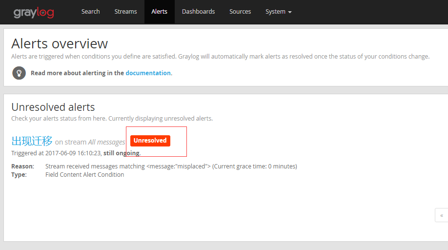

  
  

## 前言

在看集群的配置文件的时候看到ceph里面有一个graylog的输出选择，目前看到的是可以收集mon日志和clog，osd单个的日志没有看到，Elasticsearch有整套的日志收集系统，可以很方便的将所有日志汇总到一起，这个graylog的收集采用的是自有的udp协议，从配置上来说可以很快的完成，这里只做一个最基本的实践  

## 系统实践

graylog日志系统主要由三个组件组成的

- MongoDB – 存储配置信息和一些元数据信息的，MongoDB (>= 2.4)
- Elasticsearch – 用来存储Graylog server收取的log messages的，Elasticsearch (>= 2.x)
- Graylog server – 用来解析日志的并且提供内置的web的访问接口

配置好基础源文件

> CentOS-Base.repo  
> epel.repo

### 安装java

要求版本Java (>= 8)  

<table><tbody><tr><td class="code"><pre>yum install java-1.8.0-openjdk </pre></td></tr></tbody></table>

### 安装MongoDB

安装软件  

<table><tbody><tr><td class="code"><pre>yum install mongodb mongodb-server </pre></td></tr></tbody></table>

启动服务并且加入自启动  

<table><tbody><tr><td class="code"><pre>systemctl restart mongod systemctl enable mongod </pre></td></tr></tbody></table>

安装完成检查服务启动端口  

<table><tbody><tr><td class="code"><pre>[root@lab102 ~]# netstat -tunlp|grep 27017 tcp        0      0 127.0.0.1:27017         0.0.0.0:*               LISTEN      151840/mongod </pre></td></tr></tbody></table>

### 安装Elasticsearch

倒入认证文件  

<table><tbody><tr><td class="code"><pre>rpm --import https://packages.elastic.co/GPG-KEY-elasticsearch </pre></td></tr></tbody></table>

添加源文件  

<table><tbody><tr><td class="code"><pre>vim /etc/yum.repos.d/elasticsearch.repo 添加 [elasticsearch-2.x] name=Elasticsearch repository for 2.x packages baseurl=https://packages.elastic.co/elasticsearch/2.x/centos gpgcheck=1 gpgkey=https://packages.elastic.co/GPG-KEY-elasticsearch enabled=1 </pre></td></tr></tbody></table>

安装elasticsearch包  

<table><tbody><tr><td class="code"><pre>yum install elasticsearch </pre></td></tr></tbody></table>

配置自启动  

<table><tbody><tr><td class="code"><pre>systemctl enable elasticsearch </pre></td></tr></tbody></table>

修改配置文件  

<table><tbody><tr><td class="code"><pre># vim /etc/elasticsearch/elasticsearch.yml  cluster.name: graylog </pre></td></tr></tbody></table>

重启服务  

<table><tbody><tr><td class="code"><pre>systemctl restart  elasticsearch </pre></td></tr></tbody></table>

检查运行服务端口  

<table><tbody><tr><td class="code"><pre>[root@lab102 ~]# netstat -tunlp|grep java tcp        0      0 127.0.0.1:9200          0.0.0.0:*               LISTEN      154116/java  tcp        0      0 127.0.0.1:9300          0.0.0.0:*               LISTEN      154116/java </pre></td></tr></tbody></table>

检查elasticsearch状态  

<table><tbody><tr><td class="code"><pre>[root@lab102 ~]#  curl -X GET http://localhost:9200 {   "name" : "Vibro",   "cluster_name" : "graylog",   "cluster_uuid" : "11Y2GOTmQ9ynNbTlruFcyA",   "version" : {     "number" : "2.4.5",     "build_hash" : "c849dd13904f53e63e88efc33b2ceeda0b6a1276",     "build_timestamp" : "2017-04-24T16:18:17Z",     "build_snapshot" : false,     "lucene_version" : "5.5.4"   },   "tagline" : "You Know, for Search" } </pre></td></tr></tbody></table>

<table><tbody><tr><td class="code"><pre>[root@lab102 ~]# curl -XGET 'http://localhost:9200/_cluster/health?pretty=true' {   "cluster_name" : "graylog",   "status" : "green", </pre></td></tr></tbody></table>

状态应该是green

### 安装graylog

安装源  

<table><tbody><tr><td class="code"><pre>rpm -Uvh https://packages.graylog2.org/repo/packages/graylog-2.2-repository_latest.rpm </pre></td></tr></tbody></table>

安装软件包  

<table><tbody><tr><td class="code"><pre>yum install graylog-server pwgen </pre></td></tr></tbody></table>

生成password\_secret  

<table><tbody><tr><td class="code"><pre>[root@lab102 ~]# pwgen -N 1 -s 96 DoqTYuvQPHaNW6XGFj5jru3FH8qxMjehj7Xk9OaVxhxaLYphF871CyiCMOKuAsHsJc0DtUUkK3ioFeqYo73mkMDUN7YklqgS </pre></td></tr></tbody></table>

在配置文件/etc/graylog/server/server.conf中password\_secret填上上面的输出

生成root\_password\_sha2（后面生成的-不需要）  

<table><tbody><tr><td class="code"><pre>[root@lab102 ~]# echo -n 123456 |shasum -a 256 8d969eef6ecad3c29a3a629280e686cf0c3f5d5a86aff3ca12020c923adc6c92  - </pre></td></tr></tbody></table>

123456是我设置的密码  
在配置文件/etc/graylog/server/server.conf中root\_password\_sha2填上上面的输出

设置时区  

<table><tbody><tr><td class="code"><pre>root_timezone = Asia/Shanghai </pre></td></tr></tbody></table>

配置web监听端口  

<table><tbody><tr><td class="code"><pre>rest_listen_uri = http://192.168.10.2:9000/api/ web_listen_uri = http://192.168.10.2:9000/ </pre></td></tr></tbody></table>

这里注意写上你的web准备使用的那个网卡的IP地址，不要全局监听

启动服务并配置自启动  

<table><tbody><tr><td class="code"><pre>[root@lab102 ~]# systemctl restart graylog-server [root@lab102 ~]# systemctl enable graylog-server </pre></td></tr></tbody></table>

检查服务端口  

<table><tbody><tr><td class="code"><pre>[root@lab102 ~]# netstat -tunlp|grep 9000 tcp        0      0 192.168.10.2:9000       0.0.0.0:*               LISTEN      160129/java </pre></td></tr></tbody></table>

### 使用web进行访问

使用地址[http://192.168.10.2:9000进行访问](http://192.168.10.2:9000进行访问)  
  
用户名admin  
密码123456

  
进来就是引导界面，这个地方是  

<table><tbody><tr><td class="code"><pre>1、把日志发送到graylog 2、对收集到的数据做点搜索 3、创建一个图表 4、创建告警 </pre></td></tr></tbody></table>

到这里配置graylog平台的基础工作就完成了，现在看下怎么跟ceph对接

## 配置ceph的支持

日志从ceph里面输出是采用的GELF UDP方式的

GELF is Graylog2 的json格式的数据，内部采用键值对的方式，ceoh内部传输出来的数据不光有message还有下面的

- hostname
- thread id
- priority
- subsystem name and id
- fsid

选择GELF UDP协议

选择节点，配置监听端口为12291，保存

在lab102上检查端口的监听情况  

<table><tbody><tr><td class="code"><pre>[root@lab102 ~]# netstat -tunlp|grep 12201 udp        0      0 0.0.0.0:12201           0.0.0.0:*                           160129/java </pre></td></tr></tbody></table>

可以看到已经监听好了

修改ceph的配置文件  

<table><tbody><tr><td class="code"><pre>#log_to_graylog = true #err_to_graylog = true #log_graylog_host = 192.168.10.2 #log_graylog_port = 12201 clog_to_graylog = true clog_to_graylog_host = 192.168.10.2 clog_to_graylog_port = 12201 mon_cluster_log_to_graylog = true mon_cluster_log_to_graylog_host = 192.168.10.2 mon_cluster_log_to_graylog_port = 12201 </pre></td></tr></tbody></table>

ceph.conf当中跟graylog有关的就是这些配置文件了，配置好端口是刚刚监听的那个udp端口，然后重启ceph服务，这里我只需要mon\_cluster日志和clog，这个根据自己的需要选择

可以看到ceph -w的输出都可以在这个里面查询了

### 配置告警

  
出现异常的时候  

## 总结

这个系统通过原生的支持把日志输出到这个日志系统，未来这个原生的日志应该可以输出更多的日志信息到这套系统当中，这样相当于有了一个日志搜索系统了，当然还有很多其他的方案，从功能完整性来说Elasticsearch要比这个强大，这个目前来看配置是非常的简单

## 变更记录

| Why | Who | When |
| --- | --- | --- |
| 创建 | 武汉-运维-磨渣 | 2017-06-09 |

Source: zphj1987@gmail ([使用日志系统graylog获取Ceph集群状态](http://www.zphj1987.com/2017/06/09/use-graylog-get-Ceph-status/))
