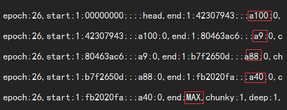

  
  

## 前言

关于scrub这块一直想写一篇文章的，这个在很久前，就做过一次测试，当时是看这个scrub到底有多大的影响，当时看到的是磁盘读占很高，启动deep-scrub后会有大量的读,前端可能会出现 slow request,这个是当时测试看到的现象，一个比较简单的处理办法就是直接给scrub关掉了，当然关掉了就无法检测底层到底有没有对象不一致的问题  
关于这个scrub生产上是否开启，仁者见仁，智者见智，就是选择的问题了，这里不做讨论，个人觉得开和关都有各自的道理，本篇是讲述的如果想开启的情况下如何把scrub给控制住  
  
最近在ceph群里看到一段大致这样的讨论：

> scrub是个坑  
> 小文件多的场景一定要把scrub关掉  
> 单pg的文件量达到一定规模，scrub一开就会有slow request  
> 这个问题解决不了

上面的说法有没有问题呢？在一般情况下来看，确实如此，但是我们是否能尝试去解决下这个问题，或者缓解下呢？那么我们就来尝试下

## scrub的一些追踪

下面的一些追踪并不涉及代码，仅仅从配置和日志的观测来看看scrub到底干了什么

### 环境准备

我的环境为了便于观测，配置的是一个pg的存储池，然后往这个pg里面put了100个对象，然后对这个pg做deep-scrub，deep-scrub比scrub对磁盘的压力要大些，所以本篇主要是去观测的deep-scrub

#### 开启对pg目录的访问的监控

使用的是inotifywait，我想看下deep-scrub的时候，pg里面的对象到底接收了哪些请求

inotifywait -m 1.0\_head  

<table><tbody><tr><td class="code"><pre>1.0_head/ OPEN,ISDIR  1.0_head/ ACCESS,ISDIR  1.0_head/ ACCESS,ISDIR  1.0_head/ CLOSE_NOWRITE,CLOSE,ISDIR  1.0_head/ OPEN,ISDIR  1.0_head/ ACCESS,ISDIR  1.0_head/ ACCESS,ISDIR  1.0_head/ CLOSE_NOWRITE,CLOSE,ISDIR  1.0_head/ OPEN a16__head_8FA46F40__1 1.0_head/ ACCESS a16__head_8FA46F40__1 1.0_head/ OPEN a39__head_621FD720__1 1.0_head/ ACCESS a39__head_621FD720__1 1.0_head/ OPEN a30__head_655287E0__1 1.0_head/ ACCESS a30__head_655287E0__1 1.0_head/ OPEN a91__head_B02EE3D0__1 1.0_head/ ACCESS a91__head_B02EE3D0__1 1.0_head/ OPEN a33__head_9E9E3E30__1 1.0_head/ ACCESS a33__head_9E9E3E30__1 1.0_head/ OPEN a92__head_6AFC6B30__1 1.0_head/ ACCESS a92__head_6AFC6B30__1 1.0_head/ OPEN a22__head_AC48AAB0__1 1.0_head/ ACCESS a22__head_AC48AAB0__1 1.0_head/ OPEN a42__head_76B90AC8__1 1.0_head/ ACCESS a42__head_76B90AC8__1 1.0_head/ OPEN a5__head_E5A1A728__1 1.0_head/ ACCESS a5__head_E5A1A728__1 1.0_head/ OPEN a34__head_4D9ABA68__1 1.0_head/ ACCESS a34__head_4D9ABA68__1 1.0_head/ OPEN a69__head_7AF2B6E8__1 1.0_head/ ACCESS a69__head_7AF2B6E8__1 1.0_head/ OPEN a95__head_BD3695B8__1 1.0_head/ ACCESS a95__head_BD3695B8__1 1.0_head/ OPEN a67__head_6BCD37B8__1 1.0_head/ ACCESS a67__head_6BCD37B8__1 1.0_head/ OPEN a10__head_F0F08AF8__1 1.0_head/ ACCESS a10__head_F0F08AF8__1 1.0_head/ OPEN a3__head_88EF0BF8__1 1.0_head/ ACCESS a3__head_88EF0BF8__1 1.0_head/ OPEN a82__head_721BC094__1 1.0_head/ ACCESS a82__head_721BC094__1 1.0_head/ OPEN a48__head_27A729D4__1 1.0_head/ ACCESS a48__head_27A729D4__1 1.0_head/ OPEN a36__head_F63E6AF4__1 1.0_head/ ACCESS a36__head_F63E6AF4__1 1.0_head/ OPEN a29__head_F06D540C__1 1.0_head/ ACCESS a29__head_F06D540C__1 1.0_head/ OPEN a31__head_AC83164C__1 1.0_head/ ACCESS a31__head_AC83164C__1 1.0_head/ OPEN a59__head_884F9B6C__1 1.0_head/ ACCESS a59__head_884F9B6C__1 1.0_head/ OPEN a58__head_06954F6C__1 1.0_head/ ACCESS a58__head_06954F6C__1 1.0_head/ OPEN a55__head_2A42E61C__1 1.0_head/ ACCESS a55__head_2A42E61C__1 1.0_head/ OPEN a90__head_1B88FEDC__1 1.0_head/ ACCESS a90__head_1B88FEDC__1 1.0_head/ OPEN,ISDIR  1.0_head/ ACCESS,ISDIR  1.0_head/ ACCESS,ISDIR  1.0_head/ CLOSE_NOWRITE,CLOSE,ISDIR  1.0_head/ OPEN,ISDIR  1.0_head/ ACCESS,ISDIR  1.0_head/ ACCESS,ISDIR  1.0_head/ CLOSE_NOWRITE,CLOSE,ISDIR  1.0_head/ OPEN a100__head_C29E0C42__1 1.0_head/ ACCESS a100__head_C29E0C42__1 1.0_head/ OPEN a15__head_87123BE2__1 1.0_head/ ACCESS a15__head_87123BE2__1 1.0_head/ OPEN a23__head_AABFFB92__1 1.0_head/ ACCESS a23__head_AABFFB92__1 1.0_head/ OPEN a41__head_4EA9A5D2__1 1.0_head/ ACCESS a41__head_4EA9A5D2__1 1.0_head/ OPEN a85__head_83760D72__1 1.0_head/ ACCESS a85__head_83760D72__1 1.0_head/ OPEN a72__head_8A105D72__1 1.0_head/ ACCESS a72__head_8A105D72__1 1.0_head/ OPEN a60__head_5536480A__1 1.0_head/ ACCESS a60__head_5536480A__1 1.0_head/ OPEN a73__head_F1819D0A__1 1.0_head/ ACCESS a73__head_F1819D0A__1 1.0_head/ OPEN a78__head_6929D12A__1 1.0_head/ ACCESS a78__head_6929D12A__1 1.0_head/ OPEN a57__head_2C43153A__1 1.0_head/ ACCESS a57__head_2C43153A__1 1.0_head/ OPEN a1__head_51903B7A__1 1.0_head/ ACCESS a1__head_51903B7A__1 1.0_head/ OPEN a12__head_14D7ABC6__1 1.0_head/ ACCESS a12__head_14D7ABC6__1 1.0_head/ OPEN a63__head_9490B166__1 1.0_head/ ACCESS a63__head_9490B166__1 1.0_head/ OPEN a53__head_DF95B716__1 1.0_head/ ACCESS a53__head_DF95B716__1 1.0_head/ OPEN a13__head_E09E0896__1 1.0_head/ ACCESS a13__head_E09E0896__1 1.0_head/ OPEN a27__head_7ED31896__1 1.0_head/ ACCESS a27__head_7ED31896__1 1.0_head/ OPEN a43__head_7052A656__1 1.0_head/ ACCESS a43__head_7052A656__1 1.0_head/ OPEN a28__head_E6257CD6__1 1.0_head/ ACCESS a28__head_E6257CD6__1 1.0_head/ OPEN a35__head_ACABD736__1 1.0_head/ ACCESS a35__head_ACABD736__1 1.0_head/ OPEN a54__head_B9482876__1 1.0_head/ CLOSE_WRITE,CLOSE a12__head_14D7ABC6__1 1.0_head/ ACCESS a54__head_B9482876__1 1.0_head/ OPEN a4__head_F12ACA76__1 1.0_head/ CLOSE_WRITE,CLOSE a63__head_9490B166__1 1.0_head/ ACCESS a4__head_F12ACA76__1 1.0_head/ OPEN a84__head_B033038E__1 1.0_head/ ACCESS a84__head_B033038E__1 1.0_head/ OPEN a19__head_D6A64F9E__1 1.0_head/ ACCESS a19__head_D6A64F9E__1 1.0_head/ OPEN a93__head_F54E757E__1 1.0_head/ ACCESS a93__head_F54E757E__1 1.0_head/ OPEN a7__head_1F08F77E__1 1.0_head/ ACCESS a7__head_1F08F77E__1 1.0_head/ OPEN,ISDIR  1.0_head/ ACCESS,ISDIR  1.0_head/ ACCESS,ISDIR  1.0_head/ CLOSE_NOWRITE,CLOSE,ISDIR  1.0_head/ OPEN,ISDIR  1.0_head/ ACCESS,ISDIR  1.0_head/ ACCESS,ISDIR  1.0_head/ CLOSE_NOWRITE,CLOSE,ISDIR  1.0_head/ OPEN a9__head_635C6201__1 1.0_head/ ACCESS a9__head_635C6201__1 1.0_head/ OPEN a11__head_12780121__1 1.0_head/ ACCESS a11__head_12780121__1 1.0_head/ OPEN a50__head_5E524321__1 1.0_head/ ACCESS a50__head_5E524321__1 1.0_head/ OPEN a75__head_27E1CB21__1 1.0_head/ ACCESS a75__head_27E1CB21__1 1.0_head/ OPEN a21__head_69ACD1A1__1 1.0_head/ ACCESS a21__head_69ACD1A1__1 1.0_head/ OPEN a25__head_698E7751__1 1.0_head/ ACCESS a25__head_698E7751__1 1.0_head/ OPEN a44__head_57E29949__1 1.0_head/ ACCESS a44__head_57E29949__1 1.0_head/ OPEN a66__head_944E79C9__1 1.0_head/ ACCESS a66__head_944E79C9__1 1.0_head/ OPEN a52__head_DAC6BF29__1 1.0_head/ ACCESS a52__head_DAC6BF29__1 1.0_head/ OPEN a14__head_295EA1A9__1 1.0_head/ ACCESS a14__head_295EA1A9__1 1.0_head/ OPEN a70__head_62941259__1 1.0_head/ ACCESS a70__head_62941259__1 1.0_head/ OPEN a18__head_53B48959__1 1.0_head/ ACCESS a18__head_53B48959__1 1.0_head/ OPEN a17__head_7D103759__1 1.0_head/ ACCESS a17__head_7D103759__1 1.0_head/ OPEN a6__head_9505BEF9__1 1.0_head/ ACCESS a6__head_9505BEF9__1 1.0_head/ OPEN a77__head_88A7CC25__1 1.0_head/ ACCESS a77__head_88A7CC25__1 1.0_head/ OPEN a37__head_141AFE65__1 1.0_head/ ACCESS a37__head_141AFE65__1 1.0_head/ OPEN a74__head_90DAAD15__1 1.0_head/ ACCESS a74__head_90DAAD15__1 1.0_head/ OPEN a32__head_B7957195__1 1.0_head/ ACCESS a32__head_B7957195__1 1.0_head/ OPEN a45__head_CCCFB5D5__1 1.0_head/ ACCESS a45__head_CCCFB5D5__1 1.0_head/ OPEN a24__head_3B937275__1 1.0_head/ ACCESS a24__head_3B937275__1 1.0_head/ OPEN a26__head_2AB240F5__1 1.0_head/ ACCESS a26__head_2AB240F5__1 1.0_head/ OPEN a89__head_8E387EF5__1 1.0_head/ ACCESS a89__head_8E387EF5__1 1.0_head/ OPEN a80__head_6FEFE78D__1 1.0_head/ ACCESS a80__head_6FEFE78D__1 1.0_head/ OPEN a51__head_0BCC72CD__1 1.0_head/ ACCESS a51__head_0BCC72CD__1 1.0_head/ OPEN a71__head_88F4796D__1 1.0_head/ ACCESS a71__head_88F4796D__1 1.0_head/ OPEN,ISDIR  1.0_head/ ACCESS,ISDIR  1.0_head/ ACCESS,ISDIR  1.0_head/ CLOSE_NOWRITE,CLOSE,ISDIR  1.0_head/ OPEN,ISDIR  1.0_head/ ACCESS,ISDIR  1.0_head/ ACCESS,ISDIR  1.0_head/ CLOSE_NOWRITE,CLOSE,ISDIR  1.0_head/ OPEN a88__head_B0A64FED__1 1.0_head/ ACCESS a88__head_B0A64FED__1 1.0_head/ OPEN a8__head_F885EA9D__1 1.0_head/ ACCESS a8__head_F885EA9D__1 1.0_head/ OPEN a83__head_1322679D__1 1.0_head/ ACCESS a83__head_1322679D__1 1.0_head/ OPEN a76__head_B8285A7D__1 1.0_head/ ACCESS a76__head_B8285A7D__1 1.0_head/ OPEN a94__head_D3BBB683__1 1.0_head/ ACCESS a94__head_D3BBB683__1 1.0_head/ OPEN a46__head_E2C6C983__1 1.0_head/ ACCESS a46__head_E2C6C983__1 1.0_head/ OPEN a56__head_A1E888C3__1 1.0_head/ ACCESS a56__head_A1E888C3__1 1.0_head/ OPEN a99__head_DD3B45C3__1 1.0_head/ ACCESS a99__head_DD3B45C3__1 1.0_head/ OPEN a79__head_AC19FC13__1 1.0_head/ ACCESS a79__head_AC19FC13__1 1.0_head/ OPEN a81__head_BC0AFFF3__1 1.0_head/ ACCESS a81__head_BC0AFFF3__1 1.0_head/ OPEN a64__head_C042B84B__1 1.0_head/ ACCESS a64__head_C042B84B__1 1.0_head/ OPEN a97__head_29054B4B__1 1.0_head/ ACCESS a97__head_29054B4B__1 1.0_head/ OPEN a96__head_BAAC0DCB__1 1.0_head/ ACCESS a96__head_BAAC0DCB__1 1.0_head/ OPEN a62__head_84A40AAB__1 1.0_head/ ACCESS a62__head_84A40AAB__1 1.0_head/ OPEN a98__head_C15FD53B__1 1.0_head/ ACCESS a98__head_C15FD53B__1 1.0_head/ OPEN a87__head_12F9237B__1 1.0_head/ ACCESS a87__head_12F9237B__1 1.0_head/ OPEN a2__head_E2983C17__1 1.0_head/ ACCESS a2__head_E2983C17__1 1.0_head/ OPEN a20__head_7E477A77__1 1.0_head/ ACCESS a20__head_7E477A77__1 1.0_head/ OPEN a49__head_3ADEC577__1 1.0_head/ ACCESS a49__head_3ADEC577__1 1.0_head/ OPEN a61__head_C860ABF7__1 1.0_head/ ACCESS a61__head_C860ABF7__1 1.0_head/ OPEN a68__head_BC5C8F8F__1 1.0_head/ ACCESS a68__head_BC5C8F8F__1 1.0_head/ OPEN a38__head_78AE322F__1 1.0_head/ ACCESS a38__head_78AE322F__1 1.0_head/ OPEN a65__head_7EE57AEF__1 1.0_head/ ACCESS a65__head_7EE57AEF__1 1.0_head/ OPEN a47__head_B6C48D1F__1 1.0_head/ ACCESS a47__head_B6C48D1F__1 1.0_head/ OPEN a86__head_7FB2C85F__1 1.0_head/ ACCESS a86__head_7FB2C85F__1 1.0_head/ OPEN,ISDIR  1.0_head/ ACCESS,ISDIR  1.0_head/ ACCESS,ISDIR  1.0_head/ CLOSE_NOWRITE,CLOSE,ISDIR  1.0_head/ OPEN,ISDIR  1.0_head/ ACCESS,ISDIR  1.0_head/ ACCESS,ISDIR  1.0_head/ CLOSE_NOWRITE,CLOSE,ISDIR  1.0_head/ OPEN a40__head_5F0404DF__1 1.0_head/ ACCESS a40__head_5F0404DF__1 </pre></td></tr></tbody></table>

在给osd.0开启debug\_osd=20后观测chunky相关的日志  

<table><tbody><tr><td class="code"><pre>[root@lab8106 ceph]# cat ceph-osd.0.log |grep chunky:1|grep handle_replica_op 2017-08-18 23:50:40.262448 7f2ac583c700 10 osd.0 26 handle_replica_op replica scrub(pg: 1.0,from:0'0,to:22'2696,epoch:26,start:1:00000000::::head,end:1:42307943:::a100:0,chunky:1,deep:1,seed:4294967295,version:6) v6 epoch 26 2017-08-18 23:50:40.294637 7f2ac583c700 10 osd.0 26 handle_replica_op replica scrub(pg: 1.0,from:0'0,to:22'2694,epoch:26,start:1:42307943:::a100:0,end:1:80463ac6:::a9:0,chunky:1,deep:1,seed:4294967295,version:6) v6 epoch 26 2017-08-18 23:50:40.320986 7f2ac583c700 10 osd.0 26 handle_replica_op replica scrub(pg: 1.0,from:0'0,to:22'2690,epoch:26,start:1:80463ac6:::a9:0,end:1:b7f2650d:::a88:0,chunky:1,deep:1,seed:4294967295,version:6) v6 epoch 26 2017-08-18 23:50:40.337646 7f2ac583c700 10 osd.0 26 handle_replica_op replica scrub(pg: 1.0,from:0'0,to:22'2700,epoch:26,start:1:b7f2650d:::a88:0,end:1:fb2020fa:::a40:0,chunky:1,deep:1,seed:4294967295,version:6) v6 epoch 26 2017-08-18 23:50:40.373227 7f2ac583c700 10 osd.0 26 handle_replica_op replica scrub(pg: 1.0,from:0'0,to:22'2636,epoch:26,start:1:fb2020fa:::a40:0,end:MAX,chunky:1,deep:1,seed:4294967295,version:6) v6 epoch 26 </pre></td></tr></tbody></table>

截取关键部分看下，如图  
  
我们看下上面的文件访问监控里面这些对象在什么位置  

<table><tbody><tr><td class="code"><pre>25:1.0_head/ ACCESS a100__head_C29E0C42__1 50:1.0_head/ ACCESS a9__head_635C6201__1 75:1.0_head/ ACCESS a88__head_B0A64FED__1 100:1.0_head/ ACCESS a40__head_5F0404DF__1 </pre></td></tr></tbody></table>

看上去是不是很有规律，这个地方在ceph里面会有个chunk的概念，在做scrub的时候，ceph会对这个chunk进行加锁，这个可以在很多地方看到这个，这个也就是为什么有slow request，并不一定是你的磁盘慢了，而是加了锁，就没法读的

> osd scrub chunk min
> 
> Description: The minimal number of object store chunks to scrub during single operation. Ceph blocks writes to single chunk during scrub.  
> Type: 32-bit Integer  
> Default: 5

从配置文件上面看说是会锁住写，没有提及读的锁定的问题，那么我们下面验证下这个问题，到底deep-scrub，是不是会引起读的slow request

上面的环境100个对象，现在把100个对象的大小调整为100M一个，并且chunk设置为100个对象的，也就是我把我这个环境所有的对象认为是一个大的chunk，然后去用rados读取这个对象，来看下会发生什么

<table><tbody><tr><td class="code"><pre>osd_scrub_chunk_min = 100 osd_scrub_chunk_max = 100 </pre></td></tr></tbody></table>

使用ceph -w监控  

<table><tbody><tr><td class="code"><pre>2017-08-19 00:19:26.045032 mon.0 [INF] pgmap v377: 1 pgs: 1 active+clean+scrubbing+deep; 10000 MB data, 30103 MB used, 793 GB / 822 GB avail 2017-08-19 00:19:17.540413 osd.0 [WRN] 1 slow requests, 1 included below; oldest blocked for &gt; 30.398705 secs 2017-08-19 00:19:17.540456 osd.0 [WRN] slow request 30.398705 seconds old, received at 2017-08-19 00:18:47.141483: replica scrub(pg: 1.0,from:0'0,to:26'5200,epoch:32,start:1:00000000::::head,end:MAX,chunky:1,deep:1,seed:4294967295,version:6) currently reached_pg </pre></td></tr></tbody></table>

我从deep scrub 一开始就进行a40对象的get rados -p rbd get a40 a40，直接就卡着不返回，在pg内对象不变的情况下，对pg做scrub的顺序是不变的，我专门挑了我这个scrub顺序下最后一个scrub的对象来做get，还是出现了slow request ，这个可以证明上面的推断，也就是在做scrub的时候，对scub的chunk的对象的读取请求也会卡死，现在我把我的scrub的chunk弄成1看下会发生什么

配置参数改成  

<table><tbody><tr><td class="code"><pre>osd_scrub_chunk_min = 1 osd_scrub_chunk_max = 1 </pre></td></tr></tbody></table>

<table><tbody><tr><td class="code"><pre>watch -n 1 'rados -p rbd get a9 a1' watch -n 1 'rados -p rbd get a9 a2' watch -n 1 'rados -p rbd get a9 a3' watch -n 1 'rados -p rbd get a9 a4' watch -n 1 'rados -p rbd get a9 a5' </pre></td></tr></tbody></table>

使用五个请求同时去get a9,循环的去做

然后做deep scrub，这一次并没有出现slow request 的情况

### 另外一个重要参数

再看看这个参数osd\_scrub\_sleep = 0

> osd scrub sleep
> 
> Description: Time to sleep before scrubbing next group of chunks. Increasing this value will slow down whole scrub operation while client operations will be less impacted.  
> Type: Float  
> Default: 0

可以看到还有scrub group这个概念，从数据上分析这个group 是3，也就是3个chunks  
我们来设置下

> osd\_scrub\_sleep = 5

然后再次做deep-scrub,然后看下日志的内容  

<table><tbody><tr><td class="code"><pre>cat /var/log/ceph/ceph-osd.0.log |grep be_deep_scrub|awk '{print $1,$2,$28}'|less 2017-08-19 00:48:37.930455 1:02f625f1:::a16:head 2017-08-19 00:48:38.477271 1:02f625f1:::a16:head 2017-08-19 00:48:38.477367 1:04ebf846:::a39:head 2017-08-19 00:48:39.023952 1:04ebf846:::a39:head 2017-08-19 00:48:39.024084 1:07e14aa6:::a30:head 2017-08-19 00:48:39.572683 1:07e14aa6:::a30:head 2017-08-19 00:48:44.989551 1:0bc7740d:::a91:head 2017-08-19 00:48:45.556758 1:0bc7740d:::a91:head 2017-08-19 00:48:45.556857 1:0c7c7979:::a33:head 2017-08-19 00:48:46.109657 1:0c7c7979:::a33:head 2017-08-19 00:48:46.109768 1:0cd63f56:::a92:head 2017-08-19 00:48:46.657849 1:0cd63f56:::a92:head 2017-08-19 00:48:52.084712 1:0d551235:::a22:head 2017-08-19 00:48:52.614345 1:0d551235:::a22:head 2017-08-19 00:48:52.614458 1:13509d6e:::a42:head 2017-08-19 00:48:53.158826 1:13509d6e:::a42:head 2017-08-19 00:48:53.158916 1:14e585a7:::a5:head </pre></td></tr></tbody></table>

可以看到1s做一个对象的deep-scrub，然后在做了3个对象后就停止了5s

### 默认情况下的scrub和修改后的对比

我们来计算下在修改前后的情况对比，我们来模拟pg里面有10000个对象的情况小文件 测试的文件都是1K的，这个可以根据自己的文件模型进行测试

假设是海量对象的场景，那么算下来单pg 1w左右对象左右也算比较多了，我们就模拟10000个对象的场景的deep-scrub  

<table><tbody><tr><td class="code"><pre>cat /var/log/ceph/ceph-osd.0.log |grep be_deep_scrub|awk '{print $1,$2,$28}'|awk '{sub(/.*/,substr($2,1,8),$2); print $0}'|uniq|awk '{a[$1," ",$2]++}END{for (j in a) print j,a[j]|"sort -k 1"}' </pre></td></tr></tbody></table>

使用上面的脚本统计每秒scrub的对象数目  

<table><tbody><tr><td class="code"><pre>2017-08-19 01:23:33 184 2017-08-19 01:23:34 236 2017-08-19 01:23:35 261 2017-08-19 01:23:36 263 2017-08-19 01:23:37 229 2017-08-19 01:23:38 289 2017-08-19 01:23:39 236 2017-08-19 01:23:40 258 2017-08-19 01:23:41 276 2017-08-19 01:23:42 238 2017-08-19 01:23:43 224 2017-08-19 01:23:44 282 2017-08-19 01:23:45 254 2017-08-19 01:23:46 258 2017-08-19 01:23:47 261 2017-08-19 01:23:48 233 2017-08-19 01:23:49 300 2017-08-19 01:23:50 243 2017-08-19 01:23:51 257 2017-08-19 01:23:52 252 2017-08-19 01:23:53 246 2017-08-19 01:23:54 313 2017-08-19 01:23:55 252 2017-08-19 01:23:56 276 2017-08-19 01:23:57 245 2017-08-19 01:23:58 256 2017-08-19 01:23:59 307 2017-08-19 01:24:00 276 2017-08-19 01:24:01 310 2017-08-19 01:24:02 220 2017-08-19 01:24:03 250 2017-08-19 01:24:04 313 2017-08-19 01:24:05 265 2017-08-19 01:24:06 304 2017-08-19 01:24:07 262 2017-08-19 01:24:08 308 2017-08-19 01:24:09 263 2017-08-19 01:24:10 293 2017-08-19 01:24:11 42 </pre></td></tr></tbody></table>

可以看到1s 会扫300个对象左右，差不多40s钟就扫完了一个pg，默认25个对象一个trunk

这里可以打个比喻，在一条长为40m的马路上，一个汽车以1m/s速度前进，中间会有人来回穿，如果穿梭的人只有一两个可能没什么问题，但是一旦有40个人在这个区间进行穿梭的时候，可想而知碰撞的概率会有多大了

或者同一个文件被连续请求40次，那么对应到这里就是40个人在同一个位置不停的穿马路，这样撞上的概率是不是非常的大了？

上面说了这么多，那么我想如果整个看下来，应该知道怎么处理了  
我们看下这样的全部为1的情况下，会出现什么情况  

<table><tbody><tr><td class="code"><pre>osd_scrub_chunk_min = 1 osd_scrub_chunk_max = 1 osd_scrub_sleep = 3 </pre></td></tr></tbody></table>

这里减少chunk大小，相当于减少上面例子当中汽车的长度，原来25米的大卡车，变成1米的自行车了

<table><tbody><tr><td class="code"><pre>[root@lab8106 ceph]# cat /var/log/ceph/ceph-osd.0.log |grep be_deep_scrub|awk '{print $1,$2,$28}' 2017-08-19 16:12:21.927440 1:0000b488:::a5471:head 2017-08-19 16:12:21.931914 1:0000b488:::a5471:head 2017-08-19 16:12:21.932039 1:000fbbcb:::a5667:head 2017-08-19 16:12:21.933568 1:000fbbcb:::a5667:head 2017-08-19 16:12:21.933646 1:00134ebd:::a1903:head 2017-08-19 16:12:21.934972 1:00134ebd:::a1903:head 2017-08-19 16:12:24.960697 1:0018f641:::a2028:head 2017-08-19 16:12:24.966653 1:0018f641:::a2028:head 2017-08-19 16:12:24.966733 1:00197a21:::a1463:head 2017-08-19 16:12:24.967085 1:00197a21:::a1463:head 2017-08-19 16:12:24.967162 1:001cb17d:::a1703:head 2017-08-19 16:12:24.967492 1:001cb17d:::a1703:head 2017-08-19 16:12:27.972252 1:002d911c:::a1585:head 2017-08-19 16:12:27.976621 1:002d911c:::a1585:head 2017-08-19 16:12:27.976740 1:00301acf:::a6131:head 2017-08-19 16:12:27.977097 1:00301acf:::a6131:head 2017-08-19 16:12:27.977181 1:0039a0a8:::a1840:head 2017-08-19 16:12:27.979053 1:0039a0a8:::a1840:head 2017-08-19 16:12:30.983556 1:00484881:::a8781:head 2017-08-19 16:12:30.989098 1:00484881:::a8781:head 2017-08-19 16:12:30.989181 1:004f234f:::a4402:head 2017-08-19 16:12:30.989531 1:004f234f:::a4402:head 2017-08-19 16:12:30.989626 1:00531b36:::a5251:head 2017-08-19 16:12:30.989954 1:00531b36:::a5251:head 2017-08-19 16:12:33.994419 1:00584c30:::a3374:head 2017-08-19 16:12:34.001296 1:00584c30:::a3374:head 2017-08-19 16:12:34.001378 1:005d6aa5:::a2115:head 2017-08-19 16:12:34.002174 1:005d6aa5:::a2115:head 2017-08-19 16:12:34.002287 1:005e0dfd:::a9945:head 2017-08-19 16:12:34.002686 1:005e0dfd:::a9945:head 2017-08-19 16:12:37.005645 1:006320f9:::a5207:head 2017-08-19 16:12:37.011498 1:006320f9:::a5207:head 2017-08-19 16:12:37.011655 1:006d32b4:::a7517:head 2017-08-19 16:12:37.011998 1:006d32b4:::a7517:head 2017-08-19 16:12:37.012111 1:006dae55:::a4702:head 2017-08-19 16:12:37.012442 1:006dae55:::a4702:head </pre></td></tr></tbody></table>

上面从日志里面截取部分的日志，这个是什么意思呢，是每秒钟扫描3个对象，然后休息3s再进行下一个，这个是不是已经把速度压到非常低了？还有上面做测试scrub sleep例子里面好像是1s 会scrub 1个对象，这里怎么就成了1s会scrub 3 个对象了，这个跟scrub的对象大小有关，对象越大，scrub的时间就相对长一点，这个测试里面的对象是1K的，基本算非常小了，也就是1s会扫描3个对象，然后根据你的设置的sleep值等待进入下一组的scrub

在上面的环境下默认每秒钟会对300左右的对象进行scrub，以25个对象的锁定窗口移动，无法写入和读取，而参数修改后每秒有3个对象被scrub，以1个对象的锁定窗口移动，这个单位时间锁定的对象的数目已经降低到一个非常低的程度了，如果你有生产环境又想去开scrub，不妨尝试下降低chunk，增加sleep

这个的影响就是扫描的速度而已，而如果你想加快扫描速度，就去调整sleep参数来控制这个扫描的速度了，这个就不在这里赘述了

本篇讲述的是一个PG上开启deep-scrub以后的影响，默认的是到了最大的intelval以后就会开启自动开启scrub了，所以我建议的是不用系统自带的时间控制，而是自己去分析的scrub的时间戳和对象数目，然后计算好以后，可以是每天晚上，扫描指定个数的PG，然后等一轮全做完以后，中间就是自定义的一段时间的不扫描期，这个可以自己定义，是一个月或者两个月扫一轮都行，这个会在后面单独写一篇文章来讲述这个

## 总结

关于scrub，你需要了解，scrub什么时候会发生，发生以后会对你的osd产生多少的负载，每秒钟会扫描多少对象，如何去降低这个影响，这些问题就是本篇的来源了，很多问题是能从参数上进行解决的，关键是你要知道它们到底在干嘛

Source: zphj1987@gmail ([关于scrub的详细分析和建议](http://www.zphj1987.com/2017/08/19/about-scrub-suggestion/))
