  
  

## 前言

前一篇介绍了docker在命令行下面进行的ceph部署，本篇用docker的UI进行ceph的部署，目前来说市面上还没有一款能够比较简单就能直接在OS上面去部署Ceph的管理平台，这是因为OS的环境差异化太大，并且包的版本，以及各种软件的适配都可能造成失败，而docker比较固化环境，因此即使一个通用的UI也能很方便的部署出一个Cpeh集群

本篇就是对Docker UI部署集群做一个实践，对ceph了解，对docker了解，对dokcer的UI操作进行一定的了解的情况下，再做实践会比较好，总体上还是比较简单的  

## 安装并运行portainer

### 安装软件

<table><tbody><tr><td class="code"><pre>cd /opt wget https://github.com/portainer/portainer/releases/download/1.12.1/portainer-1.12.1-linux-amd64.tar.gz tar xvpfz portainer-1.12.1-linux-amd64.tar.gz cd portainer </pre></td></tr></tbody></table>

### 运行软件

<table><tbody><tr><td class="code"><pre>./portainer -H unix:///var/run/docker.sock  -p ":9999" </pre></td></tr></tbody></table>

注意下这里-H是指定的docker的连接，也就是要控制哪个docker，这个支持本地的sock的方式，也支持远程的tcp的方式，这个进入ui界面后还可以添加更多的  
\-p是指定的访问的接口

### 扩展知识

如何在centos7下面启用 remote api  
打开文件  

<table><tbody><tr><td class="code"><pre>/usr/lib/systemd/system/docker.service </pre></td></tr></tbody></table>

在 `$INSECURE_REGISTRY` 后面添加 `-H tcp://0.0.0.0:2376 -H unix:///var/run/docker.sock`  

<table><tbody><tr><td class="code"><pre>ExecStart=/usr/bin/dockerd-current            --add-runtime docker-runc=/usr/libexec/docker/docker-runc-current            --default-runtime=docker-runc            --exec-opt native.cgroupdriver=systemd            --userland-proxy-path=/usr/libexec/docker/docker-proxy-current            $OPTIONS            $DOCKER_STORAGE_OPTIONS            $DOCKER_NETWORK_OPTIONS            $ADD_REGISTRY            $BLOCK_REGISTRY            $INSECURE_REGISTRY  -H tcp://0.0.0.0:2376 -H unix:///var/run/docker.sock </pre></td></tr></tbody></table>

修改好了后  

<table><tbody><tr><td class="code"><pre>[root@lab8106 ~]#systemctl daemon-reload [root@lab8106 ~]#systemctl restart docker </pre></td></tr></tbody></table>

检查端口和asok  

<table><tbody><tr><td class="code"><pre>[root@lab8106 ~]# netstat -tunlp|grep 2376 tcp6       0      0 :::2376                 :::*                    LISTEN      24484/dockerd-curre  [root@lab8106 ~]# ll /var/run/docker.sock srw-rw---- 1 root root 0 Mar 16 16:39 /var/run/docker.sock </pre></td></tr></tbody></table>

生成了配置没有问题

#### portainer的自身数据

默认情况下portainer的数据是存储在/data目录下面的，如果想重新配置密码或者内容的话，删除这个目录里面的数据就行  

<table><tbody><tr><td class="code"><pre>[root@lab8106 ~]# ll /data/ total 24 -rw------- 1 root root 32768 Mar 16 16:32 portainer.db drwx------ 2 root root     6 Mar 16 16:32 tls </pre></td></tr></tbody></table>

## UI界面登陆

直接访问宿主机的`http://ip:9999`  
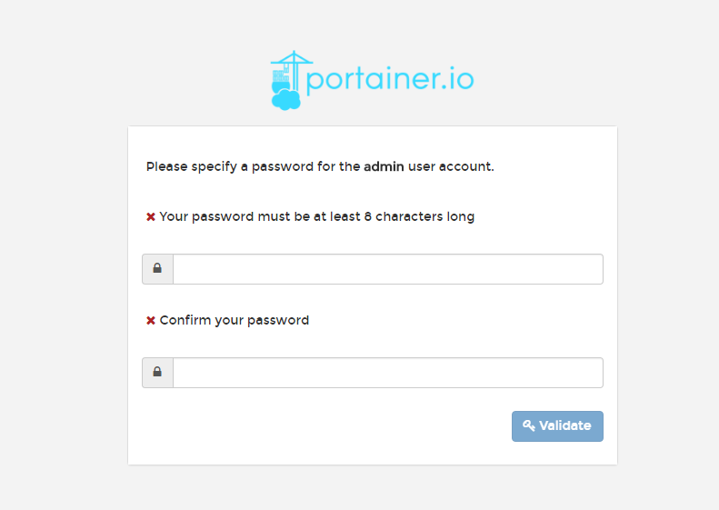  
输入一个8位数的密码  
输入好了以后，登陆即可

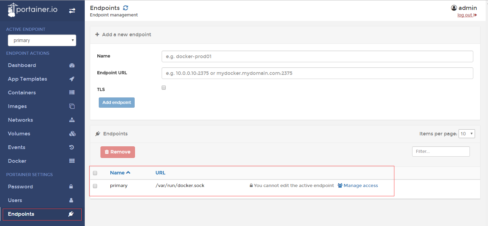

检查endpoint，可以看到就是我刚才命令行当中加入的sock

## 获取image

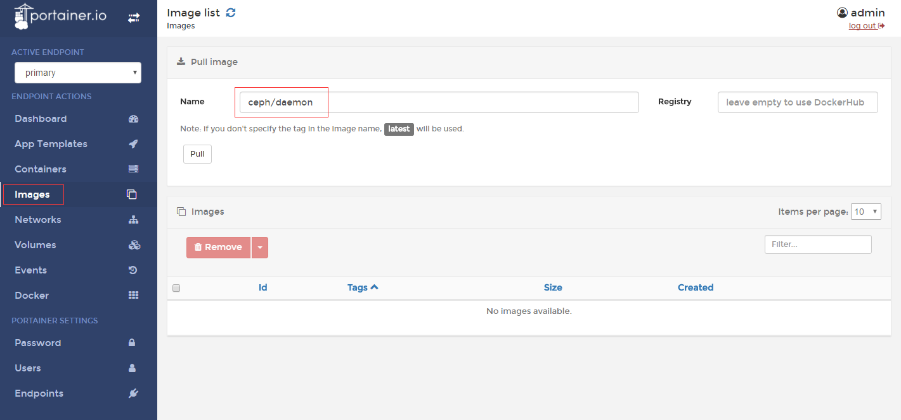

在上面填写`ceph/daemon` 然后点击pull

有可能会超时，如果多次失败，就去后台命令行执行，这个地方等同于后台的命令  

<table><tbody><tr><td class="code"><pre>docker pull ceph/daemon </pre></td></tr></tbody></table>

也可以直接在后台执行这个命令  
可以用dstat -n观察下载的速度

下载好了去页面上看下是否好了  
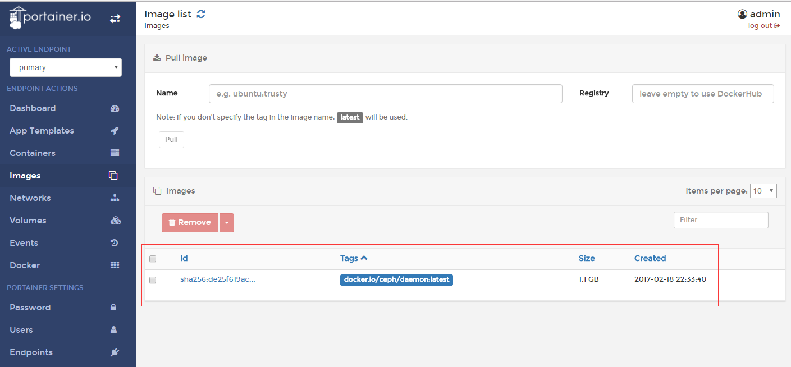

## 配置CEPH集群

配置集群可以都在页面做了，因为之前有篇命令行部署docker的ceph，建议先回顾一下，再看这个比较好

### 创建MON

点击增加容器  
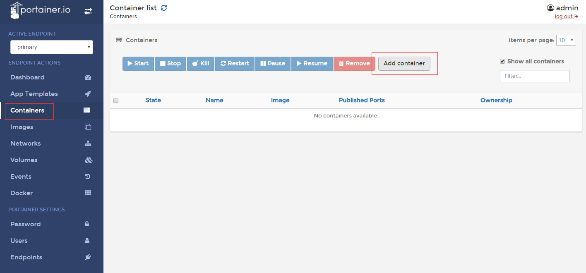

注意创建好两个目录  

<table><tbody><tr><td class="code"><pre>mkdir -p /etc/ceph mkdir -p /var/lib/ceph/ </pre></td></tr></tbody></table>

这两个目录里面不要有任何东西,保持空目录状态

- 填写名称为mon，这个是容器名称，可以自定义
- 填写Image，这个填写下载好的ceph/daemon
- 填写command,这个填写mon，为固定值
- 填写Entry Ponit ,这个填写/entrypoint.sh，为固定值
- 填写Environment variable，这个填写两个变量
    - MON\_IP 192.168.8.106
    - CEPH\_PUBLIC\_NETWORK 192.168.0.0/16

填写完了切换第二个标签页Volumes  
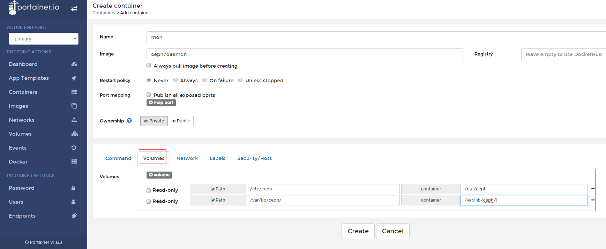

- 填写Volume
    - /etc/ceph /etc/ceph
    - /var/lib/ceph/ /var/lib/ceph/

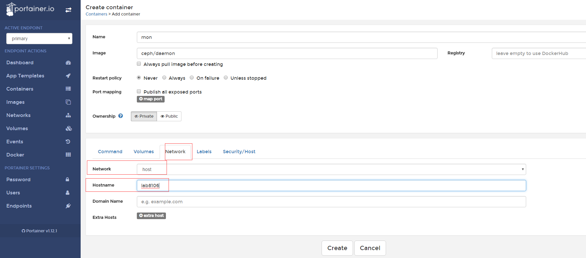

- 填写Network为host
- 填写hostname为宿主机的主机名  
    上面都填写完了后就点击create

没出异常的话，就可以进入console进行查询了  
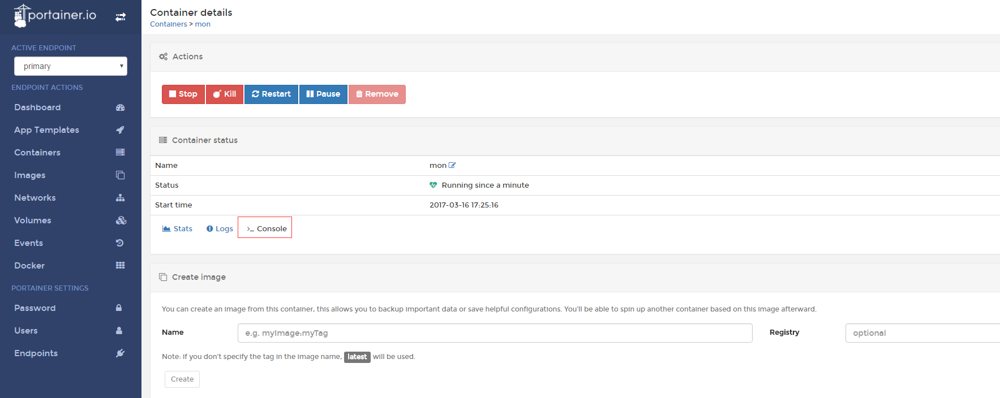  
点击connect  
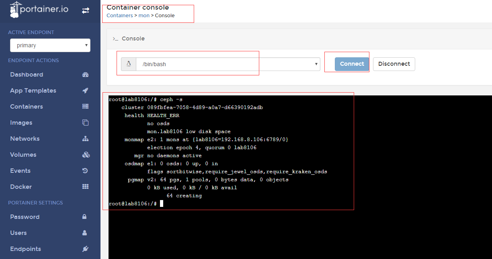  
没有问题

### 创建OSD

点击增加容器  

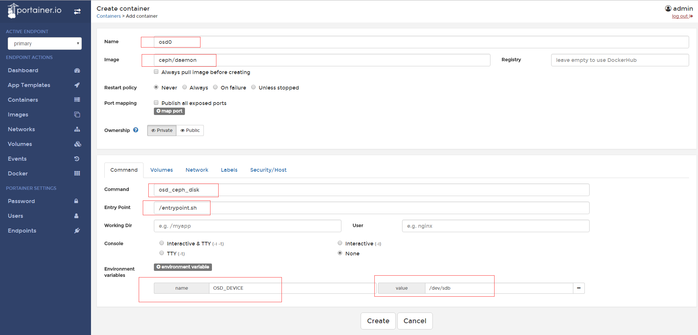

- 填写Name，这个为容器名称，可以自定义
- 填写Image,这个为ceph/daemon,固定的值
- 填写command,这个为osd\_ceph\_disk，为定值
- 填写Entry Ponit ,这个填写/entrypoint.sh，为固定值
- 填写Environment variable，这个填写一个OSD磁盘变量
    - OSD\_DEVICE /dev/sdb

切换到第二个Volume标签页

- 填写Volume
    - /etc/ceph /etc/ceph
    - /var/lib/ceph/ /var/lib/ceph/
    - /dev/ /dev/

切换到Network标签页

- 填写Network为host
- 填写hostname为宿主机的主机名  
    上面都填写完了后就点击create

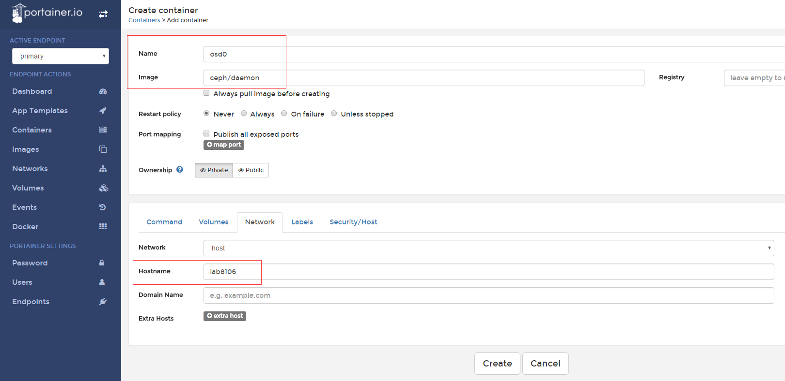  
切换到Security/Host标签页  
勾选上 `privileged`,一定要选上，不然没有权限去格式化磁盘

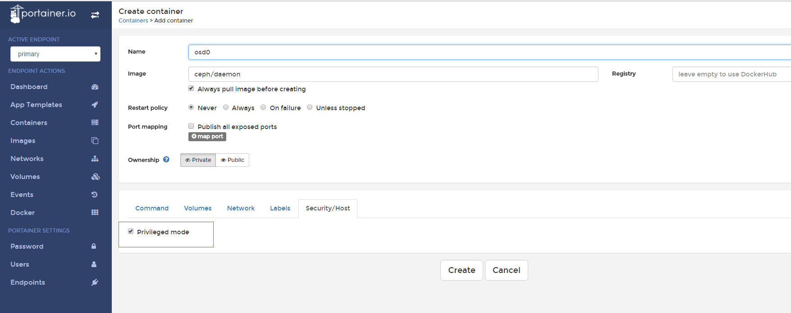  
上面都填写完了后就点击create  
没出异常的话，就可以进入console进行查询了  
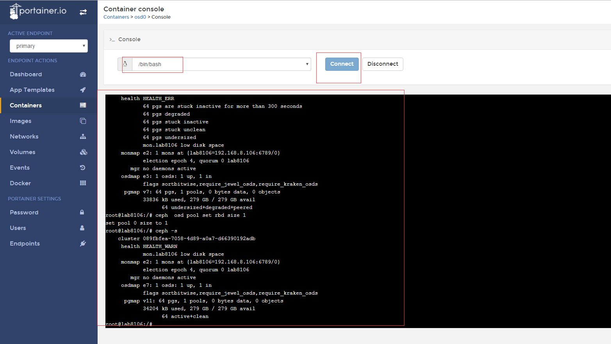

基本上一个简单的集群就配置好了，跨主机的情况，就提前把配置文件拷贝到另外一台主机，还有bootstrap keyring也拷贝过去，就可以了，这里就不做过多的赘述

## 总结

本篇基于portainer以及一个现有的ceph容器做的部署实践，从整个操作来说，UI的部署，环境的搭建都非常的简单，这个得益于UI环境的简单，还有docker的封装，更多的玩法可以自己去探索，也可以运用这个UI做更多其他的容器操作

## 变更记录

| Why | Who | When |
| --- | --- | --- |
| 创建 | 武汉-运维-磨渣 | 2017-03-16 |

Source: zphj1987@gmail ([基于Docker UI 配置ceph集群](http://www.zphj1987.com/2017/03/16/base-on-docker-ui-deploy-ceph/))
