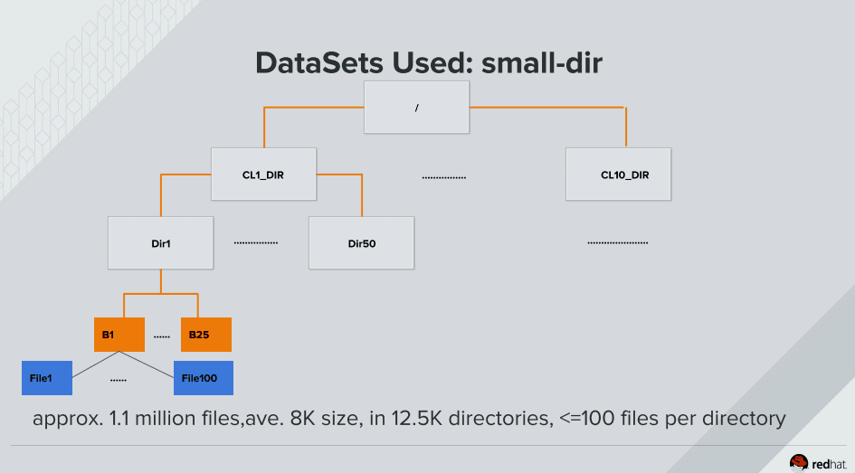
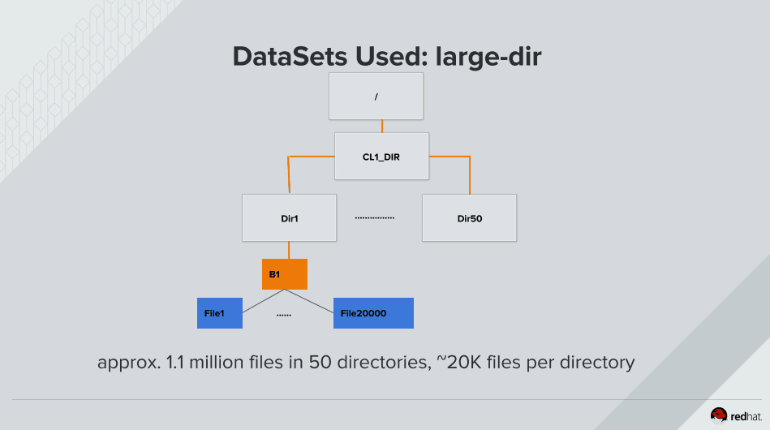
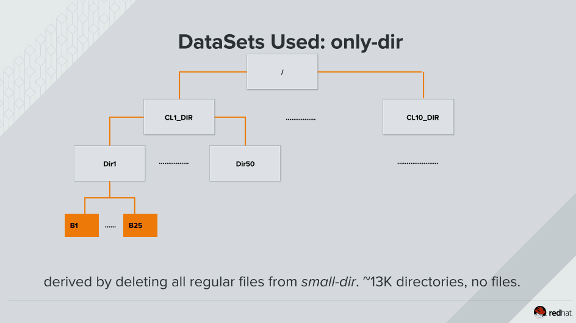

  
  

## 前言

在看一个Linux Vault 2017的资料的时候，看到红帽分享的一个测试的过程，里面关于小文件元数据性能测试的，环境准备的还比较好,可以作为一种测试模型  

## 测试用例

测试用例一：

  
  
  
使用find -name 测试 find -size 测试  
测试用例二：

  
  
  
使用find -name 测试 find -size 测试

测试用例三：

  
  
  
使用rmdir进行测试

## 总结

本篇就是记录一个测试模型

## 变更记录

| Why | Who | When |
| --- | --- | --- |
| 创建 | 武汉-运维-磨渣 | 2017-03-24 |

Source: zphj1987@gmail ([小文件测试数据准备](http://www.zphj1987.com/2017/03/24/small-file-test-prepare/))
