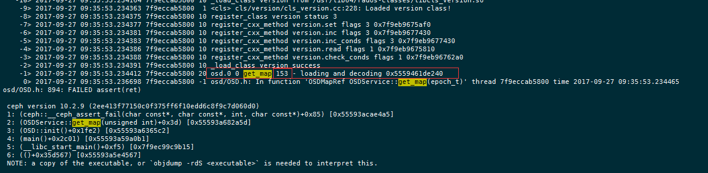

  
  

## 前言

本篇讲述的是一个比较极端的故障的恢复场景，在整个集群全部服务器突然掉电的时候，osd里面的osdmap可能会出现没刷到磁盘上的情况，这个时候osdmap的最新版本为空或者为没有这个文件

还有一种情况就是机器宕机了，没有马上处理，等了一段时间以后，服务器机器启动了起来，而这个时候osdmap已经更新了，全局找不到需要的旧版本的osdmap和incmap，osd无法启动

一般情况下能找到的就直接从其他osd上面拷贝过来，然后就可以启动了，本篇讲述的是无法启动的情况  

## 解决方案

### 获取运行的ceph集群当前版本

<table><tbody><tr><td class="code"><pre>[root@lab8107 ~]# ceph -v ceph version 10.2.9 (2ee413f77150c0f375ff6f10edd6c8f9c7d060d0) </pre></td></tr></tbody></table>

获取最新的osdmap  

<table><tbody><tr><td class="code"><pre>[root@lab8107 ~]# ceph osd getmap -o /tmp/productosdmap got osdmap epoch 142 </pre></td></tr></tbody></table>

通过osdmap可以得到crushmap，fsid，osd，存储池，pg等信息

提取crushmap  

<table><tbody><tr><td class="code"><pre>[root@lab8107 tmp]# osdmaptool /tmp/productosdmap --export-crush /tmp/productcrushmap osdmaptool: osdmap file '/tmp/productosdmap' osdmaptool: exported crush map to /tmp/productcrushmap </pre></td></tr></tbody></table>

拷贝到开发环境的机器上面

通过osdmap获取集群的fsid  

<table><tbody><tr><td class="code"><pre>[root@lab8107 tmp]# osdmaptool --print productosdmap |grep fsid osdmaptool: osdmap file 'productosdmap' fsid d153844c-16f5-4f48-829d-87fb49120bbe </pre></td></tr></tbody></table>

获取存储池相关的信息  

<table><tbody><tr><td class="code"><pre>[root@lab8107 tmp]# osdmaptool --print productosdmap |grep  pool osdmaptool: osdmap file 'productosdmap' pool 0 'rbd' replicated size 2 min_size 1 crush_ruleset 0 object_hash rjenkins pg_num 64 pgp_num 64 last_change 1 flags hashpspool stripe_width 0 </pre></td></tr></tbody></table>

获取osd相关的信息  

<table><tbody><tr><td class="code"><pre>[root@lab8107 tmp]# osdmaptool --print productosdmap |grep  osd osdmaptool: osdmap file 'productosdmap' flags sortbitwise,require_jewel_osds max_osd 3 osd.0 up   in  weight 1 up_from 135 up_thru 141 down_at 127 last_clean_interval [23,24) 192.168.8.107:6800/28245 192.168.8.107:6801/28245 192.168.8.107:6802/28245 192.168.8.107:6803/28245 exists,up d8040272-7afb-49c0-bb78-9ff13cf7d31b osd.1 up   in  weight 1 up_from 140 up_thru 141 down_at 131 last_clean_interval [33,130) 192.168.8.107:6808/28698 192.168.8.107:6809/28698 192.168.8.107:6810/28698 192.168.8.107:6811/28698 exists,up c6ac4c7a-0227-4af4-ac3f-bd844b2480f8 osd.2 up   in  weight 1 up_from 137 up_thru 141 down_at 133 last_clean_interval [29,132) 192.168.8.107:6804/28549 192.168.8.107:6805/28549 192.168.8.107:6806/28549 192.168.8.107:6807/28549 exists,up 2170260b-bb05-4965-baf2-12d1c41b3ba0 </pre></td></tr></tbody></table>

### 构建新集群

下载这个版本的源码  

<table><tbody><tr><td class="code"><pre>http://mirrors.aliyun.com/ceph/rpm-jewel/el7/SRPMS/ceph-10.2.9-0.el7.src.rpm </pre></td></tr></tbody></table>

放到一台独立的机器上面

解压rpm包  

<table><tbody><tr><td class="code"><pre>[root@lab8106 bianyi]# rpm2cpio ceph-10.2.9-0.el7.src.rpm |cpio -div [root@lab8106 bianyi]# tar -xvf ceph-10.2.9.tar.bz2 </pre></td></tr></tbody></table>

编译环境  

<table><tbody><tr><td class="code"><pre>cd ceph ./install-deps.sh ./autogen.sh ./configure make -j 12 cd src </pre></td></tr></tbody></table>

修改vstart.sh里面的fsid  
启动集群  

<table><tbody><tr><td class="code"><pre>./vstart.sh -n  --mon_num 1 --osd_num 3 --mds_num 0  --short  -d </pre></td></tr></tbody></table>

检查集群状态：  

<table><tbody><tr><td class="code"><pre>[root@lab8106 src]# ./ceph -c ceph.conf -s     cluster d153844c-16f5-4f48-829d-87fb49120bbe      health HEALTH_OK      monmap e1: 1 mons at {a=192.168.8.106:6789/0}             election epoch 3, quorum 0 a      osdmap e12: 3 osds: 3 up, 3 in             flags sortbitwise,require_jewel_osds       pgmap v16: 8 pgs, 1 pools, 0 bytes data, 0 objects             115 GB used, 1082 GB / 1197 GB avail                    8 active+clean </pre></td></tr></tbody></table>

导入crushmap  

<table><tbody><tr><td class="code"><pre>[root@lab8106 src]# ./ceph -c ceph.conf osd setcrushmap -i /root/rpmbuild/bianyi/productcrushmap  set crush map 2017-09-26 14:13:29.052246 7f19fd01d700  0 lockdep stop </pre></td></tr></tbody></table>

设置PG  

<table><tbody><tr><td class="code"><pre>./ceph -c ceph.conf osd pool set rbd pg_num 64 ./ceph -c ceph.conf osd pool set rbd pgp_num 64 </pre></td></tr></tbody></table>

模拟正式集群上的故障  

<table><tbody><tr><td class="code"><pre>[root@lab8107 meta]# systemctl stop ceph-osd@0 [root@lab8107 meta]# mv /var/lib/ceph/osd/ceph-0/current/meta/osdmap.153__0_AC977A95__none  /tmp/ [root@lab8107 meta]# mv /var/lib/ceph/osd/ceph-0/current/meta/incuosdmap.153__0_C67D77C2__none  /tmp/ </pre></td></tr></tbody></table>

相当于无法读取这个osdmap和incmap了

尝试启动osd  
设置debug\_osd=20后  

<table><tbody><tr><td class="code"><pre>systemctl restart ceph-osd@0 </pre></td></tr></tbody></table>

检查日志  

<table><tbody><tr><td class="code"><pre>/var/log/ceph/ceph-osd.0.log </pre></td></tr></tbody></table>

可以看到153 epoch的osdmap是有问题的，那么我们需要的就是这个版本的osdmap

检查当前开发集群的osdmap的版本  

<table><tbody><tr><td class="code"><pre>osdmap e18: 3 osds: 3 up, 3 in </pre></td></tr></tbody></table>

那么先快速把osdmap版本提高到153附近，这里我选择120  

<table><tbody><tr><td class="code"><pre>[root@lab8106 src]# ./ceph -c ceph.conf osd thrash 120 will thrash map for 120 epochs </pre></td></tr></tbody></table>

检查快速变化后的osdmap epoch  

<table><tbody><tr><td class="code"><pre>osdmap e138: 3 osds: 2 up, 1 in; 64 remapped pgs </pre></td></tr></tbody></table>

做了上面的thrash后，集群的osd会是比较乱的，比如我的  

<table><tbody><tr><td class="code"><pre>[root@lab8106 src]# ./ceph -c ceph.conf osd tree ID WEIGHT  TYPE NAME        UP/DOWN REWEIGHT PRIMARY-AFFINITY  -1 0.80338 root default                                        -2 0.80338     host lab8107                                     0 0.26779         osd.0         up        0          1.00000   1 0.26779         osd.1       down        0          1.00000   2 0.26779         osd.2         up  1.00000          1.00000  2017-09-27 09:43:24.817177 7fbcc7cdb700  0 lockdep stop </pre></td></tr></tbody></table>

做下恢复，启动下相关osd  

<table><tbody><tr><td class="code"><pre>[root@lab8106 src]# ./ceph -c ceph.conf osd reweight 0 1 reweighted osd.0 to 1 (10000) 2017-09-27 09:45:01.439009 7f56c147b700  0 lockdep stop [root@lab8106 src]# ./ceph -c ceph.conf osd reweight 1 1 reweighted osd.1 to 1 (10000) 2017-09-27 09:45:04.020686 7fea3345c700  0 lockdep stop </pre></td></tr></tbody></table>

注意提取下开发集群上面新生成的osdmap的文件（多次执行以免刷掉了）  

<table><tbody><tr><td class="code"><pre>[root@lab8106 src]#rsync -qvzrtopg   dev/osd0/current/meta/ /root/meta/ </pre></td></tr></tbody></table>

重启一遍开发集群  

<table><tbody><tr><td class="code"><pre>[root@lab8106 src]# ./vstart.sh   --mon_num 1 --osd_num 3 --mds_num 0  --short  -d </pre></td></tr></tbody></table>

注意这里少了一个参数 -n,n是重建集群，这里我们只需要重启即可  
再次检查  

<table><tbody><tr><td class="code"><pre>osdmap e145: 3 osds: 3 up, 3 in </pre></td></tr></tbody></table>

还是不够，不够的时候就执行上面的这个多次即可，一直到epoch到满足即可

将得到的osdmap拷贝到无法启动的osd的主机上面  

<table><tbody><tr><td class="code"><pre>[root@lab8106 src]# scp /root/meta/osdmap.153__0_AC977A95__none 192.168.8.107:/root osdmap.153__0_AC977A95__none                            100% 2824     2.8KB/s   00:00     [root@lab8106 src]# scp /root/meta/incuosdmap.153__0_C67D77C2__none 192.168.8.107:/root incuosdmap.153__0_C67D77C2__none                       100%  198     0.2KB/s   00:00 </pre></td></tr></tbody></table>

拷贝到osdmap的路径下面  

<table><tbody><tr><td class="code"><pre>[root@lab8107 meta]# cp /root/osdmap.153__0_AC977A95__none ./ [root@lab8107 meta]# cp /root/incuosdmap.153__0_C67D77C2__none ./ [root@lab8107 meta]# chown ceph:ceph osdmap.153__0_AC977A95__none  [root@lab8107 meta]# chown ceph:ceph incuosdmap.153__0_C67D77C2__none </pre></td></tr></tbody></table>

启动并且观测  

<table><tbody><tr><td class="code"><pre>[root@lab8107 meta]# systemctl start ceph-osd@0 [root@lab8107 meta]#tailf /var/log/ceph/ceph-osd.0.log </pre></td></tr></tbody></table>

检查集群状态，可以看到已经可以启动了

## 总结

一般来说，出问题的时候都会说一句，如果备份了，就没那多事情，在一套生产环境当中，可以考虑下，什么是可以备份的，备份对环境的影响大不大，这种关键数据，并且可以全局共用，数据量也不大的数据，就需要备份好，比如上面的osdmap就可以在一个osd节点上面做一个实时的备份，或者短延时备份

本篇讲的是已经没有备份的情况下的做的一个恢复，掉电不是没有可能发生，至少解决了一个在osdmap无法找回的情况下的恢复办法

当然这里如果能够通过直接基于最新的osdmap和incmap做一定的解码，修改，编码，这样的方式应该也是可行的，这个就需要有一定的开发基础了，如果后面有找到这个方法会补充进本篇文章

你备份可osdmap了么？

## 变更记录

| Why | Who | When |
| --- | --- | --- |
| 创建 | 武汉-运维-磨渣 | 2017-09-27 |

Source: zphj1987@gmail ([掉电后osdmap丢失无法启动osd的解决方案](http://www.zphj1987.com/2017/09/27/lost-osdmap-recovery/))
