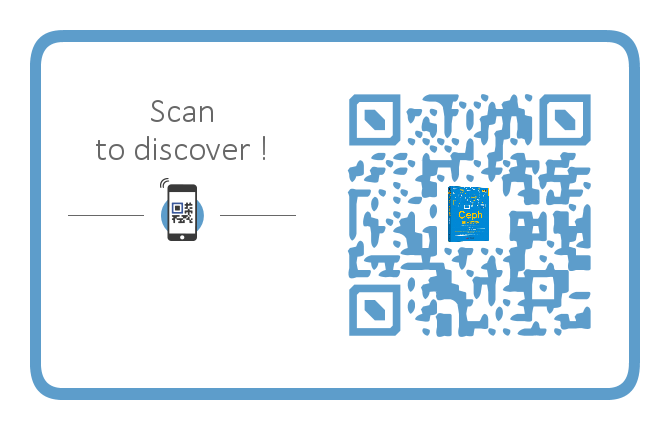

  
  

## 前言

本篇不是一篇技术文，而是推荐的一本书，对于写书来说，在多年以前觉得是一件可望而不可及的事情，而看到几本经典书籍的作者在讲述自己写书的过程的时候，都是自己注入了大量的精力的，所以我自己目前也只能是一个个知识点的以博客的方式进行记录

对于买书来说，很多人会觉得很贵，其实一本书几百面，只要里面的书有两面是能够帮助到你的，书的价值其实已经回来了，所以对于技术书籍来说，基本不评价书的好坏，而是去看多少能提取的东西，多少未知的东西

ceph的书籍最初的起步也是国外的一个作者写的，社区进行翻译，社区自己也出了一本书，还有zstack的研发常也出了一本《Ceph源码分析》，这些都是很好的书籍，之前也都有推荐，这些书籍都是一线的研发在繁忙之中抽出空余的时间写下来的

本篇推荐的一篇是来自中兴的书籍，中兴也是国内ceph开发里面代码提交量很高的公司

目前没能拿到书籍，所以只能从目录来讲下本书会提供哪些相关的知识了

## 书籍简介

### straw及straw2相关内容

这个是ceph里面的crush算法的内容，straw2算法优化了再平衡的时候的数据迁移量，以及能提供更好的分布，让数据更平均，相关内容里面还讲了数据分布的相关知识，整个能解决的应该是数据平均分布相关的知识，让你的数据更加平衡

### BlueStore 相关内容

BlueStore 是Ceph Luminous版本作为默认存储的新型的底层存储，这个是用来替换掉linux下的底层的文件系统的，而实现的一个新型的文件系统，这个是为了带来一个更好的性能的提升的，目前是测试可用，生产慎用的情况，应该会越来越稳定的

### 纠删码原理与overwrites支持

纠删码是为了解决副本的空间占用的问题，用更少的空间损失来获取更大的安全性，相当于计算换空间，纠删这个在很久以前就接触过一个另外一套文件系统，使用场景个人觉得是冷数据比较合适，而如果性能足够好，计算能力足够强，也能支撑比较大的带宽的

在之前的版本当中，ec的启用必须启动缓冲池，需要副本缓冲池的缓冲池做一层转发，这个转发实际上意味着写放大，并且还会出现缓冲池下刷数据的时候性能急剧下降的问题

在新版本中加入了overwrites支持，这个现在新版的bluestore的已经支持数据直接写到ec存储池了，也就是无需缓冲了

### PG 读写流程与状态迁移详解

PG在恢复过程中会有各种状态，什么情况下会出现什么状态，什么状态进行什么处理，什么情况下不能乱动，这些都是需要好好的了解PG状态再进行操作的，否则把PG状态弄坏了，意味着数据也就无法读取了

### 存储服务质量QoS

ceph里面一直没有qos这个，也就是对读写相关的限流，kernel rbd的场景下是可以用cgroup进行qos相关的控制的，其他场景就没有什么好的方法了,所以在比较新的版本里面引入了dmclock来进行限流的相关的控制，这个以后可以在恢复以及写入当中做更精准的控制了，qos也是商用存储里面必要的功能，所以说ceph在功能完善方面更进了一步，需求推动研发

### 存储RBD

这个讲了rbd相关的一些知识，结构和功能方面的

### 对象存储网关RGW

这个讲了对象存储方面的一些功能特性和相关的操作

### 分布式文件系统 CephFS

这个讲了cephfs相关的一些知识，讲了负载均衡和故障恢复的相关内容，负载均衡是相对于多active mds的场景的，可以对目录进行mds的负载划分，把负载分摊到多个mds上面，这个在新版本已经可以使用了，并且目前已经是生产可用

### 定时scrub

scrub这个不要让默认触发，自己做相关的策略，指定时间一个个PG的去scrub就可以了，书中应该会提及相关的具体做法

### Full的紧急处理

这个是集群出现Full以后的紧急处理，对于full以后的情况，一般不要乱动，因为full以后，其他osd也会是快full的状态，并且还有backfill full的控制，所以需要比较精准的控制，相当于游戏里面的微操了，书中应该会系统的讲解

### 快照在增量备份中的应用

通过快照的方式可以进行增量的备份，从而减少备份的需要获取的数据量，这个之前也有介绍过

### 异常watcher的处理

这个应该是通过黑名单的方式进行watcher的相关的处理，这个建议是先处理能处理的，最后无法处理的异常情况用黑名单处理，这个等书出来以后可以看到更详细的内容

## 作者简介

谢型果  
中兴通讯资深软件工程师，5年存储开发经验，精通本地文件系统ZFS和分布式存储系统Ceph。2014 年开始研究 Ceph，2015 年加入 Ceph 开源社区，目前是 Ceph 开源社区的 Ceph Member。

任焕文  
中兴通讯高级软件工程师，有10余年研发经验，曾就职于浪潮和华为，擅长数据库、网络和存储相关技术。Ceph Member成员，现主要负责Ceph文件系统、NAS存储和分布式一致性方面的研发工作。

严　军  
中兴通讯高级软件工程师，从事存储系统开发工作多年，熟悉DPDK开发框架；2015年加入Ceph开源项目，对分布式存储系统QoS有深入研究，目前是Ceph开源社区的积极贡献者。

罗润兵  
华中科技大学微电子专业研究生，中兴通讯高级软件工程师，精通TCP/IP协议栈和分布式存储系统，2014年开始接触并参与Ceph开源项目，目前是Ceph开源社区的积极贡献者。

韦巧苗  
中兴通讯高级软件工程师，擅长C/C++编程，有5年存储系统研发经验，对Ceph RGW模块有深入研究，同时在Cache技术及性能优化上也有丰富的经验。

骆科学  
中兴通讯高级软件工程师，有5年存储产品相关开发经验，擅长虚拟化及存储相关技术，2016年于Ceph中国社区年终盛典中被评为“2016年度社区十佳贡献者”。

## 总结

从目录上面看书中的内容包含的方面很多，可以看到这些很多都是我之前在生产环境当中使用到了或者接触过的东西，所以可以很系统的把这些知识提取出来，这样可以更了解整个系统

购买地址：

> [http://item.jd.com/12196497.html](http://item.jd.com/12196497.html)

或者扫描二维码购买

  
  

## 变更记录

| Why | Who | When |
| --- | --- | --- |
| 创建 | 武汉-运维-磨渣 | 2017-09-28 |

Source: zphj1987@gmail ([推荐一本书《Ceph设计原理与实现》](http://www.zphj1987.com/2017/09/28/a-new-ceph-book/))
