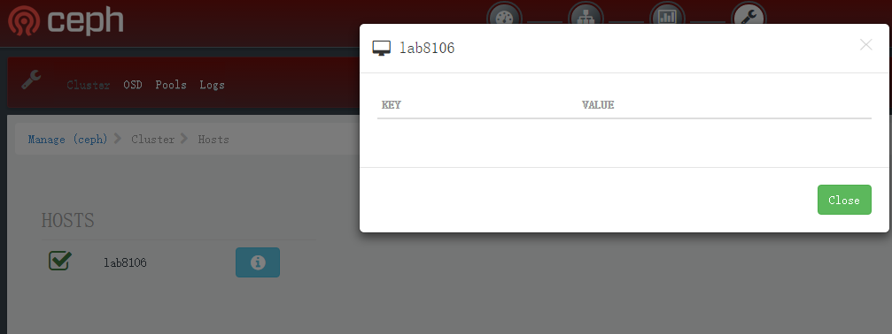
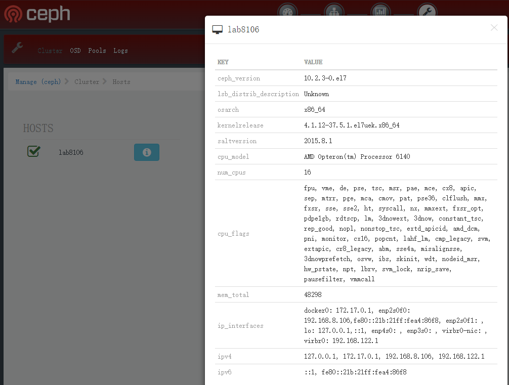

  
  

## 一、前言

一直在做calamari的相关的一些打包和安装的工作，都是业余弄的东西，所以并没有仔细的进行功能点的验证测试，正好ceph社区群里面有人问了个问题

> calamari上是不是能看到ceph的version?

对于这个问题，好像确实没有见到过，而之前正好有个页面看到是空的，当时还不清楚这个是什么用的

而另外一位群友贴出了这个地方的是有值的，这个地方是有BUG的，在咨询了相关的问题描述以后，我们来看下，可以如何解决这个问题  

## 二、问题解决过程

salt的软件版本：

- salt-master-2015.8.1-1.el7.noarch
- salt-2015.8.1-1.el7.noarch
- salt-minion-2015.8.1-1.el7.noarch

### 2.1 问题描述：

calamari的salt-master节点在读取

> /var/cache/salt/master/minions/{minion-hostname}/data.p

的时候有权限问题，在修改权限以后，可以读取到了，但是在重启了salt-minion以后，这个文件会被更新，然后权限又变成无法读取的

### 2.2 相关知识补充

Grains - salt-minion 自身的一些静态信息  

<table><tbody><tr><td class="code"><pre>salt '*' grains.ls       # 查看 grains 分类 salt '*' grains.items    # 查看 grains 所有信息 salt '*' grains.item os  # 查看 grains 某个信息 salt '*' grains.get os </pre></td></tr></tbody></table>

上面的是salt-minion的静态信息的查询的相关的命令，salt-minion在进行重启的时候会将一些静态的信息推送到salt-master上面去，而这个生成的信息正好就是我们上面提出有权限问题的data.p这个存储的文件的，那么解决问题就是修改这个地方的权限的问题了

### 2.3 修改salt-master代码

这个问题通过修改salt-master的master.py代码可以解决

写入这个grains信息的代码在/usr/lib/python2.7/site-packages/salt/master.py这个文件当中，代码段如下：  

<table><tbody><tr><td class="code"><pre>  def _pillar(self, load): ···         if self.opts.get('minion_data_cache', False):             cdir = os.path.join(self.opts['cachedir'], 'minions', load['id'])             if not os.path.isdir(cdir):                 os.makedirs(cdir)             datap = os.path.join(cdir, 'data.p')             tmpfh, tmpfname = tempfile.mkstemp(dir=cdir)             os.close(tmpfh)             with salt.utils.fopen(tmpfname, 'w+b') as fp_:                 fp_.write(                     self.serial.dumps(                         {'grains': load['grains'],                          'pillar': data})                     )             # On Windows, os.rename will fail if the destination file exists.             salt.utils.atomicfile.atomic_rename(tmpfname, datap)         return data </pre></td></tr></tbody></table>

就是这个函数就是负责这个文件写入的，我们只在这个代码里面增加一个文件的权限的控制，在`salt.utils.atomicfile.atomic_rename(tmpfname, datap)`这行之上增加一行代码`os.chmod(tmpfname, 0o644)`

<table><tbody><tr><td class="code"><pre> def _pillar(self, load): ···         if self.opts.get('minion_data_cache', False):             cdir = os.path.join(self.opts['cachedir'], 'minions', load['id'])             if not os.path.isdir(cdir):                 os.makedirs(cdir)             datap = os.path.join(cdir, 'data.p')             tmpfh, tmpfname = tempfile.mkstemp(dir=cdir)             os.close(tmpfh)             with salt.utils.fopen(tmpfname, 'w+b') as fp_:                 fp_.write(                     self.serial.dumps(                         {'grains': load['grains'],                          'pillar': data})                     )             # On Windows, os.rename will fail if the destination file exists.             os.chmod(tmpfname, 0o644)             salt.utils.atomicfile.atomic_rename(tmpfname, datap)         return data </pre></td></tr></tbody></table>

修改好了以后，重启下salt-master，然后重启下salt-minion  

<table><tbody><tr><td class="code"><pre>systemctl restart salt-minion </pre></td></tr></tbody></table>

检查权限，已经看到权限变成了644了  

<table><tbody><tr><td class="code"><pre>[root@lab8106 ~]# ll /var/cache/salt/master/minions/lab8106/data.p  -rw-r--r-- 1 root root 5331 Jan  9 15:33 /var/cache/salt/master/minions/lab8106/data.p </pre></td></tr></tbody></table>

现在再看下前台页面效果:

问题解决

## 三、总结

calamari有一些各种各样的小问题，总体上还是一款非常简洁漂亮的管理界面，在没有监控系统的情况下，还是一个不错的选择

## 四、我的公众号-磨磨谈

  
  

Source: zphj1987@gmail ([解决calamari无法获取节点信息的bug](http://www.zphj1987.com/2017/01/09/calamari-node-info/))
