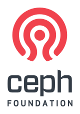

             

Today we are excited to announce the launch of [The Ceph Foundation](https://ceph.com/foundation/), a new organization to bring industry members together to support the Ceph open source community. The new foundation is organized as a directed fund under the [Linux Foundation](https://www.linuxfoundation.org/), which is also home to many other [projects](https://www.linuxfoundation.org/projects/) and cross-project foundations, including Linux and the Cloud Native Computing Foundation (CNCF) that hosts Kubernetes and [Rook](https://rook.io).

## What

The Ceph Foundation replaces the Ceph Advisory Board that was formed [back in 2015](https://www.redhat.com/en/about/press-releases/ceph-community-forms-advisory-board-advance-software-defined-storage-innovation) and is focused on a two key areas:

1. The new foundation raises money via annual membership fees from industry members, providing a combined pool of funds that can be spent in support of the Ceph community.  This is a huge step forward from the earlier a dvisory board, which needed to convince members to contribute to each individual initiative on an ad-hoc basis.  We've raised roughly half a million dollars for our first year and expect to use those funds for Ceph project infrastructure refresh (new hardware for the [Sepia lab](https://wiki.sepia.ceph.com/doku.php)), cloud infrastructure services used as part of the Ceph CI and build/release process, internships with organizations like [Outreachy](https://outreachy.org/), and community events like [Cephalocon](https://ceph.com/cephalocon) and [Ceph Days](https://ceph.com/cephdays).
2. Like the former advisory board, the new foundation provides a forum for community members and industry stakeholders to meet on a regular basis to discuss project status, development and promotional activities, community events, and strategic direction.

In contrast to some other open source foundation launches, today's announcement does not imply any changes to the governance for the Ceph project itself.  Ceph development continues to be led by the [Ceph Leadership Team](http://docs.ceph.com/docs/master/governance/), which consists of leads for each component and several core developers.  That group will appoint a representative to sit on the new foundation's Governing Board, and will help channel any insights from that group back into the development process, but the groups are otherwise independent.  That said, we do anticipate that the Ceph community will continue to refine and codify many of the informal processes as the developer community continues to grow.

## Who

A total of 31 organizations have come together to launch the Ceph Foundation: 13 Premier members, 10 General members, and 8 Associate members (educational or government institutions that are involved in the community and invited to join at no cost).  These organizations span the breadth of the community, and we are delighted to have their support:

- Artificial intelligence: [Didi](https://www.didiglobal.com/), [Pingan Technologies](https://tech.pingan.com/en/), [**ProphetStor Data Services**](https://www.prophetstor.com/)
- Cloud: [Catalyst Cloud](https://catalystcloud.nz/), [**China Mobile**](https://www.chinamobileltd.com/en/global/home.php), [**DigitalOcean**](https://www.digitalocean.com/), [EasyStack](https://easystack.io/en/), [**OVH**](https://www.ovh.com/world/)
- Government: [GRNET](https://grnet.gr/), [Sinorail](http://www.sinorail.com/)
- Hardware: [ARM](https://www.arm.com/), [**Intel**](https://intel.com), [QCT](https://www.qct.io/), [**Western Digital**](https://www.wdc.com/)
- Scientific community: [CERN](https://home.cern/), [South African Radio Astronomy Observatory (SARAO - SK SA)](https://www.ska.ac.za/about/sarao/), [Science and Technology Facilities Council (STFC)](https://stfc.ukri.org/)
- Storage: [Ambedded](http://www.ambedded.com/), [**Amihan Global**](https://amihan.net/), [**Canonical**](https://www.canonical.com/), [croit](https://croit.io/), [Intelligent Systems Services (ISS)](http://iss-integration.com), [**Red Hat**](https://redhat.com/), [**SoftIron**](https://softiron.com/), [**SUSE**](https://www.suse.com/), [**XSKY**](https://www.xsky.com/en/)
- Telecommunications: [**ZTE**](https://www.zte.com.cn/global/)
- Universities: [Boston University](https://www.bu.edu/), [Center for Research in Open Source Systems (CROSS)](https://cross.ucsc.edu/),  [FAS Research Computing - Harvard](https://www.rc.fas.harvard.edu/), [Monash University](https://www.monash.edu/)

## What next?

There are a number of initiatives we expect to look at once the foundation gets off the ground.  These are likely to include

- expansion of and improvements to the hardware lab we use to develop and test Ceph
- a program around accepting and recognizing donations of cloud services to help support the build and CI infrastructure
- an events team to help plan the Ceph Day and Cephalocon event programs, as well as more targeted regional or local events (like hackathons or developer meetups)
- investment in strategic integrations with other projects and ecosystems, to ensure that Ceph remains the de facto standard for open source scale-out storage
- programs around inter-operability between Ceph-based products and services
- internships, training materials, and other strategies for bringing developers and users into the Ceph community

Of course, what we end up doing will depend on the new foundation members and their priorities, so stay tuned!  The launch of the Ceph Foundation is a testament to the strength of a diverse open source community coming together to address the explosive growth in data storage and services, and we welcome the new members' participation in helping shape our continuing investment and innovation in this ecosystem.
