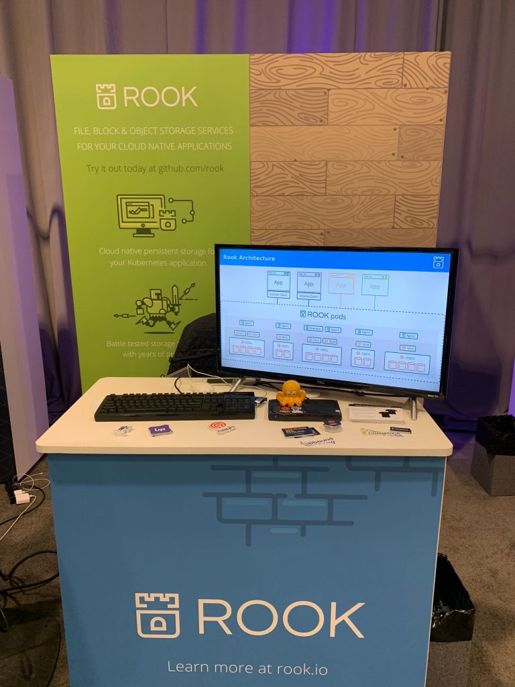
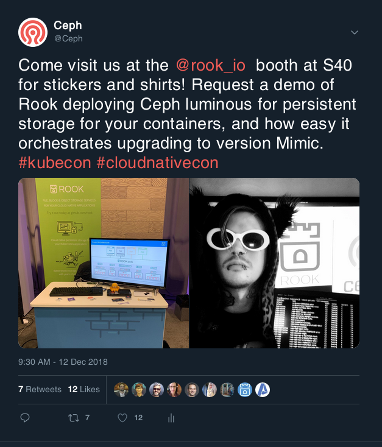
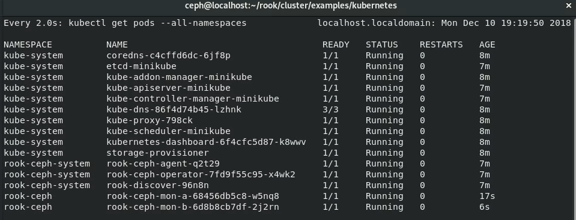
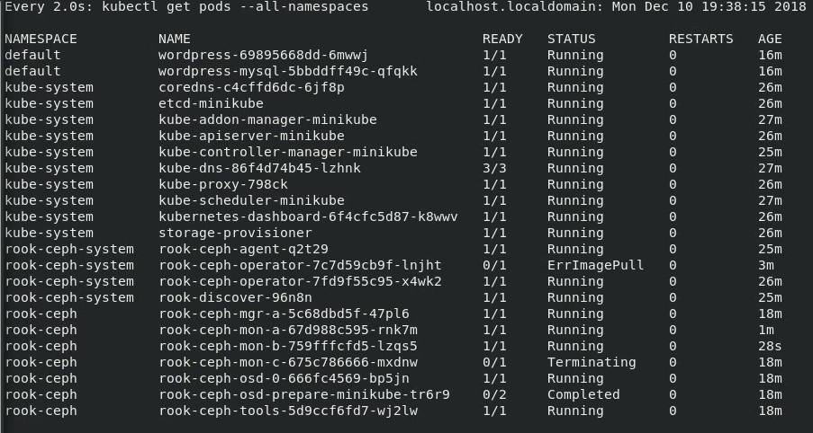

Ceph's had some great presence at KubeCon Seattle 2018 within the Rook booth. Rook is an open source incubated CNCF project. It includes storage orchestration for deploying, upgrading and disaster recovery. Ceph is the reference implementation for Rook, but other storage implementations such as NFS, Nexenta, Cassandra and more are supported. Anyone can contribute a storage implementation for users to have Rook containerize the various components in their Kubernetes deployment.

 

An Intel NUC supported the demo at the booth, running three monitors and one OSD Ceph cluster running Luminous.

Assuming a Kubernetes cluster is present (we just did minikube), cloning the [Rook git repository](https://github.com/rook/rook) and checking out the latest v0.9 tag release gives us two commands to have a Rook operator and Ceph cluster running in under five minutes. Wow!

kubectl create -f ceph/operator.yaml

kubectl create -f ceph/cluster.yaml

Editing a single line of the "image" in the cluster's custom resource definition [file](https://github.com/rook/rook/blob/master/cluster/examples/kubernetes/ceph/cluster.yaml#L164) will start the Rook operator to orchestrate a rolling upgrade of the Ceph cluster from Luminous to Mimic:

 

The audience seemed to have more developers than operators from my small sampling of discussions. This distinction is essential at beginning conversations around Rook as developers ideally will never know about Rook if their objectives are only to consume storage for their application.

We had some very excited users of Rook and Ceph come up to the booth to express their experiences and ideas to support certain use cases. Watch the Ceph [twitter](https://twitter.com/ceph) and blog for some new stories of users using Rook and Ceph together in production! You can also read Rubab Syed's [evaluation of Rook and Ceph](https://ceph.com/community/evaluating-ceph-deployments-with-rook/) during her work at CERN labs.

Ceph will have presence at future KubeCon's such as [Barcelona 2019](https://events.linuxfoundation.org/events/kubecon-cloudnativecon-europe-2019/), in which the Ceph Foundation plans to have a collocated [Cephalocon](https://ceph.com/cephalocon/barcelona-2019/) with more than 800 passionate engineers.
