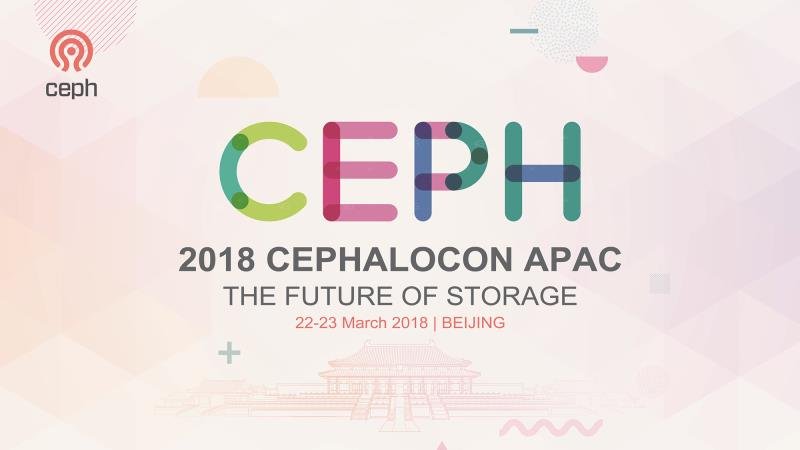
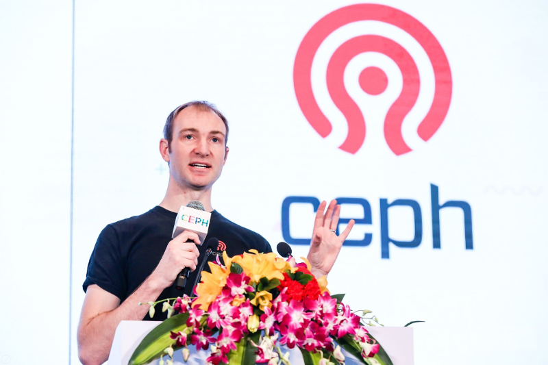
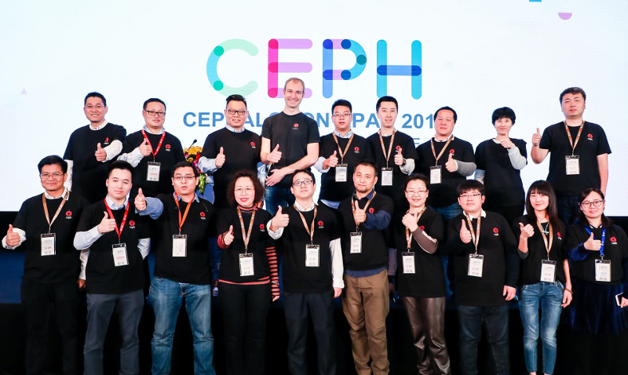
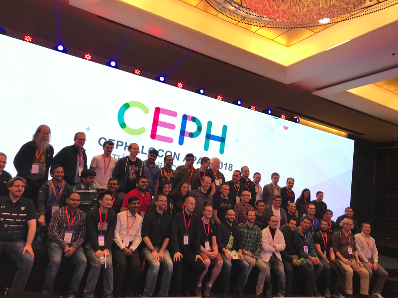

On March 22-23, 2018 the first Cephalocon in the world was successfully held in Beijing, China. During the two conference days over 1000 people including developers, users, companies, community members and other Ceph enthusiasts attended to the 52 keynotes and talks about Enterprise applications, Development, Operation and Maintenance practices.

Cephalocon was possible because the support of industry global players including [Intel](https://www.intel.com/), [Red Hat](https://www.redhat.com/), [SUSE](https://www.suse.com/), [XSKY](https://www.xsky.com/en/), [ZTE](https://www.zte.com.cn/), [UMCloud](http://www.umcloud.com/), [Mellanox](https://www.mellanox.com/), [Canonical](https://www.canonical.com/), [ARM](https://www.arm.com/) and [Quantum Innovation](http://www.quantum.com/) which sponsored the conference, and also the efforts from the outstanding team of volunteers from China: Maggie Liang, Ray Sun, Geng Hang, Shane Wang, Xu Chen, Wenbin Zhao, Hellen Hao, Danni, Luo Kexue, Gao Hua, Awu, Xiao Dongpan, Li Xiang, Banshimin, Ada Wu, David Z, Victor Chen, Joseph Wang, Nina Zhang, Keren Li, Han Juan, Juan Shen, Xingyu Gu, Ava Li, Peifeng Lin and Andrea Li.

### Pre-Conference

Since several contributors from all over the world traveled to China to participate Cephalocon we took the opportunity to [organize meetings](https://pad.ceph.com/p/beijing-meetings) to discuss the projects like RADOS, RBD, RGW, Dashboard as well important topics such as Containers, Usability, Performance and QA.

### First Day

More than 600 people were present at the Cephalocon opening session to attend to [Sage Weil's keynote speech](https://youtu.be/szE4Hg1eXoA). After thanking the sponsors and the volunteers for their efforts, Sage talked about the success of Ceph over the years and mentioned the current efforts to make Ceph more user robust, scalable and user friendly.

Sage opening the Cephalocon APAC 2018

 Sage and the volunteers

 Cephalocon official picture

Next we had keynote sessions presented by [Haomai Wang](https://youtu.be/kf1YVonQMd4) (XSKY), [Kun Zhu](https://youtu.be/Oebm0uWtLC4) (ZTE), [Tushar Gohad](https://youtu.be/hN4lYFHr3rw) (Intel), [Lars Marowsky-Brée](https://youtu.be/o1b-l5BAV3U) (SUSE) and [Jiaju Zhang](https://youtu.be/w-JjLPOUVn0) (Red Hat) which brought several stories and success cases of Ceph and Cloud on Enterprise environments.

After the lunch interval we moved to four different tracks covering topics like Development, Use Cases and Operations. We had updates about the Ceph core projects: [Patrick Donnelly talked about CephFS](https://youtu.be/eIDpdtqhY3g), [Orit Wasserman and Matt Benjamin about RadosGW](https://youtu.be/QDgWL1RyLmM), [Jason Dilleman about RBD](https://youtu.be/ZCW4pJzCkQU) and [Greg Farnum, Josh Durgin and Kefu Chai talked about RADOS](https://youtu.be/8qibqWI18cU).

### Second Day

The second day was opened with [Dan van der Ster's keynote](https://youtu.be/iPY4FGs29y0) about Ceph at CERN and it was followed by presentations by [Rongze Zhu](https://youtu.be/wX36fGB6f70) (UMCloud),  [Wang Gang](https://youtu.be/kHg4bj1BqzM) (Yuancore) and [Qingchun Song](https://youtu.be/L4Li-02Nwg0) (Mellanox). The morning ended with the panel [Ceph in China](https://youtu.be/pSjrE-ABXBM) hosted by Song Jiayu (Dostor Chief Editor) where Ray Sun (Ceph China Community), Gao Mingxing (China Railway), Liu Junwei (China Mobile), Bao Yongcheng (Jingdong) and Zhang Jiaju (Red Hat) talked about the Ceph adoption in China and the community efforts to promote the technology.

During the afternoon we had talks at the four tracks and the highlights were the presentations about the [Ceph Dashboard by Lenz Grimmer](https://youtu.be/z5vu-3FEWVo), [Rook project by Bassam Tabbara](https://youtu.be/UTmUFzDThko), BlueStore by [Li Xioayan](https://youtu.be/jKdNFaZHrf0) and [Junxin Zhang](https://youtu.be/6hKt-WWMjSk) and the academy research papers by [Carlos Maltzahn](https://youtu.be/Xpzh3ab_3nA) and [Noah Watkins](https://youtu.be/uFP-vSE8jXc) from UC Santa Cruz.

 Group picture with Cephalocon speakers and contributors

### Cephalocon Results

According the report from the conference organization Cephalocon had 1024 attendees:

- 41% Infrastructure (DevOps, SysAdmins, etc)
- 25% Engineering (Developers, Architects, Engineers)
- 20% C-Level (CTO, CEO)
- 14% Other (Students, Media, etc)

All the keynotes and talks have been streamed and 20512 people watched the sessions [online](http://www.itdks.com/eventlist/detail/1971). We uploaded all the conference videos to Ceph YouTube Channel under the [Cephalocon APAC 2018 playlist](https://www.youtube.com/playlist?list=PLrBUGiINAakNgeLvjald7NcWps_yDCblr), as well published the slides we received on [Ceph Community Slideshare](https://www.slideshare.net/Inktank_Ceph/tag/cephalocon-apac-2018).

### Benefits for the project

Besides promoting the project, Cephalocon brought several benefits to Ceph community.

Cephalocon helped us to understand better the Chinese community and it will allow the project to develop a better relationship with the contributors and improve the collaboration.

The discussions and brainstorm held during the conference provided new ideas and feedback from Ceph user community including CERN, IHEP and Deutsche Telekom which will help us to make the technology even better!

### The next Cephalocon

At the end of Cephalocon we started discussing ideas for the next edition, and we will start to plan it soon.
