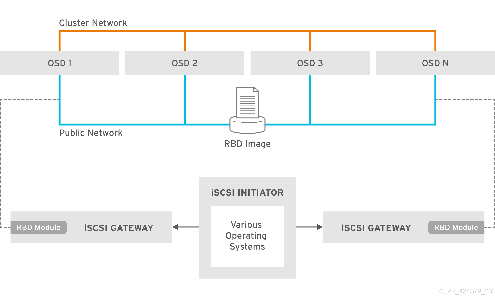
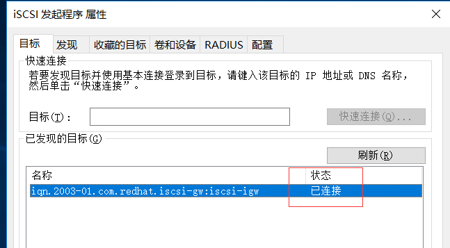

  
  
  
  

## 前言

最开始接触这个是在L版本的监控平台里面看到的，有个iscsi网关，但是没看到有类似的介绍，然后通过接口查询到了一些资料，当时由于有比较多的东西需要新内核，新版本的支持，所以并没有配置出来，由于内核已经更新迭代了几个小版本了，经过测试验证可以跑起来了，这里只是把东西跑起来，性能相关的对比需要根据去做

## 实践过程

### 架构图

这个图是引用的红帽的架构图，可以理解为一个多路径的实现方式，那么这个跟之前的有什么不同

主要是有个新的tcmu-runner来处理LIO TCM后端存储的用户空间端的守护进程，这个是在内核之上多了一个用户态的驱动层，这样只需要根据tcmu的标准来对接接口就可以了，而不用去直接跟内核进行交互

### 需要的软件

Ceph Luminous 版本的集群或者更新的版本  
RHEL/CentOS 7.5或者Linux kernel v4.16或者更新版本的内核  
其他控制软件

> targetcli-2.1.fb47 or newer package  
> ython-rtslib-2.1.fb64 or newer package  
> cmu-runner-1.3.0 or newer package  
> eph-iscsi-config-2.4 or newer package  
> eph-iscsi-cli-2.5 or newer package

以上为配置这个环境需要的软件，下面为我使用的版本的软件，统一打包放在一个下载路径  
我安装的版本如下：

> kernel-4.16.0-0.rc5.git0.1  
> targetcli-fb-2.1.fb48  
> python-rtslib-2.1.67  
> tcmu-runner-1.3.0-rc4  
> ceph-iscsi-config-2.5  
> ceph-iscsi-cli-2.6

下载链接：

> 链接:[https://pan.baidu.com/s/12OwR5ZNtWFW13feLXy3Ezg](https://pan.baidu.com/s/12OwR5ZNtWFW13feLXy3Ezg) 密码:m09k

如果环境之前有安装过其他版本，需要先卸载掉，并且需要提前部署好一个Luminous 最新版本的集群  
官方建议调整的参数  

<table><tbody><tr><td class="code"><pre># ceph tell osd.* injectargs '--osd_client_watch_timeout 15' # ceph tell osd.* injectargs '--osd_heartbeat_grace 20' # ceph tell osd.* injectargs '--osd_heartbeat_interval 5' </pre></td></tr></tbody></table>

### 配置过程

创建一个存储池  
需要用到rbd存储池，用来存储iscsi的配置文件，提前创建好一个名字是rbd的存储池

创建iscsi-gateway配置文件  

<table><tbody><tr><td class="code"><pre>touch /etc/ceph/iscsi-gateway.cfg </pre></td></tr></tbody></table>

修改iscsi-gateway.cfg配置文件  

<table><tbody><tr><td class="code"><pre>[config] # Name of the Ceph storage cluster. A suitable Ceph configuration file allowing # access to the Ceph storage cluster from the gateway node is required, if not # colocated on an OSD node. cluster_name = ceph  # Place a copy of the ceph cluster's admin keyring in the gateway's /etc/ceph # drectory and reference the filename here gateway_keyring = ceph.client.admin.keyring   # API settings. # The API supports a number of options that allow you to tailor it to your # local environment. If you want to run the API under https, you will need to # create cert/key files that are compatible for each iSCSI gateway node, that is # not locked to a specific node. SSL cert and key files *must* be called # 'iscsi-gateway.crt' and 'iscsi-gateway.key' and placed in the '/etc/ceph/' directory # on *each* gateway node. With the SSL files in place, you can use 'api_secure = true' # to switch to https mode.  # To support the API, the bear minimum settings are: api_secure = false  # Additional API configuration options are as follows, defaults shown. # api_user = admin # api_password = admin # api_port = 5001 # trusted_ip_list = 192.168.0.10,192.168.0.11 </pre></td></tr></tbody></table>

最后一行的trusted\_ip\_list修改为用来配置网关的主机IP，我的环境为

> trusted\_ip\_list =192.168.219.128,192.168.219.129

所有网关节点的这个配置文件的内容需要一致，修改好一台直接scp到每个网关节点上

启动API服务  

<table><tbody><tr><td class="code"><pre>[root@lab101 install]# systemctl daemon-reload [root@lab101 install]# systemctl enable rbd-target-api [root@lab101 install]# systemctl start rbd-target-api [root@lab101 install]# systemctl status rbd-target-api ● rbd-target-api.service - Ceph iscsi target configuration API    Loaded: loaded (/usr/lib/systemd/system/rbd-target-api.service; enabled; vendor preset: disabled)    Active: active (running) since Thu 2018-03-15 09:44:34 CST; 18min ago  Main PID: 1493 (rbd-target-api)    CGroup: /system.slice/rbd-target-api.service            └─1493 /usr/bin/python /usr/bin/rbd-target-api  Mar 15 09:44:34 lab101 systemd[1]: Started Ceph iscsi target configuration API. Mar 15 09:44:34 lab101 systemd[1]: Starting Ceph iscsi target configuration API... Mar 15 09:44:58 lab101 rbd-target-api[1493]: Started the configuration object watcher Mar 15 09:44:58 lab101 rbd-target-api[1493]: Checking for config object changes every 1s Mar 15 09:44:58 lab101 rbd-target-api[1493]:  * Running on http://0.0.0.0:5000/ </pre></td></tr></tbody></table>

配置iscsi  
执行gwcli命令  

默认是这样的

进入icsi-target创建一个target  

<table><tbody><tr><td class="code"><pre>/&gt; cd iscsi-target  /iscsi-target&gt; create iqn.2003-01.com.redhat.iscsi-gw:iscsi-igw ok </pre></td></tr></tbody></table>

创建iSCSI网关。以下使用的IP是用于iSCSI数据传输的IP,它们可以与trusted\_ip\_list中列出的用于管理操作的IP相同，也可以不同，看有没有做多网卡分离  

<table><tbody><tr><td class="code"><pre>/iscsi-target&gt; cd iqn.2003-01.com.redhat.iscsi-gw:iscsi-igw/ /iscsi-target...-gw:iscsi-igw&gt; cd gateways  /iscsi-target...-igw/gateways&gt; create lab101 192.168.219.128 skipchecks=true OS version/package checks have been bypassed Adding gateway, syncing 0 disk(s) and 0 client(s)   /iscsi-target...-igw/gateways&gt; create lab102 192.168.219.129 skipchecks=true OS version/package checks have been bypassed Adding gateway, sync'ing 0 disk(s) and 0 client(s) ok /iscsi-target...-igw/gateways&gt; ls o- gateways ............. [Up: 2/2, Portals: 2]   o- lab101 ............. [192.168.219.128 (UP)]   o- lab102 ............. [192.168.219.129 (UP)] </pre></td></tr></tbody></table>

创建一个rbd设备disk\_1  

<table><tbody><tr><td class="code"><pre>/iscsi-target...-igw/gateways&gt; cd /disks  /disks&gt; create pool=rbd image=disk_1 size=100G ok </pre></td></tr></tbody></table>

创建一个客户端名称iqn.1994-05.com.redhat:75c3d5efde0  

<table><tbody><tr><td class="code"><pre>/disks&gt; cd /iscsi-target/iqn.2003-01.com.redhat.iscsi-gw:iscsi-igw/hosts  /iscsi-target...csi-igw/hosts&gt; create iqn.1994-05.com.redhat:75c3d5efde0 ok </pre></td></tr></tbody></table>

创建chap的用户名密码，由于用户名密码都有特殊要求，如果你不确定，就按我给的去设置，并且chap必须设置，否则服务端是禁止连接的  

<table><tbody><tr><td class="code"><pre>/iscsi-target...t:75c3d5efde0&gt; auth chap=iqn.1994-05.com.redhat:75c3d5efde0/admin@a_12a-bb ok </pre></td></tr></tbody></table>

chap的命名规则可以这样查询  

<table><tbody><tr><td class="code"><pre>/iscsi-target...t:75c3d5efde0&gt; help auth  SYNTAX ====== auth [chap]    DESCRIPTION ===========  Client authentication can be set to use CHAP by supplying the a string of the form &lt;username&gt;/&lt;password&gt;  e.g. auth chap=username/password | nochap  username ... the username is 8-64 character string. Each character              may either be an alphanumeric or use one of the following              special characters .,:,-,@.              Consider using the hosts 'shortname' or the initiators IQN              value as the username  password ... the password must be between 12-16 chars in length              containing alphanumeric characters, plus the following              special characters @,_,-  WARNING: Using unsupported special characters may result in truncation,          resulting in failed logins.   Specifying 'nochap' will remove chap authentication for the client across all gateways. </pre></td></tr></tbody></table>

增加磁盘到客户端  

<table><tbody><tr><td class="code"><pre>/iscsi-target...t:75c3d5efde0&gt; disk add rbd.disk_1 ok </pre></td></tr></tbody></table>

到这里就配置完成了，我们看下最终应该是怎么样的  

## windows客户端配置

这个地方我配置的时候用的win10配置的时候出现了无法连接的情况，可能是windows10自身的认证要求跟服务端冲突了，这里用windows server 2016 进行连接测试

windows server开启下Multipath IO

修改windows iscsi客户端的名称  
  
修改为上面创建的客户端名称

发现门户  
  
点击发现门户，填写好服务端的IP后直接点确定，这里先不用高级里面的配置

这个时候目标里面已经有一个发现的目标了，显示状态是不活动的，准备点击连接

  
点击高级，选择门户IP，填写chap登陆信息，然后chap名称就是上面设置的用户名称，因为跟客户端名称设置的一致，也就是客户端的名称，密码就是上面设置的admin@a\_12a-bb

切换到卷和设备，点击自动配置  

可以看到已经装载设备了

在服务管理器，文件存储服务，卷，磁盘里面查看设备  

可以看到是配置的LIO-ORG TCMU设备，对设备进行格式化即可

完成了连接了

## Linux的客户端连接

Linux客户端选择建议就选择3.10默认内核，选择高版本的内核的时候在配置多路径的时候碰到内核崩溃的问题

安装连接软件  

<table><tbody><tr><td class="code"><pre>[root@lab103 ~]# yum install iscsi-initiator-utils [root@lab103 ~]# yum install device-mapper-multipath </pre></td></tr></tbody></table>

配置多路径

开启服务  

<table><tbody><tr><td class="code"><pre>[root@lab103 ~]# mpathconf --enable --with_multipathd y </pre></td></tr></tbody></table>

修改配置文件/etc/multipath.conf  

<table><tbody><tr><td class="code"><pre>devices {         device {                 vendor                 "LIO-ORG"                 hardware_handler       "1 alua"                 path_grouping_policy   "failover"                 path_selector          "queue-length 0"                 failback               60                 path_checker           tur                 prio                   alua                 prio_args              exclusive_pref_bit                 fast_io_fail_tmo       25                 no_path_retry          queue         } } </pre></td></tr></tbody></table>

重启多路径服务  

<table><tbody><tr><td class="code"><pre>[root@lab103 ~]# systemctl reload multipathd </pre></td></tr></tbody></table>

配置chap的认证

修改配置客户端的名称为上面设置的名称  

<table><tbody><tr><td class="code"><pre>[root@lab103 ~]# cat /etc/iscsi/initiatorname.iscsi  InitiatorName=iqn.1994-05.com.redhat:75c3d5efde0 </pre></td></tr></tbody></table>

修改认证的配置文件  

<table><tbody><tr><td class="code"><pre>[root@lab103 ~]# cat /etc/iscsi/iscsid.conf |grep "node.session.auth.username|node.session.auth.password|node.session.auth.authmethod" node.session.auth.authmethod = CHAP node.session.auth.username = iqn.1994-05.com.redhat:75c3d5efde0 node.session.auth.password = admin@a_12a-bb </pre></td></tr></tbody></table>

查询iscsi target  

<table><tbody><tr><td class="code"><pre>[root@lab103 ~]# iscsiadm -m discovery -t st -p 192.168.219.128 192.168.219.128:3260,1 iqn.2003-01.com.redhat.iscsi-gw:iscsi-igw 192.168.219.129:3260,2 iqn.2003-01.com.redhat.iscsi-gw:iscsi-igw </pre></td></tr></tbody></table>

连接target  

<table><tbody><tr><td class="code"><pre>[root@lab103 ~]# iscsiadm -m node -T iqn.2003-01.com.redhat.iscsi-gw:iscsi-igw -l Logging in to [iface: default, target: iqn.2003-01.com.redhat.iscsi-gw:iscsi-igw, portal: 192.168.219.129,3260] (multiple) Logging in to [iface: default, target: iqn.2003-01.com.redhat.iscsi-gw:iscsi-igw, portal: 192.168.219.129,3260] (multiple) Login to [iface: default, target: iqn.2003-01.com.redhat.iscsi-gw:iscsi-igw, portal: 192.168.219.129,3260] successful. Login to [iface: default, target: iqn.2003-01.com.redhat.iscsi-gw:iscsi-igw, portal: 192.168.219.129,3260] successful. </pre></td></tr></tbody></table>

<table><tbody><tr><td class="code"><pre>[root@lab101 ~]# multipath -ll mpathb (360014052fc39ba627874fdba9aefcf6c) dm-4 LIO-ORG ,TCMU device      size=100G features='1 queue_if_no_path' hwhandler='1 alua' wp=rw |-+- policy='queue-length 0' prio=10 status=active | `- 5:0:0:0 sdc 8:32 active ready running `-+- policy='queue-length 0' prio=10 status=enabled   `- 6:0:0:0 sdd 8:48 active ready running </pre></td></tr></tbody></table>

查看盘符  

<table><tbody><tr><td class="code"><pre>[root@lab101 ~]# parted -s /dev/mapper/mpathb print Model: Linux device-mapper (multipath) (dm) Disk /dev/mapper/mpathb: 107GB Sector size (logical/physical): 512B/512B Partition Table: gpt Disk Flags:   Number  Start   End    Size   File system  Name                          Flags  1      17.4kB  134MB  134MB               Microsoft reserved partition  msftres  2      135MB   107GB  107GB  ntfs         Basic data partition </pre></td></tr></tbody></table>

直接使用这个/dev/mapper/mpathb设备即可

## 变更记录

| Why | Who | When |
| --- | --- | --- |
| 创建 | 武汉-运维-磨渣 | 2018-04-11 |

Source: zphj1987@gmail ([ceph的ISCSI GATEWAY](http://www.zphj1987.com/2018/04/11/ceph-ISCSI-GATEWAY/))
