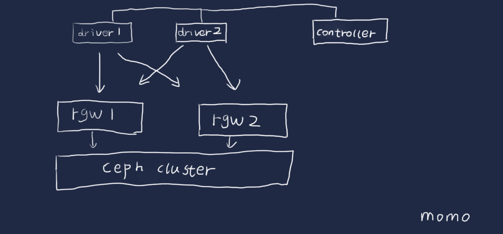

  
  

## 前言

cosbench的功能很强大，但是配置起来可能就有点不是太清楚怎么配置了，本篇将梳理一下这个测试的配置过程，以及一些测试注意项目，以免无法完成自己配置模型的情况

## 安装

cosbench模式是一个控制端控制几个driver向后端rgw发起请求

下载最新版本

> [https://github.com/intel-cloud/cosbench/releases/download/v0.4.2.c4/0.4.2.c4.zip](https://github.com/intel-cloud/cosbench/releases/download/v0.4.2.c4/0.4.2.c4.zip)

<table><tbody><tr><td class="code"><pre>[root@lab102 cosbench]# unzip 0.4.2.zip [root@lab102 cosbench]# yum install java-1.7.0-openjdk nmap-ncat </pre></td></tr></tbody></table>

同时可以执行的workloads的个数通过下面的control参数控制

> concurrency=1

默认是一个，这个为了保证单机的硬件资源足够，保持单机启用一个workload

创建一个s3用户  

<table><tbody><tr><td class="code"><pre>[root@lab101 ~]# radosgw-admin user create --uid=test1 --display-name="test1" --access-key=test1  --secret-key=test1 {     "user_id": "test1",     "display_name": "test1",     "email": "",     "suspended": 0,     "max_buckets": 1000,     "auid": 0,     "subusers": [],     "keys": [         {             "user": "test1",             "access_key": "test1",             "secret_key": "test1"         }     ],     "swift_keys": [],     "caps": [],     "op_mask": "read, write, delete",     "default_placement": "",     "placement_tags": [],     "bucket_quota": {         "enabled": false,         "max_size_kb": -1,         "max_objects": -1     },     "user_quota": {         "enabled": false,         "max_size_kb": -1,         "max_objects": -1     },     "temp_url_keys": [] } </pre></td></tr></tbody></table>

## 配置相关

cosbench的配置文件结构  

- 一个workload 可以定义一个或者多个work stages
- 执行多个work stages是顺序的，执行同一个work stage里面的work是可以并行执行的
- 每个work里面，worker是来调整负载的
- 认证可以多个级别的定义，低级别的认证会覆盖高级别的配置

可以通过配置多个work的方式来实现并发，而在work内通过增加worker的方式增加并发，从而实现多对多的访问，worker的分摊是分到了driver上面，注意多work的时候的containers不要重名，划分好bucker的空间

work相关的说明

- 可以通过写入时间，写入容量，写入iops来控制什么时候结束
- interval默认是5s是用来对性能快照的间隔，可以理解为采样点
- division 控制workers之间的分配工作的方式是bucket还是对象还是none
- 默认全部的driver参与工作，也可以通过参数控制部分driver参与
- 时间会控制执行，如果时间没到，但是指定的对象已经写完了的话就会去进行复写的操作，这里要注意是进行对象的控制还是时间的控制进行的测试

如果读取测试的时候，如果没有那个对象，会中断的提示，所以测试读之前需要把测试的对象都填充完毕（最好检查下先）

## 单项的配置文件

### 通过单网关创建bucket

<table><tbody><tr><td class="code"><pre>&lt;?xml version="1.0" encoding="UTF-8"?&gt; &lt;workload name="create-bucket" description="create s3 bucket" config=""&gt;     &lt;auth type="none" config=""/&gt;     &lt;workflow config=""&gt;         &lt;workstage name="create bucket" closuredelay="0" config=""&gt;             &lt;auth type="none" config=""/&gt;             &lt;work name="rgw1" type="init" workers="2" interval="5"                 division="container" runtime="0" rampup="0" rampdown="0"                 afr="0" totalOps="1" totalBytes="0" config="containers=r(1,32)"&gt;                 &lt;auth type="none" config=""/&gt;                 &lt;storage type="s3" config="accesskey=test1;secretkey=test1;endpoint=http://192.168.19.101:7481;path_style_access=true"/&gt;                 &lt;operation type="init" ratio="100" division="container"                     config="containers=r(1,32);containers=r(1,32);objects=r(0,0);sizes=c(0)B;containers=r(1,32)" id="none"/&gt;             &lt;/work&gt;         &lt;/workstage&gt;     &lt;/workflow&gt; &lt;/workload&gt; </pre></td></tr></tbody></table>

如上配置的时候，如果设置的是workers=1,那么就会从当前的driver中挑选一个driver出来，然后选择配置storage进行bucket的创建，如果设置的是workers=2，那么就会挑选两个driver出来进行创建，一个driver负责一半的工作，相当于两个客户端同时向一个网关发起创建的操作

rgw的网关是对等的关系，那么这里肯定就有另外一种配置，我想通过不只一个网关进行创建的操作，那么这个地方是通过增加work的配置来实现的，我们看下配置

### 通过多网关创建bucket

<table><tbody><tr><td class="code"><pre>&lt;?xml version="1.0" encoding="UTF-8"?&gt; &lt;workload name="create-bucket" description="create s3 bucket" config=""&gt;     &lt;auth type="none" config=""/&gt;     &lt;workflow config=""&gt;         &lt;workstage name="create bucket" closuredelay="0" config=""&gt;             &lt;auth type="none" config=""/&gt;             &lt;work name="rgw1" type="init" workers="2" interval="5"                 division="container" runtime="0" rampup="0" rampdown="0"                 afr="0" totalOps="1" totalBytes="0" config="containers=r(1,16)"&gt;                 &lt;auth type="none" config=""/&gt;                 &lt;storage type="s3" config="accesskey=test1;secretkey=test1;endpoint=http://192.168.19.101:7481;path_style_access=true"/&gt;                 &lt;operation type="init" ratio="100" division="container"                     config="containers=r(1,16);containers=r(1,16);objects=r(0,0);sizes=c(0)B;containers=r(1,16)" id="none"/&gt;             &lt;/work&gt;             &lt;work name="rgw2" type="init" workers="2" interval="5"                 division="container" runtime="0" rampup="0" rampdown="0"                 afr="0" totalOps="1" totalBytes="0" config="containers=r(17,32)"&gt;                 &lt;auth type="none" config=""/&gt;                 &lt;storage type="s3" config="accesskey=test1;secretkey=test1;endpoint=http://192.168.19.101:7482;path_style_access=true"/&gt;                 &lt;operation type="init" ratio="100" division="container"                     config="containers=r(17,32);containers=r(17,32);objects=r(0,0);sizes=c(0)B;containers=r(17,32)" id="none"/&gt;             &lt;/work&gt;         &lt;/workstage&gt;     &lt;/workflow&gt; &lt;/workload&gt; </pre></td></tr></tbody></table>

以上配置就实现了通过两个网关进行创建bucket的配置了，下面是做prepare的相关配置，在cosbench里面有两个部分可以进行写操作，在prepare stage里面和 main stage里面  
这个地方这样设置的理由是：  
如果有读和写混合测试的时候，那么就需要提前进行读数据的准备，然后再开始进行读写并发的测试，所以会有一个prepare的阶段，这个在配置文件里面只是type设置的不同，其他没区别，我们可以看下这里web界面里面提供的配置项目，下面其他项目默认都是采取双并发的模式

在写的部分是一样的

### 通过多网关写数据

<table><tbody><tr><td class="code"><pre>&lt;workstage name="putobject" closuredelay="0" config=""&gt;     &lt;auth type="none" config=""/&gt;     &lt;work name="rgw1-put" type="normal" workers="2" interval="5"         division="container" runtime="60" rampup="0" rampdown="0"         afr="200000" totalOps="0" totalBytes="0" config=""&gt;         &lt;auth type="none" config=""/&gt;         &lt;storage type="s3" config="accesskey=test1;secretkey=test1;endpoint=http://192.168.19.101:7481;path_style_access=true"/&gt;         &lt;operation type="write" ratio="100" division="container"             config="containers=u(1,16);objects=u(1,5);sizes=u(2,2)MB" id="none"/&gt;     &lt;/work&gt;     &lt;work name="rgw2-put" type="normal" workers="2" interval="5"         division="container" runtime="60" rampup="0" rampdown="0"         afr="200000" totalOps="0" totalBytes="0" config=""&gt;         &lt;auth type="none" config=""/&gt;         &lt;storage type="s3" config="accesskey=test1;secretkey=test1;endpoint=http://192.168.19.101:7482;path_style_access=true"/&gt;         &lt;operation type="write" ratio="100" division="container"             config="containers=u(17,32);objects=u(1,5);sizes=u(2,2)MB" id="none"/&gt;     &lt;/work&gt;			 &lt;/workstage&gt; </pre></td></tr></tbody></table>

这里有几个参数可以注意一下：

> containers=u(1,16);objects=u(1,5);sizes=u(2,2)MB

控制写入的bucket的名称的，是全部散列还是把负载均分可以自己去控制，objects是指定写入bucke里面的对象的名称的，sizes是指定大小的，如果两个值不同，就是设置的范围，相同就是设置的指定大小的  

<table><tbody><tr><td class="code"><pre>runtime="60" rampup="0" rampdown="0" afr="200000" totalOps="0" totalBytes="0" </pre></td></tr></tbody></table>

这个是控制写入什么时候中止的，可以通过时间，也可以通过总的ops，或者总的大小来控制，这个需求可以自己定，afr是控制允许的失效率的，单位为1百万分之  

<table><tbody><tr><td class="code"><pre>interval="5" </pre></td></tr></tbody></table>

这个是控制抓取性能数据的周期的

写入的配置就完了

### 并发读取的配置

<table><tbody><tr><td class="code"><pre>&lt;workstage name="getobj" closuredelay="0" config=""&gt;     &lt;auth type="none" config=""/&gt;     &lt;work name="rgw1-get" type="normal" workers="2" interval="5"         division="none" runtime="30" rampup="0" rampdown="0"         afr="200000" totalOps="0" totalBytes="0" config=""&gt;         &lt;auth type="none" config=""/&gt;         &lt;storage type="s3" config="accesskey=test1;secretkey=test1;endpoint=http://192.168.19.101:7481;path_style_access=true"/&gt;         &lt;operation type="read" ratio="100" division="none"             config="containers=u(1,16);objects=u(1,5);" id="none"/&gt;     &lt;/work&gt;     &lt;work name="rgw2-get" type="normal" workers="2" interval="5"         division="none" runtime="30" rampup="0" rampdown="0"         afr="200000" totalOps="0" totalBytes="0" config=""&gt;         &lt;auth type="none" config=""/&gt;         &lt;storage type="s3" config="accesskey=test1;secretkey=test1;endpoint=http://192.168.19.101:7482;path_style_access=true"/&gt;         &lt;operation type="read" ratio="100" division="none"             config="containers=u(17,32);objects=u(1,5);" id="none"/&gt;     &lt;/work&gt;			 &lt;/workstage&gt; </pre></td></tr></tbody></table>

### 删除对象的配置

<table><tbody><tr><td class="code"><pre>&lt;workstage name="cleanup" closuredelay="0" config=""&gt;           &lt;auth type="none" config=""/&gt;           &lt;storage type="s3" config="accesskey=test1;secretkey=test1;endpoint=http://192.168.19.101:7481;path_style_access=true"/&gt;           &lt;work name="rgw1-cleanup" type="cleanup" workers="1" interval="5"               division="object" runtime="0" rampup="0" rampdown="0"               afr="0" totalOps="1" totalBytes="0" config="containers=r(1,16);objects=r(1,5);"&gt;               &lt;auth type="none" config=""/&gt;               &lt;storage type="s3" config="accesskey=test1;secretkey=test1;endpoint=http://192.168.19.101:7481;path_style_access=true"/&gt;               &lt;operation type="cleanup" ratio="100" division="object"                   config="containers=r(1,16);objects=r(1,5);;deleteContainer=false;" id="none"/&gt;           &lt;/work&gt;           &lt;work name="rgw2-cleanup" type="cleanup" workers="1" interval="5"               division="object" runtime="0" rampup="0" rampdown="0"               afr="0" totalOps="1" totalBytes="0" config="containers=r(17,32);objects=r(1,5);"&gt;               &lt;auth type="none" config=""/&gt;               &lt;storage type="s3" config="accesskey=test1;secretkey=test1;endpoint=http://192.168.19.101:7482;path_style_access=true"/&gt;               &lt;operation type="cleanup" ratio="100" division="object"                   config="containers=r(17,32);objects=r(1,5);;deleteContainer=false;" id="none"/&gt;           &lt;/work&gt;       &lt;/workstage&gt; </pre></td></tr></tbody></table>

### 删除bucket的配置

<table><tbody><tr><td class="code"><pre>&lt;workstage name="dispose" closuredelay="0" config=""&gt;           &lt;auth type="none" config=""/&gt;           &lt;storage type="s3" config="accesskey=test1;secretkey=test1;endpoint=http://192.168.19.101:7481;path_style_access=true"/&gt;           &lt;work name="rgw1-dispose" type="dispose" workers="1" interval="5"               division="container" runtime="0" rampup="0" rampdown="0"               afr="0" totalOps="1" totalBytes="0" config="containers=r(1,16);"&gt;               &lt;auth type="none" config=""/&gt;               &lt;storage type="s3" config="accesskey=test1;secretkey=test1;endpoint=http://192.168.19.101:7481;path_style_access=true"/&gt;               &lt;operation type="dispose" ratio="100"                   division="container"                   config="containers=r(1,16);;objects=r(0,0);sizes=c(0)B;;" id="none"/&gt;           &lt;/work&gt;           &lt;work name="rgw2-dispose" type="dispose" workers="1" interval="5"               division="container" runtime="0" rampup="0" rampdown="0"               afr="0" totalOps="1" totalBytes="0" config="containers=r(17,32);"&gt;               &lt;auth type="none" config=""/&gt;               &lt;storage type="s3" config="accesskey=test1;secretkey=test1;endpoint=http://192.168.19.101:7481;path_style_access=true"/&gt;               &lt;operation type="dispose" ratio="100"                   division="container"                   config="containers=r(17,32);;objects=r(0,0);sizes=c(0)B;;" id="none"/&gt;           &lt;/work&gt;			       &lt;/workstage&gt; </pre></td></tr></tbody></table>

上面的workstage一共包括下面几种

- init 创建bucket
- normal write 写入对象
- normal read 读取对象
- cleanup 清理对象
- dispose 清理bucket

division是控制多个worker之间的操作怎么去分的控制，最好在operation那层进行控制

## 测试前自我提问

- 单机用了几个workload（默认一般一个，保证单个测试资源的独占）
- 采用了几个driver（决定了客户端的发起是有几个客户端，单机一个就可以）
- 测试了哪几个项目（init,prepare or normal,remove），单独测试还是混合测试
- 单个项目的workstage里面启动了几个work（work可以控制请求发向哪里）
- 单个work里面采用了几个workers(这个是控制几个driver进行并发的)
- 测试的ceph集群有多少个rgw网关，创建了多少个bucket测试
- 设置的写入每个bucket的对象为多少？对象大小为多少？测试时间为多久？

测试很多文件的时候，可以用ops控制，并且将ops设置大于想测试的文件数目，保证能写入那么多的数据，或者比较确定性能，也可以通过时间控制

那么我来根据自己的需求来进行一个测试模型说明，然后根据说明进行配置

- 采用两个客户端测试，那么准备两个driver
- 准备配置两个rgw的网关，那么在配置workstage的时候配置两个work对应到两个storage
- 测试创建，写入，读取，删除对象，删除bucket一套完整测试
- wokers设置为2的倍数，初始值为2，让每个driver分得一半的负载，在进行一轮测试后，成倍的增加driver的数目，来增大并发，在性能基本不增加，时延在增加的时候，记录性能值和参数值，这个为本环境的最大性能
- 创建32个bucket，每个bucket写入5个2M的对象，测试写入时间为600s，读取时间为60s

简单框架图  

配置文件如下：  

<table><tbody><tr><td class="code"><pre>&lt;?xml version="1.0" encoding="UTF-8"?&gt; &lt;workload name="create-bucket" description="create s3 bucket" config=""&gt;     &lt;auth type="none" config=""/&gt;     &lt;workflow config=""&gt;         &lt;workstage name="create bucket" closuredelay="0" config=""&gt;             &lt;auth type="none" config=""/&gt;             &lt;work name="rgw1-create" type="init" workers="2" interval="5"                 division="container" runtime="0" rampup="0" rampdown="0"                 afr="0" totalOps="1" totalBytes="0" config="containers=r(1,16)"&gt;                 &lt;auth type="none" config=""/&gt;                 &lt;storage type="s3" config="accesskey=test1;secretkey=test1;endpoint=http://192.168.19.101:7481;path_style_access=true"/&gt;                 &lt;operation type="init" ratio="100" division="container"                     config="containers=r(1,16);objects=r(0,0);sizes=c(0)B" id="none"/&gt;             &lt;/work&gt;             &lt;work name="rgw2-create" type="init" workers="2" interval="5"                 division="container" runtime="0" rampup="0" rampdown="0"                 afr="0" totalOps="1" totalBytes="0" config="containers=r(17,32)"&gt;                 &lt;auth type="none" config=""/&gt;                 &lt;storage type="s3" config="accesskey=test1;secretkey=test1;endpoint=http://192.168.19.101:7482;path_style_access=true"/&gt;                 &lt;operation type="init" ratio="100" division="container"                     config="containers=r(17,32);objects=r(0,0);sizes=c(0)B" id="none"/&gt;             &lt;/work&gt;         &lt;/workstage&gt; 		         &lt;workstage name="putobject" closuredelay="0" config=""&gt;             &lt;auth type="none" config=""/&gt;             &lt;work name="rgw1-put" type="normal" workers="2" interval="5"                 division="container" runtime="600" rampup="0" rampdown="0"                 afr="200000" totalOps="0" totalBytes="0" config=""&gt;                 &lt;auth type="none" config=""/&gt;                 &lt;storage type="s3" config="accesskey=test1;secretkey=test1;endpoint=http://192.168.19.101:7481;path_style_access=true"/&gt;                 &lt;operation type="write" ratio="100" division="container"                     config="containers=u(1,16);objects=u(1,5);sizes=u(2,2)MB" id="none"/&gt;             &lt;/work&gt;             &lt;work name="rgw2-put" type="normal" workers="2" interval="5"                 division="container" runtime="600" rampup="0" rampdown="0"                 afr="200000" totalOps="0" totalBytes="0" config=""&gt;                 &lt;auth type="none" config=""/&gt;                 &lt;storage type="s3" config="accesskey=test1;secretkey=test1;endpoint=http://192.168.19.101:7482;path_style_access=true"/&gt;                 &lt;operation type="write" ratio="100" division="container"                     config="containers=u(17,32);objects=u(1,5);sizes=u(2,2)MB" id="none"/&gt;             &lt;/work&gt;			         &lt;/workstage&gt;          &lt;workstage name="getobj" closuredelay="0" config=""&gt;             &lt;auth type="none" config=""/&gt;             &lt;work name="rgw1-get" type="normal" workers="2" interval="5"                 division="none" runtime="60" rampup="0" rampdown="0"                 afr="200000" totalOps="0" totalBytes="0" config=""&gt;                 &lt;auth type="none" config=""/&gt;                 &lt;storage type="s3" config="accesskey=test1;secretkey=test1;endpoint=http://192.168.19.101:7481;path_style_access=true"/&gt;                 &lt;operation type="read" ratio="100" division="none"                     config="containers=u(1,16);objects=u(1,5);" id="none"/&gt;             &lt;/work&gt;             &lt;work name="rgw2-get" type="normal" workers="2" interval="5"                 division="none" runtime="60" rampup="0" rampdown="0"                 afr="200000" totalOps="0" totalBytes="0" config=""&gt;                 &lt;auth type="none" config=""/&gt;                 &lt;storage type="s3" config="accesskey=test1;secretkey=test1;endpoint=http://192.168.19.101:7482;path_style_access=true"/&gt;                 &lt;operation type="read" ratio="100" division="none"                     config="containers=u(17,32);objects=u(1,5);" id="none"/&gt;             &lt;/work&gt;			         &lt;/workstage&gt; 		 		&lt;workstage name="cleanup" closuredelay="0" config=""&gt;             &lt;auth type="none" config=""/&gt;             &lt;work name="rgw1-cleanup" type="cleanup" workers="1" interval="5"                 division="object" runtime="0" rampup="0" rampdown="0"                 afr="0" totalOps="1" totalBytes="0" config="containers=r(1,16);objects=r(1,100);"&gt;                 &lt;auth type="none" config=""/&gt;                 &lt;storage type="s3" config="accesskey=test1;secretkey=test1;endpoint=http://192.168.19.101:7481;path_style_access=true"/&gt;                 &lt;operation type="cleanup" ratio="100" division="object"                     config="containers=r(1,16);objects=r(1,100);;deleteContainer=false;" id="none"/&gt;             &lt;/work&gt;             &lt;work name="rgw2-cleanup" type="cleanup" workers="1" interval="5"                 division="object" runtime="0" rampup="0" rampdown="0"                 afr="0" totalOps="1" totalBytes="0" config="containers=r(17,32);objects=r(1,100);"&gt;                 &lt;auth type="none" config=""/&gt;                 &lt;storage type="s3" config="accesskey=test1;secretkey=test1;endpoint=http://192.168.19.101:7482;path_style_access=true"/&gt;                 &lt;operation type="cleanup" ratio="100" division="object"                     config="containers=r(17,32);objects=r(1,100);;deleteContainer=false;" id="none"/&gt;             &lt;/work&gt;         &lt;/workstage&gt;  		&lt;workstage name="dispose" closuredelay="0" config=""&gt;             &lt;auth type="none" config=""/&gt;             &lt;work name="rgw1-dispose" type="dispose" workers="1" interval="5"                 division="container" runtime="0" rampup="0" rampdown="0"                 afr="0" totalOps="1" totalBytes="0" config="containers=r(1,16);"&gt;                 &lt;auth type="none" config=""/&gt;                 &lt;storage type="s3" config="accesskey=test1;secretkey=test1;endpoint=http://192.168.19.101:7481;path_style_access=true"/&gt;                 &lt;operation type="dispose" ratio="100"                     division="container"                     config="containers=r(1,16);;objects=r(0,0);sizes=c(0)B;;" id="none"/&gt;             &lt;/work&gt;             &lt;work name="rgw2-dispose" type="dispose" workers="1" interval="5"                 division="container" runtime="0" rampup="0" rampdown="0"                 afr="0" totalOps="1" totalBytes="0" config="containers=r(17,32);"&gt;                 &lt;auth type="none" config=""/&gt;                 &lt;storage type="s3" config="accesskey=test1;secretkey=test1;endpoint=http://192.168.19.101:7482;path_style_access=true"/&gt;                 &lt;operation type="dispose" ratio="100"                     division="container"                     config="containers=r(17,32);;objects=r(0,0);sizes=c(0)B;;" id="none"/&gt;             &lt;/work&gt;			         &lt;/workstage&gt;		 		     &lt;/workflow&gt; &lt;/workload&gt; </pre></td></tr></tbody></table>

上面的测试是为了做测试模板，所以采用了比较小的对象数目和比较小的测试时间

可以根据自己的硬件环境或者客户的要求来设计测试模型，环境够大的时候，提供足够的rgw和足够的客户端才能测出比较大的性能值

测试的时候，尽量把写入和读取的测试分开，也就是分两次测试，避免第一次的写入没写足够对象，读取的时候读不到中断了，对于长达数小时的测试的时候，中断是很令人头疼的，分段可以减少这种中断后的继续测试的时间

写入的测试在允许的范围内，尽量写入多点对象，尽量避免复写，也能够在读取的时候尽量能够足够散列

测试时间能够长尽量长

## 测试结果

  

可以通过线图来看指定测试项目的中间情况，一般是去关注是否出现比较大的抖动 ，相同性能下，抖动越小越好

## 其他调优

在硬件环境一定的情况下，可以通过增加nginx负载均衡，或者lvs负载均衡来尝试增加性能值，这个不在本篇的讨论范围内

## 变更记录

| Why | Who | When |
| --- | --- | --- |
| 创建 | 武汉-运维-磨渣 | 2018-04-12 |

Source: zphj1987@gmail ([cosbench使用方法](http://www.zphj1987.com/2018/04/12/cosbench-how-to-use/))
