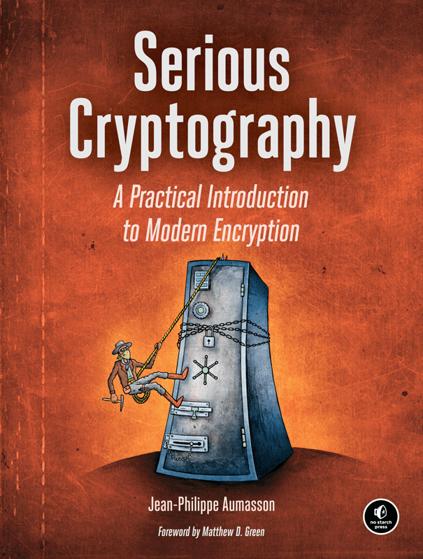

Cryptography made easy…er

Cryptography does not have to be mysterious — as author of [Serious Cryptography](https://nostarch.com/seriouscrypto) Jean-Philippe Aumasson points out. It is meant to be fiendishly complex to break, and it remains very challenging to implement (see jokes on [_rolling your own crypto_](https://twitter.com/MisterCh0c/status/951772327049646080) found all over the Net), but it is well within the grasp of most programmers to understand.

While many are intimidated by the prospect of digging into what is effectively a branch of number theory, the reality is that cryptography is squarely based in discrete mathematics—and good coders are all, without exception and often unknowingly, natural discrete math jugglers. If you are interested and you aced your data structures course, chances are that crypto will not be an unsurmountable challenge to you. Aumasson certainly seems to think so, and he walks us along his own path to the discovery of the cryptographic realm.

#   The Contenders

Other books can take you along this journey, all with their distinctive traits. The classic 1994-vintage [Applied Cryptography](https://www.schneier.com/books/applied_cryptography/) by Bruce Schneier is the unchallenged, most authoritative reference in the field. Squarely focused on crypto algorithms and their weaknesses, it belongs on every security nerd’s shelf, but it may not be an engineers first choice when looking at this space: actual production use or even mention of protocols like TLS and SSL are entirely outside of its scope.

Schneier revisited the subject again in 2003 with Niels Ferguson and gave us [Practical Cryptography](https://www.schneier.com/books/practical_cryptography/), covering every conceivable engineering aspect of implementing and consuming cryptographic code while _having a clue_ to what is happening inside the system. This is an eminently practical book, and it was re-issued in updated form in 2010 under the new title of [Cryptography Engineering](https://www.schneier.com/books/cryptography_engineering/) under the new co-authorship of Tadayoshi Kohno.

While I had read Shneier’s original tome in installments during my Summer visits at the [University of Jyväskylä](https://www.jyu.fi/en), my deep-dive in the field came through a so-called MIT _course bible_, [Lecture Notes on Cryptography](http://cseweb.ucsd.edu/%7Emihir/papers/gb.pdf) compiled for 6.87s, a weeklong course on cryptography taught at MIT by future Turing laureate Shafi Goldwasser and Mihir Bellare during the Summers of 1996–2002, which I myself was privileged to attend in 2000. This was one of the most intellectually challenging and mind-stretching weeks of my life, with a new, exciting idea being served every 10 minutes in an amazing tour-de force. These notes are absolutely great, and I still go back to them, but I do not know if they would serve you as well without the live instructors guiding you along the first time.

[Graduate Course in Applied Cryptography](https://crypto.stanford.edu/%7Edabo/cryptobook/BonehShoup_0_4.pdf), by Dan Boneh and Victor Shoup of Stanford and NYU respectively, is another similar course bible, and I am mentioning it here because it has been updated more recently than Goldwasser and Bellare’s, which was last refreshed in 2008.

#   Enter the New Tome

[No Starch Press](https://nostarch.com/catalog/security) has been lining up an impressive computer security catalog, and it was inevitable they would venture into crypto at one point or another. Aumasson’s entry into the pantheon of the explainers of cryptography is characterized by his focus on teaching us how the algorithms work with the most meager use of mathematical notation. This is, like most of the other books I referenced, a book aiming to increase the understanding of how cryptography works, covering primitives such as block and stream modes, hash functions, and keyed hashing. But what is noteworthy is how this book also straddles the ranges defined earlier, spanning from pre-requisites like the need for good randomness, hard problems, and the definition of cryptographic security on the one end and the operation of the RSA algorithm and the TLS protocol on the other. This is not a book targeted at experts in the field, but it does not trivialize the subject matter either and it is impressive in its breadth: the state of the art in applied cryptography is distilled here in a mere 282 pages.

It is hard to overstate how pleasing the broad reach of this single book is to this reader: despite my keen interest in the field and all my reading, I myself did not hand-roll the RSA algorithm until Professor [H.T. Kung](https://www.eecs.harvard.edu/htk/) made me a few years later — in a networking graduate course. Isolation between the study of the algorithms and the study of the protocols implementing them is exceedingly common, and it is delightful to see this book bridges the two.

I was drawn to the book by its concise and yet comprehensive coverage of randomness for a talk I have been developing, and stayed to read the explanation of keyed hashing and message authentication codes (MACs) — a jewel in its own right as the author co-developed two hash functions now in widespread use . As someone who had to self-start his own coding in both subjects, I wish this book had been available when I was in grad school. _My loss is your gain dear reader, you can catch up to the state of the art much faster than I did a decade ago!_

This is still a complex subject, yet Aumasson’s tome should help increase the ranks of those that can confidently contribute when the topic is being discussed. Most programmers need not be cryptanalysts, but many will benefit from a deeper understanding of how security in computer systems is actually achieved.

Source: Federico Lucifredi ([Crypto Unleashed](http://f2.svbtle.com/crypto-unleashed))
