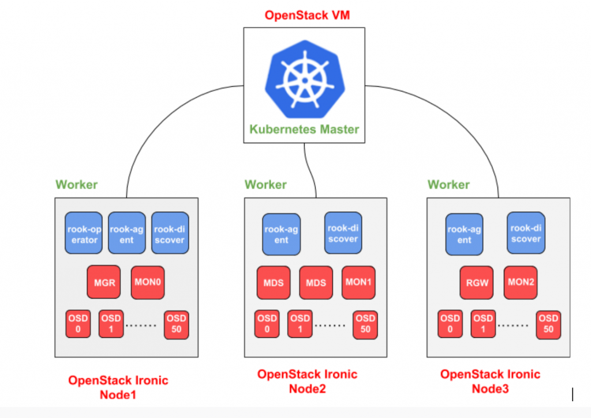

This summer I was lucky to get selected for an internship at CERN. As a CERN openlab Summer Student, I worked in the IT storage group for nine weeks and my summer project was “Evaluating Ceph Deployments with Rook”. I previously had an amazing experience contributing to Ceph as an outreachy intern so I was super excited this time as well.

CERN has been using Ceph since 2013. In addition to operating one of the largest Ceph clusters, it is also an active contributor to Ceph community. CERN benefits from Ceph in several different ways, including:

- OpenStack Images and Volumes (RBD)
- HPC scratch spaces (CephFS)
- Private NFS-like file shares (CephFS)
- Object  storage compatible with Amazon S3 (RGW)

CERN has to deal with petabytes of data so it is always on the lookout for ways to simplify its cloud-based deployments. It has been actively evaluating container-based approaches that build upon its Kubernetes infrastructure. One such technology that recently caught attention was Rook; a storage orchestrator for cloud-native environments. Although Ceph has been satisfying its storage use-cases for years now, it would be a cherry on the top if somehow its operational complexities could be reduced. CERN currently uses a combination of [kickstart](https://access.redhat.com/documentation/en-us/red_hat_enterprise_linux/5/html/installation_guide/ch-kickstart2) and [puppet](https://puppet.com/) to configure and manage Ceph deployments which poses some time constraints. With the recent Rook Ceph integration being in Beta stage, it made sense to evaluate it to see if future Ceph clusters could be deployed using this tool. To be precise, the following areas were hoped to be improved by Rook:

- Reduced deployment times for  new clusters.
- Simplified upgrades.
- More agile horizontal scaling.
- Better failure tolerance.
- Reduced reliance on expert Ceph operators.

My job was to deploy Ceph using Rook in virtual and physical environments and see if the above improvements were achieved. The installation process was pretty straight forward when Rook’s latest version 0.8 was deployed; it can be easily deployed using literally just two commands, given a Kubernetes environment is already setup. One of the vital aspects for evaluation is to be able to use the ceph-mgr’s new Orchestrator CLI module to  quickly add/remove OSDs, RGWs and MDSs in a running cluster. Since the docker image used by Rook’s v0.8 has not rolled out latest master of Ceph at the time of my project, I had to build a custom docker image.

CERN’s cloud-infrastructure is powered by OpenStack, so the virtual environment consisted of OpenStack’s virtual machines while the physical environment consisted of bare metal servers managed by OpenStack Ironic, with each server having 48 disks of 5.5 TB each. My test bed included deploying S3 workloads to gather evaluation metrics such as time to deploy a whole Ceph cluster, time to add a new service (RGW, OSD, MDS) in a cluster, automation of Ceph upgrades and reliability of overall cluster.

Rook did not disappoint me in these evaluation metrics. A newly deployed Ceph cluster was ready to be used in the order of minutes. It takes less than 2 minutes to add a new OSD in a running cluster. Same goes for adding services such as RGW and MDS. Rook is built on top of Kubernetes, so node reliability and improved failure tolerance become first class features. The Orchestrator CLI with Rook backend makes it easy to operate the deployed cluster, especially for those who are already familiar with the Ceph CLI.  However, Ceph upgrades are not automated as yet and there is coupling between Rook and Ceph versions which makes overall deployments less flexible. These features are targeted for the upcoming Rook release v0.9.

Owing to the huge infrastructure of CERN, it makes sense to actively explore techniques to make operations faster and easier. In my opinion, Rook looks like a promising open source project that aim to make storage better for cloud environments. It would be a good idea to deploy future Ceph clusters with Rook and Kubernetes, once features like automated upgrades and support of decoupled versions are achieved. The results of this project will help folks at CERN decide whether they should adopt Rook and Kubernetes for future Ceph deployments.

This was originally contributed by [Rubab Syed](https://twitter.com/RubabSyed21).
