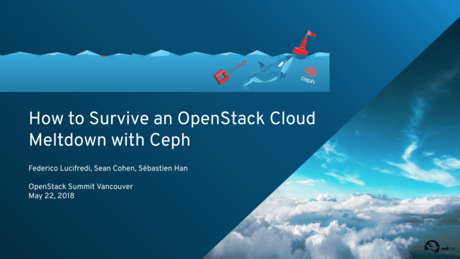

_Los Tres Caballeros_ —sans sombreros— descended on Vancouver this week to participate in the “_Rocky_” OpenStack Summit. For the assembled crowd of clouderati, [Sébastien Han](https://twitter.com/leseb_), [Sean Cohen](https://twitter.com/SeanCohen_RH) and yours truly had one simple question: what if your datacenter was wiped out in its entirety, but your users hardly even noticed?

We have touched on the disaster recovery theme [before](https://f2.svbtle.com/saving-the-galaxy-openstack-dr-with-ceph), but this time we decided to discuss backup as well as HA, which made for a _slightly_ longer talk than we had planned—we hope you enjoyed our “choose your disaster” tour, we definitely enjoyed leading it.

The recording of our OpenStack Summit session is now live on the OpenStack Foundation’s YouTube channel. It is impressive how quickly the Foundation’s media team releases now:

\[youtube https://www.youtube.com/watch?v=n2S7uNC\_KMw&w=560&h=345\]

Our slides are available as a PDF and can be viewed inline below — we are including our backup slides, so you can find out what we could have talked about, had we run over _even_ longer ;-)

See you all in Berlin this fall!

Source: Federico Lucifredi ([How to Survive an OpenStack Cloud Meltdown with Ceph](http://f2.svbtle.com/how-to-survive-an-openstack-cloud-meltdown-with-ceph))
