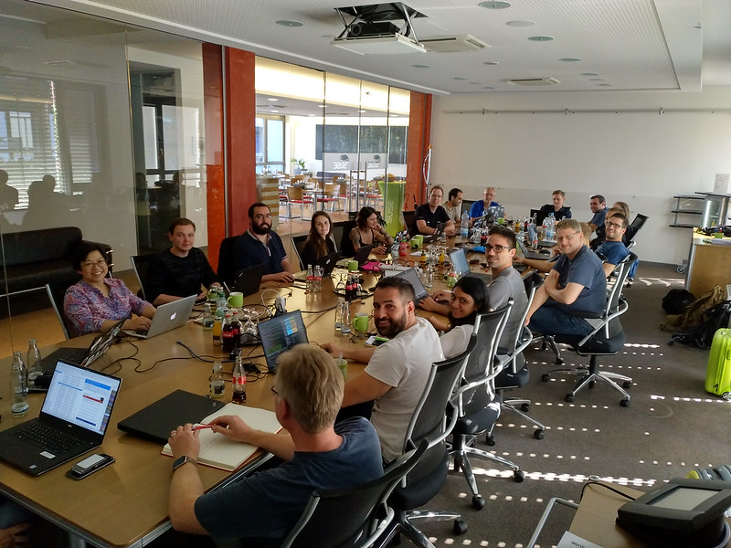

From Tuesday, 17th to Thursday, 19th of July, the developers working on the [Ceph Manager Dashboard](http://docs.ceph.com/docs/master/mgr/dashboard/) held a first face to face meeting in Nuremberg, Germany.

The meeting was hosted by SUSE and was attended by 23 representatives from Red Hat and SUSE that work on the dashboard or related components like [Prometheus](https://prometheus.io/)/[Grafana](https://grafana.com/) or the [Salt](https://saltstack.com/salt-open-source/)\-based [DeepSea](https://github.com/SUSE/DeepSea) deployment framework for Ceph.

This was the first time for many participants to meet in person, and some of them came all the way from countries that included the US, Spain, Portugal, India and as far as New Zealand to attend.

The participants included the following:

- Alfonso Martínez (Red Hat)
- Boris Ranto (Red Hat)
- Ernesto Puerta (Red Hat)
- Jan Fajerski (SUSE)
- Jeff Brown (Red Hat)
- Ju Lim (Red Hat)
- Joao Luis (SUSE)
- Joshua Schmid (SUSE)
- Kai Wagner (SUSE)
- Kanika Murarka (Red Hat)
- Lars Marowsky-Brée (SUSE)
- Laura Paduano (SUSE)
- Patrick Nawracay (SUSE)
- Lenz Grimmer (SUSE)
- Paul Cuzner (Red Hat)
- Ricardo Dias (SUSE)
- Ricardo Marques (SUSE)
- Sebastian Krah (SUSE)
- Sebastian Wagner (SUSE)
- Stephan Müller (SUSE)
- Tatjana Dehler (SUSE)
- Tiago Melo (SUSE)
- Volker Theile (SUSE)

")

Over the course of three days, we covered a wide range of topics and we made a lot of progress in discussing and defining issues to build up a plan of tasks that we would like to accomplish in Ceph Dashboard.

See [the Etherpad](https://pad.ceph.com/p/ceph-dashboard-f2f-2018-07) for notes and more details on what we discussed.

One of the highlights was that we developed a shared prioritized Ceph Dashboard roadmap for the Nautilus release and beyond, including the following high-level features:

- OSD Management (built-in tasks: reweight, mark in/out)
- Grafana Integration (Incorporating ceph-metrics inspired Grafana dashboards into the Ceph Dashboard)
- Auditing Logs (Similar to http access log)
- Official REST-API (includes pass-through MON-commands, write config opts, documentation, CRUSH, etc.)
- Alerting (need for basic alerting as well as advanced alerting via Prometheus)
- iSCSI Management (initially monitoring only until community makes decision on direction to take)
- NFS-Ganesha Management (e.g. create/remove/edit shares, deploy daemons via orchestration layer, disable unsupported features using the existing privilege system)
- Performance and scalability testing
- CephFS Management (e.g. evict a CephFS client)
- RGW-Multisite Management
- RBD-Mirroring Management
- Support for bulk operations (e.g. loading a CSV file of users to create on RGW)
- Service Deployment (orchestration interface)
- CephX key management

Some other takeaways and noteworthy developments include:

- The Ceph Dashboard initial landing page will be reworked to provide more "native" widgets for displaying real-time metrics and status information
- Reference code example for Grafana integration has been merged
- Strawman requirements for the Ceph REST API for Nautilus release will be drafted and shared with the community
- iSCSI active management blocked by lack of decision on iSCSI direction, i.e. krbd or tcmu-runner for iscsi LIO+krbd vs. ceph-iscsi
- I18N work is underway, and note that internationalization is only being applied to front-end
- Grafana only supports English and does not support internationalization (I18N); however, we will make necessary Grafana dashboard accomodations to ensure I18N support
- There was agreement to use Prometheus for advanced alerting and that ceph-mgr should provide basic alerting.
- For UI/UX branding and style, we may take inspiration from [Patternfly](https://www.patternfly.org) and SUSE's design guidelines, but we want to ensure that Ceph Dashboard will not look specific to any particular organization.
- For new UI components and workflows, we'll prepare mockups in advance to the actual implementation (using a free OSS license of Balsamiq Mockups)
- Ceph Dashboard will be easily brandable in terms of login page, masthead, and About dialog; efforts underway to help make this easier for companies to rebrand.
- User and role management work underway (CLI configuration and user management via the UI is merged, managing roles via the UI is progress)
- Plan to enforce PR’s including unit tests in order to get merged (as currently unit tests are not required for a PR to be merged)
- The [Ceph Issue Tracker](https://tracker.ceph.com/) will be used to track all agreed upon new features
- Ceph Dashboard efforts can be tracked on the [Ceph Dashboard Agile Tracker Board](https://tracker.ceph.com/projects/mgr/agile/board) though Developer access is required to access it at the moment.

We couldn't have asked for a better outcome from the meeting. The team bonded well and have established long lasting and durable relationships. We would like to thank Red Hat and SUSE for supporting this event and for making it possible for the developers to meet!
