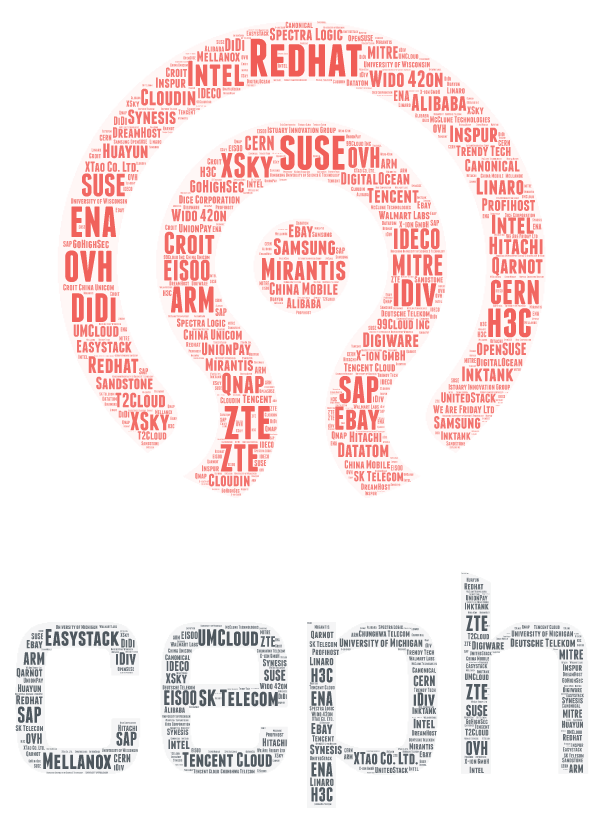

A new version of Ceph has been released, and we've had a steady inflow of new contributors and companies contributing to Ceph.

The affiliation of authors to organizations can be updated by submitting a patch to [https://github.com/ceph/ceph/blob/master/.organizationmap](https://github.com/ceph/ceph/blob/master/.organizationmap)

There were around 284 authors affiliated to over 68 companies contributing during this release cycle. Over the Mimic release cycle we've had our first [Cephalocon in Beijing](https://ceph.com/community/cephalocon-apac-2018-report/), and  several other Ceph Days and tracks in conferences. These are certainly exciting times in the Ceph Community, and it is always great to see so many new contributors. There are [several ways to get involved](http://docs.ceph.com/docs/master/start/get-involved/) with the Ceph community, for help with Code contributions, [master docs](http://docs.ceph.com/docs/master/dev/) are a decent start.

Some details in the tables below:

 

**Lines changed by Authors**

\[table id=5 /\]

**Lines changed by Organizations**

\[table id=6 /\]

**Commits by Authors**

\[table id=7 /\]

**Commits by Organizations**

\[table id=8 /\]

While all commits are reviewed but the number of reviews is a fraction of the number of commits. More often than not, the reviewer(s) is only mentioned in the message of the merge although it means that all associated commits have been reviewed. If you are curious about how it is done, do checkout the wiki entry at [http://tracker.ceph.com/projects/ceph/wiki/Ceph\_contributors\_list\_maintenance\_guide](http://tracker.ceph.com/projects/ceph/wiki/Ceph_contributors_list_maintenance_guide)

**Reviews by Authors**

\[table id=9 /\]

**Reviews by Organizations**

\[table id=10 /\]
