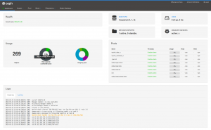

After an intensive 9 month development cycle, the Ceph project is happy to [announce their next stable release](http://ceph.com/releases/v13-2-0-mimic-released/): Ceph 13.2.0 "Mimic" is the first version of Ceph that has been published under the revised release schedule in which a new stable release is published every nine months. Previously, Ceph releases were made available in a six-month cycle, where only every second release was declared "stable" and received bug fixes for a longer period.

As usual, Ceph Mimic comes with a long list of enhancements and improvements as well as several new features. Please consult the [release notes](http://docs.ceph.com/docs/master/releases/mimic/) for an exhaustive list!

Having worked on this project with my team pretty much full-time for the past six months, it's probably not surprising that my personal highlight of the Mimic release is the new Ceph Manager Dashboard, aka "Dashboard v2".

Implemented as a Ceph Manager module, it is a "plug-in" replacement of [the one that shipped with Ceph Luminous](http://ceph.com/community/new-luminous-dashboard/) and is an ongoing project to add a full-featured, native web based monitoring and administration application to the upstream Ceph project. The development of this new dashboard is actively driven by the team that developed the open source [openATTIC Ceph management](https://openattic.org/) and monitoring tool at [SUSE](https://suse.com/).

The architecture and functionality of this module is derived from and inspired by openATTIC, merging both functionality from the original dashboard as well as adding new functionality originally developed for the standalone version of openATTIC.

The WebUI implementation is based on [Angular](https://angular.io/)/[TypeScript](http://www.typescriptlang.org/), the dashboard module’s backend code uses the [CherryPy](https://cherrypy.org/) Python framework and a custom REST API implementation. Take a look at the openATTIC blog for additional background information about the evolution of this project.

As part of the initial Mimic release, it currently provides the following features to monitor and manage various aspects of your Ceph cluster:

- Username/password protection: The dashboard can only be accessed by providing a configurable username and password.
- SSL/TLS support: All HTTP communication between the web browser and the dashboard is secured via SSL. A self-signed certificate can be created with a built-in command, but it’s also possible to import custom SSL certificates signed and issued by a CA.
- Overall cluster health: Displays the overall cluster status, storage utilization (e.g. number of objects, raw capacity, usage per pool), a list of pools and their status and usage statistics.
- Cluster logs: Display the latest updates to the cluster’s event and audit log files.
- Hosts: Provides a list of all hosts associated to the cluster, which services are running and which version of Ceph is installed.
- Performance counters: Displays detailed service-specific statistics for each running service.
- Monitors: Lists all MONs, their quorum status, open sessions.
- Configuration Reference: Lists all available configuration options, their description and default values.
- Pools: List all Ceph pools and their details (e.g. applications, placement groups, replication size, EC profile, CRUSH ruleset, etc.)
- OSDs: Lists all OSDs, their status and usage statistics as well as detailed information like attributes (OSD map), metadata, performance counters and usage histograms for read/write operations.
- iSCSI: Lists all hosts that run the TCMU runner service, displaying all images and their performance characteristics (read/write ops, traffic).
- Block storage (RBD): Lists all RBD images and their properties (size, objects, features). Create, copy, modify and delete RBD images. Create, delete and rollback snapshots of selected images, protect/unprotect these snapshots against modification. Copy or clone snapshots, flatten cloned images.
- RBD mirroring: Lists all active sync daemons and their status, pools and RBD images including their synchronization state.
- CephFS: Lists all active filesystem clients and associated pools, including their usage statistics.
- Object Gateway (RGW): Lists all active object gateways and their performance counters. Display and manage (add/edit/delete) object gateway users and their details (e.g. quotas) as well as the users’ buckets and their details (e.g. owner, quotas).

Getting started with the dashboard is simple. When installing Ceph from the RPM or DEB installation packages, the package management system should have already taken care of installing the required dependencies (e.g. Python modules). The dashboard can be enabled on any node that runs an instance of the Ceph manager daemon. Check the [documentation](http://docs.ceph.com/docs/mimic/mgr/dashboard/#enabling) for details on how to enable and configure the dashboard.

### Outlook

Looking back, I'm quite impressed about what the team has accomplished in the extremely short time window that we had for pulling this off. But we're far from done yet - among other things, we'd like to add the missing features that will get the dashboard on par with features provided by openATTIC, to provide a migration path for existing users. As some of this functionality depends on interacting with external instrumentation frameworks, it will likely take some more time to find a generic approach.

We have a number of additional features that we will add to the Mimic branch for later releases. As of today, we're currently working on the following features:

- Adding support for multiple user accounts, roles and single-sign on (SSO)
- OSD management features (e.g. trigger scrubbing/deep scrubbing), list set/unset cluster wide OSD flags, modifying an OSD's CRUSH weight
- Embedding Grafana dashboards into the manager dashboard UI for enhanced monitoring capabilities
- Ceph pool management (create/edit/delete) and EC profile management
- Manage the new MON-based cluster configuration settings

### Feedback and contributions wanted

If you're going to deploy a Ceph Mimic cluster in your environment, please give the new dashboard a try and let us know what you think! We're especially interested in learning more about features you are missing, how to improve the existing functionality or the usability and user experience in general. If you have anything to share, please get in touch using any of the [established communication methods](http://ceph.com/irc/). In addition to that, the team working on the dashboard can also be reached on the #ceph-dashboard IRC channel on OFTC. We look forward to your feedback, bug reports and ideas!

If you would like to get involved in the dashboard development, please see the [HACKING.rst file in the source tree](https://github.com/ceph/ceph/blob/master/src/pybind/mgr/dashboard/HACKING.rst) for details on how to work on the code base.
