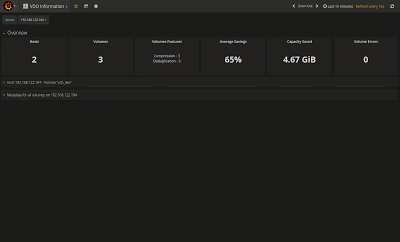

My previous post showed you how to get deduplication working on Linux with VDO. In some ways, that's the post that could cause trouble - if you start using vdo across a number of hosts, how can you easily establish monitoring or even alerting?

  

So that's the problem we're going to focus on in this post.

  

### Monitoring

There are a heap of different ways to monitor systems, but the rising star currently is [Prometheus](https://prometheus.io/). Historically, I've used monitoring systems that require clients to push data to a central server but Prometheus turns this around. With Prometheus data collection is initiated by the Prometheus server itself - it's called a 'scrape' job. This approach simplifies client configurations and management, which is a huge bonus for large installations.

  

To make vdo data available, we need an exporter. The exporter provides a http endpoint that the Prometheus server will scrape metrics from. There are a [heap of exporters](https://prometheus.io/docs/instrumenting/exporters/) available to Prometheus covering a plethora of different subsystems, but since vdo is new there isn't something you can just pick up and run with. Well that was the case...

  

### vdo\_exporter Project

The scrape job simply issues a GET request to the "/metrics" HTTP API endpoint on a host. Developing an API endpoint for this in python is fairly straight forward, and given the metrics themselves are all nicely grouped together under sysfs, it seemed a bit of a no-brainer to develop an exporter. My exporter can be found [here](https://github.com/pcuzner/vdo_exporter). The project's repo contains the python code, a systemd unit file and what I hope is a sensible README file documenting how to install the exporter (_if you have a firewall active, remember to open port 9286!_)

  

I'm leaving the installation of the exporter as an exercise for the reader, and use the rest of this article to show you how to quickly stand up prometheus and grafana to collect and visualise the vdo statistics. For this example, I'm again using Fedora so for other distributions you may have to tweak 'stuff'.

  

### Containers to the Rescue!

The prometheus and grafana projects both provide docker images on docker hub, so assuming you already have docker installed on your machine you can grab the images with the following;  
  

docker pull quay.io/prometheus/prometheus  
docker pull docker.io/grafana/grafana:4.6.3

  
Containers are inherently stateless, but for monitoring and dashboards we need to make sure that these containers use either different docker volumes, or persist data to the host's filesystem. For this exercise, I'll be exposing some directories on the host's filesystem (change these to suit!)  
  

mkdir -p /opt/docker/grafana-prom/{etc,data}  
chown 104 /opt/docker/grafana-prom/{etc,data}  
chgrp 107 /opt/docker/grafana-prom/{etc,data}  
mkdir -p /opt/docker/grafana-prom/prom-{etc,data}  
chown 65534 /opt/docker/grafana-prom/prom-{etc,data}  
chgrp 65534 /opt/docker/grafana-prom/prom-{etc,data}  
  

  
To launch the containers and manage them as a unit, I'm using "docker-compose" - so if you don't have that installed, talk nicely to your package manager :)  
  

Assuming you have docker-compose available, you just need a compose file (docker-compose.yml) to bring the containers together;  
  

version: '2'  
  
services:  
  grafana:  
    image: docker.io/grafana/grafana:4.6.3  
    container\_name: grafana  
    ports:  
      - "3000:3000"  
    volumes:  
      - /opt/docker/grafana-prom/etc:/etc/grafana:Z  
      - /opt/docker/grafana-prom/data:/var/lib/grafana:Z  
    depends\_on:  
      - prometheus  
  prometheus:  
    image: docker.io/prom/prometheus  
    container\_name: prometheus  
    network\_mode: "host"  
    ports:  
      - "9090:9090"  
    volumes:  
      - /opt/docker/grafana-prom/prom-etc:/etc/prometheus:Z  
      - /opt/docker/grafana-prom/prom-data:/prometheus:Z

  

With the directories in place for the persistent data within the containers, and the compose file ready you just need to start the containers. Run the docker-compose command from the directory that holds your docker-compose.yml file.  
  

\[root@myhost grafana\_prom\]# docker-compose up -d  
Creating network "grafanaprom\_default" with the default driver  
Creating prometheus ...  
Creating prometheus ... **done**  
Creating grafana ...  
Creating grafana ... **done**

  

### Configuring Prometheus

You should already have the vdo\_exporter service running on your hosts that are using vdo, so the next step is to create a scrape job in prometheus to tell it to go and fetch the data. This is done by editing the prometheus.yml file - in my case this is in /opt/docker/grafana-prom/prom-etc.  Under the scrape\_configs section add something like this to collect data from your vdo host(s)  
  

\# VDO Information  
\- job\_name: "vdo\_stats"  
  static\_configs:  
    - targets: \[ '192.168.122.98:9286'\]

  
Now reload Prometheus to start the data collection  

\[root@myhost grafana\_prom\]# docker exec -it prometheus sh

/prometheus $ kill -SIGHUP 1 

  

### Configuring Grafana

To visualize the vdo statistics that Prometheus is collecting, Grafana needs two things; the data source definition pointing to the prometheus container, and a dashboard that presents the data.  
  

1. Login to your grafana instance (http://localhost:3000), using the default credentials (admin/admin)
2. Click on the Grafana icon in the top left, and select Data Sources
3. Click the "Add  data source" button
4. Enter the prometheus details (and ensure you set the data source as the default)
  
  
  
9. The grafana directory in the vdo\_exporter project holds a file called VDO\_Information.json. This json file is the dashboard definition, so we need to import it.

- Click on the grafana icon again, highlight the Dashboards entry, then select the import option from the pop-up menu.
- Click on the Upload.json File, and pick the VDO\_Information.json file to upload.

6. Now select the dashboard icon (to the right of the Grafana logo), and select "VDO Information". You should then see something like this

  

7. As you add more hosts that are vdo enabled, just add the host's ip to the prometheus scrape configuration and reload prometheus. Simples..

  

Grafana provides a notifications feature which enables you to define threshold based alerting. You could define a trigger for low "physical space" conditions, or alert based on recovery being active - I leave that up to you! Grafana supports a number of different notification endpoints including PagerDuty, Sensu and even email! So take some time and review the [docs](http://docs.grafana.org/alerting/notifications/) to see how Grafana could best integrate into your environment.

  
  

### And Remember...

VDO is not the proverbial "_silver bullet_". The savings from any compression and deduplication technology is dependent on the data you're storing, and vdo is no different. Also, each vdo volume requires additional RAM, so if you want to move vdo out of the test environment into production you'll need to plan for additional CPU and RAM to "make the magic happen"™.

  
  

Source: Paul Cuzner ([Monitoring VDO Volumes](http://opensource-storage.blogspot.com/2018/04/monitoring-vdo-volumes.html))
