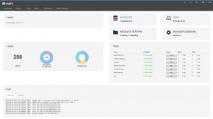
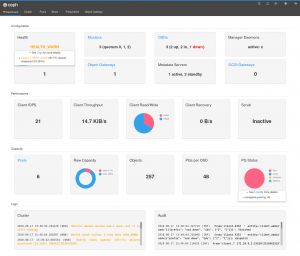

One of the future highly user-visible improvements in the [Ceph Manager Dashboard](http://docs.ceph.com/docs/master/mgr/dashboard/) is a new landing page that will use "native" JavaScript widgets to inform the user about the current state of the cluster at a glance.

This feature has been in the works for quite some time now; after initial discussions on the [related tracker issue](https://tracker.ceph.com/issues/24573), the [resulting pull request](https://github.com/ceph/ceph/pull/23568) also received a lot of feedback and suggestions that had to be addressed.

The initial implementation has now been merged into the master branch that will evolve into becoming the Ceph "Nautilus" release. Thanks to everyone who contributed to this discussion and to Alfonso Martínez for the implementation!

This is how the landing page looked before, which was basically a direct conversion of the original Ceph Manager Dashboard:

And this is the new one:

Note that we're not done with this feature yet, this is just the first stage of the implementation. There are a number of [additional enhancements](https://tracker.ceph.com/issues/27050) that will be added in the near future.

If you have any ideas and suggestions on how to further improve this page, please let us know!
