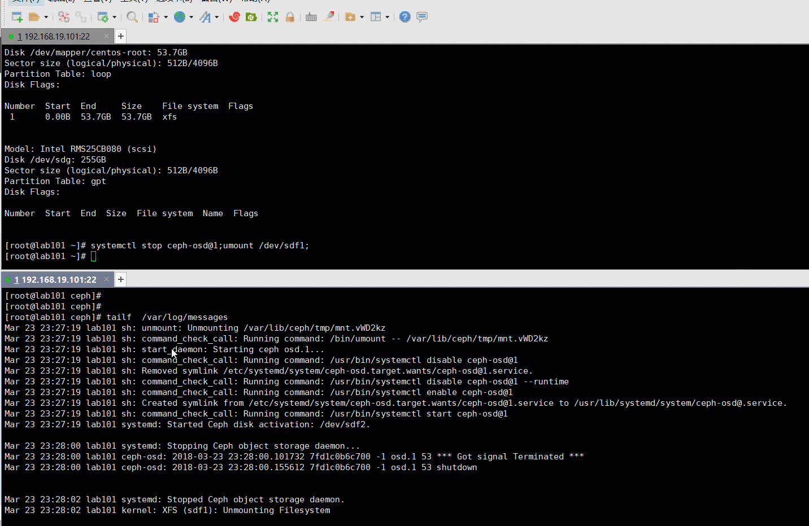
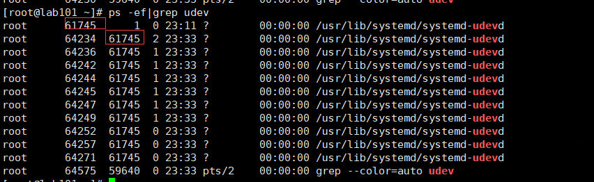

  
  

## 前言

如果看到标题，你是不是第一眼觉得写错了，这个怎么可能，完全就是两个不相关的东西，最开始我也是这么想的，直到我发现真的是这样的时候，也是很意外，还是弄清楚下比较好，不然在某个操作下，也许就会出现意想不到的情况

## 定位

如果你看过我的博客，正好看过这篇[ceph在centos7下一个不容易发现的改变](http://www.zphj1987.com/2016/03/31/ceph%E5%9C%A8centos7%E4%B8%8B%E4%B8%80%E4%B8%AA%E4%B8%8D%E5%AE%B9%E6%98%93%E5%8F%91%E7%8E%B0%E7%9A%84%E6%94%B9%E5%8F%98/)，那么应该还记得这个讲的是centos 7 下面通过udev来实现了osd的自动挂载，这个自动挂载就是本篇需要了解的前提  

<table><tbody><tr><td class="code"><pre>[root@lab101 ~]# df -h|grep ceph /dev/sdf1                233G   34M  233G   1% /var/lib/ceph/osd/ceph-1 [root@lab101 ~]# systemctl stop ceph-osd@1 [root@lab101 ~]# umount /dev/sdf1  [root@lab101 ~]# parted -l &amp;&gt;/dev/null [root@lab101 ~]# df -h|grep ceph /dev/sdf1                233G   34M  233G   1% /var/lib/ceph/osd/ceph-1 [root@lab101 ~]# ps -ef|grep osd ceph      62701      1  1 23:25 ?        00:00:00 /usr/bin/ceph-osd -f --cluster ceph --id 1 --setuser ceph --setgroup ceph root      62843  35114  0 23:25 pts/0    00:00:00 grep --color=auto osd </pre></td></tr></tbody></table>

看这个操作过程，是不是很神奇，是不是很意外，不管怎么说，parted -l的一个操作把我们的osd给自动mount 起来了，也自动给启动了

出现这个以后，我们先看下日志怎么出的，大概看起来的是这样的  

可以看到确实是实时去触发的

服务器上面是有一个这个服务的

> systemd-udevd.service  
> 看到在做parted -l 后就会起一个这个子进程的  
> 

在尝试关闭这个服务后，再做parted -l操作就不会出现自动启动进程

## 原因

执行parted -l 对指定设备发起parted命令的时候，就会对内核做一个trigger，而我们的

> /lib/udev/rules.d/95-ceph-osd.rules  
> 这个文件一旦触发是会去调用  
> /usr/sbin/ceph-disk —log-stdout -v trigger /dev/$name

也就是自动挂载加上启动osd的的操作了

### 可能带来什么困扰

其实这个我也不知道算不算bug，至少在正常使用的时候是没有问题的，以至于这个功能已经有了这么久，而我并没有察觉到，也没有感觉到它给我带来的干扰，那么作为一名测试人员，现在来构思一种可能出现的破坏场景，只要按照正常操作去做的，还会出现的，就是有可能发生的事情  

<table><tbody><tr><td class="code"><pre>cd /var/lib/ceph/osd/ [root@lab101 osd]# df -h|grep osd /dev/sdf1                233G   34M  233G   1% /var/lib/ceph/osd/ceph-1 [root@lab101 osd]# systemctl stop ceph-osd@1 [root@lab101 osd]# umount /dev/sdf1 [root@lab101 osd]# parted -l  &amp;&gt;/dev/null [root@lab101 osd]# rm -rf ceph-1/ rm: cannot remove ‘ceph-1/’: Device or resource busy [root@lab101 osd]# ll ceph-1/ total 0 [root@lab101 osd]# df -h|grep ceph /dev/sdf1                233G   33M  233G   1% /var/lib/ceph/osd/ceph-1 </pre></td></tr></tbody></table>

可以看到除了上面的parted -l以外，其他操作都是一个正常的操作，umount掉挂载点，然后清理掉这个目录，然后数据就被删了，当然正常情况下也许没人在正好那个点来了一个parted,但是不是完全没有可能

还有种情况就是我是要做维护，我想umount掉挂载点，不想进程起来，执行parted是很常规的操作了，结果自己给我拉起来了，这个操作应该比较常见的

### 如何解决这个情况

第一种方法  
什么都不动，你知道这个事情就行，执行过parted后再加上个df多检查下

第二种方法  

<table><tbody><tr><td class="code"><pre>systemctl stop systemd-udevd </pre></td></tr></tbody></table>

这个会带来其他什么影响，暂时不好判断，还没深入研究，影响应该也只会在硬件变动和一些udev触发的需求，不确定的情况可以不改，不推荐此方法

第三种方法  
不用这个/lib/udev/rules.d/95-ceph-osd.rules做控制了，自己去写配置文件，或者写fstab，都可以，保证启动后能够自动mount，服务能够正常启动就可以了，个人从维护角度还是偏向于第三种方法，记录的信息越多，维护的时候越方便，这个是逼着记录了一些信息，虽然可以什么信息也不记

## 总结

其实这个问题梳理清楚了也还好，最可怕的也许就是不知道为什么，特别是觉得完全不搭边的东西相互起了关联，至少在我们的研发跟我描述这个问题的时候，我想的是，还有这种神操作，是不是哪里加入了钩子程序什么的，花了点时间查到了原因，也方便在日后碰到不那么惊讶了

ceph北京大会已经顺利开完了，等PPT出来以后再学习一下新的东西，内容应该还是很多的，其实干货不干货，都在于你发现了什么，如果有一个PPT里面你提取到了一个知识点，你都是赚到了，何况分享的人并没有告知的义务的，所以每次看到有分享都是很感谢分享者的

## 变更记录

| Why | Who | When |
| --- | --- | --- |
| 创建 | 武汉-运维-磨渣 | 2018-03-23 |

Source: zphj1987@gmail ([parted会启动你的ceph osd，意外不？](http://www.zphj1987.com/2018/03/23/parted-may-start-your-osd/))
