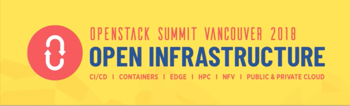
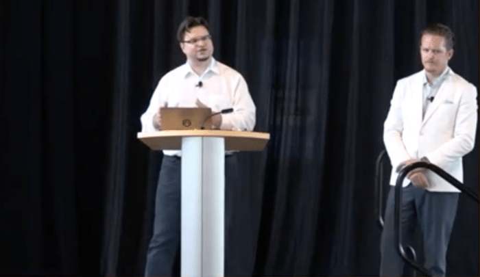
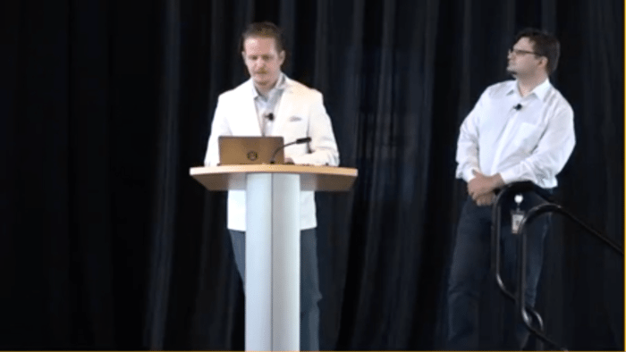

Kyle Bader and I teamed up to deliver a quick (and hopefully painless) review of what types of storage your Big Data strategy needs to succeed alongside the better-understood (and more traditional) existing approaches to structured data.

Data platform engineers need to receive support from both the Compute and the Storage infrastructure teams to deliver. We look at how the public cloud, and Amazon AWS in particular, tackle these challenges and what are the equivalent technology strategies in OpenStack and Ceph.

Tradeoffs between IO latency, availability of storage space, cost and IO performance lead to storage options fragmenting into three broad solution areas: network-backed persistent block, application-focused object storage (also network based), and directly-attached low-latency NVME storage for highest-performance scratch and overflow space.

Ideally, the infrastructure designer would choose to adopt similarly-behaving approaches to the public and private cloud environments, which is what makes OpenStack and Ceph a good fit: scale-out, cloud-native technologies naturally have much more in common with public cloud than legacy vendors. Interested? Listen to our quick survey of the field, the OpenStack Foundation kindly published a recording of our session:

\[youtube https://www.youtube.com/watch?v=1U-rev697Js&w=560&h=345\]

Our slides are [available as a PDF download](http://people.redhat.com/%7Eflucifre/talks/Storage%20for%20Data%20Platforms.pdf) and can be viewed inline below.

Source: Federico Lucifredi ([Storage for Data Platforms in 10 minutes](https://f2.svbtle.com/storage-for-data-platforms-in-10-minutes))
