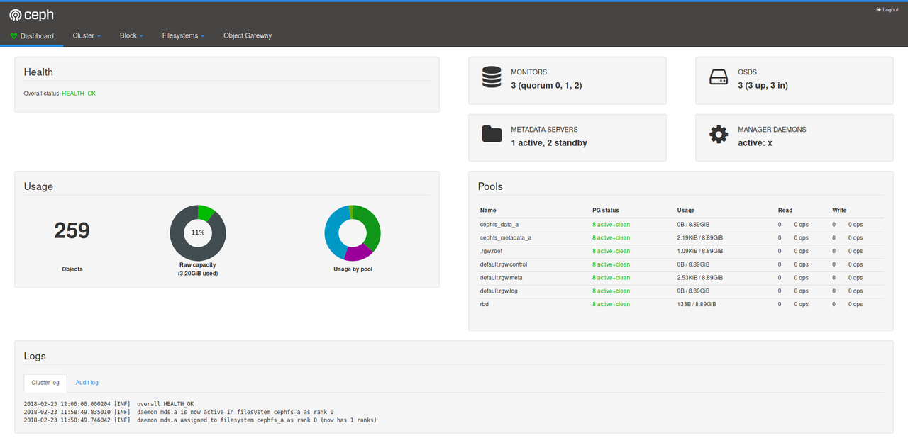

About a month ago, we [shared the news](http://openattic.org/posts/ceph-manager-dashboard-v2/) that we started working on a replacement for the Ceph dashboard, to set the stage for creating a full-fledged, built-in web-base management tool for Ceph.

We're happy to announce that we have now finalized the preparations for the [initial pull request](https://github.com/ceph/ceph/pull/20103), which marks our first milestone in this venture: reaching feature parity with the existing dashboard.

Screen shot of the Ceph health dashboard

In fact, compared to the dashboard shipped with Ceph Luminous, we already included a number of additional features that were added after the Luminous release and added a simple authentication mechanism.

[Read more…](http://openattic.org/posts/the-ceph-dashboard-v2-pull-request-is-ready-for-review/) (1 min remaining to read)

Source: SUSE ([The Ceph Dashboard v2 pull request is ready for review!](http://openattic.org/posts/the-ceph-dashboard-v2-pull-request-is-ready-for-review/))
