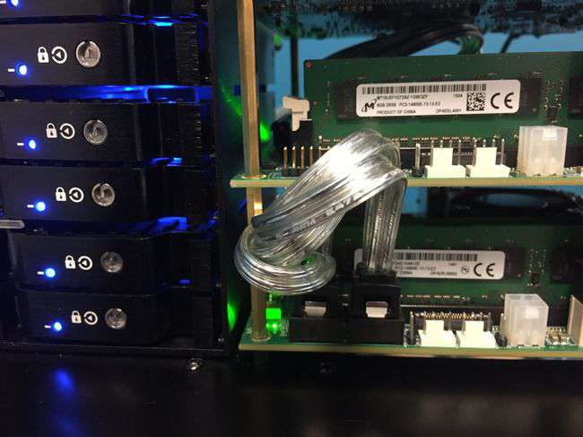
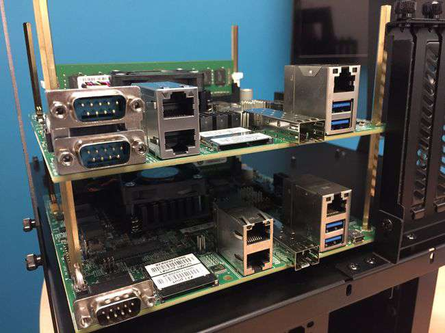
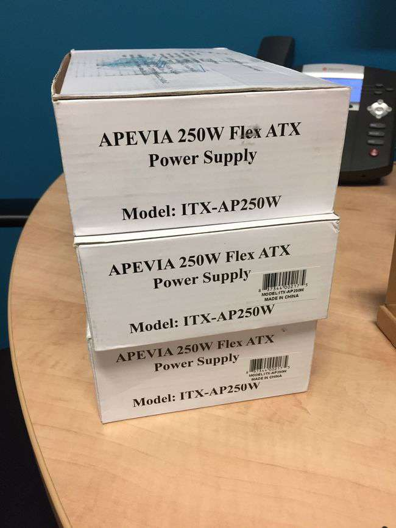
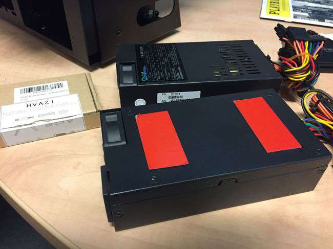
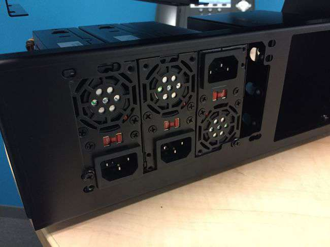
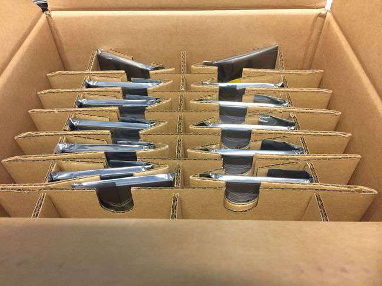
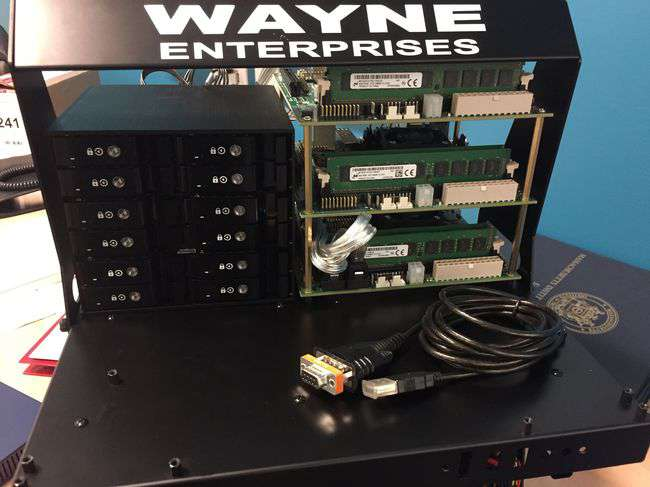
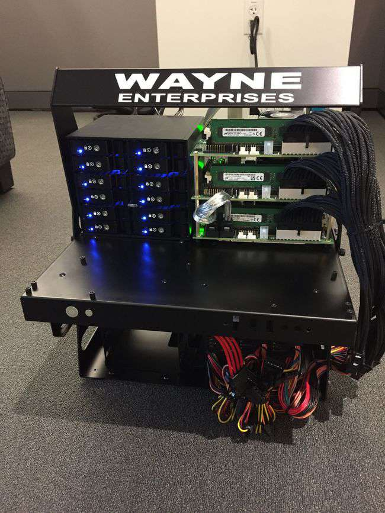

Revisiting [Applied Micro’s Mustang](https://f2.svbtle.com/arm-64-bit-walkthrough-of-the-mustang) two years later, we learned that a few things have changed, and use three of them to build a test storage cluster to try Ceph on ARM — doing a little benchmarking while we are at it.

#   A New Breed

A newer revision of the Mustang EVK X-Gene 1 development board has relocated some of its ports and added a few more capabilities. The classic board we discussed at length in [a previous blog](https://f2.svbtle.com/arm-64-bit-walkthrough-of-the-mustang) is now identified with the model number 3PBx, whereas the new ones are part of the 3PCx series.

The SATA ports have moved, as you can see in the picture stacking a new board over the older one, and two ethernet ports and the SD card slot have traded places. Besides these cosmetic changes, an additional serial port has been brought out to a connector as UART1 and placed right above good old UART0.

A more substantial change is the adoption of a new UEFI firmware made by American Megatrends. While I am and forever will be a fan of U-Boot, this is a logical step towards making ARM a full-fledged datacenter platform.

#   Hardware Integration

Our friends at Applied Micro very kindly provided me with two additional boards, so that I could experiment with the design and creation of a small storage cluster. I properly stacked them on a [Lian Li PC-T60B](http://www.lian-li.com/en/dt_portfolio/pc-t60/) test bench using brass standoffs Amazon kindly equipped me with for a few bucks.

Powering the system required a little more thinking. The test bench has room for _one_ standard-size ATX power supply, not three. I resolved this by employing three Flex ATX form factor power supplies. These are designed to fit in 1-U datacenter cases and have front-to-back forced ventilation, which makes them perfect for stacking. I coupled the PSUs together using [3M double-sided VHB tape](http://www.3m.com/3M/en_US/company-us/all-3m-products/%7E/All-3M-Products/Adhesives-Tapes/Industrial-Adhesives-and-Tapes/Double-Sided-Bonding-Tapes/3M-VHB-Tapes/), which bonds permanently and was originally designed to replace rivets in metal assembly — awesome stuff as long as the plan does not involve ever taking things apart!

Cleverly lining up the combined power supply to existing screw holes and using the rubber pads of the standard PSU seat to provide additional support made for a very stylish 3-PSU rig. If you do not look too closely, you would never know this was not the originally designed setup.

Storage configuration was more straightforward. The APM Mustang is ideally suited to this task because of its many storage options, unlike mostly all other ARM developer boards, as they have no SATA ports to speak of. My design calls for booting from the SDXC card slot and using the four SATA ports to each drive a disk — these will be managed by Ceph OSDs.

The Seagate team very generously agreed to loan a dozen SSD drives for my experiment. We have now enough drives to assign a dedicated CPU core to each drive, plus three SD cards to boot the system from - fifteen storage devices.

The drives arrived concurrently with a [Vantec EZ Swap M2500](http://www.vantecusa.com/products_detail.php?p_id=190&p_name=EZ+Swap+M2500+Series+-+2.5%22+Mobile+Rack+%288+Bay%29&pc_id=7&pc_name=Mobile+rack&pt_id=2&pt_name=Hard+Drive+Accessories) twelve-bay SATA drive cage to install them in. Very solid aluminum construction and straightforward SATA pass-thru make it ideal to rack our twelve drives closely-packed and in style.

To be continued…

Source: Federico Lucifredi ([The Mustang Rides Again](https://f2.svbtle.com/return-of-the-mustangs))
