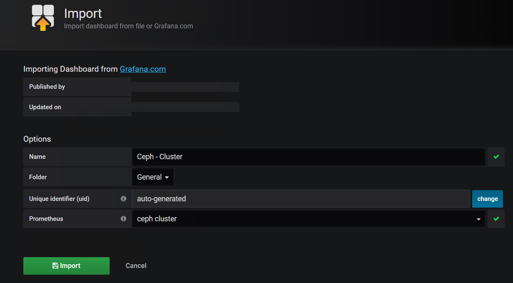

  
  

## 前言

ceph的可视化方案很多，本篇介绍的是比较简单的一种方式，并且对包都进行了二次封装，所以能够在极短的时间内构建出一个可视化的监控系统

本系统组件如下：

- ceph-jewel版本
- ceph\_exporter的jewel版本
- prometheus的2.3.2版本
- grafana的grafana-5.2.1版本
- Ceph grafana的插件- Clusterby Cristian Calin

适配的系统为centos7

资源如下：

> [http://static.zybuluo.com/zphj1987/jiwx305b8q1hwc5uulo0z7ft/ceph\_exporter-2.0.0-1.x86\_64.rpm](http://static.zybuluo.com/zphj1987/jiwx305b8q1hwc5uulo0z7ft/ceph_exporter-2.0.0-1.x86_64.rpm)  
> [http://static.zybuluo.com/zphj1987/1nu2k4cpcery94q2re3u6s1t/ceph-cluster\_rev1.json](http://static.zybuluo.com/zphj1987/1nu2k4cpcery94q2re3u6s1t/ceph-cluster_rev1.json)  
> [http://static.zybuluo.com/zphj1987/7ro7up6r03kx52rkwy1qjuwm/prometheus-2.3.2-1.x86\_64.rpm](http://static.zybuluo.com/zphj1987/7ro7up6r03kx52rkwy1qjuwm/prometheus-2.3.2-1.x86_64.rpm)  
> [http://7xweck.com1.z0.glb.clouddn.com/grafana-5.2.1-1.x86\_64.rpm](http://7xweck.com1.z0.glb.clouddn.com/grafana-5.2.1-1.x86_64.rpm)

以上资源均可以直接用wget进行下载，然后直接安装

## 监控的架构介绍

通过ceph\_exporter抓取的ceph相关的数据并且在本地监听端口9128端口

prometheus抓取ceph\_exporter的9128的端口的数据存储在本地的/var/lib/prometheus/目录下面

grafana抓取prometheus的数据进行渲染成web页面

页面的模板就是使用的grafana的ceph模板插件

那么我们就根据上面的架构去一步步的把系统配置起来

## 配置监控系统

### 安装ceph\_exporter

<table><tbody><tr><td class="code"><pre>[root@lab101 install]# wget http://static.zybuluo.com/zphj1987/jiwx305b8q1hwc5uulo0z7ft/ceph_exporter-2.0.0-1.x86_64.rpm [root@lab101 install]# rpm -qpl ceph_exporter-2.0.0-1.x86_64.rpm  /usr/bin/ceph_exporter /usr/lib/systemd/system/ceph_exporter.service [root@lab101 install]# rpm -ivh ceph_exporter-2.0.0-1.x86_64.rpm  Preparing...                          ################################# [100%] Updating / installing...    1:ceph_exporter-2:2.0.0-1          ################################# [100%] [root@lab101 install]# systemctl start ceph_exporter [root@lab101 install]# systemctl enable ceph_exporter [root@lab101 install]# netstat -tunlp|grep 9128 tcp6       0      0 :::9128                 :::*                    LISTEN      35853/ceph_exporter </pre></td></tr></tbody></table>

可以看到端口起来了就是安装成功了，这个ceph\_exporter建议是安装在管理节点上，也就是能够执行出ceph -s的节点上面的

### 安装prometheus

<table><tbody><tr><td class="code"><pre>[root@lab101 install]#  wget http://static.zybuluo.com/zphj1987/7ro7up6r03kx52rkwy1qjuwm/prometheus-2.3.2-1.x86_64.rpm [root@lab101 install]# rpm -qpl prometheus-2.3.2-1.x86_64.rpm  /etc/ceph/prometheus.yml /usr/bin/prometheus /usr/lib/systemd/system/prometheus.service [root@lab101 install]# rpm -ivh prometheus-2.3.2-1.x86_64.rpm  Preparing...                          ################################# [100%] Updating / installing...    1:prometheus-2:2.3.2-1             ################################# [100%] [root@lab101 install]# systemctl start prometheus [root@lab101 install]# netstat -tunlp|grep 9090 tcp6       0      0 :::9090                 :::*                    LISTEN      36163/prometheus </pre></td></tr></tbody></table>

这个地方默认是认为prometheus和ceph\_exporter在一台机器上面，所以配置文件的/etc/ceph/prometheus.yml里面的targets写的是127.0.0.1，根据需要修改成ceph\_exporter的ip地址即可

prometheus的默认监听端口为9090，到这个时候直接去web 上面就可以看到prometheus的抓取的数据了

到这里是数据到prometheus的已经完成了，下面就去做跟grafana相关的配置了

### 安装grafana

<table><tbody><tr><td class="code"><pre>[root@lab101 install]# wget http://7xweck.com1.z0.glb.clouddn.com/grafana-5.2.1-1.x86_64.rpm [root@lab101 install]# yum localinstall grafana-5.2.1-1.x86_64.rpm [root@lab101 install]# systemctl start grafana-server.service [root@lab101 install]# netstat -tunlp|grep gra Proto Recv-Q Send-Q Local Address           Foreign Address         State       PID/Program name     tcp6       0      0 :::3000                 :::*                    LISTEN      36730/grafana-serve </pre></td></tr></tbody></table>

grafana默认监听的3000的端口

  
默认登陆的用户名密码为admin admin,登陆成功后会强制修改密码

### 配置grafana

  
首先增加数据源  
  

这里如果能上网就直接输入id 917 ，如果不能上网就把上面的ceph-cluster\_rev1.json文件弄到本地去，导入进去即可

到这里就完成了配置了

## 总结

以上为了方便都把相关的软件做成了rpm包，从安装方便角度来看，grafana，ceph\_exporter，还有prometheus都采用的是单二进制文件的方式，稍微组合一下大大的降低了部署难度，比如那个ceph\_exporter需要用go进行编译，封好包以后就不需要这个过程，并且接口因为有版本的限制，所以这样直接对应版本安装也避免了出错

本篇的环境所述均为jewel适配版本

## 变更记录

| Why | Who | When |
| --- | --- | --- |
| 创建 | 武汉-运维-磨渣 | 2018-07-17 |

Source: zphj1987@gmail ([快速构建ceph可视化监控系统](http://www.zphj1987.com/2018/07/17/ceph-web-monitor-system-grafana/))
