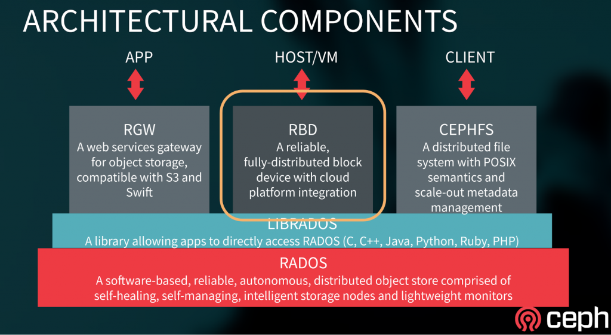
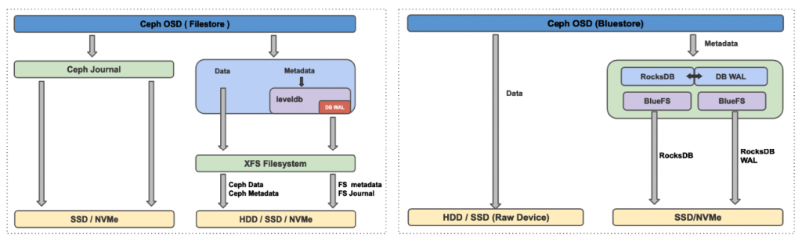
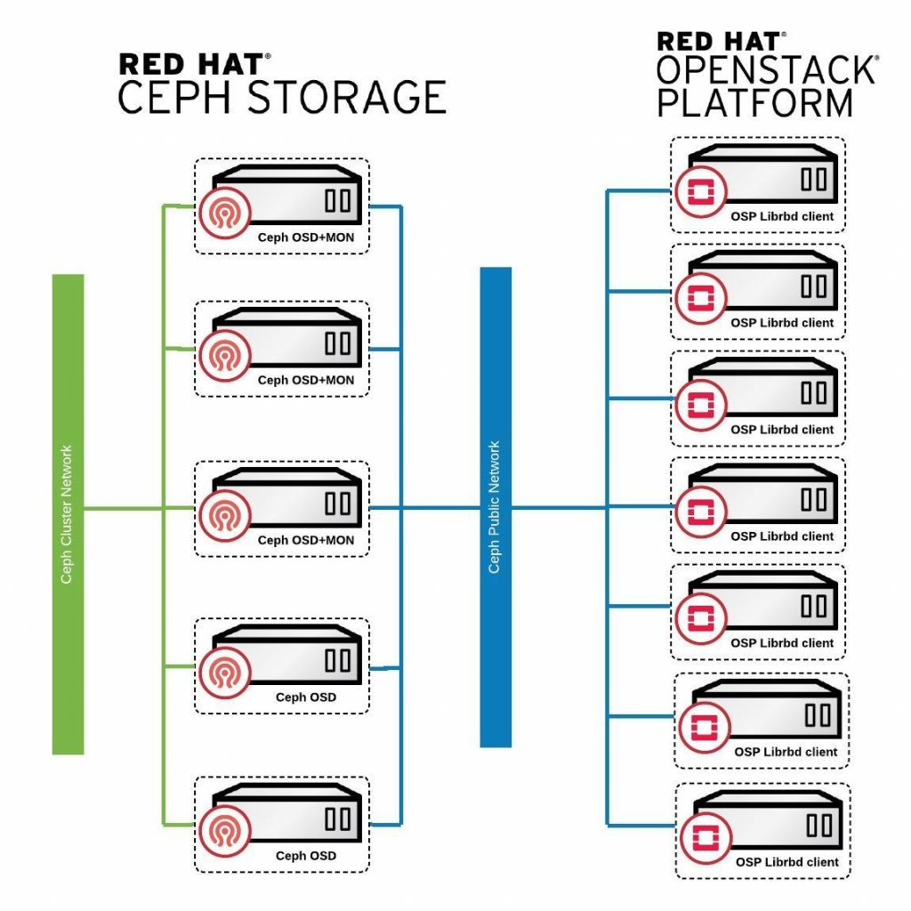

## Acknowledgments

We would like to thank BBVA,   Cisco and Intel for providing the cutting edge hardware used to run a Red Hat Ceph Storage 3.2 All-flash performance POC. The tests and results provided in this blog series is a joint effort of the partnership formed by  BBVA, Intel , Cisco and Red Hat. All partners have worked together to produce a performance baseline for a Software Defined Storage Building Block based on Red Hat Ceph Storage with Cisco and Intel Hardware technology.

## Executive Summary

- Tuning Ceph configuration for all-flash cluster resulted in material performance improvements compared to default (out-of-the-box) configuration. As such delivering up to 134% higher IOPS, ~70% lower average latency and ~90% lower tail latency on an all-flash cluster.

## RHCS on All-Flash: Introduction

All-flash storage systems offer several benefits to businesses. This includes high performance in terms of both high throughput and lower latencies, low TCO with reduced power and cooling consumption over traditional hard drive based storage systems. The global digital transformation requires modernization of enterprise IT infrastructure to improve performance, responsiveness, and resiliency to almost all critical business applications. With the proliferation of complex application stacks, databases and a new breed of workloads, storage (data) have become the nervous system of today's businesses. The only way to achieve storage nirvana is to use Software-defined, scale-out storage technology which is built for Exascale.

Red Hat Ceph Storage(RHCS) is an open source, massively scalable, [software-defined storage](https://www.redhat.com/en/topics/data-storage/software-defined-storage) that has all the resilience, durability and reliability needed for enterprise storage workloads. With the advancement in NAND technology flash media for storage are becoming more affordable. RHCS takes the center stage and being able to deliver millions of IOPS at low latency catering customers most demanding and storage intensive workload needs.

High performance and latency sensitive workloads often consume storage via the block device interface. Ceph delivers block storage to clients with the help of RBD, a librbd library which is a thin layer that sits on top of rados (Figure-1) taking advantage of all the features rados has to offer. RBD block devices are highly distributed in nature as it stripes a block device image over multiple objects in the Red Hat Ceph Storage cluster, where each object gets mapped to a placement group and distributed, and the placement groups are spread across separate Ceph OSDs throughout the cluster, this greatly enhances the parallelism when accessing data from and RBD volume.

Figure 1: RHCS Architecture Components

RHCS block devices are thin-provisioned, resizable and store data striped over multiple OSDs in a Ceph cluster. RHCS block devices leverage RADOS capabilities such as self healing, replication, and consistency.

Ceph is an OpenSource project with a thriving community, over the last few releases there has been a significant effort on performance optimization for all-flash clusters, some of these enhancements are:

- The introduction of BlueStore as new storage backed for OSD. Starting RHCS 3.2, BlueStore feature is GA. BlueStore provides massive performance gains over the old FileStore backend by simplifying the IO datapath and avoiding double write penalties.
- Reducing CPU usage. Together with BlueStore numerous other performance improvements in Core Ceph helped reduce OSD CPU consumption, especially for flash media OSDs.

## BlueStore Introduction

BlueStore is a new backend object store for the Ceph OSD daemons. The original object store, FileStore, requires a file system on top of raw block devices. Objects are then written to the file system. Unlike the original FileStore back end, BlueStore stores object directly on the block devices without any file system interface, which improves the performance of the cluster. To learn more about BlueStore follow Red Hat Ceph [documentation](https://access.redhat.com/documentation/en-us/red_hat_ceph_storage/3/html/administration_guide/osd-bluestore).

## BlueStore Under the Covers

Figure-2 shows how BlueStore interacts with a block device. Data is directly written to the raw block device and all metadata operations are managed by RocksDB. The device containing the OSD is divided between RocksDB metadata and the actual user data stored in the cluster.  User data objects are stored as blobs directly on the raw block device, once the data has been written to the block device, RocksDB metadata gets updated with the required details about the new data blobs.

RocksDB is an embedded high-performance key-value store that excels with flash-storage, RocksDB can’t directly write to the raw disk device, it needs and underlying filesystem to store it’s persistent data, this is where BlueFS comes in, BlueFS is a Filesystem developed with the minimal feature set needed by RocksDB to store its sst files.

RocksDB uses WAL as a transaction log on persistent storage, unlike Filestore where all the writes went first to the journal, in bluestore we have two different datapaths for writes, one were data is written directly to the block device and the other were we use deferred writes, with deferred writes data gets written to the WAL device and later asynchronously flushed to disk.

Bluestore has a number of possible storage layout configurations:

- The main device that stores the object data.
- An optional RocksDB device that  stores the metadata
- An optional WAL device that stores the transaction logs.

For example in our test environment, we configured the main device on the Intel P4500 drive , this is where the user data will be stored. We then configured the WAL and RocksDB devices on a faster Intel Optane P4800 drive, having WAL and RocksDB on a high performing drive will give us more IOPS with lower latency.

A new feature of BlueStore is that it enables compression of data at the lowest level, if compression is enabled data blobs allocated on the raw device will be compressed. This means that any data written into RH Ceph Storage, no matter the client used(rbd,rados, etc), can benefit from this feature.

An additional benefit of BlueStore is that it stores data and meta-data in the cluster with checksums for increased integrity. Whenever data is read from persistent storage its checksum is verified

Figure 2 : BlueStore vs Filestore comparison

## Lab Environment Details

The test lab consists of 5 x RHCS all-flash (NVMe) servers and 7 x client nodes, the detailed hardware, and software configurations are shown in table 1 and 2 respectively.

<table class="wp-block-table"><tbody><tr><td><b>5 x RHCS OSD Node Configuration</b></td></tr><tr><td>Chassis</td><td>Cisco UCS C220-M5SN Rack Server</td></tr><tr><td>CPU</td><td>2 x Intel® Xeon® Platinum 8180 28 core (56 HT cores) @ 2.50 GHz</td></tr><tr><td>Memory</td><td>196 GB</td></tr><tr><td>NIC</td><td>Cisco UCS VIC 1387 2 port x 40Gb</td></tr><tr><td>Storage</td><td>Ceph Data: 7x Intel® SSD DC P4500 4.0 TB
&nbsp;

Ceph Metadata (RocksDB/WAL) : 1x Intel® Optane™ SSD DC P4800X 375 GB

Ceph Pool Placement Groups : 4096
</td></tr><tr><td>Software Configuration</td><td>RHEL 7.6, Linux Kernel 3.10, RHCS 3.2 (12.2.8-52)</td></tr></tbody></table>

######   _Table 1 : Ceph Nodes Configuration_

<table class="wp-block-table"><tbody><tr><td><b>7 x Client Hardware Configuration</b></td></tr><tr><td>Chassis</td><td>Cisco UCS B200 M4 Blade servers</td></tr><tr><td>CPU</td><td>2x Intel® Xeon® CPU E5-2640 v4 @ 2.40GHz</td></tr><tr><td>Memory</td><td>528 GB</td></tr><tr><td>NIC</td><td>Cisco UCS VIC 1387 2 port x 10Gb</td></tr><tr><td>Software Configuration</td><td>RHOSP 10, RHEL 7.6, Linux Kernel 3.10, Pbench-FIO 3.3</td></tr></tbody></table>

###### _Table 2 :  Client Nodes Configuration_

Starting RHCS 3.2 Containerized Storage Daemons (CSD) deployment strategy is supported and the same has been used this benchmarking exercise. Unlike spinning media where one OSD per media device is recommended, each NVMe device used in this testing was configured to be used by two Ceph OSD, to get maximum performance from the NVMe device.

Figure 3 : Lab environment topology

For a highly performant and fault tolerant storage cluster, the network architecture is as important as the nodes running the Monitors and OSD Daemons. So the deployed network architecture must have the capacity to handle the expected number of clients bandwidth. As shown in figure-3 two physical networks are used:

- The public network is used by Ceph clients to read and write on to Ceph OSD nodes.
- The cluster network enables each Ceph OSD Daemon to check the heartbeat of other Ceph OSD Daemons, send status reports to monitors, replicate objects, rebalance the cluster and backfill and recover when system components fail.

The lab environment was deployed with an ACI leaf and spine topology and both the public network and the cluster network are configured to use jumbo frames with the MTU size of 9000.

The network bandwidth from the OSP clients was limited by the Fiber Interconnect uplink, as such we had only had 80gbit/s available, so the maximum throughput from the clients to the ceph clusters was ~10GBytes/s.

Figure 4 : Lab environment network topology

Containerized deployment of Ceph daemons gives us the flexibility to co-locate multiple Ceph services on a single node. This eliminates the need for dedicated storage nodes and helps to reduce TCO. As such first 3 nodes were used to co-located Ceph MON, Ceph MGR and Ceph OSDs services, the remaining two nodes were dedicated for Ceph OSD usage. Table-3 details the per container resource limit configured for different Ceph daemons.

For each RHCS node we have 2 x 28 physical cores, with Hyper Threading this gives us a total of 112 vCPUs, we divided the number of vCPUs between the RHCS services as well as reserving a few for the OS. As such, we allocated 8 vCPUs to the OS and 3 vCPUs each for Ceph Monitor and Manager containers. For each Ceph OSD container we set the limit of 7 vCPUs. Since we had 7 NVMe devices per node,  in order to fully utilize the NVMe device, each device was configured (partitioned) to host 2 Ceph OSDs. So the final calculation looks like 7 vCPUs/OSD \* 7 NVMe devices \* 2 OSDs per device = 98 vCPUs were allocated to Ceph OSDs per node. If we add 3 vCPUs for MON, 3 vCPUs for MGR and 8 vCPUs for the OS we reached 112 vCPUs i.e reaching full subscription of the physical CPUs.

<table class="wp-block-table"><tbody><tr><td>&nbsp;</td><td><b>OS</b></td><td><b>Per OSD Container</b></td><td><b>Per MON Container</b></td><td><b>Per MGR Container</b></td></tr><tr><td><b>vCPUs (HT Core)</b></td><td><b>8</b></td><td><b>7</b></td><td><b>3</b></td><td><b>3</b></td></tr><tr><td><b>Memory (GB)</b></td><td><b>12</b></td><td><b>12</b></td><td><b>6</b></td><td><b>6</b></td></tr></tbody></table>

_Table 3 : Ceph Container resource allocatio_n

## Benchmarking Methodology

FIO the industry standard tool for synthetic benchmarking was used to exercise Ceph block storage. It provides a _librbd_ module to run tests against RBD volumes.  We have used different number of volumes per client node depending on what we wanted to achieve in each test, we have mainly used these two combinations:

- 7 x clients each with 12 x 200GB Ceph RBD(84 volumes)
- 7 x clients each with 15 x 200GB Ceph RBD(105 volumes)

Initially we started using 12 x Ceph RBD volumes for each client,  however for certain tests we were not able to stress the storage sub-system to its peak using 12 volumes, so in some tests we increased  the number of volumes to 15 per client, which resulted in squeezing more performance. When using 15 volumes per client we used a total of 21TB of provisioned capacity on a 2x replicated pool (42TB of raw capacity).

The FIO librbd IOengine allows fio to test block storage performance of Ceph RBD volumes without KVM/QEMU configuration, through the userland librbd libraries. These libraries are the same ones used by the, QEMU backend, so it allows a approximation to KVM/QEMU performance , if we multiply  7 clients by 15 RBD volumes, we are creating a client workload similar to 105 OSP instances using one RBD volume each. The FIO template file used is available [here](https://gist.github.com/likid0/4938547c54a9757a16ad361f03aec129).

Before running the tests the RBD volumes where preconditioned with a sequential write to the full size of the volume, eliminating the Ceph thin-provision mechanism’s impact to generate stable and reproducible results. Before each test, .OS cache was dropped from all OSD and client nodes Each test was run four times with 900 seconds of runtime and 180 seconds of ramp-up time. The average results of those four runs were reported in this study.

## Performance Comparison : Default BlueStore vs. Tuned BlueStore

RHCS with BlueStore OSD backend out-of-the-box performs great for large block workloads, however for small blocks, the default OSD configurations were found to be conservative. As such we tuned RHCS cluster to optimize small block performance, for reference the ceph.conf file used is available [here](https://gist.github.com/likid0/1b52631ff5d0d649a22a3f30106ccea7).

Below are some of the most relevant tunings applied to Ceph OSDs.

- The RocksDB key-value store used for BlueStore metadata plays an important role in write performance of the OSD. The following RocksDB tunings were applied to minimize the write amplification due to DB compaction.

<table class="wp-block-table"><tbody><tr><td>bluestore_rocksdb_options = compression=kNoCompression,max_write_buffer_number=32,min_write_buffer_number_to_merge=2,recycle_log_file_num=32,compaction_style=kCompactionStyleLevel,write_buffer_size=67108864,target_file_size_base=67108864,max_background_compactions=31,level0_file_num_compaction_trigger=8,level0_slowdown_writes_trigger=32,level0_stop_writes_trigger=64,max_bytes_for_level_base=536870912,compaction_threads=32,max_bytes_for_level_multiplier=8,flusher_threads=8,compaction_readahead_size=2MB</td></tr></tbody></table>

- RHCS 3.2 introduces bluestore cache autotuning feature. This works great with most workloads, as such we recommend to use it, however we found out during the tests that we achieved better results disabling the cache autotuning and manually configuring the BlueStore cache options.

<table class="wp-block-table"><tbody><tr><td>bluestore_cache_autotune = 0</td></tr></tbody></table>

- In random small-block workloads, it is important to keep as many BlueStore metadata(Onodes) cached as possible. If there is adequate memory on the OSD node, incrementing the size of the bluestore cache can increase the performance, in our case we use 8GB for bluestore cache out of the 12Gb available. The default _bluestore\_cache\_size\_ssd_ is 4GB

<table class="wp-block-table"><tbody><tr><td>bluestore_cache_size_ssd = 8G</td></tr></tbody></table>

- When _bluestore\_cache\_autotune_ is disabled and _bluestore\_cache\_size\_ssd_ parameter is set, BlueStore cache gets subdivided into 3 different caches:

1. **cache\_meta**: used for BlueStore Onode and associated data.
2. **cache\_kv**: used for RocksDB block cache including indexes/bloom-filters
3. **data cache**: used for BlueStore cache for data buffers.

- The amount of space that goes to each cache is configurable using ratios, for RBD workloads we increased the _bluestore\_cache\_meta\_ratio_ so we would get a bigger size of the cache dedicated to the  BlueStore Onode cache, during the tests the best results were achieved using the following ratios:

<table class="wp-block-table"><tbody><tr><td>bluestore_cache_autotune = 0
&nbsp;

bluestore_cache_kv_ratio = 0.2

bluestore_cache_meta_ratio = 0.8
</td></tr></tbody></table>

- When RHCS starts a recovery process for a failed OSD it uses a log-based recovery, small block writes generate a long list of changes that have to be written to the PG log this increases the write amplification and affects performance. During the tests we observed that reducing the number of PG logs stored, enhanced the performance. However there is a drawback associated with these settings, almost all recovery processes will use backfill, when using backfill we have to incrementally move through the entire PG's hash space and compare the source PG’s with the destination PG’s, incrementing the recovery time.
- We have observed during the testing that reducing the number of pg logs reduced the write amplification. As such the following PG log tunings were applied.

<table class="wp-block-table"><tbody><tr><td>osd_min_pg_log_entries = 10
&nbsp;

osd_max_pg_log_entries = 10

osd_pg_log_dups_tracked = 10

osd_pg_log_trim_min = 10
</td></tr></tbody></table>

- A Customized Red Hat Enterprise Linux 7.6 throughput-performance [tuned profile](https://gist.github.com/likid0/ad90009a6f7ee8729375a24ac0b28858) was applied on all Ceph nodes.

As reflected in graph-1, tuning BlueStore resulted in higher IOPS and lower average and tail latencies compared to default BlueStore configuration. As such compared to the default configuration, BlueStore after tuning showed

<table class="wp-block-table"><tbody><tr><td><b>Ceph</b><b> BlueStore Tuned Configuratio</b><b>n</b></td></tr><tr><td><b>Workload</b></td><td><b>IOPS</b></td><td><b>Average Latency</b></td><td><b>Tail Latency</b></td></tr><tr><td><b>Random Read</b></td><td><b>43% Higher</b></td><td><b>30% Lower</b></td><td><b>36% Lower</b></td></tr><tr><td><b>Random Read Write</b></td><td><b>132% Higher</b></td><td><b>73% Lower</b></td><td><b>90% Lower</b></td></tr><tr><td><b>Random Write</b></td><td><b>134% Higher</b></td><td><b>70% Lower</b></td><td><b>91% Lower</b></td></tr></tbody></table>

Graph 1 : RHCS 3.2 Default vs. Tuned Configuration

## Up Next

Continuing the benchmarking blog series, in the [next section](https://ceph.com/community/ceph-block-storage-performance-on-all-flash-cluster-with-bluestore-backend/), you will learn performance insights of small, medium and large block size workloads running on RHCS 3.2 BlueStore all-flash cluster.

This post was originally written by Karan Singh and Daniel Parkes.
