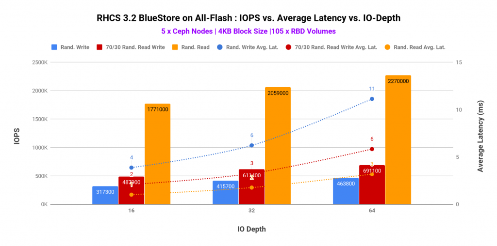
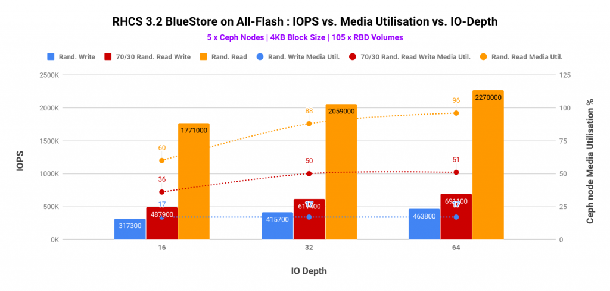
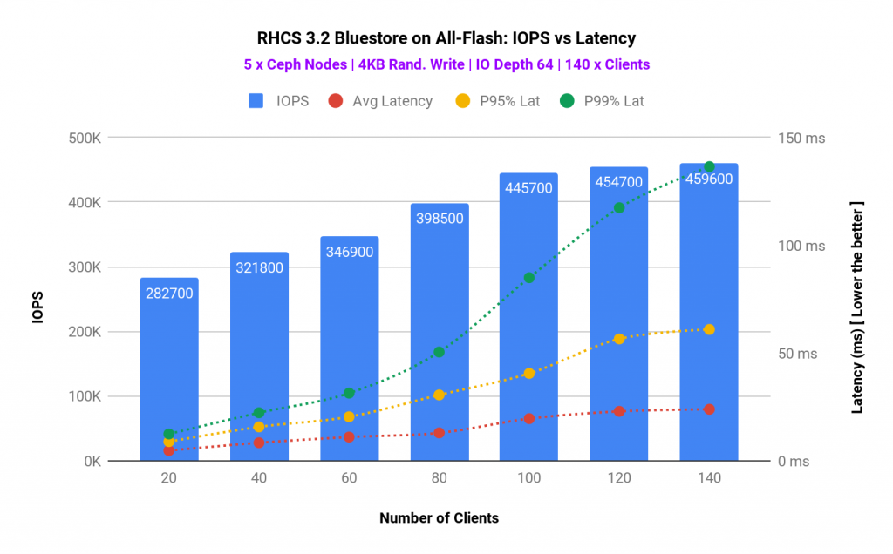
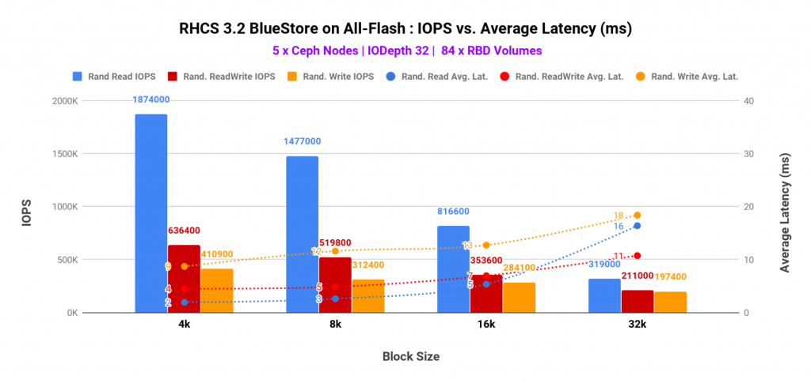
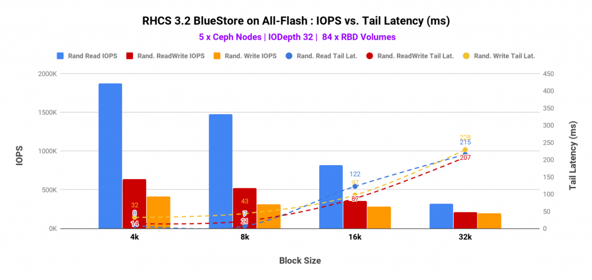
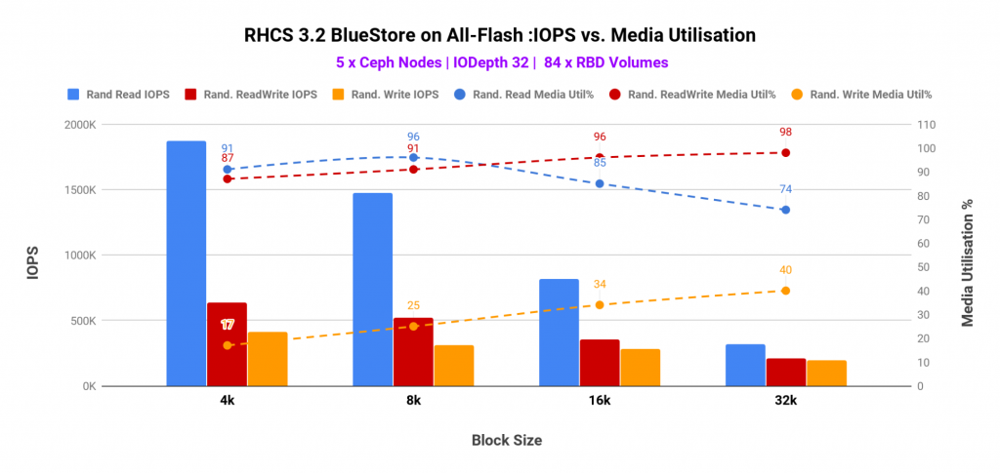
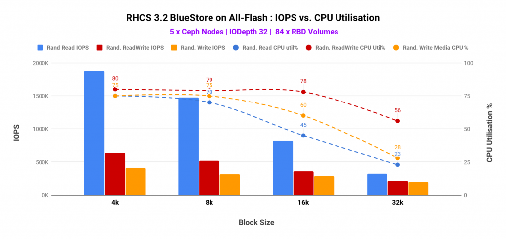
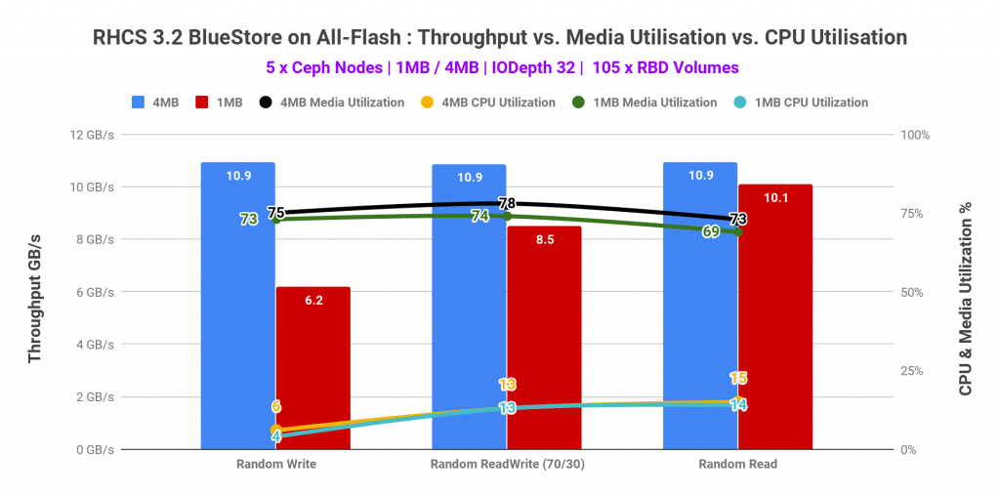

## Introduction  

Recap: In [Blog Episode-1](https://ceph.com/community/bluestore-default-vs-tuned-performance-comparison/) we have covered RHCS, BlueStore introduction, lab hardware details, benchmarking methodology and performance comparison between Default Ceph configuration vs Tuned Ceph configuration

This is the second episode of the performance blog series on RHCS 3.2 BlueStore running on the all-flash cluster. There is no rule of thumb to categorize block sizes into a small, medium and large category. As such we have designated 4K to small block size category, 8K-64K to medium and 1M-4M into large block size category. In this episode you will learn about performance characterization of Ceph block storage for small (4K), medium (8K-32K) and large (1M-4M) block sizes across random read, random write and random read-write workload patterns.    

## Executive Summary  

- Small block 4K workload, delivered up to 2.2 Million random reads, 691K random read-write(70/30) and 463K random write IOPS until limited by CPU and media contention.
- Similar to small block workload, medium block performance was found to be limited by CPU and media contention.
- Large block 4M workload peak performance recorded at 10.9 GB/s for all three test patterns i.e. random read, write and read-write (70/30) mix until limited by the Client network bandwidth.

## Part-1: Small Block Size (4KB) Performance  

### Key Takeaways  

- Random Read workload showed **2.2 Million IOPS@3ms average latency** until bottlenecked by media saturation.
- Random Read-Write (70/30) mix workload showed **691K IOPS@6ms average latency** until bottlenecked by Ceph node CPU resource contention.
- Random Write: **463K IOPS@11ms average latency** until bottlenecked by Ceph node CPU resource contention.

### Summary  

In this part of the testing, Ceph block storage interface was exercised with small block size (4KB) workload across random read, random write, and random read-write (70/30) mix patterns. The key metrics captured during the testing includes IOPS, average, latency, Ceph node CPU and media utilization.     

Graph-1 shows top-line performance for 4K block size across different access patterns with 5 all-flash nodes. As such the maximum performance was found to be  

- **Random Read:** **2.2 Million IOPS@ 3ms average latency**
- **Random Read-Write (70/30) Mix:** **691K IOPS @6ms average latency**
- **Random Write:** **463K IOPS@11ms average latency**

Graph 1

_h_The CPU and media utilization captured in graph-2 and graph-3 helped us understand the bottlenecks for different workload patterns.    

- The random read performance was found to be bottlenecked by CPU resource contention, however, the media utilization was also found to be at the higher side. As such have we added additional Ceph nodes (CPU and media) the random read performance could have scaled higher.
- For both random write and random read-write (70/30) mix, the performance was bottlenecked by higher CPU consumption. Interestingly at the same time media had enough spare throughput which remained unused because of the lack of computational power. As such, higher CPU core allocation to Ceph OSDs could have delivered higher performance for random write & random read-write mix workloads.

The OSD data device (P4500 NVMe) utilization stayed under 50% utilization, the Intel Optane P4800 device which was hosting BlueStore WAL and Rocksdb metadata were found to be very busy@90%. The _bluestore\_min\_alloc\_size\_ssd_ parameter was set to 16KB, hence all the writes under 16KB were deferred, the write first goes into the WAL device and then asynchronously gets written to the OSD data, hence the Optane P4800 device had absorbed the writes for all the OSDs on the host. Despite the high utilization on the RocksDB/WAL device, we have not seen any signs of contention on the P4500 OSD data device. But based on this experience we wouldn’t recommend putting more than 7 x P4500 NVMe devices behind a single Intel Optane P4800 for WAL/RocksDB.  

Graph 2

_Graph 2_

Graph 3

_Graph 3_  

Another interesting test we ran was client sweep test, where we have linearly scaled-up the number of clients starting 20 and up to 140. As we increased the client load, we observed linear performance improvement until we hit CPU congestion on Ceph OSD. With 100 clients we have observed ~445K  aggregated 4K write IOPS. After this point system resources congestion resulted in high tail latencies. Intel Optane used as metadata helped to absorb latency spike with a high number of parallel clients, as such average latency stayed under 40ms.  

Graph 4

_G_

## Part-2: Medium Block Size Performance  

### Key Takeaways  

- Until the performance was bottlenecked by CPU and media saturation, 5 all-flash Ceph nodes delivered ~1.8 Million random reads, ~636K random readwrite (70/30) and ~410K random write IOPS.
- To scale the performance, additional Ceph OSD nodes had to be added in the existing Ceph cluster.

### Summary  

In the following graphs, we have tried to represent various different data points such as IOPS, average latency, tail latency, Ceph node CPU and media utilization. And all of these across a range of block size i.e. from 4K up to 64K for random write, random read and random read-write (70/30) mix.  

A few interesting data points include

- As expected, small block sizes showed highest IOPS and lower average and tail latencies, compared to medium block sizes. As such we observed ~1.8 Million, ~636K, ~410K IOPS for Random Read, Random ReadWrite Mix and Random write workload respectively.
- High utilization was observed on CPU and media devices on Ceph OSD nodes. The utilization was found to be as high as ~90% and ~80% respectively for CPU and media respectively.  As such the performance could have increased have we added Ceph OSD nodes to the existing Ceph cluster.

Graph 5

Graph 6

Graph 7

_G_

Graph 8

## Part-3: Large Block Size Performance  

### Key Takeaways  

- Large block 4M performance peaked at 10.9 GB/s for random read, write and read-write (70/30) mix.
- Client network was found to be the limiting factor and causing a performance bottleneck.
- The performance could have been higher, have we had either more client nodes or bigger network pipes.  

### Summary  

All the different patterns that we have tested i.e. random read, write and read-write (70/30) mix for large block size 4M workload topped at 10.9 GB/s aggregated throughput. Client network was found to be the limiting factor causing the performance bottleneck. Other than network the second most utilized resource was media, however, it had enough headroom available to deliver more performance, if the network was not the bottleneck.

Graph 9

_G_  

### Up Next  

Continuing the benchmarking blog series, in the [next section](https://ceph.com/community/part-3-rhcs-bluestore-performance-scalability-3-vs-5-nodes/), will explain the results associated with RHCS 3.2 scalability testing. Answering some key questions like “_how does performance change by going from 3 node cluster to 5 nodes_”. Stay Tuned.
