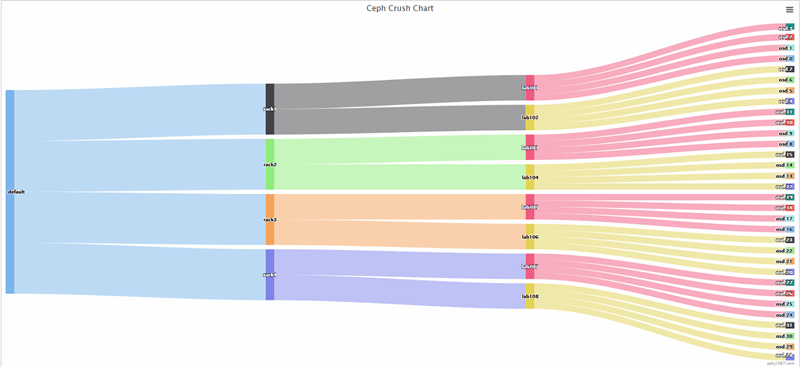
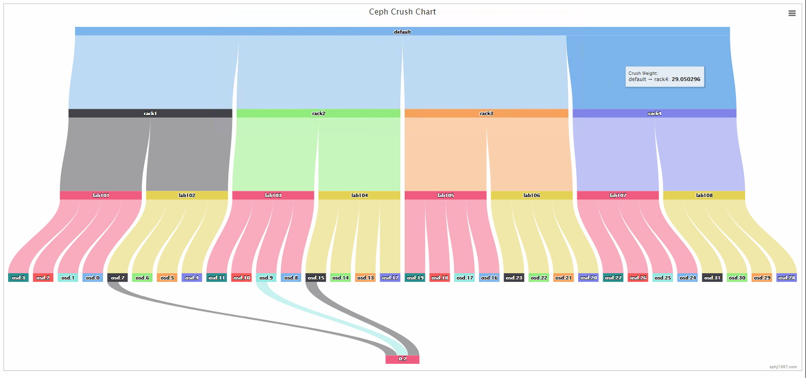

  
  

## 前言

本篇的内容实际上是另外一篇文章的字篇章，在另外一篇文章当中，将会对crush的分布的调整的做一次总结，用比较简单的方式来展示各种crush的区别

在做这个工作过程中，为了更好的能展示出效果，就有了下面的这个小工具的出现  

## 工具来源

假如我现在想查看一个存储池内的pg的分布，那么我们需要下面的几个步骤

#### 1、随机获取一个pg的id

<table><tbody><tr><td class="code"><pre>[root@lab101 ~]# ceph pg dump|grep ^0 </pre></td></tr></tbody></table>

后面的是存储池的编号  
从输出中拿到0.196开头的这个pg  

<table><tbody><tr><td class="code"><pre>0.196	0	0	0	0	0	0	0	0	active+clean	2019-03-07 18:03:28.262747	0'0	259:24	[2,30,21]	2	[2,30,21]	0'0	2019-03-06 17:30:29.598534	0'0	2019-03-06 17:30:29.598534 </pre></td></tr></tbody></table>

得到三个osd的id的值，2,30,21

#### 2、获取ceph osd tree拿到osd的分布

<table><tbody><tr><td class="code"><pre>[root@lab101 ~]# ceph osd tree </pre></td></tr></tbody></table>

的到一个大概这样的图，拿到

> osd.2在host lab101上在rack1中，在default下  
> osd.30在host lab108上在rack4中，在default下  
> osd.21在host lab106上在rack3中，在default下

可以看到这个pg是分布在三个rack下的，如果我们需要去看其他的pg的，那么就需要继续重复上面的动作了，这个没什么大的问题，但是为了更好更快的去获取分布，看下我做的小工具的效果

## 查询分布的小工具的效果

### 横着看的

### 竖着看的

### 再来一个

是不是看到虽然分了rack，但是这个时候的rule还是沿用最开始做的主机host的，可以清楚的看到0.2这个pg分布到了rack2下面去了

这个工具会在后面的做crush的调整后用到，可以清楚的看到pg的路径关系

## 变更记录

| Why | Who | When |
| --- | --- | --- |
| 创建 | 武汉-运维-磨渣 | 2019-3-8 |

Source: zphj1987@gmail ([ceph的pg的分布的快速查看](http://www.zphj1987.com/2019/03/08/ceph-pg-crush-fast-check/))
