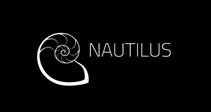

### Announcements

#### Nautilus Shirts are now available:

March 19 we announced the new release of Ceph Nautilus! Take a look at our [blog post](https://ceph.com/releases/v14-2-0-nautilus-released/) that captures the major features and upgrade notes. [Watch the talk](https://youtu.be/MVJ2eFMBVSI) from Sage Weil, co-creator and project leader, on the state of the cephalopod. We're now pleased to announce the availability of official Ceph Nautilus shirts on the [Ceph store](http://bit.ly/ceph-store)!

#### Cephalocon Videos Now Available

Thank you to our sponsors, speakers and the Linux Foundation for making this event possible. Videos from the event are now [available](https://www.youtube.com/playlist?list=PLrBUGiINAakNCnQUosh63LpHbf84vegNu)!

#### Ceph Docubetter Meeting

The [Ceph Docubetter Weekly](https://pad.ceph.com/p/Ceph_Documentation) meets on the second and fourth Wednesday of each month. The meeting aims to bring focus around improvement of Ceph documentation and the tools that generate them. Our next meeting will be on June 12 at 16:30 UTC. Come join us!

### Project updates

#### Rados

- Improvements to scrub auto repair - enables automatic PG repairs when errors are found in scrub or deep-scrub, also works for replicated pools now. [https://github.com/ceph/ceph/pull/26942](https://github.com/ceph/ceph/pull/26942)

- ok-to-stop (add-offline,rm) commands added for mons

- Ability to set no{out,in,up,down} on crush nodes, not just OSDs or cluster-wide

- Removed SimpleMessenger (for octopus)

- Cleanup of pre-nautilus internal authentication APIs

- Telemetry fixes and improvements (backported to nautilus)

- PG autoscaling fixes (backported to nautilus)

- Default erasure code profile is now k=2 m=2 (instead of k=2 m=1)

- new log\_to\_file (true/false) option to enable/disable file logging without changing path

#### RBD

- Online resparsify of images

- improved in-memory cache

- optionally move clone parent images to trash on removal of last clone

- kernel rbd: keep flatten

#### Dashboard

- The team is currently busy working on fixing bugs and sanding off rough edges in the dashboard and backporting them to the Nautilus branch

- Translations are about to be refreshed, as many additional languages have been completed (a big thanks to all of the translators that contributed to this effort)

- Blog posts:

- New in Nautilus: ceph-iscsi Improvements — [https://ceph.com/community/new-in-nautilus-ceph-iscsi-improvements/](https://ceph.com/community/new-in-nautilus-ceph-iscsi-improvements/)

- New in Nautilus: New Dashboard Functionality — [https://ceph.com/community/new-in-nautilus-new-dashboard-functionality/](https://ceph.com/community/new-in-nautilus-new-dashboard-functionality/)

#### Rook

- Rook 1.0 is out! [https://blog.rook.io/rook-v1-0-a-major-milestone-689ca4c75508](https://blog.rook.io/rook-v1-0-a-major-milestone-689ca4c75508)

#### Orchestrator

- Looked into CI enhancements

- Deepsea orchestrator will add support to manage NFS and iSCSI form the Dashboard.

- Work on changing the log-in mechanism of the ansible-runner-service

- the Rook orchestrator saw some bug fixes.

### Releases

- [Nautilus v14.2.1](https://ceph.com/releases/v14-2-1-nautilus-released/)

### Ceph Planet

- [The Ceph monitoring challenge: Prometheus, Grafana, and Ansible rise to the task](https://ceph.com/planet/the-ceph-monitoring-challenge-prometheus-grafana-and-ansible-rise-to-the-task/)
- [Open Infrastructure Summit Denver: Rook 101](https://ceph.com/planet/open-infrastructure-summit-denver-rook-101/)

### Project meetings

#### Ceph Developers Monthly

- [Ceph Developers Monthly (April 2019)](https://youtu.be/j1prn3dyxls)

#### [Ceph Performance Weekly](https://ceph.com/performance-2/)

- [April 11](https://www.youtube.com/watch?v=1vnXK85oPaU&list=PLrBUGiINAakN2qXjxSgfmIwCCLqgiyBqw&index=6&t=0s)
- [April 18](https://www.youtube.com/watch?v=27E0LWnzzC4&list=PLrBUGiINAakN2qXjxSgfmIwCCLqgiyBqw&index=3&t=0s)
- [April 25](https://www.youtube.com/watch?v=LqdSeNHfQEM&list=PLrBUGiINAakN2qXjxSgfmIwCCLqgiyBqw&index=2&t=0s)
- [Full playlist](https://www.youtube.com/playlist?list=PLrBUGiINAakN2qXjxSgfmIwCCLqgiyBqw)

#### Ceph Testing Weekly

- [April 3](https://www.youtube.com/watch?v=W-IjDwTG9LU&list=PLrBUGiINAakMV7gKMQjFvcWL3PeY0y0lq&index=19&t=0s)
- [April 17](https://www.youtube.com/watch?v=QBVHMxdYneA&list=PLrBUGiINAakMV7gKMQjFvcWL3PeY0y0lq&index=22&t=0s)
- [Full playlist](https://www.youtube.com/playlist?list=PLrBUGiINAakMV7gKMQjFvcWL3PeY0y0lq)

#### Ceph Orchestration

- [April 1](https://www.youtube.com/watch?v=tNG-Qec7kGU&list=PLrBUGiINAakMAVH7XC1FyE22rjUB4IWYZ&index=5&t=0s)
- [April 9](https://www.youtube.com/watch?v=b0iIOhU8eN0&list=PLrBUGiINAakMAVH7XC1FyE22rjUB4IWYZ&index=4&t=0s)
- [April 15](https://www.youtube.com/watch?v=VFup1D42hB8&list=PLrBUGiINAakMAVH7XC1FyE22rjUB4IWYZ&index=9&t=0s)
- [April 22](https://www.youtube.com/watch?v=-sgJeEUPkbs&list=PLrBUGiINAakMAVH7XC1FyE22rjUB4IWYZ&index=12&t=0s)
- [April 29](https://www.youtube.com/watch?v=FemJfRsDOsw&list=PLrBUGiINAakMAVH7XC1FyE22rjUB4IWYZ&index=13&t=0s)

### Recent events we were at

#### Cephalocon Barcelona

Our recent big Ceph event! We enjoyed hearing user stories, presentations from members of the community. [Watch over 70 videos now](https://www.youtube.com/playlist?list=PLrBUGiINAakNCnQUosh63LpHbf84vegNu)!

- [Open Infrastructure summit](https://www.openstack.org/summit/denver-2019/) - Denver April 29 - May 4th
- [Pycon US Cleveland](https://us.pycon.org/2019/) - May 1-9th 2019
- [Red Hat Summit](https://www.redhat.com/en/summit/2019) - May 6-9th
- [Cephalocon Barcelona](https://ceph.com/cephalocon/barcelona-2019/) - May 19-20th
- [KubeCon Barcelona](https://events.linuxfoundation.org/events/kubecon-cloudnativecon-europe-2019/) - 20-23rd

### Upcoming conferences

Please coordinate your Ceph CFP's with the community on our [CFP coordination pad](https://pad.ceph.com/p/cfp-coordination).

- [Ceph Day Netherlands](https://ceph.com/cephdays/netherlands-2019/) - July 2nd
- [Ceph Day CERN](https://ceph.com/cephdays/ceph-day-cern-2019/) - September 16th
- [Ceph Day London](https://ceph.com/cephdays/ceph-day-london/) - October 24th
