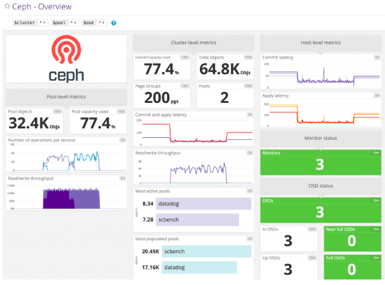
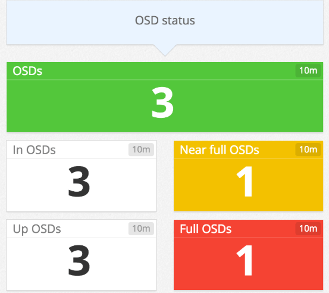
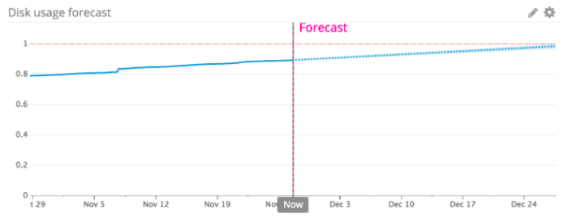
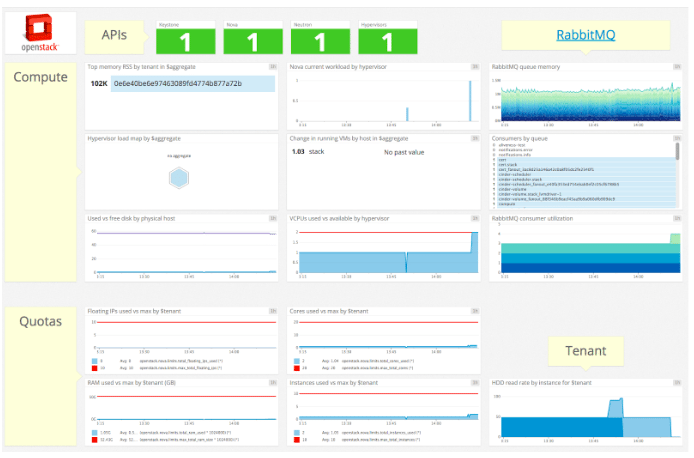
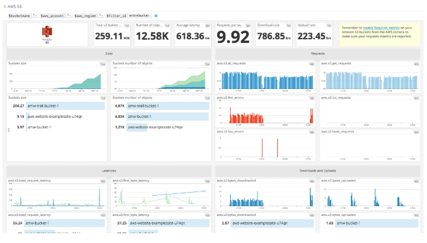
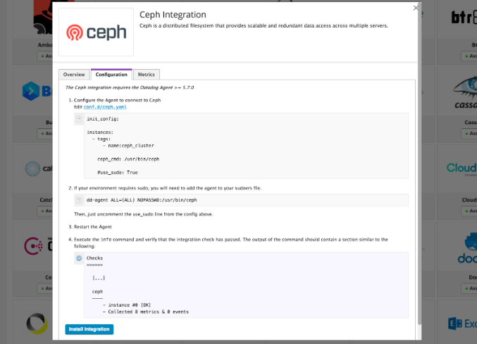

_a SAAS solution to monitor your Ceph storage infrastructure_

With Ilan Rabinovitch (Datadog)

#  [](#monitoring-a-distributed-system_1) Monitoring a Distributed System

[Red Hat Ceph Storage](https://www.redhat.com/en/technologies/storage/ceph) is a highly scalable, fault-tolerant platform for object, block, and file storage that delivers tremendous data resiliency (we default to keeping three copies of a customer’s data at all times), with service availability capable of enduring the loss of a single drive, of a cluster node, or even of an entire rack of storage without users experiencing any interruption. Like its resiliency, Ceph’s ability to scale to an unprecedented degree is another outcome of its distributed architecture.

Distributed systems architectures break with the common assumptions made by most traditional monitoring tools in defining the health of an individual device or service. In a somewhat obvious example, [Nagios’](https://access.redhat.com/documentation/en-us/red_hat_ceph_storage/3/html/monitoring_ceph_for_red_hat_enterprise_linux_with_nagios/) Red/Green host (or drive) health status tracking becomes inadequate, as the loss of a drive either generates unnecessary alerts, or fails to highlight enough what is likely to be a more urgent condition, like the loss of a MON container. The system can withstand the loss of multiple drives or storage nodes without needing immediate action from an operator as long as free storage capacity remains available on other nodes. More urgent events like the loss of a MON bringing the cluster from HA+1 to HA status would however be mixed in with all the other “red” false-alarms and lost in all the noise.

Distributed systems need monitoring tools which are aware of their distributed nature to ensure that pagers go off only for alerts truly critical in nature. Most hardware failure reports naturally found in a large enough system are managed weekly or monthly as part of recurring maintenance activity. An under-marketed advantage of distributed systems is that the swapping of failed drives or the replacement of PSUs becomes a scheduled activity, not an emergency one.

Red Hat Ceph Storage’s [built-in monitoring tools](https://access.redhat.com/documentation/en-us/red_hat_ceph_storage/3/html-single/administration_guide/#accessing-the-red-hat-ceph-storage-dashboard-management) are designed to help you keep tabs on your clusters’ health, performance, and resource usage, and have no such distributed-systems awareness shortcomings. Red Hat has a long history of customer choice, and for that reason we include with RHCS documentation on how to use external monitoring tools — Nagios may be sub-optimal for the details, but it is still the closest thing we have to a standard in the Open Source Community’s fragmented monitoring space.

Datadog is much more interesting.

#  [](#monitoring-is-a-service_1) Monitoring is a Service

Unlike traditional monitoring solutions, Datadog’s software-as-a-service platform was built specifically for dynamic distributed systems like Red Hat Ceph Storage. Datadog automatically aggregates data from ephemeral infrastructure components, so you can maintain constant visibility even as your infrastructure scales up or down. And because Datadog is fully hosted, it self-updates with features that ensure that you only get alerted when it matters most. Field-tested machine learning algorithms distinguish between normal and abnormal trends, and you can configure alerts to trigger only on truly urgent occurrences (e.g., the loss of a Ceph Monitor rather than the loss of a single storage node). To enable data-driven collaboration and troubleshooting, Datadog automatically retains your monitoring data for more than a year and makes that data easily accessible from one central platform.

[Datadog](https://www.datadoghq.com/) provides an out-of-the-box integration with Red Hat Ceph Storage to help you get more real-time visibility into the health and performance of your clusters with near-zero setup delay. Datadog also delivers template integrations with more than 250 other technologies, including services that are commonly used with Ceph storage, like OpenStack and Amazon S3, so you can get more comprehensive insights into every layer of your stack in one place.

We will explore a few ways you can use Datadog to monitor Red Hat Ceph Storage in full context with the rest of your stack. Then we’ll explain how to set up Datadog to start getting clearer insights into your Ceph deployment in three easy steps.

#  [](#key-ceph-metrics-at-a-glance_1) Key Ceph metrics at a glance

Datadog automatically collects metrics from your Red Hat Ceph Storage clusters, and makes it easy to explore, visualize, and alert on this data at the cluster, pool, and node level. The integration includes a template Ceph dashboard that displays an overview of health and performance data from your monitor and storage nodes. You can use the template variables at the top of the dashboard to filter metrics by individual clusters, pools, and Object Storage Daemons (OSDs) to get more granular insights.

[](https://svbtleusercontent.com/6owwA9DjDwHJ6m3Uapsenj0xspap.png)

Red Hat Ceph Storage includes robust features for high availability and performance, and by monitoring its built-in [health checks](http://docs.ceph.com/docs/mimic/rados/operations/health-checks/) you can help you ensure that everything is running smoothly.

Datadog automatically queries Ceph for the status of these health checks, along with other key information about your nodes, including:

- **Object Storage Daemon (OSD) status:** Quickly find out if an OSD is down, so that you can try restarting the node or [troubleshooting potential issues](https://access.redhat.com/documentation/en-us/red_hat_ceph_storage/3/html-single/troubleshooting_guide/#troubleshooting-osds) (e.g., networking, disk capacity). [](https://svbtleusercontent.com/i8WA8Hqs21m7JrRZYNciJy0xspap.png)
- **Monitor status:** If you’re running more than one monitor in your cluster (as [recommended for high availability](https://access.redhat.com/documentation/en-us/red_hat_ceph_storage/3/html-single/architecture_guide/#concept-arch-mon-cluster-arch)), Ceph requires a quorum of monitor nodes to reach a consensus about the latest version of the cluster map. Monitor nodes fall out of the quorum when they become unavailable, or when they fall behind and cannot access the latest version of the map. If your cluster cannot maintain a quorum, clients will not be able to read or write data from the cluster. With Datadog, you can track the number of available monitor nodes in your cluster, as well as the real-time quorum status (the number of monitors that are in the quorum). You can also set up an alert that notifies you if the number of monitors in the quorum decreases, so you can have enough time to [troubleshoot the issue](https://access.redhat.com/documentation/en-us/red_hat_ceph_storage/3/html-single/troubleshooting_guide/#troubleshooting-monitors), or deploy more nodes if needed.
- **Storage capacity:** Datadog’s Red Hat Ceph Storage integration reports OSD storage capacity metrics so that you can take action before any OSD runs out of disk space (at which point Ceph will stop writing data to the OSD to guard against data loss). You can set up an alert to detect when any OSD reaches a `NEARFULL` state (85 percent capacity, by default), which gives you enough time to add more OSDs, as recommended in the [documentation](https://access.redhat.com/documentation/en-us/red_hat_ceph_storage/3/html-single/troubleshooting_guide/#nearfull-osds). You can also use Datadog’s [forecasting algorithms](https://www.datadoghq.com/blog/forecasts-datadog/) to get notified a certain amount of time before any OSD, pool, or cluster is predicted to run out of disk space. [](https://svbtleusercontent.com/kyqiPMARNmJyVs5iSrQTi90xspap.png)

#  [](#increased-visibility-across-ceph-metrics_1) Increased visibility across Ceph metrics

Datadog’s integration also reports other metrics from Ceph, including the rate of I/O operations and commit latency. See the full list of metrics collected as part of this integration in our [documentation](https://docs.datadoghq.com/integrations/ceph/).

Although it’s important to monitor these metrics, they only provide part of the picture. In the next section, we’ll explore a few of the other ways you can use Datadog to monitor Red Hat Ceph Storage alongside all of the other services in your environment.

##  [](#monitoring-ceph-in-context_2) Monitoring Ceph in context

Your infrastructure depends on Ceph for storage, but it also relies on a range of other systems, services, and applications. To help you monitor Red Hat Ceph Storage in context with other components of your stack, Datadog also integrates with more than 250 technologies, including Amazon S3 and OpenStack Nova.

##  [](#monitoring-openstack-ceph_2) Monitoring OpenStack + Ceph

If you’ve [deployed Ceph on OpenStack](https://docs.openstack.org/openstack-ansible/latest/user/ceph/full-deploy.html), Datadog can help you get clearer insights into your infrastructure across multiple dimensions. Datadog’s OpenStack integration includes a default dashboard that provides a high-level overview of metrics from the hypervisors, Nova servers, tenants, and other components of your OpenStack Compute cluster.  
[](https://svbtleusercontent.com/drssTb6zWB5iq15CFZfHbY0xspap.png)  
To learn more about integrating Datadog with OpenStack, consult the [documentation](https://docs.datadoghq.com/integrations/openstack/).

##  [](#monitoring-amazon-s3-ceph_2) Monitoring Amazon S3 + Ceph

If you’re using Amazon S3 alongside Red Hat Ceph Storage, it’s important to track your S3 activity in real time. Datadog’s AWS S3 integration automatically collects metrics related to request throughput, HTTP errors, and latency. Upon setting up the AWS S3 integration, you’ll see all of these key metrics displayed in an out-of-the-box dashboard.  
[](https://svbtleusercontent.com/fWf1WrY5d6hUgSZVgZb1wK0xspap.png)  
To learn more about integrating Datadog with AWS S3, consult the [documentation](https://docs.datadoghq.com/integrations/amazon_s3/).

#  [](#more-visibility-with-apm-and-logs_1) More visibility with APM and logs

Datadog’s distributed tracing and APM can help you monitor the performance of applications and services that use Ceph. Datadog APM is fully integrated with the rest of Datadog, so you can easily navigate from inspecting a distributed request trace, to viewing system-level metrics from the specific host that executed that unit of work.

You can also use [log processing and analytics](https://www.datadoghq.com/blog/announcing-logs/) to collect and monitor [Ceph logs](http://docs.ceph.com/docs/master/rados/troubleshooting/troubleshooting-mon/#preparing-your-logs) in the same place as your metrics and distributed request traces. Simply follow the configuration steps described [here](https://docs.datadoghq.com/logs/log_collection/#custom-log-collection).

#  [](#setup-guide_1) Setup guide

It only takes a few minutes to set up Datadog’s Ceph integration. The open source [Datadog Agent](https://github.com/DataDog/datadog-agent) collects data (including system-level metrics like CPU and memory usage) from all of your nodes, as well as the services running on those nodes, so that you can view, correlate, and alert on this data in real time.

Installing the Agent on a node usually only takes a single command—see the instructions for your platform [here](https://docs.datadoghq.com/agent/basic_agent_usage/). You can also deploy the Agent across your entire Ceph cluster with configuration management tools like Chef and Ansible, if desired.

#  [](#configure-metric-collection_1) Configure metric collection

To configure the Datadog Agent to collect Ceph metrics, you’ll need to create a configuration file for the integration on your Ceph nodes. The Agent comes with an example config that you can use as a template. Navigate to the `ceph.d` directory within your Agent’s [configuration directory](https://docs.datadoghq.com/agent/faq/agent-configuration-files/), and locate the example configuration file: **conf.yaml.example**.

Copy the example to a new **conf.yaml** file, and edit the new file to include the correct path to your Ceph executable. The Agent check expects the executable to be located at `/usr/bin/ceph`, but you can specify a different path if needed:

```
init_config:

instances:
  - ceph_cmd: /path/to/your/ceph # default is /usr/bin/ceph
    use_sudo: true               # only if the ceph binary needs sudo on your nodes
```

As shown in the example above, you can also enable `sudo` access if it’s required to execute `ceph` commands on your nodes. If you enable the `use_sudo` option, you must also add the Datadog Agent to your sudoers file, as described in the [documentation](https://docs.datadoghq.com/integrations/ceph/), e.g.:

```
dd-agent ALL=(ALL) NOPASSWD:/usr/bin/ceph
```

#  [](#restart-the-agent_1) Restart the Agent

Save and exit the configuration file. Restart the Agent using the command for your platform (as specified [here](https://docs.datadoghq.com/agent/faq/agent-commands/#start-stop-restart-the-agent)) to pick up the Agent configuration change. Then run the [Agent status command](https://docs.datadoghq.com/agent/faq/agent-commands/?tab=agentv6#agent-information) to ensure that the Agent can successfully connect to Ceph and retrieve data from your cluster. If the integration is working properly, you should see a `ceph` section in the terminal output, similar to the snippet below:

```
  Running Checks
  ==============
    ceph (unversioned)
    ------------------
      Total Runs: 124
      Metric Samples: 27, Total: 3348
      Events: 0, Total: 0
      Service Checks: 19, Total: 2356
      Average Execution Time: 2025ms
```

In the Datadog platform, navigate to the Ceph integration tile of your Datadog account and click the “Install Integration” button.  
[](https://svbtleusercontent.com/7kosRgt2ak4abNaoQM1ZqE0xspap.png)  
Now that the Datadog Agent is collecting metrics from Ceph, you should start to see data flowing into [the built-in Ceph dashboard](https://app.datadoghq.com/screen/integration/91/ceph---overview) in your Datadog account.

After you deploy Datadog, all your Ceph data is available for visualization, alerting, and correlation with monitoring data from the rest of your infrastructure and applications. The template Ceph dashboard provides a high-level overview of your cluster at a glance, but you can easily customize it to highlight the information that matters most. And dashboards are just the tip of the iceberg—you can use features like the Host Map to visualize how resources are distributed across availability zones. Visit [Datadog’s website](https://www.datadoghq.com/) to learn more about how these and other features can help you ensure the availability and performance of Ceph and the rest of your systems.

For more detailed setup instructions and a full list of metrics collected as part of RHCS integration, consult Datadog’s [documentation](https://docs.datadoghq.com/integrations/ceph/).

To find more information on Red Hat Ceph, please visit [https://www.redhat.com/en/technologies/storage/ceph](https://www.redhat.com/en/technologies/storage/ceph).

_[Cross-posted to the Red Hat Storage Blog](https://redhatstorage.redhat.com/2019/01/24/infrastructure-monitoring-as-a-service/)._

Source: Federico Lucifredi ([Infrastructure monitoring as a service](https://f2.svbtle.com/infrastructure-monitoring-as-a-service))
