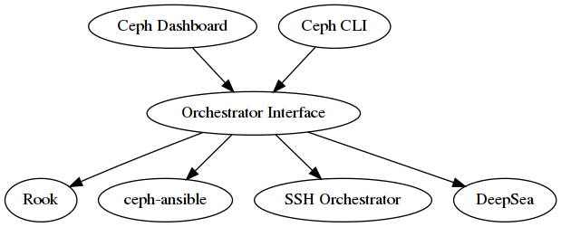

Ceph Nautilus introduces a new orchestrator interface that provides the ability to control external deployment tools like [ceph-ansible](http://docs.ceph.com/ceph-ansible/), [DeepSea](https://github.com/SUSE/DeepSea) or [Rook](https://rook.io).  The vision is to provide a bridge between administrators, Ceph, and external deployment systems. In order to accomplish that, the orchestrator interface enables the Ceph dashboard or the `ceph` command line tool to access to data provided by different deployment tools and thus will enable infrastructure management features in the Ceph dashboard. As a side effect, it will bring a unified installation experience across different deployment tools.

Have a look at this small demo showing the Rook orchestrator deploying Ceph services:

When enabled, the Dashboard already makes use of the orchestrator interface for managing iSCSI targets and NFS shares.

From an architectural point of view, the orchestrator interface is the central component in a sandwich between clients like the Dashboard and the command line interface, and orchestrator modules like the Rook mgr module.   For example, if a user calls to command line interface to add a new OSD to the cluster, the orchestrator module will instruct the external orchestrator to call ceph-volume on a given host.  Here is an architectural view of the orchestrator, showing how the different components interact with each other:

## Using the Orchestrator

In order to make use the orchestrator interface, the Ceph cluster needs to be deployed with a supported orchestrator. To start using the orchestrator, only a single mon and a mgr is needed.

The second step is to activate the backend orchestrator module:

> ceph mgr module enable <module>
> ceph orchestrator set backend <module>

where `module` is either `ansible`, `deepsea`, `rook` or `ssh`.

Afterwards, the orchestrator module itself needs to be properly configured. See below for the details for each individual module. Also please note that orchestrator modules may only implement a subset of the commands listed below and the implementation of the commands are orchestrator module dependent and will differ between implementations.

You can then check backend is properly configured with the status command, which shows the current orchestrator mode and high-level status.

> ceph orchestrator status

Another interesting command is `device ls` which print a list of discovered devices, grouped by node and optionally filtered to a particular node:

> ceph orchestrator device ls

Please have a look at the [official documentation](http://docs.ceph.com/docs/nautilus/mgr/orchestrator_cli/) for further examples of the orchestrator command line interface.

## Rook Orchestrator module

[Rook](https://rook.io/) is an open source cloud-native storage orchestrator for Kubernetes.  Rook follows the "operator" model, in which a Custom Resource Definition (CRD) object is defined in Kubernetes to describe a Ceph cluster and its desired state, and a rook operator daemon is running in a control loop that compares the current cluster state to desired state and takes steps to make them converge.  The main object describing Ceph's desired state is the CephCluster CRD, which (among other things) includes information about which devices should be consumed by OSDs, how many monitors should be running, and what version of Ceph should be used.  Rook defines several other CRDs to describe RBD pools, CephFS file systems, and so on.

The [rook orchestrator module](http://docs.ceph.com/docs/master/mgr/rook/) is the glue that runs in the ceph-mgr daemon and implements the Ceph orchestration API by making changes to the CephCluster (and related) objects in Kubernetes that describe desired cluster state.  Because a Rook cluster’s ceph-mgr daemon is running as a Kubernetes pod, the rook module can connect to the Kubernetes API without any explicit configuration.

For example, if a user requests that a new OSD be provisioned via the CLI, the orchestrator module will respond by adjusting Rook's CephCluster CRD object for this cluster to specify that the given device contain an OSD, and Rook will respond by making the appropriate calls to ceph-volume and starting a Kubernetes pod for the ceph-osd daemon.

> ceph orchestrator osd create ....

## SSH Orchestrator module

The [SSH orchestrator](http://docs.ceph.com/docs/master/mgr/ssh/) is an orchestrator module that does not rely on a separate orchestration/deployment system such as Rook or Ansible, but rather manages nodes in a cluster by establishing an SSH connection and issuing explicit management commands.

This module is intended to be the moral equivalent to the old ceph-deploy tool (and in fact it uses the same remoto library to execute code on remote machines over an SSH connection), but focusing on day-2 operations. The SSH orchestrator will be the standard way of installing a Ceph cluster without leveraging any deployment frameworks like Ansible.

The idea is to provide the manager daemon with access to an ssh configuration and key that is able to connect to all nodes in a cluster to perform any management operations, like creating an inventory of storage devices, deploying and replacing OSDs, or starting and stopping Ceph daemons.

In addition, the ssh orchestrator will deploy container images managed by systemd in order to allow independent upgrades of co-located services.

This orchestrator will also likely highlight a tool that encapsulates all necessary operations to manage the deployment of container image based services on the current host, including a command that bootstraps a minimal cluster running a MON and a MGR.

## Ansible Orchestrator module

The Ansible orchestrator module uses the [ansible runner services](https://github.com/ansible/ansible-runner-service) to execute Ansible playbooks in order to satisfy the different operations supported.  When an orchestration API is called, the ansible module will queue a task on the ansible runner service, which will then execute the ansible playbook to perform the work.

## DeepSea Orchestrator module

[DeepSea](https://github.com/SUSE/DeepSea) is a collection of [Salt](https://github.com/saltstack/salt) state files, runners and modules for deploying and managing Ceph.

This module connects to the Salt REST API in order to communicate to the Salt master. It then can query the state of the cluster or issue commands.

## Existing Integrations

There is already an integration between the dashboard and Rook. Please also have a look at a previous blog post about [configuring NFS with Rook by Jeff Layton](https://ceph.com/community/deploying-a-cephnfs-server-cluster-with-rook).

## Future

Right now, the orchestrator focuses on day 2 cluster operations after the initial installation. In the future releases, adding support for day 1 installation and setup operations is being planned.

Secondly, [`libstoragemgmt`](https://libstorage.github.io/libstoragemgmt-doc/) supports enabling the identification and fault LEDs of specified disks. There is work in progress to support these features in the orchestrator interfaces. (pointers?)

Finally, enhacements to the dashboard integration could include features like showing the physical inventory and also deploying services.
