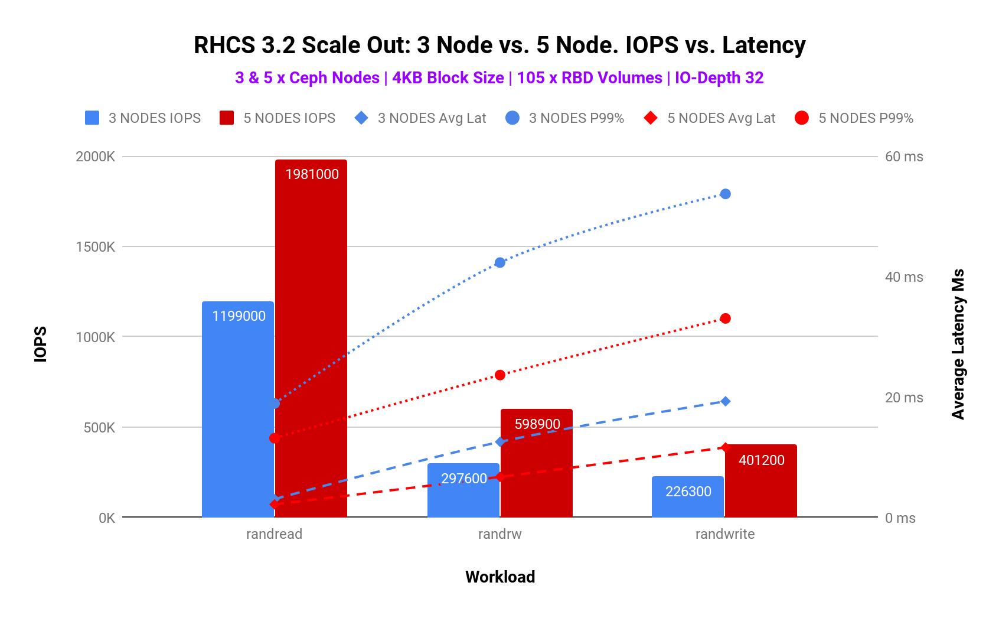
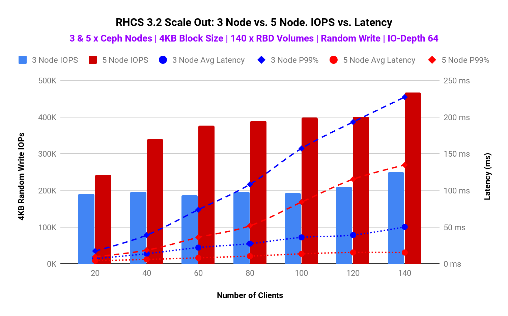
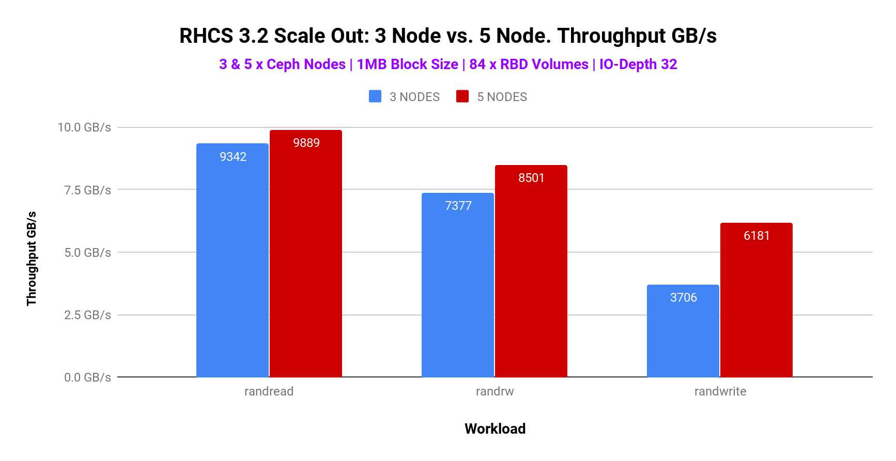

### Introduction

Welcome to the episode-3 of the performance blog series. In this blog, we will explain the performance increase we get when scaling-out the Ceph OSD node count of the RHCS cluster.  

A traditional storage scale-up architecture is built around two controllers connected to disk shelves. When the controllers reach 100% utilization, they create a performance bottleneck. Once this happens adding disk shelves does not provide a performance improvement, it only adds capacity. A scale-out architecture eliminates this architectural deficiency by providing capacity and performance by adding even a single node. When nodes are added, performance and capacity increase together. Red Hat Ceph Storage is a true scale-out solution with an almost linear increase in performance as you add storage nodes.  

The flexible scale-out features of Red Hat Ceph Storage eliminate many of the challenges associated with massive data growth, allowing linear improvement in performance and capacity with nondisruptive addition and removal of nodes within the same storage cluster. Scale-out architecture also allows resource transfer across workloads and automates time-consuming data migrations, eliminating the need for maintenance windows and the risk of data loss.  

### Executive Summary  

- For small block (4K) random read-write mix workload, adding 60% of additional hardware resources delivered up to 95% higher IOPS, 46% and 44%  lower average latency and tail latency respectively.
- Large block (1M) random read workload found to be limited by client network saturation, still showed 9.8 GB/s throughput.
- Large block (1M) random write workload showed 67% improved throughput compared to 3 node cluster until limited by media saturation.

### Scale-out Benchmark Methodology

Please refer blog episode-1 where we have detailed the standard benchmarking methodology. The only addition for scale-out testing is that we first ran the tests with an RHCS 3-node cluster and later we repeated the exact same tests with 5 node RHCS cluster. Each storage node had 7 media devices and we have configured 2 OSDs per drive. So adding 2 new nodes to the cluster gave us 14 physical devices i.e 28 Ceph OSDs, which is almost 40% extra resources/capacity.

## Part-1: Scale-Out Small Block Size (4KB) Performance  

### Key Takeaways  

- Adding 60% of additional hardware resources delivered up to 95% higher IOPS, 46% lower average latency and 44% of lower tail latency.

### Summary  

RHCS scalability testing involved adding 2 extra nodes in a 3 node Ceph cluster, making a total of 5 node cluster. Small block (4K) performance was recorded during both 3 and 5 node configuration across Random Read, Random Write and Random Read Write 70/30 mix workloads.  

As detailed in table-1 and graph-1, we have observed that scaling the cluster resources by 60% delivered up to 95% higher IOPS, 46% lower average latency and 44% of lower tail latency for random read-write 70/30 mix workload (IO depth 32), until performance got bottlenecked by media first and then CPU on OSD nodes. Adding nodes to an existing cluster not only improves the spatial capacity and performance (throughput/bandwidth) but also reduces average and tail latency for client workloads.

<table class="wp-block-table"><tbody><tr style="background-color: #77859b"><td><strong>5 Node Ceph Cluster performance compared to 3 Node Ceph Cluster</strong></td></tr><tr style="background-color: #96989b"><td><strong>Workload</strong></td><td><strong>IOPS</strong></td><td><strong>Average Latency</strong></td><td><strong>Tail Latency</strong></td></tr><tr><td style="background-color: #96989b"><strong>Random Read</strong></td><td style="background-color: #61ff00"><strong>55% Higher</strong></td><td style="background-color: #61ff00"><strong>29% Lower</strong></td><td style="background-color: #61ff00"><strong>30% Lower</strong></td></tr><tr><td style="background-color: #96989b"><strong>Random Read Write</strong></td><td style="background-color: #61ff00"><strong>95% Higher</strong></td><td style="background-color: #61ff00"><strong>46% Lower</strong></td><td style="background-color: #61ff00"><strong>44% Lower</strong></td></tr><tr><td style="background-color: #96989b"><strong>Random Write</strong></td><td style="background-color: #61ff00"><strong>77% Higher</strong></td><td style="background-color: #61ff00"><strong>40% Lower</strong></td><td style="background-color: #61ff00"><strong>38% Lower</strong></td></tr></tbody></table>

Based on these results, it's evident that as per your performance needs you can start with a smaller cluster which could later be scaled-out as your performance demands grow simply by adding additional storage nodes.  

Just for fun, we ran another iteration with IO Depth 64 and graphed the performance while increasing the client load with 3 and 5 node Ceph cluster. As per graph-2, RHCS with 5 nodes performed consistently higher compared to 3 node cluster, until limited by system resources with 140 clients. As such by adding 60% more hardware resources to the existing system, we observed over 100% improvements in IOPS, 60% improvement in average latency and 50% improvement in tail latency.

Graph 2 : 3 Node vs 5 Node. Client load test. IOPS vs. Latency

## Part-2: Scale-Out Large Block Size (1M) Performance  

### Key Takeaways  

- Random read performance found to be limited by client network saturation however still managed to show 9.8GB/s aggregated throughput.
- 5 node Ceph cluster with random write and read-write (70/30) mix workload showed 67% and 15% improvement compared to the 3 node cluster until limited by OSD node media saturation.

### Summary  

Similar to small block size testing for large block scalability testing we added 2 extra nodes in a 3 node Ceph cluster, making a total of 5 node cluster. Large block (1M) performance was recorded during both 3 and 5 node configuration across Random Read, Random Write and Random Read Write 70/30 mix workloads. As shown in graph-3, until limited by system resources, the maximum observed throughput for random read, random read-write (70/30) mix and random write large block (1M) workload was  9.8GB/s, 8.5GB/s and 6.1GB/s respectively.  

During the large block test, we have observed bottlenecks at different test patterns. Random read tests were bottlenecked by client network aggregated throughput, which is why we’re seeing  performance plateau at 9.8GB/s. If we added additional client nodes OR additional bisectional bandwidth between the clients and Ceph cluster, we expect that we could have scaled the aggregate random read throughput. The random read-write (70/30) mix and random write test were found to be bottlenecked by OSD media, resulting in increased service time, hence the performance didn’t beyond a certain point. Adding more OSD nodes could have scaled the performance for random read-write mix and random write test. Due to the above-mentioned reasons, the overall performance improvement after adding 2 additional nodes was not significant compared to what we have seen in the small block workload.  

Graph 3 : 3 Node vs 5 Node. Throughput GB/s

### Up Next  

Continuing the benchmarking blog series, in the next section, will explain the results captured during RHCS BlueStore advanced benchmarking testing, covering topics like “number of OSDs per NVMe”, “Intel Optane vs. no Optane for metadata ”, “replica 2 vs 3”, “ Bluestore cache 8GB vs 4GB” , “Bluestore compression comparison” and “CPU Core to NVMe ratio” etc.
