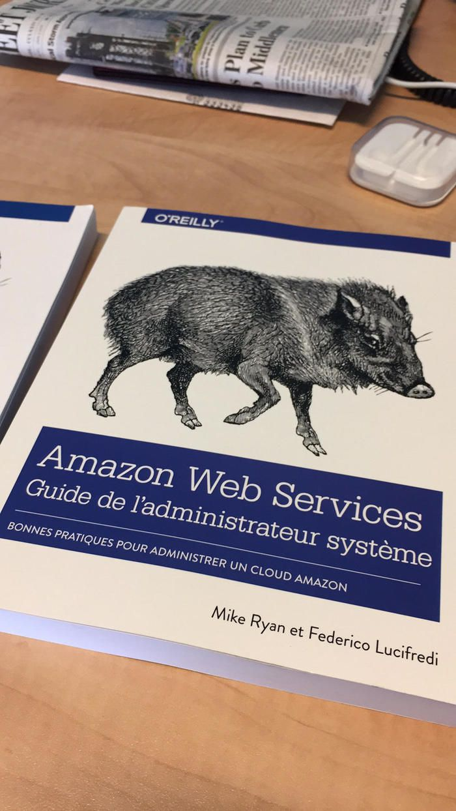

Amazon Web Services Guide de l’administrateur système — sounds familiar? It should! [AWS System Administration](https://bit.ly/peccary-book), better known as the [Peccary Book](https://www.oreilly.com/animals.csp?x-search=peccary&x-sort=animal) is now available in French.

Our thanks to monsieur Olivier Engler for his outstanding translation work, featuring both detailed feedback and a timely delivery.

Source: Federico Lucifredi ([Peccary Book Part Deux!](https://f2.svbtle.com/peccary-book-part-deux))
