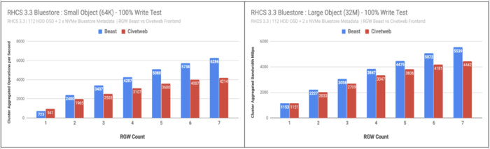
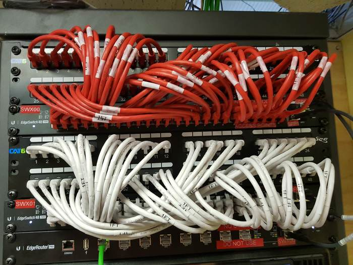
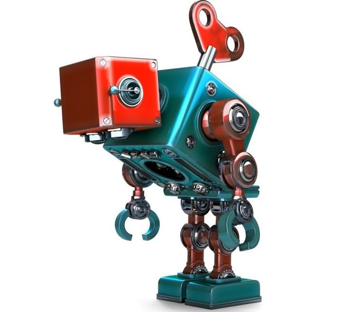

After an almost seven month team effort focusing on our next-generation Rook and Ceph Nautilus-based storage products, we have taken a little bit of time to refresh the releases currently in production. We are pleased to announce the availability of Red Hat Ceph Storage 3.3, our sixteenth RHCS release.

Red Hat Ceph Storage 3.3 delivers the latest Luminous upstream release and a number of important bug fixes to customers. Two noteworthy new features include an Object Gateway front-end capable of serving more requests with fewer resources, and standard support for 12 TB disk drives.

Least but not last, we are introducing an extended lifecycle option, bringing Ceph support options to a full five years. Read on!

# Rebase [#](#rebase_1)

Red Hat Ceph Storage 3.3 continues our record of delivering the latest bits of Ceph technology while ensuring we maintain the consistency of major-version compatibility. In this tradition, we are rebasing to Ceph 12.2.12 in addition to delivering targeted customer fixes (3.2 was based on 12.2.8).

# Z-Stream Updates [#](#zstream-updates_1)

The fixed-schedule z-stream releases published every six weeks have been extremely effective in enabling us to deliver fixes to customers faster, independent of our longer minor release cadence, while reducing the number of hotfixes fielded in production at any one time — we like that, it is good technical-debt hygiene. We ship only fixes in the Z-stream, and we do so on a fixed, predictable schedule that customers have openly expressed appreciation for. The fixed-schedule Z-stream process has now run more than a dozen cycles, and we have built a solid record for timely, high-quality delivery of fixes while reducing the need for hotfixes compared to our previous point release cadence — a most definite success along both the velocity and quality axes.

# Beast.Asio Web Server [#](#beastasio-web-server_1)

[Beast.Asio](https://github.com/boostorg/beast), a new front-end for the Object Store Gateway (RGW), is now in general availability as a fully supported option. This new RGW web server provides better IO performance and has lower resource requirements. These benefits are available immediately to customers opting-in to the change, without requiring any cluster hardware or architectural modification.

Beast is an embedded web server written entirely in C++, similar in scope to the web front-end currently embedded in RGW, which comes from the [Civetweb](https://github.com/civetweb/civetweb) project. Switching to Beast brings the promise of serving additional connections from RGW with a smaller memory footprint per thread.

We know from our experience with the Hammer releases five years heretofore that switching web front-ends can require some iteration — there is an embarrassment of options in HTTP protocol settings, and our users like to turn all the knobs. Moving Beast to fully supported status with 3.3 enables us to roll out this powerful feature selectively ahead of the multiple Nautilus-based product releases coming later this year. The default RGW front-end will remain Civetweb in the 3.x series, and we will switch the default to Beast only with Red Hat Ceph Storage 4.0. Beast is just one setting away, but honoring the principle of “least surprise”, no customer shall be surprised by an unexpected transition caused by a point release upgrade. This kind of approach is a keystone in our philosophy of maintaining compatibility by default within a major version’s updates.

# Support for 12 TB drives [#](#support-for-12-tb-drives_1)

There has never been any technology limit in Ceph itself requiring this maximum drive size: in the past we simply chose to enforce an architectural review whenever storage nodes with more than 36 drives or drives larger than 8TB are in use, as the impact of a single node failure could potentially generate a longer recovery time and reduce cluster performance for an extended period. In the time since a number of such architectural reviews have taken place, and most of them were successfully approved, as it is really just the worst-case combination of multiple factors, including too few storage nodes, an excessive number of drives per node, and the ever-growing size of the drives themselves that creates a potential cluster design concern, not any single item individually.

We are now clearing the way to the use of drives up to 12 TB for general use, while the 36-drive limit per storage node remains in effect. We believe that cost economics will make customers shy away from requesting ultra-dense configurations spanning too few nodes, but we also rely on our Community of Ceph storage experts to help guide the conversation: configurations that are drive-heavy in both size and number are typically only a concern in clusters of less than 10 nodes: due to Ceph’s many-to-many OSD replication strategy, recovery time of the third replica to a fully resilient configuration decreases dramatically as node count increases.

Our general guidance is to design clusters with more than 10 nodes if intending to exceed 36 drives per host, while the Storage team remains happy to review architecture designs with customers, as expectations vary significantly with different storage use cases.

As always, those of you with an insatiable thirst for detail should read the [release notes](https://access.redhat.com/documentation/en-us/red_hat_ceph_storage/3.3/html/release_notes/index) next—and feel free to ping me on [Twitter](https://twitter.com/0xf2) if you have any questions!

# Red Hat Ceph Storage: Extended Lifecycle [#](#red-hat-ceph-storage-extended-lifecycle_1)

Jewel-based Red Hat Ceph Storage 2.5 is reaching a well-deserved retirement after three years in production, but fear not: for those who prefer to maintain infrastructure on a fixed major version until hardware refresh brings an entirely new cluster (or even datacenter) around, we have a brand new Extended Lifecycle offering in the Red Hat ELS program. Under this commercial add-on offering, the [support lifecycle](https://access.redhat.com/articles/1372203) of major versions of RHCS will now exceed a full five years!

# Up Next [#](#up-next_1)

Yes, that’s right. Those crazy architects in the Red Hat Storage team stuffed one billion objects into a single Ceph cluster of 7 nodes. That’s 143 million objects per node, or nearly 9 million objects per HDD. If that isn’t interesting enough, a quarter of those objects were written into a single bucket. Next month, you can expect to learn about how index sharding lends to gargantuan buckets, and how bucket and cluster population impact system performance.

Comments? Discuss on [Hacker News](https://news.ycombinator.com/item?id=20783938).

Source: Federico Lucifredi ([Refreshingly Luminous](https://f2.svbtle.com/refreshingly-luminous))
